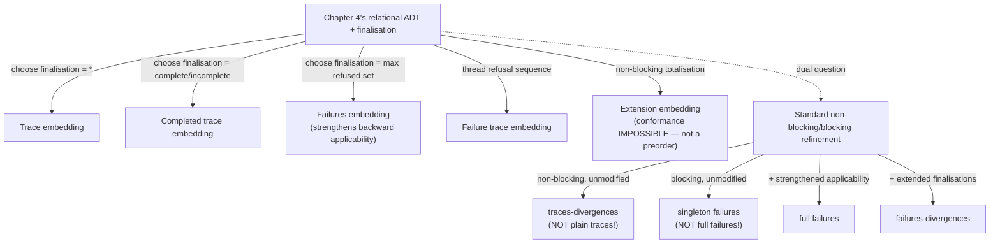

[[book-guidelines|↩ Back to guidelines]]

## Two theories, one book, and a question that's been deferred since Chapter 1

Since [[Refinement-as-Reduction-of-Non-Determinism-and-Behavioural-Consistency|Chapter 1]] the book has run two parallel refinement stories: **observation-set inclusion** for LTS/process algebras ([[Labelled-Transition-Systems-and-the-Spectrum-of-Observational-Refinement|Ch. 1]], [[Automata-and-Simulations|Ch. 2]], [[Process-Algebras-CSP-LOTOS-and-CCS|Ch. 6]]) and **relational data refinement** for state-based ADTs ([[State-Based-and-Relational-Models-of-Refinement|Ch. 4]], [[State-Based-Specification-Languages-Z-and-B|Ch. 7]], [[Event-B-and-Abstract-State-Machines-ASM|Ch. 8]]). Opening Part III, this chapter finally asks the question both tracks have been circling: **are these actually the same theory wearing two costumes, and if so, exactly how do they line up?**

The answer is a genuinely satisfying piece of engineering: **the finalisation is the single knob that controls everything.** Chapter 4's relational ADT already has a finalisation — the piece that decides what's externally observable. Every process-algebraic refinement relation from Chapter 1 turns out to be recoverable as data refinement, for *some specific choice* of finalisation, applied to a relational encoding of the same specification. **This is the master technique this entire chapter teaches, and it is directly the technique you need for reconciling multiple semantic layers of your own compiler** (e.g. an operational cost semantics vs. a pure functional denotational semantics vs. an abstract-interpretation domain) — instead of building separate soundness theories for each, build one relational core and vary only what the finalisation exposes.

## The recipe, stated once, applied six times

For each process-algebraic relation, the chapter follows an identical four-step methodology:

1. **Choose a finalisation** that captures exactly the observations that relation cares about — nothing more, nothing less.
2. **Define what "traces"/"failures"/etc. mean** for a relational ADT under that embedding (so the two vocabularies can be compared at all).
3. **Prove a correspondence theorem**: data refinement of the embedded ADTs $\iff$ the target process-algebraic relation.
4. **Extract simulation rules** for that specific embedding — since the general relational simulation machinery ([[State-Based-and-Relational-Models-of-Refinement|Chapter 4 §4.3–4.4]]) already exists, unwinding it through a *specific* finalisation choice gives you, for free, a sound (and, where provable, complete) proof technique for that process-algebraic relation.

### The mechanism made concrete: finalisation = "what you're allowed to look at"

Recall Chapter 4's simplest possible finalisation records only success/failure via a single value $G = \{*\}$ — too weak for anything but sequential correctness. The generalization: instead of $\{State \bullet \theta State \to *\}$, use $\{State \bullet \theta State \to E\}$ where $E$ ranges over *whatever richer observation you want to make possible* — a set of refusable operation names, a trace-so-far, a divergence flag. **Increasing the codomain of the finalisation is literally how you increase what a client can distinguish** — the exact process-algebra analogue of increasing precision in an abstract-interpretation domain by tracking more state at the abstraction boundary.

```rust
// The general pattern: a finalisation is a projection from full internal
// state to "whatever this refinement relation is allowed to observe."
// Trace refinement: project to nothing extra (success/failure only).
fn fin_trace<S>(_s: &S) -> () { () }

// Failures refinement: project to the maximal refused operation set.
fn fin_failures<S, OpId: Clone>(
    s: &S, ops: &[(OpId, fn(&S) -> bool)] // (id, precondition)
) -> Vec<OpId> {
    ops.iter().filter(|(_, pre)| !pre(s)).map(|(id, _)| id.clone()).collect()
}
```

## Trace refinement: the simplest embedding, made rigorous

$$G = \{*\}, \quad \mathsf{State} = State, \quad \mathsf{Fin} = State \times G$$

— every reachable state finalises to the single value $*$; unreachable ("impossible") traces simply have no relational image at all. **Theorem 9.1**: with this embedding, $A \sqsubseteq_{data} C \iff \mathcal{T}(C) \subseteq \mathcal{T}(A)$, proved by the cleanest possible argument — for any program $p$, its relational meaning $p_A$ is either $\{(*,*)\}$ (if $p$ is a valid trace) or $\emptyset$ (if not), so inclusion of relations *is* inclusion of trace sets, definitionally. The corresponding simulation rules (Definition 9.3) are exactly ordinary forward/backward simulation from Chapter 4, but **with the applicability condition dropped entirely** — because the trace embedding doesn't care whether an operation is enabled in a *matching* way, only whether the *sequence* of names is jointly achievable.

## Completed trace refinement: augmenting the global state with "done"

Add a distinguished marker $\checkmark$ to the global state: $G = \{*, \checkmark\}$, with the finalisation routing to $\checkmark$ exactly when no operation's precondition holds (a genuinely completed/deadlocked state). **Theorem 9.2** proves the correspondence, and the resulting simulation rules (Definition 9.6) add exactly one new condition on top of the trace rules: for a forward simulation, *whenever the concrete state is complete (all $COp_i$ preconditions false), the corresponding abstract state must also be complete.* This is a clean illustration of the recipe's compositionality — you don't rebuild the theory from scratch, you take the trace embedding and layer one additional finalisation distinction on top, and the simulation rules inherit the extra condition mechanically.

## Failures refinement: the pattern that will matter most for your project

$$G = \mathcal{P}\,I, \quad \mathsf{Fin} = \{State; E : \mathcal{P}\,I \mid (\forall i \in E \bullet \neg\,\mathit{pre}\,Op_i) \bullet \theta State \to E\}$$

— finalise to the *maximal refused operation set* at the point of observation. **Theorem 9.3** proves the correspondence with failures preorder. The simulation-rule derivation here is worth reading closely, because it's the chapter's sharpest technical point, previewed for deeper treatment in [[Relating-Data-Refinement-and-Failures-Divergences-Refinement|Chapter 10]]:

$$\textbf{Backward simulation finalisation condition: } \forall\, CState \bullet \exists\, AState \bullet T \wedge \mathit{Ref}(CState) \subseteq \mathit{Ref}(AState)$$

using $\mathit{Ref}(State) = \{i \in I \mid \neg\,\mathit{pre}\,Op_i\}$ (the maximal refused set). **The book flags explicitly: this backward simulation rule is *strictly stronger* than the ordinary applicability condition** from Chapter 4/7's standard theory. Observing refusals doesn't just add a *new* condition alongside the old ones — it *strengthens* an existing one. This is a genuinely important lesson about compositional proof-obligation design: **adding a new observable to your semantics is not always "add one more independent side-condition"; sometimes it retroactively tightens a condition you already had**, and you cannot assume otherwise without checking. If your refinement-type elaborator's proof-obligation generator is built by literally *composing* independently-derived rule sets (trace-level rules + refusal-level rules + ...), this chapter is a documented counterexample to the assumption that composition is always additive.

## Failure trace refinement: threading an observation sequence through state

Generalizing failures to sample refusals *between every operation*, not just at the end, requires literally the same "sequence threaded through global and local state" trick [[State-Based-Specification-Languages-Z-and-B|Chapter 7]] used for inputs/outputs: $G = seq\,\mathcal{P}\,I$, with each operation appending its refusal-set observation to the sequence, and finalisation exposing the accumulated sequence. **Theorem 9.4** proves correspondence with the failure-trace preorder. Worth noting for the correctness/finalisation interaction: the raw derivation of the correctness condition looks more complex (an extra $Fcond$ side-condition survives the unwinding), but **once the finalisation condition is accounted for, it collapses back to the ordinary correctness condition** — a small but instructive example of how a seemingly-more-complex proof obligation can simplify once you use everything you know, rather than deriving each condition in isolation.

## Extension embeds; conformance provably cannot

$$\textbf{Extension embedding: } G = \mathcal{P}\,I \cup \{\bot\}, \quad Op = Op_B \cup \{(x,y) \mid x \notin \mathrm{dom}\,Op_B\}$$

— extension uses the ordinary non-blocking totalisation ([[State-Based-and-Relational-Models-of-Refinement|Chapter 4 §4.4.1.1]]) directly, with **Theorem 9.5** proving the correspondence with the extension preorder. But the chapter states a genuinely important negative result plainly: **conformance cannot be recovered this way, at all, ever — not "we haven't found the right finalisation yet," but a structural impossibility.** The reason is a one-line consequence of everything established earlier: **data refinement is provably a preorder** ([[State-Based-and-Relational-Models-of-Refinement|Theorem 4.1]]); **conformance is provably not a preorder** ([[Process-Algebras-CSP-LOTOS-and-CCS|Chapter 6's]] Example 6.22, non-transitivity). No finalisation, however cleverly chosen, can make a preorder-valued theorem produce a non-preorder relation — *the target relation's own algebraic properties bound what's embeddable, before you even attempt a construction.* **This is a useful discipline to carry into your own design work**: before spending effort trying to encode some desired comparison relation as an instance of your general refinement/subtyping framework, check its basic algebraic properties (reflexivity, transitivity) first — if they don't match your framework's guaranteed properties, no amount of clever encoding will make the embedding exist, and you'll save yourself the failed derivation.

## The dual question: what does data refinement mean, in process-algebra terms?

Having embedded process-algebra relations *into* the relational world, the chapter asks the reverse: **fix the standard relational simulation theory (non-blocking or blocking, unmodified) — which process-algebra refinement relation does it turn out to correspond to?** The book's summary table is the payoff, and its headline finding should recalibrate your intuitions if you were assuming a "natural" pairing:

| Relational refinement | Process model |
|---|---|
| Non-blocking data refinement | **traces-divergences** |
| Blocking data refinement (deterministic outputs) | **singleton failures** |
| Blocking data refinement (general) | singleton failures of `process` *and* `inputProcess` |
| Blocking + strengthened applicability, no I/O | **failures** |
| Blocking + extended finalisations | **failures-divergences** |
| Non-blocking + extended finalisations, no I/O | **failures-divergences** |

**Neither plain non-blocking nor plain blocking data refinement corresponds to trace, failures, or failures-divergences refinement — the "obviously matching" pairing you'd guess (blocking ↔ failures, since both are refusal-flavored; non-blocking ↔ traces-divergences, since both are catastrophic-error-flavored) turns out to need extra machinery in both directions to actually land.** Non-blocking data refinement, unmodified, lands on **traces-divergences** — failures-divergences with the refusal component stripped out — not plain trace refinement, because the catastrophic non-blocking error model *already* encodes something divergence-shaped. Blocking data refinement, unmodified, lands on the much more obscure **singleton failures** — a failures variant restricted to refusal sets of size at most one — not full failures, because a single relational check per operation can only certify "this one action is/isn't refusable," not arbitrary refusal-set combinations. Landing on *full* failures needs the *strengthened* applicability condition flagged above as a Chapter 10 preview.

This mismatch is proved via an explicit **translation of ADTs into CSP processes**: `process(A)` for the non-blocking case (calling an operation outside its domain leads to the CSP `div` — divergent — process, correctly modeling "anything might happen, including never stopping"); `processb(A)` for the blocking case (calling outside domain simply offers no further events — correctly modeling refusal, not divergence); with `inputProcessb` needed as a companion translation when outputs are non-deterministic, because output values need their own separate observation channel to make the correspondence exact. **This is worth remembering precisely because it's counterintuitive**: the "obvious" theoretical framework you reach for by default (non-blocking totalisation, say) does not automatically give you the "obvious" observational semantics (plain traces) you might assume it corresponds to — you have to actually do the derivation, and the book's own worked example shows the answer can genuinely surprise even careful readers.

## Automata and IO automata: input/output asymmetry as a first-class refinement concern

The plain automata embedding ($G = \{*\}$, states/transitions mapped directly) turns out to be **exactly the trace embedding again** — automata simulations (Chapter 2) and trace simulations here coincide, confirming Chapter 2's machinery was never a separate theory, just trace refinement specialized to a slightly different presentation.

**IO automata** are more interesting: actions are partitioned into **input** $L_I$ (environment-controlled, *always enabled* — a system may never refuse an input) and **output** $L_U$ (system-controlled, never blockable by the environment). This input-total requirement is a strong, meaningful commitment — **it's the formal analogue of a total function/API that must accept any legally-typed call, never throwing a "not accepted" error at the type level** — the system can choose to ignore an input (self-loop, no observable effect) but can never structurally reject it. This maps directly onto how you'd want to specify a well-formed message-handling interface in your compiler's runtime: every input message type must have *some* defined handling, even if that handling is a no-op, precisely to prevent partial pattern-match-style failures at the interface boundary.

Refinement here (**Definition 9.14**) uses **weakly quiescent traces** ($\delta$-traces) — traces after which *no output* is immediately possible (the system has gone quiet, waiting on the environment):

$$A \sqsubseteq_{iot} C \iff traces(C) \subseteq traces(A) \wedge \delta\text{-}traces(C) \subseteq \delta\text{-}traces(A)$$

This is a genuinely different flavor of refinement from anything seen before — it's not about refusals in general, but specifically about **when the system stops talking and waits**, which matters enormously for reasoning about protocol liveness (a client blocked waiting for a response the server will never send is a real, observable, protocol-breaking bug that plain trace inclusion is blind to). The chapter also introduces a **demonic semantics for under-specified inputs**: where a partitioned LTS doesn't specify behaviour for some input in some state, the demonic reading adds a transition to "arbitrary subsequent behaviour" — a direct, general-purpose instance of exactly the catastrophic-error algebra from [[Perspicuity-Error-Behaviour-and-Divergence|Chapter 5]] and [[State-Based-and-Relational-Models-of-Refinement|Chapter 4's]] non-blocking totalisation, applied here specifically to *missing input handling*. **This is a concrete, reusable pattern for how your compiler's contract checker should treat an under-specified input case: demonically, i.e. assume the worst (arbitrary subsequent behaviour), which is the conservative, soundness-preserving choice — never assume a convenient default.**

## Divergence, revisited one more time, with the general recipe

Section 9.6 closes the chapter by applying the exact same embed-via-finalisation recipe to divergence itself: a distinguished value $\omega$ (playing the same catastrophic-zero role as $\bot$ did for blocking/non-blocking totalisation) gets added to the state space, with $\mathit{Init}$/$Op$ generalized to route through $\tau^*$ (arbitrary internal evolution — [[Perspicuity-Error-Behaviour-and-Divergence|Chapter 5's]] $\tau$-data type embedding, reused verbatim) and propagate $\omega$-once-diverged forward into all subsequent behaviour (the catastrophic reading, once again). **This is the third or fourth time in this book you've now seen the identical shape** — a distinguished "everything from here on is unconstrained" state, threaded through by generalizing the transition relation to route through it — and recognizing it as one recurring construction, not three unrelated tricks, is exactly the kind of pattern-compression that will make your own soundness proofs faster to write and easier to trust.

## Where this leads



This chapter's central technique — vary only the finalisation, reuse the general relational simulation machinery unchanged — is the direct blueprint for how your own refinement-type compiler should support *multiple* observational granularities of the same underlying contract (a "trace-level" contract checker, a "failure/refusal-aware" one for concurrent code, a liveness-aware one for protocol code) without maintaining three separate proof theories. [[Relating-Data-Refinement-and-Failures-Divergences-Refinement|Chapter 10]] goes deep on exactly the failures-embedding subtlety flagged here (the strengthened backward-simulation applicability condition, and what happens once inputs/outputs enter the picture properly); [[Process-Data-Types-A-General-Model-of-Concurrent-Refinement|Chapter 11]] then unifies everything — blocking, non-blocking, divergence, refusals — into one general relational model that subsumes every embedding this chapter constructed by hand.
