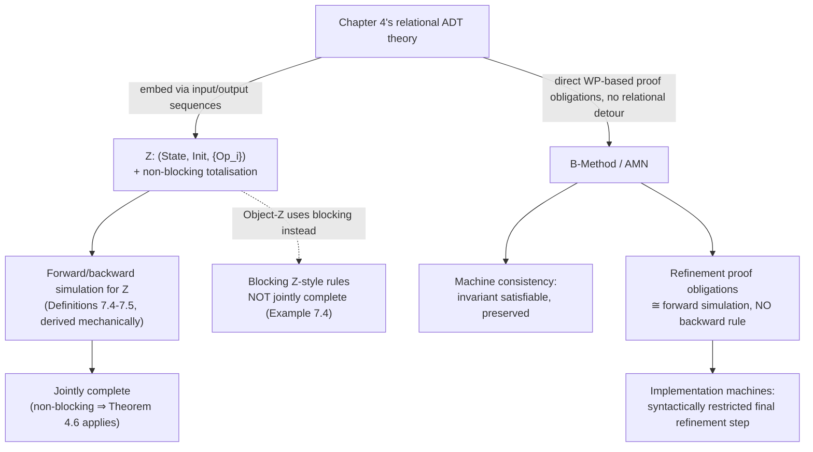

[[book-guidelines|↩ Back to guidelines]]

## The chapter that connects directly to your compiler

Where [[Process-Algebras-CSP-LOTOS-and-CCS|Chapter 6]] instantiated [[Labelled-Transition-Systems-and-the-Spectrum-of-Observational-Refinement|Chapters 1–2's]] LTS/automata theory in real process-algebra languages, this chapter instantiates [[State-Based-and-Relational-Models-of-Refinement|Chapter 4's]] relational ADT theory in **Z** and **B** — two state-based specification languages that describe systems in terms of variables, invariants, preconditions, and postconditions. **This is the closest thing in the whole book to a formal treatment of exactly what a refinement-type checker for a Hoare-triple/contract language needs to do.** Z shows you the relational-semantics-first approach (derive proof obligations from Chapter 4's simulation theory); B shows you the direct approach (state proof obligations via weakest preconditions, without an intervening relational semantics at all) — and the chapter proves these two approaches *agree*.

## Z: schemas as the specification unit

A Z specification structures state and operations using **schemas** — labelled products of a declaration plus a constraining predicate:

```
Deallocate
ΔState
pid? : PID
freq? : FREQ
pid? ∈ clients
clients' = clients
freq' = freq ∪ {freq?}
```

Reading this: `ΔState` pulls in *both* the before-state `State` and the primed after-state `State'`; `pid?` is an input, `freq?` another input (the `?`/`!` suffix is literally part of the identifier — `freq!` and `freq` are unrelated names); everything below the line is a predicate constraining before-state, after-state, inputs, and outputs jointly. This predicate-over-(before, after, in, out) shape is *exactly* a relation — which is precisely how the chapter is about to interpret it.

### The precondition, derived rather than declared

Unlike Hoare-triple notations where `requires` is written explicitly, **Z derives the precondition of an operation as a theorem about the schema**:

$$\mathit{pre}\,Op = \exists\, State';\, Outs \bullet Op$$

— the precondition is the projection of the operation relation onto its before-state and inputs: "for which before-states and inputs does *some* legal after-state and output exist at all?" This is worth internalizing precisely because it inverts the usual direction your compiler will work in: rather than the specifier stating a precondition and the *effect* being checked against it, Z computes the precondition *from* the effect relation, existentially quantifying away everything downstream. If your refinement-type elaborator ever needs to synthesize a "weakest legal calling context" for an under-specified relational contract (rather than requiring the user to write one explicitly), this is the formal recipe: existentially quantify the postcondition-and-outputs away.

```rust
// Z's precondition-as-projection, made concrete: given a relation
// (before, input) -> Option<(after, output)>, the precondition is
// exactly "this relation is defined here" — the domain of the relation.
fn z_precondition<S: Clone, I: Clone, O>(
    op: impl Fn(&S, &I) -> Option<(S, O)>,
    before: &S, input: &I,
) -> bool {
    op(before, input).is_some()
}
```

## Embedding Z into Chapter 4's relational theory

The chapter's central methodological move: **a Z specification $(State, Init, \{Op_i\}_{i \in I})$ is not yet a relational ADT** in [[State-Based-and-Relational-Models-of-Refinement|Chapter 4's]] sense — it's missing a finalisation, and it has no explicit place for inputs/outputs in a relation-only world. The fix embeds inputs and outputs as **sequences threaded through global state**:

$$G = seq\,Input \times seq\,Output, \qquad \mathsf{State} = seq\,Input \times seq\,Output \times State$$

$\mathsf{Init}$ copies the input sequence from global to local state and picks a Z-legal initial state; each $\mathsf{Op}_i$ consumes the head of the input sequence, feeds it to the Z operation, and appends the produced output; $\mathsf{Fin}$ discards the (now-empty) input sequence and exposes the accumulated outputs. **This is a specific, deliberate choice about what counts as observable** — the book flags explicitly that other finalisations (e.g., exposing intermediate states too) would give a genuinely different, defensible refinement notion. This is exactly the kind of design decision your compiler needs to make explicitly for its own I/O model: does a contract's observable interface include only final return values, or also intermediate side-effecting calls (println-style output, file writes)? Z's choice here — only the accumulated output sequence is visible, everything about *when* it was produced or what intermediate states looked like is not — is a strict trace-hiding choice you should recognize as a design decision, not an inevitability.

### Non-blocking, by explicit choice, not default

[[State-Based-and-Relational-Models-of-Refinement|Chapter 4]] built *two* totalisation theories for partial operations — non-blocking (contract) and blocking (behavioural). **Z commits to non-blocking**, explicitly, with the chapter naming the alternative (Object-Z uses blocking) precisely to remind you this is a language design decision, not a mathematical necessity. Unwinding Definition 4.12's abstract simulation conditions through Z's embedding produces the language-native forward simulation rule:

$$\textbf{Forward simulation } R: \begin{cases}
\forall\, CState' \bullet CInit \Rightarrow \exists\, AState' \bullet AInit \wedge R \\
\forall\, AState;\, CState;\, {?}AOp_i \bullet \mathit{pre}\,AOp_i \wedge R \Rightarrow \mathit{pre}\,COp_i & \textbf{(applicability)}\\
\forall\, AState;\, CState;\, CState';\, {?}AOp_i;\, {!}AOp_i \bullet \mathit{pre}\,AOp_i \wedge R \wedge COp_i \Rightarrow \exists\, AState' \bullet R \wedge AOp_i & \textbf{(correctness)}
\end{cases}$$

**Applicability**: whenever $R$ relates the states and the *abstract* operation's precondition holds, the *concrete* operation's precondition must also hold — you may not narrow when the implementation is willing to run. **Correctness**: whenever the concrete operation actually fires (within the abstract precondition), its effect must be traceable to *some* legal abstract effect via $R$. This is a direct, readable specialization of Chapter 4's relational simulation to a language you could actually type into a specification tool — worth comparing line-by-line against Definition 4.12 to see exactly how the abstract algebra cashes out into first-order predicate obligations.

## Two genuinely different things "refinement" lets you do in Z

The book distills refinement in Z to a slogan, then immediately shows it covers two distinct kinds of change:

**Reduction of non-determinism via weakened precondition / strengthened postcondition.** Example 7.1: the abstract `Deallocate` requires `pid? ∈ clients`; the refined version *weakens* this to "always applicable," specifying that out-of-precondition calls simply leave the state unchanged. This is refinement's canonical move — **you may always accept a call the abstract spec would have rejected, as long as you do something the abstract spec's under-specification already permitted.** For a Hoare-triple contract language, this is exactly "a subtype's method may accept a *weaker* precondition than its supertype's" — the classical Liskov substitution rule, derived here as a theorem about relational inclusion rather than asserted as a design axiom.

**Changing the state representation entirely, while keeping the retrieve relation non-trivial.** Example 7.2 replaces an abstract `freq : P FREQ` (a set) with a concrete `cfreq : iseq FREQ` (a duplicate-free sequence) — a genuinely different data structure — connected by a non-functional retrieve relation $R$: `ran cfreq = freq`. **The internal representation is never part of the finalisation, so it's free to change arbitrarily as long as external behaviour is preserved.** This is precisely the "representation independence" property a sound module system or an abstract-interpretation domain needs: two different internal representations of the same abstraction must be provably interchangeable *because neither is externally observable*, which is exactly what the retrieve relation certifies.

Example 7.3 is worth flagging on its own: a retrieve relation need not be a function even for a "simple-looking" refinement — mapping a set $s$ to a bound $n = \max(s) + 1$ (or $0$ if empty) genuinely loses information (many different sets $s$ map to the same $n$), and the simulation conditions still go through cleanly. **Retrieve relations losing information in the abstract-to-concrete direction is completely normal** — this is the everyday shape of a sound-but-imprecise abstraction relation in an abstract interpreter: many concrete states collapse onto one abstract element, and soundness only requires the *forward* simulation direction to hold, not any kind of bijection.

## Completeness in Z: the blocking/non-blocking choice has teeth

This is the chapter's sharpest payoff, and it's a direct, worked confirmation of [[State-Based-and-Relational-Models-of-Refinement|Chapter 4's]] counterintuitive result. Because [[State-Based-and-Relational-Models-of-Refinement|Theorem 4.6]] proved joint completeness holds for the **non-blocking** interpretation and fails for **blocking**, and Z uses non-blocking by design:

**Z's forward-and-backward simulation rules are jointly complete** — every genuine Z refinement can be verified by *some* combination of forward and backward simulation. **Object-Z's blocking-interpretation rules are not** — Example 7.4 gives a concrete two-line counterexample (a single decrement operation `Dec`, differing only in which initial values of `x` are legal) where $A$ and $C$ are mutual refinements under the blocking relational embedding, yet **the refinement cannot be proved using the non-blocking-style simulation rules at all.**

**This is not a hypothetical worry for your project — it's a concrete design decision with a concrete consequence you now have documented proof of.** If your refinement-type system's contract semantics is guard/blocking-flavored (an operation genuinely unavailable outside its precondition — closer to Event-B's style, [[Event-B-and-Abstract-State-Machines-ASM|next topic]]) rather than contract/non-blocking-flavored (undefined behaviour outside the precondition, caller's problem — closer to a typical `unsafe fn` contract or a C-style precondition), **you cannot just reuse the simpler non-blocking simulation rule set and expect it to remain complete.** You need either the full blocking-specific rule derivation from [[State-Based-and-Relational-Models-of-Refinement|Chapter 4 §4.4.2]] (accepting the completeness gap it comes with) or a different completeness argument altogether.

## B: proof obligations as the primary definition, not simulations

The B-Method's Abstract Machine Notation (AMN) looks closer to pseudocode than to Z's mathematical schemas — variables, an explicit `INVARIANT`, `PRE`/`THEN` operation blocks, imperative-style assignment (`x := E`, or non-deterministic `x :∈ S`). But its refinement theory takes a genuinely different *methodological* starting point:

> **B never derives a relational semantics and then extracts simulation rules from it. It states the proof obligations directly, using weakest preconditions.**

$$[S]P = \text{"the largest set of pre-states from which statement } S \text{ is guaranteed to establish postcondition } P\text{"}$$

with the familiar Dijkstra-style calculational rules: $[x := E]P = P[E/x]$, distributivity through $\wedge$/$\vee$/$\Rightarrow$, and structural rules for `IF`/`CHOICE`. **This is, verbatim, the weakest-precondition predicate transformer your compiler's Hoare-triple checker needs to implement** — B is a real, historically deployed (Paris Metro Line 14, Ariane 5) industrial language built entirely around exactly this calculus.

```lean
-- B's weakest-precondition transformer, as you'd actually implement it
-- for a small imperative IR — this is the direct ancestor of a VC
-- generator's core recursive function.
inductive Stmt where
  | assign (x : String) (e : Expr)
  | choice (s1 s2 : Stmt)
  | seq (s1 s2 : Stmt)
  | ite (cond : Expr) (thenS elseS : Stmt)

def wp : Stmt → (State → Prop) → (State → Prop)
  | .assign x e, post => fun s => post (s.update x (e.eval s))
  | .choice s1 s2, post => fun s => wp s1 post s ∧ wp s2 post s   -- CHOICE: BOTH branches must establish P
  | .seq s1 s2, post => wp s1 (wp s2 post)
  | .ite c s1 s2, post => fun s => (c.eval s → wp s1 post s) ∧ (¬c.eval s → wp s2 post s)
```

Machine consistency itself is stated as weakest-precondition obligations: an invariant must be satisfiable ($C \Rightarrow \exists v.\, I$), initialisation must establish it ($C \Rightarrow [Init]\,I$), and every operation must preserve it under its precondition ($C \wedge I \wedge P \Rightarrow [S]\,I$) — this triple *is* the standard inductive-invariant proof obligation your abstract-interpretation pass needs to discharge for any loop or recursive structure: base case (initialisation establishes the invariant), inductive step (each transition preserves it).

### B refinement's proof obligations, and why they read as forward simulation

$$\begin{cases}
[InitC]\, \neg[Init]\, \neg J & \textbf{(initialisation)} \\
I \wedge J \wedge P \Rightarrow PC & \textbf{(precondition weakening)} \\
I \wedge J \wedge P \Rightarrow [SC[outc/outputs]]\, \neg[S]\, \neg J \wedge (outc = outputs) & \textbf{(correctness, incl. output matching)}
\end{cases}$$

where $J$ is the **linking invariant** — B's name for exactly Z's/Chapter 4's retrieve relation. The book states plainly that these obligations "correspond to" Z's forward simulation conditions — and the double-negation pattern $\neg[SC]\neg J$ is a standard weakest-precondition idiom for expressing "$SC$'s possible outcomes are consistent with $J$" (the *weakest liberal precondition* of *not* $J$, negated, says "it's not guaranteed that $J$ fails" — i.e., some/every reachable outcome satisfies $J$, depending on how demonic choice is resolved — worth working through carefully if you haven't seen `wlp`/`wp` duality before, since it's exactly the mechanism `dual`-style predicate transformers use to express "may" versus "must" reachability, directly relevant to your CEGAR/abstract-interpretation over-approximation-versus-under-approximation distinction).

**The chapter is explicit about a real methodological gap**: *B has no backward-simulation-style proof obligation at all.* Only forward-simulation-shaped rules exist in the B methodology — meaning **B's refinement checking, as a methodology, is not complete** in the way Z's paired forward+backward theory is (per [[State-Based-and-Relational-Models-of-Refinement|Theorem 4.6]]). Some genuine refinements that a Z-style backward simulation could certify have no B-native proof. This is a real, load-bearing engineering trade-off your own tool has to make consciously: **do you provide both simulation directions (more complete, more proof machinery to implement and for users to reason about) or forward-only (simpler methodology, some correct refinements become unprovable in your system)?** B, a serious industrial tool used on safety-critical rail and aerospace systems, made the forward-only trade-off deliberately — a useful existence proof that incompleteness in a bounded, well-understood direction is a legitimate, shippable engineering choice, not automatically disqualifying.

### Implementation machines: where refinement bottoms out

B adds one more structural idea worth noting: a **refinement chain terminates in exactly one implementation machine** — the step where refinement stops being "another design decision" and becomes "this is code." Implementation machines are syntactically restricted (no internal state of their own beyond what's imported, no non-deterministic choice, no parallel composition) precisely so that the last refinement step is *mechanically* compilable, not just semantically valid. This is the direct analogue of the point in your own elaborator's pipeline where a refinement-typed specification stops being "a contract with remaining under-specification" and becomes "fully elaborated, executable code" — and B's insight that this final step needs its *own*, more restrictive syntactic category (rather than just "a refinement machine that happens to be fully deterministic") is a genuinely useful design pattern: don't rely on a semantic check alone to gate code generation: bake the "this is compilable" property into the grammar of the final stage.

## Where this leads



This chapter is the most direct blueprint in the entire book for your Hoare-triple/refinement-type compiler: Z demonstrates the *derive proof obligations from a general relational theory* strategy (systematic, complete when paired with backward simulation, but requires you to first build [[State-Based-and-Relational-Models-of-Refinement|Chapter 4's]] full relational machinery); B demonstrates the *state weakest-precondition obligations directly* strategy (lighter-weight, immediately actionable as a VC generator, but forward-only and thus incomplete by construction). [[Event-B-and-Abstract-State-Machines-ASM|Chapter 8]] pushes B's direct-proof-obligation style further still — dropping the requirement that abstract and concrete machines even share the same operation alphabet, which is exactly the flexibility you'll want when a single abstract contract in your language can be refined into multiple concrete operations (event splitting) or several abstract steps collapse into one concrete step.
