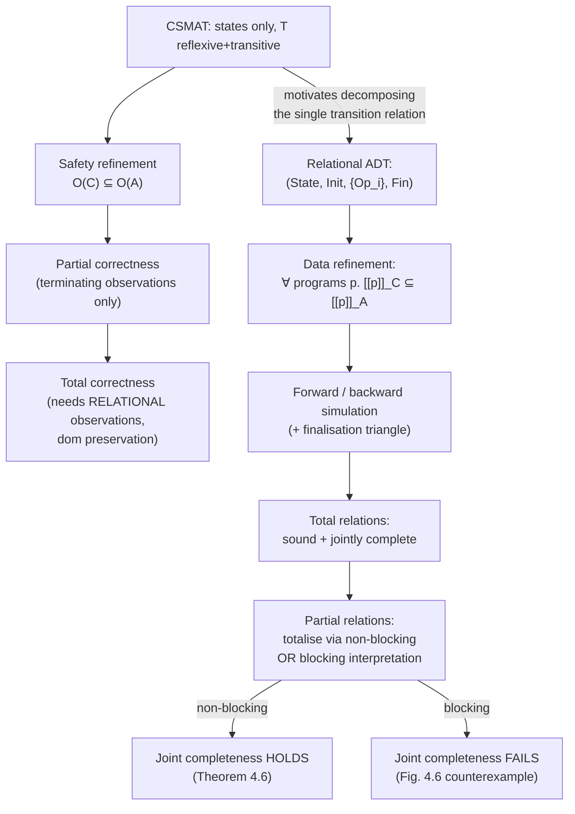

[[book-guidelines|↩ Back to guidelines]]

## A change of observable: states instead of events

Every relation in Chapters 1–2 ([[Refinement-as-Reduction-of-Non-Determinism-and-Behavioural-Consistency|topic 1]], [[Labelled-Transition-Systems-and-the-Spectrum-of-Observational-Refinement|topic 2]], [[Automata-and-Simulations|topic 3]]) observed *behaviour*: sequences of events, refusals, ready sets. This chapter pair switches to the complementary formal-methods tradition — observing *state*, where behaviour is only implicit ("something must have happened if the state changed"). This is the tradition underlying Lamport's TLA, action systems, and — most importantly for the rest of this book — sequential program refinement in the style of Hoare and He's Unifying Theories of Programming. If your target compiler will reason about pre/post-state contracts (Hoare triples), **this is the chapter whose vocabulary you'll actually be implementing.**

## CSMAT: the simplest possible state-observing model

A **Concrete State Machine with Anonymous Transitions (CSMAT)** is $(State, Init, T)$ where $T \subseteq State \times State$ is required to be **reflexive and transitive** — i.e. $T = T^*$ already. Reflexivity is called **stuttering**: "doing nothing" is always a valid transition, because we can't observe individual steps, only before/after outcomes across a whole (possibly empty) computation.

```rust
// A CSMAT: only reachability between states is observable, never the
// individual steps or their count. T is closed under reflexivity+transitivity.
struct Csmat<S: Eq + Clone> {
    init: Vec<S>,
    related: fn(&S, &S) -> bool, // T, assumed already reflexive+transitive
}

fn observations<S: Eq + Clone>(m: &Csmat<S>, universe: &[S]) -> Vec<S> {
    universe.iter()
        .filter(|s| m.init.iter().any(|i| (m.related)(i, s)))
        .cloned()
        .collect()
}
```

The most basic observation set is just **reachability**: $\mathcal{O}(M) = \{s \mid \exists\, init \in Init.\, (init, s) \in T\}$, giving **safety refinement** $A \sqsubseteq_S C \iff \mathcal{O}(C) \subseteq \mathcal{O}(A)$ — the CSMAT analogue of trace refinement, and it inherits the exact same degenerate failure mode: a CSMAT with empty $Init$ or empty $T$ refines *everything*, the same way `stop` trace-refined everything in Chapter 1.

### Termination made implicit, and why that's harder than it sounds

Rather than naming accepting states explicitly (as in a finite automaton), the book defines termination *implicitly*, in a way that echoes deadlock from Chapter 1 but isn't quite the same thing — because stuttering means "further computation" is *always* nominally possible:

$$term(M) = \{s \mid \forall t.\, (s,t) \in T \Rightarrow s = t\}$$

A state is terminating when the *only* transitions out of it are stutters — nothing genuinely new can happen. This gives **partial correctness refinement**: $A \sqsubseteq_{PC} C \iff \mathcal{O}_t(C) \subseteq \mathcal{O}_t(A)$, where $\mathcal{O}_t(M) = \mathcal{O}(M) \cap term(M)$. This is precisely the traditional definition you already know from Hoare logic — *if the computation terminates, it delivers a correct result; if it doesn't terminate, no constraint is imposed.*

What breaks without care here: the book carefully derives disjointness facts — $term(M)$ and $mustnotterm(M)$ (states from which every transition leads only to non-terminating states) are disjoint, and $mustnotterm(M) \subseteq mayfailtoterm(M)$ — precisely because getting these boundary cases wrong is exactly the kind of off-by-one error that corrupts a soundness proof for a program logic. **This is worth internalizing directly for your Hoare-triple contract checker**: partial correctness ("if it terminates, `ensures` holds") is a strictly weaker guarantee than total correctness, and the book is about to show you that upgrading from one to the other is *not* a trivial addition of "and it terminates" — it needs a real change of perspective.

### Total correctness needs relational observations, not just reachability

The naive fix — "concrete non-termination only allowed where abstract non-termination was already allowed" — either trivializes to plain equality or needs *quantification over which initial state you started from*. This forces a strictly richer observation: **relational observations**, pairing the initial state with the final one, rather than just recording final states in isolation:

$$\mathcal{R}(M) = (Init \times State) \cap T, \qquad \mathcal{R}_T(M) = (Init \times term(M)) \cap T$$

With this richer observation, **total correctness refinement** becomes expressible cleanly:

$$A \sqsubseteq_{R} C \iff \mathcal{R}_T(C) \subseteq \mathcal{R}_T(A) \;\wedge\; \mathrm{dom}\,\mathcal{R}_T(A) \subseteq \mathrm{dom}\,\mathcal{R}_T(C)$$

Read the second conjunct carefully — it's the crux of "total correctness" as a concept: **the concrete system must terminate from every initial state the abstract system was guaranteed to terminate from.** This is exactly the difference between `ensures P(result)` (partial — a promise conditional on termination) and `ensures P(result) with guaranteed termination` (total — an unconditional promise), and it's precisely the distinction your compiler's Hoare-triple checker needs to track separately, because proving the first is (relatively) tractable via invariant/inductive-assertion methods, while the second additionally needs a **ranking function or well-founded measure** — the exact same safety-vs-liveness asymmetry flagged in [[Labelled-Transition-Systems-and-the-Spectrum-of-Observational-Refinement|the LTS chapter]].

### State abstraction: total functions, because states must be identifiable

To compare CSMATs on *different* state spaces, the book uses a **total function** $f: S \to S'$ (deliberately the "simple simulation" shape from Chapter 2, not a general relation — because states are directly observable here, an ambiguous many-valued correspondence wouldn't make sense). Applying $f$ pointwise to $Init$ and $T$ can *break transitivity*: if two distinct concrete states $s_1, s_2$ collapse to the same abstract image, a path ending at $s_1$ can spuriously "join up" with one starting at $s_2$. It also introduces a new named phenomenon worth remembering: a **perspicuous step** — a genuine concrete state change whose abstraction is a no-op (the before- and after-states map to the same abstract state). This anticipates [[Perspicuity-Error-Behaviour-and-Divergence|Chapter 5's]] main subject and is the state-based cousin of an internal $\tau$-action from Chapter 2's automata.

## Motivating the jump to relational ADTs

Chapter 3 ends by cataloguing exactly what's wrong with a single-relation, single-computation CSMAT for realistic software: it models one linear computation with inputs only at initialization (fine for Turing machines, wrong for reactive systems/objects with an interface); it has no compositional structure (a single monolithic $T$, nothing to decompose); and once you *do* need to talk about individual named operations rather than "the" transition relation, you need labels — which is exactly the move Chapter 4 makes.

## The relational ADT: state, operations, initialisation, finalisation

$$D = (State, Init, \{Op_i\}_{i \in I}, Fin)$$

- $State$: local state, invisible to a client.
- $Init$: a total relation from a global state $G$ *into* $State$ — how a client's view becomes internal state.
- $\{Op_i\}_{i \in I}$: indexed relations *on* $State$ — the named operations a client can invoke.
- $Fin$: a total relation from $State$ *back out* to $G$ — how internal state becomes an observation.

A **program** is a finite sequence over the index set $I$; its meaning is a relational composition through $Init$, the chosen operations, and $Fin$:

$$\llbracket p \rrbracket_D = Init \fatsemi Op_{p_1} \fatsemi \cdots \fatsemi Op_{p_n} \fatsemi Fin$$

```rust
// A relational ADT — directly the shape of a module/trait with an
// internal representation, a constructor, methods, and an "observe" projection.
use std::collections::HashSet;
type Rel<A, B> = HashSet<(A, B)>;

struct Adt<G: Clone + Eq + std::hash::Hash, S: Clone + Eq + std::hash::Hash> {
    init: Rel<G, S>,
    ops: Vec<Rel<S, S>>,   // indexed by operation id
    fin: Rel<S, G>,
}

fn relational_compose<A: Clone + Eq + std::hash::Hash, B: Clone + Eq + std::hash::Hash, C: Clone + Eq + std::hash::Hash>(
    r1: &Rel<A, B>, r2: &Rel<B, C>
) -> Rel<A, C> {
    r1.iter().flat_map(|(a, b)| {
        r2.iter().filter(move |(b2, _)| b2 == b).map(move |(_, c)| (a.clone(), c.clone()))
    }).collect()
}

fn run_program<G: Clone + Eq + std::hash::Hash, S: Clone + Eq + std::hash::Hash>(
    adt: &Adt<G, S>, program: &[usize]
) -> Rel<G, G> {
    let mut acc: Rel<G, S> = adt.init.clone();
    for &op_idx in program {
        acc = relational_compose(&acc, &adt.ops[op_idx]);
    }
    relational_compose(&acc, &adt.fin)
}
```

**Data refinement**: $A \sqsubseteq_{data} C$ iff $\llbracket p \rrbracket_C \subseteq \llbracket p \rrbracket_A$ for *every* program $p$ — this is refinement's master definition specialized to this relational domain, and, as expected, it is a **preorder** (Theorem 4.1) by the same free set-inclusion argument seen back in topic 1. Note precisely what "reduction of non-determinism" means concretely here: if you think of a relation on $State$ as mapping each before-state to a *set* of legal after-states, a non-functional operation (one before-state, multiple after-states) is under-specified, and data refinement lets an implementation shrink that set — this is the exact relational cousin of the "trait with multiple valid `impl`s" picture from topic 1's `NextPrimeSpec` example, now made state-based and compositional across whole *programs*, not just single calls.

## Simulations for data refinement: the finalisation triangle is new

The simulation diagrams gain a **third condition** relative to Chapter 2's automata simulations: alongside initialisation and step-preservation, there's now a **finalisation** obligation, because observations only become visible through $Fin$.

$$\textbf{Forward simulation } R \subseteq AState \times CState:\quad
\begin{cases}
CInit \subseteq AInit \fatsemi R \\
R \fatsemi CFin \subseteq AFin \\
\forall i.\; R \fatsemi COp_i \subseteq AOp_i \fatsemi R
\end{cases}$$

$$\textbf{Backward simulation } T \subseteq CState \times AState:\quad
\begin{cases}
CInit \fatsemi T \subseteq AInit \\
CFin \subseteq T \fatsemi AFin \\
\forall i.\; COp_i \fatsemi T \subseteq T \fatsemi AOp_i
\end{cases}$$

These are literally the automata forward/backward simulation conditions from [[Automata-and-Simulations|the previous topic]], with one extra "triangle" per direction for the finalisation, exactly dual to the initialisation triangle. **Theorem 4.2** shows the two collapse to the same notion whenever the simulation is total and functional ($T$ total+functional $\iff$ $T^{-1}$ is a valid forward simulation) — a clean sanity check that the asymmetric definitions genuinely agree in the deterministic special case. Soundness (Theorem 4.3, by induction on programs — base case: the empty program; inductive step: sub-diagrams glue along matching edges) and the same **jointly-complete-but-individually-incomplete** story from Chapter 2 both carry over verbatim (Theorem 4.4): any data refinement can be witnessed by *one backward simulation to a canonical intermediate ADT (via a powerset or trace-based construction), followed by one forward simulation to the concrete type.*

## Totalisation: the theory only works for total relations — so what do you do with partial ones?

Real specification languages (Z, in particular — Chapter 7) allow **partial operations**: relations not defined everywhere. The relational refinement theory above was built for *total* relations, so the book needs an honest answer to "what does it mean to apply an operation outside its domain?" — and gives **two genuinely different, both defensible, answers.** This distinction is one of the sharpest and most reusable ideas in the whole book for a contract-based verifier.

### Non-blocking (contract) interpretation

*Partiality means under-specification: outside the domain, anything may happen, including non-termination.* Extend $State$ with a fresh symbol $\bot$; totalise by sending every out-of-domain input to *any* element of $State_\bot$ (arbitrary, unconstrained):

$$\widehat{Op} = Op \cup \{(x,y) \mid x \notin \mathrm{dom}\,Op,\, y \in State_\bot\}$$

This is exactly how a Hoare-triple `requires`/`ensures` contract behaves: **outside the precondition, the contract says nothing at all — the caller violated the contract, so the callee owes nothing, including not owing termination.** This is the natural reading for your compiler's function contracts.

### Blocking (behavioural) interpretation

*Partiality means the operation is simply impossible outside its domain — nothing happens, it's refused.* Totalise instead by sending every out-of-domain input specifically to $\bot$ and nowhere else:

$$\widehat{Op} = Op \cup \{(x, \bot) \mid x \notin \mathrm{dom}\,Op\}$$

This is the **refusal-set** reading from Chapter 1's failures refinement made explicit: an operation outside its guard is *refused* by the system, observably — precisely how Object-Z and Event-B ([[Event-B-and-Abstract-State-Machines-ASM|later topic]]) treat a false guard: the transition simply cannot fire, and that non-firing is itself a fact an environment can detect (this is the callout box on "explicit guards": a guard plus an effect relation, where a feasibility condition ensures the guard exactly matches the effect's domain — otherwise you get "magic," an operation whose guard promises availability but whose effect can't deliver an outcome).

**What breaks if you conflate these two:** in the blocking reading, when $R$ is the identity, the derived simulation conditions force $\mathrm{dom}\,AOp = \mathrm{dom}\,COp$ *exactly* — refinement may **not widen a precondition**, which matches the classical subtyping/Liskov intuition (a subtype's method precondition must be no stronger than the supertype's) but is a genuinely different rule from the non-blocking reading, where widening a precondition is completely fine (you're just resolving under-specification, which is always a legal refinement move). **If your verifier hard-codes one interpretation while a user's specification language assumes the other, contract-widening that should be legal will be rejected, or contract-widening that should be illegal will be silently accepted.** This is a design decision your elaborator needs to make explicit and consistent, not implicit.

### Simplified simulation rules (after eliminating references to ⊥)

Working out the totalised simulation conditions and eliminating all mention of $\bot$ yields, in the **forward, non-blocking** case, four named obligations — *initialisation*, *finalisation*, **applicability**, and **correctness**:

$$CInit \subseteq AInit \fatsemi R, \quad R \fatsemi CFin \subseteq AFin$$
$$\mathrm{ran}(\mathrm{dom}\,AOp_i \lhd R) \subseteq \mathrm{dom}\,COp_i \quad(\textbf{applicability})$$
$$(\mathrm{dom}\,AOp_i \lhd R) \fatsemi COp_i \subseteq AOp_i \fatsemi R \quad(\textbf{correctness, non-blocking})$$

with the **blocking** interpretation strengthening correctness to the un-restricted $R \fatsemi COp_i \subseteq AOp_i \fatsemi R$ (no domain restriction — because in the blocking reading, going outside the domain is itself an observable refusal that must still be simulated correctly). **Applicability** is the formal statement of "you may not narrow where the operation is defined relative to what the abstract spec promised" — for every abstract before-state reachable via $R$, the concrete operation must also be defined there. This is precisely the proof obligation a refinement-type checker needs when checking that a concrete implementation's precondition is no *stronger* than its abstract contract's.

## The surprising failure: joint completeness breaks under the blocking interpretation

Having built parallel simulation theories for both totalisation strategies, the book asks the obvious next question — do both inherit joint completeness from the total-relation theory (Theorem 4.4)? **The non-blocking answer is yes** (Theorem 4.6). **The blocking answer is no.**

The reason is structurally illuminating: the original joint-completeness proof builds an intermediate ADT $B$ living in the space of *totalised* relations. For non-blocking totalisation, any such $B$ can always be shown to itself be *the totalisation of some underlying partial ADT* — so the construction stays inside the space the theorem needs it to. For **blocking** totalisation, this is not guaranteed: the intermediate $B$ constructed by the standard proof can land *outside* the image of the blocking-totalisation embedding — a total ADT that simply doesn't correspond to totalising any partial one. The book gives an explicit two-state counterexample (Fig. 4.6) where $C$ genuinely refines $A$, but **no blocking forward simulation exists from $A$ to $C$, and no blocking backward simulation exists from $C$ to $A$** — not even a *chain* of blocking simulations suffices (a fact the book states is provable but non-trivial).

**This is a genuinely important cautionary result for you to carry forward.** It says: *a sound proof technique, restricted to a semantically meaningful subclass of the general theory, can silently lose completeness — even when the unrestricted theory was complete.* This is exactly the risk profile of restricting a general unification algorithm to a tractable pattern fragment (Miller patterns), or restricting a general Horn-clause solver to a decidable CHC fragment for CEGAR-style invariant synthesis: **the restriction can be sound (it never certifies something false) while silently becoming incomplete (it now fails to certify some things that are actually true)**, and you only find out by constructing exactly this kind of adversarial two-state counterexample, not by trusting that "restriction of a complete theory is still complete." When you design the proof-obligation discharge strategy for your refinement-type elaborator's blocking-style (guard-based) contracts, budget explicitly for this gap rather than assuming forward+backward simulation alone will always suffice.

## Where this leads



This chapter pair is the direct semantic ancestor of the specification-language chapters to come: **Chapter 7 (Z)** builds its simulation rules *exactly* by choosing one of the two totalisation strategies developed here (non-blocking for standard Z refinement); **Chapter 8 (Event-B)** commits to the blocking/guard interpretation and its feasibility side-conditions; and **Chapters 9–11**, on relating process-algebraic and relational refinement, are largely about reconciling the "richer observation, richer relation" spectrum of Chapters 1–2 with the "totalise a partial relation, pick blocking or non-blocking" machinery built here — the same failures/refusals vocabulary reappearing as a *design choice about how partiality is interpreted*, not just as a semantic primitive. For your own compiler: **the non-blocking/blocking distinction is the formal backbone of the difference between "undefined behaviour on precondition violation" (non-blocking — the caller's problem, contract silent) and "the operation is a guarded transition, unavailable outside its guard" (blocking — the operation is refused, and that refusal is itself part of the semantics)** — and you will need to pick one, explicitly, for every operation your refinement-type system exposes, because — as this chapter just proved — the two choices are not interchangeable at the level of what your simulation-based soundness proofs can actually certify.
