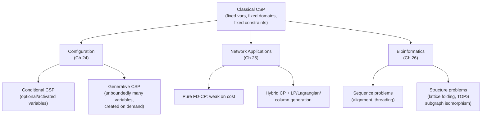

# Applications: Configuration, Networks, and Bioinformatics

[[book-guidelines|↩ Back to guidelines]]

## Why this cluster of chapters exists

Everything earlier in the handbook — arc consistency, backtracking, [[Global-Constraints|global constraints]], tractability results — is stated over a *fixed* constraint network: a known set of variables, known domains, known constraints, all present before you start solving. These three chapters exist because that assumption quietly breaks in real applications, in three different ways:

- **Configuration** breaks it because the *set of variables itself* is part of the answer. You don't know how many hard disks a computer will have until you've decided it needs more storage than one disk provides. The CSP has to grow while you solve it.
- **Networks** break it because the network is often *fixed and huge*, but the objective is cost, not just feasibility — and finite-domain propagation, which is superb at pruning infeasible combinations, has almost nothing to say about "is this the cheapest way to route these demands." You need reasoning imported from Operations Research.
- **Bioinformatics** doesn't break the fixed-CSP assumption so much as it hands CP problems that were never phrased as CSPs — sequences, molecular structures, graphs of secondary-structure elements — and asks what happens when you *do* phrase them that way: what do variables, domains, and propagation even mean for a protein conformation?

The throughline is that "Constraint Programming" is not one fixed technology being pointed at different domains — it's a *modeling discipline* that has to be re-derived, sometimes substantially, for each shape of real-world problem. That's worth understanding in detail if you're eventually building a CSP kernel of your own: these chapters are essentially a catalogue of "here is where the naive CSP formalism needed to bend, and here is exactly how it bent."



---

## Part 1 — Configuration (Chapter 24, U. Junker)

### What breaks without it

Take the simplest possible CSP encoding of "configure a computer": one variable per attribute (CPU, RAM, disk count...), each with a domain, tied together by compatibility constraints. This works fine as long as *every* computer has the same attributes. It falls apart the moment the number of attributes depends on choices you haven't made yet — a laptop has a battery-capacity attribute, a desktop doesn't; a computer with zero external hard disks has no disk-attribute list to speak of, but one with three disks needs three sets of them. You can't declare `disk_1_capacity`, `disk_2_capacity`, ... up front, because you don't know how many disks there will be until propagation and search have already run for a while.

The book's own home-movie-studio example carries this thread through the whole chapter: a video camera is a *primitive component* (fulfills "filming" directly, no subcomponents); a video-editing system is *composite*, decomposed into a computer, editing software, a capture card. **Product catalogs** already exist as ERP database tables — the constraint model has to be layered *on top of* an existing, externally-defined product structure, not invented from scratch. That structural pressure — reusing an existing taxonomy/partonomy instead of hand-rolling variables — is exactly why this chapter needed a much richer vocabulary than "variables and domains."

### The knowledge layer, precisely

The book insists on separating **configuration knowledge** (what the space of legal systems looks like) from the **constraint model** used to search it — the same knowledge compiles into different models depending on how much structure the problem has.

**Catalog** (Def. 24.1): a set $T$ of technical types, a set $L$ of concrete (leaf) types, a set $A$ of attributes. Each technical type $t$ has $attrs(t) \subseteq A$ and $subtypes(t) \subseteq L$; each attribute has a domain $D(a,t')$ per leaf type $t'$. This is literally a *catalog constraint*: knowing $type(x)=t'$ pins down (or restricts) every attribute's domain.

**Structural model** (Def. 24.2): a taxonomy of functional/technical types plus *ports* — partonomic ports (own their contents: "has-part") and connection ports ("is-connected-to", non-owning). Each port has a destination type and min/max cardinality. A port is *optional* if min $=0$, max $=1$; *multi-valued* if max $>1$.

Three flavors of configuration constraint, over `parts`/`ports`/`props` views of a component:

$$
\exists (v_1,\dots,v_n)\in R : a_1(x)=v_1 \wedge \dots \wedge a_n(x)=v_n \tag{compatibility, 24.4}
$$
$$
\forall (v_1,v_2)\in R : a_1(x)=v_1 \Rightarrow a_2(x)=v_2 \tag{requirement, 24.5}
$$
$$
\sum_{o \in \text{Producers}} \text{produced}(o) \;\ge\; \sum_{o \in \text{Consumers}} \text{consumed}(o) \tag{resource, 24.8}
$$

Resource constraints generalize past sum — min, max, average, and set-union aggregation are all used (set-union is how a connection-port's *domain* gets built up from the parts that could fill it).

### Five models for five shapes of problem

This is the chapter's real payoff: the *same* configuration knowledge compiles into progressively richer constraint formalisms as the structural knowledge gets less bounded. Each is strictly more expressive (and more expensive) than the last.

| Model | When it applies | Variables |
|---|---|---|
| **Boolean** (§24.3.1) | Option selection: fixed set of yes/no options | $f_i, t_j \in \{0,1\}$ |
| **Cardinality** (§24.3.2) | Shopping lists: "how many of type $t$" | $\#f_i, \#t_j \in \mathbb{Z}^{\ge 0}$ |
| **Flat CSP** (§24.3.3) | Fixed components, but attributes need real domains | $a_j(o_i)$, $type(o_i)$ |
| **Conditional CSP** (§24.3.4–24.3.5) | Taxonomic/optional structure, but *bounded* depth | activation-gated $a_j(o_i)$ |
| **Generative CSP** (§24.3.6) | Genuinely unbounded parts (racks, disks, ...) | dynamically created $p(o,i)$ |

The Boolean model is worth pausing on because it's the cleanest illustration of how a taxonomy compiles to logic. A requirement "function $f$ needs option $t$" becomes an implication $f \Rightarrow t$ (24.9); a type's direct subtypes $t_1,\dots,t_n$ become a disjunction $t \equiv t_1 \vee \dots \vee t_n$ (24.10) — this is a taxonomy, encoded as a totality constraint over its immediate children, nothing more exotic than propositional logic. The cardinality model does the *same* compilation but replaces booleans with counts and disjunction with a sum: $\#t = \#t_1 + \dots + \#t_n$ (24.13).

**Conditional CSPs** are where things stop being "just" a CSP. A variable $a_j(o_i)$ for an inherited attribute only *exists in the solution* if the component has actually specialized to a subtype that has that attribute — captured by a non-optional boolean "activation" variable:

$$
type(o_i) \in leaves(t) \;\Leftrightarrow\; active\!:\!a_j(o_i) \tag{24.20}
$$

Compatibility and requirement constraints get guarded by this activation flag (24.21–24.22); resource sums only range over currently-active producers/consumers (24.23). Rather than materializing every possible attribute up front and hoping propagation figures out which ones are meaningless, the *type* variable's domain reduction is what triggers new variables and constraints to be added to the live problem.

**Generative CSPs** go one step further: even the *number* of instances of a port is unknown, potentially unbounded. The trick is a *generative constraint* that only creates part $k$ once something has forced the cardinality past $k-1$:

$$
\forall i \in \{1,2,3,\dots\} : \#p(o) \ge i \;\Rightarrow\; p(o,i) \in instances(t) \tag{24.28}
$$

This "lazily materialize the $i$-th thing only once you know you need it" pattern recurs constantly whenever a domain is conceptually infinite but any single solution touches only finitely much of it (compare it to how a type checker only elaborates the metavariables actually mentioned in a term, not every metavariable that *could* exist).

#### Rust: modeling activation as a typestate, not a flag

The book represents activation as a guarded boolean. In Rust you'd more naturally *make the guard structural* — an `Option`/`enum` whose variant carries exactly the fields that are "activated" for that variant, so the compiler enforces what the constraint (24.20)–(24.22) enforces at solve time:

```rust
enum StorageDevice {
    Unresolved,                       // type(o) not yet specialized
    HardDisk { capacity_gb: u32 },    // active: capacity iff specialized to HardDisk
    DvdWriter { writable_formats: Vec<Format> },
    VideoRecorder,                    // no technical attributes of interest here
}

// A partonomic port with an as-yet-unknown cardinality — the Generative CSP case.
// New elements are pushed lazily, mirroring constraint (24.28): p(o,i) only
// materializes once #p(o) >= i has been forced by resource/requirement constraints.
struct PartonomicPort<T> {
    min: u32,
    max: Option<u32>,   // None = genuinely open domain
    parts: Vec<T>,      // grows on demand during search, never pre-allocated to `max`
}
```

The activation constraint (24.20) stops being a runtime-checked implication and becomes "you cannot read `capacity_gb` unless you've matched the `HardDisk` variant" — a compile-time guarantee for exactly the invariant the chapter spends a page formalizing at runtime. This is the general lesson: *conditional* structure is best represented as *sum types*, not as flat variables plus guards, whenever the host language lets you.

#### Lean: type specialization *is* constraint-driven refinement

This is the chapter's most direct hit on your elaborator work. Read (24.20) again: the type variable $type(o_i)$ getting its domain reduced to $leaves(t)$ is what *activates* new obligations (new variables, new constraints) that then have to be discharged. That is structurally identical to what happens when Lean's elaborator resolves a metavariable to a concrete constructor: instantiating `?m := HardDisk` doesn't just fill in one hole, it *generates new goals* — the fields `HardDisk` requires — that weren't live obligations before the metavariable was resolved. Typeclass/instance resolution is the sharpest analogy: choosing an instance for `?inst : Monad ?m` both commits `?m` *and* opens new subgoals for the instance's own constraints, exactly as specializing `type(o)` in a Conditional CSP both commits the type variable and activates its inherited attribute-variables. The chapter's "top-down refinement" discipline (§24.4.3: functional attributes → type specialization → technical attributes → cardinalities → connections) is a fixed *elaboration order*, no different in kind from bidirectional typing's discipline about which judgments must be discharged before which others become well-formed.

### Explanations: QuickXplain, or minimal-conflict extraction by divide-and-conquer

Section 24.4.2 is the chapter's algorithmic centerpiece, and it's the piece most worth internalizing if you're building a CSP kernel meant to *explain* failures, not just report them.

Setup: a set of requirements $F(x:t)$ (a conjunction), a configuration model $K(x:t)$. If $F \cup K$ is unsatisfiable, you want a **minimal conflict** — a $\subseteq$-minimal subset of $F$ that's still inconsistent with $K$ (Def. 24.12). Naive approaches based on truth-maintenance systems tend to return conflicts that are *far* from minimal, especially once resource constraints (sums) are in the mix, because TMS-style dependency tracking records "what I actually used," not "the smallest thing that would still have failed."

**QuickXplain** finds a genuinely minimal conflict without testing every subset, via divide-and-conquer:

1. Split $F$ into $C_1, C_2$.
2. Test $K \cup C_1$ *alone* (with $C_2$ entirely removed). If that's already inconsistent, the whole conflict lives inside $C_1$ — recurse into just $C_1$, done; $C_2$ contributed nothing.
3. Otherwise, at least one element of $C_2$ is load-bearing for the failure. Recurse into $C_2$ (with $C_1$ held as fixed background — active, but not up for removal) to find $C_2$'s minimal contribution.
4. Add that contribution to the background, then recurse into $C_1$ the same way.
5. Union the two minimal pieces.

The recursion halves the problem at each unsuccessful "can I drop this half entirely" test, which is why it beats testing every subset — it's the same divide-and-conquer shape as binary search, applied to *set minimization under a monotone unsat oracle* rather than to a sorted array.

```rust
/// Find a ⊆-minimal subset of `candidates` that, together with `background`
/// (always kept active but never removable), is inconsistent under `is_consistent`.
/// `is_consistent` is any oracle: SAT/SMT check, CSP propagation, etc. — QuickXplain
/// doesn't care what's underneath, only that failure is monotone in the constraint set.
fn quick_xplain<C: Clone>(
    background: &[C],
    candidates: &[C],
    is_consistent: &impl Fn(&[C]) -> bool,
) -> Vec<C> {
    if candidates.is_empty() || !is_consistent(background) {
        return vec![]; // background alone already fails: nothing here needed
    }
    if candidates.len() == 1 {
        return candidates.to_vec();
    }
    let mid = candidates.len() / 2;
    let (c1, c2) = (&candidates[..mid], &candidates[mid..]);

    let bg_plus_c1: Vec<C> = background.iter().chain(c1).cloned().collect();
    let delta2 = quick_xplain(&bg_plus_c1, c2, is_consistent);

    let bg_plus_delta2: Vec<C> = background.iter().chain(&delta2).cloned().collect();
    let delta1 = quick_xplain(&bg_plus_delta2, c1, is_consistent);

    delta1.into_iter().chain(delta2).collect()
}
```

**This is a direct hit on the "CSP kernel for counterexamples" thread in your project.** A minimal conflict *is* a minimal counterexample explanation — the smallest set of requirements (read: the smallest set of clauses of a failing verification condition) that's jointly unsatisfiable. That's precisely the shape of artifact a CEGAR loop wants back from a failed check: not "unsat," but "here is the minimal fragment of your assumptions that's actually to blame," which is a refinement-loop-ready object in the same way a Craig interpolant or an unsat core is. QuickXplain is, in effect, a black-box, oracle-agnostic MUS (minimal unsatisfiable subset) extractor — it doesn't need to know anything about what "consistency" means underneath, only that it's monotone, which makes it directly reusable on top of an SMT/CSP oracle for refinement-type inference failures.

### The uncomfortable epistemics of search here

Section 24.4.3 states something that cuts against a core CP intuition: *"configurators need to make wrong decisions in order to discover that they are wrong."* Standard CP doctrine says eliminate inconsistent choices *before* branching, via propagation. But you cannot propagate the incompatibility of computer-type $t$ with a requirement until you've actually specialized to $t$ and thereby *generated* the variables and constraints $t$ inherits — the conflict is invisible until the wrong branch has been taken far enough to inherit its consequences. The resolution isn't "propagate harder"; it's to keep the discovered conflict as useful information for the rest of the search (rather than discarding it once you backtrack) — an early, chapter-scale example of what learning-based SAT/SMT solvers formalized much more thoroughly later: a failed branch that isn't wasted work if you extract and reuse what it taught you.

### Where configuration leads

Interactive configuration (§24.4.1) reframes "propagate a constraint" as "maintain global consistency of the *functional* variable domains" — every remaining value in a domain must be *supported* by an actual full solution, which is strictly stronger than arc consistency and coincides with it only when the constraint network happens to be acyclic (Freuder's 1982 backtrack-free-search result, cited directly). Preference programming (§24.4.4) then layers multi-criteria optimization and Pareto-diversity on top of an already-dynamic search space. None of this chapter treats "find a solution" as the whole problem — search, explanation, and preference are three legs of the same interactive loop.

---

## Part 2 — Networks (Chapter 25, H. Simonis)

### The physical-network baseline: why CP works cleanly here at small scale

Electricity and water/oil networks get comparatively little space in the chapter, but they set up the contrast the rest of the chapter needs. Electrical power distribution networks are governed by three laws with genuinely simple constraint encodings: Ohm's law $V = I\Omega$, Kirchhoff's current law (flow conservation at nodes), Kirchhoff's voltage law (loop sum $=0$). The actual *configuration* task — which switches are open, forming a spanning forest with no cycles, respecting station/line capacity, minimizing resistive loss — was solved operationally by the **PlaNets** system (rational + finite-domain CHIP solvers) for the Spanish utility Enher, and later reattempted with **BDD**-based reconfiguration for faster reaction times (seconds matter after a fault). Water/oil networks add real friction: storage (reservoirs, water towers — genuinely stateful, not just flow-conserving), unknown leak rates (flow conservation *doesn't hold exactly*), and non-linear mixing when different water/crude sources combine, handled in the **CLOCWISe** system by piecewise-linear approximation of the non-linear mixing law.

### Data networks: three ways to encode "a path", and why the encoding matters

The chapter's real weight is in data (telecom/IP) networks, and the recurring technical decision is: *how do you represent "demand $d$ takes some path through the graph"* as decision variables? Three answers, each with different propagation properties:

**Link-based.** One $\{0,1\}$ variable $X_{de}$ per (demand, edge) pair: is edge $e$ on demand $d$'s path? The path itself is implicit, enforced by a flow-conservation constraint per node:

$$
\forall d,n:\; \sum_{e\in OUT(n)}X_{de} - \sum_{e\in IN(n)}X_{de} =
\begin{cases} -Z_d & n=dest(d)\\ Z_d & n=orig(d)\\ 0 & \text{otherwise}\end{cases} \tag{25.6}
$$
$$
\forall e:\; \sum_{d} bw(d)X_{de} \le cap(e) \tag{25.7}
$$

with $Z_d \in \{0,1\}$ deciding whether demand $d$ is accepted at all (demand-acceptance) or fixed to $1$ (traffic-placement, where all demands must be routed and the objective instead minimizes maximal link utilization).

**Path-based.** One $\{0,1\}$ variable $Y_i^d$ per (demand, candidate-path) — at most one path per demand is chosen (25.14), and capacity sums over which precomputed paths use which edge (25.15). The catch: the number of candidate paths explodes combinatorially, so this is a natural fit for **column generation** (only materialize a small working set of paths, let the LP relaxation's shadow prices tell you which new path would actually improve the objective, add it, repeat) — a technique straight out of Chapter 15's OR toolkit, not classical CP at all.

**Node-based.** One integer variable $S_k^d$ per (demand, node) whose *value* is the successor node — the assigned values trace out a cycle through the graph (source → ... → sink → back to source via a synthetic back-edge), enforced with a `cycle` global constraint, with per-node capacity handled by a `cumulative` constraint treating link capacity like a resource profile over "time" (25.16–25.18). The book is candid that this reuses global constraints built for scheduling, and that the fit is imperfect — the dummy nodes/edges needed to keep `cycle` total (it doesn't natively support "unused" nodes) erode much of its propagation strength.

A particularly elegant idea buried in the path-based family is the **blocking island** technique (§25.3.2): rather than ever materializing a demand's domain of possible paths explicitly, partition nodes into equivalence classes ("$d$-blocking islands") where all nodes inside one island can reach each other with capacity $\ge d$. A demand of size $d$ is satisfiable *iff* its source and sink land in the same $d$-island — checkable without enumerating a single path. This is forward checking taken to its logical extreme: the *existence* of support is tracked structurally (via the island partition, updated incrementally as paths get committed) instead of by shrinking an explicit domain. It's a good general lesson about implied constraints — sometimes the cheapest way to represent "does a value still have support" is a derived, coarser structure rather than the raw domain itself.

### Multi-path protection: why a "secondary path" constraint blows up combinatorially

Section 25.3.3 extends the link-based model with a secondary (backup) path, active only if a primary-path link fails. The primary capacity constraint is the familiar (25.7)-shaped $\sum_d bw(d)X_{de}\le cap(e)$. The **secondary** capacity constraint has to account for *every possible single-link failure* $e'$ on the primary path:

$$
\forall e,\forall e'\ne e:\; \sum_d bw(d)\bigl(X_{de} - X_{de'}X_{de} + X_{de'}W_{de}\bigr) \le cap(e) \tag{25.23}
$$

Read it as: traffic through $e$ under the failure of $e'$ = (primary traffic through $e$, *except* demands whose primary also ran through the now-dead $e'$) + (secondary traffic through $e$, *for* demands whose primary ran through $e'$). One constraint *per link-pair*, not per link — quadratic in $|E|$ instead of linear, which is exactly why this is the constraint the chapter's cited solver has to linearize and then attack with **Benders decomposition**: solve the master problem without (25.23) at all, check the optimum against the (linearized) secondary-capacity constraints, add violated ones as Benders cuts, repeat until none are violated. Structurally this is CEGAR with a different vocabulary: an easy relaxed problem, a cheap-to-state-but-expensive-to-enumerate family of side constraints, and a refinement loop that adds exactly the constraints a counterexample exposes rather than all of them up front.

### The chapter's own verdict: pure finite-domain CP is not the right tool here

Section 25.4's conclusion is unusually blunt for a survey chapter: *classical finite-domain CP is "rather limited" for large-scale, cost-driven network optimization,* and hybrids — Lagrangian relaxation, column generation, Benders decomposition, local search — consistently outperform it. The stated reason is precise: **LP/Lagrangian relaxation reasons about cost bounds far better than finite-domain propagation does.** Finite-domain propagation is exquisite at *feasibility* pruning (arc consistency removes values that can never be part of *any* solution) but has no native notion of "this partial assignment can't possibly beat the best bound found so far" the way an LP relaxation's dual bound does — that's a different kind of reasoning, over relaxed continuous quantities, not over combinatorial domains. This is the same gap abstract-interpretation people are used to closing with numeric relaxation domains (intervals, octagons, polyhedra) layered under a combinatorial search: exact-but-blind local propagation, plus approximate-but-globally-aware numeric reasoning, cooperating because neither alone is enough.

---

## Part 3 — Bioinformatics (Chapter 26, R. Backofen and D. Gilbert)

This chapter reads differently from the previous two: it's less "here is a mature CP application" and more "here is where CP-native ideas — propagation, entailment, global constraints, ordered-graph matching — show up naturally inside problems that were invented independently of CP." Three problem classes: sequence, structure, function — following the central dogma (DNA → RNA → protein → function).

### Sequence: alignment as a CSP the moment you make the cost parametric

Pairwise alignment is normally *just* dynamic programming — the recursion

$$
D_{i,j} = \min\begin{cases} D_{i,j-1} + w(-,b_j)\\ D_{i-1,j-1} + w(a_i,b_j)\\ D_{i-1,j} + w(a_i,-)\end{cases} \tag{26.1}
$$

needs no constraint solver at all when the substitution/gap costs are fixed numbers. It becomes a genuine constraint problem the moment those costs are *unknown parameters* $\delta$ (deletion cost), $\mu$ (substitution cost) — you want to know whether the *same optimal alignment* holds across a whole range of parameter values, which Yap's approach handles by directly encoding the DP table entries $D_{i,j}$ as constraint variables and the recursion itself as the constraint, then propagating over the parameter ranges instead of grounding them.

**Multiple** sequence alignment is where the combinatorics get interesting. Kececioglu's **Complete Maximum-Weight Trace (CMWT)** formalization treats the aligned positions of $n$ sequences as vertices of a complete $n$-partite graph, an alignment edge $e=(s_{ij}, s_{i'j'})$ meaning "these two letters are aligned," and asks for a maximum-weight *trace* — a realizable subset of edges. For the **pairwise** case, "realizable" is exactly "no two edges cross" (a strict order on both coordinates), enforced with one clause per conflicting pair:

$$
x_k + x_l \le 1 \quad \forall (e_k,e_l) \text{ crossing} \tag{26.3}
$$

The chapter proves this is *not* sufficient once you go to three or more sequences: two edge sets can each be pairwise-non-crossing and still fail to correspond to any real alignment (its own worked example, three sequences `ABC`/`ABD`/`ABCD`, shows a trace-violating edge set with *no* pairwise-conflicting pair at all — the badness only shows up as a cycle spanning multiple sequences). The fix is the **extended alignment graph** $(V,E,\prec)$, where $\prec$ links consecutive letters within each sequence, and the correct characterization becomes: $T\subseteq E$ is a trace iff no two edges share a node *and* $\prec^*$ (transitive closure of $\prec$) restricted to $T$'s connected components is a strict partial order (Theorem 26.3) — i.e., there's no cycle mixing alignment-edges with within-sequence order. Pairwise conflict-exclusion only ever forbade 2-cycles; the general obstruction is an arbitrary-length **mixed cycle**, and excluding those (as ILP constraints, one per "critical" mixed cycle) is what actually characterizes valid multi-alignments — at the cost of potentially exponentially many constraints, later tamed by Prestwich et al.'s polynomial-size pseudo-Boolean reformulation.

**Protein threading** trades the quadratic all-pairs-edges encoding for a much smaller domain-per-position model: one variable $X_i$ per position of the *query* sequence, domain = positions of the *known-structure* sequence, with $X_i = j$ meaning "query position $i$ aligns to structure position $j$," and monotonicity ($X_i > X_{i-1}$ for a real match, $X_{i-1}=X_i$ encoding a gap) doing the work that used to need $O(n^2)$ boolean edge-variables. The **core model** (Def. 26.4) then adds domain-specific structure: fixed-length, gap-free *core regions* (conserved secondary-structure elements) separated by *loops* whose length can vary within a known minimum bound $l_i^{min} \le \lambda_i$ — a length-arithmetic constraint layered on top of the alignment variables, letting the solver respect biological priors the raw DP recursion has no way to express.

### Structure: proving optimality where heuristics only find *a* good answer

The **HP-model** (Lau & Dill) is the simplification that makes lattice protein folding tractable to reason about at all: 20 amino acids collapse to two letters, H (hydrophobic) and P (polar); a conformation is a self-avoiding walk $c:[1..|s|]\to\mathbb{Z}^d$; energy is $-1$ per H–H contact (two H-monomers adjacent in space but not adjacent in sequence) and $0$ otherwise. Even this radically simplified problem is **NP-complete**. Most solvers (hydrophobic zipper, genetic algorithms, simulated annealing) only find *good* conformations; the chapter singles out **constraint-hydrophobic-core-construction (CHCC)** as one of only two methods that provably certify *optimality* — worth dwelling on, because "prove no better solution exists" is a categorically harder ask than "find a good solution," and the way CHCC earns tractability up to sequence length 300 is a genuinely reusable pattern:

1. **Frame sequences** first: rather than searching over full 3-D conformations, first decide how many H-monomers land in each layer $X=i$ of the lattice and the minimal bounding rectangle around them — a much smaller combinatorial object that already upper-bounds the achievable contact count *before* any real conformation is built.
2. Only for frame sequences whose upper bound is still competitive, enumerate the maximally compact hydrophobic cores realizing that frame.
3. Within a core, propagate an **entailment constraint** — the "caveat-freeness" idea (26.5): if a frame has no caveats (buried P-monomers), then H-monomers on any line through the frame must be *consecutive*; so once one position is known P and its neighbor is known H, every position further out on that same line must be forced P too:

$$
c_{\vec p} = 0 \wedge c_{\vec p'} = 1 \;\Rightarrow\; \bigwedge_{\vec p'' \text{ further out}} c_{\vec p''} = 0
$$

This is a textbook example of *domain knowledge turned into a global-constraint-shaped propagation rule* — not a generic all-different or cumulative, but a rule custom-built from the specific geometric fact "compact cores don't bury polar residues," applied uniformly wherever the local pattern matches. It's the same move abstract interpretation makes when it builds a domain-specific abstract transformer instead of relying on a generic relaxation: exploit a structural invariant of the *problem*, not just the *representation*.

### TOPS: subgraph isomorphism, but the vertex order does real work

Structure comparison at the topology level represents a protein as a **TOPS structure** $(S, H, C)$: a sequence of secondary-structure elements (helices/strands, each tagged with a direction $+/-$), an H-bond relation between strands (tagged parallel/antiparallel), and a chirality relation (tagged left/right-handed) (Def. 26.8). A **TOPS pattern** generalizes this by allowing "gaps" $(n,m)$ — bounded-length runs of unspecified inserted elements — between pattern elements (Def. 26.9), turning "does structure $D$ contain pattern $P$" into matching with slack.

Matching is formalized directly as a CSP: correspondence variables $d_i \in [1..j]$ (which structure-SSE does pattern-SSE $i$ map to) and insert-size variables $I_i \in [n_i, m_i]$, tied together by

$$
1 \le d_i \le j \quad(\text{C1}), \qquad n_i \le I_i \le m_i \quad(\text{C2}), \qquad d_i + I_i + 1 = d_{i+1} \quad(\text{C3})
$$

and further filtered by matching the H-bond and chirality relations. The book is explicit that this is an instance of **subgraph isomorphism**, NP-complete even for these *vertex-ordered* graphs — but the vertex order (SSEs occur in a fixed sequence along the backbone) is exactly the structure that keeps the search tractable in practice: since matches must respect increasing position, Viksna et al.'s algorithm matches edges in increasing order and, on failure, only ever needs to advance forward, never search backward across the whole graph again. This is the general lesson of tractable-fragment results throughout the handbook (see Ch. 7–8 on structural tractability) showing up in a completely different application: an NP-hard problem restricted to a structurally-constrained input class (here, a total order on vertices compatible with the matching) becomes practically tractable, even without a formal polynomial-time guarantee.

### Function: a much thinner literature, honestly reported

Metabolic-pathway and regulatory-network querying is covered mostly as a *data-modeling* problem — graphs (compound, reaction, bipartite, hypergraphs) queried for shortest/constrained paths, feedback loops, or seed-node-connecting subgraphs — with **CP(Graph)**-style graph computation domains proposed by Dooms et al. as a high-level way to make "the result of a query is itself a graph" a first-class modeling primitive. Microarray analysis gets even less: two computational challenges are named (normalization/background-correction of the raw signal, and network reconstruction from expression data), and constraint-based pathway discovery is flagged as a promising but largely unrealized direction rather than a mature application. The chapter is candid that this final third is "ripe for" CP rather than already served by it — worth noting plainly rather than padding it into something it isn't.

---

## Where this leads

These three chapters are less a technique and more a stress-test of the CSP formalism against three different kinds of reality, and each stress-test produces something directly reusable for a compiler/elaborator/CSP-kernel project:

- **Conditional/Generative CSPs** (Ch. 24) are the closest thing this cluster has to a load-bearing prerequisite: dynamically activating variables and constraints as a type variable specializes is structurally the same operation as an elaborator generating new typing obligations once a metavariable is instantiated or a typeclass instance is chosen — the "make wrong decisions to discover they're wrong, then keep the conflict" discipline is exactly the trade-off a bidirectional elaborator with postponed unification has to make peace with.
- **QuickXplain** (§24.4.2) is a ready-made, oracle-agnostic minimal-conflict extractor — plug in an SMT/CSP consistency check and it returns a minimal unsatisfiable-core-shaped explanation, which is precisely the artifact a refinement-type CEGAR loop wants back from a failing verification condition, and a natural place to later swap in a genuine Craig interpolant instead of a raw subset.
- **The network chapter's verdict** — that finite-domain propagation reasons well about feasibility but poorly about cost/optimality bounds, and needs LP-relaxation-style reasoning layered on top — is the same shape of gap that motivates combining exact combinatorial search with approximate numeric abstract domains in an abstract-interpretation-based invariant generator: neither alone is complete, and the Benders-style "solve relaxed, extract a violated constraint from the counterexample, refine" loop is CEGAR in Operations-Research clothing.
- **The HP-model's caveat-freeness entailment and TOPS's ordered subgraph isomorphism** (Ch. 26) are worth remembering less as bioinformatics-specific tricks and more as *proof that problem-specific propagation rules and structural restrictions on an NP-hard problem can turn provable-optimality or exact matching from impractical to routine* — the same bet a custom abstract domain or a Miller-pattern-restricted unification fragment is making.
