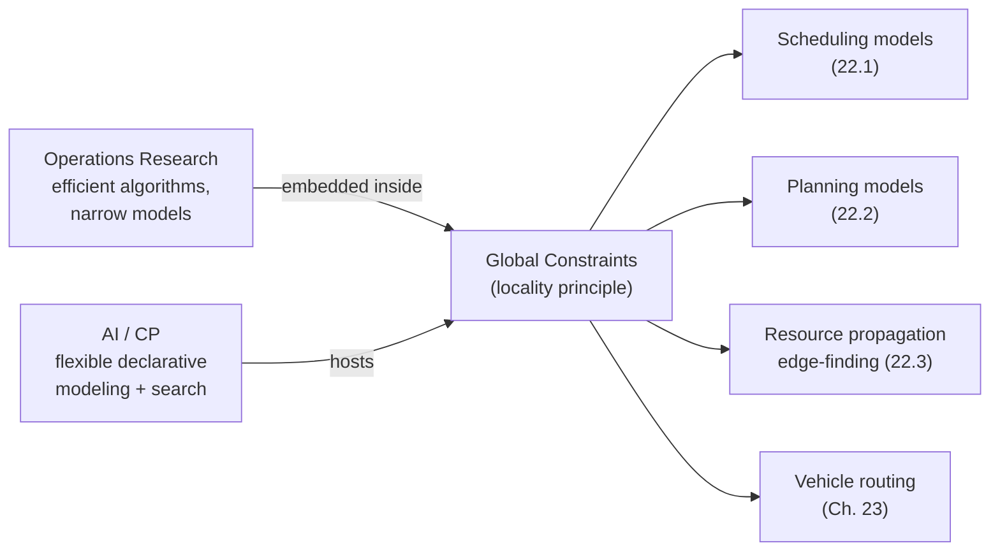
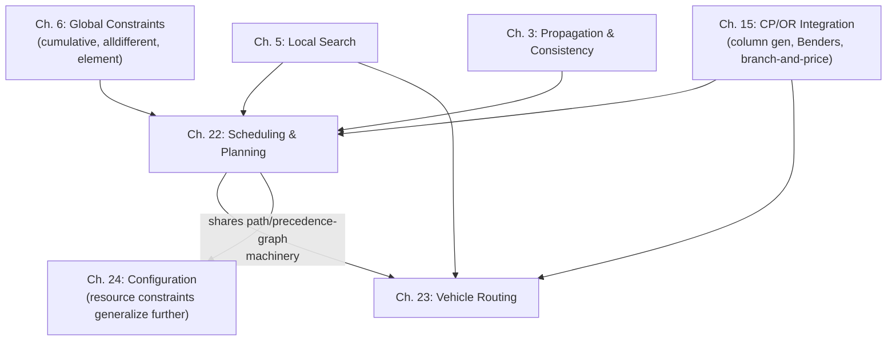

# Applications: Scheduling, Planning, and Vehicle Routing

[[book-guidelines|↩ Back to guidelines]]

## Why this chapter exists where it does

By the time you reach Part II of this handbook, you already have the machinery: [[Global-Constraints|global constraints]] (Chapter 6), constraint propagation and consistency (Chapter 3), local search (Chapter 5), and integration with Operations Research (Chapter 15). This chapter is where that machinery gets pointed at three of CP's most commercially important application families — scheduling, planning, and vehicle routing — and the chapter's own framing story is worth taking seriously, because it explains *why* CP works here at all, not just *that* it does.

The story: Operations Research (OR) built efficient algorithms for narrow, clean mathematical models of scheduling — but discarding real-world "side constraints" to fit those clean models produces solutions nobody can actually use. Artificial Intelligence (AI) built flexible, declarative modeling paradigms — but general-purpose search is slow on the structured sub-problems where OR shines. CP's winning move was to stop treating this as a choice: embed OR's efficient specialized algorithms *inside* global constraints, and let the surrounding CP search-and-propagation architecture retain its modeling flexibility. A cumulative-resource global constraint carries an OR-grade propagation algorithm inside it, but the modeler is still free to add an arbitrary side constraint next to it. This "locality principle" — efficient algorithms operate locally on the sub-network their constraint owns, while a general propagation engine coordinates everything else — is the throughline connecting all four subtopics below: it's exactly the same design pattern whether the "efficient algorithm inside a constraint" is an edge-finder, a Hungarian-algorithm reduced-cost calculator, or a `NoCycle` chain tracker.



---

## 1. Constraint programming models for scheduling

### What breaks without a dedicated activity model

You could in principle model "schedule these activities" with raw finite-domain variables for every time-unit/resource-unit pair, but this throws away exactly the structure — durations, resource capacities, precedences — that makes scheduling tractable. The book's model is built to keep that structure visible to specialized propagators.

**The core encoding.** Every activity $A_i$ gets three variables:

$$\text{start}(A_i), \quad \text{end}(A_i), \quad \text{proc}(A_i), \quad \text{with } \text{proc}(A_i) = \text{end}(A_i) - \text{start}(A_i)$$

With $r_i$ the release date and $d_i$ the deadline, the initial domains are $\text{start}(A_i) \in [r_i, \text{lst}_i]$ and $\text{end}(A_i) \in [\text{eet}_i, d_i]$ (latest-start-time and earliest-end-time respectively) — and critically, the book overloads this same notation to mean the *current* domain bounds during search, not just the initial data. This is a recurring convention worth internalizing: $r_i$ and $d_i$ mutate as propagation tightens bounds.

**Non-preemptive vs. preemptive vs. elastic.** Non-preemptive activities execute without interruption — this is the default case above. Preemptive activities can be interrupted, modeled either with a set-variable $\text{set}(A_i)$ (the set of time points at which $A_i$ executes) or with 0-1 indicator variables $X(A_i, t)$. Elastic activities generalize further: at any instant $t$, the resource amount assigned can be anywhere from 0 up to capacity, as long as the *sum over time* — called the **energy** $E(A_i, R)$ — matches a required value. For a non-elastic activity this collapses to $E(A_i, R) = \text{cap}(A_i, R) \cdot \text{proc}(A_i)$, i.e. energy is just capacity times duration when there's no partial allocation.

If you're grounding this in Rust: this is the natural place for an enum —

```rust
enum ActivityKind {
    NonPreemptive,
    Preemptive { set: IntervalSet },     // set(A_i) as disjoint interval bounds
    Elastic { energy_required: IntVar }, // E(A_i, R)
}
```

— because the propagation rules genuinely branch on which case you're in; a trait object or match arm per kind mirrors the book's own three-way split.

**Resource constraints.** For each activity/resource pair, $\text{cap}(A_i, R)$ is the capacity consumed. The fundamental constraint, holding at every time point $t$:

$$\sum_{i=1}^n E(A_i, t, R) \le \text{cap}(R)$$

In the non-preemptive case this specializes to the familiar $\sum_{A_i \mid \text{start}(A_i) \le t < \text{end}(A_i)} \text{cap}(A_i, R) \le \text{cap}(R)$. **Disjunctive** (unary) resources are the special case $\text{cap}(R) = 1$ — often literally called "machines" — where no two activities can overlap at all. **Cumulative** resources allow several activities to execute in parallel as long as the sum stays under capacity. This distinction drives which propagation algorithm applies (Section 3 below).

**Temporal constraints** are linear: $x - y \le d$ for start/end variables $x, y$ and integer $d$ — e.g., a precedence $\text{end}(A_1) \le \text{start}(A_2)$. Sparse networks (typical in scheduling) use arc-B-consistency directly; dense networks benefit from full path consistency via an All-Pairs-Shortest-Path algorithm (Floyd–Warshall).

### Extensions worth internalizing

The book spends real space on extensions because *this is where the "AI side" of the CP value proposition lives* — the ability to bolt on real-world detail without redesigning the core model:

- **Alternative resources**: an activity can run on any resource from a set $S$; modeled via a variable $\text{altern}(A_i)$ and propagated as if $A_i$ were split into $|S|$ *fictive activities* $A_i^u$, one per candidate resource, tied together by a **constructive disjunction** — the earliest-start/latest-start/etc. bounds of the real activity are the min/max over all its fictive alternatives, and whenever a fictive activity's bounds become infeasible, that resource is simply pruned from $\text{altern}(A_i)$'s domain.
- **Setup times/costs**: $\text{setup}(A_1, A_2)$, the mandatory gap between $A_1$ ending and $A_2$ starting when they run back-to-back on the same machine. This gets its own dedicated propagation machinery in Section 22.4.2 (below) because sum-of-setup-cost objectives are hard to propagate directly.
- **Breakable activities and calendars**: a resource can have a productivity profile (e.g., 50% efficiency in some interval means an activity there takes twice as long), and activities can be interrupted by breaks up to some maximum duration. This is modeled with a *duration* variable distinct from the *processing time* variable — duration is wall-clock time including breaks/inefficiency, processing time is "pure" work.
- **Optional / unperformed activities**: activities that might not execute at all (subcontracted, or simply not needed). Modeled either by letting $\text{proc}(A_i) = 0$ be a legal value (care needed: stale precedence constraints referencing $A_i$ can still induce unwanted delays even when the activity vanishes) or by an explicit "does this exist" boolean.
- **State resources and reservoirs**: a state resource has infinite capacity but a *state* that varies over time, and activities require it to be in some state throughout their execution — two activities needing incompatible states can't overlap. A reservoir is a multi-capacity resource that gets consumed and/or produced (think: a fuel tank) — note a cumulative resource is just the special case of a reservoir consumed at activity start and produced back at activity end.

### Objective functions and search-by-dichotomy

Common criteria, all defined via completion time $C_i$ and (optional) due date $\delta_i$: lateness $L_i = C_i - \delta_i$, tardiness $T_i = \max(0, L_i)$, and the unit late-penalty indicator $U_i$. The book's headline optimization criteria:

$$C_{\max} = \max_i C_i \quad\text{(makespan)}, \qquad \sum w_i C_i, \qquad T_{\max} = \max_i T_i, \qquad \sum w_i T_i, \qquad \sum w_i U_i$$

The crucial propagation-theoretic distinction: when $F$ is a *maximum* (like $C_{\max}$), tightening the objective's upper bound propagates trivially onto each activity's latest end time. When $F$ is a *sum* (like $\sum w_i C_i$), this decomposition fails — you cannot treat the objective constraint and the resource constraints independently, because the objective couples all activities simultaneously. This is precisely why Section 22.4 needs bespoke techniques for sum-objectives (below); it's not a minor implementation detail, it's the dividing line for which criteria are "easy" versus "hard" in CP scheduling.

To actually search for an optimum, the book describes **dichotomizing search**: maintain a lower and upper bound on `criterion`, repeatedly constrain `criterion ≤ (lb+ub)/2`, solve the resulting decision problem, and narrow the bracket — classic binary search over the objective, reducing optimization to a sequence of feasibility checks.

---

## 2. Constraint programming models for planning

### What planning adds over scheduling

Planning generalizes scheduling in one specific way: *the set of activities is not fixed in advance* — you must also decide *which* actions occur, not merely *when*. The book presents two genuinely different lineages for doing this in CP, and understanding why they diverged matters more than memorizing either one.

### 2a. Compile-to-CSP (Graphplan-style)

STRIPS represents a planning problem as: an initial state (ground propositions), a goal (a conjunction of propositions), and a domain theory of operators, each with a conjunctive precondition, an **add-list**, and a **delete-list**. Executing an action in state $s$ removes the delete-list propositions and adds the add-list ones.

Graphplan builds a **planning graph**: alternating layers of propositions-achievable-by-step-$k$ and actions-usable-at-step-$k$, annotated with **mutex** (mutually exclusive) relationships — two actions are mutex if one deletes the other's precondition or effect; two propositions are mutex if every way of establishing one is mutex with every way of establishing the other. (Persistence — a proposition simply continuing to hold — is itself modeled as a special "persistence action," which is a neat trick: it lets the same mutex machinery uniformly cover "nothing changed" as well as "something changed.")

The CSP encoding (Do & Kambhampati): one variable per proposition-per-step, whose domain is the set of actions that could establish it, plus a dummy value $\bot$ meaning "inactive." Constraints encode precondition satisfaction and mutex-exclusion; the goal constraint pins the goal propositions to non-$\bot$ values. If no solution exists at $k$ steps, add a step and retry. This family "does not require specific constraint propagation techniques" — standard CSP arc-consistency and search suffice — which is exactly why the book doesn't dwell on it: it's planning-as-a-CSP-*application*, not planning driving new CP *theory*.

### 2b. Plan-space search (the IxTeT-style approach)

The second lineage is the one that actually connects to everything else in this chapter. Here a search node is a **partial plan**: a set of tasks (temporal intervals) connected by constraints, possibly incomplete — some conditions unestablished, some choices pending. Refinement proceeds by resolving three specific flaw types:

1. **Non-established conditions** — an event or assertion nobody yet guarantees; fixed either by reusing an existing event in the plan or inserting a new task.
2. **Possible conflicts** between unordered events that might clash on a state attribute's value; fixed by posting a precedence constraint to order them.
3. **Possible resource conflicts** — resource usages that might overlap and over-consume; fixed by ordering the tasks, or (if the resource is producible) inserting a producing task.

The IxTeT formalism models operators with internal `event`/`hold`/`use`/`produce`/`consume` statements over named time points, each constrained relative to the task's own $[\text{start}, \text{end}]$ interval — e.g. a `TB(?x,?y)` (table-to-block move) task declares that clearing block `?x`, transferring it to hand, then to `?y`, are separate timed sub-events with their own interval constraints. **State attributes** here are the planning analogue of scheduling's state resources: no two tasks requiring conflicting values of the same attribute may overlap.

The payoff is direct: *"all the algorithms described in Section 22.3 can be implemented so as to accept other tasks and variables as the search evolves"* — meaning the resource-propagation machinery below (edge-finding, timetables, energy reasoning) isn't scheduling-specific at all; it's temporal/resource reasoning that plan-space planning reuses wholesale, with only the balance constraint (reservoirs) needing extension because it assumes a fully known set of producer/consumer events, an assumption planning violates.

---

## 3. Resource constraint propagation and edge-finding

This is the technical heart of the chapter, and the part most load-bearing for anyone building a solver: these are the propagators that make "add a resource constraint" mean something computationally sharp rather than just declaratively true.

### Unary (disjunctive) resources

**Disjunctive constraint propagation.** Two activities on the same unary resource can't overlap, so either $A_i$ precedes $A_j$ or vice versa. Propagation maintains arc-B-consistency on

$$[\text{end}(A_i) \le \text{start}(A_j)] \lor [\text{end}(A_j) \le \text{start}(A_i)]$$

If $A_i$'s earliest end exceeds $A_j$'s latest start, $A_i$ literally cannot go first — so $A_j$ must precede $A_i$, and both activities' bounds tighten to enforce it. If *neither* ordering survives this check, that's a direct contradiction (search backtracks here).

**Edge-finding.** This is the technique named explicitly in your topic list, so it's worth being precise about what it actually deduces. Given a set of activities $\Omega$ on a unary resource, define:

- $r_\Omega$ = the earliest of all release times in $\Omega$
- $d_\Omega$ = the latest of all deadlines in $\Omega$
- $p_\Omega$ = the sum of the minimal processing times in $\Omega$

Write $A_i \ll \Omega$ ("$A_i$ executes before all of $\Omega$"). The rule that captures the *what breaks without this* intuition: if activity $A_i$ (not in $\Omega$) were somehow scheduled *after* all of $\Omega$, would there be enough total time-window to fit $\Omega \cup \{A_i\}$? If $d_{\Omega \cup \{A_i\}} - r_\Omega < p_\Omega + p_i$ — i.e., the combined time window is strictly too small to fit everyone's total processing time — then $A_i$ scheduled last is *provably infeasible*, hence $A_i \ll \Omega$ is forced:

$$\forall\Omega\,\forall A_i \notin \Omega\; [d_{\Omega \cup \{A_i\}} - r_\Omega < p_\Omega + p_i] \Rightarrow [A_i \ll \Omega]$$

and symmetrically for $A_i \gg \Omega$ using $d_\Omega - r_{\Omega \cup \{A_i\}} < p_\Omega + p_i$. Once such an ordering is forced, it feeds a *second* rule that tightens actual time bounds — e.g. $A_i \ll \Omega \Rightarrow \text{end}(A_i) \le \min_{\emptyset \ne \Omega' \subseteq \Omega}(d_{\Omega'} - p_{\Omega'})$: $A_i$'s end time is capped by the tightest sub-window it must clear before *any* nonempty subset of $\Omega$ can even start.

Naively this is $O(n \cdot 2^n)$ (all pairs $(A_i, \Omega)$), but the key algorithmic insight is that the same rule, applied to any $\Omega$, gives an equally strong or stronger result for the superset $\Omega' = \{A_j \mid [r_j, d_j) \subseteq [r_\Omega, d_\Omega)\}$ — so it suffices to check $O(n^2)$ *interval-defined* sets rather than all $2^n$ subsets, giving the textbook $O(n^3)$ algorithm, improvable to $O(n^2)$ or $O(n \log n)$ with more elaborate data structures (Carlier–Pinson; Vilím).

**"Not-first" / "not-last" rules.** Your subtopic list explicitly separates edge-finding from these, and the reason both are needed rather than one subsuming the other is a genuine asymmetry worth sitting with: edge-finding derives *positive* orderings ("$A_i$ *must* come before/after $\Omega$"), while not-first/not-last derive *negative* orderings ("$A_i$ *cannot* be the very first/last in $\Omega \cup \{A_i\}$") without committing to any specific position otherwise. The rule:

$$\forall\Omega\,\forall A_i \notin \Omega\; [d_{A_i} - r_\Omega < p_\Omega + p_i] \Rightarrow [\text{end}(A_i) \le \max_{B \in \Omega} \text{lst}_B]$$

This is strictly weaker per-instance than a positive edge-finding deduction where one applies — but there are configurations where "$A_i$ can't possibly be squeezed in as the very first" is derivable even when *no* full ordering relative to $\Omega$ is forced. The two rule families prune genuinely different (overlapping but non-identical) sets of infeasible partial schedules, which is why production solvers run both.

### Cumulative resources

**Timetable constraint.** The natural generalization of disjunctive propagation to capacity $> 1$: maintain arc-B-consistency on $\sum_{A_i \mid \text{start}(A_i) \le t < \text{end}(A_i)} \text{cap}(A_i) \le \text{cap}(R)$ for every $t$ — essentially a running profile of resource usage against which each activity's placement is checked.

**Energy reasoning (Left-Shift/Right-Shift).** A sharper technique that reasons about *total work*, not just instantaneous occupancy. For an interval $[t_1, t_2)$, $W_{Sh}(A_i, t_1, t_2)$ is the minimum energy $A_i$ is *guaranteed* to contribute to that window, computed as $c_i \cdot \min$ of three quantities: the interval length itself, how much of $A_i$ survives in $[t_1,t_2)$ if left-shifted (scheduled ASAP), and how much survives if right-shifted (scheduled ALAP). Summed over all activities, $W_{Sh}(t_1,t_2)$ must not exceed the resource's total available energy $C(t_2-t_1)$ over that window — and when adding one particular activity's forced contribution would blow this budget, that activity's end (or start) time bound tightens by a closed-form adjustment. The whole-resource version runs in $O(n^3)$ (via $O(n^2)$ candidate intervals, $O(1)$ adjustment per interval per activity).

### Conjunctive reasoning: precedence-aware propagation

All the techniques above reason about *absolute* time-window positions. The chapter's more advanced material — genuinely novel relative to plain scheduling literature — layers in *relative* position information via a **precedence graph**: a temporal network over all activities' start/end time-points, using Point Algebra relations $\{\prec, \preceq, =, \succ, \succeq, \neq, ?\}$, kept transitively closed during search.

- **Energy precedence constraint**: for activity $A_i$ and *any* subset $\phi$ of its known predecessors, the resource must supply enough cumulative energy to finish all of $\phi$ before $A_i$ can start: $\text{start}(A_i) \ge r_\phi + \lceil E_\phi / \text{cap}(R_k) \rceil$.
- **Balance constraint (reservoirs)**: for each production/consumption *event* $x$, compute a provable upper bound $L^<_{\max}(x)$ on the reservoir level just before $x$, using the precedence graph to determine which production events *could* have already fired and which consumption events *must* have already fired. This single bound yields four distinct deduction types: (1) dead-end detection ($L^<_{\max}(x) < 0$ is immediate infeasibility), (2) tightened bounds on how much a consumption event may consume, (3) tightened time bounds forcing enough producers to run earlier, and (4) entirely new precedence relations between specific events. This is genuinely stronger than a naive timetable approach precisely *because* it exploits the precedence graph rather than only absolute time windows — but that's also exactly why it **cannot be transplanted to planning without extension**: the derivation assumes the full set of producer/consumer events is already known, which is false mid-plan-construction, where new tasks (and their resource events) can still be inserted.

---

## 4. Constraint propagation on optimization criteria

Recall from Section 1: sum-objectives like $\sum w_i U_i$ (weighted late jobs) or $\sum$ setup costs can't be handled by simple bound-propagation on end-times, because the objective and resource constraints interact. This section is where the chapter delivers on that gap.

**Weighted number of late activities.** The trick is a *relaxed preemptive* lower bound, computed by relaxing non-preemption (a classical scheduling relaxation technique) but keeping a stronger structure than the plain preemptive relaxation (which is itself insufficient — the true preemptive problem remains NP-hard). This reduces to a continuous LP relaxation over indicator variables $x_i$ (1 if $A_i$ is on-time), whose constraint set enforces, for every relevant interval $[t_1, t_2)$ pairing release-dates and due-dates/deadlines, that the "sure" and "preferred" activities in that window don't collectively overrun it. Solving this LP and reading off **reduced costs** proves individual activities can, must, or cannot meet their due dates — an $O(n^2 \log n)$ specialized algorithm achieves the same result without a general LP solver.

**Setup times/costs.** Reframed as a **routing problem relaxation**: internal nodes = activities, start/end nodes = machines, and a global constraint enforces that $m$ disjoint routes visit every internal node exactly once, with `next`/`prev`/`route` variables per node. This is solved as an **Assignment Problem** relaxation (find minimum-cost disjoint sub-tours, ignoring the "no illegal sub-tour" constraint that would make it exactly the routing problem) via a primal-dual algorithm, yielding both a lower bound `LB` on total setup cost *and* a reduced-cost matrix $\bar c_{ij}$. The propagation payoff:

$$LB + \bar c_{ij} > \text{ub}(\text{criterion}) \Rightarrow \text{next}_i \ne j$$

— exactly the reduced-cost-fixing idea from OR, but (as the book stresses) used differently in CP: in a pure OR/branch-and-bound setting, reduced-cost fixing typically only feeds the *next* bound computation; embedded in CP, the resulting domain reductions immediately trigger *other* propagators sharing those variables, compounding the effect. A companion **precedence graph constraint** (five closure rules — incompatibility, transitive closure through a "surely contributes" node, next-edge closure left/right, next-edge finding) incrementally maintains ordering information across alternative-resource assignments as the routing-style domains shrink.

---

## 5. Heuristic search for scheduling and planning

Given that propagation alone rarely decides everything, the chapter's search-strategy guidance: rather than branching by instantiating `start`/`end` variables directly, branch by **deciding activity order** — for unary resources this is literally choosing which of $A_i \ll A_j$ or $A_j \ll A_i$ holds; for cumulative resources, the equivalent move is decomposing the resource into `cap(R)` unit-capacity "lines" and sequencing activities along them. This works because once an ordering is fixed, propagating the now-purely-temporal constraints determines the actual schedule — search over the (much smaller) combinatorial ordering space rather than the raw time-domain space.

Which branching heuristic pays off depends on the objective's structure:

- **Regular criteria** (monotonic in end-times — makespan, weighted tardiness, weighted late count): the schedule obtained by setting every end-time to its current lower bound is *itself* a valid lower bound on the objective, and dominance pruning applies (a schedule with an unjustified "hole" can be discarded, since some other branch fills the hole better).
- **Sequence-dependent criteria** (depend only on relative activity order — setup costs): ordering-based branching still applies directly, but dominance pruning over holes does *not* — sometimes leaving a hole is exactly what avoids a costly setup transition.
- **Irregular criteria** (e.g. work-in-process time, where you want the *first* activity of a job as late as possible but the *last* as early as possible): sequencing alone is insufficient; the book's example hybridizes CP-derived sequences with an LP solved on top.

**Hybridization patterns**, both concretely exemplified: Caseau–Laburthe's local-search "repair" (swap two same-machine activities to shrink critical paths) and "shuffle" (bounded-backtrack search under a strict-improvement constraint) moves layered on top of CP tree search; and Le Pape–Baptiste's combination of edge-finding propagation, a "Jackson derivation" local-optimization operator, and **Limited Discrepancy Search** — search paths ordered by how many times they diverge from the heuristic's top recommendation, on the empirical bet that a good heuristic is "almost right," so solutions differing from it in only a few choices are worth exploring first. Their reported result — average optimality gap dropping from 13.72% to 0.23% after 10 minutes when combining all three techniques — is a concrete demonstration that the *combination* is what earns its keep, not any single piece.

---

## 6. Constraint programming approaches to vehicle routing

### Why VRP gets its own chapter instead of being "scheduling with maps"

The chapter deliberately investigates — and rejects — reformulating VRP as a Job Shop or Open Shop scheduling problem (or vice versa). Beck et al.'s five distinguishing characteristics are worth internalizing precisely because they show that surface-level problem similarity doesn't guarantee shared solver technology transfers cleanly:

| Dimension | VRP | JSP |
|---|---|---|
| Alternative resources | many vehicles can serve any customer | usually exactly one feasible machine |
| Time windows | independent per visit | interdependent, form long chains |
| Duration vs. transit | visit duration $\ll$ travel time | operation duration $\gg$ transition time |
| Optimization criterion | minimize fleet size, then distance | minimize makespan (fixed fleet) |
| Temporal slack | time windows drive feasibility | operation durations drive feasibility |

Reformulated problems land in an awkward middle ground that neither VRP-specialized nor JSP-specialized solvers handle as well as their native problem class.

### The core CP model: path constraints with redundant modeling

The VRP is formalized (Section 23.1) with $n$ customers each demanding $r_i$, $m$ vehicles each with capacity $Q$, minimizing $\sum c_{ij}$; standard extensions add heterogeneous fleets, multiple resource dimensions, time windows (VRPTW — NP-hard even to decide feasibility), open routes (no return to depot), and multiple depots.

The CP formulation treats every stop — customer or vehicle start/end — as a **visit** $i \in V$, with predecessor variable $p_i$ and successor variable $s_i$ forming a permutation, kept mutually consistent via **element constraints** ($s_{p_i} = i$). This redundant modeling (maintaining *both* directions of the same routing information) is explicitly called out as a source of extra propagation strength no single variable set would achieve alone — a general CP lesson, not VRP-specific: two views of the same underlying structure, cross-checked continuously, prune more than either view checked in isolation. On top of this skeleton:

- **Vehicle variables** $v_i$ tie visits to routes, propagated along the path ($v_i = v_{p_i}$, etc.).
- **Quantity-of-goods path constraint**: $q_i = q_{p_i} + r_i$, maintained at *bounds* consistency only (domain too large for full AC to be worth it) — a concrete instance of the general CP tradeoff between propagation strength and per-step cost.
- **Time path constraint**: $t_i \ge t_{p_i} + \tau_{p_i,i}$ — an *inequality*, not equality, because waiting at a customer is normally legal; this is the one place the load-flow analogy with quantity breaks.
- **NoCycle constraint**: forbids returning from the end of a chain to its start, in $O(1)$ amortized per bound. It tracks, per visit, the first ($b_i$) and last ($e_i$) visit of the chain it currently belongs to, updated via *reversible* assignment (undone automatically on backtrack) whenever a new predecessor edge is bound. This is a classic CP idiom: maintaining auxiliary incremental state alongside the "real" decision variables purely to make an otherwise-global check ($O(n)$ or worse) into an $O(1)$ local one.
- **Connectivity pruning**: reachability sets $R_k^F$ (forward from a vehicle's first visit) and $R_k^B$ (backward from its last) detect dead ends when a vehicle's first visit can't reach its last, or when some visit is unreachable by *any* vehicle — reported in the book as theoretically appealing but practically weak (small search-space reduction relative to its $O(|V| \cdot a)$ cost).

An **alternative formulation** (Pesant et al.) replaces single-valued predecessor/successor with *set*-valued before/after sets $B_i, A_i$ per visit, letting the constraint system reason about ordering even when the immediate predecessor isn't yet pinned down — costlier per node but capable of deriving precedence facts the path-constraint model can't see yet.

### Cost-based propagation and lower bounds

A naive lower bound $d_{LB} = \sum_i \min_{j \in p_i} \delta_{j,i}$ (cheapest possible predecessor edge, per visit, summed) is weak because it ignores that predecessor assignments must form a valid permutation — two visits can't both claim the same cheapest predecessor. Two refinements matter:

1. **Regret-based bound** ($d_{LBR}$): when visit $i$ is the cheapest predecessor candidate for *multiple* visits $j, l$, only one of them can actually get it — so the bound must add at least the smaller of their "regrets" $R_j, R_l$ (the cost gap between best and second-best predecessor choice) to account for the contention.
2. **Reduced-cost propagation via the Hungarian algorithm**: the assignment-problem relaxation (same technique as Section 22.4's setup-cost handling — worth noticing this is literally the *same* algorithmic tool reused across scheduling and routing) produces a lower bound $d_H$ plus reduced costs $\bar c_{i,j}$, giving the pruning rule $d_H + \bar c_{i,j} > G \Rightarrow s_i \ne j$.

### Reconciling CP with local search: the chronological-backtracking obstacle

This is the conceptually sharpest point in the vehicle-routing chapter. Classic CP search relies on **chronological backtracking** — undo decisions strictly in reverse order. Local search wants to move a customer ($s_i = j$), then later move a *different* customer whose position depends on $j$'s new placement, without needing to undo the first move to make the second. These are fundamentally incompatible disciplines, and the chapter names two reconciliation strategies:

1. **CP as rule-checker**: an external heuristic/meta-heuristic drives the search entirely; CP is invoked only to validate candidate moves (feasibility + incremental cost), never to structure the search itself. De Backer et al.'s optimization here is instructive: test the *cheapest* candidate move by its cost heuristic *first*, and only run full constraint propagation if that cheap check passes — skip expensive validation on moves you'd reject anyway.
2. **Operator-insulated search**: wrap local-search-style modifications (serial insertion, block deletion) as CP-level *operators*, so that from the CP engine's point of view, each operator application is a normal, chronologically-undoable branching step — the "jumping around" happens *inside* the operator's implementation, invisible to the backtracking discipline outside it. **Large Neighbourhood Search** (LNS) is the canonical example: remove a *related* group of customers (by a relatedness function combining distance and same-vehicle membership) and re-insert them via exact branch-and-bound with full propagation — turning "an intractably large neighborhood" into "a small enough sub-CSP to solve exactly, repeatedly."

Pesant–Gendreau's approach generalizes this: characterize an entire local-search neighborhood as a small CSP over a handful of index variables (e.g., orientation-preserving 3-opt as three indices $I \prec J \prec K$ marking break-points), then explore that neighborhood *implicitly* via branch-and-bound with lower-bounding — rather than enumerating every neighbor explicitly, prune whole regions of the index space that provably can't beat the incumbent.

### CP as a subproblem solver

A third usage pattern, distinct from both rule-checking and operator-insulation: **column generation** (set-partitioning over candidate routes, where CP solves the pricing subproblem — a prize-collecting TSP variant, finding negative-reduced-cost routes) and **Lagrangian relaxation** (dualizing the "visit each customer once" constraint, decomposing into $m$ independent per-vehicle prize-collecting TSPs, each solvable by CP with arbitrary side constraints intact). Both patterns exploit the same property: CP's ability to absorb arbitrary side constraints into the *subproblem* solver means the master decomposition (set-partitioning LP or Lagrangian dual) stays clean and standard, while all the real-world messiness gets pushed down into a CP call.

### The real-world gap

Section 23.6's catalog of idiosyncratic industrial constraints (paid-minimum route time, meal-break placement rules, cross-docking, trailer change-over between vehicles, dock-capacity limits, tiered overtime pricing, per-technician truck-inventory tracking) is the chapter's closing argument for *why* CP earns its place in commercial routing software despite OR's raw efficiency edge on pure problems: the core path/time/quantity model buys you a solid, well-propagated backbone that *most* side constraints attach to cleanly as additional constraints over the same `p_i`/`s_i`/`t_i`/`q_i` variables — but constraints spanning *multiple routes simultaneously* (cross-docking timing between two vehicles, trailer handoffs, shared dock-slot limits) strain the single-route path-constraint abstraction and typically need bespoke inter-tour constraints layered on top.

---

## Synthesis: how this topic fits the book's larger structure



This chapter is best read as an *application-layer stress test* of everything earlier chapters built: global constraints (Ch. 6) get their canonical use case here (`cumulative` exists largely *for* scheduling); propagation and consistency techniques (Ch. 3) get their sharpest real payoff in edge-finding's polynomial-time deduction over exponentially many candidate subsets; and the CP/OR integration ideas of Ch. 15 (column generation, Lagrangian relaxation) reappear almost verbatim as vehicle-routing subproblem-solving techniques.

**On the closing synthesis this book's learning-goals context asks for:** the mechanisms here are directly relevant to a CSP kernel meant to search for counterexamples against type/refinement invariants. Edge-finding is a textbook instance of *domain propagation over an aggregate/interval-shaped constraint* — the same shape of reasoning (deduce a variable's feasible range from the combined resource/energy budget of a *set* it interacts with, without enumerating the set's subsets) generalizes directly to propagating numeric refinement constraints over intervals or abstract lattice elements, which is exactly the "domain/lattice propagation... handling integer and non-linear equations" goal named in this project's standing objectives. The precedence-graph technique (Section 22.3.3) — maintaining a transitively-closed qualitative relation graph *alongside* numeric bounds, and using each to sharpen the other — is structurally the same idea as combining an abstract-interpretation lattice with a symbolic constraint store: neither reasoning mode alone is as strong as the two kept mutually consistent. And the routing chapter's reduced-cost propagation (Hungarian algorithm inside a global constraint) is a clean worked example of *how* to embed an external combinatorial-optimization algorithm as a sound propagator — the same pattern a Rust-based CSP kernel would need for embedding, say, an LP relaxation or an interval-arithmetic solver as a first-class propagator rather than bolting it on as a pre/post-processing pass.

Where this topic depends on earlier material: global constraints (`cumulative`, `alldifferent`) and consistency notions (arc-B-consistency, bound consistency) from Chapters 3 and 6. What later material depends on it: the CP/OR integration patterns here (branch-and-price, Lagrangian relaxation via subproblem-solving) recur in Chapter 15's treatment of the same techniques from the OR-integration angle, and the resource/reservoir abstractions here are a direct, simpler ancestor of the richer resource models in Chapter 24 (Configuration).
