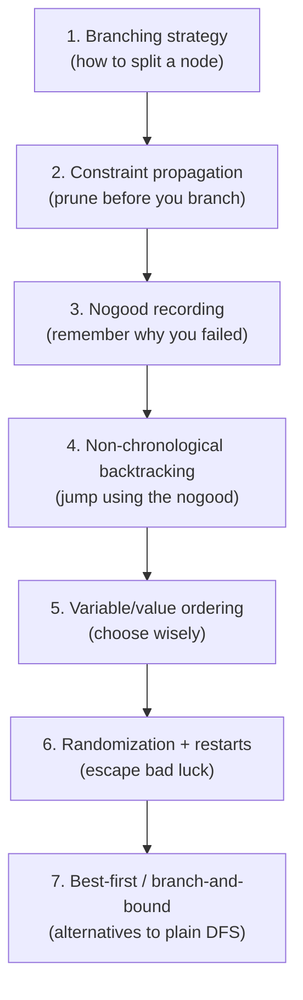
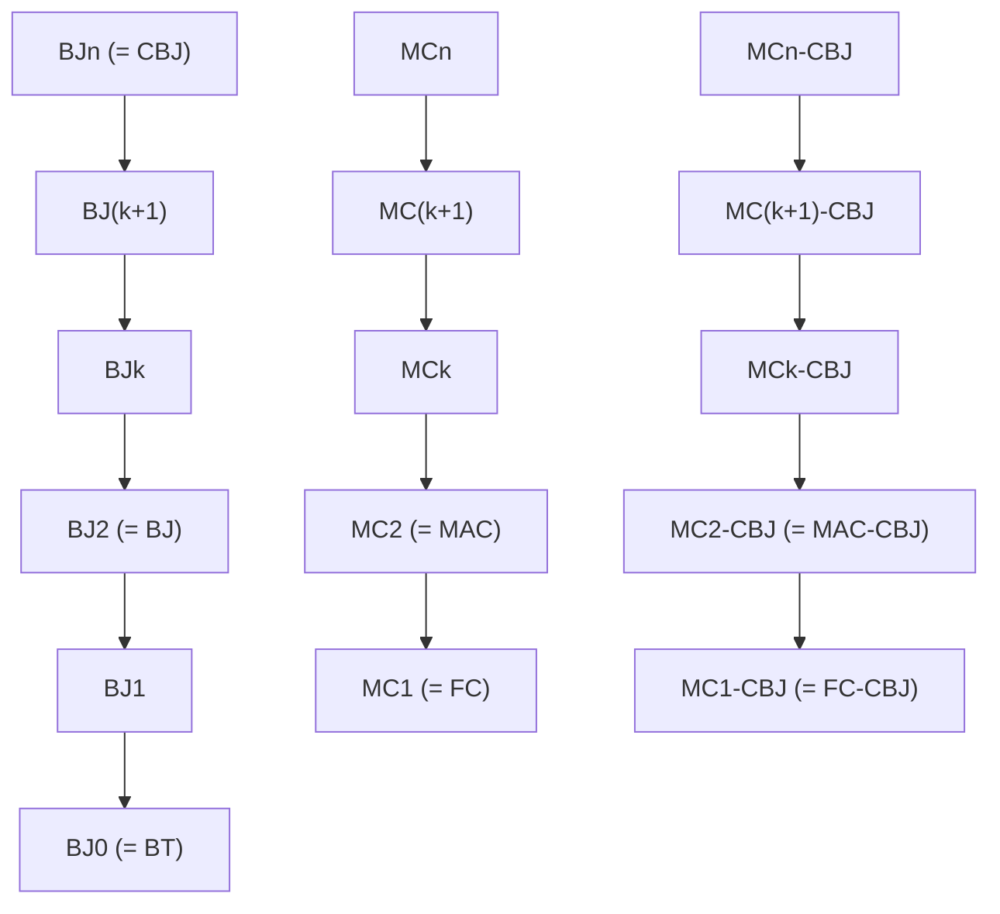

# Backtracking Search

[[book-guidelines|↩ Back to guidelines]]

## Why backtracking at all

A constraint satisfaction problem (CSP) is a triple $\langle X, D, C \rangle$: variables $X = \{x_1,\dots,x_n\}$, a value set $D$ with each $x_i$ ranging over a finite domain $\mathrm{dom}(x_i) \subseteq D$, and constraints $C$, each a relation (a set of allowed tuples) over some subset of the variables (its *scope*, $\mathrm{vars}(C)$). A solution is a total assignment satisfying every constraint. The naive way to search this space is exhaustive enumeration of the Cartesian product $\bowtie_i \mathrm{dom}(x_i)$ — but that product is exponential and almost all of it is garbage: assignments that violate some constraint on a small handful of variables. Backtracking search is the mechanism that avoids materializing that product by building the assignment incrementally, one variable at a time, and abandoning (backtracking out of) a partial assignment the moment it becomes clear it cannot be extended to a solution.

This is precisely the shape of proof search in a checker with a trusted kernel: you don't enumerate all terms of a type and filter; you build a term (or a derivation) incrementally, and you prune branches as soon as a judgment fails. Backtracking search *is* systematic, complete refutation search — the CSP analogue of DPLL/SAT solving, and historically the two lines of work (SAT solving and CSP solving) share almost every technique in this chapter under different names. Van Beek's survey (Chapter 4, pp. 85–129) makes this correspondence explicit throughout, and it's worth keeping in mind: DPLL *is* forward checking on SAT, unit propagation *is* a restricted form of arc consistency, and clause learning *is* nogood recording.

A node in the search tree is a set of *branching constraints* (posted assignments or restrictions). A node with no consistent extension is a **deadend**. The chapter's organizing question is: given that naive backtracking (BT) — instantiate a variable, check only fully-instantiated constraints, backtrack on failure — visits a huge number of deadends, what techniques cut that number down, and how do they compose?



Each of these seven layers is orthogonal in principle but interacts — sometimes multiplicatively, sometimes destructively — with the others in practice, which is why the chapter ends with a section on how to actually *compare* algorithms built from different combinations.

---

## 1. Branching strategies

**What breaks without this.** Naive backtracking assumes one specific way of extending a node: pick an unassigned variable $x$, and for every value $a \in \mathrm{dom}(x)$ generate a child $p \cup \{x = a\}$. But that's a choice, not a law — and different choices give provably different search-tree sizes for the *same* problem and the *same* CSP model.

Van Beek generalizes: a node $p = \{b_1,\dots,b_j\}$ is a set of *branching constraints* (not necessarily assignments), and a node is extended into children $p \cup \{b^{j+1}_1\}, \dots, p \cup \{b^{j+1}_k\}$, where the posted constraints across all children must be mutually exclusive and jointly exhaustive (otherwise you could lose completeness or duplicate work). Three canonical schemes, illustrated with $\mathrm{dom}(x) = \{1,\dots,6\}$:

1. **Enumeration / $d$-way branching.** One branch per domain value: $x=1$, $x=2$, …, $x=6$. This is what most textbooks mean by "backtracking."
2. **Binary choice points / 2-way branching.** Two branches: $x = 1$ and $x \neq 1$. Used by constraint programming languages and by Sabin & Freuder's arc-consistency-maintaining algorithm.
3. **Domain splitting.** For ordered domains: $x \leq 3$ on one branch, $x > 3$ on the other — the variable need not be instantiated at all in this step.

These coincide when domains are Boolean (as in SAT), but not in general, and the difference is not cosmetic. **Hwang and Mitchell's theorem**: for a *fixed* CSP model, 2-way branching with a simple ordering can be exponentially more powerful than $d$-way branching with an *optimal* ordering — there exist problem families where the best possible $d$-way search tree is exponentially larger than an easy 2-way one. The converse never holds (you can always simulate $d$-way with $2$-way branches with no loss). The caveat is important: this result is about the model held fixed. If you're allowed to add auxiliary variables — e.g., in job-shop scheduling, adding a Boolean "ordering" variable $O_{12}$ per pair of tasks sharing a resource, with $O_{12}=1 \iff x_1+d_1\le x_2$ — you can simulate arbitrary branching strategies. So **branching strategy and model design are entangled decisions**, not independent knobs.

*Grounding.* In a Rust CSP/verifier kernel, this maps directly onto how you represent a choice point:

```rust
enum Branch {
    Enumerate { var: VarId, remaining: SmallVec<[Value; 8]> }, // d-way
    Binary    { var: VarId, value: Value, negate: bool },       // 2-way, x=a / x≠a
    Split     { var: VarId, pivot: Value, upper: bool },        // domain splitting
}
```
A `trait BranchingStrategy { fn choose(&self, state: &SearchState) -> Branch; }` cleanly separates "what gets posted as a constraint" from "which variable/value gets picked" (that's Section 5 below) — the same separation the chapter insists on.

---

## 2. Constraint propagation during search

**What breaks without this.** Backtracking alone only detects failure once a constraint's *last* variable is instantiated — it walks straight into deadends it could have seen coming. The fix, understood as far back as Golomb & Baumert (1965) and Davis–Putnam's unit propagation for SAT (1960), is to actively prune domains at each node using constraints that *aren't yet fully instantiated* — turning local inconsistencies (values that provably can't be part of any solution) into removed domain elements before they cost you a whole subtree of futile search. A **local inconsistency** is a partial instantiation that itself satisfies the relevant constraints but cannot be extended — that's just the definition of a **nogood** (Section 3 gives this its own formal treatment).

**Definition 4.2 (arc consistency).** A value $a \in \mathrm{dom}(x)$ for $x \in \mathrm{vars}(C)$ has a *support* in $C$ if there's a tuple $t \in C$ with $a = t[x]$ and $t[y] \in \mathrm{dom}(y)$ for every $y \in \mathrm{vars}(C)$. $C$ is arc consistent if every value of every variable in its scope has a support. You enforce it by iteratively deleting unsupported values until fixpoint.

The chapter's running distinction is between **which constraints get this treatment during search**:

| Algorithm | Propagates on constraints with… | Backtracks |
|---|---|---|
| **BT** | no uninstantiated variables (i.e. none) | chronologically |
| **FC** (forward checking) | *exactly one* uninstantiated variable | chronologically |
| **MAC** (maintain arc consistency) | *at least one* uninstantiated variable | chronologically |
| **DPLL** | FC specialized to SAT, via unit propagation | chronologically |
| **MC$_k$** | maintains strong $k$-consistency at every node | chronologically |

FC is cheap: on a constraint with one free variable, arc consistency costs $O(d)$. MAC is expensive per node but prunes harder — and crucially, MAC's harder pruning can *ripple*: propagating one constraint can make a neighboring one arc-inconsistent, requiring further propagation until quiescence (a fixpoint computation, the same shape as any worklist-based dataflow/abstract-interpretation pass). The historical arc here is instructive and slightly humbling: early experiments (McGregor 1979, Haralick & Elliott 1980) found FC 3× faster than MAC, and that conclusion stood for roughly fifteen years — until Sabin & Freuder (1994) showed MAC dominating on *hard* random problems, revealing that the earlier verdict was an artifact of easy benchmarks plus unoptimized (non-incremental) AC algorithms. This is a recurring cautionary tale in the chapter (repeated again for backjumping, Section 4, and restated as a Key Question): **don't generalize an empirical algorithm ranking from an unrepresentative test suite.**

A crucial theoretical ceiling: the **minimal domains** of a CSP (every remaining value provably extends to *some* solution) would make search backtrack-free — but computing them is at least as hard as solving the CSP outright, since it amounts to enforcing arc consistency on the *conjunction* of all constraints simultaneously (exponential in $n$ in the worst case). So arc consistency on individual constraints is only an *approximation* to minimal domains, and there is a real cost/quality tradeoff: stronger consistency (e.g. singleton arc consistency, Chapter 3) prunes better but costs more per node; weaker consistency (e.g. bounds consistency, which only checks the min/max of an interval-represented domain have supports) costs less but prunes worse. All-different can be made bounds-consistent in $O(r)$ vs. $O(r^2 d)$ for full arc consistency.

**Definition 4.3 (strong $k$-consistency).** A CSP is $k$-consistent if every consistent assignment to $k-1$ variables extends to a $k$th variable; strongly $k$-consistent if it is $j$-consistent for all $j \le k$. For binary CSPs, strong 2-consistency = arc consistency, strong 3-consistency = path consistency. MC$_k$, the algorithm maintaining strong $k$-consistency at every node, generalizes the family: MC$_1$ = FC, and (on binary CSPs) MC$_2$ = MAC. This single parametrized family is what lets Section 8 build a clean dominance hierarchy across the whole spectrum from BT to MAC.

*Grounding — this is exactly your abstract-interpretation domain-propagation kernel.* Arc consistency's "iterate until fixpoint, removing unsupported values" is the *same algorithmic skeleton* as a worklist-based abstract interpreter narrowing an interval/octagon domain: a propagator is a monotone, (usually) idempotent function on a lattice of domains, and you iterate a set of such propagators to a least fixpoint. In Rust:

```rust
trait Propagator {
    /// Returns true if this call changed any domain (so dependents must be re-queued).
    fn propagate(&self, store: &mut DomainStore) -> Result<bool, Contradiction>;
    fn scope(&self) -> &[VarId];
}

fn ac_fixpoint(props: &[Box<dyn Propagator>], store: &mut DomainStore) -> Result<(), Contradiction> {
    let mut queue: VecDeque<usize> = (0..props.len()).collect();
    while let Some(i) = queue.pop_front() {
        if props[i].propagate(store)? {
            for j in dependents_of(i, props) { queue.push_back(j); }
        }
    }
    Ok(())
}
```
This is precisely the machinery your project's CSP kernel needs for domain/lattice propagation over integers, non-linear constraints, and DFA-shaped abstract domains — MAC's per-node fixpoint *is* a mini abstract-interpretation pass invoked at every node of the search tree, and forward checking is the cheap, non-relational special case of it (propagate along edges touching exactly one live variable, i.e. don't bother computing a real fixpoint).

---

## 3. Nogood recording

**What breaks without this.** Even with constraint propagation, the search still walks into the same failure shape twice if it revisits structurally-identical partial assignments (this is *thrashing*, cf. Chapter 2). Constraint propagation prevents *some* of this by ruling out inconsistencies before search reaches them; nogood recording is the complementary move — ruling them out *after* the search discovers them, so they're never paid for twice.

**Definition 4.4 (nogood).** A set of assignments (and branching constraints, in the generalized sense) not consistent with any solution. Every deadend *is* a nogood by construction. Once discovered, a nogood $\{x_1=a_1,\dots,x_k=a_k\}$ can be recorded as the implied clause $x_1\neq a_1 \lor \cdots \lor x_k \neq a_k$ — too late to save the deadend that revealed it, but useful for every future node that would have replayed the same mistake. This is literally the memoization/caching pattern applied to search: cache "this subproblem shape fails," reuse the cached failure.

**Discovering nogoods — the jumpback nogood.** The chapter gives a precise recursive definition (Definition 4.5) for the no-propagation case: for a leaf deadend $p$, take some constraint $C$ inconsistent with $p$ and collect the branching constraints touching $\mathrm{vars}(C)$; for an internal deadend, union the (child nogood minus the child's own branching constraint) over all failed children. Concretely, for the 6-queens running example, if $p = \{x_1{=}2, x_2{=}5, x_3{=}3, x_4{=}1, x_5{=}4\}$ and every value of $x_6$ fails, the jumpback nogood works out to $\{x_1{=}2, x_2{=}5, x_3{=}3, x_5{=}4\}$ — note $x_4{=}1$ *drops out*, meaning $x_4$'s value wasn't actually responsible for the failure. This is the crux of why non-chronological backtracking (Section 4) can safely skip past $x_4$.

When constraint propagation *is* in play, nogoods must instead be built from **eliminating explanations** (Definition 4.6): for each value pruned by propagation, record a subset of the current node sufficient to justify the removal, propagated backward through the chain of implications ("value $b$ of $y$ was needed to support $a$ of $x$, but $b$ was itself removed because…"). This is structurally identical to building a **proof certificate** or a **conflict clause with an implication graph** in a modern SAT solver (Marques-Silva & Sakallah's account, which the chapter cites directly): vertices are assignments, edges are justification, and a contradiction is a variable assigned both ways; different *cuts* of the implication graph correspond to different learnable nogoods, of varying strength.

**Nogood database management** is the pure systems-engineering problem this creates: recording *every* nogood at every deadend produces a database too large to query cheaply, so you must throttle it. Two families:
- **Size-bounded** (Dechter): keep a nogood only if it has at most $i$ variables. $i{=}0$ discards them (just uses them transiently for backjumping); $i{=}1,2$ correspond to what arc/path consistency propagation would enforce anyway.
- **Relevance-bounded** (Ginsberg's DBT; generalized by Bayardo & Miranker): delete a nogood once more than $i$ of its variable-value pairs are no longer part of the current assignment.

No consensus emerged on which is better — different experiments favored each — but everyone agreed *unrestricted* recording is too expensive without further tricks. The tool that made large-scale recording practical is **watch literals**: a data structure (used in modern SAT solvers, e.g. Chaff) that lets you query "is any nogood violated / can any value be pruned" without scanning every nogood on every assignment change, making 100–200-order nogood recording tractable — a huge jump from the 2–4 order limits of earlier work.

*Grounding — this is proof-producing architecture, directly on point for the elaborator/verifier project.* An eliminating explanation is exactly a **proof obligation / justification term** your trusted kernel would want to keep around: not just "this branch failed" but *why*, expressed as a minimal (or at least valid) set of premises. In Rust:

```rust
struct Nogood {
    literals: SmallVec<[Assignment; 4]>, // the "left-hand side" conjuncts
}

struct EliminatingExplanation {
    removed: (VarId, Value),
    justification: Nogood, // sufficient to explain the removal
}
```
And the CDCL/CBJ-style conflict-clause derivation from an implication DAG is the direct ancestor of clause learning in modern SMT/CHC solvers — worth internalizing now if your project's CSP-based counterexample search is meant to interoperate with a CHC/Horn-clause backend later: nogood recording *is* your CEGAR "blocking clause" mechanism, just under CSP terminology instead of model-checking terminology.

---

## 4. Non-chronological backtracking and backjumping

**What breaks without this.** Chronological backtracking always retracts the *most recently posted* branching constraint on failure — even when that constraint had nothing to do with the failure. If $x_4$ wasn't responsible for the deadend under $x_6$ (as in the jumpback-nogood example above), chronological backtracking will nonetheless dutifully re-try all of $x_4$'s remaining values, uselessly, before ever reconsidering $x_3$ — the variable that actually mattered.

**Backjumping** (Gaschnig's term; also called intelligent or dependency-directed backtracking) instead retracts the *most recent branching constraint that appears in the jumpback nogood* — provably safe, since anything not in the nogood cannot be the cause. Gaschnig's original **BJ** only does this at *leaf* deadends (all children failed); **CBJ** (Prosser; independently Schiex–Verfaillie and Ginsberg) generalizes to backjump from *any* deadend, internal or leaf, using the same jumpback-nogood machinery. On the 6-queens tree, CBJ backjumps straight from node $2531\text{4}$'s failure past all of $x_5$'s remaining values once $2531$ itself is shown to be a deadend — skipping subtrees that BJ (limited to leaf deadends) would still visit.

Implementation-wise, when all branching constraints are assignments, CBJ needs only an $O(n^2)$ **conflict set** — for each variable, the union of the nogoods associated with each of its values — rather than storing a full nogood per value.

**Partial-order and dynamic backtracking.** Bruynooghe observed that chronological/CBJ backtracking assumes branching constraints are *totally* ordered by posting time, but that's not required: **partial order backtracking** treats them as initially unordered, inducing a partial order only as backjumps occur. This is more flexible but Baker (crediting Ginsberg) shows Bruynooghe's original scheme can *cycle and never terminate*. Ginsberg's **dynamic backtracking (DBT)** fixes this by always retracting the *most recently posted* assignment from the jumpback nogood (guaranteeing a total order over nogood members), while — critically — **retaining** nogoods discovered after the backjump point, rather than discarding them the way CBJ does. That retention is a genuine gain (DBT solves more problems within a time limit on crossword-puzzle benchmarks) but also a genuine risk: Baker shows relevance-bounded nogood retention can interact *destructively* with dynamic variable ordering, producing exponential slowdowns relative to plain CBJ. **Partial order dynamic backtracking (PBT)**, Ginsberg & McAllester, threads a middle path, retaining partial-order information from deleted implications while still guaranteeing termination.

The **key open empirical fact** the chapter flags as a genuine surprise (and repeats as a Key Question): CBJ and FC-CBJ are *incomparable* — each can be exponentially better than the other on some instance — despite CBJ looking like a strict improvement over chronological backtracking on paper. Section 8 below explains exactly why, via a formal dominance hierarchy.

*Grounding.* Backjumping's "retract the constraint responsible for failure" is precisely what a good SMT/CHC solver's conflict-driven clause learning does, and it's also the shape you want for a **counterexample search** that needs to explain *why* a candidate program state violates an invariant — not just that it does. A `ConflictSet` per variable is the direct analogue of watching "which typing/refinement obligations this metavariable's failed instantiation actually depended on" during elaboration backtracking.

---

## 5. Variable and value ordering heuristics

**What breaks without this.** Even with perfect propagation and backjumping, *which* variable you branch on next, and *which* value you try first, determines whether you stumble into a solution quickly or spend exponential time discovering the same failure pattern under different names. Finding a provably *optimal* ordering is itself intractable — Liberatore shows deciding whether a variable is first in *some* optimal ordering is at least as hard as solving the CSP — so the field runs on heuristics with no formal optimality guarantee, evaluated empirically.

**Variable ordering, domain-size family.** Let $\mathrm{rem}(x \mid p)$ be the number of values remaining in $\mathrm{dom}(x)$ after propagation, given current node $p$.

- **dom** (Golomb & Baumert 1965): choose $x$ minimizing $\mathrm{rem}(x\mid p)$ — the classic "fail-first" heuristic ("to succeed, try first where you are most likely to fail" — Haralick & Elliott). Interestingly, when researchers went back and tried to formally verify *which* intuition dom actually encodes (Hooker's program of scientific, as opposed to purely competitive, heuristic testing), the results were genuinely surprising: identifying "fail-first" with *minimizing tree depth* is refuted, but identifying it with *minimizing node count* is confirmed. A heuristic can be right for a different reason than its inventors' stated intuition.
- **dom+deg** (Brélaz): break dom ties by preferring higher *degree* (constraints touching at least one other unassigned variable).
- **dom/deg** (Bessière & Régin): domain size divided by degree.
- **dom/wdeg** (Boussemart et al.): domain size divided by *weighted* degree, where each constraint's weight increments every time it's responsible for a deadend — i.e., the heuristic literally learns which constraints are troublesome from search failures and steers toward resolving them earlier. Empirically this can reduce or eliminate the need for backjumping altogether, since a good enough ordering makes many backjump-worthy mistakes simply not happen.

**Structure-guided heuristics** work off the constraint graph itself rather than live domain sizes:

**Definition 4.9 (width).** For an ordering of the constraint graph's vertices, width = max, over vertices $v$, of the number of edges from $v$ to *earlier* vertices. The graph's width is the minimum over all orderings. **Freuder's theorem:** a static ordering is backtrack-free if the maintained level of strong $k$-consistency exceeds the ordering's width — a genuine structural sufficient condition for polynomial (in fact linear) search, connecting local consistency strength directly to search-tree shape. Related structure-guided strategies: cutting cycles first (Dechter & Pearl) so the residual graph is a tree (solvable by arc consistency alone), minimizing **bandwidth** (Zabih), and recursive **graph-separator** decomposition (Freuder & Quinn) — the last of which Huang & Darwiche show needs no special-purpose algorithm at all: plain CBJ, applied with the separator-derived variable grouping, gets the additive (rather than multiplicative) behavior for free.

**Value ordering.** Ginsberg et al.'s *product* ("promise") heuristic — choose the value $a$ maximizing $\prod_y \mathrm{rem}(y \mid p \cup \{x=a\})$ — treats the product as an upper bound on the number of completions of the resulting node, hence (under a uniform-likelihood assumption) an estimate of solution-probability. Frost & Dechter's *summation* variant ("min-conflicts" heuristic) is cheaper but Geelen shows the product differentiates far better in practice.

*Grounding.* dom/wdeg's constraint-weight learning is a lightweight, online analogue of the kind of feedback-directed search your CSP-based counterexample-hunting kernel wants: weight refinement/subtyping obligations that have historically produced failed unifications higher, so the search steers toward resolving the hard part of a verification condition first — directly useful when searching for a concrete satisfying assignment (a counterexample) that breaks a candidate invariant. In Rust terms this is just a `HashMap<ConstraintId, f64>` updated on every deadend and consulted by the variable-selection comparator — cheap, and empirically one of the strongest heuristics in the whole chapter.

---

## 6. Randomization and restart strategies

**What breaks without this.** Ordering heuristics make mistakes, and a mistake made early in the tree can be catastrophically expensive to walk back out of — the deterministic algorithm is *stuck* with whatever bad early decision it made, however unlucky. Harvey's PhD work found that periodically restarting search with a *fresh* randomized ordering, abandoning a run once it has backtracked "too far," eliminates the cost of "early mistakes" simply by giving the algorithm another roll of the dice.

**Restart strategy** $S = (t_1, t_2, \dots)$: run the randomized algorithm for $t_1$ steps; if no solution, run for $t_2$; and so on. Luby, Sinclair, and Zuckerman's foundational result, cast in terms of general Las Vegas algorithms (correct-when-they-terminate, but variable runtime): given the *full* runtime distribution, a **fixed cutoff** $S_{t^*} = (t^*, t^*, \dots)$ at the optimal $t^*$ is provably optimal. Without that knowledge, the **universal strategy** $S_u = (1,1,2,1,1,2,4,\dots)$ is within a $\log$ factor of optimal and this is the best any distribution-agnostic strategy can guarantee. In practice $S_u$ grows too slowly to be useful, so Walsh's **geometric strategy** $S_g = (1, r, r^2, \dots)$ with $1 < r < 2$ is often preferred empirically, at the cost of dropping Luby's worst-case guarantee entirely (its expected runtime can be arbitrarily worse than optimal on adversarial distributions).

**When do restarts actually help?** Van Moorsel & Wolter's clean necessary-and-sufficient condition, for a random runtime $T$ and cutoff $t$:
$$
E[T] < E[T - t \mid T > t]
$$
i.e., restart iff the *unconditional* expected runtime is less than the *expected remaining* runtime given you've already run $t$ steps without success. This holds most strongly for **heavy-tailed** distributions (survival function $1-F(t)$ decays polynomially, not exponentially — a genuinely non-trivial chance of an extremely long run), holds for *some* exponential-tailed distributions too, and for a pure exponential the condition is exactly an equality: restarts are neither helpful nor harmful. For some distributions restarts are actively harmful.

**Two competing theories of *why* heavy tails (and hence restarts) arise:**

- **Value mistake** (Harvey, Definition 4.11): a mistake is a node that's a nogood while its parent isn't — i.e., a *value*-ordering error, since the variable ordering is blameless in this framing. Explains satisfiable-instance heavy tails; doesn't explain unsatisfiable ones (there's no "correct value" to have missed).
- **Backdoor mistake** (Williams, Gomes, Selman, Definition 4.12): a mistake is choosing a variable *outside* a minimal backdoor set (a set of variables whose correct assignment reduces the rest to a polynomial-time-solvable residual problem) when a backdoor variable was available. Places the blame on *variable* ordering instead, and — via the notion of a *strong* backdoor — extends naturally to explain restarts helping on unsatisfiable instances too, which the value-mistake theory cannot.

Neither theory is fully satisfying alone: the backdoor theory can't explain why randomizing *only* the value ordering (leaving variable ordering fixed) and restarting still removes heavy-tailed behavior in experiments — under that theory, the mistake probability (which lives entirely in variable choice) hasn't changed at all. The chapter treats this as an open tension rather than resolving it, and flags this exact gap as a Key Question worth chewing on.

*Grounding.* This is the theoretical backbone for why your CSP counterexample-search kernel should almost certainly include restart-with-randomized-ordering as a default strategy rather than a single deterministic DFS pass, especially since you'll be hunting for *satisfying* assignments (bug witnesses) rather than proving unsatisfiability — exactly the regime (satisfiable instances) where the heavy-tail phenomenon and the payoff from restarts are strongest.

---

## 7. Best-first search, discrepancies, and branch-and-bound optimization

**What breaks without this.** Plain depth-first backtracking commits to the value-ordering heuristic's first choice at every node and only reconsiders it after exhausting the entire subtree below — even when a good value-ordering heuristic is *usually* right and the mistake, when it happens, is near the root (expensive to detect, expensive to undo). When you know or can assume the instance is satisfiable, you don't have to accept this: alternative traversal orders can *actively* prefer the case where the heuristic was right almost everywhere and wrong only in a few places.

A **discrepancy** is a place where search deviates from the value-ordering heuristic (doesn't take its top-ranked branch). **Limited discrepancy search** (LDS, Harvey & Ginsberg) iteratively explores by increasing discrepancy count $i = 0, 1, 2, \dots$, and on each iteration visits all leaves reachable with *up to* $i$ discrepancies, preferring discrepancies near the root. Korf's refinement visits leaves with *exactly* $i$ discrepancies per iteration (fewer duplicated nodes across iterations) but biases discrepancies *deeper* instead. Both are variants of **best-first search** where a node's cost is its discrepancy count and ties are broken by depth (toward the root for Harvey–Ginsberg, away from it for Korf). Walsh's depth-bounded discrepancy search and Meseguer's interleaved depth-first search (round-robin time-slicing across sibling subtrees) are further points on the same design axis: *how strongly, and where, do you trust the value-ordering heuristic to have been right?*

**Optimization via branch-and-bound.** For CSPs augmented with an objective $c = f(X)$ to minimize (the *objective constraint*), the standard approach solves a *sequence* of ordinary satisfaction problems: find any feasible solution $S$; add the constraint $c < f(S)$, excluding everything no better than $S$; resolve; repeat until the augmented CSP becomes unsatisfiable, at which point the last solution found is *provably* optimal. This only works well if constraint propagation is applied to the objective constraint itself (otherwise you're paying full search cost on every iteration for no extra pruning) — an instance of the same general principle as Section 2: propagation makes search-space reduction cheap, and skipping it anywhere leaves cheap wins on the table.

*Grounding.* Discrepancy search is exactly the right mental model for **proof search under a usually-reliable heuristic** (e.g. a bidirectional elaborator's mode-selection heuristic, or a tactic-ordering heuristic in an automated prover): assume the heuristic is right almost everywhere, and organize backtracking to explore "heuristic was wrong at $k$ points" in increasing $k$ rather than committing to strict DFS. Branch-and-bound-over-repeated-CSP-solves is the direct blueprint for optimizing *any* verification-condition search where you want the *tightest* refinement (e.g. the weakest precondition, or the smallest counterexample witness) rather than merely *a* satisfying assignment.

---

## 8. Comparing backtracking algorithms

Given how many of these techniques compose, and that composition sometimes multiplies gains (nogood recording + restarts) and sometimes causes degradation (more constraint propagation weakening the marginal value of backjumping — Bacchus & van Run, Bessière & Régin observe cases where, once MAC and a good dynamic ordering are both in play, "CBJ becomes useless"), the chapter closes by surveying how to actually *rank* algorithms rigorously rather than anecdotally.

**Proof complexity.** A completed backtracking search on an *unsatisfiable* CSP is literally a resolution refutation proof: leaves are labeled by the violated clause, internal nodes are resolvents, the root derives the empty clause. A **tree resolution** proof (the DAG of inferences forms a tree — i.e., no clause reuse) corresponds to plain backtracking without nogood recording; unrestricted resolution (clauses reused freely) can be exponentially smaller, and this is *exactly* the gap nogood recording closes — Beame, Kautz & Sabharwal show DPLL's smallest refutation can be exponentially larger than DPLL+nogood-recording's smallest refutation, and that DPLL+nogood-recording+restarts (with retained nogoods) is equivalent in power to full unrestricted resolution. This gives a genuine, worst-case-quantified explanation for why clause/nogood learning matters, independent of any specific benchmark. Hwang & Mitchell's 2-way-vs-$d$-way exponential separation (Section 1) is proved with the same toolkit.

**The dominance partial order.** Kondrak & van Beek's methodology: prove necessary and sufficient conditions for "algorithm $A$ visits node $v$," then use them to show one algorithm's visited-node set is always a subset of another's, for *any* variable/value ordering — a claim strictly stronger than "faster on average" or "faster on this benchmark." Chen & van Beek extend this across the full MC$_k$/BJ$_k$ family using **backjump level** $k$ (how far, in backjump-hops, the destination is from the deepest deadend it resolves), yielding the hierarchy below (an algorithm dominates everything reachable by a downward path):


(Each column dominates within itself top-to-bottom; the theorem connecting the columns is that MC$_k$ never visits more nodes than BJ$_j$ for any $j \le k$ — increasing propagation strength subsumes limited backjumping.) The genuinely surprising results are the *incomparabilities* the hierarchy implies by omission: CBJ and FC-CBJ are incomparable (each exponentially better than the other on some instance); CBJ and MC$_k$ are incomparable for any fixed $k<n$; and MC$_k$-CBJ vs. MC$_{k+1}$-CBJ are incomparable too. **This is the formal resolution of the "CBJ seems like a strict improvement, but empirically sometimes isn't" puzzle raised in Section 4**: it isn't an implementation artifact, it's a theorem — CBJ's benefit and stronger propagation's benefit genuinely trade off against each other rather than one subsuming the other.

---

## Where this leads

Within the handbook, backtracking search is the systematic-search counterpart to Chapter 5's incomplete local search, Chapter 6's global-constraint filtering (which supplies much stronger, constraint-specific propagators than the generic arc-consistency machinery sketched here), and Chapter 3's constraint-propagation theory (this chapter deliberately treats propagation algorithms as a black box and defers to Chapters 3 & 6 for how they're actually implemented). Nogood recording here is the direct ancestor of everything the handbook later calls "learning" in soft-constraint and SAT-adjacent contexts.

For the standing project: this chapter is close to a direct blueprint for the CSP kernel meant to search for counterexamples that break type/refinement invariants. Constraint propagation during search (Section 2) *is* your domain/lattice-propagation engine, run per search node rather than once, and its cost/precision tradeoff (arc consistency vs. bounds consistency vs. singleton consistency) is exactly the abstract-interpretation precision/cost tradeoff under a different name. Nogood recording with eliminating explanations (Section 3) is a proof-producing, certificate-style architecture — the same shape you'll want for CEGAR-style refinement, where a spurious counterexample needs to be turned into a blocking clause (a nogood) that rules out an entire class of future bad guesses, not just the one you found. Backjumping (Section 4) is the search-level analogue of a good conflict-driven proof search: it tells you *which* prior decision to revisit, not just "the most recent one," which matters enormously once your CSP is searching over metavariable instantiations rather than toy finite domains. And the restart/heavy-tail theory (Section 6) is a strong argument for building randomized-restart into that search from day one, since counterexample-finding is squarely the satisfiable-instance regime where restarts pay off most.
