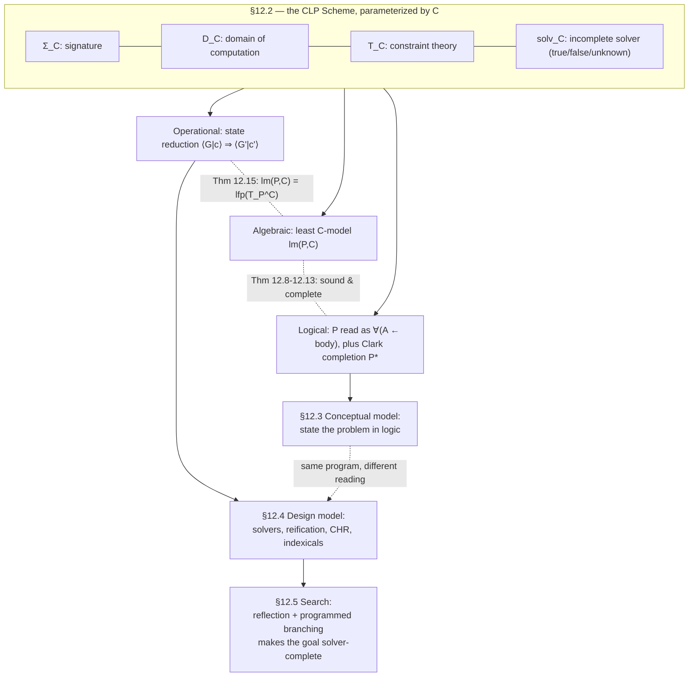

# Constraint Logic Programming

[[book-guidelines|↩ Back to guidelines]]

## Why merge logic programming with constraint solving?

Standard Prolog already looks like it's doing constraint solving: unification is exactly "solve the equation $s = t$ over Herbrand terms." But unification is a *single, fixed* constraint theory — syntactic equality on trees. The moment you want a variable to range over integers with an arithmetic relation (`X + Y #= Z`), or over reals with a linear inequality, plain Prolog has nothing to offer: you'd have to fully instantiate the variables and re-check numerically, which throws away the entire declarative, partial-information style that makes logic programming pleasant.

**Constraint Logic Programming (CLP)** is the generalization that fixes this: keep Prolog's rule-based control structure (definite clauses, SLD-style resolution, backtracking), but let the "equality" step of resolution be *any* constraint domain — booleans, finite domains, linear arithmetic over the reals, feature trees, whatever — as long as that domain comes with a decision procedure. Jaffar and Lassez's 1986 insight was that this generalization is not ad hoc: it can be parameterized cleanly, so that operational, algebraic, and logical semantics all fall out *uniformly* for any choice of constraint domain. That parameterized package is the **CLP Scheme**, and it's the theoretical spine of this chapter.

What breaks without a principled scheme like this: every constraint-domain-specific dialect would need its own bespoke soundness/completeness proof, and there'd be no shared vocabulary for comparing, say, a finite-domain CLP system against a linear-arithmetic one. The CLP Scheme buys genericity — write the metatheory once, instantiate the constraint domain $C$ as a parameter — at the cost (as we'll see in the closing sections) of saying nothing at all about *efficiency*, which becomes CLP's most persistent open problem.

The chapter's own organizing claim is that CLP is simultaneously three things, and the rest of this article is organized around exactly that triple:

1. A **conceptual modeling language** — a way to state a problem precisely, in something close to first-order logic (§12.3).
2. A **design modeling language** — a way to control *how* the statement gets executed efficiently by a solver (§12.4).
3. A language in which the **programmer controls search** directly, because backtracking is inherited from logic programming rather than being a black box (§12.5).

Before any of that, though, we need the semantics that makes all three levels *provably* talk about the same thing.

## 1. History: from unification to "glass-box" solvers

Three independent research threads converged on CLP in the mid-1980s (§12.1):

- **Colmerauer (Marseilles)** — Prolog II (early 1980s) added equations/disequations over rational trees plus `freeze`, the first dynamic-scheduling primitive (delay a goal until its arguments are sufficiently instantiated). Prolog III generalized this to booleans, linear rational arithmetic, and lists.
- **Jaffar and Lassez (Melbourne / IBM Yorktown)** — coined the term *Constraint Logic Programming* in 1986–87 and gave the CLP Scheme its schema and semantics, building on their earlier work on equational logic programming and disequation semantics. Their language CLP($\mathcal{R}$) used an incremental Simplex algorithm and delayed nonlinear constraints until they became linear or ground.
- **Dincbas, Van Hentenryck, and Simonis (ECRC Munich)** — CHIP (1985–88), the first CLP language with genuine **finite-domain** constraints, marrying Prolog's backtracking with AI consistency techniques (arc consistency, etc.).

Two prior research threads made this convergence possible even before the term existed: work generalizing unification to richer equational theories (trying to fuse logic and functional programming), and work generalizing Prolog's rigid left-to-right literal selection into *dynamic scheduling* (Absys, IC-Prolog, Prolog-II, MU-Prolog). CLP is what happens when you let the "equality theory" be arbitrary *and* let literal evaluation be reactive to how constrained a variable currently is.

The chapter frames CLP's subsequent trajectory as a move from **black-box** to **glass-box** solvers: early CLP systems exposed the solver only as a satisfiability oracle (post a constraint, get true/false/unknown back). Later research — indexicals, attributed variables, Constraint Handling Rules, generalized propagation, all covered in §12.4.6 — opened the solver up so the *programmer* could write new propagators, combine solvers, and inspect solver-internal state. This is the single throughline connecting CLP to almost everything else in this handbook: [[Global-Constraints|global constraints]], hybrid solving, and concurrent constraint programming (Chapter 13) were all first incubated inside CLP research.

## 2. Semantics: the CLP Scheme

### 2.1 Parameterizing over a constraint domain

The CLP Scheme defines a family of languages $CLP(C)$, indexed by a **constraint domain** $C$, which packages exactly four things:

| Component | Role |
|---|---|
| $\Sigma_C$ — signature | function/predicate symbols with arities; defines the *terms* and *primitive constraints* of the language |
| $D_C$ — domain of computation | the intended interpretation: a set $D$ plus a mapping from $\Sigma_C$ symbols to actual relations/functions over $D$ |
| $T_C$ — constraint theory | a (possibly infinite) set of first-order formulas describing the *logical* meaning of the constraints |
| $solv_C$ — the solver | a decision procedure: given a conjunction of primitive constraints, returns `true`, `false`, or `unknown` |

Three sanity conditions tie these together: `=` is always present, interpreted as identity, with the standard equality axioms in $T_C$; the solver is insensitive to variable renaming; and $D_C$, $solv_C$, $T_C$ *agree* — $D_C \models T_C$, and if $solv_C(c) = \mathtt{false}$ then $T_C \models \neg\exists c$ (soundness of the "no" answer), while if $solv_C(c) = \mathtt{true}$ then $T_C \models \exists c$ (soundness of the "yes" answer). Note carefully what's *not* required: $solv_C$ need not be a decision procedure in the strict sense — `unknown` is a legitimate third answer, which is exactly what makes the theory apply to genuinely incomplete solvers (finite-domain propagation, interval arithmetic) rather than only to complete ones (Simplex over rationals).

A $CLP(C)$ **program** is a finite set of *rules* $H \mathrel{\texttt{:-}} L_1, \dots, L_n$, where $H$ is an atom over a user-defined predicate and each $L_i$ is either an atom or a primitive constraint from $\Sigma_C$. This is definite-clause syntax, generalized only in that the body can mix ordinary atoms with arbitrary primitive constraints — `X #>= Y` sits in a clause body exactly where `append(X,Y,Z)` would.

```
max(X,Y,Z) :- X #>= Y, Z #= X.        %% M1
max(X,Y,Z) :- Y #>= X, Z #= Y.        %% M2
```

This tiny program (Example 12.3 in the text) is the chapter's running example, and it's worth internalizing: it defines `max` as the *disjunction* of two conjunctions of primitive constraints — logically $\max(x,y,z) \leftrightarrow (x{\ge}y \land z{=}x) \lor (y{\ge}x \land z{=}y)$ — and the two rules are exactly how a CLP system represents "or" (Prolog-style disjunction-via-multiple-clauses is not incidental; it's constitutive of how CLP represents logical disjunction at all, which becomes important in §12.4.3–12.4.4 below).

### 2.2 Operational semantics: derivations as state reduction

This is the layer that actually *executes*. A **state** is a pair $\langle G \mid c \rangle$: a goal $G$ (a sequence of literals still to process) and a constraint store $c$ (a conjunction of primitive constraints accumulated so far). Reduction always rewrites the *leftmost* literal $L_1$ of $\langle L_1,\dots,L_m \mid c\rangle$:

1. $L_1$ a primitive constraint, $solv(c \land L_1) \ne \mathtt{false}$ $\Rightarrow$ $\langle L_2,\dots,L_m \mid c \land L_1\rangle$.
2. $L_1$ a primitive constraint, $solv(c \land L_1) = \mathtt{false}$ $\Rightarrow$ $\langle\,\mid \mathtt{false}\rangle$ (fail).
3. $L_1 = p(s_1,\dots,s_n)$ an atom, and $(p(t_1,\dots,t_n) \mathrel{\texttt{:-}} B) \in \mathrm{defn}_P(p)$ (a *variant* of some rule, freshly renamed) $\Rightarrow$ $\langle s_1{=}t_1,\dots,s_n{=}t_n, B, L_2,\dots,L_m \mid c\rangle$.
4. $L_1$ an atom with no matching rule $\Rightarrow$ fail.

This is a direct generalization of SLD resolution: rule (3) is unification-by-explicit-equality-constraints (the head arguments become primitive `=` constraints rather than being solved by a special-purpose unification algorithm), and rules (1)–(2) are what's genuinely new — every primitive constraint gets *incrementally checked against the accumulated store* rather than merely collected. **This is the single most important operational fact about CLP**: the only place the solver is consulted is to test whether $c \land L_1$ is still satisfiable, given that $c$ already was. This observation — that CLP only ever needs *incremental* satisfiability testing, never satisfiability-from-scratch — is exactly why so much CLP-adjacent research (trailing, copying, semantic backtracking, all in §12.4.1) is about efficient incremental solvers rather than efficient batch solvers.

A **derivation** is a maximal sequence of states from $\langle G \mid \mathtt{true}\rangle$; it's *successful* if it ends at $\langle\,\mid c\rangle$ with $c \ne \mathtt{false}$, and the **answer** is $\exists_{\overline{\mathrm{vars}(G)}} c$ — the store, projected down to the goal's original variables (i.e., existentially quantify away everything introduced during unfolding). If *every* derivation from $G$ fails and there are only finitely many, $G$ **finitely fails**.

**Rust grounding.** This state-reduction relation is small enough to implement almost verbatim, and doing so is clarifying because it forces you to be honest about what a "constraint store" and a "solver" actually are as *types*, not just as mathematical objects:

```rust
/// A primitive constraint over the toy domain: equality/inequality on
/// integer-valued terms, plus user-predicate atoms.
enum Literal {
    /// Primitive constraint, e.g. X #>= Y
    Constraint(Constraint),
    /// atom p(t1, ..., tn) — a call to a user-defined predicate
    Atom { pred: String, args: Vec<Term> },
}

/// The constraint store: conceptually "the conjunction c accumulated so far."
/// solv_c must answer incrementally: does c ∧ new_constraint stay satisfiable?
trait Solver {
    fn check(&self, store: &Store, new: &Constraint) -> SolveAnswer; // True | False | Unknown
    fn extend(&mut self, store: &mut Store, new: Constraint);
}

enum SolveAnswer { True, False, Unknown }

struct State {
    goal: Vec<Literal>,   // <L1, ..., Lm>
    store: Store,         // c
}

fn reduce(state: State, program: &Program, solver: &mut impl Solver) -> Option<State> {
    let (l1, rest) = state.goal.split_first()?;
    match l1 {
        Literal::Constraint(c) => match solver.check(&state.store, c) {
            SolveAnswer::False => None, // <-- state <false>
            _ => {
                let mut store = state.store;
                solver.extend(&mut store, c.clone());
                Some(State { goal: rest.to_vec(), store })
            }
        },
        Literal::Atom { pred, args } => {
            // rule (3): fresh-rename a matching clause, turn head-arg
            // matching into explicit equality constraints prepended to goal
            let clause = program.fresh_variant_matching(pred, args.len())?; // rule (4) on None
            let mut new_goal = clause.head_equalities(args);
            new_goal.extend(clause.body);
            new_goal.extend_from_slice(rest);
            Some(State { goal: new_goal, store: state.store })
        }
    }
}
```

The point of writing this out is not that it's a *complete* CLP interpreter — real systems compile this away entirely — but that the type signature of `Solver::check` is a direct Rust transliteration of $solv_C$'s three-valued contract, and the fact that `extend` is a *separate, mutating* operation from `check` is exactly the incrementality the chapter keeps emphasizing. This is close kin to the incremental constraint-checking your CSP kernel will need: every time your abstract-interpretation-guided search extends a path condition with a new guard, it's doing precisely `solver.check` then `solver.extend` — and the "unknown" branch of `SolveAnswer` is what forces you to reason about *solver completeness* at all (next section).

### 2.3 What "answer" means: three semantics that must agree

The scheme's real payoff is that it gives *three independent* readings of what a successful derivation means, and proves they coincide.

**Logical semantics.** Read each rule $A \mathrel{\texttt{:-}} L_1,\dots,L_n$ as the sentence $\forall(A \leftarrow L_1 \land \dots \land L_n)$, and the program as the conjunction of all its rules, added to $T_C$. Then:

$$
\textbf{Soundness (Thm. 12.8):} \quad P, T_C \models \exists_{\overline{\mathrm{vars}(G)}} c \to G
$$
$$
\textbf{Completeness (Thm. 12.9):} \quad P, T_C \models c \to G \implies \exists\, c_1,\dots,c_n \text{ (answers) s.t. } T_C \models c \to \bigvee_i \exists_{\overline{\mathrm{vars}(G)}} c_i
$$

In words: every answer really does imply the goal (you never get a spurious success), and every logical consequence of the goal is *covered* by some disjunction of answers (the operational semantics doesn't miss solutions). Note what this semantics **cannot** express: it has no negative consequences. From `max(1,2,2)` being derivable you cannot conclude `¬max(1,2,1)` — the rules read only as "if the body holds, the head holds," not "iff."

**Algebraic semantics.** A $C$-interpretation is any interpretation agreeing with $D_C$ on the built-in symbols; a $C$-model is a $C$-interpretation satisfying the program. Every program has a *least* $C$-model $\mathit{lm}(P,C)$ — the most conservative choice, directly analogous to the least Herbrand model of ordinary logic programs — and soundness/completeness theorems (12.12–12.13) again connect this to the operational answers.

**Fixpoint semantics.** The bridge between the two: define the immediate-consequence operator $T_P^C$ on $C$-interpretations by

$$
T_P^C(I) = \{\sigma(A) \mid (A \mathrel{\texttt{:-}} L_1,\dots,L_n) \in P,\; I \models_\sigma L_1 \land \dots \land L_n\}
$$

— read a valuation $\sigma$ satisfying the body as *licensing* the head under $\sigma$, exactly a Modus Ponens/one-step-of-forward-chaining rule. $T_P^C$ is monotone on the complete lattice of $C$-interpretations, so it has a least fixpoint, and **Theorem 12.15** states $\mathit{lm}(P,C) = \mathrm{lfp}(T_P^C)$ — the least model *is* the least fixpoint, obtainable by (transfinite) iteration from the empty interpretation.

This layered structure — operational (how you compute), algebraic (what model it means), logical (what you can prove), fixpoint (an iterative characterization bridging the two) — is worth naming explicitly for the load-bearing role it plays elsewhere in your own project: **it is the same shape of soundness/completeness triangle you need for a type checker or an abductive verifier**. A bidirectional type checker's *operational* semantics is its inference/checking algorithm; its *algebraic* semantics is "what model of the typing judgment does this program denote"; its *logical* semantics is the typing rules read declaratively. Getting all three to provably coincide is exactly the discipline the CLP Scheme is modeling here, just for constraint satisfaction instead of type inhabitation.

### 2.4 Finite failure and the Clark completion

The logical semantics above has no negative consequences, so it cannot justify $\neg G$ from a finitely-failed derivation. The fix is the **Clark completion** $P^\star$: read the rules for predicate $p$ not as separate implications but as one big *biconditional*,

$$
\forall X_1\dots X_n.\; p(X_1,\dots,X_n) \leftrightarrow \bigvee_i \exists \overline{Y_i}\,(X_1{=}t_1^i \land \dots \land X_n{=}t_n^i \land L_1^i \land\dots\land L_k^i)
$$

one disjunct per rule (and `false` if there are no rules for $p$). For the `max` program, $P^\star$ is exactly

$$
\forall X\,Y\,Z.\; \max(X,Y,Z) \leftrightarrow (X{\ge}Y \land Z{=}X) \lor (Y{\ge}X \land Z{=}Y)
$$

— from which $\neg\max(1,2,1)$ *is* derivable. **Theorem 12.19–12.20** give soundness of finite failure unconditionally and completeness *provided the goal is finitely evaluable* (no infinite derivations) and the program is solver-complete for it (see below). The counterexample the chapter gives for why finite evaluability is essential — `q :- q.` with goal `X=2, q, X\=2` — is instructive: the completion correctly entails $\neg G$, but operationally the derivation loops forever on `q` before ever reaching the constraint that would expose the contradiction, because literal selection is fixed left-to-right rather than fair.

**Lean grounding.** The completion is worth stating as an actual Lean proposition, because it makes the "iff, not just if" distinction unmissable — and because reading a rule set as a completion is *exactly* the move Lean's equation compiler makes when it turns a set of pattern-matching equations for a recursive definition into a single characterizing proposition, and it's the same move your elaborator will need when deciding whether a set of Horn-clause-style refinement rules for a predicate is *exhaustive* (i.e., whether the completion is total) before trusting negation-as-failure over it:

```lean
-- The program's rules, read directly (implication only):
theorem max_M1 (x y z : Int) (h1 : x ≥ y) (h2 : z = x) : Max x y z := ⟨Or.inl ⟨h1, h2⟩⟩
theorem max_M2 (x y z : Int) (h1 : y ≥ x) (h2 : z = y) : Max x y z := ⟨Or.inr ⟨h1, h2⟩⟩

-- The Clark completion, read as a biconditional definition — this is what
-- licenses negative reasoning, and it is definitionally what you'd write
-- as the *actual* Lean definition of the predicate in the first place:
def Max (x y z : Int) : Prop := (x ≥ y ∧ z = x) ∨ (y ≥ x ∧ z = y)

example : ¬ Max 1 2 1 := by simp [Max]  -- only provable against the completion
```

The chapter's implicit point generalizes: a set of Horn clauses always has a natural declarative ("if") reading and only *sometimes* an intended "iff" reading, and a language's negation mechanism silently commits to the second. When you design negation-as-failure or a closed-world assumption into a Horn-clause verification-condition generator, you are choosing the Clark-completion reading, and you inherit its caveats (an inconsistent completion, e.g. from `p :- not p.`, giving $p \leftrightarrow \neg p$) exactly as stated here.

### 2.5 Extensions: negation, abduction, ASP, and optimization

Briefly, because these recur later: **SLDNF** (negation-as-failure — a negative literal succeeds if it finitely fails) is sound but only completeness-friendly when the negated literal is ground by evaluation time and the program is solver-complete for it; **constructive negation** (Stuckey's CLP generalization of Chan's work) instead unfolds the negated atom's definition, negates the resulting disjunction via De Morgan, and tries each resulting conjunct — logically cleaner but rarely implemented because it needs solvers that handle negated and universally-quantified constraints. **Abductive CLP** runs the program "backwards": the goal is an observation to be *explained* by hypotheses. **Answer set programming** replaces query reduction with model generation over restricted (typically only `=`) constraint domains. **Optimization** is added via a `minimize(G,E)` subgoal whose intended logical reading is

$$
\mathit{mt}(\mathtt{minimize}(G,E)) \;\equiv\; \exists M\bigl(G \land E{=}M \land \neg\exists_{\overline{\{M\}}}(G \land E{<}M)\bigr)
$$

— "solutions of $G$ for which no other solution makes $E$ smaller" — with soundness/completeness holding when the program is **minimization complete**: the solver can actually compute $\min\{\theta(E)\}$ over each answer, which in practice usually means every answer must fix all variables of $E$.

## 3. CLP for conceptual modeling

A conceptual model states *what* the problem is, as directly and declaratively as possible, without regard for solving efficiency. CLP's two composition primitives map directly onto logical connectives: conjunction is literally clause-body conjunction ($C_1 \mathrel{\texttt{:-}} C_2, C_3$), and disjunction is multiple rules for the same head (§12.4.3 revisits why this specific encoding of disjunction is operationally expensive). A finite classical CSP $\langle X, D, C\rangle$ translates directly:

```
solve(X,Y,Z) :- X :: [1,2,3], Y :: [2,3,4], Z :: [1,3], c1(X,Y), c2(X,Z).
c1(1,2). c1(1,3). c1(2,3).
c2(1,1). c2(2,2). c2(3,3).
```

But this is where the chapter's real argument starts: CLP is *strictly more expressive* than a fixed-arity CSP, along three axes.

**Local (existentially quantified) variables.** `even(X) :- X #= 2*Y.` — `Y` never appears in the head, so it's implicitly $\exists Y$. This lets a constraint's *extent* be infinite (there are unboundedly many even numbers, so `even` can't be represented as an explicit tuple table the way `c1`/`c2` were), and — practically — keeping variables as local as possible to the sub-constraint that needs them can reduce the worst-case complexity of solving the enclosing CSP.

**Recursive constraint definitions.** The `mortgage/5` predicate (relating principal, interest rate, payment, term, and final balance) recurses one time-period at a time, accumulating $3n+2$ primitive constraints for a loan of $n$ periods — a constraint whose very *shape* (how many primitive constraints it unfolds into) depends on runtime data. This is impossible to express as a fixed CSP at all; you'd need a different CSP instance for every value of `Time`. CLP's answer is uniform: one recursive program, instantiated by the solver's incremental unfolding.

**Parametric data structures.** Lists let a model be parametric in problem size. The N-queens formulation is the canonical example:

```
nqueens(N,Queens) :-
    length(Queens,N), Queens :: 1..N,
    alldifferent(Queens), safe(Queens).
safe([Q1|Queens]) :- noattack(Queens, Q1, 1), safe(Queens).
safe([]).
noattack([Q2|Queens],Q1,Diff) :-
    Q1 + Diff #\= Q2, Q1 - Diff #\= Q2,
    Diff1 #= Diff + 1, noattack(Queens,Q1,Diff1).
noattack([],_,_).
```

`safe/1` recurses down the list, checking each queen against every queen still to its right via `noattack/3`, whose growing `Diff` counter encodes "how many rows apart" — exactly what makes the diagonal-attack arithmetic ($Q_1 \pm \mathrm{Diff} \ne Q_2$) correct. One program handles every board size $N$; a raw tuple-based CSP formulation would need to be regenerated per $N$.

**Optimization and soft constraints** piggyback on the same machinery: `minimize(G,E)` for hard optimization, and soft constraints via an extra "violation" argument threaded through the model, e.g. `soft_diff(X,Y,0) :- X #\= Y. soft_diff(X,X,1).` — succeeds always, but tags whether the disequality actually held, so the penalty can be summed into an objective.

## 4. CLP for design modeling

Conceptual correctness is necessary but not sufficient; the *design model* is how you make the conceptual model execute efficiently, without changing its declarative meaning. This section is where "glass box" solver research lives.

### 4.1 Incremental solving and backtracking

Because constraints are checked *as they are generated* (recall §2.2's operational semantics — this is not optional, it's what makes recursive definitions like `mortgage` terminate at all when constraint checking is what stops the recursion), CLP needed incremental solvers from day one, and much of the field's incremental-solver research originates here: incremental equation/disequation solving in Prolog II, incremental dual-Simplex variants in CLP($\mathcal{R}$) that additionally handle strict inequalities and detect ground variables to unlock nonlinear terms, and finite-domain propagation in CHIP (domains shrink as propagators fire, repeated to a fixpoint). Backtracking restoration of solver state uses one of three strategies: **trailing** (inherited from the WAM — log every change, undo on backtrack), **copying** (snapshot the whole solver state, restore by replacing), or **semantic backtracking** (rebuild an equivalent state from high-level change descriptions rather than raw low-level diffs).

### 4.2 Solver completeness is a property of a *goal*, not a solver

This is the chapter's sharpest conceptual point, and it directly answers one of the guidelines' key questions: a solver is called *complete* for a set of constraints if it never answers `unknown`. But whether a **program is solver-complete for a goal** $G$ depends on which answers $G$ actually produces — a Simplex-based solver is complete as long as every constraint it's ever asked about ends up linear; a finite-domain propagation solver is complete once every variable involved is *fixed* to a single value. This is exactly why `labeling/1` (Example 12.2) exists at all: it's not part of the conceptual model of a CSP, it's a design-model device whose *sole purpose* is to drive every variable to groundness so the underlying (incomplete, propagation-based) solver becomes complete *for that particular goal*. Different solvers reach completeness by different routes: a finite-domain solver needs full grounding; a linear-rational Simplex solver needs linearity, not groundness — which is why `mortgage(100,I,60,2,0)` is not solver-complete for *either* kind of solver directly, but an **interval** solver can still narrow `I` to arbitrary precision by bisection even though Simplex cannot, because interval reasoning tolerates nonlinearity that Simplex does not.

### 4.3 Disjunction is expensive when it's naive

Modeling `X :: L` as `member(X,L)` — pure Herbrand-equality backtracking — works but explores every combinatorial branch (162 derivations for the 3-variable example in §12.3.1, vs. 9 with a real finite-domain solver, vs. far fewer still with a `table` construct that keeps the pair `(c1, c2)` arc-consistent as a unit). The lesson generalizes: **the naive encoding of disjunction as multiple clauses is always logically correct and always potentially catastrophic for search size**, which is precisely why §12.4.4–12.4.6 exist — they are all mechanisms for getting disjunctive *information* to propagate without paying for disjunctive *search*.

### 4.4 Reification: propagation without choice points

A **reified constraint** $c[B]$ pairs a constraint $c$ with a Boolean $B$ tracking its truth value, with the ideal contract: propagate $B{=}0$ once $c$ is detected unsatisfiable, $B{=}1$ once $c$ is detected entailed, and conversely impose $c$ (or $\neg c$) once $B$ is fixed. This lets you write

```
max(X,Y,Z) :-
    B11 #= (X #>= Y), B12 #= (Z #= X), B1 #= B11 * B12,
    B21 #= (Y #>= X), B22 #= (Z #= Y), B2 #= B21 * B22,
    B1 + B2 #>= 1.
```

which has *exactly* the same declarative meaning as the two-clause version, but a completely different operational profile: the two-clause version makes a **guess** (try clause M1, backtrack to M2 on failure), while the reified version imposes every constraint immediately and lets propagation do the work — no choice point at all.

But reification has a hard structural limit, and this is the chapter's Example 12.36, which the guidelines flag explicitly: given $X\in[3,8]$, $Y,Z\in[1,10]$, `max(X,Y,Z)`, and $Y \le 6$, we'd like $Z$ narrowed to $[3,8]$, but *no* reified encoding of `max` achieves this — because whether $X\ge Y$ or $X<Y$ is still genuinely unknown, and reified propagation can only fire once one of $B_1, B_2$ becomes decidable. **No definition of `max` built purely from reified primitive constraints can achieve bounds consistency.** This is a real expressiveness ceiling, not an implementation accident: reification decomposes a disjunction into independent per-disjunct Boolean witnesses, and independence is exactly what's lost the moment the disjuncts' truth depends jointly on the same variables.

**Generalized propagation** (§12.4.6, Example 12.38) breaks the ceiling by refusing to decompose at all: it *re-executes the original multi-clause definition* against the current domains, collects every answer's projected domain, and unions them.

```
max(X,Y,Z) :- max_basic(X,Y,Z) infers most.
max_basic(X,Y,Z) :- X #>= Y, Z #= X.
max_basic(X,Y,Z) :- Y #>= X, Z #= Y.
```

Concretely: with $X\in[2,8]$ initially, executing both branches gives $Z\in[3,8]$ (branch 1) and $Z\in[3,10]$ (branch 2), unioned to $[3,10]$; once $Y\le 6$ narrows things, branch 1 still gives $[3,8]$ but branch 2 now gives $[3,6]$, unioned to $[3,8]$ — exactly the bound reification couldn't reach. The structural reason this works where reification fails: generalized propagation never needs to *decide* which disjunct is true; it computes what's true *in every* disjunct simultaneously and only commits to the intersection/union of consequences, which is precisely the "compute over all branches, combine conservatively" pattern you'll recognize from abstract interpretation's collecting semantics — generalized propagation is, in effect, running an over-approximating abstract evaluator over the finite disjunction of concrete branches of a predicate's definition, exactly the shape of reasoning your CSP kernel will need when it evaluates a disjunctive verification condition without committing to a disjunct.

### 4.5 Indexicals and Constraint Handling Rules

**Indexicals** ($X \mathbin{\texttt{in}} r$, $r$ a range expression over other variables' current bounds) are a compiler target for finite-domain propagators: `X #=< Y` compiles to `X in -∞..max(Y), Y in min(X)..∞`. They give the programmer a way to write new propagators at a level above raw domain-manipulation code, and they trace back to concurrent constraint programming (they *are*, in essence, a CCP language `cc(FD)`).

**Constraint Handling Rules (CHR)** generalize this further by allowing the left-hand side of a rule to match *multiple* constraints simultaneously — a committed-choice, forward-chaining rewrite system over the constraint store, with three rule forms (simplification, propagation, simpagation, detailed in Chapter 13). CHR is the chapter's clearest bridge to your term-rewriting/proof-search interests: it is literally a rule-based rewriting engine whose confluence and termination are first-class program properties to be checked, exactly the discipline you'd want for any hand-written rewrite-based constraint or clause simplifier feeding a verifier's core.

Finally, **automatic CHR synthesis** from a disjunctive multi-clause definition (§12.4.6, citing recent research at the time of writing) closes the loop: it mechanically compiles a *conceptual* model into a correct, complete-for-a-fixed-inference-strength *design* model — automating exactly the conceptual-to-design mapping the chapter's introduction singles out as CLP's most distinctive strength.

## 5. Search in CLP

### 5.1 Search is logically transparent

A complete search routine's entire job is to make the goal solver-complete by adding constraints — but it must do so *without changing the goal's logical meaning*. This is worth stating precisely because it resolves an apparent paradox: `indomain(X)`, given $X$'s domain is $l..u$, is logically $x{=}l \lor x{=}l{+}1 \lor \dots \lor x{=}u$ — a tautology relative to $X$'s own domain declaration — so `labeling/1` (which just chains `indomain` over a variable list) is **logically equivalent to `true`**. And yet it's indispensable operationally: each *branch* of the disjunction adds a constraint ($X{=}v$) the root didn't have, and it's exactly that per-branch commitment that eventually forces the solver from `unknown` to a definite `true`/`false`. Search doesn't add information at the level of the whole disjunction; it adds information at the level of each individual path, which is precisely what solver completeness needs.

### 5.2 Reflection: querying solver state to drive heuristics

Because search must be *programmed*, not just parameterized, CLP exposes **reflection predicates** — `get_min/2`, `get_domain_size/2`, `is_in_domain/2`, and friends — that let a program inspect the live state of the constraint store mid-search. These have essentially no clean logical reading (their result depends on solver-internal history, not just on what's logically implied), but that's fine: their only job is to steer *which* logically-transparent branch gets tried first, e.g.

```
indomain_median(V) :-
    get_domain_as_list(V,List), median(List,M), choose(V,M).
choose(V,M) :- V #= M.
choose(V,M) :- V #\= M, indomain_median(V).
```

The value-ordering choice ("try the median first") is heuristic, but the two `choose` clauses together are still just `V #= M ∨ V #\= M` — logically vacuous, operationally decisive.

Because CLP is a higher-order language (goals are first-class arguments), a whole search strategy — variable-choice rule, value-choice rule, exploration method — can be passed as a parameter to a generic search procedure, or hand-written entirely, as in the `label_earliest/1` scheduling heuristic that repeatedly picks the variable with the smallest current lower bound and either fixes it there or excludes that value and retries.

### 5.3 Beyond instantiation: tentative values and local search

Not every search step needs to fix a variable to a single value. A **tentative value** — often produced by solving a *relaxed* version of the problem (e.g. the LP relaxation of an integer program, cheaply solvable at huge scale) — gives a heuristic branching signal without being a hard commitment:

```
branch(Var,Tent) :-
    Up is ceiling(Tent), Var #>= Up.
branch(Var,Tent) :-
    Down is floor(Tent), Var #=< Down.
```

Pushed further, **Localizer**-style systems propagate tentative-value *updates* — recomputing $Z$'s tentative value whenever $X$ or $Y$'s tentative values change, for a constraint $Z = X+Y$ — turning the same constraint-graph machinery into a substrate for hill-climbing, simulated annealing, and tabu search (Chapter 5) rather than tree search. The unifying idea across both uses of tentative values: **a value doesn't have to be provably correct to be useful for guiding search** — it only has to be cheap to compute and correlated with quality.

### 5.4 Optimization via search

`minimize(G,E)` composes with any of the above. The default strategy is branch-and-bound: each time a strictly better answer is found, add a constraint forcing subsequent solutions to beat it, and keep searching the same tree. The alternative — restart the whole search from scratch with the new bound as an added constraint — can behave better precisely when the variable-ordering heuristic is itself sensitive to the current bound, since restarting lets the heuristic re-derive an ordering informed by the tighter constraint rather than being stuck inside a branch chosen under stale information.



## 6. Impact, and the honest weaknesses

The chapter closes by tracing how much of the rest of this handbook is CLP's own offspring: **global constraints** (Chapter 6) were first introduced inside CLP; **cooperating/hybrid solvers** combining propagation, Simplex, and MIP trace to CLP research (and ECLiPSe was explicitly built to support this); **constraint databases** grew out of reading the fixpoint semantics of §2.3 as a bottom-up deductive-database evaluation strategy; **concurrent constraint programming** (Chapter 13, Oz/Mozart) generalized CLP by reading the synchronization primitive of concurrent logic languages as constraint *entailment*; and industrial modeling languages like OPL are, per the chapter's own assessment, "a (very) restricted CLP language."

But the chapter is equally direct about what's unresolved, and this is worth taking seriously rather than as a coda: CLP's declarative semantics is *silent about cost*. Two design models with wildly different runtime behavior — the naive `max` and its reified or generalized-propagation cousins — have **identical** logical, algebraic, and fixpoint semantics. The theory that makes CLP elegant (§2) is precisely the theory that gives you no tool for comparing implementations. A programming semantics that accounts for optimization, reflection, search, and constraint handling *together*, and that lets two solver-complete-for-the-same-goal design models be compared for efficiency, is the chapter's own stated open problem — work on propagator semantics is called out as a partial start.

## Where this leads

Chapter 12 is upstream of Chapter 13 ("Constraints in Procedural, Concurrent, and Rule-Based Languages" — CHR and CCP get their full formal treatment there) and Chapter 14 ("[[Finite-Domain-Constraint-Programming-Systems|Finite Domain Constraint Programming Systems]]" — the propagator/scheduler architecture that CLP's finite-domain solvers implement under the hood). It's also the *conceptual* ancestor of every "declarative model + programmable search" system covered later in the handbook, including the modeling-language chapters and the OR-integration chapter.

For the compiler/elaborator project specifically, three load-bearing connections are worth carrying forward explicitly:

- **The three-layer semantics discipline (operational/algebraic/logical, bridged by a fixpoint construction) is the exact template** you need for your own elaborator and Horn-clause verifier: an operational unification/constraint-generation algorithm, an intended model of what a judgment or refinement predicate denotes, and a declarative reading connecting them — with the Clark-completion move as the specific device you'll need whenever you want negation-as-failure or a closed-world default over a predicate defined by multiple Horn-style rules.
- **Generalized propagation's "evaluate every disjunct, union the consequences without committing" pattern is abstract interpretation's collecting semantics in miniature** — this is a genuinely concrete, worked example (Example 12.36/12.38 above) of exactly the over-approximation-without-choice-points reasoning your CSP kernel needs when it propagates through a disjunctive guard without branching, and it comes with a precise account of *why* the weaker (reified) alternative provably falls short.
- **The search layer's central theorem — that a complete search strategy is logically equivalent to `true`, and only adds information branch-by-branch — is the right mental model for CEGAR-style counterexample search**: your CSP kernel's job of finding concrete satisfying assignments that violate a type invariant is structurally `labeling`-over-refinement-constraints, and the "solver completeness is a property of a goal, not a solver" distinction (§4.2) is precisely the question you'll need to answer for each class of refinement constraint (linear arithmetic vs. algebraic-datatype/DFA-shaped domains) before trusting a `false` result from your solver as a genuine proof rather than an `unknown`.
