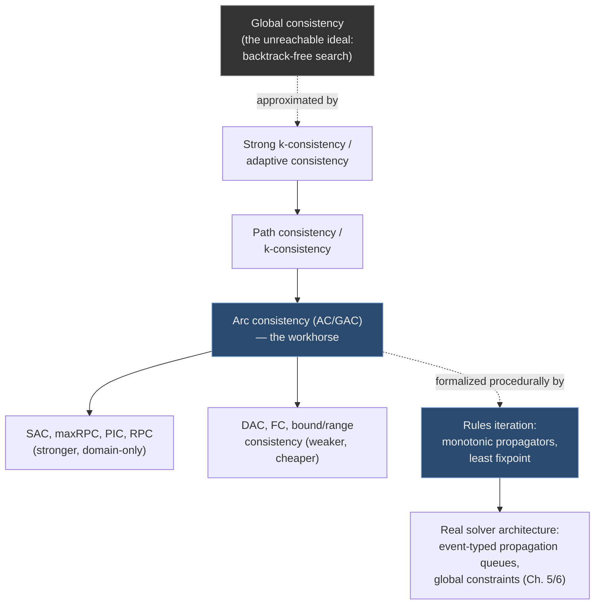

# Constraint Propagation and Local Consistency

[[book-guidelines|↩ Back to guidelines]]

## Why propagation exists at all

A CSP is $\langle X, D, C \rangle$: variables, their domains, and constraints relating them. The naive way to solve it is to enumerate the whole search space $\Omega = \bowtie_i D_i$ — the relational join of every domain — and test each candidate tuple against every constraint. That space is exponential, and testing it point by point is exactly what "NP-complete" warns you not to do.

[[Backtracking-Search|Backtracking search]] improves on this by extending a *partial* assignment one variable at a time, backing up on failure. But naive backtracking still walks into the same dead end over and over — Bessière's chapter opens with a crossword-puzzle example: if you're filling a 6-letter slot and you've already fixed the second letter to 'R', you shouldn't even *consider* NORWAY or SWEDEN as candidates for the rest of the puzzle. If your search doesn't notice this until it's deep inside a doomed branch, it thrashes — it re-derives the same local failure across many syntactically different partial assignments.

**Constraint propagation is inference, not search.** Instead of discovering "this combination fails" by trying it, propagation asks: *given what I already know about legal values, what can I rule out before I even attempt an assignment?* If $x_1, x_2 \in \{1,\dots,10\}$ and $|x_1 - x_2| > 5$ holds, propagation immediately removes $5$ and $6$ from both domains — no search needed, because no consistent value 5 or 6 could ever survive contact with that constraint. This is what Freuder's epigraph at the top of the chapter means by propagation being "more satisfying" than search: it's deductive, not exploratory.

[[Applications-Configuration-Networks-and-Bioinformatics#What breaks without it|What breaks without it]]: pure backtracking rediscovers the same nogood (a doomed partial assignment) exponentially many times across the search tree, because it has no mechanism for remembering "this failed for a *structural* reason, not an accidental one." Propagation makes that structural reason explicit, once, as a domain reduction, and every future branch inherits it for free.

## Two lenses on the same idea

Bessière frames the entire chapter around a single formal move: everything in constraint propagation is either

1. **A local consistency** — a *declarative* property: "the network *has* this property" — silent on how you got there, or
2. **Rules iteration** — a *procedural* characterization: "apply this propagator repeatedly until nothing changes" — silent on what global guarantee results, except by proof.

This mirrors a distinction you already know from type-checking: a typing judgment $\Gamma \vdash e : \tau$ is a declarative *specification* of well-typedness, while a bidirectional type-checking algorithm is the *procedure* that decides it. Constraint propagation research spent thirty years working out, for a given local consistency, whether a cheap, terminating, confluent set of reduction rules computes it — exactly the question you ask when you build a type checker from typing rules.

### Formalizing "network gets tighter"

Constraint propagation only ever *removes* possibilities — it tightens a network $N = (X,D,C)$ without ever discarding an actual solution. Bessière formalizes "network $N'$ is at least as informative as $N$" with a preorder:

$$N' \preceq N \iff X_{N'} = X_N \text{ and every locally-inconsistent instantiation in } N \text{ is also locally inconsistent in } N'.$$

The space $\mathcal{P}_N$ of all tightenings of $N$ is what propagation is allowed to move within. At the top of $\mathcal{P}_N$ (least informative) sits $N$ itself; at the bottom sit networks with empty domains (maximally informative — they prove unsatisfiability). The subset $\mathcal{P}_N^{sol}$ contains tightenings that don't lose any solutions.

The theoretical best case is a **globally consistent network**: one where *every* locally consistent partial instantiation extends to a full solution. On such a network, brute-force backtracking is backtrack-free — it never fails. But building one is provably as expensive as generating and storing every minimal nogood of the original problem: exponential in general. So the entire field is really about finding cheap, polynomial-time approximations to global consistency — points in $\mathcal{P}_N^{sol}$ that are *as close as possible* to the unreachable ideal at reasonable (usually polynomial) cost.

### The closure operator: what "achieving" a consistency means

A local consistency $\Phi$ is any property of a network that's necessary (not sufficient) for membership in a solution. If $\Phi$ is *stable under union* — the union of two $\Phi$-consistent domains is still $\Phi$-consistent — then a beautiful fact follows: among all $\Phi$-consistent tightenings of $N$, there is a **unique smallest one**, $\Phi(N)$, the $\Phi$-closure. And it's computable by the dumbest possible algorithm: repeatedly delete any value that violates $\Phi$, until nothing more can be removed. Order of deletion doesn't matter — you always converge to the same fixpoint. This is precisely a confluent, terminating rewriting system, and "enforcing $\Phi$-consistency" just means computing this fixpoint.

This is the mathematical backbone that makes every algorithm in the rest of the chapter well-defined: as long as your consistency property is stable under union, *any* correct implementation computes the same answer, so engineers are free to optimize the "how" without touching the "what."

```rust
// The Φ-closure abstraction, sketched as a trait. Any local consistency that is
// stable under union can be computed by "keep deleting violators until fixpoint" —
// the *specific* revision strategy is an implementation detail, not part of the spec.
trait LocalConsistency {
    /// Is (variable, value) still consistent with Φ given the current domains?
    fn violates(&self, domains: &Domains, var: VarId, val: Value) -> bool;
}

fn enforce_closure<C: LocalConsistency>(consistency: &C, mut domains: Domains) -> Domains {
    loop {
        let mut changed = false;
        for var in domains.vars() {
            domains.retain_values(var, |val| {
                let keep = !consistency.violates(&domains, var, val);
                changed |= !keep;
                keep
            });
        }
        if !changed { break; }
    }
    domains
}
```

## Arc consistency: the baseline

**What breaks without it:** even node consistency (each value individually satisfies unary constraints, i.e. domain restrictions) says nothing about how a value interacts with *binary* constraints. A value can be locally fine and still have no partner anywhere.

**Definition 3.24 ((generalized) arc consistency).** A value $v_i \in D(x_i)$ is *consistent* with constraint $c$ if there's a valid tuple $\tau$ satisfying $c$ with $\tau[x_i] = v_i$ — such a $\tau$ is a **support**. The network is arc consistent (AC) — or generalized arc consistent (GAC) for non-binary $c$ — iff every value of every variable has a support on every constraint it's involved in.

Concretely: if $c_{12} \equiv (x_1 = x_2)$ and $c_{23} \equiv (x_2 < x_3)$ with all domains $\{1,2,3\}$, AC removes $(x_2,3)$ (no larger value in $D(x_3)$), removes $(x_3,1)$, and the removal of $(x_2,3)$ then removes $(x_1,3)$ via $c_{12}$ — a cascade, which is exactly why propagation needs a worklist, not a single pass.

**A subtlety worth internalizing**: AC and 2-consistency (every pair of values from two variables extends consistently to each other) *look* equivalent, and are, on normalized binary networks. But drop either restriction and they diverge. Two constraints $x_1 \le x_2$ and $x_1 \ne x_2$ over the same pair are AC (every value has *some* support, possibly on a different constraint) but not 2-consistent (e.g. $x_1=3$ can't extend at all). This is a "the map is not the territory" trap: notation convenient for binary normalized networks silently smuggled in an equivalence that doesn't hold in general — a reminder to always check what invariants a simplifying assumption is quietly carrying.

### Why AC is intractable in general — and why that matters practically

Five decision/computation questions about AC are formalized (GacSupport, IsItGAC, NoGacWipeOut, MaxGAC, GacDomain), and **all five are NP-hard in general**, with a dependency lattice among them (Theorem 3.26): if `GacSupport` is hard for a constraint class, so is `NoGacWipeOut` and `GacDomain`; `MaxGAC` hardness implies `GacSupport` hardness; `IsItGAC` hardness implies `MaxGAC` hardness. This is the CSP-propagation analogue of NP-hardness reductions you know from complexity theory — and it's the load-bearing reason [[Global-Constraints|global constraints]] (Chapter 5/6 material — `alldifferent`, `regular`, etc.) exist at all: for *specific* constraint semantics, GAC often collapses to polynomial via combinatorial structure (matching theory, DFA reachability) even though the *generic* black-box question is NP-hard. Knowing *which* semantics buy you tractability is the entire craft of designing propagators.

### The algorithm lineage: AC-3 → AC-4 → AC-6 → AC-2001

This sequence is a case study in a recurring systems tradeoff: **how much memory do you spend remembering *why* something is consistent, to avoid re-deriving it?**

- **AC-3** (Mackworth): the simplest. Maintain a worklist $Q$ of `(variable, constraint)` pairs possibly no longer consistent. Pop one, call `Revise`, which scans the *entire* domain of the neighbor looking for a support for each value, removing unsupported ones. If anything changed, re-add every other arc touching that variable. $O(ed^3)$ time on binary networks, $O(e)$ space. Its flaw: `Revise` remembers nothing between calls, so it re-derives the same constraint checks repeatedly (Bessière's worked example: 10+4 checks initially, then 9 more checks on a re-revision where only 1 is actually new information).

- **AC-4** (Mohr & Henderson): the opposite extreme. Precompute, for every `(xi, vi, xj)` triple, a `counter` of how many supports `vi` has on `cij`, plus reverse-lookup lists `S[xj, vj]` of everyone `(xj,vj)` currently supports. Deletions just decrement counters — **zero constraint re-checks** during propagation. Optimal $O(ed^2)$ time, but pays for it with $O(ed^2)$ space and an expensive up-front initialization that, empirically, is often the actual bottleneck. This is a fine-grained algorithm — it propagates value-by-value, not constraint-by-constraint.

- **AC-6** (Bessière & Cordier): the compromise. Instead of counting *all* supports, track only the *current* (smallest) one per value — a single pointer, not a count. On deletion, look for the *next* support lazily, starting where you left off. $O(ed^2)$ time, $O(ed)$ space — same asymptotic time as AC-4 with linear (not quadratic) space. The "remember only one witness, refresh it lazily" pattern here is structurally the same idea as watched literals in SAT solvers (the chapter notes this explicitly — Moskewicz et al.'s Chaff independently reinvented it).

- **AC-2001/AC-3.1**: the coarse-grained optimum. It keeps AC-3's simple arc-oriented worklist architecture (which real solver internals are built around) but stores a `Last[xi, vi, xj]` pointer — the smallest known support — so that `Revise` never re-scans values below `Last`. This achieves AC-4/AC-6's optimal $O(ed^2)$ time *without* AC-4's memory blowup or AC-6's fine-grained value-level bookkeeping, which is why it became the de facto standard in modern solvers.

```rust
// AC-2001-style Revise: the key optimization over AC-3 is `last_support`,
// a per-(xi, vi, xj) pointer that prevents re-scanning values already
// proven to have no support.
struct Ac2001<'a> {
    domains: &'a mut Domains,
    last_support: HashMap<(VarId, Value, VarId), Value>,
}

impl<'a> Ac2001<'a> {
    /// Revise xi against binary constraint c_ij. Returns true if D(xi) changed.
    fn revise(&mut self, xi: VarId, xj: VarId, c: &BinaryConstraint) -> bool {
        let mut changed = false;
        for vi in self.domains.values(xi).collect::<Vec<_>>() {
            let last = self.last_support.get(&(xi, vi, xj)).copied();
            // Only re-search if the previously known support is now gone.
            if last.map_or(true, |vj| !self.domains.contains(xj, vj)) {
                let search_from = last.unwrap_or(Value::MIN);
                match self.domains.values(xj)
                    .filter(|&vj| vj > search_from && c.satisfies(vi, vj))
                    .next()
                {
                    Some(vj) => { self.last_support.insert((xi, vi, xj), vj); }
                    None => { self.domains.remove(xi, vi); changed = true; }
                }
            }
        }
        changed
    }
}
```

## Higher-order consistencies: stronger than AC by touching the constraint graph

AC only asks "does this value have *some* support?" It says nothing about whether a *pair* of supports for two different variables is jointly consistent with a third. That's what higher-order consistencies buy — at the cost of potentially creating **new constraints** (edges) that didn't exist in the original network. This is the key structural difference from Section 3.5's "stronger than AC" family below: k-consistencies alter the constraint *graph* topology; domain-based consistencies never do.

**Path consistency** (Montanari): a pair $(v_i, v_j)$ is path consistent if *every* path of binary constraints between $x_i$ and $x_j$ admits a compatible chain of values from $v_i$ to $v_j$. Montanari showed it suffices to check paths of length 2 (**2-path consistency**) — checking every intermediate third variable directly, rather than every path — which is equivalent but far more tractable to state as an algorithm. Path consistency can *manufacture* new binary constraints (e.g. turning $\{x_1 \ne x_2, x_2 \ne x_3\}$ into an explicit $x_1 \ne x_3$) — meaning it can force you to materialize a constraint extensionally even when it started life as a cheap arithmetic formula. That's a genuine implementation cost, not just a theoretical nuisance.

**k-consistency** (Freuder) generalizes this: any locally consistent instantiation of $k-1$ variables extends consistently to *any* $k$-th variable. **Strong $k$-consistency** means $j$-consistency holds for every $j \le k$ simultaneously — which is what actually lets you build a solution incrementally without ever backtracking. The chapter proves the natural endpoint: **strong $n$-consistency (n = number of variables) implies global consistency** — i.e. cranking $k$ all the way up recovers the ideal object from Section 3.2, at the expected exponential cost ($O(n^{n-1}d^{n-1})$ space).

Between "just AC" and "full global consistency" sits **adaptive consistency** (Dechter & Pearl): rather than uniformly enforcing $k$-consistency everywhere, it tailors the consistency level *per variable*, based on how many earlier-ordered neighbors it has. This is dynamic-programming-flavored — same idea as processing a DAG in topological order and only carrying forward exactly the state each node needs — and it guarantees backtrack-free search along that specific variable ordering, without the uniform blowup of strong $k$-consistency.

Montanari also asked a sharper question: which networks admit an *equivalent* representation as a globally consistent **binary** network — decomposability in the sense of Montanari. Building this "minimal network" was dubbed the *central problem*, and there's a subtle, important negative result here: **even given the minimal network, generating a single solution from it is not backtrack-free**, unless $\Pi_2^P = \Sigma_2^P$ (a complexity-theoretic collapse essentially as unlikely as $P = NP$). This directly undercuts an intuition programmers often bring from SAT/SMT: "if I've already done all the propagation, search should be trivial." Propagation reduces search cost; it does not, in general, eliminate it, even at the theoretical maximum of pairwise consistency.

### Constraint-based (not variable-based) higher-order consistencies

A second family, due to Janssen, Gyssens, Jégou, Dechter and van Beek, reformulates higher-order consistency in terms of *constraints* rather than variable tuples — pairwise consistency, k-wise consistency, hyper k-consistency, relational $(i,m)$-consistency. The design tension they navigate is the same one that shows up in your dependent-type-checker's context-management: enforcing consistency by generating new constraints on subsets of a large-arity constraint's scheme can create up to $2^{|X(c)|}$ subconstraints — the price of not touching the "outer" hypergraph topology is potentially exponential blowup *inside* one scheme.

## Domain-based consistencies stronger than AC (without touching the constraint graph)

These trade the k-consistency family's willingness to add new edges for a promise: only domains shrink; the constraint set $C$ never changes. That keeps propagators reusable and constraint semantics stable, at the cost of being intrinsically weaker than full path/k-consistency for the same computational budget.

- **Restricted Path Consistency (RPC)** — the key insight: don't check path consistency for *every* pair; only check it for a pair $(v_i,v_j)$ when $(x_i,v_i)$ has $(x_j,v_j)$ as its **only** support on $c_{ij}$. If that unique-support pair turns out path-inconsistent, $v_i$ has no other way to survive, so it can be safely deleted — all without ever materializing a new binary constraint. Cheap targeted reasoning, not blanket path consistency.
- **Path Inverse Consistency (PIC)** — the "inverse" framing of k-consistency: instead of "any instantiation of $k-1$ vars extends to a $k$-th," ask "any single value extends consistently to $k-1$ *specific* other variables." PIC is 3-inverse consistency, and strictly stronger than RPC.
- **max-Restricted Path Consistency (maxRPC)** — strengthens RPC by requiring that *some* support for $(x_i,v_i)$ on $c_{ij}$ (not just the currently unique one) be path-consistent on every third variable. Strictly stronger than PIC.
- **Neighborhood Inverse Consistency (NIC)** — every value must extend consistently across a variable's *entire* neighborhood at once, not just triangles. Notably, NIC is the one consistency in this family whose strength depends on network *topology* in a way the others don't: adding a semantically-vacuous universal constraint between two previously unconnected variables changes what NIC can prove, purely by enlarging a neighborhood — a fragility the chapter flags explicitly as a downside.
- **Singleton Arc Consistency (SAC)** — conceptually the simplest and strongest of this family, and worth dwelling on because it's a direct ancestor of a technique your CSP-kernel design will want: *for every value, tentatively assign it, run AC on the resulting subproblem, and if AC wipes out any domain, that value is a nogood — remove it.* This is exactly a bounded one-step lookahead / probing strategy — the same shape as "assign a candidate, propagate, check for contradiction" that CEGAR-style refinement loops and unit-propagation-based CDCL both use, just applied to arbitrary finite-domain CSPs instead of Boolean formulas. Naively this is $O(en^2d^4)$ (SAC1: recheck everything after every deletion), but smarter incremental variants (SAC2, SAC3, SAC-Opt) close much of that gap.

The strength ordering is strict: $\text{SAC} \succ \text{maxRPC} \succ \text{PIC} \succ \text{RPC} \succ \text{AC}$.

## Domain-based consistencies weaker than AC

Two independent motivations produced consistencies *below* AC — and both are still load-bearing in real solvers, because full AC is sometimes simply too expensive per node of search.

**Reducing how often you re-check.** These exploit some extra structure — usually a variable ordering — to avoid redundant revision:

- **Directional Arc Consistency (DAC)**: fix an ordering $o$ and only require $x_i$ to be AC on $c(x_i,x_j)$ when $x_i <_o x_j$. Because later variables in the ordering can never invalidate an earlier one's consistency (by construction), DAC needs **no propagation worklist at all** — one backward sweep through the ordering suffices, $O(ed^2)$.
- **Forward Checking (FC)**, read as a local consistency rather than a search heuristic: whenever a variable is instantiated (singleton domain), every not-yet-assigned neighbor is made AC against it. Because the assigned variable's domain is a singleton, it can never lose its one support later, so **each constraint needs revising at most once per branch** — this is precisely why FC is cheap ($O(ed)$ per node) and precisely why it's *weaker*: it never re-verifies AC as *other* variables' domains shrink further down the branch.
- **Partial/Full Lookahead (PL/FL)**: strictly between FC and full AC, but — notably — they have no clean fixpoint characterization the way DAC and FC do; they're defined operationally, by what the algorithm does, not declaratively, by what property holds afterward. This is the chapter's clearest illustration that the "rules iteration" and "local consistency" lenses can come apart: some real propagation techniques only really exist as procedures.

**Reducing the cost per check**, by exploiting the fact that domains are (totally ordered) integers instead of opaque finite sets:

- **bound(Z) / bound(D) / range consistency**: instead of demanding a support exists for *every* value, only demand supports for the domain's *minimum and maximum* (or, for range consistency, still every value, but the support tuple only has to respect the neighbors' bounds, not their actual domains). This turns "search $d$ values" into "search 2 values," a real constant-factor win — *when* checking a bound support is itself cheap.

That "when" hides a landmine worth internalizing precisely because it cuts against intuition: **Proposition 3.73 proves bound(Z) consistency can be exponentially harder to decide than plain AC**, even on a *binary* constraint, if the constraint has no exploitable arithmetic structure — the interval you have to search, $[\min, \max]$, can be exponentially large in the size of its binary encoding. Weaker-looking consistencies are not automatically cheaper; they're cheaper *only* when the constraint's own semantics (e.g. a `sum` constraint's arithmetic structure, where bound-checking degenerates to simple inequality checks) make bound-reasoning collapse to something tractable. This is the same lesson linear arithmetic theories teach an SMT solver builder: the *theory* of the constraint, not the *shape* of the consistency notion, is what determines tractability.

## Constraint propagation as iteration of reduction rules

Local consistency told you the destination. Rules iteration tells you how to walk there — and, crucially, gives conditions under which *any* walking order reaches the same destination.

**Definition 3.75 (propagator).** A propagator for constraint $c$ is a function $f$ that only tightens the domains of $c$'s scope, independent of any other constraint. Propagators are the atomic units solvers actually implement — one per constraint (or per constraint family), each responsible only for its own local slice of pruning.

Three properties determine whether iterating a set of propagators is well-behaved:

$$\text{monotonic: } N_1 \le N_2 \implies f(N_1) \le f(N_2) \qquad \text{idempotent: } f(f(N)) = f(N) \qquad \text{commute: } f(g(N)) = g(f(N))$$

**Proposition 3.80 (least fixpoint):** if every propagator in a finite set $F$ is activated infinitely often during an (otherwise arbitrary) iteration, the process reaches a fixpoint. If every propagator is *monotonic*, that fixpoint is **unique**, regardless of scheduling order — this is the formal justification for why a solver's propagation-queue implementation can freely reorder, batch, or parallelize propagator calls (subject to fairness) and still be provably correct: monotonicity is a confluence guarantee, structurally identical to the Church–Rosser property you'd invoke to justify that a rewriting system's normal form doesn't depend on reduction strategy.

When propagators are additionally idempotent *and* pairwise commuting, you don't even need the generic worklist machinery (`Generic-Iteration`, Algorithm 3.8) that re-adds every propagator that *might* be affected after each step — a single pass applying each propagator exactly once (`Direct-Iteration`, Algorithm 3.9) already reaches the least fixpoint (Proposition 3.81).

```rust
// The propagator abstraction underlying every real finite-domain solver's
// core loop. Monotonicity of every `Propagator` is what makes this loop's
// output independent of the order in which propagators are popped from `queue`.
trait Propagator {
    /// Tighten `domains` in place; return true if anything changed.
    /// Must be monotonic: never *un*-prunes a value once removed.
    fn propagate(&self, domains: &mut Domains) -> bool;
    fn scope(&self) -> &[VarId];
}

fn generic_iteration(domains: &mut Domains, propagators: &[Box<dyn Propagator>]) -> bool {
    let mut queue: VecDeque<usize> = (0..propagators.len()).collect();
    let mut in_queue = vec![true; propagators.len()];
    while let Some(i) = queue.pop_front() {
        in_queue[i] = false;
        if propagators[i].propagate(domains) {
            if domains.any_empty() { return false; } // wipeout: subproblem is inconsistent
            // Re-enqueue every propagator whose scope overlaps the changed variables'
            // constraints — mirrors AC-3's line 12, generalized past pure AC.
            for (j, p) in propagators.iter().enumerate() {
                if !in_queue[j] && p.scope().iter().any(|v| propagators[i].scope().contains(v)) {
                    queue.push_back(j);
                    in_queue[j] = true;
                }
            }
        }
    }
    true
}
```

Bessière closes this section by showing arc consistency itself is just a specific instance: define $f_{i,j}(N)$ as "project constraint $c_j$ onto $x_i$'s domain," and `Generic-Iteration` over the set of *all* such $f_{i,j}$ terminates at exactly the AC closure. Every local consistency in the chapter can, in principle, be recovered this way — the two "lenses" from the opening section are provably two views of the same object, not two competing theories.

### A worked implementation detail: solvers don't propagate blindly

Real solvers refine `Generic-Iteration` further by tagging domain changes with an *event type* — `RemValue`, `IncMin`, `DecMax`, `Instantiate` — so a propagator only re-fires on the kind of change it actually cares about (an interval-arithmetic propagator, say, cares about bound moves, not arbitrary mid-domain deletions). This event-typed dispatch, plus priority-tiered propagation queues (the chapter cites CHOCO's 7-level scheme, cheap propagators popped before expensive ones), is the actual engineering substance behind "AC3-like" schemas in production solvers — worth knowing exists even though it isn't itself a new consistency notion.

## Where this leads



This chapter is the foundation Part I of the handbook builds on: Chapter 4 (backtracking search) is largely about *when* to invoke propagation during search (MAC — maintaining arc consistency — vs. forward checking, as competing points on exactly the weaker/stronger spectrum mapped here); Chapter 5/6 (global constraints, e.g. `alldifferent` via bipartite matching) is the "specific constraints" section (3.8) taken to its logical extreme — combinatorial algorithms replacing generic support-search entirely for constraints with exploitable structure.

**Load-bearing for the CSP-kernel project**: this chapter *is* [[Finite-Domain-Constraint-Programming-Systems#The propagation engine|the propagation engine]] your Rust CSP kernel needs, almost directly. The reduction-rule formalism (Definition 3.74–3.81) is the literal contract your `Propagator` trait must satisfy — monotonicity is what lets you parallelize or reorder propagator dispatch and still trust the fixpoint; the closure-operator view (Theorem 3.19) is the correctness argument you'll cite when proving your solver's domain-reduction phase sound. And SAC's "assign, propagate, check for wipeout" pattern is the direct finite-domain analogue of the counterexample-search half of your CEGAR loop: where abstract interpretation over-approximates to *prove absence* of a bug, this same probe-and-propagate machinery, run over the CSP encoding of a program's guards and invariants, is what *finds* a concrete counterexample when one exists. The complexity results here (Theorem 3.26, Proposition 3.73) are also a standing warning for that kernel: adding "weaker but cheaper"-looking consistency levels is not free lunch — you have to check, per constraint family, that the weaker notion actually degrades gracefully in cost, or you can accidentally build something exponentially *more* expensive than the strong version you were trying to avoid.
