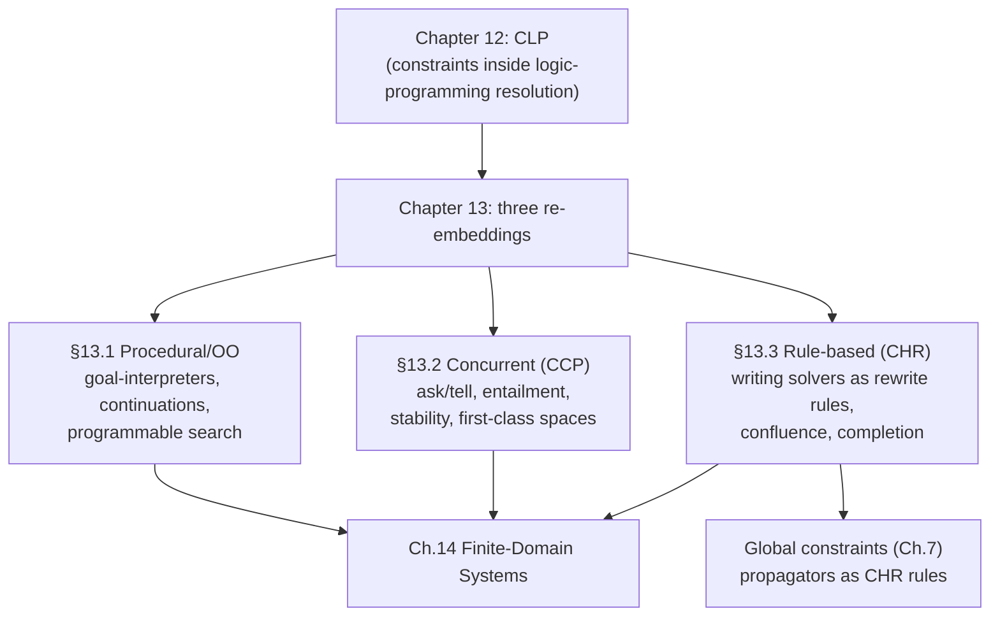

# Constraints in Procedural, Concurrent, and Rule-Based Languages

[[book-guidelines|↩ Back to guidelines]]

## Why does this chapter exist at all?

Chapter 12 gave you CLP: constraints bolted onto Prolog's resolution engine, with unification generalized to arbitrary constraint domains. That's an elegant story, but it's parasitic on logic programming's runtime — SLD resolution, backtracking, a single global store of bindings. The moment you want constraint technology on a mainstream stack (C++ teams, Java shops), or you want *concurrent* agents that must never fully backtrack (an OS scheduler can't "undo" a message it already sent), or you want to *build a solver itself* rather than just use one, CLP's foundation stops fitting. This chapter is about what happens when you rip constraint solving out of the logic-programming host and re-embed it in three different kinds of foreign soil:

1. **Procedural / object-oriented languages** (§13.1) — keep the host language's control flow, bolt a constraint solver and a programmable search engine onto it as a library or DSL.
2. **Concurrent languages** (§13.2) — replace resolution's single-threaded backtracking with agents that communicate over a shared constraint store via **ask** and **tell**, so failure of one agent doesn't have to unwind the world.
3. **Rule-based languages** (§13.3) — stop *using* a constraint solver and instead write one, declaratively, as a set of rewrite rules. This is **Constraint Handling Rules (CHR)**, and it's the part of this chapter with the most direct payoff for building a solver of your own.

The throughline is a shift in what "constraint" means operationally: in §13.1 it's an opaque object you post to a black-box engine; in §13.2 it's a fact you assert into a shared store that other agents can query; in §13.3 it's a term that rewrites other terms. Same declarative content, three very different operational commitments — and each one buys a different kind of control.

---

## Part 1 — Procedural and object-oriented languages (§13.1)

### What breaks when you drop the logic-programming host

Constraint modeling within a procedural language is a good fit — C++ and Java both support first-class expressions (or at least operator overloading) well enough to let a constraint statement *read* declaratively even though it *executes* procedurally. OPL, for instance, "looks procedural but is actually declarative as it is side effect free" — no destructive assignment appears in a model, even though the underlying engine is C++.

**Search is the real casualty.** Logic programming gets non-determinism for free — it's baked into resolution. C++ and Java have no such primitive: no `tryall`, no automatic backtracking, no built-in notion of "try this, and if it fails, try that instead." Every toolkit surveyed here (ILOG Solver, CHOCO) solves this the same way: embed a **goal-oriented interpreter** inside the library that evaluates an and-or tree — or-nodes for non-deterministic choice, and-nodes for conjunction — deliberately mimicking what a logic-programming engine does natively.

```cpp
// ILOG Solver: a goal that tries every value v in [low,up] for variable x
ILCGOAL3(Tryall, IlcIntVar, x, IloInt, v, IloInt up) {
   if (x.isBound()) return 0;
   else if (v > up) fail();
   else return IlcOr(x == v, IlcAnd(x != v, Tryall(getSolver(), x, v + 1)));
}
```

Reading `IlcOr` as "try `x==v`; on backtrack, try `x!=v` and recurse with `v+1`" is exactly reconstructing Prolog's choice-point semantics by hand, inside a language that has no notion of choice points. The chapter is candid about the cost: this and-or interpreter is opaque to a C++ debugger (no access to "current instruction" or bound parameters), every user action during search (printing, stats) has to be wrapped as a goal, and reuse requires *deep-copying* goal data structures because there's no real call mechanism — you're building your own miniature call stack out of heap objects, because the host stack can't hold suspended choice points.

**Comet's fix is more elegant**: instead of an ad-hoc goal interpreter, it uses genuine **first-class continuations** to capture "the rest of the computation" at a choice point.

```
DFS sc();
exploreall<sc> {
  forall(i in Dom) {
    tryall<sc>(v in Dom) { queen[i] = v; }
  }
}
```

A `SearchController` (here `DFS`) just needs `addChoice` (push a continuation onto a stack) and `fail` (pop and resume one). Because continuations are a genuine language primitive rather than a simulated one, the search-node management policy — the "what to explore next" logic — is fully decoupled from the tree topology ("what to explore"), and both are ordinary, debuggable code.

**What this factoring buys you as a compiler builder:** the chapter's split — *topology* of the search tree vs. *node-selection policy* over it — is precisely the split between a proof-search strategy and its heuristics. If your CSP kernel needs to explore counterexample assignments that could violate a refinement-type invariant, you want exactly this separation: a generic tree-walker parameterized by a pluggable "which node next" policy (DFS, best-first, LDS), not a monolithic search loop. Rust gives you a cleaner primitive than either goal-objects or continuations for this: an explicit **worklist/stack of closures or enum-tagged choice points** (a typestate-driven `enum Frame { TryValue(VarId, Val), Backtrack }` with an explicit `Vec<Frame>` as the "continuation stack") — you get Comet's decoupling without needing first-class continuations, because you're managing the stack as data instead of relying on the runtime to reify it.

### Design objectives and the extensibility axis

The chapter frames the whole section around four objectives in tension: *ease of adoption*, *flexibility*, *versatility*, *efficiency*. Two families of answers emerge:

- **Glass-box libraries** (ILOG Solver): constraints are C++ objects implementing a filtering algorithm; you subscribe to variable events (`whenValue`, `whenRange`, `whenDomain`) and react with a `demon` method.

```cpp
class MyEqual : public IlcConstraintI {
  IlcIntVar x, y;
  void post() {
     x.whenValue(equalDemon(getSolver(), this, x));
     y.whenValue(equalDemon(getSolver(), this, y));
  }
  void demon(IlcIntVar x) {
     IlcIntVar other = (x == x) ? y : x;
     other.setMin(x.getMin());
     other.setMax(x.getMax());
  }
};
```
  This is a general filtering-algorithm mindset: you decide *how* propagation happens, event by event.

- **Modeling languages** (OPL, Numerica): raise the abstraction level to the point where the executable model reads like the mathematical statement — at the cost of needing your own solver/VM underneath (OPL's interpreter is itself implemented on top of ILOG Solver).

This is the same glass-box/black-box tension that reappears, sharpened, in §13.3 with CHR — worth holding onto as a throughline.

---

## Part 2 — Concurrent constraint programming (§13.2)

### The problem procedural search *can't* solve: irreversible concurrency

Search assumes you can backtrack — undo a tentative choice and try another. But a concurrent process that has already sent a message to the outside world, or committed an action with observable side effects, **cannot be undone**. An operating system scheduler, or a monitoring loop that's already raised an alarm, has no "undo." So concurrent constraint programming (CCP) needs a computational model where failure of one agent doesn't propagate as a global backtrack.

**The fix: ask-and-tell over a shared, monotonically-growing constraint store**, due to Saraswat. Agents are processes; the store is shared memory, but the *only* two operations on it are:

- **tell($c$)** — assert constraint $c$ into the store (a producer; the store only ever grows).
- **ask($c$)** — block until $c$ is *entailed* by the current store (a consumer; a read that never mutates).

$$
\text{Tell}(c): \quad \langle \text{tell}(c), d\rangle \to \langle \text{true}, c \wedge d\rangle
$$
$$
\text{Ask}: \quad \left\langle \sum_{i=1}^n \text{ask}(c_i) \to A_i,\; d \right\rangle \to \langle A_j, d\rangle \quad \text{if } CT \models d \to c_j
$$

Ask is realized as an **entailment test**, not a lookup — this is the load-bearing distinction. Because the store only grows (monotonicity) and ask only checks logical consequence, agents synchronize *without ever retracting anything*, which is exactly the property procedural [[Backtracking-Search|backtracking search]] lacks. A computation can end **successful** (all agents reduced to `true`), **failed** (store becomes unsatisfiable), or **deadlocked** (some agent is permanently stuck waiting on an ask that will never be entailed) — deadlock being concurrency's distinctive new failure mode, absent from sequential CLP.

**What breaks without ask-and-tell:** if agents communicated via ordinary shared mutable variables (read/write), you'd need locks and get races; ask-and-tell generalizes read/write to *partial* information — an agent can proceed as soon as *enough* is known (entailment), without waiting for a variable to be fully bound. This is precisely the granularity a metavariable-driven elaborator wants: partial constraint information triggering partial progress, not "block until fully instantiated."

### Oz/AKL: what pure CCP is missing, and how they add it back

Pure CCP gives you synchronization but says nothing about *how much* concurrency to use, doesn't support **many-to-one communication** (a stream's tail can only be told once — multiple senders would race to write it), and gives you no way to encapsulate speculative, possibly-failing sub-computations. Oz and AKL patch all three:

- **Ports and names.** A *port* buffers a stream's tail so many senders can append safely (`send` = tell the current tail equals `cons(msg, freshTail)`, then advance the tail pointer). But a port's tail *changes* — incompatible with a monotone constraint store. Oz's fix is **names**: an unforgeable, opaque reference (like a capability) that indexes into a side compartment mapping names → mutable entities (ports, cells). The constraint store only ever knows "this name exists"; the *mutation* lives outside the logical store entirely. This is a clean illustration of a general pattern: keep the logical/monotone core pure, and push anything genuinely stateful into an explicitly-tagged escape hatch.
- **Cells** are the primitive mutable-state construct (name + swappable content); ports, and later objects, are built from cells plus first-class procedures (closures referenced by name).

### Encapsulation and stability — the mechanism most worth stealing

This is the section with the sharpest payoff for a metavariable/elaboration-shaped project. Oz generalizes AKL's **deep guards** into **first-class computation spaces**: a speculative sub-computation runs inside its own local space; if it fails, only that space dies — nothing propagates upward, unlike a normal CC failure which kills everything.

The open question a space raises is: *when is a speculative computation no longer speculative?* AKL's answer, **stability**, is the key concept:

> A computation is stable once it has reduced entirely to constraints, and those constraints are either entailed or disentailed by the constraints of enclosing spaces — i.e., the computation makes no further speculative assumptions of its own.

Stability generalizes entailment to whole computations, and — crucially — it's **monotonic**: once stable, a space stays stable no matter what other spaces do later. That monotonicity is what makes it a safe synchronization criterion in a concurrent setting; you never have to "unstabilize."

```
Operations on first-class spaces:
  NewSpace : Script → Space      -- start a speculative computation
  Ask      : Space → Status      -- block until stable; returns failed/solved/alternatives
  Access   : Space → Solution    -- read out the answer of a solved space
  Clone    : Space → Space       -- copy a space (needed to explore >1 alternative)
  Commit   : Space × Int → Unit  -- pick one alternative, discarding the others
  Inject   : Space × Script → Unit
```

With these six operations, an entire search engine becomes ~10 lines of user code:

```
fun {All S}
   case {Ask S}
   of failed then nil
   [] solved then [{Access S}]
   [] alternatives then C={Clone S} in
      {Commit S 1} {Commit C 2}
      {Append {All S} {All C}}
   end
end
```

**Why this matters for a Rust-based elaborator/CSP kernel:** this is a direct, working precedent for "programmable search as a first-class value" rather than a hard-wired engine — exactly what a metavariable-resolution or counterexample-search component needs when it must support multiple [[Finite-Domain-Constraint-Programming-Systems#Exploration strategies|exploration strategies]] (DFS for proof search, best-first for optimization, parallel/portfolio search for a SAT/SMT-style CSP backend) *without* hard-coding one traversal order into the kernel. `NewSpace`/`Clone`/`Commit` map naturally onto a Rust design where a "search node" owns an immutable snapshot of the constraint store (e.g. via persistent/copy-on-write union-find or interval domains) and `Clone` is genuinely cheap because the store is structurally shared — the same trick that makes Gecode (mentioned by name in the text as directly inspired by this idea) and Comet's continuations efficient in practice.

---

## Part 3 — Rule-based constraint languages: Constraint Handling Rules (§13.3)

### The idea: stop using a solver, write one

Sections 13.1 and 13.2 both treat "the constraint solver" as a given black box you program *against*. CHR flips that: it's a language for writing the solver **itself**, declaratively, as rewrite rules over a multiset of constraints — a "glass-box," in contrast to CLP's traditional hard-wired "black-box" solvers written in low-level procedural code. This is the section most worth internalizing if the compiler project's CSP kernel is meant to support pluggable domain propagators, because CHR *is* a domain-specific language for exactly that: writing propagators as declarative rules and getting termination/confluence/completeness theorems about them essentially for free.

CHR distinguishes **built-in constraints** (trusted, opaque, e.g. syntactic `=`) from **CHR (user-defined) constraints**, which the program's rules define. There are three rule forms, all operating on a shared multiset ("the store"):

$$
\begin{aligned}
\text{Simplification:} \quad & \mathit{Name} \;@\; H \Leftrightarrow C \mid B \\
\text{Propagation:} \quad & \mathit{Name} \;@\; H \Rightarrow C \mid B \\
\text{Simpagation:} \quad & \mathit{Name} \;@\; H \setminus H' \Leftrightarrow C \mid B
\end{aligned}
$$

$H$ is the head (a conjunction of CHR constraints to match), $C$ the guard (a check against built-ins — *not* asserted, only tested), $B$ the body. **Simplification replaces**: matched head constraints are removed and $B$ is added, preserving logical equivalence — this is a directed reading of a *biconditional* ($X{\le}Y \wedge Y{\le}X \Leftrightarrow X{=}Y$). **Propagation adds without removing**: $B$ is added alongside $H$ — a directed reading of an *implication* ($X{\le}Y \wedge Y{\le}Z \Rightarrow X{\le}Z$), used to derive logically-redundant-but-operationally-useful consequences that can trigger further simplification. Simpagation is syntactic sugar mixing both: keep $H$, remove $H'$.

```
reflexivity  @ X≤X            ⇔ true
antisymmetry @ X≤Y ∧ Y≤X      ⇔ X=Y
transitivity @ X≤Y ∧ Y≤Z      ⇒ X≤Z
```

Given the goal $A{\le}B \wedge C{\le}A \wedge B{\le}C$, transitivity derives $C{\le}B$, which then lets antisymmetry collapse the whole cycle down to $A{=}B{=}C$ — three rules, purely local, discover a global consequence (a cycle in $\le$ forces equality) with no explicit control flow written anywhere. That "no explicit control flow" property is the entire point of CHR.

### Why this maps directly onto refinement-type constraint generation and solving

This is the single most load-bearing correspondence in the chapter for the stated project. Refinement-type inference is, structurally, exactly this pattern: **constraint generation** emits a conjunction of subtyping/entailment obligations over refinement predicates (a "head" multiset), and **constraint solving** simplifies/discharges them via domain-specific rewriting until a fixpoint. CHR's simplification/propagation split is a ready-made formalization of "solve" vs. "derive a redundant-but-useful fact that unblocks another solve step" — precisely the difference between substituting a solved metavariable and *propagating* a bound that doesn't yet fully solve anything (interval narrowing being the canonical instance below).

### Operational semantics: two transition rules, that's the whole engine

$$
\textbf{Simplify:}\quad \text{if } CT \models \forall(G_{bi} \to \exists\bar x (H = H' \wedge C)) \;\text{ then }\; (H' \wedge G) \mapsto (B \wedge G \wedge H{=}H' \wedge C)
$$
$$
\textbf{Propagate:}\quad \text{if } CT \models \forall(G_{bi} \to \exists\bar x (H = H' \wedge C)) \;\text{ then }\; (H' \wedge G) \mapsto (H' \wedge B \wedge G \wedge H{=}H' \wedge C)
$$

Applicability is a *match-and-entail* test: find constraints in the current goal matching a rule's head, check the guard follows from what's already known, then commit — irrevocably (CHR is **committed-choice**, no backtracking on which rule fired). Non-termination of naive propagation is headed off by applying each propagation rule *at most once* to the same constraints — otherwise `transitivity` above would refire on its own output forever.

### Confluence: the property that makes "declarative" actually true

A rewriting system is only safely "declarative" if rule-application order doesn't affect the *meaning* of the final answer (it may still differ syntactically without confluence being violated — but confluent programs even guarantee the *same final state*, not just equivalent ones). CHR gives a **decidable** criterion:

> A terminating CHR program is confluent iff all its **critical pairs are joinable**.

Overlap two rules' minimal (most general) applicable states by unifying at least one head constraint from each; the two ways of applying either rule at that overlap give a *critical pair*; joinable means both branches can be driven back to a common state.

```
        A≤A ∧ A≤A
       /            \
 reflexivity      antisymmetry
     /                  \
   A≤A                  A=A
     \                  /
 reflexivity      (built-in: A=A ⟹ true)
       \            /
          true
```
Both branches converge on `true` — joinable, hence this pair doesn't threaten confluence.

**Completion** — closing a non-confluent program by adding rules derived from a non-joinable critical pair — is the constructive dual: introducing a strict-order constraint `<` alongside `≤` with only one interaction rule creates a non-joinable pair, and completion mechanically discovers the missing rule (irreflexivity, $X{<}X \Leftrightarrow \mathit{false}$) needed to restore it. This is a **Knuth-Bendix-style completion procedure**, specialized to CHR's richer rule shapes (needing, in general, *both* a simplification and a propagation rule to close one non-joinable pair, unlike classical term-rewriting completion).

**Operational equivalence** is likewise decidable for terminating, confluent programs: run each rule's minimal state as a goal in *both* programs and check they reach the same final state. The chapter notes this is essentially unique among practically-used programming languages — CHR being "the only programming language in practical use that admits decidable operational equivalence." That's a striking fact for a verification-toolchain designer: **confluence + termination together buy you a decision procedure for program equivalence**, something that matters directly if two independently-written propagators for the same refinement predicate need to be checked interchangeable, or if a completion/repair step in your CSP kernel needs a soundness guarantee that adding a propagator preserves prior behavior on the constraints it used to handle.

### Worked solvers — propagation as the general pattern

The chapter walks through several complete CHR solvers; two matter most for a constraint-based type-inference kernel:

**Interval/finite-domain propagation** (directly the shape of refinement-type bound inference):
```
inconsistency @ X in A..B <=> A>B | false.
intersect     @ X in A..B, X in C..D <=> X in max(A,C)..min(B,D).
le @ X le Y, X in A..B, Y in C..D <=> B>D | X le Y, X in A..D, Y in C..D.
add @ add(X,Y,Z), X in A..B, Y in C..D, Z in E..F <=>
        not(A>=E-D, B=<F-C, C>=E-B, D=<F-A, E>=A+C, F=<B+D) |
      add(X,Y,Z), X in max(A,E-D)..min(B,F-C),
                  Y in max(C,E-B)..min(D,F-A),
                  Z in max(E,A+C)..min(F,B+D)
```
This is textbook interval/bounds-consistency arc propagation for arithmetic over integers — the guard on `add` exists purely to guarantee *progress* (some interval strictly shrinks each firing), which is exactly the termination argument a Rust implementation of an integer-refinement-type domain propagator needs to state and check.

**Linear equation solving via incremental Gaussian elimination** — a `eliminate` rule pairwise-eliminates a shared leading variable between two equations; the solver is shown to be **terminating but not confluent** (two equations sharing a leading variable admit two elimination orders), yet still *correct*, because non-confluence here only affects which equation gets rewritten first, not the final solved-form set. This is a useful cautionary example: **confluence and correctness are independent properties** — don't conflate "this propagator is sound" with "this propagator is order-independent," a distinction that matters a great deal for a concurrent/parallel CSP kernel where propagator firing order is not controlled by the implementation.

**Boolean constraints via local propagation, augmented with backtracking search** (`indomain(X) <=> (X=0 ; X=1)`) makes explicit that CHR propagation alone is generally *incomplete* — you get sound narrowing, not decision — and completeness requires interleaving propagation with enumeration/search, exactly the propagation-plus-search architecture (AC-3-style pruning interleaved with backtracking) that a general CSP solver needs, and exactly the CEGAR-style interleaving your abstract-interpretation-plus-CSP counterexample search wants: propagate to narrow, search to decide, repeat.

---

## Where this leads



Within the handbook's own structure, this chapter is explicitly a bridge: §13.4 (Challenges) points forward to cooperative/hybrid solvers and local search (Chapter 14 and beyond), and CHR is flagged as sitting "at the extreme end of the spectrum" from black-box solvers — the glass-box endpoint the rest of Part II keeps referring back to.

For the compiler/elaborator project, three things here are directly load-bearing, not just analogous:

- **CHR is close to a ready-made design for the CSP kernel's propagator layer.** Confluence and termination aren't just nice theoretical properties of the *book's* examples — they're proof obligations your own domain propagators (integer, non-linear, DFA/automaton-shaped abstract domains) should be checked against, using the same critical-pairs technique, before you trust them to compose safely.
- **Ask-and-tell's entailment-based synchronization and stability's monotonic "no longer speculative" criterion** are the right conceptual vocabulary for how a bidirectional elaborator should treat metavariables: a metavariable's constraint is "told" (posted) partially, other obligations "ask" (query) whether enough is known to proceed, and a metavariable becomes safely substitutable exactly when its constraints are *stable* — entailed, not just consistent, relative to the enclosing context. This is the same shape as Miller pattern unification deciding when a flex-flex or flex-rigid pair is solvable versus merely postponable.
- **The propagation-plus-search architecture** (sound-but-incomplete local propagation, interleaved with backtracking/enumeration to regain completeness) is the CEGAR loop in miniature: propagate (over-approximate, prune), then search for a concrete counterexample when propagation alone can't decide — which is exactly the division of labor the learning goals specify between abstract interpretation (proving absence) and CSP search (proving presence via counterexamples).
