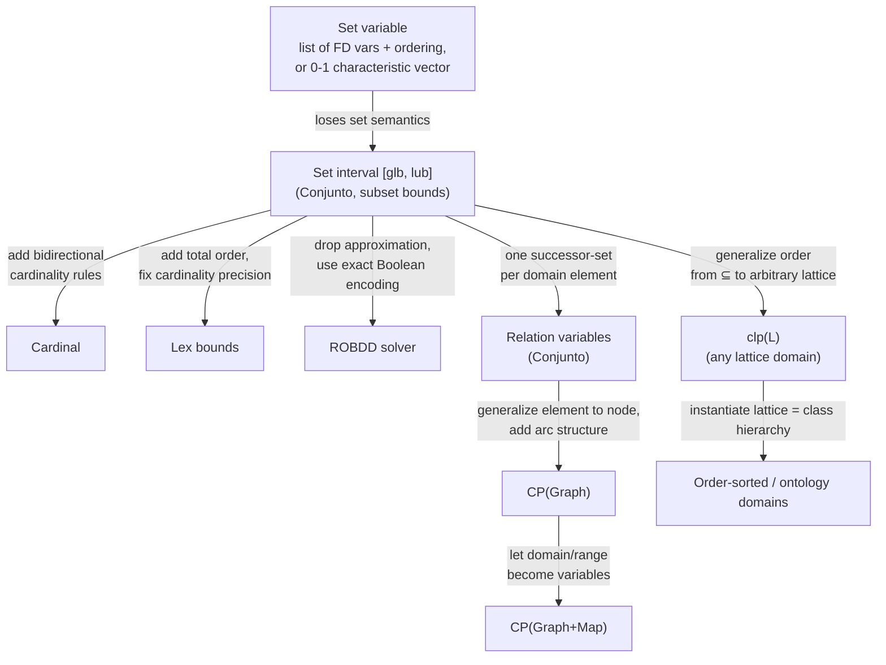

# Constraints over Structured Domains

[[book-guidelines|↩ Back to guidelines]]

## Why finite domains aren't enough

Every CSP solver you've seen so far reasons about scalars: an integer variable $x$ has a domain $D(x) \subseteq \mathbb{Z}$, and propagation prunes values out of that domain. But a large class of NP-complete combinatorial problems — bin-packing, set partitioning, combinatorial design, digital-circuit diagnosis, network design (SONET), graph pattern matching — aren't naturally about individual integers at all. They're about *aggregates*: which items go together in a bin, which pairs are connected in a graph, which elements map to which under some relation. Gervet's chapter (Ch. 17, pp. 605–638) is about what happens when you promote the aggregate itself — a set, a multiset, a relation, a graph — to the status of a first-class CSP variable, with its own domain and its own propagators, instead of flattening it down into a pile of 0-1 integer variables before the solver ever sees it.

That flattening move is worth dwelling on, because the chapter opens by showing exactly what it costs. Consider "$s$ is a subset of a known base set $\{0,\dots,5\}$." A finite-domain encoding has two standard options:

1. **A sorted list of FD variables** — $[X_1, X_2, X_3] :: [0..5]$ with $X_1 < X_2 < X_3$ — using ordering constraints to kill duplicate representations of the same set (since $\{2,4\}$ and $\{4,2\}$ are the same set, but $(X_1,X_2)=(2,4)$ and $(4,2)$ are different tuples). If the cardinality is unknown you also need dummy padding variables.
2. **A 0-1 characteristic-function encoding** — one Boolean variable per element of the base set, $f(y_i) = 1 \iff i \in s$ — which is exactly how 0-1 integer programming represents subsets, and inherits all of ILP's global-reasoning power (LP relaxations, [[Integration-of-Constraint-Programming-and-Operations-Research#Cutting planes|cutting planes]]) at the cost of *losing the fact that this is a set at all*. A constraint like "$s_1 \cap s_2 = \emptyset$" becomes a conjunction of pairwise AND-implications over Booleans; the solver has no idea it's reasoning about set intersection, so it can't bring set-specific inference to bear.

Both encodings work. Both are also exactly the "what breaks without this" case for the rest of the chapter: they force you to *reconstruct* set semantics out of scalar plumbing, at the cost of both modeling conciseness and the solver's ability to propagate using structure it can no longer see. The chapter's thesis is that if you instead give the solver a first-class set variable with a domain of possible sets, you get both a shorter model and — because the propagators can be written in terms of $\subseteq$, $\cup$, $\cap$ directly — often tighter pruning.

**Rust framing.** This is precisely the tension between a `HashSet<T>` and a `Vec<bool>` (bitset) representation of a subset in ordinary Rust code, except pushed one level up: instead of choosing a representation for a *known, concrete* set, we're choosing a representation for a *domain of possible sets* — an unresolved set-valued variable a solver is still narrowing down. A finite-set-interval solver is, in effect, a `HashSet`-of-`HashSet`-approximating data structure with its own arithmetic.

---

## Part I — Sets: from unification to intervals

### 17.1–17.2 Two families of "set constraints," and why one of them dead-ends

Historically two independent lines of work both got called "set constraints," and it's worth keeping them apart because the book does:

- **Heintze–Jaffar set constraints (1990)** are a program-analysis device: constraints like $s_1 \subseteq s_2$ over (possibly infinite) sets of *trees*, used to analyze logic/functional programs. They don't interpret set operations computationally at all — they're a static-analysis formalism, closer to abstract interpretation than to CSP solving. Not this chapter's subject, but worth knowing the name isn't overloaded by accident.
- **Constructed-set languages** ({log}, CLP(SET), CLPS) embed sets as a *term constructor* in a logic-programming language, the way Prolog embeds lists via `[H|T]`. A set is built with a `with` constructor: `∅ with x with y`. Equality between constructed sets is then a *unification* problem, and it's NP-complete — because unlike list unification (which has a unique most general unifier), set unification of $\{X,Y\} = \{3,4\}$ has two *incomparable* solutions, $\{X{=}3,Y{=}4\}$ and $\{X{=}4,Y{=}3\}$, neither more general than the other. This is exactly the ACI-unification problem (Associative, Commutative, Idempotent): the `with` constructor's algebraic laws destroy the uniqueness that makes ordinary first-order unification tractable and confluent.

**This is the load-bearing connection for the elaborator project.** {log}'s satisfaction procedure resolves this non-uniqueness by branching — nondeterministically trying each of the finitely many minimal unifiers, i.e. injecting *choice points into the constraint graph itself*. That is structurally the same move Miller pattern unification is designed to *avoid*: pattern unification stays decidable and unique precisely by restricting metavariable applications to the tractable fragment (distinct bound-variable arguments) so that a single most general unifier always exists, instead of falling back to search over a disjunction of unifiers. Seeing ACI-unification's NP-hardness spelled out here is a concrete instance of the general phenomenon pattern unification is built to sidestep — a worked example of *why* an elaborator's metavariable unifier needs to police which fragment of unification problems it will accept, on pain of degenerating into exactly this kind of exponential search.

Because full set unification doesn't scale, a *different* line of work (Puget and Gervet, independently, 1992–94) gave up expressiveness (sets no longer contain variables) in exchange for efficiency (trivial, deterministic unification of *ground* finite sets) — and represented the domain of a set variable not as a term but as an **interval**.

### 17.3 Set intervals: the actual computational workhorse

This is the chapter's central technical device, and it directly mirrors interval-arithmetic reasoning over reals (Ch. 16) — the book flags this parallel explicitly, and it's worth taking seriously as a template.

**The definition.** A set variable's domain is approximated by a pair $[glb, lub]$ under the subset order $\subseteq$:
- $glb(s)$ (greatest lower bound) — the elements that are *definitely* in $s$ in every possible instantiation.
- $lub(s)$ (least upper bound) — the elements that are *possibly* in $s$; everything outside $lub(s)$ is definitely excluded.

$$s \in [glb, lub] \iff glb \subseteq s \subseteq lub$$

Example 17.1 from the text: $s \in [\{1,3\}, \{1,3,5,6\}]$ means $1,3 \in s$ for certain, and $5,6$ are undecided possibilities.

**What breaks without convexity, and the fix.** A powerset lattice $\mathcal{P}(\{1,\dots,6\})$ under $\subseteq$ is enormous ($2^{100}$ elements for a 100-element base set — you cannot enumerate it), so — exactly as with real intervals — you approximate a *set* of possible sets by its convex hull. But union and intersection of two intervals don't obviously stay intervals: the book's Example shows $I = [\{1\},\{1,3\}] \cup [\{\},\{2,6\}]$ contains $\{1,3\}$ and $\{6\}$ but *not* every set "between" them under $\subseteq$ — the true domain has holes. Tracking those holes exactly means tracking a disjunction of intervals, which blows up combinatorially — precisely the tradeoff bound-consistency reasoning over reals makes to stay tractable. The fix is a **convex closure operator**:

$$\widetilde{conv}(x) = \Big[\bigcap_{a_i \in x} a_i,\ \bigcup_{a_i \in x} a_i\Big]$$

which rounds any set-of-sets outward to the smallest set interval containing it. With this closure applied after every operation, interval arithmetic on sets becomes clean:

$$[a,b] \cup [c,d] = [a\cup c,\, b\cup d] \qquad [a,b] \cap [c,d] = [a\cap c,\, b\cap d] \qquad [a,b]\setminus[c,d] = [a\setminus d,\, b\setminus c]$$

**Bound Consistency (BC) for sets.** A set constraint is BC when, for each set variable, $lub(s)$ equals the union and $glb(s)$ the intersection of that variable's value across *every* valid assignment satisfying the constraint (Def. 17.8) — the direct set-domain analogue of bound consistency for reals. This is enforced by deterministic rewrite rules (Gervet's I1–I5) that never backtrack — e.g., for $s \subseteq s_1$ with $s \in [a,b]$, $s_1 \in [c,d]$:

$$\{s \in [a,b],\ s_1 \in [c,d],\ s \subseteq s_1\} \longmapsto \{s \in [a,b'],\ s_1 \in [c',d],\ s\subseteq s_1\}, \quad b' = b\cap d,\ c' = c\cup a$$

i.e., anything definitely in $s$ must be added to $s_1$'s lower bound, and anything not possibly in $s_1$ must be removed from $s$'s upper bound. These rules are correct, contracting, idempotent, and inclusion-monotone — the same fixpoint-iteration guarantees Ch. 3's generic propagation framework requires of any well-behaved propagator.

**Graduations — the bridge back to arithmetic.** To state things like "the total weight of items in this bin $\leq W_{max}$," you need a function from sets to integers. A *graduation* $f: DS \to \mathbb{Z}$ (cardinality, weight-sum, etc.) extends to intervals as $\bar f([a,b]) = [f(a), f(b)]$, letting arithmetic constraints reach into set variables. This is how the chapter's worked bin-packing example replaces an ILP formulation —

$$\sum_j a_{ij}x_j = 1,\quad \sum_i a_{ij}w_i \le W_{max}$$

— with the strictly more structure-preserving set formulation $s_1 \cap s_2 = \{\},\, \dots,\, \bigcup_j s_j = \{(1,w_1),\dots\}$, $weight(s_j) \le W_{max}$: same problem, but the solver now knows it's manipulating partitions rather than an opaque matrix of Booleans.

**Multisets** generalize this by tracking an *occurrence function* $occ(m,s)$ instead of membership, with $occ(m, s_1\cup s_2) = \max(\cdot,\cdot)$, $occ(m,s_1\cap s_2)=\min(\cdot,\cdot)$. Gervet notes three multiset representations — occurrence vectors, subset-bound-style bounds, and FD-list (cardinality) lists — that are *pairwise incomparable* in expressiveness (occurrence strictly dominates bound; FD-list is incomparable to both), a small but real lesson about how a single "abstract data structure as a complex domain" (per the standing project's CSP-kernel goal) can have multiple non-interchangeable concrete representations, each buying different pruning power.

### 17.4 Four ways later research pushed past subset bounds — and the recurring precision/cost tradeoff

Each extension attacks a specific weakness of the basic subset-bound solver, and together they trace out a lattice of tradeoffs your own domain-propagation design will keep re-encountering:

1. **Cardinal (Azevedo)** — adds *bidirectional* cardinality inference. Vanilla subset-bound solvers only push information set→cardinality (as a set gets pruned, its cardinality bound tightens), never the reverse. Cardinal adds rules like: from $|s_1|=2$, $s_1,s_2 \subseteq \{a,b,c,d\}$, $s_3 = s_2\setminus s_1$, infer $|s_3|\le 2$ — cardinality reasoning flowing back into the set operations. Motivated by digital-circuit diagnosis, where cardinality domains are naturally *disjunctive* (a signal is either fault-free, cardinality 0, or fully faulted, cardinality $|D|$ — nothing in between), a case where the subset-bound approximation alone is nearly useless.
2. **Lexicographic bounds** — subset bounds under $\subseteq$ are a *partial* order, so an interval $[\{1,2\},\{1,2,3,4\}]$ can't represent "all size-3 subsets containing $\{1,2\}$" precisely — the interval's own bounds ($\{1,2\}$ has size 2) aren't even valid instances when a cardinality constraint is added. A **total** lexicographic order $\preceq$ on sets of naturals fixes this (Theorem 17.15: $s_1\subseteq s_2 \Rightarrow s_1\preceq s_2$, so lex bounds are always a valid *refinement* of subset bounds), at the direct cost of losing precise per-element inclusion reasoning — a set strictly between the lex bounds need not contain any particular element from the lower bound. Hence the eventual **hybrid domain**: subset bounds for element-level precision, lex bounds for cardinality/symmetry precision, run together.
3. **ROBDD solvers (Lagoon–Stuckey)** — instead of *approximating* the domain by an interval, represent the *entire, exact* domain of a set variable as a Reduced Ordered Binary Decision Diagram over its characteristic-function Boolean encoding. No approximation, no lost precision — at the cost of working entirely in Boolean-formula space, and with performance now hostage to variable-ordering choices that can make an ROBDD's size swing between linear and exponential for logically equivalent constraints.
4. **Global set constraints** (`atmost1`, `distinct`, `disjoint`, `partition`) — the set-domain analogue of Ch. 6's [[Global-Constraints|global constraints]]: don't decompose an $n$-ary constraint into binary pieces, propagate it as one atomic unit using combinatorial-counting arguments (Stirling numbers, pigeonhole tests) the decomposition can't see. Table 17.1's complexity results are genuinely striking: `disjoint` and `partition` decompose losslessly into binary intersection constraints *as long as cardinalities are unconstrained* (because any set can always fall back to $\emptyset$ to satisfy a binary disjointness check) — but the instant you fix cardinalities (the *normal* case in combinatorial-design problems), decomposition provably loses pruning power, and restoring full bound consistency on `atmost1` is NP-hard. `disjoint`/`partition` stay polynomial even with fixed cardinalities, via an algorithm that turns out to be a close structural cousin of the GAC algorithm for the Global Cardinality Constraint (GCC, Ch. 6) — solved by reformulating the set problem as a *dual* finite-domain model (set identifiers become FD values, set elements become FD variables) and running GCC on that dual, an elegant instance of solving a global set constraint by reduction to an already-optimized global FD constraint rather than writing bespoke set machinery.

**Why this whole section matters for the CSP-kernel goal.** This is the chapter's most direct load-bearing content for the "CSP kernel with domain/lattice propagation over abstract data structures" piece of the standing project. The general shape — pick a domain representation (interval / lex-bounds / exact-BDD), accept a precision/cost tradeoff, then optionally recover precision for specific *global* patterns via dedicated propagators — is the same shape you'll face designing propagation over refinement-type predicates or automaton-shaped abstract domains: cheap-but-lossy bound approximation as the default engine, sharpened locally wherever a constraint's structure (fixed cardinality, a known automaton, a known lattice shape) makes exact reasoning tractable.

---

## Part II — Beyond sets: relations, graphs, lattices

### 17.5 Relations and graphs: avoiding the Cartesian-product blowup

The obvious representation of a relation $r \subseteq d \times a$ as a set of pairs is a disaster for the same reason a naive FD encoding of a set is: $d\times a$ can be enormous even when $r$ itself is small. Conjunto's fix is the **successor-set representation** (Def. 17.19):

$$s_x = \{y \in a \mid (x,y) \in r\}, \quad \text{for each } x \in d$$

— one *set variable* per element of the domain, rather than one Boolean per pair. This turns relation constraints into set constraints for free: `funct(r)` (a genuine function, not just a relation) is $\forall x \in d,\, |s_x| = 1$; `inj(r)` (injective) adds pairwise disjointness $s_i \cap s_j = \emptyset$ across all successor sets; `surj(r)` adds $\bigcup_x s_x = a$. No new solver machinery is needed — you get relational constraints as a thin syntactic layer over set-interval propagation.

**CP(Graph)** extends the same interval-lattice idea one level further: a graph $g=(sn,sa)$ (node set, arc set) lives in a lattice ordered by $g_1 \subseteq g_2 \iff sn_1\subseteq sn_2 \land sa_1\subseteq sa_2$, giving a graph interval $[g_L, g_U]$ exactly analogous to a set interval. Three **kernel constraints** — `Arcs(g,sa)`, `Nodes(g,sn)`, `ArcNode(a,n1,n2)` — are shown to be *complete*: every complex graph constraint (e.g. `SubGraph(g1,g2) ≡ Nodes(g1)⊆Nodes(g2) ∧ Arcs(g1)⊆Arcs(g2)`, or `InNeighbors`) can be derived from them. `CP(Graph+Map)` generalizes further by letting the *domain* of a relation itself be a variable rather than a fixed ground set — the leap from "relation over known sets" to "relation whose departure set is still being searched for."

### 17.6 Lattices and hierarchies: the generalization that names the pattern explicitly

By this point in the chapter, the reader should already feel the pattern repeating: sets under $\subseteq$, graphs under a componentwise $\subseteq$, relations built from successor sets — all interval-approximated the same way. Section 17.6 makes that pattern the *explicit* object of study: **clp(L)** (Fernández–Hill) is a generic interval-constraint framework parameterized by an *arbitrary* lattice (finite or infinite), with a single indexical-style constraint form (in the tradition of CLP(FD) indexicals) and a schematic operational semantics, so that any of the domain-specific solvers above — set intervals, graph intervals — become one instantiation of a common lattice-interval combinator, and different lattice-based solvers can even cooperate on a shared problem.

**This is precisely a Galois-connection move, worth naming as such.** An interval $[glb, lub]$ over any lattice $(L, \sqsubseteq)$ is an *abstraction* of a set of concrete lattice elements — a sound over-approximation, narrowed by monotone, contracting, idempotent propagators exactly as an abstract-interpretation domain is narrowed by its transfer functions toward a fixpoint. clp(L) is, structurally, abstract interpretation's interval/octagon-style *relational abstraction machinery* rediscovered inside a constraint-solving framing rather than a static-analysis framing — the same convex-closure/soundness/monotonicity discipline, aimed at search rather than at proving program properties. If the eventual CSP kernel needs to propagate over automaton-shaped or otherwise structured abstract domains (per the standing project's "abstract data structures as complex domains, represented like automata grammars DFA" goal), clp(L)'s generic lattice-interval scaffold — plus the CLP($\Sigma^*$)/finite-automaton machinery from §17.2.1 for regular-language-valued variables — is close to a direct template: define the lattice/automaton structure, get bound consistency machinery for free from the general scheme.

Two closely related concrete instantiations close the section: **order-sorted domains** (Caseau–Puget) apply the same reasoning to class-taxonomy hierarchies from an OO perspective, and **ontology domains** (Laburthe) to value hierarchies for product/service configuration (e-commerce). Both reduce to bound-and-convex-interval reasoning over a hierarchy exactly as finite-set-interval solving reduces to bound-and-convex-interval reasoning over $\subseteq$ — the chapter closes its main technical arc on the same move it opened with.

### 17.7–17.9 Implementation and applications, briefly

The chapter's closing sections are lighter survey material rather than new mechanism: a comparative table of time complexities for basic set operations across representations (sorted list, 0-1 array, hash table, ROBDD — e.g. membership is $O(|glb(s)|)$ for sorted lists but $O(1)$ for hash tables and ROBDDs, while cardinality is $O(1)$ for everything except ROBDDs, where it's $O(k(N-k))$ because cardinality is awkward to express as a Boolean formula), and application highlights — the Kirkman schoolgirl combinatorial-design problem solved in seconds via a set model plus symmetry-breaking (cross-referencing Ch. 10), and the SONET telecom network-design problem via dual set/FD models with redundant constraints.

---

## Where this leads

Structured-domain constraints depend on everything the handbook built up through Ch. 3 (constraint propagation as monotone reduction-rule iteration to a fixpoint) and Ch. 6 (global constraints as atomic, non-decomposed propagators) — this chapter is essentially those two ideas run over a lattice of sets/graphs/relations instead of a lattice of integer intervals. It also sits right next to Ch. 16 ([[Continuous-and-Interval-Constraints|Continuous and Interval Constraints]]): both chapters solve the *same* meta-problem — approximate an intractably large domain by a convex interval under some partial order, propagate via monotone contracting rules to a fixpoint, recover precision locally via global constraints or symbolic rewriting where the interval approximation is too lossy — over two different concrete orders ($\le$ on reals vs. $\subseteq$ on sets/lattices).

For the standing compiler/elaborator project, this chapter is a working precedent, not background reading: it is a fully worked example of building a sound, monotone, fixpoint-based propagation system over a genuinely structured abstract domain (sets, relations, graphs, and — via clp(L) — arbitrary lattices), including the exact vocabulary (convex closure, bound consistency, graduations, global vs. decomposed propagators) the project's planned CSP kernel will need for domain/lattice propagation over non-scalar program-invariant representations. The {log} unification detour is a concrete cautionary tale for the elaborator's metavariable unifier: full ACI-style set unification is NP-hard exactly because it lacks a unique most general unifier, which is the same failure mode Miller pattern unification is engineered to avoid by restricting to a tractable fragment — seeing the failure mode spelled out in a different setting sharpens why that restriction is load-bearing rather than a mere convenience.
