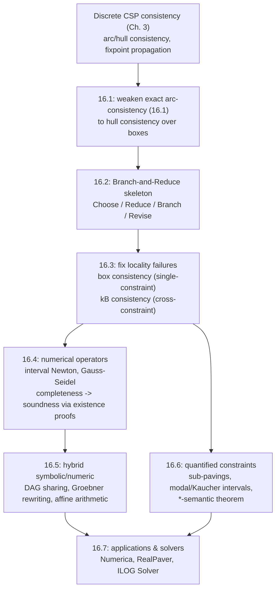

# Continuous and Interval Constraints

[[book-guidelines|↩ Back to guidelines]]

## Why you can't just do arc consistency over $\mathbb{R}$

Everything you know about finite-domain constraint propagation — remove values that can't be extended to a solution, iterate to a fixpoint — was built for domains you can enumerate. The moment a domain becomes an interval of the reals, that machinery breaks at the most basic level: (generalized) arc consistency for a constraint $f(x_1,\dots,x_n)=0$ asks for the set

$$\{a_k \in I_k : \exists a_1 \in I_1,\dots,\exists a_{k-1}\in I_{k-1},\exists a_{k+1}\in I_{k+1},\dots,\exists a_n\in I_n,\ f(a_1,\dots,a_n)=0\}\tag{16.1}$$

and over the reals this set is, in general, **uncomputable** — you can't decide membership in it with finite-precision machine arithmetic, and it may not even be a finite union of intervals. This is the chapter's opening move, and it's worth sitting with: the entire subject exists because the exact CSP notion of consistency is simply not implementable once the domain is continuous. What breaks without a new idea: you'd need to represent and manipulate arbitrary (possibly disconnected, possibly irrational-boundaried) subsets of $\mathbb{R}$, exactly — computer algebra can sometimes do this symbolically (Gröbner bases, quantifier elimination) but pays for it in exponential time and space, and only for restricted classes like polynomials.

Benhamou and Granvilliers's answer is the field's defining move: **weaken exactness to soundness**. Instead of computing set (16.1) exactly, compute a *superset* of it using interval arithmetic — you're allowed to keep some spurious values, but you may never discard an actual solution. This is the same trade every static analyzer and abstract interpreter makes: a sound over-approximation of a semantics you can't compute exactly, in exchange for termination and tractability. If you've internalized Galois connections and abstract domains, this chapter is that exact idea, worked out concretely for the reals and instantiated as constraint propagation over interval boxes.

## 16.1 The basic move: boxes, hull consistency, and why it converges

An **interval box** $I_x = I_1 \times \cdots \times I_n$ is the search space for a system of real constraints $f(x_1,\dots,x_n)=0$ where each $x_k$ ranges over a closed interval $I_k$. Interval arithmetic gives you a way to *evaluate* $f$ soundly over a box — $[a,b]+[c,d]=[a+c,b+d]$, $[a,b]-[c,d]=[a-d,b-c]$, $[a,b]\times[c,d]=[\min(ac,ad,bc,bd),\max(ac,ad,bc,bd)]$ — with bounds always rounded outward (lower bound rounds down, upper bound rounds up) so the computed interval is never smaller than the true range. This is the price of *completeness*: no solution is ever lost, but the box you compute is always a conservative superset.

**Hull consistency** is the practical replacement for arc consistency: instead of the exact set (16.1), compute its interval hull (the smallest enclosing interval), via domain-reduction rules that combine interval evaluation with *constraint inversion* — solving the constraint for each variable in terms of the others.

> **Example 16.2** (the book's own). For $y - x^2 = 0$ with $x\in[0,2]$, $y\in[-1,2]$: rewrite as $I_y := I_y \cap I_x^2$ and $I_x := I_x \cap \sqrt{I_y}$. Note the second step required *inverting* the squaring operation — this inversion step is where interval constraint solving diverges from plain interval evaluation.

Propagation then works exactly like finite-domain AC-3: apply these per-constraint reduction rules repeatedly across a network of constraints, each application only ever shrinking domains, until nothing more changes. This process is **guaranteed to converge in finite time** because (a) the space of representable intervals is finite (bounded by floating-point precision) and (b) the reduction rules are contracting and monotonic — the same abstract-interpretation-style argument you'd use to prove a Kleene-iteration fixpoint computation terminates on a domain of finite height, except here "finite height" comes from the floating-point granularity, not the lattice structure itself.

Because you generally can't reach *exact* zero-width intervals (irrational roots, rounding), the search additionally needs a **precision parameter** $\varepsilon$: the search tree bottoms out at boxes narrower than $\varepsilon$ (accepted), boxes proven empty (rejected), or non-terminal boxes that get **bisected** (splitting the largest domain is the standard heuristic) and recursed on. This gives you two solutions to $y-x^2=0 \wedge y - x - 1 = 0$ enclosed to $10^{-8}$ width, each a tight box around one of the two real roots — *complete* (no solution missed) but not automatically *sound* in the stronger sense of "provably exactly one solution inside." That upgrade — from enclosure to existence proof — needs fixed-point theorems (Brouwer, Miranda), which resurface in Section 16.4.

**What this doesn't fix yet:** hull consistency is a *per-constraint*, *per-variable* local notion. Two failure modes remain, and the rest of the chapter is organized around fixing them.

## 16.2 The branch-and-reduce framework

Before going deeper into consistency techniques, the chapter gives the generic algorithmic skeleton every interval solver instantiates — this is worth internalizing as a template, because it's structurally the same shape as CEGAR loops and abstract-interpretation widening/narrowing loops you'll build later:

```
BranchAndReduce(C: constraint model, I: interval box, ...):
    L := {I}                    # set of interval boxes (the "covering")
    repeat
        J := Choose(L)          # pick a box to work on
        K := Reduce(C, J)       # narrow J using propagation/interval methods
        L := Branch(L, K)       # split K if needed, update the covering
        L := Revise(L)          # simplify/bound the covering (e.g. discard boxes ruled out by objective bounds)
    until L is terminal
    return L                    # a sound covering of all solutions of C within I
```

The same skeleton specializes to four distinct problem shapes, and recognizing which one you're solving tells you which sub-algorithm to plug in:

- **Isolated solutions** — stop when every box in the covering is smaller than a threshold; bisect-the-largest-domain is enough.
- **A continuum of solutions** (e.g. a system of inequalities defining a region) — now you additionally need *inner-box* approximation: boxes provably entirely *inside* the solution set, computed by running interval operators on the *negated* constraints and checking those fail.
- **Quantified formulas** — propagate boxes through logical connectives: conjunction $\to$ intersection, disjunction $\to$ union, $\exists \to$ projection. (This is Section 16.6.)
- **Global constrained optimization** — maintain *reliable* (interval, hence sound) bounds on the objective over feasible regions, prune boxes whose bound is provably worse than the current best, and use existence theorems to certify that a bound-improving region actually contains a solution before trusting it.

This is the CP analogue of a solver architecture you'll reuse directly: `Choose` is your worklist policy, `Reduce` is abstract-interpretation-style narrowing, `Branch` is case-splitting on a disjunction (exactly what CEGAR does when a spurious counterexample forces you to refine an abstraction), and `Revise` is your bound-and-prune step. If you're building a CSP kernel that searches for concrete counterexamples to break refinement-type invariants, this loop — parametrized by domain-specific `Reduce`/`Branch` — is close to literally the shape you want, with "reduce" doing lattice/interval propagation on numeric domains and "branch" doing disjunctive case splits on richer abstract domains (e.g. an automaton-shaped domain for a data structure invariant).

## 16.3 Consistency techniques: fixing the two failure modes

### Failure mode 1 — multiple occurrences of one variable in one constraint

> **Example 16.8.** Constraint $x + x = 0$, $x \in [-1,1]$. The reduction rule is $I_x := I_x \cap (-I_x)$, which for $[-1,1]$ gives $[-1,1] \cap [-1,1] = [-1,1]$ — no reduction at all, even though the constraint's *real* solution set is just $\{0\}$.

The problem: interval arithmetic treats the two textual occurrences of $x$ as if they were *independent* variables that could take different values within the same interval, so it can't exploit the algebraic identity that they're forced equal. This is the **dependency problem**, and it's structurally the same failure as naive interval abstract interpretation losing precision on `x - x` when it doesn't know the two occurrences are the same variable.

**Box consistency** (§16.3.3) fixes this locally by *relaxing* the test: instead of requiring exact hull-consistency, it reformulates arc consistency as a **refutation test** — value $a_k$ is inconsistent if $0 \notin F(I_1,\dots,I_{k-1},\{a_k\},I_{k+1},\dots,I_n)$ for *some* interval extension $F$ of $f$ — and finds the extreme consistent values by **bisection search** on the domain bounds rather than trying to invert the constraint algebraically. On $x+x=0$, box consistency's refutation test *does* succeed on any sub-domain not containing $0$, so bisection converges the domain down to $\{0\}$ — solving exactly the case hull consistency couldn't. The tradeoff: box consistency is a bisection search (potentially many refutation-test evaluations) rather than a single algebraic step, so it's used selectively — hull consistency where a variable occurs once per constraint (cheap, exact), box consistency where it occurs more than once (more expensive, more powerful). The **BC4** algorithm automates exactly this selection per-variable-per-constraint.

### Failure mode 2 — variables shared *across* multiple constraints ("locality")

> **Example 16.9/16.12.** $x+y=0$ and $x-y=0$, $(x,y)\in[-1,1]^2$. Both constraints, checked *individually*, are already hull consistent on this domain — no per-constraint reduction rule fires. But the *system* is only satisfied at $x=y=0$; propagating constraint-by-constraint never notices that fixing $x=-1$ forces contradictory values of $y$ ($y=1$ from one constraint, $y=-1$ from the other).

No amount of strengthening within a single constraint (i.e., no amount of box consistency) can fix this, because the failure isn't about one constraint's internal structure — it's about the *interaction* between constraints. The fix, **strong ($k$B) consistency**, is defined by induction: a system $S$ is $3$B consistent if for every variable $x$ and every candidate bound value $x=a$, the sub-system $S \cup \{x=a\}$ is *locally consistent as a whole* (checked by running propagation on the whole system with $x$ pinned). $k$B consistency generalizes this recursively: $k$B consistent means fixing one variable makes the rest $(k{-}1)$B consistent. On the example above, pinning $x=-1$ and propagating the *whole* system immediately derives $I_y = \varnothing$, correctly eliminating that sub-domain — this is exactly what plain hull/box propagation, evaluated constraint-by-constraint, structurally cannot do.

The cost is real: testing $(k-1)$B-consistency at every candidate bound of every variable means $k$B consistency is far more expensive per step than hull or box consistency alone — this is the general **local-vs-global tradeoff** you already know from finite-domain CSPs (path consistency vs. arc consistency), just re-derived over continuous domains. In practice, acceleration techniques (§16.3.5) — combining hull/box selection by occurrence count (BC4), weakened "dichotomous" bisection that stops early on unreducible-width sub-intervals, cycle-aware operator scheduling, and Aitken's $\Delta^2$ extrapolation to guess the limit of a converging-but-slow bound sequence — exist specifically to buy back some of that cost.

### The mechanics underneath: HC4revise and the decomposition tree

Practically, hull consistency for a compound constraint like $xy - z^2 = 1$ is computed not by inverting the whole expression at once but by **decomposing** it into a tree of unary/binary operations (introduce a fresh variable per operator: $v_1=xy,\ v_2=z^2,\ v_3=v_1-v_2,\ v_3=1$), then running a two-pass algorithm called **HC4revise**: a bottom-up pass that evaluates the tree using interval arithmetic (leaves $\to$ root), followed by a top-down pass that *projects* each node's constraint back onto its children (root $\to$ leaves), narrowing every intermediate and original variable. This is precisely the shape of a compiler's expression-DAG evaluation followed by a constraint-propagation pass over the same DAG — if you've written a data-flow analysis that does a forward abstract-evaluation pass and then a backward refinement pass over an SSA graph, HC4revise is that pattern, specialized to interval domains.

```python
# HC4revise sketch — illustrative only, not load-bearing.
# Decompose f into a DAG of unary/binary ops, then:
def hc4revise(dag, domains):
    # bottom-up: evaluate every node's interval from its children
    for node in dag.topological_order():          # leaves -> root
        node.value = node.op.eval(*[c.value for c in node.children])
    # top-down: project each node's own domain back onto its children
    for node in reversed(dag.topological_order()): # root -> leaves
        for child in node.children:
            child.value = child.value & node.op.invert_for(child, node.value)
```

## 16.4 Numerical operators: bringing in interval analysis proper

Section 16.4 shifts from propagation-style reduction rules to **iterative numerical methods**, lifted from classical numerical analysis into interval arithmetic. The general pattern: given a classical fixed-point iteration $x_{k+1} := \varphi(x_k)$, define its interval counterpart $I_{k+1} := I_k \cap \Phi(I_k)$ using an interval extension $\Phi$ of $\varphi$ — intersecting with the *previous* box guarantees the sequence is monotonically shrinking, hence convergent.

**The univariate interval Newton method** is the headline instance. From the mean value theorem, any root $x$ of $f$ satisfies $x = x_0 - f(x_0)/f'(c)$ for some $c$ between $x$ and $x_0$; replacing $c$'s unknown value with an interval bound $F'(I_k)$ over the whole box gives the sound iteration

$$I_{k+1} := I_k \cap \left(x_k - \frac{F(x_k)}{F'(I_k)}\right),\quad 0 \notin F'(I_k).$$

This converges *quadratically* near a root (Example 16.16 recovers $\sqrt 2$ to 8 significant digits in 5 iterations) — dramatically faster than the box-consistency bisection search it can replace, precisely because it exploits derivative information the pure refutation test discards. Crucially, the containment test $N(I_k,x_k) \subseteq I_k$ upgrades the method from merely *complete* (no solution lost) to genuinely **sound as an existence proof**: if the new computed enclosure lands strictly inside the old one, a fixed-point argument (Brouwer/Miranda, again) guarantees a real solution actually exists in that box — not just "no solution was ruled out," but "a solution is certified to be there." This is the sharpest form of the completeness/soundness distinction the chapter cares about, and it's the mechanism that eventually lets an interval solver output a certificate, not just an enclosure.

**Linear systems**: an interval linear system $Ax=B$ (entries are intervals) has a solution set $\Sigma(A,B)$ that is NP-hard to enclose exactly in general — practically, this is solved with the **interval Gauss-Seidel method**, row-by-row substitution $I_i := I_i \cap \frac{1}{A_{ii}}\big(B_i - \sum_{j\ne i} A_{ij}I_j\big)$, essentially hull-consistency-by-hand specialized to linear rows, sharpened by extended interval division, transversal (row) selection, and preconditioning (multiplying by the inverse midpoint matrix) when $0 \in A_{ii}$ would otherwise make the step vacuous.

**Nonlinear systems**: the **multivariate interval Newton method** linearizes via the interval Jacobian $J_f(I)$, reducing the nonlinear problem at each step to an interval *linear* system $J_f(I)(x-x_0) = -F(x_0)$ solved by Gauss-Seidel — the general strategy of every Newton-type method in this chapter: turn a hard nonlinear step into a sequence of easier linear ones, each one sound by construction. An alternative is **reformulation-linearization**: replace quadratic terms $x^2, xy$ with fresh variables constrained by convex/concave linear envelope inequalities (e.g. $w \ge 2ax-a^2$ for $w=x^2$, $x\in[a,b]$), reducing the problem to something an LP solver (Simplex) can bound directly — this is the interval-constraints analogue of the linear relaxations you'd build for a numeric abstract domain like octagons or polyhedra when a fully nonlinear invariant is too expensive to track exactly.

## 16.5 Hybrid symbolic-numeric techniques

No single technique dominates, so §16.5 catalogs how to combine **symbolic algorithms** (exact, exponential-worst-case, structure-revealing), **interval/numerical methods** (approximate, fast, locally powerful), and **consistency techniques** (cheap, globally weak).

- **Expression sharing via a DAG.** If two constraints share a subexpression (Example 16.19: $xy=1 \wedge xy=-1$), naively they can look bound-consistent independently, even though a single shared node for $xy$ immediately reveals $1 = -1$, an outright contradiction. Representing the whole constraint network as a DAG rather than a set of independent trees lets propagation exploit exactly this kind of sharing.
- **Symbolic rewriting before propagation.** Gaussian elimination on linear (sub)systems or Gröbner bases on polynomial systems can transform an intractably "rectangular" nonlinear system into a *triangular* one that propagation solves trivially (Example 16.20 shows a system essentially unsolvable by direct propagation becoming immediate after a linear-relaxation-then-substitute rewrite). The catch: symbolic methods themselves can be exponential (Gröbner bases especially), so this is only ever a *targeted* rewrite, not a universal preprocessing step.
- **Reducing the overestimation problem.** Interval evaluation of $x-x$ over $[0,1]$ naively gives $[-1,1]$ (the two occurrences are treated as independent), when the true range is $\{0\}$ — the same dependency problem as Example 16.8, now attacked at the level of *function representation* rather than constraint propagation: rewrite via Horner forms, Bernstein polynomials, Taylor models, or **affine arithmetic** (representing an interval as $\frac{b+a}{2} + \frac{b-a}{2}\varepsilon,\ \varepsilon\in[-1,1]$, which *does* correctly cancel `x - x` to exactly $0$ because both occurrences share the same symbolic noise term $\varepsilon$ — this is precisely the trick that fixes what plain interval evaluation gets wrong).
- **Interval + consistency cooperation.** Numerica's own "master algorithm" — box consistency early (cheap, fast early-phase pruning of large boxes) followed by the multivariate interval Newton method once boxes are small (where quadratic convergence pays off) — is the canonical example, and it's worth noting as a general design pattern: cheap-and-weak first to prune the search space fast, expensive-and-precise once the space is small enough that precision, not speed, is the bottleneck. This is the same two-phase shape as a solver that runs fast syntactic unification first and falls back to full higher-order pattern unification only once the easy cases are exhausted.

## 16.6 First-order constraints: quantifiers over the reals

Up to this section, "solving" meant existentially-quantified conjunctions of atomic constraints — the CSP default. Section 16.6 extends to genuine **first-order formulas**, where variables can be universally quantified: e.g., "find all robot-arm configurations $x$ such that for *every* hand position $p$ in some range, no collision occurs" is a $\forall p$ constraint on $x$, not an $\exists$.

The general decision problem is **undecidable** with transcendental functions (sine, exponential) and **doubly exponential** for polynomials via Collins's cylindrical algebraic decomposition — so, as everywhere else in the chapter, the response is to trade exactness for a sound, incomplete-but-terminating approximation. The CP-native tool for this is the **sub-paving**: a covering of a relation by boxes classified into three bins — *inside* (provably satisfying), *outside* (provably violating), and *boundary* (undetermined) — computed by recursive bisection plus interval evaluation. Universal quantifiers are then discharged by an **interval inclusion test**: to show $(\forall x\in I) f(x) \ge 0$, it suffices that the interval evaluation $F(I)$ satisfies $F(I) \ge 0$ as a whole — e.g. $x_1+x_2>0$ for $x_1\in[-2,2], x_2\in[3,5]$ follows immediately from $[-2,2]+[3,5]=[1,7]\subset(0,\infty)$, no case-split on individual points needed. A more refined branch-and-prune algorithm (from [109] in the chapter's bibliography) bisects *both* free and quantified variables and recursively discharges $\exists$/$\forall$/connectives, returning two box-sets $A$ (certified inside the solution set) and $B$ (certified outside), with the "don't know" residual volume bounded by a target $\varepsilon$ — this is a genuinely general algorithm for approximating arbitrary first-order formulas over the reals with soundness guarantees on both sides.

**Modal (Kaucher/directed) interval arithmetic** is the chapter's most striking piece of machinery: it extends ordinary intervals with "improper" intervals $[a,b]$ where $a > b$, and pairs an interval with a quantifier tag $Q\in\{\exists,\forall\}$ to get a *modal interval* $\dot I = (I,Q)$. The payoff is the ***-semantic theorem***: proving a genuinely quantified formula like $(\forall x\in I)(\exists y\in J)\, f(x,y)=0$ reduces to computing a single **semantic extension** $f^*(\dot I)$ of $f$ over the modal interval vector and checking $f^*(\dot I)\subseteq \dot J$ — turning a quantifier-alternation problem into a single (extended) interval-arithmetic evaluation. This is worth flagging explicitly for anyone building a verifier: modal intervals are doing, for quantified real-arithmetic constraints, something structurally close to what a Skolemization-plus-abstract-interpretation pipeline does for quantified verification conditions — replace explicit quantifier reasoning with a single evaluation in an extended semantic domain that's been engineered so the evaluation *is* the proof.

## 16.7 Applications and software (brief)

The chapter surveys real deployments — engineering design (the CE platform, used in aeronautics), robotics (Gough-Stewart platform kinematics, protein structure via geometric constraints), automatic control (parameter/state estimation from noisy sensor data, where redundant measurements strengthen propagation), and computer graphics (camera-trajectory constraints, universally quantified over time). On the software side: interval arithmetic libraries (Boost, Gaol, MPFI for multi-precision, Intlab/C-XSC), and full interval constraint solvers/optimizers — CLP(BNR) (the historical first, from Cleary's algorithms via BNR-Prolog), ILOG Solver, Prolog IV, Eclipse, RealPaver, ICOS, and the global-optimization tools Numerica, GlobSol, and BARON. This section is mostly a reference map rather than load-bearing theory — flagged here for completeness, not deep-dived.

## Where this leads



This chapter is the book's bridge from finite-domain CSP theory into the continuous-domain half of constraint programming, and its abstractions transfer almost verbatim to the abstract-interpretation and CHC/SMT-adjacent machinery in a verifier:

- **Hull/box/kB consistency is a hierarchy of abstract domains with increasing precision and cost** — exactly the tradeoff you'll face choosing between interval, octagon, and polyhedral domains for numeric invariant inference; the chapter's "locality" failure mode (Example 16.9/16.12) is the *same* precision loss that motivates relational domains over the plain interval domain in abstract interpretation.
- **The completeness/soundness distinction, and the interval Newton contraction test as an existence-proof mechanism**, is a direct model for how a **proof-producing / certificate-generating** verifier is architected: an enclosure alone only tells you "no counterexample was found here" (useful for CEGAR-style refinement), while the contraction certificate tells you "a solution is proven to exist" — the difference between refuting a spurious counterexample and actually discharging a verification condition.
- **The Branch-and-Reduce loop (§16.2) is architecturally your CSP kernel's search loop** for finding counterexamples/counterfacts that break refinement-type invariants: `Reduce` is your domain/lattice propagation (numeric and, per your project's ambitions, automaton/DFA-shaped structural domains), `Branch` is disjunctive case-splitting exactly like a CEGAR refinement step, and `Revise` is the bound-and-prune step that lets the search terminate on realistic problems instead of exploring everything.
- **Modal interval arithmetic and the *-semantic theorem (§16.6) are a concrete, self-contained instance of turning quantifier alternation into a single evaluation in an engineered semantic domain** — worth remembering as a design pattern the next time a verification condition of the shape $\forall x\,\exists y\, \phi$ needs discharging without full quantifier elimination.
- **Reformulation-linearization (§16.4.3)** — replacing nonlinear terms with fresh variables plus convex/concave linear envelope constraints — is the general recipe your CSP kernel will need for handling non-linear equations over numeric domains without paying full nonlinear solving cost every time.
