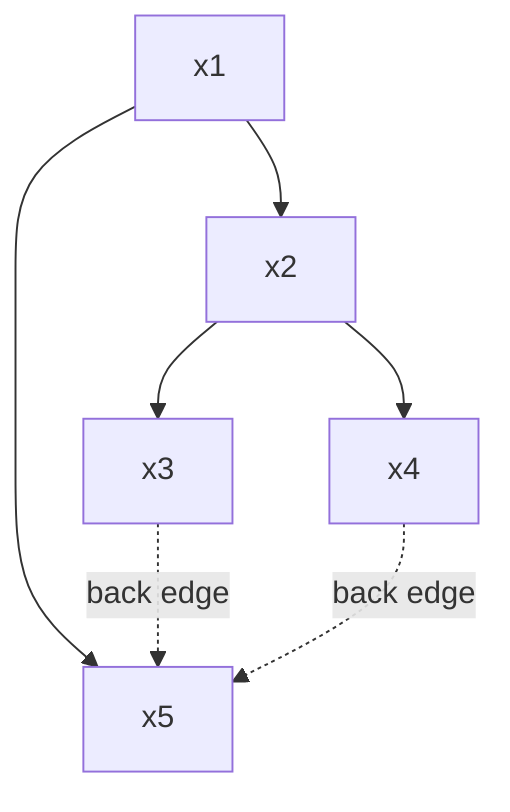
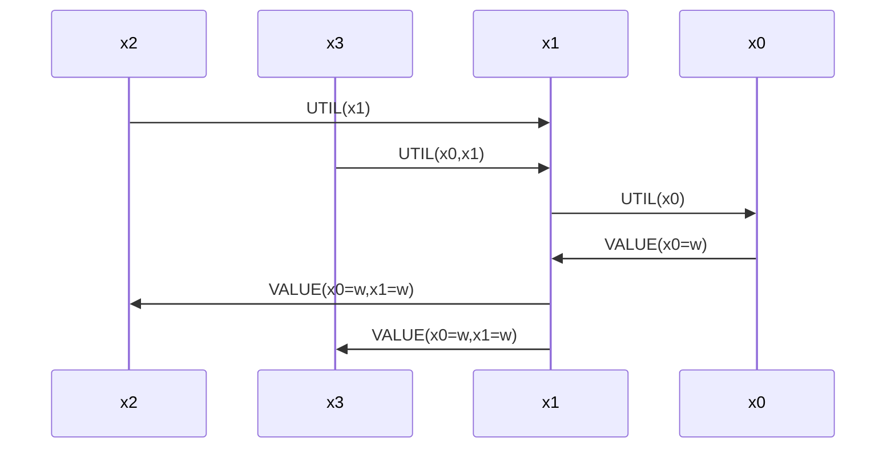
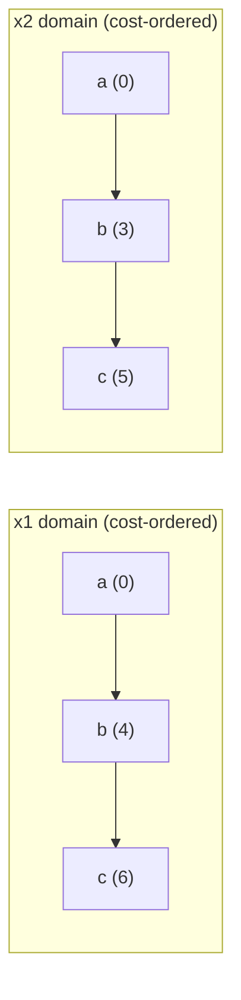

# Distributed Constraint Programming

[[book-guidelines|↩ Back to guidelines]]

## Why centralize at all?

Every CSP solver you've studied so far assumes one thing without saying it out loud: *somebody* has the whole problem in memory. One process knows every variable, every domain, every constraint, and gets to decide the search order. Chapter 20 (Faltings) starts by asking what happens when that assumption is simply false — not "inconvenient," but structurally impossible.

Concretely: meeting scheduling. Person A wants to meet B, B wants to meet C, and any two people on Earth are connected through roughly six degrees of separation. If you insist on gathering "the whole problem" before solving it, meeting scheduling becomes a CSP over a sizeable chunk of the world's population. That's absurd — and yet meeting scheduling *is* solvable in practice, because conflicts are almost always local and get resolved by small, local adjustments. The chapter's real thesis is that **when a problem's structure is naturally partitioned among autonomous participants who don't want (or aren't able) to share everything, you build the search into the message-passing between them, instead of collapsing everything into one node first.**

Four separate reasons show up for why you'd want this even when centralizing is *technically* possible:

- **Cost of formalization** — a supplier would have to enumerate every conceivable delivery-date/quantity combination up front for a centralized solver, instead of just answering the specific queries a distributed protocol actually asks.
- **Privacy** — a centralized solver sees every constraint of every agent; a distributed one lets agents reveal only what's needed to resolve an actual conflict.
- **Dynamicity** — agents come and go; there may be no stable moment at which "the problem" is well-defined enough to hand to a central server.
- **Brittleness** — a central solver is a single point of failure; a distributed one degrades gracefully and can parallelize.

The tradeoff: distributed algorithms burn a lot of messages, and message latency usually dwarfs the cost of a single constraint check. So the technique only pays off when the problem is **sparse and loose** (few constraints per variable, many satisfying tuples per constraint) — dense, tight problems are still better off centralized.

**What breaks without this framing:** if you try to force a distributed problem into a centralized shape, you either violate privacy, or you block on unavailable information, or you simply cannot enumerate the input (open-world domains, discussed below) — the algorithm has no starting point.

This is also, not coincidentally, close to home for the CSP kernel you're planning to embed in a verifier's toolchain: nogoods here are structurally the same idea as conflict clauses in CDCL/SAT, and open CSP's incremental domain discovery is the same shape as lazy theory-atom instantiation in SMT or counterexample refinement in CEGAR. Keep that thread in mind — it resurfaces explicitly at the end.

## 20.1 Setting up the formalism: two different kinds of "distributed"

The chapter is careful to split what "distributed" could mean into two genuinely different problems, because the algorithms that solve them are different in kind.

### Distributed CSP (DisCSP): control is distributed

**Definition 20.1.** A *distributed constraint satisfaction problem* is a tuple $\langle X, D, C, A \rangle$ where $X = \{x_1,\dots,x_n\}$ are variables, $D=\{d_1,\dots,d_n\}$ their domains, $C=\{c_1,\dots,c_m\}$ the constraints, and $A=\{a_1,\dots,a_n\}$ a set of agents (not necessarily distinct) such that agent $a_i$ *controls* variable $x_i$ — it sets $x_i$'s value, and it is assumed to know $d_i$ and every constraint touching $x_i$. Crucially, $n$ and $m$ need not be globally known to any single agent — this is what makes "unboundedly large" problems representable at all.

As in the ordinary (centralized) CSP setting from Chapter 1, each constraint $c_j = \langle r_{s_j}, s_j\rangle$ pairs a scope (tuple of variables) $s_j$ with a cost function $r_{s_j}: s_j \Rightarrow \{0,1\}$. Generalize $r_{s_j}$ to map into $\mathbb{R}^+$ and you get a **distributed constraint optimization problem (DCOP)** — hard constraints become cost $\infty$, and a solution minimizes the summed cost.

The load-bearing assumption to notice: *each agent controls exactly one variable and knows all constraints on it*. That's a strong assumption — in real meeting scheduling, no single participant unilaterally sets a meeting time, and nobody knows the other participants' full constraint sets. Silaghi et al.'s **asynchronous aggregation search (AAS)**, covered in §20.3, exists precisely to relax this: agents control *constraints* rather than variables and negotiate a consensus value, working on the problem's *dual*.

```rust
// A direct encoding of DisCSP's shape — the point isn't that you'd literally
// ship this, it's that "who owns what" becomes part of the type, not a
// runtime convention you have to remember to respect.
struct AgentId(u32);

struct Variable<V> {
    domain: Vec<V>,
    owner: AgentId,
}

struct Constraint<V> {
    scope: Vec<usize>,           // indices into the variable list
    // cost: 0 = satisfied, R+ = violation cost (CSP is the {0,1} special case)
    cost: Box<dyn Fn(&[V]) -> f64>,
}

struct DisCsp<V> {
    variables: Vec<Variable<V>>,
    constraints: Vec<Constraint<V>>,
    // NB: no agent is required to hold this whole struct — this is the
    // *specification*, not any single agent's runtime state.
}
```

### Open CSP (OCSP): *information* is distributed

The second axis is orthogonal: maybe every variable and constraint is centrally known, but the *admissible values* aren't — they live behind information sources (a supplier's live catalog, a sensor feed) that must be *queried*, and only grow monotonically over time.

**Definition 20.2.** An *open constraint satisfaction problem* is a possibly unbounded, partially ordered sequence $\{CSP(0), CSP(1), \dots\}$ where $CSP(i) = \langle X, D(i), C\rangle$, the variable set $X$ and the (binary, intensional) constraints $C$ are fixed, but the domains $D(i)$ only ever grow: $d_k(0) = \emptyset$ for all $k$, and $CSP(i) \prec CSP(j)$ iff every $d_k(i) \subseteq d_k(j)$ with at least one strict inclusion.

This is deliberately close to the *dynamic* CSP formulation from Chapter 21, except dynamic CSP varies the constraint set and this varies the domains — and only ever by growing them. That monotonicity is the entire engine of the section on open CSP: since domains never shrink, and constraints never change, once you find a consistent assignment at instance $i$, it stays consistent at every later instance. Faltings states this as:

**Lemma 20.3.** If $A$ is a consistent assignment to $CSP(i)$, then $A$ is also a consistent assignment to every $CSP(j) \succ CSP(i)$.

*Proof sketch:* domains only grow (so $A$ remains a valid assignment) and constraints are unchanged (so consistency is preserved). $\square$

This is the load-bearing fact for §20.5 below: it's what makes "solve without knowing the whole problem" *sound*, not just an optimistic heuristic.

**Open constraint optimization (OCOP)** adds cost/weight functions $w_i: d_i \to \mathbb{R}^+$ attached to domain *values* (not constraints — because you don't want to require full cost knowledge up front either).

If this reminds you of lazy SMT (theory atoms discovered on demand, never retracted mid-search-branch) or abstract interpretation's widening-with-monotone-lattice-growth, that's not a coincidence — it's the same "only ever learn more, never invalidate what you already proved" discipline, just instantiated for domain enumeration instead of abstract values.

## 20.2 Synchronous distributed backtracking

The obvious first move: take ordinary backtracking and pass the partial assignment around as a token. Agent $a_k$ holding the current partial assignment $\{x_1=v_1,\dots,x_k=v_k\}$ hands it to $a_{k+1}$, who extends it consistently if possible, or bounces a backtrack signal to $a_k$. This is, structurally, a *centralized* backtracking algorithm — the only thing distributed is *where the thread of control physically executes*; only one agent is ever doing useful work at a time.

Almost everything you know from centralized backtracking transfers directly:

- **Forward checking / higher consistency** — each agent maintains a live label of admissible values for its own variable, and propagation is just messages between the affected agents.
- **Variable ordering** — static or dynamic, decided by exchanging messages.
- **Backjumping** — instead of unwinding to "the previous agent," unwind directly to the agent that owns the *conflicting* variable.

Two refinements buy real efficiency without abandoning synchrony:
1. **Asynchronous forward checking**: fire the forward-checking messages to *all* unassigned-variable agents in parallel rather than one at a time — cheap parallelism inside an otherwise synchronous protocol.
2. **Dynamic distributed backjumping**: let instantiation proceed in parallel with forward checking, informing agents of domain wipeouts via nogood messages, plus a heuristic that orders values to dodge likely conflicts. The chapter reports this buys 1–2 orders of magnitude in cycles, constraint checks, and message count over the naive version.

**What synchronous backtracking doesn't buy you:** essentially none of the parallelism the *agents themselves* offer — only one agent is "live" at a time — and only a marginal privacy win (constraints stay local, but the *search state* itself still travels everywhere). This is precisely the gap the asynchronous algorithms exist to close.

## Asynchronous distributed backtracking (ABT)

This is where the chapter's center of gravity sits, and it's the part most worth internalizing carefully, because its core object — the **nogood** — is exactly the DisCSP analogue of a *learned conflict clause* in CDCL.

### The setup: fixed priority, agentview, nogoods

Yokoo et al.'s **Asynchronous Backtracking (ABT)** assumes binary constraints and a fixed, globally-known priority order over agents ($x_1$ highest priority, WLOG). The order doesn't require any agent to know the whole problem — it can just be derived from something like `(processor serial number, process id)`. For each constraint, the higher-priority endpoint is the *value-sending agent*; the lower-priority endpoint is the *constraint-evaluating agent*.

Every agent keeps:
- **`agentview`** — the last-known values of all *higher*-priority variables it shares a constraint with,
- **`nogoods`** — a store of resolvent facts of the form *"if these higher-priority variables hold these values, my variable cannot take value $v$ (at least cost $c$)"*,
- **`lower-agents`** — pointers to lower-priority agents sharing a constraint with it.

All agents run *concurrently*. There is no global clock; messages are assumed reliable and FIFO per sender, and agents don't crash (the chapter notes that if they do, the algorithm still terminates, but constraints controlled by the crashed agent aren't guaranteed satisfied).

### The core loop: `adjust-value`

Every time an agent's `agentview` changes (a higher-priority neighbor moved) or it receives a new nogood, it re-evaluates:

$$
\delta(v) \;=\; r_{\{x_i\}}(v) \;+\!\!\sum_{x_j \in \text{agentview}}\!\! r_{\{x_i,x_j\}}(v, v_j)
$$

— the local violation cost of value $v$ against everything it currently believes about higher-priority neighbors — then folds in any stored nogoods compatible with the current agentview as a lower bound $LB$, and picks the value minimizing $\delta(v) + LB(v)$. (In plain CSP, $r$ returns $\{0,1\}$; the same machinery generalizes verbatim to optimization — this is **ABT-opt** — by letting $r$ return real cost. The chapter presents ABT-opt directly since ABT is the $\{0,1\}$ special case.)

If the minimizing cost is *nonzero for every value* — no consistent choice exists given the current agentview — the agent has discovered a **nogood**: a resolvent of its constraints (and any nogoods it already held) proving *this specific combination of higher-priority values* admits no solution. It ships that nogood to the *lowest-priority* agent named in it. That receiving agent may not even have had a link to the sender before (asynchronous exploration can surface constraints that weren't "active" yet) — if so, it sends an `add-link` message to establish one and learn that variable's current value.

```rust
// The essential shape of a nogood — this is the DisCSP analogue of a
// learned clause in a CDCL solver: a proof, expressed as data, that a
// particular partial assignment cannot be extended to a solution.
struct Nogood {
    for_value: Value,          // the value this rules out for the receiver
    conditions: Vec<(AgentId, Value)>,  // the higher-priority assignment that forces it
    tag: HashSet<AgentId>,     // which agents' subproblems this cost accounts for
    cost: f64,                 // lower bound on cost implied by `conditions`
    exact: bool,               // is `cost` exact, or only a lower bound?
}

// adjust-value, stripped to its essential decision rule
fn best_value(domain: &[Value], agentview: &Agentview, nogoods: &[Nogood]) -> (Value, f64, bool) {
    domain.iter()
        .map(|v| {
            let delta = local_violation_cost(v, agentview);
            let (lb, exact) = nogoods.iter()
                .filter(|ng| ng.for_value == *v && ng.conditions_match(agentview))
                .fold((0.0, true), |(lb, ex), ng| (lb + ng.cost, ex && ng.exact));
            (*v, delta + lb, exact)
        })
        .min_by(|a, b| a.1.partial_cmp(&b.1).unwrap())
        .unwrap()
}
```

Walk the worked example from the chapter: a chain-ish graph $x_1{=}x_2{=}x_3{=}x_5$, $x_1{=}x_4$, $x_3{=}x_4{=}x_5$, all inequality constraints, all agents starting at value `a`. Round 1: everyone with a higher-priority neighbor at `a` flips to `b`. Round 2: cascading re-adjustments. Round 3: $a_5$ finds *no* consistent value — both `a` (blocked by $x_3{=}a$) and `b` (blocked by $x_4{=}b$) are ruled out — so it manufactures the nogood "$x_3{=}a \Rightarrow x_5 \ne a$" with cost 1 and ships it to $a_4$ (the lowest-priority agent in its agentview). $a_4$ re-evaluates, finds `c` in its (larger) domain works, and the whole system quiesces.

**What breaks without nogoods, concretely:** without storing *why* a value failed, an agent will simply rediscover the same dead end every time the same higher-priority context recurs — that's the entire reason nogoods exist as first-class, storable, resolvable objects rather than transient failure signals.

### DFS-tree ordering and why it matters for *exactness*

Naively, if several nogoods about the *same* lower-priority variable pile up along different message chains, their costs could double-count that variable's contribution — fine for plain satisfiability (you only care "consistent or not"), fatal for optimization (you need the *exact* minimum).

The fix: order agents along a **depth-first-spanning-tree (DFS tree)** of the constraint graph, where any non-tree ("back") edge only ever connects an ancestor to a descendant — never two siblings or cross-branches.



Because nogoods always propagate up to the *lowest-priority ancestor*, and back-edges only ever run along a unique ancestor path, **a given variable can appear in only one chain of nogoods** — so the cost that chain reports is provably the exact cost of that subtree, not an overlapping over-count. This single structural fact — "DFS-tree ordering ⇒ no two nogood chains double-count the same variable" — is the entire correctness argument underlying **ADOPT** (Modi et al.), which is essentially ABT-opt run over a DFS-ordered agent tree, plus a *backtrack-threshold* bookkeeping mechanism to avoid needlessly re-deriving nogoods that a higher-priority ancestor has already "seen" for a value it's about to revisit.

### Termination and soundness

Termination detection piggybacks on the `exact` flag: a nogood is `exact` once it accounts for the *entire* lower-priority subtree beneath the sender (not just a lower bound from partial information). Once the **highest**-priority agent derives an exact nogood, the algorithm halts — cost 0 means a (provably optimal, for DCOP) solution; nonzero cost means no consistent assignment exists.

Soundness is a clean induction on priority, worth internalizing because it's the same proof *shape* you'll want for your own distributed/incremental solvers:

> **Base case** ($x_n$, no lower-priority variables): it picks its optimum instantly and reports an exact cost.
> **Inductive step**: assume $x_{k+1},\dots,x_n$ converge to the optimal cost given fixed $x_1,\dots,x_k$, reported exactly. $x_k$ only changes value when its currently-best value's nogood cost *increases* past another value's; since nogoods are lower bounds on a *finite*-valued optimal cost, they can only increase finitely often — so $x_k$ reaches quiescence, and by hypothesis then holds the true optimal value given its ancestors' assignment. By induction this holds up to $x_1$. $\blacksquare$

This is a completeness argument built entirely out of "monotone nogoods on a finite-cost lattice can't increase forever" — the same style of termination argument you'll lean on for fixpoint-based abstract interpretation and CHC solving: bounded monotone information + no unbounded oscillation ⇒ termination.

## Variants worth knowing by name (§20.3)

You won't reimplement all of these, but each one names a real design axis you'll face when you build your own distributed/incremental solver:

- **Asynchronous Aggregation Search (AAS)** — agents own *constraints*, not variables (working over the problem's dual); equivalent value-combinations get batched into a single message rather than enumerated one-by-one, buying orders-of-magnitude message reduction on random problems.
- **Distributed consistency maintenance (MHDC)** — arc consistency adapted to the asynchronous setting: labels must now be tagged with *which higher-priority context* justified them, since that context can go stale.
- **Asynchronous Weak-Commitment Search (AWC)** — instead of a fixed priority order, whichever agent triggers a backtrack gets *promoted* to highest priority, focusing search on the genuinely hard subproblem. An order of magnitude faster in practice — at the cost of needing to store an *exponential* number of nogoods to remain complete under constant reordering.
- **Asynchronous reordering (ABTR, ABT_DO)** — a tamer middle ground: an agent may only reorder agents *below* itself, preserving the validity of already-received nogoods (so termination is still guaranteed), arbitrated by a lexicographic counter-vector signature scheme when multiple reorderings race.
- **Cooperative mediation (OptAPO)** — dynamically detect a hard local subproblem and hand it to a single mediating agent to solve *centrally* (branch-and-bound) before handing control back — a pragmatic hybrid that pays off specifically when message latency is the dominant cost.
- **Distributed dynamic programming (DPOP)** — the most structurally different alternative: instead of exploring assignments sequentially (which forces $O(\text{exponential})$ *messages*, one per explored partial assignment), agents ordered on a DFS/pseudotree run **bucket elimination** cooperatively. Each child sends its parent one `UTIL` message summarizing, *for every value the parent could take*, the optimal cost of everything below it (computed via the standard bucket-elimination combine-and-project operation); once the root has heard from all children it fixes its own optimal value and the `VALUE` messages cascade back down. Message *count* is now linear in problem size — the price is message *size*, which is exponential in the induced width of the ordering (the classic space/communication tradeoff of dynamic programming, just made explicit as bytes-on-the-wire instead of table entries in memory).

**Worked DPOP example**, condensed from the chapter: a 4-variable tree $x_0 \to x_1 \to \{x_2, x_3\}$ (Boolean domains, pairwise cost tables). Leaves $x_2, x_3$ immediately satisfy the "received UTIL from all children" rule (vacuously — they have none) and each sends its parent $x_1$ a UTIL table summarizing its best achievable cost for each value $x_1$ might take. $x_1$ combines those with its own table (bucket-elimination's combine step, i.e. sum the tables cell-by-cell over shared assignments and project out the child's own variable) into a UTIL message to $x_0$. $x_0$, now having heard from its only child, picks its optimal value and pushes it down as a `VALUE` message; $x_1$ can now resolve *its* value given $x_0$'s and push `VALUE` to $x_2, x_3$, who finalize theirs. No further termination detection is needed — every agent *knows* it has the exact optimum the instant it decides, because DPOP's message-passing schedule guarantees completeness by construction rather than by post-hoc detection.



A nice unifying observation the chapter makes explicitly: if you *systematically* store all nogoods in ABT (rather than discarding stale ones), asynchronous backtracking and DPOP converge to exchanging **identical information** — just packaged differently (a sequence of small nogood messages vs. one large UTIL table). Backtracking-with-full-nogood-storage and dynamic programming aren't two unrelated techniques; they're two serializations of the same underlying computation.

## Distributed local search (§20.4)

Backtracking-family algorithms explore the search space by *changing an assignment and messaging about it*, which means message count scales with the (exponentially large) space explored. Local search sidesteps this by never claiming to explore the whole space: start from a full (possibly inconsistent) assignment and make small, local, single-variable moves that reduce violations. Because each move only touches one variable, it's naturally a single agent's job — which makes local search unusually well-suited to distribution, arguably more so than backtracking.

**The coordination problem.** If every agent that's currently in conflict greedily flips to its locally-best value *simultaneously*, you can get oscillation: two constrained neighbors both starting at `a` (inequality constraint) will both flip to `b` in the same round, staying just as inconsistent as before, forever. **Algorithm 20.2** fixes this with a two-phase message round per cycle:

1. **Exchange current values** with all neighbors $N(x)$; compute `currentCost`.
2. **Exchange proposed improvements** ($\delta_{\max}$, the best cost reduction achievable) with those same neighbors; an agent only actually *commits* its proposed move if no neighbor proposes a *bigger* improvement (ties broken by a fixed priority). This guarantees neighbors never move simultaneously.

```python
# Distributed hill-climbing with coordination — Python sketch of Algorithm 20.2's
# decision core (the two-phase message exchange is the load-bearing part;
# everything else is bookkeeping for termination detection).
def local_step(my_value, domain, neighbor_values, cost_fn):
    current_cost = sum(cost_fn(my_value, v) for v in neighbor_values.values())
    best_delta, best_value = 0, None
    for v in domain:
        delta = current_cost - sum(cost_fn(v, nv) for nv in neighbor_values.values())
        if delta > best_delta:
            best_delta, best_value = delta, v
    return best_delta, best_value  # broadcast this; commit only if nobody beats it
```

Termination uses two distance-propagating counters, `tc1` (distance to the nearest still-violated constraint) and `tc2` (distance to the nearest agent that could still improve) — each agent takes the min of its own counter and its neighbors' counters plus one, each round. Once both counters everywhere exceed a known (over-estimate is fine) `max-dist` bound on the constraint graph's diameter, no further improvement is reachable and the algorithm halts — success if `tc1` also cleared that bound (no violations left), failure otherwise.

**Escaping local minima.** Plain hill-climbing gets stuck. Two fixes:
- **Distributed stochastic search**: accept a non-improving move with some probability $p$ — a direct distributed analogue of simulated annealing.
- **Breakout algorithm**: attach an integer *weight* (initially 1) to every constraint; minimize *weighted* cost instead of raw violation count; whenever the loop terminates without a consistent solution, bump the weight of every currently-violated constraint by 1 and restart. This makes the current (bad) local optimum progressively less attractive.

**What breaks:** the breakout algorithm is *provably incomplete*. Figure 20.7's example — an 8-node cycle graph-coloring instance — shows a configuration where increasing conflicting-edge weights just relocates the same two-conflict pattern around the cycle indefinitely, never converging, with constraint weights climbing forever. The chapter's practical fix is to *detect* this signature (persistently-increasing weights in some subproblem) and, if that subproblem is small enough, hand it off to a complete backtracking solver — a hybrid, not a pure fix.

## Open constraint programming (§20.5)

Return to the second axis from §20.1: what if the variable/constraint *structure* is known and bounded, but admissible *values* live behind information sources that must be queried, and only ever grow? (Faltings's example: a financial-portfolio configurator where products are themselves dynamically composed by external providers — there's no way to bound "all possible products" up front.)

**Open CSP is feasible "for free"** by Lemma 20.3 (§20.1): since domains only grow and constraints don't change, any consistent assignment found now stays a solution forever. So an algorithm can simply *stop* the moment it finds one — no need to ever see the "rest" of any domain. The remaining challenge is purely about *querying efficiently*: fetch just enough domain values, from just enough variables, to either certify a solution or certify unsatisfiability of some sub-problem, without falling into an infinite chase of an unboundedly large domain.

**Open constraint optimization is *not* free** — and the reason is worth sitting with, because it's a sharp, general point about proving optimality under partial information. You can only certify that a candidate solution is *optimal* — not just consistent — if queries to each information source are guaranteed to return the **most-preferred (lowest-cost) values first**. Faltings's Figure 20.8 example: two variables $x_1, x_2$ linked by an inequality, each with a cost-ordered stream of candidate values. If $x_1{=}a, x_2{=}b$ has cost $0+3=3$, you can *certify* that's optimal from just the first two values of each domain — because any solution using $x_1$'s third-or-later value already costs $\ge 4$, and likewise for $x_2$'s. Drop the monotone-ordering assumption and this reasoning collapses: a later, unseen value could beat your current best, and you'd have no way to know without exhausting the (possibly unbounded) domain.



**Algorithm 20.3 (`fo-opt`)** operationalizes this as an $A^*$-style best-first search: `OPEN` holds complete-but-possibly-inconsistent assignments, ordered by cost; the cheapest is expanded; if it's consistent, it's returned (optimal, by construction, since nothing cheaper remains unexplored); otherwise, successors are generated **only** for the variables in the *first violated constraint* (not all $n$ variables) — this is the key move that keeps the number of costly external queries close to the theoretical minimum, rather than growing successors for every variable at every step.

```rust
// The essential loop shape of fo-opt: best-first over complete assignments,
// generating successors only along the first violated constraint.
fn fo_opt(vars: &[VarId], mediator: &mut impl DomainOracle) -> Assignment {
    let mut open: BinaryHeap<Reverse<(Cost, Assignment)>> = BinaryHeap::new();
    let initial: Assignment = vars.iter().map(|v| mediator.next_best(*v)).collect();
    open.push(Reverse((cost(&initial), initial)));

    loop {
        let Reverse((_, a)) = open.pop().expect("OCOP is infeasible or truly unbounded");
        if let Some(violated) = first_violated_constraint(&a) {
            for v in violated.scope() {
                let mut b = a.clone();
                b[v] = mediator.next_best(v); // costly external query, done sparingly
                open.push(Reverse((cost(&b), b)));
            }
        } else {
            return a; // consistent AND cheapest remaining ⇒ provably optimal
        }
    }
}
```

The chapter notes this generalizes to a fully distributed setting too: [27] integrates open constraint optimization with DPOP (ODPOP), exchanging strictly less information than DPOP/ADOPT/ABT run over fully-known domains.

## Further issues, briefly

Two threads the chapter closes with, worth knowing exist even without full derivations:

- **Incentive-compatibility (VCG tax).** If agents can misreport constraint costs to bias the outcome in their favor, the whole optimization becomes meaningless. The **Vickrey-Clarke-Groves mechanism** — the *unique* general scheme achieving both incentive-compatibility and individual rationality — charges each agent the *marginal cost its own constraints impose on everyone else*: $\text{payment}(A) = \sum_{r_k \in R - R_A} r_k(v^*_R) - r_k(v^*_{R-R_A})$. Overstating costs means paying a tax exceeding the gained advantage; understating means losing more value than the tax saved — truth-telling is the individually rational equilibrium. It explicitly **does not extend to hard constraints**, since a hard constraint can impose unbounded cost on everyone else, which would require unbounded (and therefore individually-irrational) tax.
- **Privacy via cryptography.** Yokoo's secure DisCSP protocol encrypts constraint matrices homomorphically (so consistency can be checked on encrypted values without decrypting individual constraints), randomly permutes domain values so no agent can map positions to meanings, and deliberately explores the *entire* search space so that timing leaks no information. It's provably strong but expensive enough that it hasn't seen practical deployment at realistic scale — ordinary DisCSP algorithms already offer a weaker, "cheap" form of privacy simply by only revealing constraints to directly-conflicting neighbors.

## Where this leads

Structurally, this chapter is what happens when you take the search techniques from earlier chapters — backtracking (Ch. 1–ish foundations), local search (Ch. 5), and dynamic programming/bucket elimination (referenced from Ch. 1's tractability material) — and ask "what if no single process can hold the whole state?" Every technique here has a direct centralized ancestor; the interesting content is entirely in what has to change to make it sound and terminating under partial knowledge and asynchronous message-passing.

For the compiler/verifier project specifically, three connections are worth being explicit about, since they're not analogies so much as the *same mechanism under a different name*:

- **Nogoods are conflict clauses.** ABT's `receive-nogood` / `adjust-value` loop is structurally identical to CDCL's conflict-driven clause learning: both derive a resolvent proving "this partial assignment is dead," store it, and use it to prune future search without rediscovery. If your CSP kernel needs a from-scratch conflict-learning search procedure for counterexample search over refinement-type invariants, ABT-opt's nogood bookkeeping (tags for termination detection, discarding nogoods that fall outside the current context) is a cleaner worked example than most SAT-solver internals writeups, precisely because it's forced to be explicit about *why* a fact is still valid (the `agentview` context) rather than relying on an implicit trail.
- **Open CSP is CEGAR/lazy-SMT's discipline, formalized.** Lemma 20.3 — "once found, a solution under partial information stays valid as information monotonically grows" — is exactly the soundness property you need for lazy theory-atom instantiation (SMT) or counterexample-guided abstraction refinement: you're allowed to reason with a *partial* model of the world as long as new information only ever adds constraints/values, never invalidates earlier conclusions. The `fo-opt` algorithm's insistence on cost-ordered queries as a *precondition* for provable optimality is a sharp warning worth carrying into any CEGAR-style refinement loop you design: if your refinement oracle doesn't return "best counterexample first" (or some analogous ordering guarantee), you lose the ability to *certify* termination-with-optimality, not just efficiency.
- **DFS-tree ordering as a structural tractability tool.** The exact-cost guarantee from ordering agents along a DFS spanning tree (no two nogood chains can double-count a variable) is the same shape of argument as bounded-treewidth tractability results elsewhere in this handbook (see `Tractability-and-Computational-Complexity-of-CSPs.md`) — induced width shows up here too, bounding both ABT's storage requirement and DPOP's message size. If your own CSP kernel ever needs to reason about *why* a particular variable/constraint ordering is tractable, "does this ordering prevent double-counting along independent paths" is a concrete, checkable question to ask of it, not just an appeal to treewidth as a black box.
