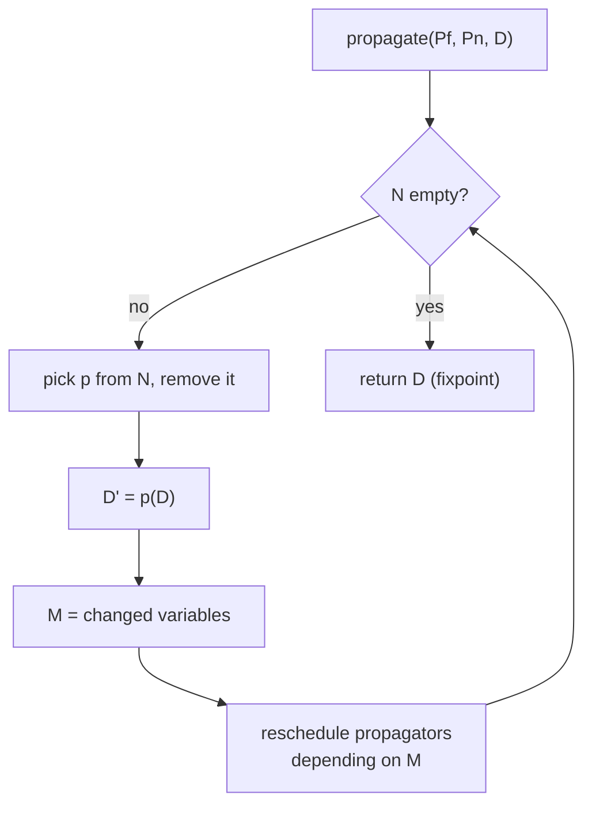
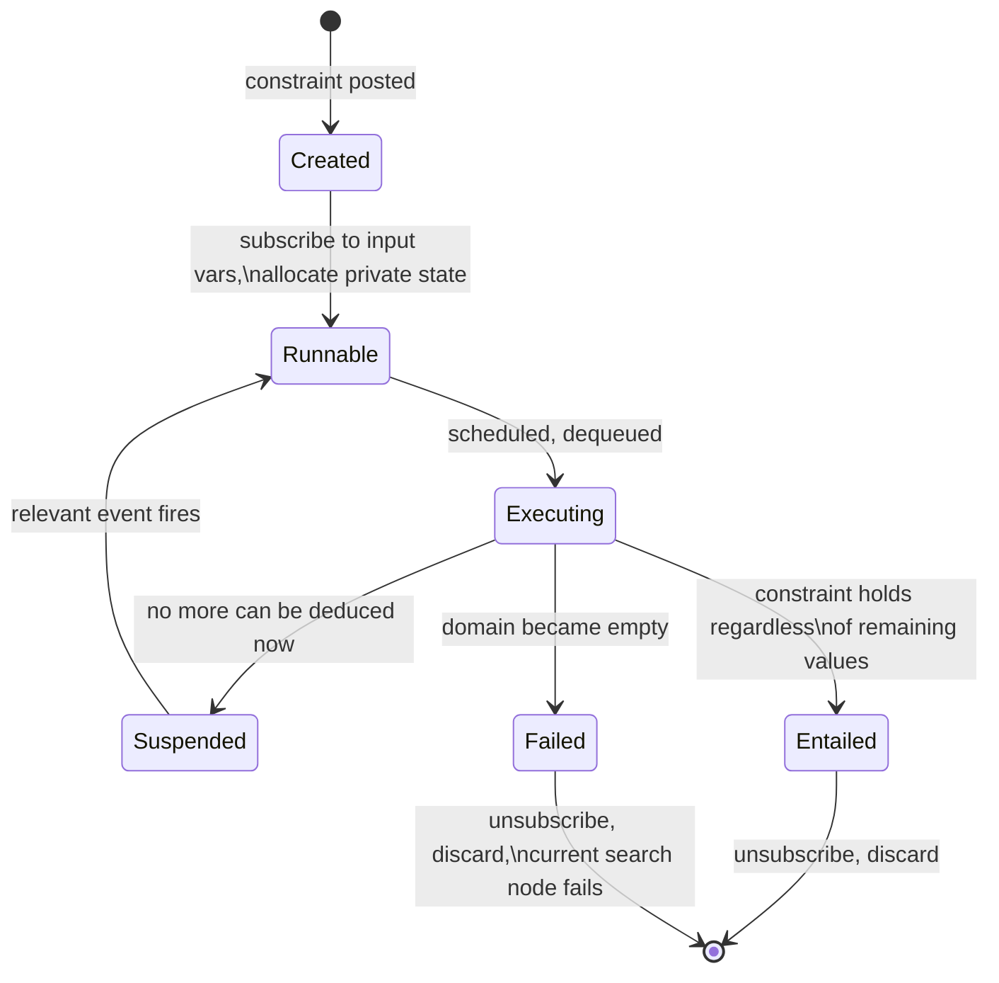

# Finite Domain Constraint Programming Systems

[[book-guidelines|↩ Back to guidelines]]

## Why a system needs an architecture, not just a theory

Earlier chapters in this handbook define what constraint propagation *means*: a local consistency property, a declarative specification of "how much has been deduced." That's a theory of correctness. It says nothing about how a running program actually organizes millions of small deductions, decides which one to perform next, undoes work when a branch fails, or exposes any of this to an application programmer. Schulte and Carlsson's chapter is about that second problem — the engineering discipline of *building* a constraint solver, not proving one correct.

This gap matters because it's exactly the gap between a specification and an implementation you already navigate when moving from typing rules to a type checker, or from an operational semantics to an interpreter. A CSP $\langle X, D, C \rangle$ and a target consistency level tell you *what* a solver should compute. They say nothing about whether a variable's domain is a bitvector or a linked list of ranges, whether "apply this propagator" means running a closure or resuming a coroutine, or how you get back the previous domain after a failed guess. Get the theory right and get the architecture wrong, and you have a solver that is correct but too slow to use, or one where every new global constraint requires re-deriving how the whole system behaves.

**What breaks without this layer:** without a disciplined architecture, "add a new constraint" becomes "understand and touch the fixpoint loop, the failure-detection code, the backtracking machinery, and the scheduler, all at once." The entire point of the propagator abstraction below is to let each constraint be implemented in isolation — as a small, local, decreasing function — while the system-level machinery (the propagation engine, the search procedure, state restoration) stays fixed and constraint-agnostic. This is the same modularity discipline that lets you add a typing rule to a bidirectional checker without touching unification, or add an inference pass to an abstract interpreter without touching the fixpoint driver.

This connects directly to two things on your project's list. First, a propagator is a *monotone, decreasing* function on domains iterated to a fixpoint — this is literally Kleene iteration on a lattice, the same mathematical object that drives abstract interpretation's dataflow analysis. Second, the `search` procedure below, with its branching-and-backtracking structure, is the direct ancestor of the CDCL-style search your CSP kernel for counterexample-finding will need. Keep both in mind; the closing synthesis returns to them explicitly.

## 14.1 — The architecture, abstractly

### Domains, and what "decreasing" buys you

A **domain** $D$ is a total mapping from a fixed set of variables $V$ to finite sets of integers. $D$ is *failed* if $D(x) = \emptyset$ for some $x$; a variable $x$ is *fixed* by $D$ if $|D(x)| = 1$. Two domains compose by pointwise intersection, $D_1 \sqcap D_2$, defined by $(D_1 \sqcap D_2)(x) = D_1(x) \cap D_2(x)$, and one domain is **stronger** than another, $D_1 \sqsubseteq D_2$, if $D_1(x) \subseteq D_2(x)$ for every $x$. This makes domains a lattice under $\sqsubseteq$, with $\sqcap$ as meet — the ordering direction is "more information."

A **propagator** $p$ is a function on domains satisfying two laws:

- **Decreasing**: $p(D) \sqsubseteq D$ for all $D$ — propagation only removes candidate values, never adds them.
- **Monotonic**: $D_1 \sqsubseteq D_2 \implies p(D_1) \sqsubseteq p(D_2)$ — propagating a more-informed domain yields an at-least-as-informed result.

These two laws are the entire contract. Notice how weak the correctness requirement is: $p$ is **correct** for a constraint $c$ iff it removes no assignment satisfying $c$ — formally $\{a \in D\} \cap c = \{a \in p(D)\} \cap c$ for every domain $D$. The *identity* propagator is correct for every constraint under this definition; correctness alone says nothing about how much work $p$ actually does. What ensures a propagator set is worth having is a second, separate requirement: a set of propagators $P$ is **checking** for $c$ if, restricted to domains where every variable of $c$ is fixed, $p(D)=D$ for all $p \in P$ exactly when the resulting unique assignment satisfies $c$. A set that is both correct and checking for $c$ **implements** $c$, written $P = \mathrm{prop}(c)$.

This decoupling — correctness (never wrong) from checking (eventually decisive) — is deliberate and important. It means a constraint's implementation is free to trade off strength for speed anywhere between "does nothing" and "achieves full domain consistency," as long as it never removes a solution and eventually distinguishes solutions from non-solutions on fully-fixed inputs. Weak, cheap propagators and strong, expensive ones are both legitimate implementations of the same constraint; the architecture has no opinion about which "consistency level" you pick. That freedom is what lets systems offer both cheap indexical-based propagation and expensive global-constraint filtering algorithms for the same kind of relation, and is exactly the same freedom your CSP kernel will want when choosing between cheap interval propagation and expensive relational propagation for a non-linear constraint.

What a solver actually computes is the **greatest mutual fixpoint** of all propagators in $P$, starting from initial domain $D$:
$$
\mathrm{solv}(P, D) = \mathrm{gfp}\bigl(\lambda d.\ \mathrm{iter}(P, d)\bigr)(D), \qquad \mathrm{iter}(P, D) = \bigsqcap_{p \in P} p(D)
$$
This is a Kleene-style least-fixpoint computation run on the *dual* lattice (domains only shrink, so "least changed" reads as "greatest" under $\sqsubseteq$'s information ordering) — structurally identical to the fixpoint that a dataflow/abstract-interpretation worklist algorithm computes over an abstract lattice with monotone transfer functions. A propagator is, in that reading, an abstract transformer; $\mathrm{solv}(P,D)$ is the analysis result. If you've implemented a worklist-based reaching-definitions or interval analysis, you have already implemented a restricted case of this architecture.

### The propagation engine

Figure 14.1's `propagate` algorithm computes $\mathrm{solv}(P, D)$ operationally, and it is a worklist algorithm in the same sense as a dataflow-analysis fixpoint driver:

```
propagate(Pf, Pn, D):
    N ← Pn                          # not known to be at fixpoint
    P ← Pf ∪ Pn
    while N ≠ ∅:
        p ← select(N); N ← N − {p}
        D' ← p(D)
        M ← {x ∈ V | D(x) ≠ D'(x)}          # modified variables
        N ← N ∪ {p' ∈ P | input(p') ∩ M ≠ ∅} # reschedule dependents
        D ← D'
    return D
```

$P_f$ ("f" for fixpoint) holds propagators already known to be stable for $D$; $P_n$ holds the rest. Splitting the input this way is what makes propagation *incremental* across recursive calls into search — after a branching decision only the new propagators (or those touching changed variables) need to be reconsidered, not the whole set.

Termination follows from the decreasing law: each iteration either removes a propagator from $N$ or strictly shrinks $D$, and there are only finitely many domains to shrink through. Correctness — that the result really is $\mathrm{solv}(P,D)$, independent of selection order — follows from monotonicity. This is precisely why the two laws are non-negotiable: relax either one and the loop either fails to terminate or becomes selection-order-dependent, which would make the solver's answer depend on implementation accident rather than the constraint set. The engine (with $P_f=\emptyset$) is essentially Apt's classical propagation algorithm.

**What breaks without incrementality:** if `propagate` were called fresh from $P_f = \emptyset$ at every search node, every one of possibly millions of search nodes would re-run every propagator from scratch, discarding all fixpoint information the parent node had already established. Incremental propagation — only re-examining what the branching decision could plausibly have disturbed — is what makes propagation-based search practical at all; it is the direct analogue of incremental dataflow re-analysis after a local program edit.



A minimal Rust sketch of the same loop, treating propagators as trait objects — this is close to how you'd actually structure the propagation core of a Rust CSP kernel:

```rust
trait Propagator {
    /// Prune `dom` in place; return which output variables actually changed.
    fn propagate(&self, dom: &mut Domain) -> ChangeSet;
    fn input_vars(&self) -> &[VarId];
    fn is_idempotent(&self) -> bool { false }
}

fn propagate(
    propagators: &[Box<dyn Propagator>],
    mut queue: VecDeque<usize>,          // indices into `propagators`, "not at fixpoint"
    dom: &mut Domain,
) -> Result<(), Failed> {
    let mut scheduled: HashSet<usize> = queue.iter().copied().collect();
    while let Some(pi) = queue.pop_front() {
        scheduled.remove(&pi);
        let changed = propagators[pi].propagate(dom)?;   // `?` = domain went empty
        if changed.is_empty() { continue; }
        for (pj, p) in propagators.iter().enumerate() {
            if pi == pj && p.is_idempotent() { continue; }   // 14.1.3
            if p.input_vars().iter().any(|v| changed.touches(*v)) && scheduled.insert(pj) {
                queue.push_back(pj);
            }
        }
    }
    Ok(())
}
```

### Improving propagation: idempotence, entailment, rewriting

The naive engine reschedules a propagator every time one of its own input variables changes — including changes *it itself just caused*. Three refinements the book introduces cut this waste:

- **Idempotence**: $p$ is idempotent if $p(p(D)) = p(D)$ — applying it twice in a row is wasted work. An idempotent propagator can immediately be dropped from $N$ after it runs, instead of waiting to discover on the next iteration that it has nothing left to do (Example 14.3, extending the propagation engine with lines 9–10 in the figure).
- **Entailment**: a strictly stronger property. $p$ is entailed by $D$ if *every* domain $D' \sqsubseteq D$ is already a fixpoint of $p$ — meaning $p$ can be permanently deleted from $P$, not merely skipped this round. For $x_1 \le x_2$, entailment holds as soon as $\max_D x_1 \le \min_D x_2$: no further narrowing of either variable can ever make this propagator do anything again (Example 14.4).
- **Propagator rewriting**: once some of a propagator's variables are fixed, it can sometimes be swapped for a cheaper, specialized propagator. For $x_1+x_2+x_3\le 4$ with $x_2$ fixed to $3$, the ternary propagator can be rewritten to the binary $x_1 \le 1-x_3$ (Example 14.5) — the general condition being $p(D') = p'(D')$ for all $D' \sqsubseteq D$.

**What breaks without these:** idempotence and entailment aren't optimizations you can skip and merely pay a constant-factor tax for — without entailment detection in particular, a propagator that has become permanently satisfied keeps being re-examined (and re-subscribed to events) for the rest of search, at every node, forever. On a search tree with millions of nodes this is not a rounding error. The chapter is explicit that guaranteeing either property gets *harder*, not easier, once the same variable occurs more than once among a propagator's parameters (aliasing) — Section 14.2.3 returns to this.

### Propagation events

Rather than track raw domain equality, real systems classify *how* a domain changed, using events: `fix(x)` (x became a singleton), `minc(x)`/`maxc(x)` (bound moved), `any(x)` (domain changed at all). These satisfy a monotonicity law across a three-way domain chain $D \sqsupseteq D' \sqsupseteq D''$:
$$
\mathrm{events}(D, D'') = \mathrm{events}(D, D') \cup \mathrm{events}(D', D'')
$$
i.e., events compose additively along a chain of narrowings — you never lose information about what happened by observing it in two steps instead of one. A propagator declares an **event set** $es(p)$: the coarsest, cheapest-to-check summary of "which kinds of change could possibly un-fix my fixpoint." For $x_1 \le x_2$'s propagator, only $\{\mathrm{minc}(x_1), \mathrm{maxc}(x_2)\}$ matters — a change to $x_1$'s *maximum* or $x_2$'s *minimum* can never invalidate this propagator's fixpoint, so there's no reason to re-schedule on those. This is a cheap, sound over-approximation of "did this propagator's precondition change" — the same shape of question that drives whether a dataflow-analysis worklist item needs to be reprocessed after a predecessor block's `out`-set changes.

## 14.2 — Implementing propagation: what a real engine looks like

Section 14.1 defines the *contract*. Section 14.2 is about the actual software: domain variables as data structures, propagators as coroutines with a life cycle, and propagation services connecting them.

### Domain representations, and their cost tradeoffs

Two representations dominate. A **range sequence** stores $D(x)$ as a sorted list of disjoint intervals $[n_1,m_1],\dots,[n_k,m_k]$; a **bit vector** stores one bit per representable integer. Table 14.1 gives the complexity tradeoff for a range sequence of length $r$ against a bitvector of size $v$ (both augmented with cached min/max):

| Operation | Range sequence | Bit vector |
|---|---|---|
| `getmin()` / `getmax()` | $O(1)$ | $O(1)$ |
| `hasval(n)` | $O(r)$ | $O(1)$ |
| `adjmin(n)` / `adjmax(n)` | $O(r)$ | $O(1)$ |
| `excval(n)` | $O(r)$ | $O(v)$ |
| iterate (`done`/`value`/`next`) | $O(1)$ per step | $O(v)$ worst-case per step |

Range sequences scale to large sparse domains (a domain of size $10^9$ costs nothing extra if it's one interval); bit vectors give $O(1)$ membership and bound-adjustment at the cost of memory proportional to the *range*, not the *cardinality*, of values. Neither dominates — which is exactly the kind of representation choice a Rust implementation should make an interface decision about (a trait `Domain` with both a `RangeSetDomain` and a `BitsetDomain` impl), not a hardcoded one, since different propagators have different access patterns (a linear-arithmetic propagator wants bound access; an `all-different` propagator wants fast membership and iteration).

### Propagators as coroutines: the life cycle

A propagator is not a pure function in a real system — it's a stateful object with a life cycle (Figure 14.3):



Each run of a propagator ends in exactly one of three outcomes: **fail** (some domain went empty — the current search node dies), **entail** (permanently satisfied — unsubscribe and discard), or **suspend** (nothing more to deduce *right now* — go back to sleep until a relevant event wakes it up again). This life cycle is the concrete, running-system version of the abstract "decreasing, monotonic function" from 14.1 — the mathematics says what each *call* to $p$ must satisfy; the life cycle says what happens *between* calls.

**Subscription** determines who gets woken: on creation, $p$ subscribes to its input variables, so any event matching $es(p)$ on one of them re-schedules $p$. Implementations vary in how coarse or fine the wake-up granularity is (Section 14.2.3 calls this the amount of information provided on resumption): **coarse** (something changed, no detail — SICStus, Mozart), **medium** (which parameters changed — CHIP), or **fine** (which parameters and which values were removed — ILOG Solver). This is a genuine engineering tradeoff, not a strict hierarchy of goodness: fine-grained information lets a propagator be more incremental (do less recomputation on resumption) at the cost of the propagation service doing more bookkeeping on every domain change, whether or not any propagator ends up using it.

**Daemons** are a further optimization: rather than always waking the full propagator, a suspension-list entry can instead point at a lightweight procedure (the daemon) that runs a cheap test and only escalates to full scheduling if the test says there's real work to do. This trades a small amount of per-event overhead for avoiding much larger scheduling/resumption overhead on events that turn out not to matter.

**Private state** is what lets a propagator be *incremental* — a filtering algorithm that runs a graph or bipartite-matching computation from scratch on every resumption is usually wasteful when only one variable changed by one value since last time; storing the auxiliary data structure (and updating it incrementally) is often an order of magnitude cheaper. A common pattern (used across systems): maintain an array of the propagator's parameters partitioned into a fixed prefix $X_f$ and unfixed suffix $X_v$, swapping elements as variables become fixed, so the filtering algorithm's inner loop only ever iterates over $X_v$.

```rust
struct AllDifferentPropagator {
    vars: Vec<VarId>,
    // private incremental state, per 14.2.3:
    n_fixed: usize,        // vars[0..n_fixed] are fixed; vars[n_fixed..] are not
    matching_cache: Option<BipartiteMatching>,  // reused across resumptions
}
```

**What breaks without incrementality via private state:** for a propagator whose filtering algorithm is itself $O(n^2)$ or worse (matching-based [[Global-Constraints|global constraints]] like `all-different` or `cumulative` are the standard examples), re-deriving everything from scratch on every single-value domain change turns an already-expensive propagator into the dominant cost of the entire search, independent of how good the search heuristic is.

### Indexicals and reification: propagators from a specification language

Rather than hand-write a filtering algorithm for every simple constraint, **indexicals** let you *specify* one output-directed propagator per variable, declaratively. For $c(x_1,\dots,x_n)$, you write $n$ indexicals $x_i \; \mathtt{in} \; r_i$, each a *range expression* over the other variables' bounds/domains:

$$
R ::= T\mathinner{..}T \mid R\cap R \mid R\cup R \mid R + T \mid R - T \mid \mathrm{dom}(x) \mid \ldots \qquad T ::= N \mid T+T \mid \min(x) \mid \max(x) \mid \ldots
$$

For $x = y + c$, the pair $(x\ \mathtt{in}\ \mathrm{dom}(y)+c,\ \ y\ \mathtt{in}\ \mathrm{dom}(x)-c)$ achieves *arc consistency*; the weaker $(x\ \mathtt{in}\ \min(y)+c\mathinner{..}\max(y)+c,\ \ldots)$ achieves only *bounds consistency* — the same specification language exposes the strength/cost tradeoff from Section 14.1 directly to the constraint author, as a choice of which range expression to write, rather than requiring a hand-rolled filtering algorithm for each strength level.

**Reification**, $c \leftrightarrow b$ for a Boolean $b$, needs the machinery to go the other way: not just "narrow $x_i$'s domain," but "test whether $c$ is already entailed or disentailed by the current domain, without changing it." This is implemented by **checking indexicals** — same syntax $x_i\ \mathtt{in}\ r_i$, but interpreted as testing $D(x_i)\subseteq \hat c_i$ rather than updating $D(x_i)$. This is worth flagging for your project: a checking indexical is exactly an *entailment oracle* for a constraint, and entailment oracles over a domain lattice are the same machinery that a CEGAR loop needs when deciding whether a candidate abstraction already implies (or refutes) a property, before spending effort refining it further.

## 14.3 — Implementing search

Section 14.1's `search` procedure (Figure 14.2) is the architecture-level specification:

```
search(Pf, Pn, D):
    D ← propagate(Pf, Pn, D)
    if D is failed: return false
    if some x has |D(x)| > 1:
        choose {c1,...,cm} such that C ∧ D ⊨ c1 ∨ ... ∨ cm
        for i in 1..m:
            if search(Pf ∪ P0, prop(ci), D): return true
        return false
    return true
```

This formalizes **branching** as choosing a disjunction of constraints that is entailed by the current knowledge — $x = \min_D x$ or $x > \min_D x$ is the default (first-fail-style) instance, but the formalism is deliberately general enough to admit $x_1 \le x_2 \lor x_1 > x_2$-style branchings over arbitrary constraint sets, not just single-variable domain splits. Exploration is fixed to depth-first in the base architecture; Section 14.3.3 covers how real systems generalize this.

Three implementation concerns arise the instant you try to build this for real, none of which are visible in the pseudocode above:

### Branching: language-native vs. explicit choice points

Systems with search built into the host language (Prolog clauses, Oz's `choice`-statement, OPL's `try`) express each alternative $\mathrm{prop}(c_i)$ as a clause or branch of a native control construct. Systems built as libraries on a language without native backtracking (C++, e.g. ILOG Solver) must reify the choice point as data — an explicit object holding a set of *goals*, themselves composable from subgoals. A recurring, easy-to-miss correctness/reproducibility hazard: **tie-breaking**. A "first-fail" heuristic (pick the variable with smallest domain) doesn't specify what to do when multiple variables tie for smallest — and different systems break ties differently, which the book flags as a real, documented source of search behavior being incomparable across systems even when both claim to implement "the same" heuristic.

### State restoration: the actual point of divergence between systems

Every recursive call into `search` needs its parent's domain (and every propagator's private state, and entailment status) back on failure. There are exactly three approaches, and the axis that separates them is **how many search-tree nodes are simultaneously available for further exploration**:

- **Copying** — snapshot the whole node before mutating it. Every copy is immediately, independently explorable.
- **Trailing** — record undo information (address + old value) before every state-changing write; a "mark" delimits one node's writes, and undoing pops back to the mark. This is the WAM's technique, and the dominant approach among Prolog-hosted systems.
- **Recomputation** — store nothing but the *path* (the sequence of branching decisions) from the root; rebuild a node's state by re-running propagation along that path on demand.

Trailing can only have **one node live at a time** — undoing the trail to reach a sibling destroys the current node's state, so exploring two nodes "at once" means constant, costly switching back and forth. Copying and recomputation don't have this restriction: a copy is a fully independent snapshot, and a recomputed node, once built, doesn't depend on any other node's current state. This single structural fact is why trailing-based systems are fundamentally awkward for parallel search, interactive exploration (jumping to an arbitrary node the user clicks on), or any strategy that wants several live nodes at once (best-first search being the canonical example) — you'd need extra machinery layered on top of trailing to fake what copying/recomputation give you for free.

Two refinements the chapter singles out as necessary to make trailing and recomputation actually efficient:

- **Time-stamping** (trailing): only the *original* value at a location needs to be trailed once per node, not once per write — a per-location timestamp, bumped whenever a new mark is placed, prevents redundant trail entries and bounds trail growth by *locations changed*, not *writes performed*.
- **Batch / adaptive recomputation**: naive recomputation stores just the branch-index taken at each level and replays $n$ full fixpoint computations to rebuild a depth-$n$ node — batch recomputation instead stores the actual alternative $\mathrm{prop}(c_i)$ at each level, so a single combined fixpoint computation suffices; adaptive recomputation additionally inserts intermediate copies (pessimistically, since a failed node usually means a failed *subtree*, not an isolated bad leaf) to bound how far back a re-derivation has to reach.

```rust
enum Restore { Trail(Trail), Copy, Recompute(Vec<AltIdx>) }

struct Trail { entries: Vec<(Loc, OldValue)>, marks: Vec<usize> }
impl Trail {
    fn mark(&mut self) { self.marks.push(self.entries.len()); }
    fn write(&mut self, loc: Loc, old: OldValue) { self.entries.push((loc, old)); }
    fn undo_to_mark(&mut self, dom: &mut Domain) {
        let m = self.marks.pop().unwrap();
        while self.entries.len() > m {
            let (loc, old) = self.entries.pop().unwrap();
            dom.restore(loc, old);
        }
    }
}
```

**What breaks without picking deliberately here:** this is the single architectural decision Schulte and Carlsson single out as determining what kinds of search a system can even *express*, not just how fast it runs — a trailing-based engine cannot cheaply support parallel or best-first search no matter how well-tuned its trail is; that's a structural ceiling on the architecture, not a performance bug to profile away.

### Exploration strategies

Depth-first single/all-solution and cost-driven best-solution search are the baseline every Prolog-hosted system offers. Beyond that: **LDS** (limited discrepancy search — bias toward paths that deviate least from the heuristic's top choice), **DDS**, **IDFS** (interleaved depth-first). The more interesting distinction is **predefined vs. programmable** exploration. Oz/Mozart's `solve` combinator (later generalized to *computation spaces*) was the first to make the search tree a first-class, inspectable, programmable value rather than a hardcoded traversal — enabling interactive search (the user picks which node to expand next) and parallel search on networked machines. ILOG Solver's alternative is *limits* (stop conditions) plus *node evaluators* (functions from node to priority, governing exploration order) — a best-first approximation, since true best-first needs to jump between arbitrary nodes, which full-recomputation-based switching makes too expensive to do exactly.

## 14.4 — Systems overview, briefly

The chapter's survey splits into two families, along the same axis raised at the very top: whether the constraint machinery is *embedded in* or *layered on top of* an existing language.

- **Autonomous (language-integrated) systems**: B-Prolog, cc(FD), clp(FD)/GNU Prolog, CHIP, ECLiPSe, Mozart, SICStus Prolog. These inherit a host language's memory management, backtracking, and syntax — Prolog clauses double as branching alternatives for free — at the cost of being tied to that host's execution model (most are trailing-based, since that's the WAM's native mechanism).
- **Library systems**: Choco, FaCiLe, Gecode, ILOG Solver/JSolver, CHIP (also offered as a C/C++ library). These require reifying search as explicit data (choice points, goals) since the host language (C++, Java, OCaml) has no native backtracking — but this cost buys freedom from any single host's design constraints, and, notably, both Mozart and Gecode deliberately chose copying/recomputation over trailing specifically because it decouples search from every other subsystem's implementation.

## 14.5 — Open challenges (as of 2006)

Schulte and Carlsson close on five gaps, most still recognizable as open problems: exploiting **parallelism** (multicore hardware was already ubiquitous; parallel search support was not); **hybrid architectures** combining propagation with integer programming or local search, with no settled answer for how tightly the two should be integrated; **correctness** — no systematic methodology existed (or exists now, in general) for proving a filtering algorithm's implementation actually matches its specification, made worse by idempotence/entailment optimizations adding surface area for bugs; **open interfaces** — models are not portable between systems, partly because systems expose very different sets of global constraints; and **richer coordination** between propagators beyond simple value-removal, since that channel alone throws away useful structural information (e.g. graph properties of a constraint collection) that could drive better propagator selection.

## Where this leads

The chapter's own throughline: 14.1 defines *what* is computed (a fixpoint over a lattice of domains via decreasing, monotonic propagators); 14.2 and 14.3 are about *how* — the data structures, scheduling, and life-cycle machinery that make that fixpoint computation and its embedding search tree run efficiently at scale; 14.4–14.5 are the state of the art and its gaps as of the book's writing. Later handbook chapters on global constraints, hybrid CP/OR methods, and local search all assume this architecture as a substrate — a global constraint *is* a propagator (just one implementing a much more complex filtering algorithm than an indexical can express), and hybrid methods graft an OR relaxation or a local-search move generator onto the same propagate/search skeleton.

For your CSP-kernel project specifically, three connections are load-bearing, not incidental:

1. **The propagation engine is a worklist-based abstract-interpretation fixpoint, verbatim.** A propagator's contract (decreasing + monotonic ⟹ terminating, order-independent fixpoint) is the same contract an abstract transformer must satisfy on a lattice of abstract states. If your CSP kernel is going to support "domains" that are lattice-valued abstractions of complex data structures (the DFA/automaton-shaped domains your learning goals mention), the `propagate` engine here — not a bespoke solver loop — is the right skeleton to reuse: events, scheduling, idempotence, and entailment all transfer unchanged to a richer abstract domain.
2. **Checking indexicals are entailment oracles**, and an entailment oracle over an abstract domain is precisely the primitive a CEGAR loop needs to decide "has this abstraction already resolved the property" before paying for refinement. The architecture's insistence that a propagator set need only be *checking* — not any particular consistency level — is the same insight CEGAR depends on: cheap under-propagation is fine as long as it's sound, and refinement is what buys you precision on demand.
3. **State restoration is a search-architecture decision your kernel will need to make consciously.** If your CSP kernel is meant to search for concrete counterexamples that break an over-approximating type-invariant analysis (as your project's stated goal is), you will want more than one candidate counterexample path explorable at once — for parallel search across independent branches, or for backtracking across explanations gathered from a failed branch (Benders-style, as later handbook chapters on CP/OR integration discuss). That already rules out pure trailing as your default and points toward copying or (batch/adaptive) recomputation, exactly for the structural reason Section 14.3.2 gives: trailing keeps only one node live.
