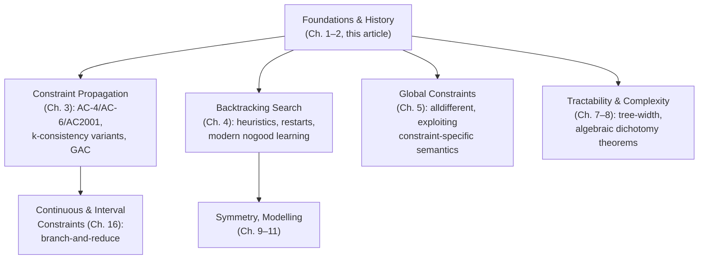

[[book-guidelines|↩ Back to guidelines]]

# Foundations and History of Constraint Satisfaction

## Why this framework exists at all

Take a problem that's really just "find values satisfying some conditions" — the 8-queens puzzle, scheduling factory jobs, choosing mutually-compatible bicycle parts. The naive approach is to enumerate every possible combination of values and test each one against every condition. This is always correct and almost always catastrophic: the number of combinations is the product of the domain sizes, and it explodes exponentially in the number of variables. If you've ever written a brute-force `for` loop nested nine variables deep and watched it not finish, you've personally rediscovered the problem constraint satisfaction exists to solve.

The insight that founds the whole field is that blind enumeration wastes almost all of its effort on **irrelevant repetition**. Suppose queens 1 and 2 attack each other. Once you know that, every one of the (astronomically many) placements of queens 3 through 8 is doomed too — but naive enumeration will dutifully try all of them anyway, varying only in parts of the assignment that were never the problem. Freuder and Mackworth, in Chapter 2, give this phenomenon its name: **thrashing** — "the repeated exploration of failing subtrees of the backtrack search tree that are essentially identical, differing only in assignments to variables irrelevant to the failure of the subtree" (§2.2.3). Constraint satisfaction, as a field, is the sixty-year project of *not thrashing*: finding ways to detect and eliminate doomed regions of the search space before — or instead of — visiting them combination by combination.

Two orthogonal answers emerged, and understanding that they're orthogonal (not competing) is the single most important idea in this chapter:

- **Inference** — use the constraints themselves to shrink the domains *before* you've committed to any particular assignment. If you can prove a value can never participate in any solution, delete it once, globally, rather than re-discovering its uselessness in every failing subtree that happens to touch it.
- **Search** — systematically explore the (now smaller) space, backtracking on failure, with enough bookkeeping to avoid re-deriving the same failure twice.

Every algorithm in the rest of the handbook is a refinement of one of these two moves, or a way of interleaving them.

## The formal object: what a CSP actually is

Before any algorithm, you need a representation precise enough to reason about. The book's definition (Ch. 2, §2.2.1) is:

A **Constraint Satisfaction Problem** is a triple $P = \langle X, D, C \rangle$ where:

- $X = \langle x_1, x_2, \dots, x_n \rangle$ is an $n$-tuple of **variables**,
- $D = \langle D_1, D_2, \dots, D_n \rangle$ is a corresponding tuple of **domains**, with $x_i \in D_i$,
- $C = \langle C_1, \dots, C_t \rangle$ is a tuple of **constraints**, where each $C_j = \langle R_{S_j}, S_j \rangle$ pairs a **scope** $S_j$ (a subset of variables) with a **relation** $R_{S_j}$ — a subset of the Cartesian product of the domains of the variables in $S_j$.

A **solution** is an $n$-tuple $A = \langle a_1, \dots, a_n \rangle$ with $a_i \in D_i$ such that every constraint's relation holds on $A$'s projection onto its scope. If no solution exists, $P$ is **unsatisfiable**.

Two structural facts fall out of this definition immediately and drive everything downstream:

1. **Binary vs. hypergraph structure.** If every scope has size $\le 2$, the CSP is literally a graph — variables as vertices, constraints as edges — and you can bring the entire toolbox of graph algorithms to bear (this is exactly what licenses tree-width-based tractability results later in the handbook). Once scopes can have arbitrary arity, you need a hypergraph instead, with one hyperedge per constraint. Nothing about the underlying theory *requires* binary constraints — the footnote in the text even shows domains are just unary constraints, $D_i \subseteq R_{\langle x_i\rangle}$, so you could dispense with $D$ as a separate component entirely — but binary CSPs are simpler to build intuition on and are where most algorithms are first presented.
2. **The search space is a relational join.** With finite domains, the full space of candidate assignments is $\Omega = \bowtie_i D_i$ — the join, in the relational-algebra sense, of all the domains. Solving is finding the tuples of $\Omega$ that also satisfy every $R_{S_j}$. This framing is what makes both inference and search *provably* sound: shrinking $D_i$ (inference) or restricting attention to a subtree (search) are both just operations on $\Omega$ that are guaranteed not to discard actual solutions, because they only ever remove tuples that some constraint has already ruled out.

**Rust grounding.** The triple $\langle X, D, C \rangle$ translates almost verbatim into a generic representation:

```rust
struct Csp<V, T> {
    // X: implicit as indices 0..n; D: one domain per variable
    domains: Vec<Vec<T>>,
    // C: each constraint knows its scope and can check a candidate tuple
    constraints: Vec<Constraint<V, T>>,
}

struct Constraint<V, T> {
    scope: Vec<usize>,           // S_j: indices into `domains`
    // R_{S_j} as a decision procedure rather than an enumerated relation —
    // essential once domains get large or infinite (reals, intervals, terms)
    check: Box<dyn Fn(&[T]) -> bool>,
    _phantom: std::marker::PhantomData<V>,
}
```

Notice the deliberate choice: `check` is a *predicate*, not an enumerated `HashSet` of allowed tuples. The book's definition treats $R_{S_j}$ as extensional (a literal subset of a Cartesian product), which is fine for finite, small domains — but the text is explicit that "even if the domains and the relations are intensionally represented, many of the techniques described in this chapter and elsewhere in the handbook still apply" (§2.2.1). This is the seam you'll actually build on: an `alldifferent` constraint over 50 variables has an enormous extensional relation but a one-line intensional check, and real solvers exploit exactly that gap — the text flags this too, noting that consistency algorithms "are specifications not implementations" and that real systems get their speed by "exploiting the semantics of a constraint such as the all different global constraint" rather than materializing $R_{S_j}$.

**What this looks like for your refinement-type CSP kernel:** this triple is the shape your invariant-search backend will actually take at runtime — $X$ are the symbolic/refinement variables introduced during elaboration, $D$ are their (possibly abstract, lattice-valued) domains, and $C$ are the verification-condition atoms extracted from Hoare-style contracts. The "intensional relation as predicate, not enumerated set" pattern above is not optional for you: linear and non-linear arithmetic constraints over `i64`/`f64` domains, or automaton-shaped constraints over abstract data structures, are never going to be represented extensionally.

## The two streams: why this chapter is framed as history, not just theory

Freuder and Mackworth's chapter is explicitly historical (1965–1985) and this framing is doing real work, not just scene-setting. They identify two initially-independent research communities converging on the same problem from opposite directions:

- The **language stream** asked "how do I *express* constraints in a program?" — starting from Sutherland's 1963 Sketchpad, through Elcock's Absys (1967), Sussman and Steele's CONSTRAINTS language, Borning's ThingLab (constraints embedded in Smalltalk), and culminating in Colmerauer's Prolog (1972) and, later in the handbook's own present, [[Constraint-Logic-Programming|constraint logic programming]] (CLP) systems like CHIP and CLP($\mathcal{X}$).
- The **algorithm stream** asked "how do I *solve* a stated set of constraints efficiently?" — growing out of machine vision (Waltz's line-labeling filtering algorithm, later renamed arc consistency), formalized by Montanari (path consistency, 1974) and Mackworth (general network-consistency framework, 1977), then generalized by Freuder to $k$-consistency (1978).

These streams solved genuinely different problems and only reintegrated in the 1990s, via the founding of the CP conference and the *Constraints* journal. The reason this matters beyond trivia: **it's the same split you'll face in your compiler project.** A refinement-type elaborator needs a *language* for stating constraints (the surface syntax of contracts, Hoare triples, dependent-subtyping obligations — your "language stream") that is completely separate from the *algorithm* that discharges them (the CSP/abstract-interpretation kernel — your "algorithm stream"). The handbook's history is a cautionary tale about letting those two concerns drift so far apart that reunifying them later takes decades; CLP is the concrete example of what a *principled* reunification looks like (constraints as first-class terms in a logic-programming substrate, with unification itself treated as one particular, very efficient, constraint solver — Prolog's own equality constraints over terms).

## Inference: consistency as an abstract-interpretation-shaped idea

This is the section of the chapter that should feel most immediately familiar from an abstract-interpretation angle, because it *is* the same idea, discovered independently and decades earlier.

**Node consistency** is the base case: node $i$ (variable $x_i$, domain $D_i$) is node consistent iff $D_i \subseteq R_i$ (the unary constraint on $x_i$). If not, tighten:
$$D_i' = D_i \cap R_i, \qquad D_i \leftarrow D_i'$$

**Arc consistency** does the same thing pairwise. Arc $\langle i,j\rangle$ is consistent iff every value in $D_i$ has *some* compatible partner in $D_j$ under $R_{ij}$:
$$D_i \subseteq \pi_i(R_{ij} \bowtie D_j)$$
and if not, you tighten by semijoin:
$$D_i' = D_i \cap \pi_i(R_{ij} \bowtie D_j)$$

Read that operation carefully: it is *literally* a narrowing step over the lattice of possible domains, ordered by set inclusion. $D_i' \subseteq D_i$ always; the operator is monotone; iterating it to a fixpoint is guaranteed to terminate (domains are finite and only shrink) and the fixpoint is unique and independent of iteration order — the chapter states this directly for the general case in §3.2 of the surrounding survey, and it's implicit here in the AC-1/AC-2/AC-3 progression. **This is a Galois-connection-shaped computation**: you have a concrete space (actual value combinations) and an abstract space (the per-variable domain sets), a concretization that's exact only when domains are "small enough," and a narrowing operator that's sound (never discards a real solution) but not always complete (a fixpoint with no empty domains does *not* imply a solution exists — the chapter is explicit about this: "consistency may be established with non-empty domains and relations even though there may be no global solution"). That gap between *soundness* (no false negatives) and *completeness* (no false positives) is exactly the gap your abstract-interpretation invariant generator will live inside, and arc consistency is the oldest, simplest instance of the pattern you'll be generalizing to richer abstract domains.

The propagation-order refinements matter for the same reason they'll matter in your solver:

- **AC-1** — brute force: recheck *every* arc after *any* domain shrinks, until nothing changes. Correct, wasteful.
- **AC-2 / Waltz** — only requeue arcs that could have been invalidated by the specific deletion that just happened (a dependency-tracking optimization).
- **AC-3 (Mackworth)** — a cleaner generalization of AC-2; still the most widely used baseline arc-consistency algorithm.
- **AC-4, AC-6, AC2001** (covered in the handbook's next chapter, foreshadowed here) push further toward optimal worst-case complexity by tracking *support* explicitly rather than recomputing it.

The pattern — full re-check, then dependency-directed re-check, then explicit support-tracking — is a pattern you will re-derive for your own domain/lattice propagator: naive whole-graph re-evaluation always works and is always too slow; the entire engineering history of constraint propagation is finding cheaper ways to know *which* propagators need to re-fire after a narrowing step, without missing any that do.

**Path consistency** (Montanari 1974) lifts the same idea one level: a length-2 path $\langle i, m, j \rangle$ is consistent iff every pair $\langle a,b\rangle$ allowed by $R_{ij}$ has some witness $c \in D_m$ making both $R_{im}$ and $R_{mj}$ hold:
$$R_{ij} \subseteq \pi_{ij}(R_{im} \bowtie D_m \bowtie R_{mj})$$
Represented as Boolean bit-matrices, this composition is literally Boolean matrix multiplication — a nice concrete fact if you ever want to vectorize a propagator. Montanari further showed that once *all* length-2 paths are consistent, *every* path of any length is automatically consistent too — so path consistency needs to check only $O(n^2)$ local triples, not an unbounded family of longer paths, to get a global guarantee.

**$k$-consistency** (Freuder, 1978) is the general pattern both of the above are instances of: given consistent values for any $k-1$ variables, some value exists for a $k$-th that keeps all $k$ consistent. $2$-consistency $\equiv$ arc consistency; $3$-consistency $\equiv$ path consistency. Freuder's further generalization to $(i,j)$-consistency (1985) — "given values for any $i$ variables, values exist for any other $j$" — is worth flagging explicitly for your project: the $(1,j)$ special case is what the field now calls **singleton consistency**, the idea of tentatively fixing *one* variable to a single value and checking that the resulting subproblem is still consistent. This is the same move as counterexample-guided abstraction refinement (CEGAR) — pick a concrete witness, check it against a cheaper abstraction, refine on failure — appearing here fifteen years before SAT/SMT solving made it a household technique.

A minimal Rust sketch of AC-3, to make the fixpoint-iteration structure concrete:

```rust
fn ac3(csp: &mut Csp<usize, i64>) -> bool {
    let mut queue: VecDeque<(usize, usize)> = all_arcs(csp);
    while let Some((i, j)) = queue.pop_front() {
        if revise(csp, i, j) {
            if csp.domains[i].is_empty() {
                return false; // node i wiped out — provably no solution
            }
            // any arc <k, i> for k != j might now be violated by the shrink —
            // this is exactly the dependency tracking AC-2/AC-3 introduced
            for k in neighbors(csp, i) {
                if k != j { queue.push_back((k, i)); }
            }
        }
    }
    true // fixpoint reached; does NOT imply a solution exists
}

// D_i' = D_i ∩ π_i(R_ij ⋈ D_j) — the semijoin from the text, made concrete
fn revise(csp: &mut Csp<usize, i64>, i: usize, j: usize) -> bool {
    let mut changed = false;
    csp.domains[i].retain(|&a| {
        let supported = csp.domains[j].iter().any(|&b| satisfies(csp, i, j, a, b));
        changed |= !supported;
        supported
    });
    changed
}
```

## Search: backtracking, and why "undo the last choice" isn't enough

Constraint propagation alone rarely finishes the job (per above, empty-free domains don't guarantee a solution), so it's paired with **[[Backtracking-Search|backtracking search]]**: build a partial assignment incrementally, and on hitting a dead end, undo the most recent choice and try an alternative. Golomb and Baumert's 1965 paper is credited as the first general formalization, though the chapter is careful to note the *technique* long predates the paper — recreational mathematics used it in the 19th century, and Lehmer is credited with the term "backtrack" itself in the 1950s.

What's genuinely striking, reading the chapter closely, is how much of *modern* backtracking search is already legible in that 1965 paper, just not yet given the names we use today:

- **Fail-first principle** — "it is more efficient to make the next choice from the set [domain] with fewest elements" (Golomb & Baumert, 1965) — i.e., branch on the most-constrained variable first, so failures surface early instead of late.
- **Preclusion** — a choice for one variable ruling out inconsistent choices for others — what Haralick and Elliott (1980) would later formalize and name "forward checking."

The chapter organizes the subsequent improvements along two axes, both aimed at reducing the same thrashing pathology from the opening motivation:

**Going forward** (choosing better): variable-ordering and value-ordering heuristics (fail-first being the canonical example), and interleaving propagation *during* search rather than only as preprocessing — Gaschnig (1974) proposed restoring full arc consistency after every value choice; Mackworth generalized this to alternating "constraint manipulation and case analysis," i.e., domain-splitting interleaved with re-propagation, which is precisely the branch-and-reduce structure this same handbook uses for continuous/interval constraints later on.

**Going backward** (undoing smarter): plain chronological backtracking undoes only the *most recent* choice, even when that choice had nothing to do with the actual failure — itself a source of thrashing. The fixes:

- **Dependency-directed backtracking** (Stallman & Sussman, in circuit-analysis work) and **backjumping** (Gaschnig) — jump directly back to a variable that's actually implicated in the failure, skipping over irrelevant more-recent choices.
- **Nogood recording** (Stallman & Sussman) — remember *why* a partial assignment failed as an explicit constraint ("nogood"), so the same dead end is never rediscovered from scratch. This is the direct conceptual ancestor of clause learning in modern CDCL SAT solvers, and it's worth naming explicitly for your project: a "nogood" is a *learned constraint*, and learned constraints are exactly what your CSP kernel should be emitting as certificates when it finds a counterexample to a proposed invariant — the artifact that makes a counterexample search *proof-producing* rather than just a yes/no oracle.
- **Backmarking** (Gaschnig) — a cheaper form of memory: remember consistency-check *results*, not full explanations, to avoid redundant rechecking.

## Complexity: why any of this is hard in the first place

CSPs are NP-hard in general — that's the whole reason the field exists rather than "just enumerate." The chapter surveys the early analytical responses to this fact, and two threads are worth carrying forward specifically:

1. **Algorithmic complexity of the propagators themselves.** Mackworth and Freuder (1985) proved arc consistency runs in time *linear* in the number of constraints — settling what had been an open question, and a result the chapter notes was practically important because several constraint languages had already started using arc consistency as a primitive language operation, i.e., people were relying on it being cheap before anyone had proven it.
2. **Structural tractability.** Freuder (1982) proved that CSPs whose constraint graph is *tree-structured* admit backtrack-free search after arc-consistency preprocessing, via the graph parameter he called **width**. This is the direct ancestor of tree-width-based tractability results (covered later in the handbook, Chapter 7) and, more broadly, of the entire research program of finding structural restrictions on a constraint graph or hypergraph under which an NP-hard problem in general becomes polynomial. This is the load-bearing idea for anything your compiler project does with **structural tractability** or **monadic second-order logic**–style decidability results over program-derived graphs (e.g. treating a program's dependency structure or heap shape as a graph with bounded tree-width to get a tractable verification fragment).

## Where this leads



Within the handbook, everything downstream is a refinement of the two moves introduced here: Chapter 3 goes deep on stronger and cheaper consistency notions than plain arc consistency; Chapter 4 formalizes the backtracking improvements only sketched historically here; Chapters 7–8 turn Freuder's tree-width intuition into a full tractability theory.

For your standing project, this chapter is the historical justification, not just background, for treating your CSP kernel and your abstract-interpretation engine as *one mechanism viewed two ways* rather than two separate subsystems bolted together: constraint propagation's domain-narrowing-to-fixpoint *is* abstract interpretation's Galois-connection narrowing, arc consistency's soundness-without-completeness gap *is* the gap between "no bug found" and "proven safe," and nogood recording's learned-constraint-from-failure *is* the shape of a proof certificate your CEGAR loop should be producing every time it refutes a candidate invariant. When you get to Chapter 3's stronger consistencies (singleton arc consistency in particular) and Chapter 7's algebraic tractability theory, you'll be building directly on the vocabulary — width, $k$-consistency, backtrack-free search, nogoods — established here.
