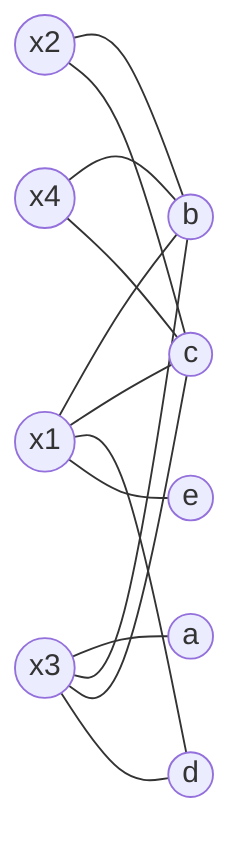
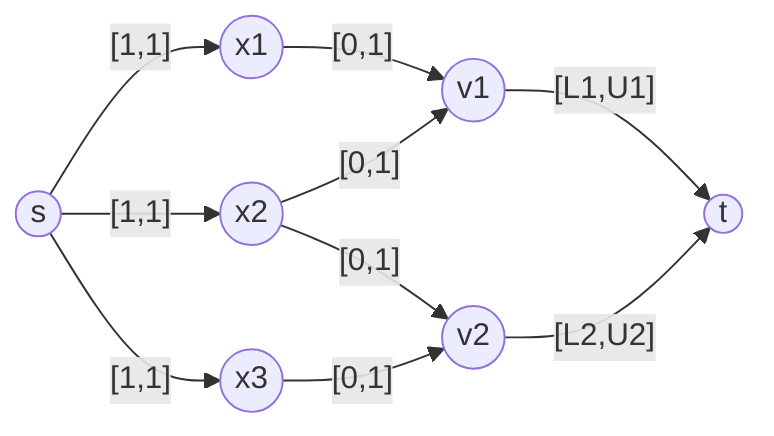
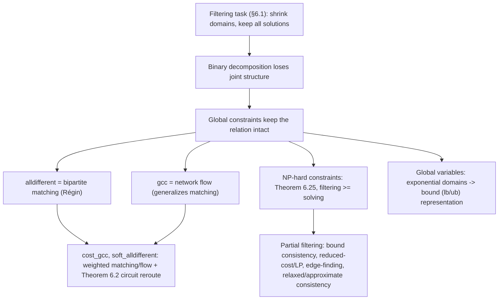

# Global Constraints

[[book-guidelines|↩ Back to guidelines]]

## Why bother with a constraint that isn't binary?

A constraint solver's whole job is to shrink search before it has to guess. Two mechanisms do this: *search* (try a value, backtrack on failure) and *inference* — usually called **filtering** — which removes values from variable domains that provably cannot appear in any solution, without ever trying them. Filtering is what keeps a CSP solver from degenerating into brute-force enumeration.

The classical unit of filtering is a *binary* constraint: a relation between two variables, propagated by an *arc consistency* algorithm (see Chapter 3). But plenty of real relations aren't binary in spirit even if you can decompose them into binary pieces. "These $n$ variables must all take different values" is one relation on $n$ variables, and if you decompose it into $\binom{n}{2}$ pairwise `!=` constraints, you *lose information*: each binary constraint only sees two variables at a time, so the decomposition can miss prunings that are only visible when you look at all $n$ variables together.

Concretely: suppose $x_1, x_2 \in \{a,b\}$ and $x_3 \in \{a,b,c\}$, under `alldifferent`. Any pairwise `!=` constraint is locally happy — $x_1 \ne x_2$ can still hold, $x_1 \ne x_3$ can still hold. But globally, $x_1$ and $x_2$ between them exhaust $\{a,b\}$, so $x_3$ *cannot* be $a$ or $b$ — value $c$ is the only option, and no binary decomposition can see that without a third value being involved in the *same* propagation step. This is the whole motivation for **global constraints**: constraints over a non-fixed number of variables, kept intact rather than decomposed, so the solver's filtering routine gets to reason about the joint structure directly.

Chapter 6 (van Hoeve & Katriel) is organized around one central discovery: many of the useful global constraints, especially `alldifferent`, turn out to be disguised graph problems. Once you see the graph, decades of matching and flow theory become your filtering algorithm for free.

## Setting up the vocabulary: filtering, completeness, and the CSP itself

The book's formal setup (§6.1.1), stripped to essentials: a **domain** $D(x)$ is the finite set of values a variable $x$ may take. A **constraint** $C$ on variables $x_1,\dots,x_k$ is literally a subset of the Cartesian product of their domains, $C \subseteq D(x_1)\times\cdots\times D(x_k)$ — a set of allowed tuples. The **filtering task** for $C$ is:

$$
D(x_j) \leftarrow D(x_j) \cap \{v_i \mid D(x_1)\times\cdots\times \{v_i\} \times \cdots \times D(x_k) \cap C \ne \emptyset\}
$$

for every $j$ — i.e., keep only values that participate in *some* tuple of $C$ consistent with the other domains. A value is *useless* if it cannot occur in any solution; filtering never removes a useful value (no false negatives) but may keep some useless ones (false positives, when filtering is only partial). If filtering removes *every* useless value, it's **complete**; the formal name for this property is **generalized arc consistency (GAC)**:

> **Definition 6.9.** $C$ is arc consistent if for every variable $x_i$ and every $v \in D(x_i)$, there is a tuple $(d_1,\dots,d_k)\in C$ with $d_i = v$ — every remaining value has a *support*, a full witness tuple.

This is the constraint-programming analogue of a *satisfiability witness per value*, not per whole assignment. It's also a strictly local guarantee: a CSP where every constraint is individually GAC need not have any global solution at all — GAC only rules out values, never confirms consistency across constraints.

**What breaks without global constraints**, concretely: establishing GAC for an arbitrary non-binary relation is NP-hard in general (Chapter 3). If `alldifferent` were left to a generic non-binary GAC procedure, filtering itself would become as hard as the search you were trying to avoid. The entire value of a global constraint is that its *specific structure* admits a filtering algorithm dramatically faster than the generic NP-hard case — this chapter is the catalogue of which structures buy you that speedup, and how.

## The alldifferent constraint as a matching problem

### The value graph

$$
\texttt{alldifferent}(x_1,\dots,x_n) = \{(d_1,\dots,d_n) \mid \forall i.\ d_i \in D(x_i),\ \forall i\ne j.\ d_i \ne d_j\}
$$

Régin's insight (1994) is to build the **value graph**: a bipartite graph $G = (X, D(X), E)$ with an edge $\{x,d\}$ whenever $d \in D(x)$. Variables on one side, domain values on the other.



**Theorem 6.11.** $(d_1,\dots,d_n)$ satisfies `alldifferent` iff $\{\{x_1,d_1\},\dots,\{x_n,d_n\}\}$ is a **matching** in $G$ — a set of edges no two of which share a vertex. This is almost definitional: "all different" and "no value reused" is exactly "no two edges land on the same value vertex," and matching is the graph-theoretic name for exactly that.

A solution corresponds to a matching that *covers* $X$ (every variable gets an edge), which — since $|X|$ edges is the most you could possibly have without collision — is a **maximum-cardinality matching**. So: `alldifferent` is satisfiable iff the value graph has a matching of size $n$.

### From "has a solution" to "which values survive filtering"

Having a solution isn't the filtering task — you need to know, for *every* edge $\{x,d\}$, whether it belongs to *some* maximum matching (equivalently, some solution). Edges that belong to no maximum matching correspond to useless values and get pruned.

This is where a classical matching-theory result earns its keep:

> **Theorem 6.13.** Given a maximum matching $M$, an edge $e$ belongs to *some* maximum matching iff (a) $e \in M$, or (b) $e$ lies on an even-length $M$-alternating path starting from an $M$-free (unmatched) vertex, or (c) $e$ lies on an even-length $M$-alternating circuit.

The algorithm this yields:

1. Compute one maximum matching $M$ in $G$ — Hopcroft–Karp does this in $O(m\sqrt n)$ where $m = \sum_i |D(x_i)|$.
2. Orient $G$ into a digraph $G_M$: matched edges point value→variable, unmatched edges point variable→value.
3. Find strongly connected components of $G_M$ in $O(n+m)$ — arcs *within* an SCC lie on an alternating circuit (case c).
4. BFS from every $M$-free vertex to find arcs on alternating paths (case b) — $O(m)$.
5. Any edge not marked "used" by (a)/(b)/(c) is pruned.

Total: $O(m\sqrt n)$ to *check* consistency, $O(m)$ *more* to fully filter. And crucially — this is the detail that makes it practical inside a search loop rather than a one-shot check — the matching is **incremental**: after $k$ variable domains change, you don't recompute from scratch, you repair the existing matching and SCC structure in $O(\min(km, m\sqrt n))$.

**What this buys you concretely** — back to the $x_1,x_2\in\{a,b\}$, $x_3\in\{a,b,c\}$ example: the maximum matching saturates $\{a,b\}$ via $x_1,x_2$; the edges $\{x_3,a\}$ and $\{x_3,b\}$ are neither in $M$ nor on any alternating path/circuit from a free vertex (there are none — every variable is covered), so they're pruned, leaving $D(x_3)=\{c\}$ exactly as intuition demanded. The graph machinery *derives* the inference that hand-decomposed binary constraints structurally cannot see.

### Rust: the shape of Régin's algorithm

This is exactly the kind of graph-and-search kernel that belongs in a CSP engine's propagator layer. A minimal skeleton (domain values assumed pre-indexed to small integers):

```rust
struct ValueGraph {
    n_vars: usize,
    n_vals: usize,
    // adjacency: for each variable, the value indices in its current domain
    domain: Vec<Vec<usize>>,
}

struct Matching {
    // match_of_var[i] = Some(value index) if x_i is matched
    match_of_var: Vec<Option<usize>>,
    // match_of_val[v] = Some(variable index) if value v is matched
    match_of_val: Vec<Option<usize>>,
}

impl ValueGraph {
    /// Hopcroft-Karp style augmenting-path search from every free variable.
    fn maximum_matching(&self) -> Matching {
        let mut m = Matching {
            match_of_var: vec![None; self.n_vars],
            match_of_val: vec![None; self.n_vals],
        };
        for x in 0..self.n_vars {
            if m.match_of_var[x].is_none() {
                let mut visited = vec![false; self.n_vals];
                self.try_augment(x, &mut visited, &mut m);
            }
        }
        m
    }

    fn try_augment(&self, x: usize, visited: &mut [bool], m: &mut Matching) -> bool {
        for &v in &self.domain[x] {
            if visited[v] {
                continue;
            }
            visited[v] = true;
            // v is free, or the variable currently on v can be re-routed
            let reroutable = match m.match_of_val[v] {
                None => true,
                Some(x2) => self.try_augment(x2, visited, m),
            };
            if reroutable {
                m.match_of_var[x] = Some(v);
                m.match_of_val[v] = Some(x);
                return true;
            }
        }
        false
    }

    /// Prunes the domain to GAC: keeps only edges in M, on an alternating
    /// path from a free vertex, or on an alternating circuit (Régin/Petersen).
    fn filter_to_arc_consistency(&mut self, m: &Matching) {
        // 1. Orient: matched var->val edges as val->var, unmatched as var->val.
        // 2. Tarjan SCC on the oriented graph -> mark intra-SCC arcs "used".
        // 3. BFS from every M-free vertex -> mark reachable arcs "used".
        // 4. Any (x, v) edge in `domain` that is not "used" and not in M: drop v.
        //    (Full SCC/BFS bookkeeping omitted — this is the shape, not the
        //    complete implementation.)
    }
}
```

The recursive `try_augment` *is* the "does an $M$-augmenting path exist" search from Petersen's theorem (Theorem 6.1: $M$ is maximum iff no augmenting path exists) — every bipartite-matching-based propagator you'll ever write has this shape at its core.

### Python: seeing the graph, quickly

For a first illustrative sketch where the recursive structure is easier to see than to optimize:

```python
def bipartite_matching(domains):
    # domains: dict var -> set of candidate values
    match_val = {}          # value -> variable
    def try_augment(x, visited):
        for v in domains[x]:
            if v in visited:
                continue
            visited.add(v)
            if v not in match_val or try_augment(match_val[v], visited):
                match_val[v] = x
                return True
        return False

    match_var = {}
    for x in domains:
        if try_augment(x, set()):
            pass
    for v, x in match_val.items():
        match_var[x] = v
    return match_var  # a solution to alldifferent, if one exists
```

## Generalizing: the global cardinality constraint and flow theory

`alldifferent` says "each value used at most once." The **global cardinality constraint** (`gcc`) generalizes this to "value $v_i$ used exactly $o_i$ times," where $o_i$ is itself a variable with its own domain (Definition 6.5). `alldifferent` is the special case where every count variable's domain is $\{0,1\}$.

Matching only expresses "used 0 or 1 times." To express "used exactly (or between) $L_i$ and $U_i$ times," you need **flow**, not matching — flow is the generalization of matching that lets edges carry more than one unit, subject to demand/capacity bounds on each arc (§6.1.2). Concretely:

- Add a source $s$ with an arc of requirement $[1,1]$ to every variable vertex (each variable is used exactly once).
- Keep variable→value arcs with requirement $[0,1]$ (as in the value graph).
- Add an arc from each value $v_i$ to a sink $t$ with requirement $[L_i,U_i]$ — the count bound *becomes* a flow-conservation constraint on that arc.



**Theorem 6.14** (Régin): solutions to `gcc` correspond one-to-one to integral feasible $s$-$t$ flows in this network. And exactly as with matching, an arc belongs to *some* feasible flow iff it carries flow in the current one, or its endpoints lie in the same strongly-connected component of the **residual graph** — the flow-theoretic analogue of Theorem 6.13, using the same SCC machinery. Filtering `gcc` to GAC, when the count variables have fixed-interval bounds, is a direct lift of the `alldifferent` algorithm with matching swapped for flow, and (Quimper et al.) achievable in the same $O(m\sqrt n)$ time by exploiting the bipartite structure of the network.

Note the caveat buried in §6.3.2: filtering `gcc` to full GAC is **NP-hard** if you allow the count variables to have *arbitrary* domains rather than fixed intervals — the polynomial algorithm only exists because the constraint was *reformulated* to intervals first. This is a recurring theme in the chapter: complete filtering isn't free, it's earned by choosing a tractable special case, and you have to know which knob (interval vs. arbitrary domain) you're allowed to turn.

## Optimization constraints: filtering with a cost attached

A **constraint optimization problem (COP)** adds an objective — a cost variable $z$ to minimize or maximize — on top of a CSP. The naive way to use constraints for optimization is: find a solution, record its cost `opt`, add `z < opt`, resolve. This *only* prunes $z$'s own domain; it does nothing for the domains of the variables that determine $z$.

**Optimization constraints** close that gap by baking the cost bound directly into the filtering. The chapter's flagship example is `cost_gcc`: take the flow network for `gcc`, assign weight $w(x_i,d)$ to each variable→value arc (cost of assigning $d$ to $x_i$), and filter using:

> **Theorem 6.19.** `cost_gcc` is arc consistent iff (i) every candidate assignment $(x,d)$ extends to *some* feasible flow of weight $\le \max D(z)$, and (ii) $\min D(z) \ge$ the weight of a minimum-weight feasible flow.

The efficient version of this doesn't recompute a whole new min-cost flow for every candidate $(x_i,d)$ — that would be $O(n^2 d(m+n\log n))$. Instead it uses **Theorem 6.2**: given one minimum-weight flow $f$, the cost of forcing an unused arc $a$ into the solution equals `weight(f) + weight(shortest circuit through a in the residual graph)`. So one initial min-cost flow computation, plus one shortest-path computation per candidate arc in the residual graph, tells you the exact cost of every possible assignment without ever building a second flow from scratch — an elegant reuse of the residual-graph structure that already existed for the SCC-based feasibility check.

The same recipe (build a weighted flow/matching network, filter via Theorem 6.2's circuit-rerouting trick) reappears for the `soft_alldifferent` constraint (§6.4.2), where instead of a hard cost the "weight" encodes a **violation measure** — either $\mu_{var}$ (how many variables must change value) or $\mu_{dec}$ (how many pairwise `!=` constraints in the naive decomposition end up violated). Soft constraints matter for over-constrained problems where no solution satisfies everything and you want the least-bad one — see Chapter 9, but the filtering machinery is the same graph toolkit, just with a violation count standing in for a dollar cost.

## When complete filtering is out of reach: partial filtering

Not every useful global constraint has a polynomial GAC algorithm. The chapter proves this isn't an accident to be engineered around, but a **theorem**:

> **Theorem 6.25.** If arc consistency for $C$ is computable in polynomial time, then a single solution to $C$ is findable in polynomial time.

*Proof sketch* (worth internalizing, it's the same trick that appears throughout constraint solving and in SAT/SMT decision procedures): run the poly-time GAC algorithm; if any domain empties, no solution exists. Otherwise repeatedly pick a variable with $|D(x)|>1$, fix it to one candidate value, and re-run GAC. Each iteration determines one variable, so after at most $n$ rounds you have a witness. **Filtering is at least as hard as solving.**

Consequence: any global constraint whose satisfiability check is NP-hard (`cumulative` scheduling, `circuit`/TSP-shaped constraints with an objective, shortest-path-under-a-bound constraints) **cannot** have a polynomial complete filtering algorithm, full stop, unless P = NP. So the chapter's second half is a survey of principled *compromises*:

- **Bound consistency** (Def. 6.22): when domains are intervals of a total order, only require that the *bounds* (not every interior value) have supports. Exploits that the value graph becomes **convex** (Def. 6.23: each variable's neighbourhood is a contiguous interval of values) — and convex bipartite matching is solvable by a simple greedy priority-queue sweep (Glover's algorithm) in $O(n+n'\log n')$, dramatically faster than the general $O(m\sqrt n)$ matching bound. `alldifferent` and `gcc` both admit bound-consistency algorithms this way (Table 6.1 — Puget/López-Ortiz via Hall's Marriage Theorem, Mehlhorn–Thiel/Katriel–Thiel via matching/flow on convex graphs).

- **Reduced-cost based filtering** (§6.5.2): for optimization constraints with no clean flow correspondence, relax to a **linear program**. Introduce 0/1 indicator variables $y_{ij}$ (is $x_i=j$?), state the constraint's structure as linear inequalities over the $y_{ij}$'s, drop integrality, solve the LP relaxation. The LP hands you, for free, a **reduced-cost vector** $\bar c$ (Theorem 6.3's machinery from §6.1.3) that lower-bounds how much the objective *must* increase if you force $x_i \leftarrow j$. Filtering rule: `if z* + c̄_{ij} > max D(z): remove j from D(x_i)`. This is not complete GAC — it inherits whatever gap the LP relaxation has from the true integer program — but it's essentially free (the reduced costs fall out of the simplex solve you were doing anyway) and applies to constraints with no known combinatorial filtering algorithm at all.

- **Relaxation to a tractable superset**: transform an NP-hard constraint $C$ into $C' \supseteq C$ that *is* efficiently filterable, and filter $C'$ instead — you lose completeness but stay sound (never over-prune). The chapter's worked example is **edge-finding** for `cumulative` scheduling: for a task $t_i$ and a set of other tasks $\Omega$, if $\Omega \cup \{t_i\}$ needs more resource-energy than fits between the earliest release and latest deadline unless $t_i$ finishes last, you can derive a tightened lower bound on $t_i$'s start time — a genuinely bound-consistency-flavored inference, but only for the fixed-processing-time relaxation of the true (NP-hard) cumulative constraint.

- **Relaxed and approximated consistency** (Sellmann): for constraints like "shortest path through a specific arc under budget $W$" (NP-hard to check exactly), substitute an *almost-path* relaxation (concatenate two shortest paths through the arc, allowing a vertex to repeat) that's efficiently checkable, or use an $\alpha$-approximation algorithm and accept a **one-sided error band** — keep a value in the domain whenever the approximate reasoning is inconclusive, since keeping too much is safe (soundness), pruning too much is not.

This whole progression — exact filtering where structure allows it, provably-necessary compromise where NP-hardness bites, LP relaxation as the generic fallback, approximation with one-sided error as the last resort — is a template that recurs verbatim in SAT/SMT-based verification: complete decision procedures where the theory fragment is tractable (e.g. linear arithmetic), sound-but-incomplete abstractions (widening in abstract interpretation) where it isn't, and the constant discipline of *never removing a value/state you can't prove unreachable*.

## Global variables: when the value graph itself would be exponential

Everything above assumed a variable's domain is an explicit, enumerable set of scalar values. **Global variables** (§6.6) — set variables, graph variables — break that assumption: a set variable's domain is *all subsets* of some ground set, which is exponential to enumerate. You cannot build a value graph with one vertex per candidate value.

The fix is to represent the domain by its **bounds** instead of its elements: $D(x) = [lb(x), ub(x)]$, where $lb(x)$ is the set of *mandatory* elements (in every possible value) and $ub(x)$ the set of *possible* elements (in at least one). "Arc consistency" stops being meaningful (there's no per-value support to check against an exponential domain), so the filtering target becomes **bound consistency**: shrink $ub$ by removing elements that appear in no solution, and grow $lb$ by adding elements that appear in every solution.

The `symcc` example reuses the `gcc` flow network almost verbatim — the arc from $s$ to a variable now carries capacity equal to that variable's cardinality bound rather than a fixed $[1,1]$, and the same SCC-of-the-residual-graph argument identifies which set-elements are forced (arcs whose endpoints land in *different* SCCs, forced into $lb$) versus merely possible (arcs whose endpoints share an SCC, kept in $ub$). Note the asymmetry compared to `gcc`: with scalar variables you only ever *remove* values; with set variables you also *add* elements to a lower bound, because "possible" and "mandatory" are genuinely different states that a plain domain can't represent.

Graph variables generalize this one level further — a pair of set variables $(V,E)$ with $E \subseteq V\times V$ — and support constraints like `Subgraph` and spanning-tree (`ST`) with linear-time bound-consistency filtering derived from purely graph-theoretic conditions (no circuits in the lower-bound graph, connectivity of the upper-bound graph, bridges forced into the lower bound). The chapter's closing remark is worth keeping: filtering algorithms for global variables routinely reason correctly about spaces of solutions that are *exponentially larger* than the algorithm's own running time — the bound representation is what makes that possible.

## Where this leads



- Within the book, this chapter sits between Chapter 3's general theory of constraint propagation (which proves non-binary GAC is NP-hard *in general*, motivating why special-purpose algorithms matter) and Chapter 4's [[Backtracking-Search|backtracking search]] (which is what all this filtering exists to prune). Chapter 22 ("Planning and Scheduling") returns to `cumulative` and edge-finding in depth; Chapter 17 ("Beyond Finite Domains") is the fuller treatment of set/graph variables only sketched here.

- For a CSP kernel meant to search for concrete counterexamples that break a program's type or refinement invariants (the standing project this vault is built around): this chapter *is* the propagator layer of that kernel. `alldifferent`-over-matching is the natural filtering primitive for anything shaped like "these symbolic locations/slots must resolve to distinct concrete values" (e.g. disjointness obligations, injective array-index assumptions); `gcc`-over-flow generalizes it to counting/multiplicity obligations (e.g. "at most $k$ of these $n$ branch conditions can be true," a direct encoding of certain refinement-type cardinality constraints); the `regular`/DFA-membership constraint (§6.2.7, walked via the layered-digraph GAC algorithm) is exactly the propagator shape you'd want if abstract data structures are represented as automata/grammars over symbolic operations, per this project's stated interest in DFA-shaped complex domains. And Theorem 6.25 is a fact worth carrying into that design directly: **any propagator for an NP-hard-to-solve fragment of your constraint language cannot be made complete without secretly solving that fragment** — so the honest options for such fragments are exactly this chapter's menu (fixed-interval reformulation, LP relaxation with reduced-cost pruning, or a sound relaxation with one-sided error), not a hoped-for exact algorithm that hasn't been found yet.

- The soundness discipline threaded through every algorithm here — filtering may drop useless values but must *never* drop a value that participates in some solution — is the same invariant a trusted kernel needs from *any* over-approximating analysis: abstract interpretation's soundness requirement (never claim "unreachable" for a reachable state) and this chapter's "no false negatives" are the identical property, stated in two different vocabularies.
