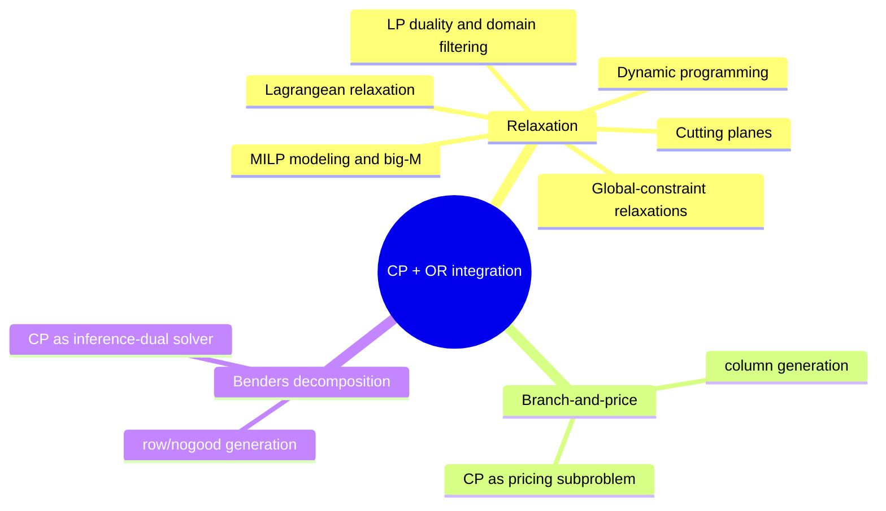

# Integration of Constraint Programming and Operations Research

[[book-guidelines|↩ Back to guidelines]]

## Why bring OR into CP at all

CP and OR are, at bottom, solving the same kind of problem — find (or optimize over) an assignment satisfying a set of constraints — but they attack it from opposite ends. A CP solver treats each constraint as a small local procedure: an `all-different` constraint is a *propagator*, a piece of code that watches its variables' domains and prunes values it can prove are dead. Nothing in the solver ever looks at the constraint set "as a whole" — global structure only emerges indirectly, from many local propagators talking to each other through shared variables. This is exactly the same shape of problem you'll face building a constraint-kernel for refinement-type checking: your propagators for domain/lattice constraints on integers, and later for automaton-shaped abstract domains, are individually cheap and individually blind to the big picture.

OR (specifically here: linear and integer programming) does the opposite. It sees the constraint set as one global system — a matrix $Ax \ge b$ — and runs an algorithm (the simplex method, branch-and-bound) that reasons about the *whole* polyhedron at once. This lets it exploit global properties — convexity, duality, network structure — that no amount of local domain-pruning will ever see, at the cost of losing the constraint-by-constraint modularity that makes CP so good at expressing weird problem-specific structure (routing, scheduling, "if this disjunct then that disjunct").

**What breaks without this hybridization:** a pure-CP solver on a problem with a strong linear-algebraic substructure (e.g., an assignment or transportation-flow constraint hiding inside a bigger scheduling problem) will backtrack over exponentially many partial assignments that a single LP solve would have ruled out in milliseconds. Conversely, a pure-MILP solver chokes on the kind of highly disjunctive, "if-then-else"-heavy combinatorial structure (cumulative resource scheduling, routing with time windows) that CP's [[Global-Constraints|global constraints]] were built to express directly. Neither camp's toolbox dominates; the chapter's whole thesis is that borrowing OR's global algorithms *as extra propagators, extra bounds, or extra decomposition structure* inside a CP-shaped search gets you speedups that are often not incremental — the empirical table the chapter opens with (Table 15.1) reports factors from "2×" up through "600× faster than MILP alone," and multiple instances neither solver could touch alone.

Three integration schemes recur throughout the chapter, and the rest of this article is organized around them:

1. **Relaxation** — solve an OR-style relaxation of some or all constraints to tighten domains, bound the objective, or guide search (Sections 15.3–15.9 in the source).
2. **Branch-and-price** — CP handles "column generation": finding new decision variables to add to a huge implicit MILP.
3. **Benders decomposition** — CP handles "row generation": finding new constraints (nogoods) to add to a master problem.

## Linear programming: the workhorse relaxation

### Basic feasible solutions and the simplex method

An LP in the book's standard form is
$$
\min cx,\quad Ax \ge b,\ x \ge 0,\ x\in\mathbb{R}^n.
$$
The feasible region is a polyhedron; since the objective is linear, an optimum (if one exists) sits at a vertex. Algebraically, rewriting in equality form $Ax=b$ and partitioning the columns of $A$ into a basis $B$ (an invertible $m\times m$ submatrix) and the rest $N$ gives
$$
x_B = B^{-1}b - B^{-1}Nx_N,
$$
so setting the *nonbasic* variables $x_N=0$ yields a **basic solution** $(B^{-1}b, 0)$ — a vertex, provided $B^{-1}b\ge 0$. Substituting back, the cost becomes $c_B B^{-1}b + rx_N$ where $r = c_N - c_B B^{-1}N$ is the vector of **reduced costs**. A basic solution is optimal exactly when $r\ge 0$: every nonbasic variable would only make things worse if increased from zero. The **simplex method** is just: while some $r_j<0$, bring $x_j$ into the basis (increase it until some basic variable hits zero), swap columns, repeat. This is over 70 years old (Dantzig) and is still what state-of-the-art solvers run.

**Rust grounding — this is not "just" plumbing.** If you're going to implement domain propagation, a simplex tableau is exactly the kind of thing you'd represent as a matrix with an index set of basic columns — think `struct Tableau { a: Matrix, basis: Vec<usize>, b: Vec<f64> }` with a `pivot(entering, leaving)` method that does the Gauss-Jordan elimination step. The reduced-cost vector `r` is recomputed incrementally after each pivot rather than from scratch — the same incrementality discipline you'll want for propagators that get re-invoked every time a bound moves. If you ever wire a real LP solver into your CSP kernel (as this chapter suggests you should for anything linear-arithmetic-heavy), this is the object shape you'd be calling into.

### Duality and complementary slackness

The dual of (15.1) is
$$
\max \lambda b,\quad \lambda A \le c,\ \lambda \ge 0,\ \lambda\in\mathbb{R}^m.
$$
This is not decoration — it is literally "the tightest lower bound $v$ on $cx$ that can be logically inferred from $Ax\ge b,\, x\ge 0$." The **Farkas Lemma** says $cx\ge v$ follows from the primal constraints exactly when some nonnegative combination $\lambda A x \ge \lambda b$ of the primal rows dominates $cx\ge v$; the dual is the search for the tightest such $\lambda$. Weak duality ($\lambda b \le cx$ for any primal/dual-feasible pair) and strong duality (equality at the joint optimum) follow. **Complementary slackness** — $\lambda_i^*>0$ implies constraint $i$ is tight at the optimum — is the hinge fact the whole filtering machinery below turns on.

If you've been thinking about proof certificates and trusted kernels: **this is a proof system.** A dual-feasible $\lambda$ *is* a certificate that $cx\ge \lambda b$ — a machine-checkable witness with a one-line verification (just check $\lambda A\le c$, $\lambda \ge 0$, and multiply). The Benders section later in this chapter names this explicitly as an "inference dual," and generalizes exactly this idea — a solved subproblem hands back not just an answer but a *proof of a bound* that can be replayed against other inputs. That's the same shape as a proof-producing decision procedure feeding a trusted kernel: solve once, extract a small certificate, reuse or check the certificate cheaply elsewhere.

### Domain filtering from the dual

This is the chapter's central mechanical trick and it recurs (in generalized form) three more times in this article, so it's worth deriving carefully once. Suppose the LP (15.1) is a relaxation embedded inside a CP search, with optimal value $v^*$ and dual optimum $\lambda^*$. Suppose there is an upper bound $U$ on cost (e.g., the best feasible solution found so far). If constraint $i$ has $\lambda_i^* > 0$ (so it's tight, by complementary slackness), then perturbing the right-hand side of constraint $i$ by $\Delta b_i$ changes the optimal value by at least $\lambda_i^* \Delta b_i$ — and since the new optimum still can't exceed $U$,
$$
\lambda_i^* \Delta b_i \le U - v^* \quad\Longrightarrow\quad A_i x \le b_i + \frac{U - v^*}{\lambda_i^*}.
\tag{15.6}
$$
This is a **new, valid, and possibly tighter** linear inequality that can be propagated as an ordinary constraint — and if $x_j$ has an integer domain, it can be floored: $x_j \le \lfloor (U-v^*)/r_j \rfloor$ where $r_j$ is $x_j$'s reduced cost as a nonbasic variable.

**Why it only fires on constraints with $\lambda_i^*>0$:** slack constraints (those not binding at the optimum) have zero dual multiplier by complementary slackness, so their $(U-v^*)/\lambda_i^*$ term is undefined/infinite — perturbing a slack constraint's right-hand side by a small amount doesn't change the optimal value at all, so there's nothing to propagate. This tells you precisely *which* constraints in a CP model are worth handing to an LP relaxation for filtering purposes: only the ones you expect to be tight (binding) at good solutions. A constraint that's essentially always loose is dead weight for this technique, however useful it is for modeling.

**Worked example — TSP with time windows.** The assignment-problem relaxation of a routing/scheduling problem is
$$
\min \sum_{ij} c_{ij}x_{ij}, \qquad \sum_j x_{ij} = \sum_j x_{ji} = 1\ \forall i,\quad x_{ij}\in\{0,1\}.
$$
Relaxing $x_{ij}\in\{0,1\}$ to $0\le x_{ij}\le 1$ costs nothing here — the constraint matrix is *totally unimodular* (every square submatrix has determinant $0,\pm 1$), so every basic solution of the LP relaxation is automatically integral, i.e. solving the LP *is* solving the assignment problem exactly, and fast (Hungarian algorithm). Reduced costs $r_{ij}$ then let you fix $x_{ij}=0$ whenever $(U-v^*)/r_{ij} < 1$ — a single LP solve prunes an entire branch of the search tree before CP even starts exploring it.

## Mixed integer/linear (MILP) modeling

MILP = LP + some variables constrained to integers. It's solved by **branch-and-bound**: solve the LP relaxation at each node; if its value already exceeds the best known integer solution, prune; if the LP solution happens to be integral, it's a candidate; otherwise branch on a fractional variable. Cutting planes (next section) sharpen this into **branch-and-cut**. In the CP-integration context, though, MILP's primary role is upstream of all this: it's a *modeling language* for deriving good LP relaxations of individual constraints, which then feed CP's domain filtering exactly as in (15.6).

### MILP-representability and the disjunctive model

**Theorem (MILP-representability):** a set $S\subseteq\mathbb{R}^n$ is representable as an MILP feasible region iff it is a finite union of polyhedra sharing an identical *recession cone* (the set of directions in which the polyhedron is unbounded — formally, $r$ such that $u+\alpha r \in P$ for all $\alpha\ge0$, for some $u\in P$). This is a genuinely useful diagnostic: before reaching for indicator variables, check whether your disjuncts' unbounded directions actually agree.

If $S$ is a union $\bigvee_{k\in K} A^k x \le b^k$ of polyhedra with matching recession cones, introduce a 0-1 indicator $y_k$ per disjunct and *disaggregate* the continuous variable $x=\sum_k x_k$:
$$
A^k x_k \le b^k y_k,\qquad x=\sum_k x_k,\qquad \sum_k y_k=1,\qquad x_k\in\mathbb{R}^n,\ y_k\in\{0,1\}.
\tag{15.10}
$$
Relaxing $y_k\in\{0,1\}$ to $0\le y_k\le 1$ gives a **convex hull relaxation** — the tightest possible linear relaxation of the disjunction: the projection of its feasible set onto $x$ is exactly $\text{conv}(S)$.

**Worked example — the fixed-charge cost function.** Cost $x_2$ of producing quantity $x_1\ge0$ is $0$ when $x_1=0$, and $f + cx_1$ (fixed cost plus unit cost) otherwise. The feasible set is a union of two polyhedra $P_1$ (the single point/ray at $x_1=0$) and $P_2$ ($x_2\ge f+cx_1$). Their recession cones differ — $P_1$'s is itself, $P_2$'s is $\{x_2\ge cx_1\ge0\}$ — so $S$ is *not* MILP-representable as stated. The fix: bound $x_1\le M$ ("big-M"), which forces both pieces' recession cones to coincide (trivially, since $P_2'$ is now bounded). Model (15.9) then collapses (only one indicator survives) to the familiar
$$
x_2 \ge f y + c x_1,\qquad x_1 \le M y,\qquad y\in\{0,1\}.
$$

**What's lost by the big-M workaround, and why the chapter still prefers disaggregation when practical:** the disaggregated model (15.10) is provably a convex-hull relaxation regardless of recession cones — it stays tight even when the "same recession cone" theorem's hypothesis fails, as this very example shows (the convex hull of the original disjunction, before the artificial bound $M$ was introduced, is exactly captured). The simpler "single-index" big-M form
$$
A^k x \le b^k + M^k(1-y_k)
\tag{15.11}
$$
uses far fewer variables but its LP relaxation is generally *not* a convex-hull relaxation — it can be arbitrarily looser, and its looseness depends on how tightly $M^k$ is chosen, which is itself an art. Disaggregation trades more variables for a provably tighter bound; when the search tree is expensive per node (as in CP-heavy hybrids), that trade is usually worth it. This is the exact same tension you'll meet writing abstraction functions for numeric domains: a coarser, cheaper abstraction (interval/big-M-style) vs. a precise, expensive one (polyhedral/disaggregated) — same shape of tradeoff, different vocabulary.

## Cutting planes

A **cutting plane** (cut, valid inequality) is a linear inequality logically implied by an integer/MILP constraint set but *not* implied by its LP relaxation alone — it excludes fractional vertices while excluding no integer points. Beyond tightening the objective bound, cuts can incidentally exclude redundant *partial assignments* during CP search — a connection between OR's cutting-plane theory and CP's consistency notions the chapter explicitly flags as underappreciated by the OR community historically.

**Chvátal-Gomory cuts.** Given integer system $Ax\le b$, take any nonnegative combination $uAx\le ub$ and round all fractions down: $\lfloor uA\rfloor x \le \lfloor ub\rfloor$. Every valid cut for an integer system is (recursively) obtainable this way — a completeness theorem. A striking fact for anyone thinking about propagators and consistency: a specific *subset* of Chvátal-Gomory cuts (called resolvents and diagonal sums, derived recursively from dominated 0-1 inequalities) suffices to reach **strong $n$-consistency**, hence **hyperarc consistency**, for 0-1 systems — i.e., a purely OR-flavored cut-generation procedure, run to a fixpoint, computes exactly the same thing a CP consistency algorithm would. This is a genuinely striking equivalence worth internalizing: propagation and cutting-plane generation are, in this special case, *literally the same computation viewed from two vocabularies*.

**Separating (Gomory) cuts.** In practice you generate cuts one at a time to "separate" the current fractional LP-optimal vertex from the integer hull. From a basic solution $(\hat b, 0)$ with $B^{-1}N=\hat N$, and a fractional basic $x_i$:
$$
x_i \le \lfloor\hat b_i\rfloor - \lfloor \hat N_i\rfloor x_N.
\tag{15.12}
$$
For a concrete instance: from $x_1+x_2\le2,\ x_1-x_2\le0$ with $x_j\in\{0,1,2\}$, giving each constraint multiplier $\tfrac12$ yields the cut $x_1\le1$ — which, notably, *also* achieves arc consistency on $x_1$ by directly shrinking its domain to $\{0,1\}$.

**Knapsack (lifted covering) cuts.** For $ax\le \alpha$ with $a\ge0$, a **cover** is an index set $J$ with $\sum_{j\in J} a_j > \alpha$; the covering inequality $\sum_{j\in J}x_j \le |J|-1$ is valid. Sequential **lifting** strengthens it by folding in variables outside $J$ one at a time with carefully bounded coefficients $\pi_k$, computed by a small dynamic program. These don't affect consistency (generated per-constraint) but tighten the LP bound in practice.

## Relaxing global constraints

The chapter derives linear relaxations for four canonical global constraints — directly relevant if your CSP kernel eventually needs LP-quality bounds on structured constraints rather than pure combinatorial propagation.

- **`element(x, (t_1,...,t_m), v)`** ($v=t_x$): a disjunction $\bigvee_{k\in D_x}(v=t_k)$, MILP-modeled via (15.10); if each $t_k$ is a variable interval $[L_k,U_k]$, the convex-hull relaxation involves per-disjunct auxiliary variables, or a cheaper (not always tight) aggregate bound $\sum_k t_k - (|D_x|-1)U_{\max} \le v \le \sum_k t_k - (|D_x|-1)L_{\min}$.
- **`all-different(y_1,...,y_n)`**: modeled via assignment-style 0-1 variables $x_{ij}=[y_i=j]$; relaxing to $x_{ij}\ge0$ gives an exact convex-hull relaxation on the $y_i$'s. When domains coincide across all variables, an exponential family of valid inequalities exists (one per subset $J$), but a small polynomial-size seed plus on-demand **separating cuts** (generated by sorting the current fractional solution and checking prefix/suffix sums against sorted domain values) suffices in practice.
- **`circuit(y_1,...,y_n)`**: modeled as a TSP — assignment constraints plus exponentially many subtour-elimination constraints $\sum_{(i,j)\in\delta(S)} x_{ij}\ge 1$; separating cuts found via minimum-capacity cuts in the current fractional solution's support graph. **Comb inequalities** (a "handle" $H$ plus odd disjoint "teeth" $T_k$) are the most-used strengthening family, facet-defining on complete graphs.
- **`cumulative(s,p,c,C)`** (cumulative scheduling): several MILP formulations trade model size against relaxation strength — time-indexed 0-1 variables (exact but huge), two variants of a discrete-event formulation (fewer variables, weaker bound), and a bound expressed purely in the original start-time variables $s_j$ (weakest but cheapest), useful as a fast pre-filter before invoking the heavier models.

The pattern across all four: **tightness and model size trade off**, and which point on that curve is worth taking depends on how many times per search node you'll re-solve the relaxation.

## Lagrangean relaxation

Where LP duality dualizes only nonnegativity/basis structure implicitly, **Lagrangean relaxation** explicitly dualizes chosen inequality constraints into the objective, penalized by multipliers. For
$$
\min f(x),\quad g_i(x)\le0\ (i=1,\dots,m),\quad x\in S,
$$
pick multipliers $\lambda_i\ge0$ and solve
$$
\theta(\lambda) = \min_{x\in S} f(x) + \sum_i \lambda_i g_i(x).
$$
For any $\lambda\ge0$, $\theta(\lambda)\le v^*$ (weak duality) — because $S$'s "nice" structure (e.g., a knapsack, or an assignment problem) is retained by dualizing away only the *complicating* constraints. The **Lagrangean dual** maximizes $\theta(\lambda)$ over $\lambda\ge0$; this is a concave maximization, typically solved by **subgradient optimization**: $\lambda^{k+1} = \lambda^k + \alpha_k \sigma^k$ where $\sigma^k = (g_1(x^k),\dots,g_m(x^k))$ is a subgradient at the current $x^k$ solving $\theta(\lambda^k)$, and step size $\alpha_k\to0$ carefully (too fast: premature convergence; too slow: no convergence).

**Special case — LP.** When the underlying problem is itself an LP, the Lagrangean dual coincides *exactly* with the ordinary LP dual: dualizing $Ax\ge b$ while keeping $Dx\ge d, x\ge0$ as the "nice" structure $S$, one shows $\theta(\lambda^*)=cx^*$ using complementary slackness — so LP duality is a Lagrangean duality special case, not a separate theory.

**Practical pattern in CP hybrids:** solve the Lagrangean dual once, at the root of the search tree (often terminated early — you don't need the exact optimal multipliers), then freeze $\lambda^*$ and reuse it at every subsequent node, where the now-fixed-multiplier relaxation is cheap (often solvable by a specialized combinatorial algorithm rather than a general LP solver). This exactly mirrors the LP filtering formula (15.6), generalized:
$$
g_i(x) \ge -\frac{U-v^*}{\lambda_i^*}.
\tag{15.31}
$$
**Worked example — generalized assignment problem.** Assignment problem plus side constraints $\sum_j \alpha_{ij}x_{ij}\le \beta_i$ per resource $i$. Dualizing the side constraints with root-node multipliers $\lambda^*$ turns the relaxation back into a *pure* assignment problem (solvable instantly by the Hungarian algorithm) with adjusted costs $c_{ij}-\lambda_i^*\alpha_{ij}$ — the complicating knapsack-style constraints vanish from the combinatorial structure entirely, reappearing only as a cost perturbation. Branching is then done by fixing $x_{ij}$ via extreme costs rather than adding new inequality constraints, which would break the special structure the whole trick depends on.

## Dynamic programming as a filtering device

Dynamic programming (DP) recursively decomposes a problem into stages with **state variables** $s_1,\dots,s_n$ carrying just enough information (Markov-style: no memory of *how* you got to $s_k$, only that you're there) to determine feasible controls $X_k(s_k)$ and stage costs $g_k(s_k,x_k)$. **Bellman's equations** run backward from the terminal stage:
$$
f_k(s_k) = \min_{x_k\in X_k(s_k)} \{ g_k(s_k,x_k) + f_{k+1}(t(x_k,s_k)) \}.
$$

**Feasibility DP achieves hyperarc consistency for free.** Set $f(x)=0$ if $x$ satisfies constraint $C$, $1$ otherwise (i.e., every stage cost is 0, and the boundary condition alone encodes feasibility). Then $\bigcup_{s_k: f_k(s_k)=0} X_k^*(s_k)$ — the union, over all zero-cost states, of controls that keep $f_k(s_k)=0$ — is *exactly* the hyperarc-consistent domain for $x_k$. This is not an approximation of consistency; DP over the right state space computes it exactly.

**Worked example — cost-based filtering of $ax\le b$.** State $s_k = \sum_{j<k} a_jx_j$ (partial sum so far). Recursion $f_k(s_k)=\min_{x_k\in D_{x_k}} f_{k+1}(s_k+a_kx_k)$, boundary $f_{n+1}(s_{n+1})=0$ iff $s_{n+1}\le b$. If coefficients are bounded, the number of distinct states is polynomial, giving a *pseudopolynomial* filtering algorithm — traced through the network of reachable states $s_k$, the union of controls lying on any zero-cost path gives the filtered domain directly (illustrated concretely on $4x_1+2x_2+3x_3\le12$, domains $\{1,2\}$: reading off which $x_3$-values appear on a path reaching $f_3=0$ gives the pruned domain).

**State-space relaxation.** When the true state space is too large (e.g., TSP's state $(i, V_k)$ — current city plus the *set* of unvisited cities — is exponential), collapse states via a hash-like map $\phi$ that merges many true states into fewer relaxed ones, requiring only that the relaxed cost function underestimate: $\hat g_k(\phi(s_k),\phi(y_k)) \le g_k(s_k,x_k)$. The relaxed DP's optimal value then lower-bounds the true one — the DP analogue of an LP relaxation, and directly the kind of technique you'd reach for if your abstract-interpretation lattice needs a coarser-but-sound over-approximation of a state space that's exact but exponential (finite automata / DFA-shaped domains, exactly as your CSP-kernel goals mention, are a natural target for this same "merge states, keep soundness" move).

**Nonserial DP** generalizes this beyond a linear chain of stages to an arbitrary dependency graph, with complexity exponential in the graph's **induced width** (tree-width) rather than in $n$ directly — this is the same structural-tractability parameter that recurs in Chapter 6 (structure-based CSP tractability) and is worth flagging as load-bearing: any DP-based filtering you design over a constraint hypergraph inherits this width-driven complexity wall.

## Branch-and-price: CP for column generation

For MILP problems whose natural formulation has an astronomically large (sometimes deliberately reformulated to be exponential) number of variables/columns, **branch-and-price** starts with a small subset $L$ of columns, solves the restricted LP
$$
\min \sum_{\ell\in L} c_\ell y_\ell,\qquad \sum_{\ell\in L} A_\ell y_\ell = b,\ y_\ell\ge0,
$$
and uses the dual solution $\lambda^*$ to price out new columns: solve a **subproblem** minimizing reduced cost $c_\ell - \lambda^*A_\ell$ over the (implicit, huge) universe of all valid columns. If a negative-reduced-cost column exists, add it and repeat; otherwise the restricted LP is globally optimal.

This is exactly where CP earns its keep: the subproblem is often a small combinatorial optimization with intricate side-constraints (a shortest path with resource constraints, a constrained knapsack) that CP's expressive global constraints model more naturally than a fresh MILP.

**Worked example — generalized assignment, again.** Reformulate: let $y_{ik}=1$ if resource $i$ uses its $k$-th valid assignment pattern (one satisfying $\sum_j\alpha_{ij}x_{ij}\le\beta_i$). The pricing subproblem, given duals $\lambda_j$ (job-coverage) and $\mu_i$ (one-pattern-per-resource), decomposes *per resource* into an independent 0-1 knapsack:
$$
\min_z \sum_j (c_{ij}-\lambda_j)z_j - \mu_i \quad\text{s.t.}\quad \sum_j \alpha_{ij}z_j \le \beta_i,\ z_j\in\{0,1\}.
$$
Real applications (airline crew rostering, vehicle routing, employee timetabling) push this further: the subproblem becomes a constrained shortest-path or path-existence problem, solved by CP's `path` constraint plus a relaxation (e.g., single-source shortest path) used purely to prune the pricing search itself.

## Benders decomposition: CP for row generation

Where branch-and-price adds *columns*, Benders decomposition adds *rows* — cutting constraints (nogoods) — to a **master problem**, driven by repeatedly solving a **subproblem** for fixed values of a chosen variable subset.

### The abstract scheme, and why it's a proof-generation loop

For $\min f(x,y)$ subject to $(x,y)\in S$, $x\in D_x$, $y\in D_y$: at iteration $k$, fix $x=x^k$ and solve the subproblem $\min_y f(x^k,y)$ s.t. $(x^k,y)\in S$, getting optimal value $v_k$. The key move: **analyze the solution process itself** to extract a proof that $f(x^k,y)\ge v_k$ — call this "solving the inference dual" of the subproblem (for LP subproblems, this inference dual literally *is* the LP dual; for general subproblems it can be any sound proof-producing procedure, including a CP solver's own explanation mechanism). If that proof generalizes to other values of $x$, it yields a function $B_k(x)$ with $B_k(x^k)=v_k$ that lower-bounds $f(x,y)$ for *any* $x$ — the **Benders cut** $z\ge B_k(x)$. The master problem
$$
\min z \quad\text{s.t.}\quad z\ge B_i(x),\ i=1,\dots,k,\ x\in D_x
$$
is re-solved with all cuts so far, giving $x^{k+1}$; iterate until the master's lower bound meets the best subproblem value found (upper bound).

**This is exactly the proof-certificate architecture you should be building toward.** "Solve a subproblem, then look at *how* you solved it to extract a reusable, generalizable proof of a bound" is precisely CEGAR (counterexample-guided abstraction refinement) and Craig-interpolation-based refinement in disguise — an infeasible/suboptimal subcertificate becomes a *learned clause* (here: a linear inequality; in your SMT/CHC setting: an interpolant or blocking clause) added to a master search that never needs to re-derive it. **Classical Benders** (subproblem is LP/NLP) generates cuts from LP/Lagrange duals exactly via (15.6)'s mechanism. **Nonclassical Benders** lets a CP solver's own *explanation* facility (a trace of which propagations were actually load-bearing in proving infeasibility/optimality) stand in for the dual multiplier — an explanation *is* an inference-dual proof, just produced by a different reasoning engine. If your future elaborator or theorem prover ever needs to hand back "why did this fail" in a form another solver can reuse as a cut, this is the formal template for that handback.

### Worked example: planning + cumulative scheduling (15.11.3)

$n$ jobs, each must go to one of $m$ facilities; job $j$ on facility $i$ has processing time $p_{ij}$, resource use $c_{ij}$; all jobs share release time 0, deadline $d$; each facility runs cumulative scheduling with capacity $C_i$. Minimize makespan.

- **Master problem** (MILP-natural): *which facility gets which job* — assignment structure, $\sum_i x_{ij}=1$.
- **Subproblem** (CP-natural, and separates per facility given a fixed assignment): schedule the jobs assigned to facility $i$ under `cumulative`, minimizing that facility's makespan $z_i^k$.

The Benders cut is derived by a clean combinatorial argument rather than LP duality: if a subset $R$ of jobs is removed from facility $i$'s subproblem $P_i$ (makespan $\hat z$ without them), then appending $R$'s jobs sequentially after $P_i$'s optimal schedule shows $z_i^k \le \hat z + \sum_{j\in R} p_{ij}$, i.e. $\hat z \ge z_i^k - \sum_{j\in R}p_{ij}$. Written in the master's 0-1 assignment variables $x_{ij}$ (with $R$ = jobs *not* currently assigned to $i$):
$$
z \ge z_i^k - \sum_{j\in J_k^i} p_{ij}(1-x_{ij}) \qquad \text{for every facility } i \text{ and every prior iteration } k.
\tag{15.46}
$$
This is exactly the "master gets a nogood, subproblem gets re-solved on the residual" loop, and it demonstrates cleanly why CP suits the subproblem side here: `cumulative` scheduling is exactly what CP's global constraints are built to filter well, while the discrete assignment decision is exactly what MILP branch-and-bound is built to search well. The chapter notes that *tracing which jobs were actually load-bearing in the CP solver's infeasibility/optimality proof* (rather than naively including every job in $J_k^i$) yields strictly stronger cuts — the CP-analogue of interpolant minimization.

## Toward full integration — and where this leaves the field

The chapter closes by naming three levels of CP/OR combination, in increasing order of ambition:

1. **Double modeling** — two separate models (one CP, one MILP) for overlapping parts of the same problem, exchanging bounds/solutions during search. Relaxation and decomposition (everything above) are special cases where one model is subservient to the other.
2. **Deeper commonality** — the chapter points to several structural analogies as evidence CP and OR aren't just cooperating but doing *the same kind of reasoning* in different notation: logical inference underlies both filtering and cutting; CP's domain store parallels MILP's linear constraint store; conditional (if-then) constraints give a single modeling language spanning both; duality is a shared concept (as shown above, in a strict generalization from LP duality to inference duality); and a common **search-infer-and-relax** algorithmic skeleton describes both CP and branch-and-cut MILP solvers uniformly.
3. **Hybrid solver platforms** (ECLiPSe, OPL Studio, Mosel, SCIP, SIMPL) — the applied end state, where a single modeling language dispatches constraints to whichever engine handles them best and the engines talk to each other mid-search.

## Where this leads

This chapter is the handbook's clearest bridge between "propagation is a local, syntactic, per-constraint operation" (the view built up across Chapters 2–6) and "global algebraic/combinatorial structure gives you bounds and cuts that no amount of local propagation reaches" — and it does so via a single recurring mechanism, generalized three times: **complementary slackness turns an optimal dual solution into a filtering inequality** — first for plain LP (15.6), then for Lagrangean relaxation (15.31), then (in a much more general, proof-theoretic form) as the "inference dual" underlying Benders cuts. Dynamic programming shows the same filtering idea again, phrased state-space-wise instead of dual-wise, and reaching all the way to *exact* hyperarc consistency rather than an approximate bound.

For the constraint-kernel and abstract-interpretation work this vault is building toward: the recurring pattern here — *solve a relaxation or subproblem, extract a certificate/proof from how it was solved, generalize that proof into a reusable cut or filtering rule* — is the same architecture you'll want for CHC solving, interpolation-based refinement, and any place your CSP kernel needs to hand a learned fact back to an abstract-interpretation pass (or vice versa). The chapter's own closing move — treating LP duality as one instance of a general **inference duality** — is worth remembering by name the next time you're deciding what a "proof" produced by one of your solver components should look like so that another component can reuse it cheaply.
