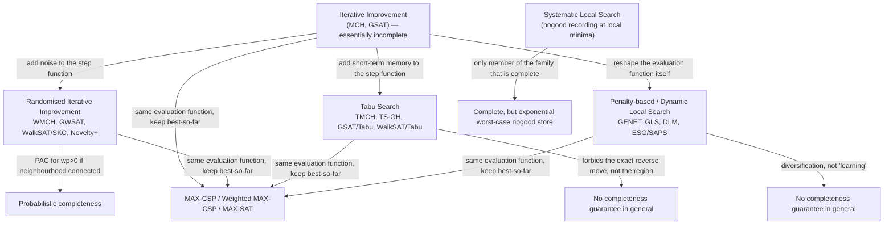

# Local Search Methods

[[book-guidelines|↩ Back to guidelines]]

## Why local search exists at all

Every CSP solver has to answer the same underlying question: out of an astronomically large space of candidate assignments, find one that satisfies every constraint (or comes acceptably close). [[Backtracking-Search|Backtracking search]] — the subject of the handbook's previous chapter — answers this by building an assignment incrementally, variable by variable, and provably exploring the whole tree if it has to. That completeness is valuable, but it has a cost: on large, loosely structured instances (thousands of variables, wide domains, few strong propagation opportunities), the search tree is simply too big to traverse, even with excellent pruning.

Local search takes the opposite bet. Instead of building a partial assignment up from nothing, **start with a *complete* assignment — almost certainly wrong — and repeatedly repair it.** You don't explore a search tree; you walk a graph whose nodes are complete candidate solutions and whose edges connect "similar" candidates (typically, ones that differ in a single variable's value). At every step you use a cheap heuristic to decide which nearby candidate to move to next, hoping to walk downhill towards something that satisfies all constraints. This buys you an algorithm whose per-step cost is tiny and whose behavior degrades gracefully with problem size — at the price of giving up the guarantee that you will terminate with a proof of unsatisfiability if none exists.

This is the central trade the whole chapter revolves around: **local search exchanges completeness for scalability**, and the entire history the chapter surveys (Min-Conflicts → GSAT → random-walk variants → tabu search → penalty-based methods → MAX-CSP) is a sequence of increasingly clever answers to the one hard problem this trade creates: *what do you do when the walk gets stuck?*

## The formal skeleton: what an SLS algorithm actually is

Before any specific algorithm, Hoos and Tsang give a general definition (Def. 5.2) that every algorithm in the chapter instantiates. A **stochastic local search (SLS) algorithm** for a problem $\Pi$, applied to instance $\pi$, is the tuple of:

- a **search space** $S(\pi)$ — the finite set of candidate solutions (for CSP: all complete variable assignments, feasible or not);
- a **solution set** $S'(\pi) \subseteq S(\pi)$ — the assignments that actually satisfy every constraint;
- a **neighbourhood relation** $N(\pi) \subseteq S(\pi) \times S(\pi)$ — which candidates are one search step apart;
- a set of **memory states** $M(\pi)$ — anything the algorithm remembers beyond its current position (a single trivial state if it's memoryless, or e.g. tabu-tenure counters if it isn't);
- an **initialisation function** $\text{init}(\pi): \emptyset \to \mathcal{D}(S(\pi)\times M(\pi))$ — a probability distribution over starting positions and memory states;
- a **step function** $\text{step}(\pi): S(\pi)\times M(\pi) \to \mathcal{D}(S(\pi)\times M(\pi))$ — a probability distribution over the *next* position and memory state, given the current one;
- a **termination predicate** $\text{terminate}(\pi): S(\pi)\times M(\pi) \to \mathcal{D}(\{\text{true},\text{false}\})$.

This is a genuinely useful abstraction — not decoration. Deterministic local search is just the degenerate case where every distribution above collapses to a point mass. And every algorithm in the rest of the chapter is obtained by fixing a neighbourhood, a memory structure, and (above all) a step function; the differences between Min-Conflicts, tabu search, and GLS are entirely differences in how `step` is defined.

**What breaks without this framework:** if you don't separate "search space + neighbourhood" from "step function," it's easy to conflate two orthogonal design axes — *where you're allowed to move* versus *how you decide where to move* — and end up reinventing the same algorithm under a different name because you varied the wrong axis. Tabu search and penalty-based search, for instance, are best understood as two different ways of modifying the step function's decision rule while keeping the 1-exchange neighbourhood fixed.

For the CSP specifically, the concrete instantiation used almost everywhere in the chapter is:

- $S(\pi)$ = all complete variable assignments,
- $S'(\pi)$ = all satisfying assignments,
- $N(\pi)$ = the **1-exchange neighbourhood**: two assignments are neighbours iff they differ in at most one variable's value (for SAT, the **1-flip neighbourhood** — differ in exactly one Boolean variable),
- the **evaluation function** $g$ maps each assignment to the number of violated constraints, so $g(a) = 0 \iff a$ is a solution.

```rust
/// The core SLS abstraction, instantiated for CSP with the 1-exchange
/// neighbourhood and "count violated constraints" evaluation function.
trait Csp {
    /// number of variables
    fn n(&self) -> usize;
    /// domain of variable i
    fn domain(&self, i: usize) -> &[i32];
    /// number of constraints violated by this complete assignment
    fn violated(&self, assignment: &[i32]) -> usize;
    /// variables that appear in at least one currently violated constraint
    fn conflict_set(&self, assignment: &[i32]) -> Vec<usize>;
}

/// One point in the 1-exchange neighbourhood graph: change var `i` to `v`.
struct Move { var: usize, val: i32 }
```

## Iterative Improvement: the naive baseline, and exactly where it fails

The simplest possible step function is: **only ever move to a strictly better neighbour.** This is **Iterative Improvement (II)**, also called hill-climbing. Two flavors:

- **Iterative Best-Improvement** — scan the whole neighbourhood, move to the neighbour with the lowest $g$-value (break ties uniformly at random).
- **Iterative First-Improvement** — scan in some fixed order, move to the *first* improving neighbour found.

Two chapter-canonical instances of pure II:

**Min-Conflicts Heuristic (MCH)** — pick a variable at random from the *conflict set* $K(a)$ (variables appearing in some currently violated constraint), then reassign it to the value that minimizes violated constraints (ties broken at random).

```rust
fn mch<C: Csp>(csp: &C, max_steps: usize, rng: &mut impl rand::Rng) -> Option<Vec<i32>> {
    let mut a: Vec<i32> = (0..csp.n())
        .map(|i| *csp.domain(i).choose(rng).unwrap())
        .collect();
    for _ in 0..max_steps {
        if csp.violated(&a) == 0 { return Some(a); }
        let conflicted = csp.conflict_set(&a);
        let x = *conflicted.choose(rng).unwrap();
        // among all values for x, keep those minimizing violated(a with x := v)
        let best_v = csp.domain(x).iter().copied().min_by_key(|&v| {
            let mut trial = a.clone();
            trial[x] = v;
            csp.violated(&trial)
        }).unwrap();
        a[x] = best_v;
    }
    None
}
```

**GSAT** — the SAT-specialised sibling: from a random assignment, flip the single Boolean variable (from the *whole* formula, not just a conflict set) that yields the greatest decrease in unsatisfied clauses, with periodic random restarts (`maxTries` outer loop of `maxSteps` inner flips).

**What breaks without going further than this:** both MCH and GSAT are **essentially incomplete** — even given unbounded running time, the probability of finding a solution to a soluble instance can converge to something strictly less than 1. The reason is structural, not a matter of bad luck: a pure improvement rule can only ever move downhill or sideways, so once it reaches a *local* minimum of $g$ that isn't a solution, it is stuck there forever (Iterative Best-Improvement will just keep re-selecting the same position, or cycle among a small plateau). Static restarts patch this crudely, but the right `maxSteps` before restarting is instance-specific and hard to guess — restart too early and you waste the progress already made; too late and you waste time trapped.

This single failure mode — **stagnation at a non-solution local minimum of $g$** — is the problem every remaining section of the chapter exists to solve, via three essentially different mechanisms: (1) inject randomness directly into the step function (§5.2), (2) add short-term memory that forbids backtracking into the trap (§5.3), or (3) dynamically reshape $g$ itself so the trap disappears (§5.4).

## Randomised Iterative Improvement: escaping traps with noise

The fix in **Randomised Iterative Improvement (RII)** is disarmingly simple: with fixed probability $wp$ ("walk probability" / noise setting), instead of taking an improving step, jump to a uniformly random neighbour (a **random walk step**); otherwise take a normal II step. Because arbitrarily long sequences of random-walk steps are possible, RII can — given enough time — reach *any* reachable state, including a solution.

This buys a genuinely important theoretical guarantee. If the neighbourhood graph is connected, RII is **probabilistically approximately complete (PAC)**:

$$
\lim_{t \to \infty} P_s(RT \le t) = 1
$$

where $P_s(RT \le t)$ is the probability that a solution is found within $t$ steps. PAC is a much weaker promise than backtracking's completeness (there's no finite bound, and no certificate of unsatisfiability), but it is exactly the property that rescues an algorithm from *essential* incompleteness — it guarantees the stagnation probability isn't bounded away from zero.

The chapter works through this family concretely:

- **WMCH** = MCH + random walk: with probability $wp$, assign the conflict-set variable a uniformly random value instead of a conflict-minimizing one. For $wp = 0$ it degenerates to plain MCH (essentially incomplete); for $wp > 0$ it's PAC.
- **GWSAT** = GSAT + *conflict-directed* random walk: the randomly flipped variable is drawn only from variables that appear in *currently unsatisfied* clauses — this is a strictly more targeted kind of noise than pure random walk, and it guarantees every random-walk step satisfies at least one previously-violated clause. This design is a direct descendant of Papadimitriou's randomized 2-SAT algorithm (which solves 2-SAT in expected quadratic time by exactly this conflict-directed coin flip).
- **WalkSAT/SKC** generalizes the idea into a genuinely different *two-stage* selection scheme that becomes the ancestor of the whole "WalkSAT architecture": (1) pick an unsatisfied clause $c$ uniformly at random; (2) pick a variable in $c$ to flip, scored by $\text{score}_b(x)$ = number of currently-satisfied clauses that flipping $x$ would *break*. If some variable in $c$ has $\text{score}_b = 0$ (a **zero-damage step** — you can satisfy $c$ for free), take it. Otherwise, with probability $1-p$ take the greedy min-$\text{score}_b$ move, and with probability $p$ (the noise setting) pick uniformly at random from $c$.

```rust
/// One WalkSAT/SKC step over a CNF formula.
fn walksat_skc_step(f: &Cnf, a: &mut [bool], p: f64, rng: &mut impl rand::Rng) {
    let unsat: Vec<usize> = f.unsatisfied_clauses(a);
    let c = unsat[rng.gen_range(0..unsat.len())];
    let vars = f.vars_in(c);

    // stage 2a: zero-damage move, if one exists
    if let Some(&x) = vars.iter().find(|&&x| f.score_break(a, x) == 0) {
        a[x] = !a[x];
        return;
    }
    // stage 2b: greedy vs. noise
    if rng.gen_bool(1.0 - p) {
        let x = *vars.iter().min_by_key(|&&x| f.score_break(a, x)).unwrap();
        a[x] = !a[x];
    } else {
        let x = vars[rng.gen_range(0..vars.len())];
        a[x] = !a[x];
    }
}
```

Note the key structural distinction the chapter draws out between two *families* here: **WalkSAT/GWSAT-style** algorithms restrict the neighbour choice to variables in a *specific* unsatisfied clause/constraint (two-stage selection), guaranteeing progress on that clause; **Novelty-style** algorithms (below) instead score *all* variables globally (like GSAT) but add age-based tie-breaking. This distinction matters because it explains a striking completeness asymmetry: **Novelty is provably essentially incomplete for any fixed noise setting, while GWSAT is PAC.** Why? Novelty's variable choice is confined to the top-two-scoring variables in the selected clause and is *deterministic* at $p=0$ and $p=1$ — the randomness never fully escapes the greedy structure, so certain cyclic traps can persist indefinitely. GWSAT's random-walk branch, by contrast, is a genuine uniform draw over an unbounded set of possible next positions, which is what the PAC proof needs. **Novelty+** (Novelty + an independent random-walk branch with probability $wp$) patches exactly this gap and recovers PAC — the fix is structurally identical to how RII patched II, and to how GWSAT patched GSAT: *route around the greedy trap with an orthogonal source of randomness, not more of the same heuristic.*

**Adaptive Novelty+** goes one step further and removes the need to hand-tune the noise parameter $p$ at all, adapting it reactively during the search — this variant won the SAT 2004 competition's random category.

## Tabu Search: escaping traps with memory instead of noise

Randomisation isn't the only way to avoid revisiting the same local minimum. **Tabu Search (TS)** instead gives the step function *short-term memory*: after a variable's value changes, the *reverse* move (putting it back) is forbidden — declared **tabu** — for the next `tt` steps (the **tabu tenure**). Structurally, this is equivalent to dynamically shrinking the neighbourhood $N(s)$ to an admissible subset $N'(s) \subseteq N(s)$ at every step.

The danger of a blunt "never undo the last `tt` moves" rule is that it can rule out moves leading somewhere genuinely good, purely because of recent history. The fix is an **aspiration criterion**: override the tabu status whenever the move would improve on the *incumbent* (best-so-far) assignment. This is a small but important design point — tabu status is a heuristic proxy for "probably not useful right now," and the aspiration criterion is the safety valve that stops the proxy from vetoing an objectively good move.

```rust
struct TabuState {
    tabu_until: Vec<Vec<u64>>,   // tabu_until[var][val] = step number until which (var,val) is tabu
    step: u64,
    tenure: u64,
}

impl TabuState {
    fn is_tabu(&self, var: usize, val_idx: usize) -> bool {
        self.step < self.tabu_until[var][val_idx]
    }
    fn declare_tabu(&mut self, var: usize, val_idx: usize) {
        // forbid reintroducing the value just left, unless aspiration overrides it
        self.tabu_until[var][val_idx] = self.step + self.tenure;
    }
}
```

The chapter's efficient-implementation trick for this bookkeeping is elegant and worth internalising, because it's the pattern behind most incremental local-search implementations: rather than storing an explicit tabu *set*, store one number $t_{x,v}$ per (variable, value) pair — the last step at which $x$ was set to $v$ — initialised to $-tt$. Then `(x, v)` is tabu iff $t - t_{x,v} \le tt$, an $O(1)$ check with $O(nk)$ space ($n$ variables, $k$ = largest domain size) instead of any per-step set manipulation.

**TMCH** (MCH + this mechanism) already outperforms WMCH, and a tabu tenure of $tt=2$ was found to work consistently well across instance types — a strikingly small, universal constant. **TS-GH** (Galinier & Hao) swaps MCH's random-then-greedy variable selection for a fully best-improvement choice over *all* (variable, value) pairs touching a violated constraint, combined with the same tabu/aspiration mechanism, and is called out by Hoos and Tsang as **one of the strongest CSP SLS algorithms known** — its cost is that efficient implementation now *requires* the same kind of incremental evaluation-function bookkeeping GSAT needs (a full $n \times k$ table of "effect of every possible move on $g$", updated incrementally after each step rather than recomputed).

The **GSAT/Tabu**, **WalkSAT/Tabu**, and **Novelty**-family algorithms round out this section by attaching tabu tenures directly to *variables* (rather than variable/value pairs) in the SAT setting. One subtlety worth flagging: WalkSAT/Tabu can hit a state where *every* candidate variable in the selected clause is tabu, forcing a **null-flip** (do nothing, but still age the tabu counters) — and this null-flip is exactly why WalkSAT/Tabu with a fixed `maxTries` is provably essentially incomplete, even though the tabu mechanism was designed to *fight* incompleteness. Memory-based escape and noise-based escape are not interchangeable; a tabu mechanism alone doesn't reintroduce the "reach anything with positive probability" property that PAC needs.

## Penalty-based / Dynamic Local Search: escaping traps by reshaping the landscape

The third family takes the most conceptually distinct approach: instead of changing *how* you move (noise) or *where* you're allowed to move (tabu), **change the evaluation function itself** whenever the search stagnates. This is **Dynamic Local Search (DLS)**, and its members associate a **penalty weight** with each constraint (or clause), modified as the search proceeds.

A crucial empirical finding the chapter is explicit about, and worth internalising as a corrective to the "obvious" story: penalty weights are often *motivated* by the idea that the search should "learn" which constraints are structurally important. But **the evidence increasingly points to diversification, not learning, as the actual source of these algorithms' performance** — penalizing recently-violated constraints reshapes the local landscape just enough that the current local minimum stops being a minimum, which is functionally a form of controlled perturbation, closer in spirit to a very targeted random walk than to genuine constraint-importance discovery.

**GENET / Breakout Method** (earliest instances): associate a weight with every constraint (GENET: with every conflicting pair of atomic assignments, via a neural-network-style architecture), start all weights at 1, run iterative improvement to a local minimum of the weighted evaluation function, then increment the weight of every currently-violated constraint by 1 and continue. Note that with all weights fixed at 1, GENET's step rule collapses to something behaviourally identical to Min-Conflicts — the weighting is the *only* new ingredient.

**Guided Local Search (GLS)** generalizes this into a clean, tunable framework applicable beyond CSP (SAT, TSP, vehicle routing). The augmented evaluation function is

$$
g'(a) = g(a) + \lambda \sum_{i=1}^{m} p_i\, I_i(a)
$$

where $g(a)$ is the raw violated-constraint count, $p_i$ is constraint $i$'s current penalty, $I_i(a) \in \{0,1\}$ indicates whether $i$ is violated under $a$, and $\lambda$ is the (single!) tunable parameter. At every local minimum of $g'$, GLS increases the penalties that maximize a **utility function**

$$
\text{util}_i(a) = I_i(a) \cdot \frac{c(i)}{1 + p_i}
$$

with $c(i)$ the cost of leaving constraint $i$ unsatisfied (uniformly 1 for plain CSP, but this is exactly the hook that generalizes GLS to *weighted* problems for free). The $1/(1+p_i)$ term is the mechanism's key diversification device: **a constraint that's already been penalized heavily becomes progressively less attractive to penalize again**, which spreads penalty pressure across different parts of the constraint set over time rather than fixating on one bottleneck constraint forever.

```rust
struct Gls<'a> { csp: &'a dyn Csp, penalty: Vec<f64>, lambda: f64 }

impl<'a> Gls<'a> {
    fn augmented(&self, a: &[i32]) -> f64 {
        let raw = self.csp.violated(a) as f64;
        let penalty_term: f64 = self.violated_constraint_ids(a)
            .iter().map(|&i| self.penalty[i]).sum();
        raw + self.lambda * penalty_term
    }

    /// Called at each local minimum of `augmented`.
    fn update_penalties(&mut self, a: &[i32]) {
        let ids = self.violated_constraint_ids(a);
        let cost = |_i: usize| 1.0; // uniform for plain CSP; per-weight for MAX-CSP variants
        let best = ids.iter().copied().max_by(|&i, &j| {
            let u = |k: usize| cost(k) / (1.0 + self.penalty[k]);
            u(i).partial_cmp(&u(j)).unwrap()
        });
        if let Some(i) = best { self.penalty[i] += 1.0; }
    }
    fn violated_constraint_ids(&self, _a: &[i32]) -> Vec<usize> { unimplemented!() }
}
```

**The Discrete Lagrangian Method (DLM)** motivates the same class of algorithm from a genuinely different direction: continuous constrained optimisation. For minimizing $f(\vec x)$ subject to $g_i(\vec x) = 0$, the classical Lagrangian is

$$
L(\vec x, \vec\lambda) = f(\vec x) + \sum_i \lambda_i g_i(\vec x),
$$

and a constrained local minimum corresponds to a **saddle point** of $L$:

$$
L(\vec x^*, \vec\lambda) \;\le\; L(\vec x^*, \vec\lambda^*) \;\le\; L(\vec x, \vec\lambda^*)
$$

for all $(\vec x^*, \vec\lambda)$ and $(\vec x, \vec\lambda^*)$ near $(\vec x^*, \vec\lambda^*)$ — descend on $\vec x$, ascend on $\vec\lambda$, and you converge to a saddle that satisfies the constraints. Discretised: perform best-improvement descent on the same weighted evaluation function used above ($L$'s $\vec x$-minimization), and at every local minimum, *increase* the penalties of unsatisfied clauses ($L$'s $\vec\lambda$-ascent) until some previously-worsening move becomes improving. The chapter is careful to flag an important honesty point here: **the rigorous convergence guarantees of continuous Lagrangian methods do not transfer to DLM**, because DLM's step rule is heuristic (best-improvement search), not a literal gradient — the Lagrangian framing is a source of *intuition and a naming scheme*, not a source of proof.

**ESG and SAPS** refine the *penalty-update* half of this pattern into two stages: a **scaling stage** (multiply weights of satisfied clauses by $\alpha_{sat}$, unsatisfied by $\alpha_{unsat}$) and a **smoothing stage** (pull all weights toward their mean: $\text{clw}(c) \leftarrow \text{clw}(c)\cdot\rho + (1-\rho)\cdot \bar w$), which prevents weights from drifting unboundedly and re-diversifies old penalty information. SAPS's contribution is almost entirely an efficiency one — restrict scaling to unsatisfied clauses and make smoothing *probabilistic* ($p_\text{smooth}$) rather than deterministic every phase — and this alone yields a substantial empirical speedup with no loss (in fact a gain) in solution quality, illustrating how much of the practical performance ceiling in this area is about how *cheaply* you can afford to run the reshaping step, not just its formula.

## Local search for constraint optimisation (MAX-CSP and friends)

Everything above assumes a satisfiable instance and a well-defined "zero violations" target. Real over-constrained problems (not enough resources for every job, conflicting soft preferences) need a different framing: **MAX-CSP** asks for an assignment satisfying the *maximum* number of constraints (equivalently, minimizing the violated count — literally the same evaluation function most SLS-for-CSP algorithms already use). **Weighted MAX-CSP** attaches a weight to each constraint and maximizes satisfied weight; **MAX-SAT**/**Weighted MAX-SAT** are the SAT-restricted special cases, of particular interest because any Weighted MAX-CSP instance can be *compiled into* Weighted MAX-SAT (at the cost of losing constraint-graph structure and enlarging the search space).

The reassuring structural point: because most CSP-SLS algorithms already optimize "number of violated constraints" as their evaluation function, **they transfer to MAX-CSP essentially unchanged** — you just don't stop at $g=0$, you keep improving as long as time allows and report the best assignment seen. Weighted MAX-CSP needs only a reweighted evaluation function (violated *weight*, not violated *count*).

The one genuinely open design question the chapter flags is how to combine the *problem's own* constraint weights with the *algorithm's dynamically-adjusted* penalty weights, when a DLS method is applied to a weighted problem — there's no canonical answer:

- **naive sum** (Wah & Shang's DLM): add weight and penalty directly into the evaluation function;
- **GLS's separation**: constraint weights steer *which* penalties get incremented (via the utility function's $c(i)$ term), but never enter the evaluation function directly;
- **Wu & Wah's DLM for Weighted MAX-SAT**: weights drive penalty initialisation/update but again stay out of the evaluation function.

All three are defensible, and the chapter's honesty about there being no single correct integration is itself a useful lesson: penalty weights and problem weights are conceptually different quantities (one encodes "how hard the search is currently stuck," the other encodes "how much this constraint actually matters"), and conflating them by simple addition is a modeling choice, not a mathematical necessity.

Larger neighbourhoods (2-flip, 3-flip, or swap moves rather than strict 1-exchange) show up more here than in plain CSP-solving, because optimisation problems often have plateaus that single-variable moves can't escape efficiently — at the cost of needing specialised data structures to search the larger neighbourhood without paying for it combinatorially at every step.

## Frameworks and toolkits (brief)

The chapter closes its technical survey by naming the software ecosystem: commercial systems (**ILOG Solver**/**Dispatcher**, **iOpt**), free C++ frameworks (**EasyLocal++**, **HotFrame**) that factor local search into problem-independent abstract classes specialised per-problem, and declarative search languages (**COMET**, **SALSA**, **ZDC**/**EaCL**) that let the user *specify* neighbourhoods and step strategies rather than hand-coding them. The recurring architectural idea across all of them — worth carrying forward mentally, whether or not you ever touch these specific tools — is the separation of **problem formulation** (what the constraints and variables are) from **search strategy** (which SLS algorithm and parameters drive the walk); the `Csp` trait and the various step functions above are, in miniature, exactly that separation.

## Synthesis: how this chapter's pieces fit together



Three completeness-repair strategies, one shared failure mode. Every algorithm here is Iterative Improvement plus exactly one of: **noise** (§5.2), **memory** (§5.3), or **landscape reshaping** (§5.4) — and the chapter's own closing section is explicit that these mechanisms are not fully understood theoretically; the field is still largely empirical, hence the emphasis (§5.7–5.8) on reproducible implementations and shared benchmark libraries (CSPLIB, SATLIB) as the actual epistemic backbone of the area.

## Where this leads

Within the handbook, this chapter is the incomplete-search counterpart to backtracking search (Ch. 4) and is presupposed by later chapters on soft constraints (Ch. 7, where MAX-CSP-style evaluation functions become the native representation of preference violation) and applications like vehicle routing and scheduling (Ch. 20, 23), where problem sizes make systematic search impractical and GLS-style methods (ILOG Dispatcher) are the deployed technology.

For the standing project this vault is built around — a Rust-based dependent/refinement-type compiler with an embedded CSP kernel for counterexample search — this chapter is directly load-bearing, not background. The design goal stated in the learning-goals file is a CSP kernel that **efficiently proves the presence of bugs by searching for concrete, satisfying assignments** that violate a type invariant, used adversarially inside a CEGAR loop against an abstract-interpretation analysis that over-approximates for soundness. That is *exactly* the MAX-CSP / SLS problem shape described above: the "constraints" are the negated verification condition plus the current refinement predicates, the "variables" are the program's symbolic values, and a satisfying assignment found by MCH/WalkSAT/tabu search *is* a counterexample — a concrete witness that a Hoare triple or refinement-subtyping obligation fails. Three details from this chapter map onto that design directly:

- **The evaluation-function-as-violation-count idea generalizes immediately to weighted/soft SMT-style constraints** — if some of your generated verification conditions are "soft" (heuristically likely but not soundness-critical), the GLS/Weighted-MAX-CSP machinery gives a principled way to search for *a* satisfying assignment while still prioritizing which clauses matter most, rather than treating every generated constraint as equally hard.
- **Tabu search's incremental $t_{x,v}$ bookkeeping and TS-GH's $O(nk)$ evaluation-delta table are the right implementation pattern for a bit-vector/integer counterexample search over large symbolic-value domains** — you cannot afford to recompute "how many verification conditions does flipping this value violate" from scratch at every candidate.
- **Systematic Local Search's nogood-recording is the one thread in this chapter that ties back to soundness rather than just search efficiency**: an SLS-based counterexample search that never finds one is not, by itself, a proof of the invariant's validity (that's what the abstract-interpretation half of the CEGAR loop is for) — but a local search that *does* find a satisfying assignment gives an immediately checkable, and hence trusted-kernel-friendly, proof-of-bug: a concrete witness needs no further trust than re-evaluating the constraints on it.
