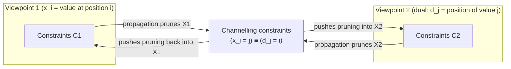
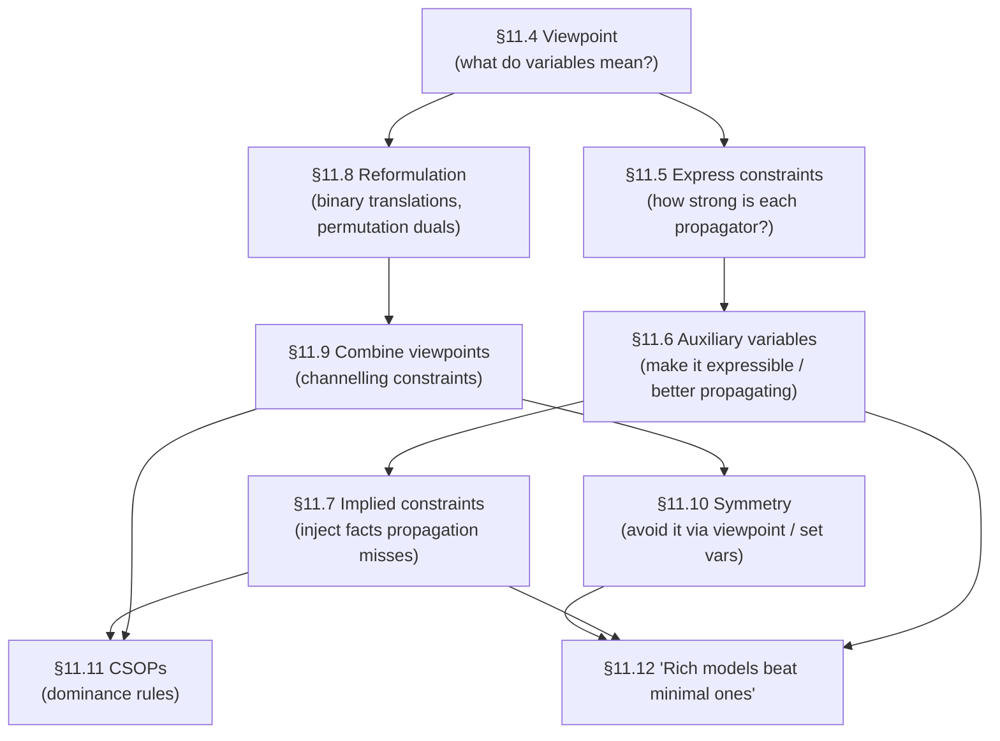

# Modelling Constraint Satisfaction Problems

[[book-guidelines|↩ Back to guidelines]]

## Why modelling is a problem at all

Here's the thing that makes constraint programming both attractive and treacherous: the same underlying combinatorial problem $P$ can be turned into wildly different CSPs, and a solver that interleaves search with constraint propagation will have a dramatically different experience with each one — sometimes the difference between milliseconds and "doesn't finish." This isn't a story about a correctness bug. All the models under discussion are logically correct — every one of them, if solved exhaustively, returns exactly the solutions to $P$. The problem is *operational*: propagation-based solvers only ever enforce *local* consistency (arc consistency on some constraints, bounds consistency on arithmetic ones, generalized arc consistency only where an efficient filtering algorithm happens to exist) — never full backtrack-free (globally) consistency, because building a globally consistent network is itself exponential. Whatever local pruning your model's constraints happen to induce is *all the help you get* between choice points. So the real content of "modelling" a CSP is: given that the solver will only ever look at each constraint (or a few of them at a time) through the narrow lens of local consistency, how do you *phrase* the problem so that narrow lens sees as much as possible?

This is a strikingly close cousin of a decision every implementer of a type checker or abstract interpreter faces: an inference algorithm is complete relative to some *procedure*, not relative to the full semantics, and the encoding you choose for judgments/constraints determines what that procedure can actually see. A weak encoding of a true fact silently degrades your solver from "prunes early" to "explores exhaustively and eventually notices the assignment was doomed." Chapter 11 (Barbara M. Smith) is an extended catalogue of the encoding choices available and when each one helps.

## 11.1 The formal apparatus, stated once and used throughout

Before the modelling advice, the chapter fixes vocabulary. A CSP is a triple

$$\langle X, D, C \rangle$$

where $X = \{x_1,\dots,x_n\}$ is a set of variables, $D = \{D_1,\dots,D_n\}$ gives each variable's (finite) domain, and $C$ is a set of constraints. Each constraint is a pair $c = \langle \sigma, \rho \rangle$: $\sigma$ (the *scope*) is the list of variables it's over, and $\rho$ (the *relation*) is a subset of the Cartesian product of their domains — the tuples that are allowed. A relation can be given **extensionally** (literally list the allowed/forbidden tuples) or **intensionally** (an expression like $x < y$ that a checker evaluates against a candidate tuple). This distinction matters a lot later: extensional constraints let you enforce full arc consistency on an arbitrary relation (nothing about the *shape* of the relation limits propagation), at the cost of possibly needing to materialize a large tuple set.

Two consistency notions recur throughout the chapter:

- **(Generalized) arc consistency.** A binary constraint is arc consistent if every value in either variable's domain has *some* supporting value in the other's domain. For a non-binary constraint, generalized/hyper-arc consistency (GAC) is the same idea with "for every value of every variable in the scope, there's a completion to a satisfying tuple using the current domains of the other scope variables."
- **Bounds consistency (BC).** For a constraint over ordered (e.g. integer) domains, only the *endpoints* of each variable's domain need supporting values (possibly using non-integer/interval values for the other variables) — a much cheaper, much weaker guarantee than AC, but often the only thing tractable for arithmetic constraints.

Solvers pick one of these per constraint as a matter of engineering trade-off, not user choice by default. J.-F. Puget's remark about ILOG Solver, quoted in the chapter, is the load-bearing sentence for the whole topic: propagating only bounds (not "holes") on arithmetic expressions is *less complete* than full domain propagation, but empirically the better time/space trade-off. **This single engineering decision — bounds over full domains for arithmetic — is why so much of the rest of the chapter is about phrasing constraints to compensate for a solver that won't look as hard as you'd like.**

```rust
// The book's triple, made concrete. A constraint's "shape" (extensional vs.
// intensional, arity, scope overlap with its neighbors) is exactly what
// determines how much a propagator can see — this struct is the whole
// chapter's object of study.
struct Csp<V, D> {
    variables: Vec<V>,
    domains: Vec<Domain<D>>,   // Di, one per variable
    constraints: Vec<Constraint<V, D>>,
}

enum Constraint<V, D> {
    Extensional { scope: Vec<V>, allowed: HashSet<Vec<D>> },   // ρ given as tuples
    Intensional { scope: Vec<V>, check: Box<dyn Fn(&[D]) -> bool> }, // ρ given as a predicate
}
```

**What breaks without this vocabulary fixed:** without a crisp notion of "arc consistent" vs. "bounds consistent," you can't even *state* Harvey and Stuckey's warning below — that logically equivalent constraint sets can differ in what a fixed level of local consistency extracts from them. The formalism isn't decoration; it's the only way to make "this model propagates better" a claim you can actually evaluate rather than a vibe.

## 11.2 What does it even mean for a CSP to "model" a problem?

Smith's proposed definition: $M = \langle X,D,C\rangle$ models $P$ if every solution of $M$ maps to a solution of $P$, and every solution of $P$ is reachable from at least one solution of $M$. Note this is explicitly *not* a bijection. Representing indistinguishable real-world entities (queens, cars requiring the same options, interchangeable staff) as distinct CSP variables/values manufactures **symmetry that was never in $P$** — many solutions of $M$ collapse onto one solution of $P$. This is the seed of an entire separate topic (§11.10, and Chapter 10 of the handbook) but it's introduced here because it's a direct consequence of viewpoint choice, not a bolt-on afterthought.

## 11.3 Propagation and search: the mechanism the rest of the chapter is optimizing for

Search proceeds by choice points — binary branching ($x_i = a$ vs. $x_i \ne a$), $k$-way branching, domain splitting, or even two-variable choices ($x_i \le x_j$ vs. $x_i > x_j$, common in scheduling). After each choice, propagation runs to a fixpoint at each constraint's target consistency level; an empty domain triggers backtracking. This is *unremarkable* as an algorithm — it's the default in every commercial solver — but its presence as the fixed backdrop is precisely why modelling matters: **every modelling decision in this chapter is really a decision about what a fixed, not-very-smart search loop will be able to see.** Beacham, Chen, Sillito and van Beek's crossword-puzzle study is cited for the sobering empirical finding that model choice, search algorithm, and search heuristic *interact* — none of the three can be optimized in isolation. Keep this in mind: nothing in this chapter is a universal law; everything is "helps, usually, in combination with the rest of the setup."

## 11.4 Choosing a problem viewpoint

**The idea.** A *viewpoint* is a pair $\langle X,D\rangle$ — a choice of what the variables *mean* and what values they range over, before you've written a single constraint. Two viewpoints for the same $P$ can be radically different CSPs. The term is due to Geelen (informally) and Law and Lee (formally).

**What breaks without a good viewpoint.** Nadel's classic case study is n-queens, with nine distinct viewpoints. Two of them:

1. **Row-per-variable:** $r_1,\dots,r_n$, one per board row, domain $\{1,\dots,n\}$ (columns). $(r_i,c)$ means "the queen in row $i$ is in column $c$." The "one queen per row" rule is *free* — it's just what it means for a variable to take exactly one value. The "one queen per column" rule is a clean `allDifferent`, or $n(n-1)/2$ binary $\ne$ constraints.
2. **Queen-per-variable:** $q_1,\dots,q_n$, one per queen, domain $\{1,\dots,n^2\}$ (squares). Now nothing is free: you need constraints ruling out same-row, same-column, *and* same-diagonal pairings, typically as an ugly extensional relation over $n^2$ values per variable — and even after propagating all of that, the model can't express "there is *at least* one queen per row," only "at most one," so it will accept partial assignments a human would recognize as already dead.

Viewpoint 2 is *correct* — same solution set — but strictly weaker operationally. The rule of thumb Smith gives: prefer a viewpoint that lets constraints be expressed **concisely, with low-arity relations that have efficient, high-strength propagators.**

```python
# Two n-queens viewpoints, same problem, very different constraint shapes.

# Viewpoint 1 (row-indexed): "one queen per row" is structural, not a constraint.
rows = [Var(domain=range(1, n+1)) for _ in range(n)]     # r_i = column of queen in row i
# constraints: all_different(rows), and for i<j: |rows[i]-rows[j]| != j-i  (diagonals)

# Viewpoint 2 (queen-indexed): everything must be stated explicitly, extensionally,
# and even then "exactly one queen per row" isn't expressible — only "at most one."
squares = [Var(domain=range(1, n*n+1)) for _ in range(n)]  # q_i = square of queen i
```

```lean
-- The two viewpoints are not "the same up to renaming" — they induce genuinely
-- different search spaces because the *type* the variable ranges over carries
-- different information. This is exactly the intuition behind choosing a good
-- index type for a dependent record before writing predicates over it: a
-- well-chosen domain makes invariants definitionally free (Fin n as "exactly
-- one column per row" — no separate axiom needed), a poorly-chosen one pushes
-- everything into explicit side conditions you must prove/propagate by hand.
def RowViewpoint (n : Nat) := Fin n → Fin n        -- row ↦ column, totality is free
def QueenViewpoint (n : Nat) := Fin n → Fin (n*n)  -- queen ↦ square, invariants all external
```

## 11.5 Expressing the constraints

Once the viewpoint is fixed, there's still latitude in *how* to write the constraints — and Harvey and Stuckey's observation is the chapter's sharpest one-liner: **"the form of a constraint may change the amount of information that propagation discovers,"** even between logically equivalent constraint sets. Their example: $c_1 \equiv (x=y)$, $c_2 \equiv (x+y=z)$, $c_3 \equiv (2y=z)$. $\{c_1,c_2\}$ and $\{c_1,c_3\}$ have identical solution sets, but making $\{c_1,c_3\}$ locally consistent forces $z$'s domain (or bounds) to even integers — a fact $\{c_1,c_2\}$'s propagator will never notice, because it's not staring at that pair of constraints together.

This section is a menu of five techniques, each trading expressiveness/cost for propagation strength:

- **Combining constraints with the same scope (§11.5.1).** Enforcing GAC on the *conjunction* $c_1 \wedge c_2$ removes at least as many values as enforcing it on $c_1,c_2$ separately — strictly more if their scopes overlap. In the n-queens example (three constraints between each pair $x_i,x_j$ for $\ne$/diagonals), a search state can leave each pairwise constraint arc consistent while the *conjunction* is not — a value survives each individual check but has no single supporting assignment satisfying all three simultaneously. Katsirelos and Bacchus formalize this and give a heuristic ("combine constraints sharing most of their scope") using the Golomb ruler problem as their case study.
- **Eliminating variables via substitution (§11.5.2).** Harvey and Stuckey also prove a substitution theorem: given $c_1 \equiv (\sum a_i x_i \mathbin{op} d)$ and a two-variable equation $c_2 \equiv (b_jx_j + b_kx_k = e)$, using $c_2$ to eliminate $x_j$ from $c_1$ (producing $c_3$) makes $\{c_3,c_2\}$ *strictly stronger* under bounds or domain propagation than $\{c_1,c_2\}$. Fewer variables in a constraint's scope is not neutral — it's a real propagation gain, this is the one case in the chapter where "reduce the number of variables" is unambiguously validated (as a *local* substitution move, not a global modelling principle — see §11.12).
- **[[Global-Constraints|Global constraints]] (§11.5.3).** `allDifferent` is the running example of a constraint where the *user* chooses the consistency level: treat it as $n(n-1)/2$ binary $\ne$'s under AC, or maintain BC on the global form, or full GAC via Régin's matching-based algorithm (Chapter 6). GAC is worth its extra cost roughly when the union of the domains isn't much bigger than $n$ (a "tight" alldifferent); when domains are loose, the weaker $\ne$-clique version is often more cost-effective.
- **Extensional constraints (§11.5.4).** Some solvers (SICStus's `case`, ILOG's `table`) let you specify a relation directly as allowed tuples and get AC/GAC "for free" on an arbitrary relation regardless of its intensional shape. The Black Hole patience-game example is a clean illustration: consecutive-card sequencing with wraparound-ish ace rules is *awkward* as an arithmetic expression but trivial to list as a table.
- **Reified and meta-constraints (§11.5.5).** A reified constraint attaches a 0/1 variable $b$ to $c$, with $b=1 \Leftrightarrow c$ holds — the standard mechanism for expressing *disjunctions* of constraints ($c_1 \vee c_2$ becomes $b_1 + b_2 \ge 1$) and, via van Hentenryck and Deville's cardinality operator, bounded counts of how many of a set of constraints must hold.

**What breaks without this section's discipline:** you write a "correct" model, and the solver explores enormous swaths of dead search space that a differently-phrased (logically equivalent!) constraint set would have pruned immediately — and there is no warning, because nothing here is a type error or a soundness bug. This maps directly onto a familiar trap in constraint-based type inference: two logically equivalent presentations of a subtyping constraint set can differ enormously in how much a fixed unification/propagation pass extracts, and "the constraints are equivalent" is not the same claim as "the solver behaves the same."

## 11.6 Auxiliary variables

**The idea.** Add variables that aren't part of the original viewpoint, purely to make a constraint expressible at all, or to make it propagate better.

**Worked example — car sequencing (Dincbas, Simonis, van Hentenryck).** Cars on a line each need a subset of options; each option's installation station has a *capacity ratio* (e.g. "at most 1 car in every 2" needs the option). With only sequence variables $s_i$ (which car-class occupies slot $i$), the capacity constraint is awkward to state directly. The fix: introduce Boolean auxiliaries $o_{ij} = 1$ iff the car in slot $i$ needs option $j$. Now the capacity rule is a clean local constraint, e.g. for a 1-in-2 option:

$$o_{i,1} + o_{i+1,1} \le 1, \quad 1 \le i < n$$

plus linking constraints $o_{ij} = \lambda_{s_i,j}$ tying the auxiliaries back to the real decision variables ($\lambda_{kj}=1$ iff class $k$ needs option $j$). Note the auxiliaries here happen to be *rich enough to be their own viewpoint* — every valid sequence is recoverable from a complete assignment to the $o_{ij}$ alone — which is a preview of §11.9's combined models.

**Auxiliaries as search-order tools, not just expressibility tools.** In the SONET ring-design problem, auxiliary variables counting "how many rings does node $i$ sit on" turned out to be worth **assigning first**, before the main $x_{ik}$ variables — deciding ring-counts first collapses the remaining search dramatically even though ring-count alone doesn't fully specify a solution. This is the chapter's first hint that "more variables" can *help* search, directly against naive "minimize variables" folklore — a theme that becomes explicit in §11.12.

```rust
// Car sequencing: the auxiliary Boolean matrix turns an awkward "count how many
// of the last k slots need option j" rule into a sliding local constraint.
struct CarSequencing {
    slots: Vec<Var<ClassId>>,         // the real decision variables, s_i
    needs_option: Vec<Vec<BoolVar>>,  // o[i][j], auxiliary — linked via o_ij = lambda[s_i][j]
}
// capacity q/p for option j becomes, for every window of p consecutive slots:
//   sum(needs_option[i..i+p][j]) <= q
// — a constraint that simply has no clean form over `slots` alone.
```

## 11.7 Implied (redundant) constraints

**The idea.** Add constraints that are *logically entailed* by the existing ones — they change nothing about the solution set — purely to give the propagator more to chew on earlier.

**The necessary condition, precisely.** An implied constraint is useless unless it forbids some compound assignment that the *existing* propagation (at its target consistency level) would otherwise let through. This is a subtle point: "logically implied" is a static/semantic fact; "useful" is a fact about what a *specific, level-bounded* propagator would have discovered on its own. The car-sequencing continuation makes this concrete: if 12 of 30 cars need a 1-in-2 option, then among the first 8 slots at least one car must need it (else the remaining 22 slots would have to carry all 12, violating the 1-in-2 rate). None of the existing option-capacity constraints say this on their own — it takes reasoning about a *sub-sequence*, which is exactly the kind of fact an implied constraint can inject directly instead of leaving the solver to rediscover it (or not) via backtracking.

**Implied constraints depend on search order — this is the chapter's sharpest counter-intuitive result (§11.7.1).** Borrett & Tsang's example: if binary constraints link $p$–$q$ and $p$–$r$, you can derive an implied constraint $c_{qr}$ by composing them (path consistency on the triple). Under naive backtracking with assignment order $p,q,r$, adding $c_{qr}$ changes **zero** nodes visited — by the time $q$ and $r$ are both assigned, $c_{qr}$ can only reject what $c_{pq}$ and $c_{pr}$ already would have. But if the CSP already had $c_{pr}$ and $c_{qr}$ present, then *adding* $c_{pq}$ under the same order *does* prune. The lesson: usefulness of a redundant constraint is not a property of the constraint set alone — it's a property of the constraint set **together with the search's variable order**. The car-sequencing case makes this concrete too: only implied constraints over the *first $k$* slots matter if the search builds the sequence left to right; the (equally valid) implied constraints over later windows are pure overhead, since they'd never fire before the corresponding real capacity constraint already had.

**Implied constraints vs. global constraints (§11.7.2).** Régin and Puget later built a dedicated sequencing global constraint whose filtering "subsumes all the implied constraints" Dincbas et al. had hand-derived. This is the general pattern: a hand-crafted implied constraint is often a symptom of a missing global constraint. But global constraints cost more to propagate per node, so for one-off problems (no reuse across a whole problem class) cheap implied constraints can remain more cost-effective even after a general filtering algorithm exists.

**Finding them (§11.7.3–11.7.4).** Sources cited: mining subproblems for tighter bounds (Van Beek & Wilken's instruction scheduler — lower bounds on inter-instruction distances derived by solving smaller subproblems, described as "the key" to scaling); treating them as generalized nogoods surfaced by watching failed search branches; and semi-automated derivation (Hnich, Richardson, Flener's classification; Frisch, Miguel, Walsh's `eliminate` method, which simplifies a non-linear constraint like $\frac{A}{BC}+\frac{D}{EF}+\frac{G}{HI}=1$ into a lower-arity implied bound $\frac{3A}{BC}\le 1$ using known bounds on the other terms). None of these is a solved problem — the chapter is candid that fully automatic generation "does not at present appear a promising route."

```python
# Borrett & Tsang's point, made runnable: same *set* of constraints, different
# search order, opposite verdict on whether the implied constraint helps.
def naive_backtrack(order, constraints):
    ...  # visits nodes in `order`; a constraint on variables assigned earlier
         # in `order` prunes; one on variables assigned only at the end never
         # gets a chance to fire before the deadend is already detected.
# order = [p, q, r]: adding c_qr (derived from c_pq, c_pr) prunes NOTHING.
# order = [p, q, r] but starting from {c_pr, c_qr}: adding c_pq DOES prune.
```

## 11.8 Reformulation of CSPs

Sometimes a better model isn't a patch on the current viewpoint — it's a genuinely different viewpoint.

**Non-binary → binary translations (§11.8.1).** Two standard moves, both mattering to modelling because of *what kind of change* they represent: the **hidden-variable transformation** (one new variable $h_i$ per non-binary constraint $c_i$, its values are tuples of the original scope, replace $c_i$ with binary link constraints) is, in this chapter's own terms, just another *auxiliary variable* — it doesn't change viewpoint. The **dual graph transformation** — one new variable $d_i$ per constraint, whose values are $c_i$'s satisfying tuples, with binary agreement constraints between $d_i,d_j$ wherever $c_i,c_j$ share variables — genuinely *is* a new viewpoint, because you can now search on the dual variables instead of the originals. The Maximum Density Still Life problem (9-ary neighbourhood constraints replaced by dual "supercell" variables) is the worked case where this pays off precisely because the dual variables become better search variables, not just an equivalent restatement.

**Permutation problems and their dual (§11.8.2).** A CSP is a *permutation problem* if $|X| = |\bigcup D_i|$ and every solution assigns a bijection between variables and values. Geelen's dual viewpoint swaps the roles: n-queens' usual "row → column" viewpoint and its dual "column → row" viewpoint happen to coincide, but in general (e.g. magic squares: "number → cell" vs. "cell → number") one direction makes the row/column-sum constraints trivial to state and the other doesn't. This dual-viewpoint idea is what §11.9 builds its central technique on.

**Boolean/direct encodings (§11.8.3).** A 0/1 indicator variable $x_{ij}$ per variable-value pair — structurally close to a direct SAT encoding — is *always available* but "usually gives a less efficient CSP than the integer or set model." Included here mainly as the baseline you should be converting *away from*, not toward.

**Genuinely different angles (§11.8.4).** The open-stacks problem (IJCAI'05 Constraint Modelling Challenge) is the chapter's showcase for viewpoints that aren't algebraic transforms of each other at all — sequence-of-products, sequence-of-customers, customer→stack-area, and a pairwise-Boolean "do these two customers share a stack" viewpoint that maps *directly* onto the objective function. These come from different *insights* into the problem, not from a mechanical recipe — which is exactly why §11.9's answer is "don't choose one, combine them."

## 11.9 Combining viewpoints

This is the chapter's centerpiece technique, and it's the sharpest illustration of "more structure helps a level-bounded propagator see further."

**The construction.** Given two complete models $M_1 = \langle X_1,D_1,C_1\rangle$, $M_2 = \langle X_2,D_2,C_2\rangle$ of the same $P$ (mutually redundant — either alone would already solve $P$), build the combined model with variables $X_1 \cup X_2$ and constraints $C_1 \cup C_2 \cup C_c$, where $C_c$ is a set of **channelling constraints** relating $X_1$ and $X_2$ so an assignment in either viewpoint determines the corresponding assignment in the other (Cheng, Choi, Lee, Wu).

**Why this isn't just redundancy.** The mechanism is genuinely emergent, not additive: propagating $C_1$ prunes $X_1$'s domains; the channelling constraints push that pruning into $X_2$; propagating $C_2$ on the now-smaller $X_2$ domains prunes further; the channelling constraints push *that* back into $X_1$. The net result can remove more values from $X_1$ than $C_1$ ever could alone — because $C_2$ is seeing the *same underlying problem* through a shape where different facts are structurally cheap to state.

**The canonical case — permutation duals.** For $x_1,\dots,x_k$ and dual $d_1,\dots,d_k$, the channelling constraints are

$$(x_i = j) \equiv (d_j = i), \quad 1 \le i,j \le k$$

(efficiently realized as a global `inverse` constraint rather than $k^2$ binary reifications). A striking consequence, formalized by Choi, Lee, Stuckey (§11.9.1): maintaining AC on these channelling constraints alone does *strictly more* pruning than a full `allDifferent`/$\ne$-clique on $x_1,\dots,x_k$ would — it not only removes values already assigned elsewhere (what AC on $\ne$ gives you) but also *forces* a value onto a variable if that value has become unique to it across the whole set. So in a combined model, the original viewpoint's own `allDifferent` becomes **propagation redundant** and can be dropped — it's not needed for correctness (the channelling constraints already guarantee bijectivity) and, past a certain point, adds only overhead. Choi et al.'s formal notion of propagation redundancy ("the propagation this constraint would cause is subsumed by propagation from other constraints already in the model") is the general tool for deciding what to keep.

**Model induction (Law & Lee, §11.9).** A lighter-weight alternative to full combination: translate $M_2$'s constraints into $M_1$'s viewpoint via the channelling constraints and merge them into $M_1$'s existing same-scope constraints — importing new information into one viewpoint without maintaining two full models side by side.

**Choice of search variables (§11.9.2).** With two combined viewpoints, you can drive search on either set — and it's genuinely not obvious which is better a priori: for Langford's problem, the *weaker*-propagating viewpoint's variables turned out to give the smaller search tree once combined. You can also interleave both sets dynamically (assign whichever currently has the smallest domain), letting the channelling constraints keep the "other half" of each assignment synchronized for free.

**Multiple (>2) viewpoints (§11.9.3).** Cheng et al.'s provocative line — "combine and implement as many mutually redundant models as one can dream of" — is borne out empirically by Dotú, del Val, Cebrián's quasigroup-completion study: three mutually dual viewpoints (cell→value, row-of-value-in-row, row-of-value-in-column), linked by three sets of channelling constraints, outperformed any pair.



**Where this connects to elaboration/unification.** This channelling pattern is worth naming explicitly against the reader's compiler project: it's structurally the same move as maintaining two mutually-consistent representations of the same term (say, a de Bruijn-indexed core term and a named surface term, or a substitution and its inverse) and propagating a fact discovered in one representation into the other — which is exactly what an elaborator's metavariable context does when a unification step in one metavariable's scope needs to be reflected back through an assignment/occurs-check in another's. "Propagation redundant" (Choi, Lee, Stuckey) is the CSP-world name for what a metavariable-substitution normalizer would call "this constraint is already entailed by the current substitution — drop it, don't re-check it."

## 11.10 Symmetry and modelling

Symmetry is Chapter 10's proper subject, but the chapter closes the loop on how *modelling choices* create or avoid it.

**Viewpoint choice can eliminate symmetry outright.** The queen-per-variable viewpoint (§11.4) introduces an artificial "queen 1 vs. queen 2" labelling that has no meaning in the underlying problem — swapping which queen is "1" and which is "2" gives a *different solution to the CSP that is the identical board*. The row-per-variable viewpoint has no such symmetry (queens are never separately labelled — they're just "whichever queen is in row $i$").

**Set variables as a general symmetry-avoidance device.** The golfers problem (32 golfers, 8 groups of 4/week, no repeat pairings) modeled with indexed 0/1 variables $x_{ijkl}$ (player $i$ is the $j$th player of group $k$ in week $l$) has *within-group ordering* symmetry baked in for free — nothing distinguishes "player $j$ in slot 1 of group $k$" from "player $j$ in slot 2." Switching to a **set variable** $G_{kl}$ (the *set* of players in group $k$, week $l$, with a cardinality-4 constraint, pairwise-empty-intersection within a week, at-most-one-shared-member across weeks) removes that symmetry structurally: a set has no internal order to permute. **General principle:** wherever the real-world entity is "a group/collection with no internal ordering," modelling it as an ordered structure (list/array/sequence of variables) manufactures spurious symmetry; modelling it as a set variable doesn't.

**Classes of identical objects, the car-sequencing move revisited.** The car sequencing model in §11.6 already did this: cars needing the same options are truly interchangeable, so the viewpoint uses *car classes* rather than individual car identities — avoiding the symmetric permutations of physically-identical cars that a naive "sequence of car objects" viewpoint would allow.

**Symmetry-breaking constraints can unlock new implied constraints (§11.10.1).** The template design problem: $t$ interchangeable templates, symmetry broken by ordering constraint $r_i \le r_{i+1}$ (sheets printed from template $i$). Once that ordering is fixed, a genuinely *new* implied constraint becomes derivable that wasn't derivable (or wasn't meaningful) before symmetry-breaking: e.g. for $t=2$, $r_1 \le p/2 \le r_2$ where $p = \sum_i r_i$. Frisch, Jefferson, Miguel's follow-up work on Balanced Incomplete Block Design shows this can compound into a large, otherwise-inaccessible simplification of the rest of the constraint set — symmetry-breaking as a *prelude* to implied-constraint mining, not just a search-space reduction on its own.

## 11.11 Optimization problems (CSOPs)

A **Constraint Satisfaction Optimization Problem** extends the triple with an objective:

$$\langle X, D, C, f \rangle$$

The standard solution method is branch-and-bound: on finding a solution $T$, add a constraint that any future solution must beat $f(T)$, tightening the bound until infeasibility proves the last-found solution optimal. But the chapter flags an alternative that's often better: model the objective as an ordinary CSP variable and assign it *first*, in ascending order — the SONET example again, where this beat branch-and-bound empirically (though only viable when few values separate the objective's initial lower bound from the true optimum after propagation).

**Dominance rules** are the optimization-specific cousin of implied constraints: forbid an assignment when it's provable that *some other* assignment is guaranteed at least as good. Unlike implied constraints, dominance rules are **not** required to be logical consequences of $C$ alone, and don't have to preserve the full set of optimal solutions (just at least one). The SONET example: a ring with only one installed node is never worth its cost — installing a node only pays for itself by enabling communication with another node on the same ring — so "every ring has $\ge 2$ nodes and traffic between them" is a dominance rule, not a logical entailment of the base constraints, and it makes a large practical difference to search. Prestwich and Beck's observation that dominance rules are closely related to *conditional symmetry* is worth flagging: dominance is what symmetry-breaking looks like once you're minimizing something instead of merely satisfying.

**Why optimization search is harder to prune blindly than satisfaction search.** In satisfaction problems, heuristics tend to steer search away from obviously-wrong assignments anyway; in optimization, at some point the search *must* prove no better solution exists — meaning it must, in the absence of a tight bound, exhaustively consider every possibility the constraints allow, however obviously suboptimal. This is exactly why dominance rules matter more here than implied constraints tend to in pure satisfaction: they're often the only thing standing between "prove optimality trivially" and "explore an enormous space of solutions you already know are dominated."

## 11.12 Supporting modelling — and why the folk wisdom is backwards

The chapter's closing move is to name and then dismantle two pieces of CP folklore: **"reduce the number of variables"** and **"reduce the number of constraints."**

Both directly conflict with almost everything in §§11.4–11.10: multiple viewpoints and auxiliary variables *add* variables; implied constraints *add* constraints — and both categories of addition have, across every worked example in the chapter, been shown to *reduce search effort*, sometimes dramatically. The folklore isn't simply wrong, but it needs a much narrower reading than it's usually given:

- "Reduce variables" only holds in the narrow sense that a model requiring fewer *decision assignments* to fully specify a solution (integer/set model vs. Boolean direct-encoding of the same facts) tends to be better — provided the chosen variables still support strong propagation. It is trivially possible to "reduce variable count" by artificially packing two variables into one and get a *worse* model.
- "Reduce constraints" only holds in the sense that rewriting a constraint *set* into a more compact, better-propagating form (conjoining same-scope constraints, replacing a clique with a global constraint) is good — but conjoining constraints purely to shrink a count, with no gain in propagation strength, buys nothing.

**The chapter's actual standing advice, stated directly:** aim for a *rich* model — multiple viewpoints, auxiliary variables, and implied constraints, encoding as much of your actual understanding of the problem's structure as you can — provided every addition still propagates efficiently, and test empirically, because reduced search doesn't always mean reduced run-time (propagation itself has a cost). Automated support for this remains partial: model-generation systems (Frisch, Hnich, Miguel, Smith, Walsh; Flener, Pearson, Ågren) can enumerate candidate models (27 for the SONET problem alone, in one study) but comparing them *other than empirically* is, in the chapter's own words, "still a gap." The more durable route the chapter points to is **modelling patterns** — Walsh's explicit analogy to design patterns in software engineering — of which "dual viewpoints of permutation problems, linked by channelling constraints" is cited as the pattern that has, since Cheng et al.'s original paper, become genuinely commonplace practice.

## Where this leads



Within the handbook, this chapter is the connective tissue between Part I's algorithmic chapters and the reader's own practice: it explicitly assumes Chapter 3's propagation machinery and Chapter 4's search algorithms as fixed background, and it explicitly hands off to Chapter 6 (global constraints — several examples here, `allDifferent`, `inverse`, `element`, are *defined* there and only *used* here) and Chapter 10 (symmetry breaking proper). It's also the chapter every later application chapter (scheduling, vehicle routing, configuration, bioinformatics) presupposes: every one of them is, underneath, an exercise in the same five moves — pick a viewpoint, express constraints carefully, add auxiliaries, add implied constraints, consider combining viewpoints.

**For the compiler/elaborator project specifically:** the chapter's central tension — a *fixed, level-bounded propagation procedure* seeing more or less depending purely on how logically-equivalent facts are phrased — is the same tension a constraint-based refinement-type inferencer will face when generating verification conditions. "Which viewpoint" becomes "which representation of a refinement predicate (arithmetic vs. table/extensional vs. reified) will the underlying SMT/CHC solver's own preprocessing actually exploit"; "implied constraints" becomes "which lemmas/invariants should the abstract interpreter or Horn-clause solver be handed directly rather than left to rediscover via widening or CEGAR refinement"; and the combined-viewpoints/channelling-constraint pattern is a direct model for keeping two mutually-informing representations of a term (e.g. a normal form and a substitution) synchronized so that a fact discovered checking one side gets propagated into the other without re-deriving it — precisely the kind of redundant-but-cheap bookkeeping a metavariable-unification engine relies on to avoid rediscovering the same constraint twice.
