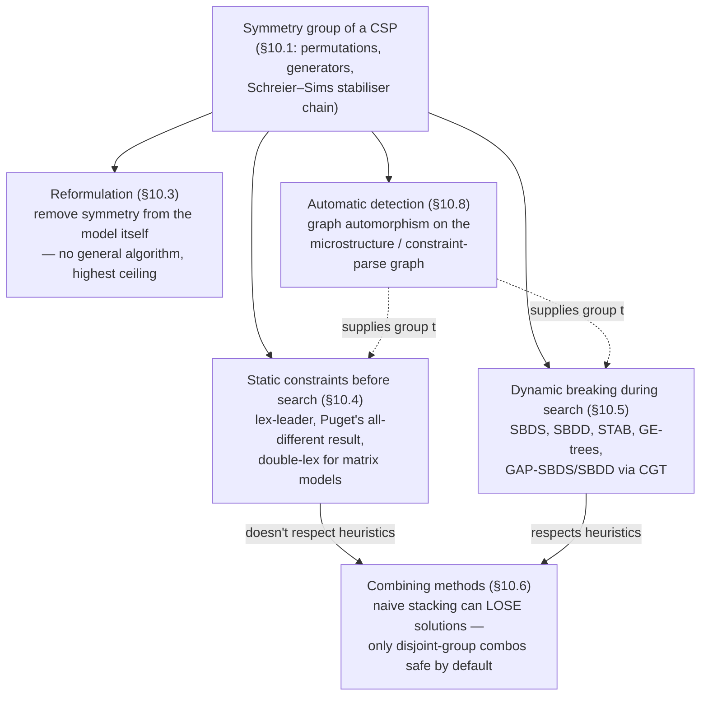

# Symmetry in Constraint Programming

[[book-guidelines|↩ Back to guidelines]]

## Why this chapter exists: search is paying for information it already has

Start from the failure mode, not the theory. Suppose you model the 9-queens-plus-kings
puzzle from the chapter's opening example (Figure 10.1 in the source): 9 queens and one
king of each colour on a chessboard, no piece on the same row/column/diagonal as an
opposing queen. You run [[Backtracking-Search|backtracking search]], and it places a white queen in the top-left
corner. It fails somewhere down that branch and backtracks. Now it tries a white queen in
the top-right corner. This is *wasted work* — rotating the board 90° maps one attempt onto
the other exactly, constraint-for-constraint. If the first attempt fails, the second is
*guaranteed* to fail too, for structurally identical reasons, but a naive solver has no way
to know that and re-derives the failure from scratch. With 16 symmetries on a chessboard
(4 rotations × 2 reflections × 2 colour swaps), you can end up doing up to 16× the necessary
search — and this compounds multiplicatively down the tree, since every node has its own
symmetric siblings.

This is the same phenomenon as *thrashing* from Chapter 2 (repeatedly re-exploring
"the same" failure), except the redundancy here isn't accidental — it's structural,
provably present, and (crucially) *characterizable in advance* as a mathematical object:
a group of permutations. That's the pitch of the whole chapter: once you can name the
symmetry group of your problem, you get to choose from a menu of techniques — reformulate
the problem to kill the symmetry outright, add constraints before search that rule out
all-but-one representative per symmetry class, or teach the search procedure itself to
prune symmetric subtrees as it goes.

Modelling can also *introduce* symmetry that isn't in the original problem: if you
represent 9 indistinguishable queens with 9 separate labelled variables, you've created
$2 \cdot (9!)^2$ symmetric restatements of every solution, purely as an artifact of how you
chose to name things. So symmetry isn't just "a property some problems happen to have" —
it is frequently something *you* create by the act of modelling, and this connects directly
to the modelling material (Chapter 11) this chapter sits next to.

## Where this connects to your compiler/CSP-kernel project

If you're building a CSP kernel to search for counterexamples against refinement-type
invariants (per your stated project), symmetry shows up constantly and for a structural
reason: program invariants routinely quantify over collections of *interchangeable*
entities — array indices, struct fields with the same shape, worker threads, graph nodes
in an unlabelled graph, permutation-invariant arguments to associative/commutative
operators. Every one of those is a source of exactly the kind of symmetry group this
chapter formalizes, and failing to detect/break it means your counterexample search wastes
exponential effort re-deriving isomorphic failures — the CSP-side analogue of a model
checker exploring the same abstract state under $n!$ different but equivalent variable
namings. The group-theoretic vocabulary here (orbit, stabiliser, generators) is also the
right vocabulary for reasoning formally about *when* two search states are "the same
counterexample," which matters if you want proof certificates that don't explode with
spurious near-duplicate models.

---

## 1. Symmetry and Group Theory (§10.1)

### 1.1 From "symmetry" to "permutation," concretely

The chapter's own worked example (a $3\times3$ chessboard, cells labelled $1..9$) is the
cleanest way in. A symmetry — rotate 90°, reflect about a diagonal, etc. — is a rule that
relabels the 9 cells such that constraints are preserved. Concretely, each symmetry *is* a
permutation of the set $\{1,\dots,9\}$: a bijection from the set to itself.

Two equivalent notations for a permutation appear in the text:

- **Cauchy (two-row) form** — top row lists every point, bottom row shows where each maps.
  For $r_{90}$ (90° clockwise rotation): point 1 maps to 7, 2 to 4, 3 to 1, etc.
- **Cyclic form** — the same permutation written as disjoint cycles: $r_{90} = (1\,7\,9\,3)(2\,4\,8\,6)$,
  meaning $1\mapsto 7\mapsto 9\mapsto 3\mapsto 1$ and $2\mapsto 4\mapsto 8\mapsto 6\mapsto 2$
  (point 5, fixed, is omitted). Cyclic form is what GAP (the computational-group-theory
  system referenced throughout the chapter) uses as input syntax, precisely because most
  permutations arising in CP move only a small fraction of the points.

**What breaks without this notation:** without a compact representation, a symmetry group
of even moderate size (a $10\times10$ matrix's row/column symmetry group has $10!\cdot 10!
\approx 1.3\times10^{13}$ elements) is unwritable in Cauchy form and unreasonable about by
hand. Cyclic form (and, at scale, *generators* — see §1.3) is what makes group-theoretic
reasoning about CSPs computationally tractable at all.

**Notation for group action.** If $p$ is a point and $g$ a permutation, $p^g$ denotes the
point $p$ maps to under $g$. This is written as a *right* superscript specifically because
composition then reads left-to-right: $p^{f\circ g} = (p^f)^g$ means "apply $f$ first, then
$g$" — the opposite convention from ordinary function composition $g(f(x))$. This
convention-flip is not cosmetic; it's what makes the chapter's later formulas (e.g. the
SBDS constraint, §5 below) read naturally as "apply the partial symmetry, then check."

```rust
// A permutation over n points, represented directly (no ceremony —
// this is the "array-of-images" analogue of Cauchy form).
#[derive(Clone, PartialEq, Eq)]
struct Permutation {
    // image[i] = i^g, i.e. where point i is sent by this permutation
    image: Vec<usize>,
}

impl Permutation {
    fn identity(n: usize) -> Self {
        Permutation { image: (0..n).collect() }
    }

    fn act_on(&self, point: usize) -> usize {
        self.image[point]
    }

    // f.compose(g) computes f ◦ g: apply f first, then g — matching
    // the book's right-action convention p^(f∘g) = (p^f)^g.
    fn compose(&self, g: &Permutation) -> Permutation {
        let image = self.image.iter().map(|&p_after_f| g.act_on(p_after_f)).collect();
        Permutation { image }
    }

    fn inverse(&self) -> Permutation {
        let mut image = vec![0; self.image.len()];
        for (i, &j) in self.image.iter().enumerate() {
            image[j] = i; // if i -> j under g, then j -> i under g^-1
        }
        Permutation { image }
    }
}
```

### 1.2 The group axioms, and why they're exactly what you need

**Definition 10.5 (Group).** A set $G$ with composition $\circ$ is a group iff: closed
under $\circ$; has an identity $\mathrm{id}$; every element has an inverse; $\circ$ is
associative.

Each axiom earns its place operationally, not just formally:

- **Closure** guarantees that composing two known symmetries of your CSP yields *another*
  symmetry of the same CSP — so you never "fall out" of the structure you're reasoning
  about by combining moves.
- **Inverses** guarantee every symmetry-breaking deduction is reversible in principle —
  which is what lets dominance-checking algorithms (SBDD, §5.2) ask "is this state
  reachable from that one by *some* symmetry" without worrying about direction.
- **Associativity** is what makes "compose along a path in the search tree" well-defined
  regardless of how you bracket the composition — essential once you're chaining many
  partial symmetries incrementally during search, as GAP-SBDS does (§5.4).

Rust's `trait` system happens to be an unusually literal match for a group's algebraic
signature — this is one of the places in the book-topic-article style guide's Rust-first
grounding where the fit is exact, not analogical:

```rust
trait Group {
    type Element: Clone + PartialEq;
    fn identity(&self) -> Self::Element;
    fn compose(&self, a: &Self::Element, b: &Self::Element) -> Self::Element;
    fn inverse(&self, a: &Self::Element) -> Self::Element;
    // Closure isn't checkable at the type level for an arbitrary permutation
    // representation; it's an invariant callers must maintain (e.g. by only ever
    // building elements via `compose` starting from a known-closed generating set).
}
```

### 1.3 Generators: the practical escape from exponential blowup

**Definition 10.8.** A set $S$ *generates* $G$ (written $G = \langle S \rangle$) if every
element of $G$ is a product of elements of $S$, and every such product lands in $G$.

The chapter's chessboard example: $\{r_{90}, d_1\}$ generates all 8 symmetries of the
$3\times3$ board — $r_{180} = r_{90}\circ r_{90}$, $y = d_1 \circ r_{90}$, etc. This is the
single most load-bearing fact in the whole chapter for *implementation* purposes: a group
of order $|G|$ always has a generating set of size $\le \log_2|G|$. A matrix-symmetry group
of size $10!\times10! \approx 1.3\times10^{13}$ can be handed to an algorithm as **two or
three generator permutations**, not $10^{13}$ explicit elements. Every computational-group-
theory-backed method in this chapter (GAP-SBDS, GAP-SBDD, §§5.4–5.5) exists specifically to
exploit this: the user supplies generators, and the machinery (Schreier–Sims, below)
reconstructs whatever it needs about the full group on demand.

```rust
// A group given by generators — this is the representation every
// GAP-backed CP method actually uses; you never materialize |G| elements.
struct GeneratedGroup {
    n_points: usize,
    generators: Vec<Permutation>,
}

impl GeneratedGroup {
    // Naive orbit computation (Schreier's method): BFS from a point,
    // applying each generator, until no new points are reached.
    // This never requires enumerating the whole group.
    fn orbit(&self, start: usize) -> Vec<usize> {
        use std::collections::HashSet;
        let mut seen = HashSet::new();
        let mut frontier = vec![start];
        seen.insert(start);
        while let Some(p) = frontier.pop() {
            for g in &self.generators {
                let q = g.act_on(p);
                if seen.insert(q) {
                    frontier.push(q);
                }
            }
        }
        seen.into_iter().collect()
    }
}
```

### 1.4 Subgroups, cosets, orbits, stabilisers — the vocabulary you'll actually reuse

These four definitions recur throughout the chapter's dynamic methods, so it's worth
pinning each to its *operational* meaning in CP, not just its abstract one:

- **Subgroup** $H \le G$: a subset closed under $G$'s operation. E.g. $\{\mathrm{id},
  r_{90}, r_{180}, r_{270}\}$ (rotations only) is a subgroup of the full 8-element board
  symmetry group.
- **Orbit** of a point $\delta$: $\delta^G = \{\delta^g \mid g \in G\}$ — the set of points
  reachable from $\delta$ by *some* symmetry. In CP terms, if $\delta$ is a variable-value
  pair, its orbit is every variable-value pair that's "equivalent" to it under the problem's
  symmetry.
- **Stabiliser** $G_\beta = \{g \in G \mid \beta^g = \beta\}$: the subgroup of symmetries
  that leave a specific point fixed. This is *the* central concept for dynamic symmetry
  breaking (§5): once you've assigned `var = val` during search, the stabiliser of that
  variable-value pair is exactly "the symmetry that's still available to exploit going
  forward," and everything not in the stabiliser has already been "used up" by the
  assignment.
- **Coset** $H \circ g$: all elements reachable from $H$ by right-multiplying by $g$; cosets
  partition $G$ into equal-size blocks, and this partition is exactly what the Schreier–Sims
  algorithm exploits to represent an astronomically large group compactly (below).

### 1.5 The Schreier–Sims algorithm and the stabiliser chain

This is the piece of computational group theory the chapter treats as foundational, because
essentially every CGT-backed method (§§5.4–5.5) is built on it. Fix an ordering of points
$0, 1, \dots, n$. Define a **stabiliser chain**:

$$G_0 = G, \qquad G_i = \{\sigma \in G_{i-1} \mid 0^\sigma = 0 \wedge \dots \wedge (i-1)^\sigma = i-1\}$$

so $G_n \subseteq G_{n-1} \subseteq \dots \subseteq G_1 \subseteq G_0$: each successive
group fixes one more point than the last. Alongside the chain, Schreier–Sims computes, for
each $i$, the orbit $U_i = i^{G_i}$ — the set of values point $i$ can still be mapped to by
symmetries that already fix $0,\dots,i-1$.

**Why this matters operationally:** during search, once you've assigned variables in order,
the "symmetry remaining" at each step is exactly a term of this stabiliser chain. Instead
of ever materializing $|G|$ (which can be astronomically large — the chapter cites groups
with $10^{36}$ elements handled successfully via GAP-SBDD), the algorithm maintains a
compact factored representation and derives orbits/stabilisers on demand. This is
*algorithmically* the same move as maintaining a factored/lazy representation of a huge
search space rather than enumerating it — the same discipline your CSP kernel needs for
domain propagation over large or infinite domains.

**Lean framing.** If you're used to thinking in terms of `isDefEq` / definitional-equality
checking, the stabiliser chain has a genuinely useful analogy: it's a *normalized
representation of an equivalence relation* (which variable-value pairs are "the same
solution, up to symmetry") that supports efficient membership and quotient queries, much
as a well-behaved definitional-equality checker supports efficient equality queries without
ever enumerating the (extensionally huge, possibly infinite) equivalence class of a term.
Group elements here play the role terms play there; cosets play the role equivalence
classes play there.

### 1.6 Symmetric group $S_n$ and matrix models

$S_n$, the group of *all* permutations of $n$ objects, has order $n!$ and comes up
constantly because CSPs routinely contain $n$ indistinguishable objects. Its most important
compound form in this chapter is the **direct product** $S_m \times S_n$: the symmetry
group of an $m\times n$ matrix of variables where you may freely permute rows (preserving
column structure) *and* independently permute columns (preserving row structure). This
single algebraic object — "matrix model symmetry" — is the running example for the entire
static-constraint section (§4 below), because it is by far the most common source of
symmetry actually encountered when modelling real problems (the chapter's social-golfers
3-D matrix model, BIBD design matrices, etc. all reduce to it).

---

## 2. Solution symmetry vs. problem symmetry (§10.2)

The chapter surveys many competing formal definitions of "symmetry" in the literature
before settling on two working ones — and the *reason* it bothers is practically important,
not pedantic.

**Definition 10.20 (Solution symmetry).** A permutation of variable-value pairs that
preserves the *set of solutions*.

**Definition 10.21 (Problem symmetry).** A permutation of variable-value pairs that
preserves the *set of constraints*.

These are not the same thing, and the gap between them is the gap between "true" symmetry
and "detectable" symmetry:

- Solution symmetry is semantically the "real" notion you care about — two solutions
  really are interchangeable — but **detecting it in general requires solving the CSP
  first** (finding all solutions, then checking which permutations map the solution set to
  itself). This is intractable in general [Puget; Ramani & Markov results cited in the
  chapter].
- Problem symmetry is checkable from the *syntax* of the constraints, without solving
  anything — but it's model-dependent. Two logically equivalent CSPs, differing only in
  how their constraints happen to be written down, can have different problem symmetries.
  It's entirely possible to write a CSP so that real symmetry in the underlying problem is
  syntactically hidden.

**What breaks without this distinction:** if you conflate the two, you either (a) try to
detect solution symmetry directly and hit an intractable problem, or (b) assume every
syntactic problem symmetry is "the whole story" and miss cases where remodelling could
reveal — or eliminate — more symmetry than your current formulation exposes. Every method
in the rest of the chapter is implicitly a bet about which side of this gap it's playing on:
reformulation (§3) works at the modelling level precisely because problem symmetry is a
choice, not a given; lex-leader and dynamic methods (§§4–5) work with an externally-
*supplied* symmetry group (generators the user identifies), sidestepping the detection
problem entirely by pushing it onto the human (or, per §8, onto automated
detection-by-graph-automorphism, itself intractable in the worst case since it's in the
complexity class of graph isomorphism).

A useful special case worth naming explicitly: **Freuder's interchangeability**
(Definitions 10.18–10.19) is solution symmetry restricted to acting on values of a *single*
variable — two values $a,b$ for variable $v$ are fully interchangeable iff swapping them in
any solution yields another solution. *Neighbourhood* interchangeability weakens this to a
locally-checkable (constraint-by-constraint) condition, trading completeness for
tractability — exactly the same intractable-global/tractable-local tradeoff that recurs
between solution symmetry and problem symmetry above.

---

## 3. Reformulation to Remove Symmetry (§10.3)

### 3.1 The core move: change the model, not the search

Reformulation is philosophically the most attractive of the three approaches, because it
doesn't add machinery to search at all — it removes symmetry from the problem before search
ever starts. But (the chapter is candid about this) it has **no general algorithm**: it's
craft, driven by insight into a specific problem's structure, not a procedure you can hand
to a compiler. Three worked examples show the range of what "insight" can buy:

**Social golfers (CSPLib #10).** 32 golfers, 8 groups of 4, 10 weeks, no pair repeats. The
obvious variable-per-golfer-per-week model has $32!\,10!\,8!\,10^4\,4!^{80}$ symmetries
(permute golfers, weeks, groups-within-a-week, players-within-a-group). Remodelling around
*pairs* — one variable per pair of golfers, recording which week (if any) they meet —
collapses this to just $32!\,10!$ (golfer and week symmetry only): still huge, but a
qualitative simplification, because the group-within-week and player-within-group
symmetries are structurally eliminated rather than merely broken by extra constraints.

**All-interval series (CSPLib #7).** Find a permutation of $0..n-1$ so consecutive
differences are also a permutation of $1..n-1$. The naive model has 4 symmetries (identity,
reversal, negation, both). Gent et al.'s reformulation observes that a solution can be
*cyclically pivoted* around any point where the wraparound difference duplicates an
existing one — this isn't a re-expression of the same problem, it's a genuinely *different*
problem whose solutions map (8-to-1, for $n>4$) onto solutions of the original, but which
itself has **zero symmetry**. Search on the reformulated problem runs about 50× faster.
This is the strongest possible outcome of reformulation and also the rarest — it required
real problem-specific insight, not a mechanical transformation.

**Set variables.** When you have $n$ genuinely indistinguishable objects (e.g. golfers
within an unordered group), encode them as a *set*-typed decision variable rather than $n$
separately-labelled integer variables. Since sets carry no implicit element ordering, this
eliminates the $S_n$ symmetry among those elements *by construction* — the solver never
even represents the redundant orderings. This trades off against propagation strength
(different set-variable representations propagate very differently) and complicates
"channelling" back to integer variables if you need element-level constraints too.

```python
# Illustrative sketch (Python, per the tertiary-grounding guidance):
# n indistinguishable "slots" filled from a pool, WITHOUT an artificial
# ordering baked into the representation.

# Symmetric encoding — n! spurious symmetries among worker[0..n-1]:
workers = [IntVar(domain=pool) for _ in range(n)]
model.add_all_different(workers)

# Set-typed encoding — the S_n symmetry among the n slots simply
# doesn't exist in this representation, because a set has no order:
chosen: SetVar = SetVar(universe=pool, cardinality=n)
```

**Viewpoint duality.** The same underlying problem, viewed as "find a value for each
variable" vs. "find a variable for each value," swaps which symmetries look like variable
symmetries and which look like value symmetries. Since the chapter's static-constraint
toolkit (§4) is fundamentally stronger for *variable* symmetry (lex-leader, and especially
Puget's all-different result, are defined only for variable symmetries — see §4.3), a
problem with awkward *value* symmetry in its natural viewpoint can sometimes be attacked by
switching viewpoints so the awkward symmetry becomes a variable symmetry instead. Prestwich's
"maximality encoding" pushes this idea to full automation for one specific class: it
translates a CSP into SAT such that all *dynamic-substitutability* value symmetries (a
generalization of Freuder interchangeability) are eliminated by the encoding itself, with
**no symmetry detection step required at all** — the strongest possible form of "the tool
does it for you," at the cost of only covering that one symmetry class.

**[[Applications-Configuration-Networks-and-Bioinformatics#Where this leads|Where this leads]]:** reformulation is the technique with the highest ceiling (it can
eliminate symmetry entirely, cost-free at search time) and the lowest floor (no general
recipe — the chapter is explicit that this remains "a black art" it hopes will one day
become a science). For your CSP-kernel project, the practical takeaway is that automatic
symmetry *detection* (§8 below) and automatic *reformulation* are separate, harder problems
than symmetry *breaking given a known group* — most of the chapter's rigor lives in the
latter.

---

## 4. Symmetry-Breaking Constraints Added Before Search (§10.4)

### 4.1 The lex-leader method: picking one canonical representative per class

The idea, stripped to its essence: fix a static ordering of the variables. This turns any
full assignment into a tuple (the values, listed in variable order). Any group element $g$
permutes this tuple into another one; declare the assignment "canonical" only if its tuple
is the lexicographically-*smallest* among all its symmetric images. Add constraints
enforcing exactly that:

$$\forall g \in G,\quad V \preceq_{\mathrm{lex}} V^g \tag{10.1}$$

where $V$ is the vector of problem variables and $\preceq_{\mathrm{lex}}$ is ordinary
lexicographic order. This is sound (never bans an entire equivalence class — the canonical
representative always survives) and, when applied for *every* $g \in G$, complete (leaves
*exactly* one solution per equivalence class).

**What breaks without picking a canonical representative up front:** if you instead pick
*some* solution from each class implicitly (e.g. "whichever one search happens to find
first"), you have no static way to add pruning constraints before search — you're forced
into a dynamic method (§5). Lex-leader's whole value proposition is moving the cost from
search-time bookkeeping to a one-time constraint-generation step.

**Two costs, both serious:**

1. **Doesn't respect search heuristics.** The lex-leader constraint is defined relative to
   a *fixed* variable ordering and value direction. If the actual search heuristic departs
   from that (e.g. dynamic variable ordering, or trying large values first), the leftmost
   branch search would otherwise explore first may not be canonical — so it gets pruned,
   and search has to backtrack to find the (differently-located) canonical solution. This
   can cause dramatic slowdowns on adversarial heuristic/constraint mismatches. Contrast
   this explicitly with SBDS/SBDD (§5), which are constructed precisely to avoid this
   failure mode.
2. **Exponentially many constraints in general.** One lex constraint *per group element* —
   for an $m\times n$ matrix's full row/column symmetry, that's $m!\,n!$ constraints. This
   is the central practical obstruction the rest of §4 works around.

**Simplification.** Many lex-leader constraints turn out to be redundant or reducible once
you exploit shared prefixes and transitivity (Figures 10.5–10.7 in the source walk a
$3\times2$ matrix example down from 12 constraints to 8). But this pruning does *not* solve
the exponential-blowup problem in general — the reduced set can still be exponential.

**Restriction to variable symmetries.** Lex-leader as defined only handles symmetries that
permute *variables*, leaving values fixed. Handling value symmetries this way would (in the
worst case) require $d!$ duplicated copies of each variable for a $d$-value domain — usually
impractical. A general lex-leader treatment of value symmetry remains (per the chapter) an
open direction.

```rust
// The core lex-leader idea, directly executable: given a symmetry group
// (as generators) and a variable ordering, generate one lex constraint
// per group element (feasible only for small/enumerable groups —
// this is exactly the blow-up problem discussed above).
fn lex_leader_constraints(vars: &[VarId], group_elements: &[Permutation])
    -> Vec<LexConstraint>
{
    group_elements.iter().filter(|g| !g.is_identity()).map(|g| {
        let permuted: Vec<VarId> = vars.iter().map(|&v| g.act_on(v)).collect();
        LexConstraint::leq(vars.to_vec(), permuted) // V ⪯_lex V^g
    }).collect()
}
```

### 4.2 Puget's all-different result: from $n!$ down to $n-1$

This is the chapter's sharpest theoretical payoff, and it's worth walking through the
mechanism, not just the headline result.

**Setup.** Suppose the CSP's variables $V$ are subject to an `all-different` constraint, and
$G$ is *any* variable-symmetry group acting on $V$ (not necessarily $S_n$ — the chapter's
graceful-graph example has a group isomorphic to $S_3\times S_2$, order 12, not $12!$).

**Key simplification.** For a permutation $g$, let $s(g)$ be the smallest index moved by
$g$ (i.e. the first point where $g$ differs from identity), and $t(g) = s(g)^g$ (where that
point gets mapped to). Because all variables are pairwise different, most of a lex-leader
constraint for $g$ collapses trivially: positions before $s(g)$ are literally equal on both
sides (since $g$ fixes them), and *because* of all-different, the two values at position
$s(g)$ can never be equal — so the disjunction "either strictly less, or equal and check the
next position" collapses to a strict inequality:

**Lemma 10.23.** All variable symmetries in $G$ can be broken by the constraints
$$\forall \sigma \in G,\quad v_{s(\sigma)} < v_{t(\sigma)}$$

Two different $\sigma, \tau$ with the same $(s,t)$ pair give the *same* constraint, so you
only need one constraint per distinct $(s(\sigma), t(\sigma))$ pair — and the Schreier-Sims
algorithm's stabiliser chain (§1.5) computes exactly this set of pairs.

**Theorem 10.24.** Under these conditions, all variable symmetries can be broken by **at
most $n - 1$ binary constraints** — regardless of $|G|$, which may be as large as $n!$.

This is a genuinely striking compression, and understanding *why* it doesn't generalize is
as instructive as the result itself:

- **It relies on all-different specifically.** The collapse "equal at position $s(g)$ is
  impossible" only holds because the constraint forbids equal values at those two
  positions. Without all-different, the lex disjunction doesn't collapse, and you're back
  to the general (exponential) lex-leader case.
- **It's a variable-symmetry-only result.** Lex-leader itself is only defined for variable
  symmetries (§4.1); this refinement inherits that restriction and doesn't extend to value
  symmetries.

**For your project:** this is the sharpest illustration in the chapter of a recurring theme
— *combining* a symmetry-breaking technique with problem-specific structure (here,
all-different) can produce results unreachable by either alone. The analogous move in
verification-condition generation would be: don't treat "the invariant is symmetric under
permutation" and "these values must be pairwise distinct" as two independent facts to
search over — their *conjunction* can collapse an exponential disjunction into a linear one,
exactly as here.

### 4.3 Matrix models: double-lex and friends

Because row/column-symmetric matrices ($S_m \times S_n$, §1.6) are so common, the chapter
covers specialized machinery for them separately from generic lex-leader.

**Double-lex.** Require rows lexicographically increasing *and* columns lexicographically
increasing, simultaneously. This is non-trivially consistent (you *can* remove solutions by
requiring rows increasing and columns *decreasing* — the choice of direction matters), but
requiring both increasing is always safe, because it corresponds to a genuine subset of the
full lex-leader constraint set. Crucially, double-lex does **not** break all row/column
symmetry — finding the true lexicographically-least representative under simultaneous
row+column permutation is NP-hard — but it breaks a useful amount cheaply, and (this is the
practically decisive point) an optimal $O(nb)$ generalized-arc-consistency propagator exists
for the `lex` constraint between two vectors (where $b$ is the cost of a single bound
update), extending to $O(nbm)$ for a chain of $m$ vectors. This puts double-lex at an
unusually good point on the strength/cost tradeoff curve: cheap to propagate, breaks a lot
in practice, even though it's incomplete in the worst case.

**Multiset ordering and `allperm`.** Alternative orderings developed for cases where full
lex ordering is either too weak or interacts badly with other symmetries the matrix has
(e.g. multiset ordering can be placed on rows without constraining column symmetry at all,
useful when column symmetry isn't a clean $S_n$). Figure 10.9 in the source gives a sharp
warning example: a $2n\times2n$ matrix can be fully double-lex-ordered on rows and columns
and *still* retain complete, unbroken $S_n$ symmetry on an $n\times n$ submatrix — double-lex
is a genuinely partial technique, not a silent complete one, and treating it as complete
would be a real correctness bug.

```rust
// A GAC propagator sketch for V1 ⪯_lex V2 in the spirit of Frisch et al.'s
// O(n·b) algorithm: find the first position where the vectors could differ,
// and propagate bound tightenings from there. (This is a simplification —
// the real algorithm is more careful about partial assignment and support.)
fn propagate_lex_leq(v1: &mut [Domain], v2: &mut [Domain]) -> PropagationResult {
    for i in 0..v1.len() {
        match (v1[i].singleton_value(), v2[i].singleton_value()) {
            (Some(a), Some(b)) if a < b => return PropagationResult::Entailed,
            (Some(a), Some(b)) if a > b => return PropagationResult::Failure,
            (Some(a), Some(b)) if a == b => continue, // must compare position i+1
            _ => {
                // Positions not yet both fixed: tighten bounds so that
                // v1[i] <= v2[i] remains satisfiable, then stop —
                // later positions are irrelevant unless this one ties.
                tighten_leq(&mut v1[i], &mut v2[i]);
                return PropagationResult::Fixpoint;
            }
        }
    }
    PropagationResult::Entailed
}
```

---

## 5. Dynamic Symmetry Breaking During Search (§10.5)

Static constraints (§4) pay a fixed cost up front but conflict with search heuristics.
Dynamic methods flip this: they interleave symmetry-breaking decisions *with* search
itself, at the cost of per-node bookkeeping, in exchange for **respecting whatever variable/
value ordering heuristic search is using** — the canonical solution found in each
equivalence class is always the one search's own heuristics would find first anyway.

### 5.1 SBDS — Symmetry Breaking During Search

**Core idea.** When search assigns `var = val` and later *backtracks* from that decision
(i.e., commits to `var ≠ val`), post not just that negation but its image under every
symmetry $g$ still known to hold: $(var \ne val)^g$. This directly forbids ever re-exploring
the symmetric mirror of the subtree just abandoned.

**The subtlety that makes this non-trivial** is exactly the case the chapter's 8-queens
walkthrough (Figure 10.10) is built to expose: once earlier decisions have partially broken
some symmetries (e.g. $Q_1=2$ already rules out $x, y, d_1, d_2$ because those symmetries'
images collide with already-forbidden squares), you must **not** unconditionally add
$(Q_2 \ne 4)^{r_{90}}$ — you don't yet know whether $r_{90}$ still holds at this node. The
general SBDS constraint handles this conditionally:

$$A \wedge A^g \wedge (var \ne val) \Rightarrow (var \ne val)^g \tag{10.2}$$

read as: *if* the partial assignment $A$ and its image under $g$ are both still consistent
(i.e., $g$'s validity as a symmetry of the still-live subtree hasn't been ruled out), *then*
the negation propagates through $g$ too. At the actual point of backtracking (where $A$ and
$var \ne val$ are already known true), this simplifies to the form actually implemented:

$$A^g \Rightarrow (var \ne val)^g \tag{10.3}$$

**Soundness and completeness** (Backofen & Will): SBDS never removes a genuine solution
(soundness — the full symmetry-reduced search space is still explored), and if *all*
symmetries are correctly supplied, no two returned solutions are symmetric duplicates
(completeness). Both properties hinge on faithfully supplying the *entire* group (or a
correct generating description of it) — supplying a wrong or incomplete symmetry set
silently breaks completeness without any error signal, a sharp footgun worth flagging for
anyone implementing this.

**Cost model, made incremental.** Naively, checking whether $A^g$ still holds requires
comparing the *entire* current partial assignment against its image — expensive if redone
from scratch at every node. But because $A_1 = A + (var{=}val)$ implies $A_1^g = A^g +
(var{=}val)^g$, a single boolean flag per symmetry (initially true, and-ed with each new
decision's image-consistency as search descends) tracks "does $g$ still hold here"
incrementally — once it flips false, $g$ is permanently dead on this branch and can be
dropped from further consideration.

```rust
// SBDS bookkeeping sketch: one boolean flag per symmetry generator,
// updated incrementally as decisions are made — never re-deriving A^g
// from scratch, per the chapter's incrementality argument.
struct SbdsState {
    symmetries: Vec<Permutation>,
    still_holds: Vec<bool>, // still_holds[i] tracks whether symmetries[i] applies to A
}

impl SbdsState {
    // Call when search commits to `var = val`.
    fn on_assign(&mut self, var: VarId, val: Value, model: &mut CspModel) {
        for (i, g) in self.symmetries.iter().enumerate() {
            if !self.still_holds[i] { continue; } // already dead on this branch
            let (gvar, gval) = g.act_on_pair(var, val);
            // A^g is still consistent only if (var=val)^g is consistent too
            self.still_holds[i] = model.is_consistent_with(gvar, gval);
        }
    }

    // Call when search backtracks from `var = val` (posts var != val).
    fn on_backtrack(&self, var: VarId, val: Value, model: &mut CspModel) {
        for (i, g) in self.symmetries.iter().enumerate() {
            if self.still_holds[i] {
                let (gvar, gval) = g.act_on_pair(var, val);
                model.post_not_equal(gvar, gval); // (var != val)^g
            }
        }
    }
}
```

**SBDS's central advantage over lex-leader** is that it *respects* the search heuristic:
whatever variable/value order search naturally uses, SBDS finds the leftmost (heuristically
first) solution in each equivalence class, because it only forbids what has *actually* been
explored and abandoned. Its main practical limit is that every symmetry needs an explicit
function implementing its action — infeasible by hand once you're past a few thousand
symmetries, motivating GAP-SBDS (§5.4).

### 5.2 SBDD — Symmetry Breaking via Dominance Detection

Where SBDS *posts constraints* to prevent revisiting symmetric states, SBDD instead
*checks*, at each new node, whether that node is symmetric to something already fully
explored, and prunes if so — no constraints added to the model at all.

**The space problem, and its resolution.** Storing every fully-explored node would be
exponential. The key insight: you only need to remember the *roots* of fully-explored
subtrees — call these **no-goods** (Definition 10.25: a node $\nu$ is a no-good w.r.t. $n$
if some ancestor of $n$ has $\nu$ as its left child, with $\nu$ not itself an ancestor of
$n$ — i.e., $\nu$'s whole subtree was finished before search moved on). A new node $n$ is
**dominated** (Definition 10.26) if some no-good $\nu$ and some symmetry $g$ satisfy
$\delta(\nu)^g \subseteq \Delta(n)$ — the *decisions* that led to $\nu$, mapped through $g$,
are already implied by the *current state* at $n$. If dominated, $n$'s entire subtree
(including any solutions in it) is symmetric to something already handled, so it's pruned
outright.

The worked example (Figure 10.11): variables $v_1,v_2,v_3$, all-different, domain
$\{1,2,3,4\}$, all values freely permutable ($S_4$ acting on values). Node 3 (a completed
no-good with decisions $\{v_1{=}1, v_2{=}2, v_3{=}3\}$) dominates node 7 (state $\{v_1{=}1,
v_3{=}2, v_2{=}3\}$) via the symmetry swapping $v_2 \leftrightarrow v_3$: $\delta(3)^g =
\{v_1{=}1, v_3{=}2\} \subseteq \Delta(7)$. Node 7's whole subtree, including its solution,
gets pruned — that solution is a symmetric duplicate of node 3's.

**The real cost.** For each candidate $(\nu, n)$ pair, finding *some* $g$ that witnesses
dominance is a sub-graph-isomorphism problem — NP-complete in general. SBDD's complexity
therefore doesn't disappear; it moves from "space to store the tree" to "time to search for
a witnessing $g$ at every node." Three implementation strategies the chapter surveys: (1)
hand-write a problem-specific dominance checker $\Phi$ (efficient but bespoke, doesn't
generalize); (2) encode dominance-checking itself as a constraint problem (interesting
because it's literally "use CP to do computational group theory," but still needs a fresh
encoding per problem class); (3) delegate to actual computational-group-theory machinery —
GAP-SBDD (§5.5).

**A useful refinement:** a *failed* dominance check sometimes reveals that assigning a
*specific* value would immediately re-trigger dominance — that value can be pruned from the
domain directly and propagated on, turning a pure pruning check into a source of extra
filtering.

**SBDD vs. SBDS**, per Harvey's analysis: they enforce the *same* set of surviving
solutions and are, in a formal sense, interchangeable implementations of the same idea —
SBDS forbids symmetric nodes proactively via constraints before they're reached; SBDD
detects them reactively once reached. In practice they differ enormously: SBDD avoids the
overhead of posting and propagating large numbers of constraints, which lets it scale to
symmetry groups too large for SBDS's per-symmetry-function approach to handle at all — at
the cost of NP-complete per-node dominance checks that SBDS's incremental flag-tracking
avoids.

### 5.3 STAB — Symmetry Breaking Using Stabilizers

A cheaper, deliberately incomplete middle ground. Instead of breaking the *whole* group $G$
at every node (SBDS) or checking dominance against the whole group (SBDD), STAB only posts
lex-ordering constraints for the **stabiliser** $G_A$ of the current partial assignment $A$
— the symmetries that leave $A$ itself unchanged (recall §1.4: this is precisely what
"symmetry still available going forward" means).

$$V \preceq_{\mathrm{lex}} V^g,\quad \forall g \in G_A$$

Since $G_A$ is typically far smaller than $G$, this is cheap — and, because the first
$|A|$ positions of $V$ and $V^g$ agree trivially for $g \in G_A$ (by definition of
stabilising $A$), the constraint reduces to comparing only the *unassigned tail*:
$\mathrm{tail}(V, n-d) \preceq_{\mathrm{lex}} \mathrm{tail}(V,n-d)^g$. The chapter is explicit
that STAB is **incomplete** — it does not guarantee exactly one solution per equivalence
class — which is the price paid for its cheapness; §6 covers how it's combined with SBDD to
recover a favorable strength/cost balance.

### 5.4 GAP-SBDS and GAP-SBDD — scaling via computational group theory

Both SBDS and SBDD, as described, demand a per-symmetry (SBDS) or per-problem-class (SBDD)
hand-written function from the programmer — infeasible once the symmetry group has more
than a few thousand elements to enumerate or reason about directly.

**GAP-SBDS** restructures Equation 10.2/10.3 so that computing $g(A)$ — finding, for the
current partial assignment, which symmetries still apply — is delegated to GAP's stabiliser-
chain machinery (a right-transversal chain, built incrementally as a Cartesian product of
per-level coset representatives) rather than iterated over explicitly. It uses *lazy*
evaluation: the symmetry-breaking constraint $g(var \ne val)$ is only actually imposed once
$g(A)$ is confirmed true, rather than posting the fully general conditional form eagerly.
This trades a bit of pruning timeliness (GAP-SBDS may break symmetry slightly later than
hand-written SBDS, since it isn't proactively conditional) for the ability to handle group
sizes from the thousands up into the **billions**, limited in practice mainly by the space
cost of the constraints still being posted.

**GAP-SBDD** replaces the hand-written dominance checker with a generic one, backed by GAP,
that operates on two evolving sets: a `failSet` (points from completed-subtree no-goods) and
a `pointSet` (points fixed so far on the current branch, via assignment or propagation). The
dominance check — does some $g \in G$ and some no-good $s \in \text{failSet}$ satisfy
$s^g \subseteq \text{pointSet}$? — is implemented as a structured backtracking search inside
GAP over the stabiliser chain, heavily optimized relative to a naive graph-isomorphism
search. This has been used successfully on groups with $10^{36}$ elements — far beyond what
any hand-enumerated approach could touch — though the underlying dominance check remains
NP-complete in the worst case, and the chapter notes real robustness concerns (heuristic
choice can cause dramatic, hard-to-predict swings in per-node dominance-check cost).

**The throughline for both:** computational group theory turns "supply a generating set,
get correct symmetry-breaking for free" into a realistic engineering pattern, at the cost of
delegating hard subproblems (stabiliser-chain construction, dominance search) to a
general-purpose but not always predictable external solver. This is a genuinely useful
architectural pattern to keep in mind for your own CSP kernel: rather than hand-rolling
symmetry-specific reasoning per problem class, an embedded lightweight CGT layer (even a
much simpler one than full GAP) could give you the same "supply generators, get correctness"
deal for the collection-typed, permutation-symmetric refinement-type domains your project
targets.

### 5.5 GE-trees: a unifying lens, not a new method

A **GE-tree** ("Group-Equivalence tree") is defined purely by two properties: no two nodes
in it are symmetrically equivalent, and every solution has *some* symmetrically-equivalent
node represented in the tree. This is a *conceptual* framework — SBDS, SBDD, and (a complete)
lex-leader can all be seen as different concrete methods for constructing a valid GE-tree.
Its practical payoff is that it licenses genuinely new *special-purpose* algorithms: Roney-
Dougal et al. used the GE-tree framing to build a polynomial-time algorithm specifically for
breaking arbitrary *value* symmetry (a case where GAP-SBDD's general but exponential-worst-
case dominance search is needlessly expensive), and showed it strictly dominates GAP-SBDD
empirically on that restricted case — a clean illustration that a framework's value can lie
in clarifying *when a cheaper special-purpose algorithm is actually correct*, not just in
unifying existing ones after the fact.

---

## 6. Combining Symmetry-Breaking Methods (§10.6) — a genuine correctness trap

Naively stacking two independently-sound symmetry-breaking methods is **not** safe in
general, and this is one of the sharpest "what breaks" lessons in the chapter. The
intuition that fails: "each method individually preserves at least one solution per
equivalence class, so combining them just intersects two safe constraint sets, which must
still be safe." This is false because the two methods can pick *different* representative
solutions from the same equivalence class — method A's chosen representative may be exactly
the one method B independently rules out, and vice versa, so the intersection of "solutions
each method allows" can be **empty** for some classes. Smith demonstrated this concretely
for combining lex-based row/column ordering with SBDD.

Two situations are provably safe, both because the interacting groups act on genuinely
disjoint structure:

- **Variable-symmetry breaking + value-symmetry breaking**, when applied to disjoint
  symmetry groups (one only permutes variables, the other only permutes values), can be
  combined safely — since neither method's canonical-representative choice interferes with
  the other's action. Puget's all-different result (§4.2) combined with GE-tree value-
  symmetry breaking (§5.5) is the chapter's example.
- **STAB + SBDD** combine successfully in practice (Puget), because STAB's incompleteness
  (§5.3) is specifically compensated by SBDD's dominance checking rather than colliding
  with it.

Petrie's combination of GAP-SBDS and GAP-SBDD (switching between them at different search
depths) makes a distinct, important point: since neither method dominates the other
universally, a *hybrid* schedule (one method for the top of the tree, the other below some
depth) can be **more robust** than either alone — never worse than the worse of the two —
even when it isn't always better than the best of the two. This "robustness via hybrid
scheduling" pattern generalizes well beyond symmetry breaking, and is worth keeping in mind
as a general CP-engineering heuristic.

---

## 7. Automatic Detection (§10.8, briefly)

Every method above assumes the symmetry group (or a generating set) is *supplied* —
typically by a human who inspected the problem. Two directions relax this: (1) tooling that
makes it *easier* to describe symmetries (e.g. "these rows are interchangeable" translated
automatically into generators, rather than requiring the user to think in group-theoretic
terms at all), and (2) fully automatic detection via graph automorphism — building a
**microstructure graph** (or, in Puget's refinement, a graph over the intensional/parse-tree
representation of constraints, closely paralleling Ramani & Markov's later constraint-parse-
tree automorphism approach) whose automorphism group *is* the problem's symmetry group.
This is honest about its own ceiling: graph automorphism is not known to be polynomial-time
in general (it sits in the same complexity neighborhood as graph isomorphism), so detection
doesn't scale unconditionally — but it has been shown to work efficiently in practice on a
useful range of real problems, echoing the same "worst-case hard, practically tractable"
character seen throughout constraint propagation (Chapter 3) and much of complexity-aware
CP more broadly.

---

## Where this leads



Within the handbook, this chapter sits directly upstream of **Chapter 11 (Modelling)**,
which folds symmetry-and-modelling back into the broader question of viewpoint choice —
Chapter 11's §10 ("Symmetry and Modelling") is explicitly a continuation of the reformulation
material here, and the two chapters were clearly written to be read together (Smith, the
Modelling chapter's author, is cited repeatedly in this chapter for the social-golfers
reformulation). It also depends on and extends Chapter 2's notion of *thrashing* (redundant
re-exploration of failing subtrees) — symmetry is the special case of thrashing that is
*provably characterizable in advance* as a group action, rather than an accidental property
of a particular search order.

For the standing project: the group-theoretic vocabulary here — orbits, stabilisers,
generators, stabiliser chains — is directly reusable for reasoning about when two
counterexample candidates found by your CSP kernel represent "the same" violation of a
refinement-type invariant, and Puget's all-different result (§4.2) is a concrete template
for how *combining* a symmetry fact with a domain-specific structural constraint (there,
all-different; in your setting, perhaps a well-formedness or distinctness invariant over
program identifiers) can collapse a search space by orders of magnitude rather than merely
by a constant factor. The SBDS/SBDD contrast — post-constraints-proactively vs.
check-dominance-reactively — is also a useful design fork to keep explicit when you get to
implementing symmetry-aware pruning in your own kernel: it's the same tradeoff between
building extra propagators versus building an extra oracle-style check, that recurs all
over constraint-solver architecture.
