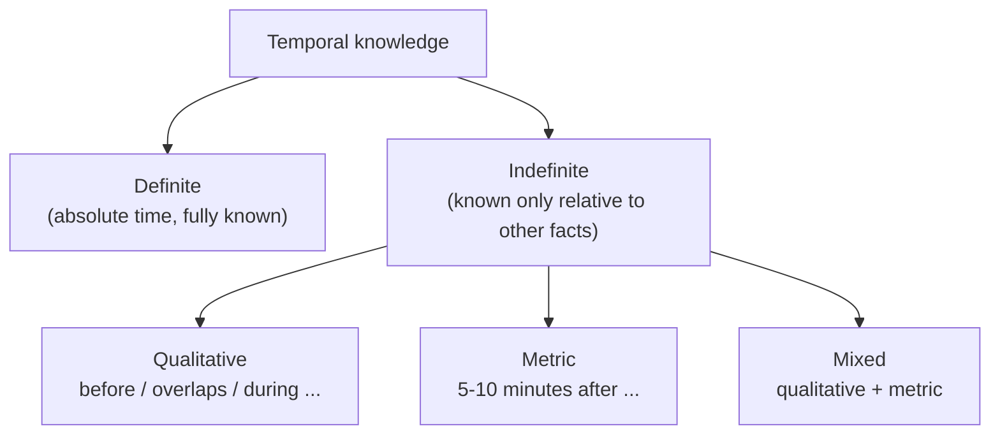
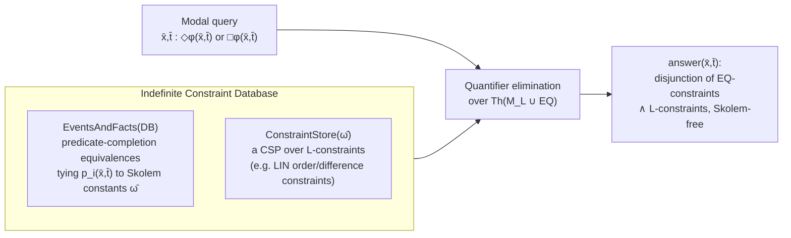

# Temporal Constraint Satisfaction

[[book-guidelines|↩ Back to guidelines]]

## Why time needs its own CSP theory

A generic CSP solver doesn't know anything about time. If you hand it "meeting A is before meeting B" and "meeting B overlaps meeting C," it just sees two constraints over two opaque variables. But temporal facts have structure a general solver throws away: they compose (if A is before B and B is before C, you can *derive* something about A and C without search), they come in a handful of recurring shapes (points, intervals, durations), and in real applications — planning, scheduling, natural-language event extraction — the constraint stores are enormous. A solver that treats "before" as just another unary/binary predicate over a finite domain is leaving all of that structure, and the polynomial-time algorithms it buys you, on the table.

The chapter's first move is to fix what "time" even *is* for the purposes of a CSP. It commits to a **time-based approach**: time is an explicit ordered set of points (usually $\mathbb{Q}$ or $\mathbb{Z}$), intervals are pairs $(x,y)$ with $x<y$, and change is just "a proposition holds at some point/interval of this set." This is opposed to *change-based* approaches (situation calculus, event calculus), where you reason about state transitions instead of a time line. Once you've bought into a time line, the reasoning problems are the classic ones CSP theory already gives you a vocabulary for:

- **Consistency**: is a set of constraints satisfiable?
- **Solution finding**: find one (or all) satisfying assignments.
- **Minimal network**: compute the tightest set of constraints equivalent to the given one — this makes *implied* relationships explicit (e.g., "meeting A is strictly before meeting C," even though only $A$–$B$ and $B$–$C$ were stated).
- **$i$-consistency / strong $i$-consistency / global consistency**: the standard local-consistency ladder, restated for temporal networks.

What's distinctive about the temporal case is a second axis orthogonal to all of this: **definite vs. indefinite information**. Definite information pins a fact to an absolute time ("the car was serviced on March 25, 1993"). Indefinite information relates a fact's time to *another* fact's time, and the relationship can itself be qualitative ("the explosion happened after John left"), metric ("5–10 minutes after"), or a mix of both. Almost the entire chapter is organized around designing constraint languages expressive enough to capture indefinite information at each of these three granularities, while keeping the associated CSPs as tractable as possible.



## Qualitative temporal reasoning: Allen's Interval Algebra and its descendants

### Interval Algebra (IA)

Allen's 1983 formalism is the ancestor of everything qualitative in this chapter. An interval $i = (i^-, i^+)$ has two endpoints, $i^- < i^+$. Two intervals can relate in exactly **13 mutually exclusive ways**: $before, meets, overlaps, during, starts, finishes, equals$, plus the inverses of the first six ($equals$ is self-inverse). Each is defined purely in terms of endpoint inequalities — e.g. $i\ meets\ j$ means $i^- < j^-,\ i^- < j^+,\ i^+ = j^-,\ i^+ < j^+$.

The genuinely important move is what happens when you don't know exactly which of the 13 holds: you represent your ignorance as a **disjunction** of some subset of the 13 basic relations. There are $2^{13}$ such disjunctive relations; the set of all of them, $\mathcal{IA}$, forms an algebra under three operations:

$$(\forall x,y)(x\ r^{-1}\ y \iff y\ r\ x)$$
$$(\forall x,y)(x\ (r\cap r')\ y \iff x\ r\ y \wedge x\ r'\ y)$$
$$(\forall x,y)(x\ (r\circ r')\ y \iff (\exists z)(x\ r\ z \wedge z\ r'\ y))$$

Composition $\circ$ is the one that matters computationally: given $A\ r_1\ B$ and $B\ r_2\ C$, you can look up (via a precomputed composition table) what disjunction of relations must hold between $A$ and $C$. This is exactly **path consistency**, and Allen's original algorithm runs it to fixpoint in $O(n^3)$. The catch, discovered later by Vilain and Kautz: path consistency is *not complete* for $\mathcal{IA}$ — deciding consistency of a set of $\mathcal{IA}$ constraints is **NP-complete**, and so is computing the minimal network. Path consistency prunes, but it can leave a network that looks locally consistent while being globally unsatisfiable.

### Point Algebra (PA) and the tractability frontier

Vilain and Kautz's response was to restrict to **points**, related only by $<, >, =$ (and their disjunctions) — the **Point Algebra** $\mathcal{PA}$. They further identify the **pointisable subclass** $\mathcal{PIA} \subset \mathcal{IA}$: every element of $\mathcal{IA}$ expressible as a conjunction of endpoint constraints drawn purely from $\mathcal{PA}$. Path consistency computes the minimal network for $\mathcal{PA}$ — but (Van Beek's correction) only once you drop $\neq$, giving the **convex point algebra** $\mathcal{CPA}$. With $\neq$ back in, you need **strong 5-consistency** to get global consistency (Koubarakis).

This launched a genuine research program in finding maximal tractable fragments of $\mathcal{IA}$:

- **Ord-Horn** $\mathcal{H}$ (Nebel–Bürckert): the largest known tractable subclass, 868 of the $2^{13}$ relations (>10%), expressible as Horn constraints on endpoints (a disjunction with at most one inequality $x\le y$, the rest disequations $x\neq y$). It's *maximal* — you cannot add a single relation without losing tractability.
- **The dichotomy theorem** (Krokhin–Jeavons–Jonsson): there are *exactly* 18 maximal tractable subclasses of $\mathcal{IA}$; everything outside them is NP-complete. This is a complete classification, proved analytically (earlier work had relied on brute-force computer search) — the kind of clean tractability boundary that shows up again and again in this handbook (cf. Chapter 8's structural tractability results).
- **Qualitative Algebra** $\mathcal{QA}$ (Meiri): unifies point–point ($\mathcal{PA}$), interval–interval ($\mathcal{IA}$), *and* point–interval relations (five mutually exclusive relations: before, starts, during, after, plus inverses) into one algebra.

The resulting expressiveness lattice:

$$\mathcal{CPA} \subset \mathcal{PA} \subset \mathcal{QA} \qquad\text{and}\qquad \mathcal{CEIA} \subset \mathcal{PIA} \subset \mathcal{H} \subset \mathcal{IA} \subset \mathcal{QA}$$

### Rust grounding: an interval-relation checker

The IA composition table is a textbook case for a Rust enum with a lookup table instead of a chain of `if`s — and it's a nice small illustration of "encode the algebra's closure properties in the type," which is the same instinct you'll want for constraint propagation in your own CSP kernel:

```rust
#[derive(Clone, Copy, PartialEq, Eq, Debug)]
enum AtomicRelation {
    Before, Meets, Overlaps, During, Starts, Finishes, Equals,
    After, MetBy, OverlappedBy, Includes, StartedBy, FinishedBy,
}

/// A disjunctive IA relation: a *set* of the 13 basic relations —
/// i.e. one element of the 2^13-element algebra IA.
#[derive(Clone, Copy, Debug)]
struct DisjunctiveRelation(u16); // bitset over the 13 AtomicRelation variants

impl DisjunctiveRelation {
    fn intersect(self, other: Self) -> Self {
        DisjunctiveRelation(self.0 & other.0)          // ∩ from the algebra
    }
    fn is_bottom(self) -> bool { self.0 == 0 }          // ⊥: no relation possible
    fn is_top(self) -> bool { self.0 == 0b1_1111_1111_1111 } // ⊤: fully unconstrained

    /// composition via a precomputed 13x13 -> DisjunctiveRelation table (∘ from the algebra):
    /// union, over every pair of set bits (r in self, r' in other), of table[r][r'].
    fn compose(self, other: Self, table: &[[DisjunctiveRelation; 13]; 13]) -> Self {
        let mut result = DisjunctiveRelation(0);
        for r in 0..13 {
            if self.0 & (1 << r) == 0 { continue; }
            for r_prime in 0..13 {
                if other.0 & (1 << r_prime) == 0 { continue; }
                result.0 |= table[r][r_prime].0;
            }
        }
        result
    }
}
```

Path consistency itself is just: for every triple $(A,B,C)$, replace the $A$–$C$ label with `A_C.intersect(A_B.compose(B_C, &table))`, and repeat to a fixpoint — an `AC-3`-shaped worklist algorithm you already know from generic constraint propagation. The interesting part, and the part worth internalizing for your own CSP kernel, is that **the algebra structure (closure under $\cap,\ ^{-1},\ \circ$) is what makes a *general-purpose* propagation algorithm exploit *domain-specific* structure** — that's the same trick an abstract-interpretation lattice needs from its transfer functions.

## Metric temporal reasoning: from difference constraints to Horn-disjunctive linear constraints

Qualitative relations answer "what order?" — metric constraints answer "how long?" Dechter, Meiri and Pearl's framework is the foundation here.

**Disjunctive Binary Difference (DBD)** constraints have the shape

$$a_1 \le x_i - x_j \le b_1 \ \vee\ \cdots\ \vee\ a_n \le x_i - x_j \le b_n$$

General DBD consistency is **NP-complete**. The single-disjunct restriction — **Binary Difference (BD)** constraints, $a \le x_i - x_j \le b$ — is where everything becomes tractable: consistency *and* the minimal network are computable in $O(n^3)$ by running all-pairs shortest paths (Floyd–Warshall) on the **distance graph**: a weighted digraph where edge $x_i \to x_j$ carries weight $b$ (from $x_i - x_j \le b$) and $x_j \to x_i$ carries $-a$. For BD constraints, **path consistency = enforcing shortest paths = global consistency** — a clean equivalence between a graph algorithm and a local-consistency notion.

If this shape looks familiar, it should: **this is exactly the difference-logic fragment (QF\_IDL/QF\_RDL) that SMT solvers implement as a theory solver via incremental Bellman–Ford**, and it's *also* exactly the shape of the constraints in the **octagon abstract domain** once you extend to two variables per inequality (see below). The chapter's $BD$, its extension $BD_{\neq}$ (adding disequations $x-y\neq r$, still $O(n^3)$ via a modified all-pairs-shortest-path pass), and the further extension to $UTVPI_{\neq}$ (**Unit Two-Variable-Per-Inequality**: terms $x-y$ *or* $x+y$, plus $\neq$) are the literal ancestors of the octagon domain used in abstract interpretation for invariant generation — the same class of constraints your compiler's Hoare-contract inference would want as a scalable numeric abstract domain.

Beyond binary constraints, **$n$-ary disjunctive difference (NDD)** constraints allow different disjuncts to mention different variable pairs entirely:

$$a_1 \le x_1 - y_1 \le b_1 \ \vee\ \cdots\ \vee\ a_n \le x_n - y_n \le b_n$$

— strictly more expressive than DBD (DBD's disjuncts are all about the *same* pair), and again NP-complete. This is where the chapter's efficient-algorithms survey (§19.3.3) gets interesting for anyone building a solver: essentially every algorithm in the literature — Stergiou–Koubarakis's backtracking, Armando et al.'s **TSAT** (SAT-encode the disjunct choice, use Davis–Putnam, check BD consistency incrementally on the winning assignment), CSP*i*'s semantic branching, Epilitis's no-good recording, TSAT++ — follows the same two-phase shape:

1. **Generation**: pick one disjunct per NDD constraint (either via a meta-CSP over "which disjunct" variables, or by encoding disjunct choice as a SAT problem).
2. **Consistency checking**: check the resulting *conjunction* of BD constraints (fast, $O(n^3)$ or incremental).

This is the same generation-then-check architecture as **CEGAR** (guess an abstraction/refinement, check it, refine on failure) and as **DPLL(T)** in modern SMT (the SAT engine picks a Boolean assignment, the theory solver checks it, conflicts get learned back) — the difference-logic theory solver *is* the BD-consistency check. Worth sitting with: this 2006 survey chapter is describing, in temporal-CSP vocabulary, essentially the same architecture that difference-logic and linear-arithmetic theory solvers use inside SMT today.

The tractability jump that matters most for a general verification-condition solver is **Horn-Disjunctive Linear (HDL)** constraints (Koubarakis; independently Jonsson–Bäckström): a disjunction $d_1 \vee \cdots \vee d_n$ of weak linear inequalities and disequations, with **at most one inequality** among the disjuncts. Deciding HDL consistency is in **PTIME** — because disequations, unlike inequalities, can be discharged independently of each other. This "at most one non-Horn disjunct" pattern is precisely the **Horn-clause tractability trick** you'll see again in CHC (Constrained Horn Clause) solving for program verification: a single positive literal per clause keeps resolution/elimination polynomial, exactly the property CHC engines (and this handbook's Chapter 8 on structural tractability) lean on.

Expressiveness summary:

$$LIN \subset HDL,\qquad BD \subset BD_{\neq} \subset DBD \subset NDD \subset BCBD,\qquad BD_{\neq}\subset HDL,\qquad BD\subset RNDD\subset NDD$$

## Mixed qualitative + metric reasoning

Real scenarios need both — "John's commute to the *main* office takes at least 60 minutes" is qualitative-disjunctive-over-metric-alternatives. Meiri's **binary mixed temporal constraint networks** combine $\mathcal{QA}$ (qualitative) with DBD (metric); Kautz–Ladkin's independent framework combines $\mathcal{IA}$ with BD. Krokhin et al.'s **IA+HDL** framework is the one with a complete answer: a full **dichotomy theorem** classifying every subproblem as tractable or NP-complete, subsuming Kautz–Ladkin's setting. Meiri's own $\mathcal{QA}$+DBD framework's tractability frontier is explicitly flagged as *still open* — a reminder that even in a mature, decades-old subfield, some of the natural questions remain unanswered.

## More expressive queries: beyond "what's the strictest relation?"

Everything so far answers one query shape: "what is the strictest relation between $A$ and $B$?" (read off the minimal network). Van Beek's **modal queries** go further — $\Box\varphi$ (certainly $\varphi$) and $\Diamond\varphi$ (possibly $\varphi$) over a Boolean combination of constraints — plus **aggregation queries** quantifying over the whole event set ("what events certainly come after breakfast?"). The temporal reasoning system **L${}_{AT}$E${}_{R}$** adds a third kind, **hypothetical queries**: answer a query *under the assumption* that some extra constraint holds.

But all of these systems share a hard limitation: they can't mix temporal and non-temporal information in one query ("who is *certainly* having breakfast before taking a walk?" needs to join "who" facts with "when" facts). That gap motivates the chapter's real destination.

## First-order temporal constraint languages and quantifier elimination

This is the section with the highest payoff for anyone building a verification toolchain, because it's doing, in temporal-CSP language, exactly what a decision procedure for linear arithmetic does for verification conditions.

### Setting up the languages

For a constraint class like $\mathcal{PA}$, $\mathcal{IA}$, or $LIN$ (linear rational arithmetic: terms $\sum a_i x_i$, predicate $<$), you define a **first-order language** $L$ whose atomic formulas *are* the constraints of that class, and an **intended structure** $M_L$ (e.g. $M_{PA} = (\mathbb{Q}, <)$) giving them meaning. $Th(M_L)$ is then just the set of sentences of $L$ true in that structure.

**Definition 19.12 (quantifier elimination).** $Th$ admits elimination of quantifiers iff every formula $\varphi$ is provably equivalent (under $Th$) to a disjunction of conjunctions of $L$-constraints, $\varphi'$.

Note the stronger-than-usual requirement: $\varphi'$ must be a positive disjunction of conjunctions of *constraints*, not merely quantifier-free — you're not allowed to smuggle in negated constraints. The standard elimination procedure is recursive on the innermost quantifier of the prenex form: for $\exists x_m$, rewrite the matrix as a DNF of constraint-conjunctions, then **variable-eliminate** $x_m$ from each disjunct; for $\forall x_m$, eliminate from the negation and re-negate. This bottoms out in **Definition 19.13 (variable elimination)**: given constraints $C$ over variables $X$ and a subset $Y\subseteq X$, produce $C'$ such that $Sol(C') = \Pi_{X\setminus Y}(Sol(C))$ — i.e., project out $Y$ while preserving exactly the projected solution set.

For $LIN$, variable elimination is **Fourier's algorithm** (a.k.a. Fourier–Motzkin elimination): every inequality mentioning $x$ is either an upper bound $x \le r_u$ or a lower bound $x \ge r_l$; pairing every upper bound with every lower bound and dropping $x$ gives $r_l \le r_u$, which is sound (a logical consequence) and complete (any solution of the reduced system extends back by picking $x$ in $[r_l, r_u]$). Theorem 19.15 states that $Th(M_{PA})$, $Th(M_{IA})$, and $Th(M_{LIN})$ *all* admit quantifier elimination.

**This is the exact machinery behind weakest-precondition generation and VC discharge for linear arithmetic.** Fourier–Motzkin elimination is one of the standard decision procedures for quantifier-free linear real/rational arithmetic, and it's precisely what an SMT theory solver (or a custom Presburger/LRA procedure in your own theorem prover) needs to eliminate existentially-quantified auxiliary variables introduced during symbolic execution or Skolemization of a specification. If your compiler's verification backend ever needs to discharge a $\forall\exists$ Hoare-style side condition over linear constraints, this is literally the algorithm — Koubarakis is just applying it to temporal formulas instead of general VCs.

### Python sketch: Fourier–Motzkin as illustration

```python
# Eliminate variable x from a set of linear inequalities of the form
#   (coeffs_without_x, bound, is_upper)  meaning  x <= bound  or  x >= bound
def eliminate(constraints, x):
    uppers = [c for c in constraints if c.var == x and c.is_upper]
    lowers = [c for c in constraints if c.var == x and not c.is_upper]
    others = [c for c in constraints if c.var != x]
    derived = [combine(lo, up) for lo in lowers for up in uppers]  # r_l <= r_u
    return others + derived
```

This is a five-line sketch, not load-bearing — the real implementation in a Rust verifier would want sparse representations and incremental re-elimination, but the *logic* is exactly this pairwise combination.

## The scheme of indefinite constraint databases

This is the chapter's synthesis: combine a first-order temporal language $L$ (that admits QE) with plain equality reasoning $EQ$ and an open-ended set of **database predicates** $p_1, p_2, \ldots$, to get a language $(L \cup EQ)^*$ that can talk about *both* "when" and "who/what."

The key device is **Skolemization of unknown times**. An **indefinite constraint database** is a formula

$$\bigwedge_{i=1}^m (\forall \bar x_i/\bar D)(\forall \bar t_i/\bar T_i)\Big(\bigvee_{j=1}^{l_i} Local_j(\bar x_i,\bar t_i,\bar\omega) \equiv p_i(\bar x_i,\bar t_i)\Big) \ \wedge\ ConstraintStore(\bar\omega)$$

Read this as two parts:

- **`EventsAndFacts(DB)`** — a **predicate-completion** definition (Clark completion, the same device Prolog's negation-as-failure and deductive databases use) that says exactly when each database predicate $p_i$ holds, in terms of equalities on named individuals ($\bar x_i$) and constraints on time variables ($\bar t_i$) tied to a vector of **Skolem constants** $\bar\omega$.
- **`ConstraintStore(DB)`** — a plain CSP over those Skolem constants, in the constraint language $L$ (e.g. $LIN$). This is "all we know" about the times denoted by $\bar\omega$ — which may be only partially pinned down.



Why Skolem constants and not just existentially-quantified variables sitting in the formula? Because the *constraint store* needs somewhere concrete to attach partial knowledge — "Mary's walk started at some time $\omega_1$, and all I know is $\omega_1 < \omega_2$" is a fact about a *specific* (if unknown) individual, not a claim that *some* walk-start-time exists satisfying the inequality in isolation. This is structurally the same move as introducing a **metavariable** for an as-yet-unresolved implicit argument during elaboration: you commit to "there is a specific value here," defer knowing which one, and accumulate constraints on it (a unification problem) until enough information arrives to solve or project it out.

### Queries as quantifier elimination

**Definition 19.21**: a modal query is $\bar x/\bar D,\bar t/\bar T : \Diamond\varphi(\bar x,\bar t)$ (possibility) or the $\Box$ variant (certainty), where $\varphi$ is built from $L$- and $EQ$-constraints. **Theorem 19.29** is the payoff: computing the answer to a possibility query reduces to eliminating quantifiers from

$$(\exists\bar\omega/\bar T')\big(ConstraintStore(\bar\omega)\ \wedge\ \psi(\bar y,\bar z,\bar\omega)\big)$$

where $\psi$ is $\varphi$ with every database-predicate atom unfolded via its completion equivalence — i.e., **query evaluation over an indefinite temporal database is *literally* quantifier elimination in the underlying theory** ($\forall$ for certainty queries, $\exists$ for possibility). The worked example (Ex. 19.30) eliminates $\omega_1,\ldots,\omega_4$ from a formula built out of the "Mary walked, Fred and Mary talked" database and lands on the answer $x = Mary$ — no residual uncertainty survives in the answer, even though the database itself was indefinite.

This is worth connecting explicitly to the elaborator/verifier project: **predicate completion + constraint-store Skolem constants + quantifier elimination is a full, working instance of the "generate constraints, then solve" architecture** that underlies constraint-based type inference and refinement-type checking. Swap "temporal facts about events" for "subtyping/well-formedness obligations about program terms," swap $LIN$-constraints for the logic your Horn-clause engine speaks, and Theorem 19.29's reduction is structurally the same as reducing "does this program satisfy its contract" to "is this VC, after eliminating auxiliary/Skolem variables, valid" — which is exactly what a CHC-based verifier does when it eliminates the intermediate predicate variables introduced by the control-flow encoding.

## Where this leads

This chapter sits at the intersection of two things the handbook treats elsewhere as separate concerns — **structural tractability** (Chapters 7–8: dichotomy theorems, maximal tractable subclasses) and **constraint solving over a *specific* infinite domain** (as opposed to the finite-domain CSPs most of the handbook assumes) — and shows both machineries at work on one well-motivated application. Two threads worth carrying forward, tied to the standing project:

- **The BD/UTVPI difference-constraint machinery is a direct blueprint for a numeric abstract domain.** If your abstract interpreter needs an efficient invariant-generation domain beyond intervals, the octagon domain (UTVPI constraints, closed under the same Floyd–Warshall-on-a-distance-graph algorithm this chapter describes for BD) is the natural next stop, and this chapter gives you the underlying complexity theory (which extensions stay $O(n^3)$, which jump to NP-complete) for free.
- **Quantifier elimination over a first-order constraint theory, applied to a predicate-completion-based database, is the same shape as constraint-based verification-condition generation.** Fourier–Motzkin here is standing in for whatever decision procedure your CHC/SMT backend uses; the Skolem-constant-plus-constraint-store device for representing "a specific but partially-known value" is the same conceptual move as a metavariable under active unification. When you get to building the constraint-generation and constraint-solving passes of the elaborator/verifier, this chapter is a concrete, worked precedent for "first-order theory with QE + predicate layer on top + queries compile to QE" — worth returning to as a template.

The chapter's own forward-looking list (§19.7) — randomized algorithms, local search, temporal CSPs combined with optimization, quantified formulas over temporal constraints, spatio-temporal integration — largely maps onto directions the rest of Part II of this handbook (soft constraints, continuous constraints, OR integration) develops in more general form.
