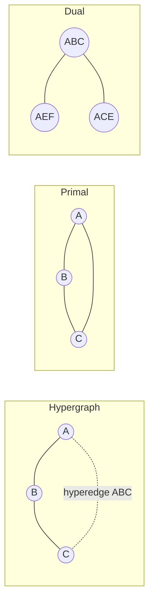
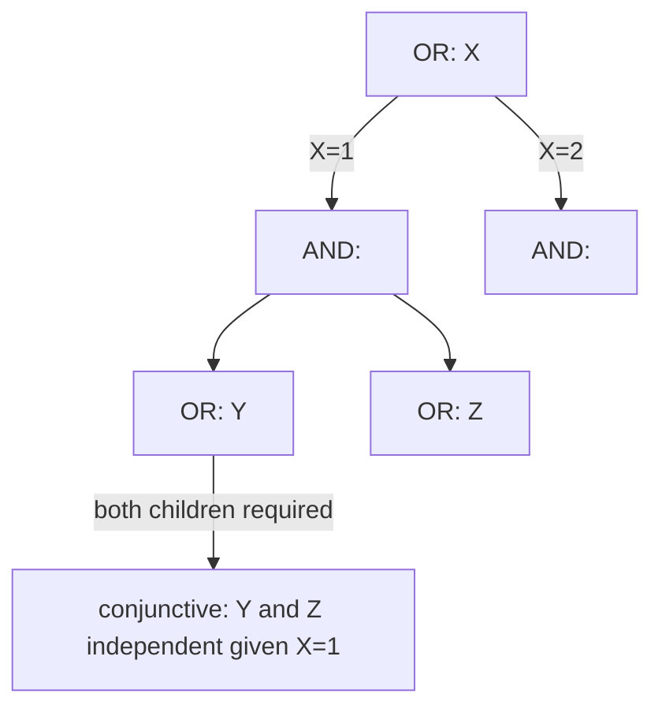
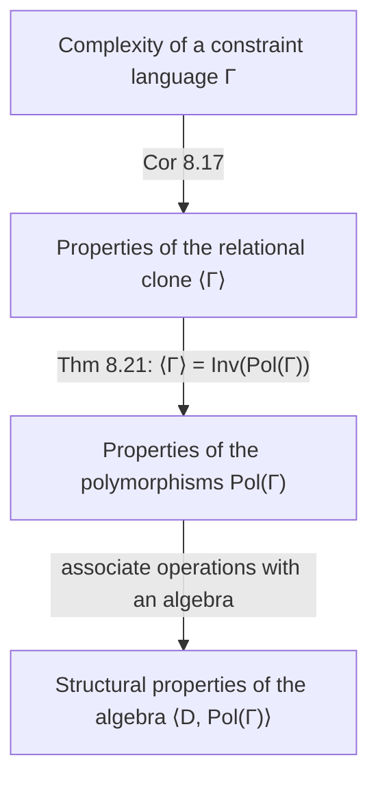
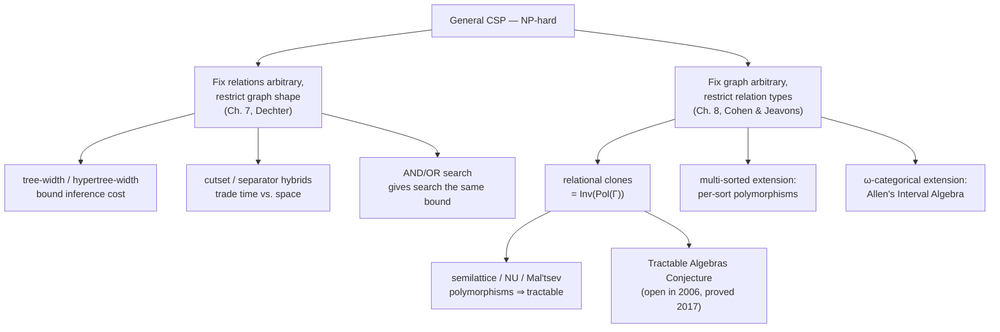

# Tractability and Computational Complexity of CSPs

[[book-guidelines|↩ Back to guidelines]]

## Why this chapter pair exists

The general CSP is NP-hard. Full stop — that's Chapter 1's opening move, and it means there is no general-purpose polynomial algorithm waiting to be discovered. But "NP-hard in general" is not the same statement as "every instance you'll ever meet is hard." Two completely different questions can be asked in response, and this pair of chapters answers each one:

1. **Chapter 7 (Dechter):** Fix the *relations* to be arbitrary, but ask whether the *shape* of how constraints overlap — the constraint graph or hypergraph — has structure a solver can exploit. This is **structural tractability**: hardness lives in the topology of variable interaction, and if that topology is tree-like (or close to it), the problem is easy regardless of what the constraints actually say.
2. **Chapter 8 (Cohen & Jeavons):** Fix the *graph* to be arbitrary (even a complete graph), but restrict which *relations* are allowed to appear as constraints. This is **language-based tractability**: hardness lives in the algebraic texture of the constraint language itself, independent of how instances happen to be shaped.

These are orthogonal axes of the same underlying question — "why is this restricted family of CSPs easy?" — and a serious constraint solver typically wants both: decompose on structure, then apply a specialized algorithm because you also know something about the constraint types living in each piece.

If you're tracking this for the compiler/CSP-kernel project: structural tractability is the machinery you reach for when your invariant-search subproblems happen to have sparse, tree-like dependency graphs (e.g., largely local reasoning about a data structure's fields); algebraic tractability is what tells you, given a fixed vocabulary of predicates (say, "linear arithmetic over refinement predicates," or "DFA membership constraints" for your grammar-shaped abstract domains), whether *any* instance built from that vocabulary is solvable efficiently, no matter how tangled the dependency graph gets. Both feed directly into deciding when the CEGAR/abstract-interpretation loop's counterexample search can be made efficient rather than merely complete.

---

## Part I — Structural Tractability (Chapter 7)

### 1. Two processing paradigms: search vs. inference

Dechter opens by naming the two families of CSP algorithms you already know from earlier chapters, but now framing them as opposite ends of a *time/space* tradeoff:

- **Search (conditioning):** guess a value, recurse. Cheap in memory (can run in linear space), flexible, but structurally blind — the linear shape of a search tree hides whatever independence exists in the constraint graph, so no useful worst-case guarantee falls out for free.
- **Inference (variable elimination / tree-clustering):** derive and record new, equivalent constraints that summarize a subproblem, then discard the subproblem. This *does* exploit graph structure and gives strong worst-case time bounds — but anything time-exponential in a graph parameter is generically also space-exponential in that same parameter, which kills it on dense problems.

Everything else in the chapter is: (a) making inference's time bound precise in terms of a graph parameter (tree-width), (b) building hybrids that trade some of inference's guarantee back for search's memory frugality, and (c) showing that *search itself*, done right (AND/OR search), can inherit inference's graph-based guarantees without inference's memory bill.

**What breaks without a structural theory:** without it, you have no principled way to predict how a solver will behave on a specific instance — you're reduced to "try it and see," with no a-priori bound distinguishing an instance that will finish in milliseconds from one that won't finish this decade. Tree-width gives you that a-priori bound.

### 2. Representing structure: primal graph, dual graph, hypergraph

A constraint network $R = (X, D, C)$ is the familiar triple: variables, domains, and constraints $C_i = \langle S_i, R_i\rangle$ (scope + relation). The chapter's first move is graphical: strip away *what* the constraints say and keep only *which variables co-occur*.

- **Primal graph:** one node per variable; an edge between any two variables that appear together in some constraint's scope. This is the natural generalization of the "binary constraint graph" to arbitrary-arity constraints — it just forgets arity, collapsing an $n$-ary hyperedge into a clique.
- **Dual graph:** one node per *constraint* (a "c-variable"); an edge between two constraints whenever their scopes share a variable, labeled by the shared variables. This turns any non-binary network into a binary one over "meta-variables," each of whose domain is the tuple-set of the original relation.
- **Hypergraph** $H = (X, S)$: the honest representation — nodes are variables, hyperedges are exactly the scopes, arity preserved.

Why keep all three? Because the primal graph is the natural home for computing tree-width (via triangulation, below), while the *hypergraph* is what you need if you want a sharper parameter that's sensitive to how many high-arity constraints there really are (hypertree-width, §6 below) — the primal graph literally cannot tell the difference between one 5-ary constraint and $\binom{5}{2}=10$ binary constraints forming the same clique, but they behave very differently computationally.



### 3. The base case: trees are free

If the primal graph is literally a tree, solving is embarrassingly cheap. Root the tree, order variables so a parent always precedes its children ($d = X_1,\dots,X_n$, width-1 ordering), and run **directional arc-consistency from leaves to root**: for each edge, prune values from the child's domain that have no support in the parent's remaining domain. After the root is processed, a plain [[Backtracking-Search|backtracking search]] along $d$ is *guaranteed never to backtrack* — this is what "backtrack-free" means, and it's the entire payoff of the chapter's machinery: turn an arbitrary problem into (or embed it inside) a tree, and search becomes a straight-line assembly process.

$$\text{Theorem 7.4 (tree-solving): } O(n k^2) \text{ where } k \text{ bounds domain size.}$$

**What breaks without this:** naive backtracking on a tree-shaped problem can still, in the worst case, generate exponentially many dead-end paths, because chronological backtracking doesn't "know" the graph is a tree — it re-discovers the same local failure over and over along different branches. Directional consistency turns that rediscovery into a one-time linear sweep.

The natural generalization beyond binary trees is an **acyclic network**: one whose hypergraph is a *hypertree* (has a join-tree — an arc subgraph of the dual graph satisfying the *running intersection property*: whenever two c-variables share a variable, every c-variable on the path between them in the join-tree also carries that variable). Redundant dual-graph edges — ones whose shared variable is already guaranteed by an alternate path — can be dropped, and if what's left is a tree, the whole problem reduces to tree-solving on the dual. `ACYCLIC-SOLVING` runs in $O(r \cdot l \log l)$ where $r$ is the number of constraints and $l$ bounds tuples per relation.

```rust
// Skeleton: the backtrack-free assembly step, once a tree/acyclic ordering exists.
// The heavy lifting (directional consistency) has already pruned each Ri
// so that every remaining tuple in Ri is guaranteed extensible along d.
struct AcyclicNetwork {
    order: Vec<ConstraintId>,     // R1..Rt, parent before child in the join-tree
    relations: Vec<Vec<Tuple>>,   // already revised, backtrack-free
}

fn assemble_solution(net: &AcyclicNetwork) -> Solution {
    let mut sol = Solution::new();
    for &rid in &net.order {
        // guaranteed: at least one tuple in relations[rid] is consistent
        // with everything already assigned, because of the prior sweep.
        let t = net.relations[rid as usize]
            .iter()
            .find(|t| sol.consistent_with(t))
            .expect("acyclic-solving invariant: always exists");
        sol.extend(t);
    }
    sol
}
```

### 4. Compiling an arbitrary network into a tree: tree-width and induced-width

Most real networks are *not* acyclic. The fix is **join-tree clustering (JTC)**: group constraints into clusters whose scopes form a hypertree, solve each cluster's subproblem exhaustively (recording its full solution set as one new "mega-constraint"), and you now have an acyclic network over clusters, solvable by `ACYCLIC-SOLVING`.

The clustering machinery is graph-theoretic:

- **Ordered graph** $G_d$: the primal graph plus a variable ordering $d$.
- **Width of a vertex:** number of its *earlier* neighbors in $d$.
- **Induced graph** $G_d^*$: triangulate $G_d$ by processing vertices from *last to first*, connecting all earlier neighbors of each vertex as it's processed (this is exactly what "eliminating" a variable does to a graph — it turns its remaining neighborhood into a clique, echoing Gaussian elimination fill-in). **Induced width** $w^*(G_d)$ is the width of $G_d^*$.
- **Tree-width** of the graph = the minimum $w^*(d)$ over all orderings $d$ — a purely graph-theoretic quantity, provably identical to the induced width. (Finding the optimal ordering is itself NP-hard, but deciding "is tree-width $\le k$?" is polynomial in $n$ for fixed $k$.)

Every maximal clique of the triangulated graph becomes a **cluster**; clusters connect to form a **join-tree**; every original constraint is placed into some cluster containing its scope; each cluster's local CSP is solved exhaustively.

$$\textbf{Theorem 7.13 (JTC complexity): } O(r \cdot k^{w^*(d)+1}) \text{ time}, \; O(n \cdot k^{w^*(d)+1}) \text{ space}.$$

This is the central result of the chapter: **the exponent is the tree-width, not the number of variables.** A CSP with 10,000 variables but tree-width 4 is polynomial in practice; one with 20 variables and tree-width 19 (essentially a clique) is exponential regardless.

**What breaks without bounding the exponent by tree-width specifically:** without this theorem you'd only know "exponential in the worst case," with no dial to turn. Tree-width *is* that dial — it's the one number that tells you, before you run anything, roughly how bad this instance's worst case will be.

#### Tree-decompositions and Cluster-Tree Elimination (CTE)

The formal object underlying JTC is a **tree-decomposition** $\langle T, \chi, \psi\rangle$: a tree $T$ with each vertex $v$ labeled by a variable set $\chi(v) \subseteq X$ and a constraint set $\psi(v) \subseteq C$, satisfying (1) every constraint's scope is fully contained in some $\chi(v)$ that also holds that constraint, and (2) for every variable, the set of tree-nodes mentioning it is *connected* (the running-intersection property, generalized).

- **Tree-width** of the decomposition: $\max_v |\chi(v)| - 1$.
- **Separator** of adjacent $u,v$: $sep(u,v) = \chi(u)\cap \chi(v)$.

**Cluster-Tree Elimination (CTE)** processes a tree-decomposition as *message passing*: each node, once it has heard from all neighbors but one, joins its own constraints with all received messages, projects onto the separator with that one remaining neighbor, and sends the result. Two passes (leaves-to-root and back) suffice.

$$\textbf{Theorem 7.20: } \text{Time } O((r+N)\cdot \deg \cdot k^{w^*+1}), \quad \text{Space } O(N \cdot k^{sep}).$$

The key structural insight, easy to miss on a first read: **CTE's space bound is governed by the separator size, not the cluster size** — unlike JTC, which must materialize each cluster's *full* solution set (exponential in cluster size). This is exactly the join-vs-project-interleaving trick: never materialize the whole join before projecting; project incrementally as tuples are generated. This is the same idea a query optimizer uses to avoid materializing intermediate relations in a multi-way join — build the message tuple-by-tuple, discard as you go.

**Adaptive-Consistency / bucket elimination** is shown to be *exactly* CTE running on a specific tree-decomposition (the "bucket-tree"): partition constraints into ordered buckets (each constraint goes in the bucket of its *latest*-ordered variable), process buckets from last to first, and each bucket's join-then-project-out-current-variable step generates a new constraint dropped into an earlier bucket. This is a satisfying unification — two algorithms that look completely different in the literature (message-passing over trees vs. Gaussian-elimination-style bucket processing) turn out to be the same computation viewed from different angles.

```python
# Toy bucket-elimination sketch — the essential shape of Adaptive-Consistency,
# stripped to Python because the ceremony of a real relational-algebra join
# would bury the point: eliminate variables from last to first, each step
# folding a subproblem into one summary constraint placed in an earlier bucket.

def adaptive_consistency(order, constraints):
    buckets = {v: [] for v in order}
    for c in constraints:
        latest = max(c.scope, key=order.index)
        buckets[latest].append(c)

    for v in reversed(order):
        bucket = buckets[v]
        if not bucket:
            continue
        joined = join_all(bucket)          # relational join over the bucket
        projected = project_out(joined, v) # drop v's column
        if projected.is_empty():
            return None                    # inconsistency detected
        if projected.scope:                # non-unary residual constraint
            target = max(projected.scope, key=order.index)
            buckets[target].append(projected)
    return assemble_backtrack_free(order, buckets)
```

#### Hypertree-width: a sharper parameter

Tree-width has a blind spot: it's computed from the *primal* graph, which collapses an $n$-ary hyperedge into a clique — so an acyclic problem with high-arity scopes gets penalized with high tree-width even though it's genuinely easy (quadratic-time solvable). **Hypertree-width** fixes this by working directly with the hypergraph: a hypertree decomposition additionally requires that each $\chi(v)$ be covered by the *scopes actually assigned to* $\psi(v)$ (not just any clique), so a single wide hyperedge costs "1" toward $hw$, not "arity − 1" the way it would toward tree-width.

$$\textbf{Theorem 7.26: hypertree decomposition solvable in } O(m \cdot hw \cdot \log t \cdot t^{hw}), \text{ space } O(m\cdot t^{hw}).$$

**Chapter's own key claim (§7.2.7):** bounded tree-width $\Rightarrow$ bounded hypertree-width, but *not conversely* — hypertree-width defines a strictly larger tractable class. (The separating example: any acyclic hypergraph, however large the individual scopes, has $hw=1$ but can have unbounded tree-width.)

### 5. Hybrids: trading time for space

Pure inference is exponential in tree-width *space*; pure search never pays that space bill but has no structural time guarantee. The chapter's hybrid schemes let you buy back space at the cost of some time, continuously, via a tunable parameter.

**Cycle-cutset / $w$-cutset.** Instantiating a variable effectively deletes it and its edges from the graph (each neighbor sees a "duplicated," independent copy of it). If the *set* of currently-instantiated variables happens to cut every cycle (a **cycle-cutset**), the *remaining* graph is a tree, solvable by tree-solving in linear space. So: backtrack over a cycle-cutset, and every time you reach a full cutset instantiation, switch to tree-solving for the rest. Generalizing "reduces to a tree" (induced-width 1) to "reduces to induced-width $\le w$" gives the **$w$-cutset**: backtrack over the $w$-cutset, run adaptive-consistency (bounded to width $w$) on the rest.

$$\textbf{Theorem 7.31: } O(n \cdot k^{c+w+1}) \text{ time}, \; O(k^w) \text{ space, } c = |w\text{-cutset}|.$$

The chapter's structural punchline connecting cutset size to tree-width:
$$1 + c_1^* \;\ge\; 2 + c_2^* \;\ge\; \cdots \;\ge\; w^* + c_{w^*}^* \;=\; w^*$$
As $w$ grows from 1 to $w^*$, cutset-decomposition smoothly interpolates from "mostly search, linear space" to "pure adaptive-consistency, exponential space" — one dial, continuously trading time against space, with $w^*$ recovering exactly the inference-only bound.

**Super-clusters / separator-width.** A dual, orthogonal knob: instead of shrinking clusters (bounding $w$), *merge* adjacent tree-decomposition nodes connected by large separators, trading a smaller separator (less CTE memory) for a larger merged cluster (more time — search within the cluster instead of full materialization). Parameterized by the allowed separator size $s$; $s=1$ gives decomposition into **non-separable (bi-connected) components**, solvable with linear space entirely (Theorem 7.38) — a nice special case because finding the best size-1-separator decomposition is *polynomial*, unlike the general $w$-cutset problem, which is NP-hard to optimize (though checking a candidate cutset is easy).

### 6. Structure-based search: AND/OR search spaces

The last piece closes the loop between search and inference: ordinary ("OR") search trees are structure-blind because every path is a flat sequence of decisions — the tree can't "see" that two subtrees, rooted after independent variable assignments, are actually solving unrelated subproblems that could be explored (and cached) separately.

**AND/OR search tree:** built over a DFS spanning tree (or more generally a *pseudo-tree*, where every constraint-graph edge is a back-edge, never crossing branches). Alternating levels: **OR nodes** (a variable — choose *one* child, i.e., one value) and **AND nodes** (a value — must satisfy *all* children, i.e., all subtrees for the variable's children in the pseudo-tree). A solution subtree picks one branch at every OR node but keeps every branch at every AND node — this literally encodes "these subproblems are conjunctively independent given the current instantiation," which a linear OR-tree cannot express.

$$\textbf{Theorem 7.40: size } O(n\cdot k^m) \text{ for pseudo-tree depth } m; \text{ if tree-width is } w^*, \text{ there's a pseudo-tree with } m\le w^*\log n, \text{ so size } O(k^{w^*\log n}).$$

Merging *unifiable* subtrees (ones that are identical because they depend only on a shared separator/context) turns the AND/OR search tree into the **minimal AND/OR search graph**, whose size collapses all the way to $O(n\cdot k^{w^*})$ — matching inference's exponent *exactly*, while still fundamentally being search (memory can stay bounded by not caching everything, trading the same time/space dial as before).

$$w^* \le m^* \le pw^* \le w^* \log n$$
relates tree-width, minimal pseudo-tree depth, and path-width (the OR-graph's analogous bound) — OR search is exponentially worse than AND/OR search on graphs where $\log n$ actually bites.

**What this buys you conceptually:** graph-based backjumping (jumping back to the deepest ancestor actually connected to the failed variable, rather than chronologically) is *implicitly already doing AND/OR search* — the chapter observes that GBJ's complexity bound, $O(k^{w^*\log n})$, is the AND/OR tree bound in disguise. So the "smarter backtracking" heuristics from Chapter 4 were secretly structure-exploiting the whole time; this chapter makes that explicit and gives it a name.



### Chapter 7 synthesis

| Parameter | Governs | Where it appears |
|---|---|---|
| tree-width / induced-width $w^*$ | inference clusters, AND/OR graph size | JTC, CTE, adaptive-consistency, minimal AND/OR graphs |
| hypertree-width $hw$ | inference clusters, arity-sensitive | hypertree decomposition — strictly larger tractable class than $w^*$ |
| cycle-/$w$-cutset size $c_w$ | search-vs-inference tradeoff | cutset-decomposition($w$) |
| separator size $s$ | inference memory | SCTE, super-clusters, non-separable-component decomposition |
| pseudo-tree depth $m$, path-width $pw^*$ | AND/OR and OR search-tree size | AND/OR search, graph-based backjumping |

All of these are *the same idea wearing different clothes*: find some embedding of the constraint (hyper)graph into a tree-like object, and pay a cost exponential in how "wide" that embedding has to be. Chapter 8 now asks the complementary question: even fixing the graph to be maximally hard (e.g. a clique — tree-width $n-1$, no structural mercy), can the *relations themselves* still force tractability?

---

## Part II — The Algebraic Theory of Constraint Languages (Chapter 8)

### 7. Reframing: complexity as a property of a *language*, not an instance

Cohen and Jeavons fix the graph/hypergraph to be arbitrary and instead parameterize by a **constraint language** $\Gamma \subseteq R_D$ — a set of allowed relations over domain $D$. $\mathrm{CSP}(\Gamma)$ is the family of instances built using only relations from $\Gamma$.

$$\Gamma \text{ is \emph{tractable} if } \mathrm{CSP}(\Gamma') \text{ is poly-time solvable for every finite } \Gamma'\subseteq\Gamma; \quad \Gamma \text{ is \emph{NP-complete} if some finite } \Gamma'\subseteq\Gamma \text{ is.}$$

Two headline examples to anchor the intuition before the machinery:

- $\Gamma_{LIN}$: all relations expressible as solutions to systems of linear equations over a field. Tractable — Gaussian elimination.
- **Schaefer's Dichotomy Theorem** (1978, the historical seed of this whole theory): over a 2-element (Boolean) domain, $\Gamma$ is tractable iff at least one of six syntactic conditions holds (0-valid, 1-valid, Horn, dual-Horn, bijunctive/2-clause, or affine/linear over $GF(2)$) — otherwise NP-complete. **Every** Boolean constraint language is either P or NP-complete; nothing in between. This is the prototype dichotomy the rest of the chapter tries to generalize to arbitrary finite domains.

The open research question the whole chapter builds toward: **is this dichotomy universal for every finite domain** (not just $|D|=2,3$)? — no "intermediate" complexity classes (the way Ladner's theorem guarantees exist for NP in general), ever, for any finite-domain constraint language. This is now known as the **CSP dichotomy conjecture**; the book states it as still open, with $|D|=2$ (Schaefer) and $|D|=3$ (Bulatov) settled. (Historical note for context beyond the book: this was resolved affirmatively in 2017 by Bulatov and independently Zhuk — but that's outside this handbook's 2006 horizon; the *machinery* the chapter builds is exactly the machinery that later closed the question.)

### 8. The three-step reduction: relations → clones → algebras

This is the intellectual core of the chapter, and it's worth sitting with because the *shape* of the argument — reduce a semantic question about computability to a syntactic/algebraic question about a structure-preserving symmetry — is a pattern you'll meet again in your elaborator/unifier work (e.g., characterizing which unification problems are tractable by the algebraic shape of the equational theory).



**Step I — Relations → relational clones.** A constraint language $\Gamma$ *expresses* a relation $R$ if $R$ is definable by a **primitive positive formula** (conjunction + existential quantification only — no disjunction, no negation) over $\Gamma \cup \{=\}$. The set of everything $\Gamma$ can express this way is the **relational clone** $\langle\Gamma\rangle$.

$$\textbf{Corollary 8.17: } \Gamma \text{ is tractable} \iff \langle\Gamma\rangle \text{ is tractable.}$$

Why this is a genuine simplification, not just relabeling: it collapses the space of languages you need to classify from "arbitrary sets of relations" down to "relational clones," and — crucially — a relational clone has a *finite, checkable* algebraic fingerprint (next step), whereas an arbitrary set of relations doesn't.

**Step II — Relational clones → polymorphisms.** An operation $f: D^k \to D$ **preserves** (is a *polymorphism* of) a relation $R$ if applying $f$ componentwise to any $k$ tuples drawn from $R$ always yields a tuple back in $R$. $Pol(\Gamma)$ = all operations preserving every relation in $\Gamma$; $Inv(F)$ = all relations invariant under every operation in $F$. These form a **Galois connection** between $R_D$ and $O_D$ (relations and operations) — the same abstract pattern as Galois connections you already know from lattice theory / abstract interpretation (a monotone pair of maps $\alpha,\gamma$ with $\alpha(x)\le y \iff x \le \gamma(y)$; here it's $\Gamma \subseteq Inv(F) \iff F \subseteq Pol(\Gamma)$).

$$\textbf{Theorem 8.21 (for finite } D\text{): } \langle\Gamma\rangle = Inv(Pol(\Gamma)).$$

This theorem is doing real work: it says the relational clone — an object defined syntactically, by what formulas can express — coincides *exactly* with the set of relations invariant under a specific, finite, checkable set of operations. So instead of reasoning about arbitrary formulas, you only need to compute $Pol(\Gamma)$ (via a device called the **indicator problem**: a CSP instance over $\Gamma$ whose variables are $D^k$-tuples, whose solutions are *precisely* the $k$-ary polymorphisms) and then check relation membership algebraically.

$$\textbf{Corollary 8.23: } \text{if } Pol(\Gamma)\subseteq Pol(\Gamma_0), \text{ then } \mathrm{CSP}(\Gamma_0) \text{ reduces in poly-time to } \mathrm{CSP}(\Gamma).$$

Read this the way you'd read a subtyping rule: *fewer* polymorphisms means a *richer, harder* language ($\Gamma$'s relations are less constrained by symmetry, so it can express more, including hard things); *more* polymorphisms means the relations are more rigidly structured and easier to solve. Polymorphisms are literally a measure of "how much symmetry does this language's relations respect" — the more symmetry, the fewer distinct assignments a solver has to distinguish between.

**Step III — Sets of operations → algebras.** $A = \langle D, F\rangle$ — a set with basic operations. Complexity is defined to depend on $F$ only up to *term equivalence* (same set of operations generatable by composition — the **clone** $Term(A) = Pol(Inv(F))$), which lets several simplifications go through for free:

- **Reduced languages:** any unary polymorphism $f$ can be applied to every relation in $\Gamma$ without changing tractability (Prop 8.28) — so WLOG restrict to languages whose unary polymorphisms are all surjective ("reduced").
- **Idempotent reducts:** $f$ is idempotent if $f(x,\dots,x)=x$. Theorem 8.31: a surjective algebra is tractable iff its *idempotent* term operations alone already are — i.e. you only need to check idempotent polymorphisms, throwing away the rest.
- **Factors** (sub-algebras + homomorphic images): tractability/NP-completeness *pass down* to factors (Theorem 8.35) — an algebra with even one NP-complete factor is itself NP-complete. This is the lever that later reduces "classify all algebras over domain size $n$" to "classify the smaller algebras that show up as factors."

### 9. Sufficient conditions: polymorphisms as algorithm selectors

Here the abstract machinery cashes out into concrete, checkable "if this operation exists in $Pol(\Gamma)$, run this algorithm" recipes — this is the part with direct engineering payoff.

| Polymorphism | Definition | Guarantees | Algorithm |
|---|---|---|---|
| **Semilattice** | binary, associative, commutative, idempotent | tractable (Prop 8.37) | arc consistency alone suffices |
| **Conservative commutative binary** | $f(x,y)\in\{x,y\}$, commutative | tractable (Prop 8.40) | generalized local consistency |
| **Near-unanimity** ($k$-ary, $k\ge 3$) | $f(y,x,\dots,x)=f(x,y,x,\dots,x)=\cdots=x$ | tractable (Prop 8.41) — moreover **$k$-consistency $\Rightarrow$ global consistency** | enforce $k$-consistency, then backtrack-free |
| **Mal'tsev** (ternary) | $f(y,y,x)=f(x,y,y)=x$ | tractable (Prop 8.46) | generalized Gaussian elimination — *no fixed level of local consistency suffices* |

Worked instances the book gives: Horn clauses have polymorphism $\wedge$ (semilattice) → tractable via unit propagation, which the chapter identifies as literally a specialization of arc consistency. Max-closed constraints have polymorphism $\max$ (semilattice). 2-clause (bijunctive) Boolean relations have the near-unanimity operation $d(x,y,z)=(x\wedge y)\vee(y\wedge z)\vee(x\wedge z)$ (majority). Connected row-convex relations have the near-unanimity operation "median." Linear constraints ($\Gamma_{LIN}$) have the Mal'tsev operation $p(x,y,z)=x-y+z$.

**Why near-unanimity is special (the intuitive reason, Key Question 2 from the guidelines):** a near-unanimity operation of arity $k$ forces any relation it preserves to be *determined by its $(k-1)$-ary projections* — informally, if $k-1$ variables are individually consistent with the relation restricted to every $(k-1)$-subset, they extend to a full consistent tuple. That's precisely what enforcing $k$-consistency checks for, so under a near-unanimity polymorphism, $k$-consistency isn't just *a* useful local property — it *is* global consistency, i.e., backtrack-free search falls out for free. Semilattice and Mal'tsev polymorphisms don't have this "local implies global" collapse: a semilattice operation gives you a well-behaved *greedy* combination rule (any locally-consistent choice extends, one variable at a time, but there's no bound $k$ at which local consistency becomes global), and a Mal'tsev operation's tractability comes from an entirely different mechanism — linear-algebraic cancellation (the identities let you "solve for" one variable in terms of two others, mirroring Gaussian elimination's row-reduction) — that has nothing to do with consistency levels at all. This is exactly why the book states "no fixed level of consistency is sufficient" for Mal'tsev languages: the underlying reason the algorithm works isn't approximable by any syntactic $k$-consistency check, however large $k$ is.

### 10. Toward the dichotomy: Rosenberg's classification and the Tractable Algebras Conjecture

What if $Pol(\Gamma)$ contains *none* of the four operations above? **Theorem 8.49** (via Rosenberg's classification of minimal clones) says every reduced $\Gamma$'s polymorphisms must fall into (at least) one of six cases: constant, near-unanimity, Mal'tsev, non-projection idempotent binary, semiprojection, or **essentially-unary-only**.

The first three cases are handled (tractable, as above). The last case is the hammer:

$$\textbf{Prop. 8.50: any language whose polymorphisms are all essentially unary is NP-complete.}$$

"Essentially unary" means every polymorphism really only looks at one argument (possibly through a fixed unary transform) — the operation has *no genuine multi-argument structure to exploit*, which is precisely the condition under which the disequality relation $\ne_D$ and the not-all-equal relation $N_D$ (both are provably hard, via Schaefer/NAE-SAT) survive in $Inv(Pol(\Gamma))$, forcing NP-hardness.

This single dichotomy — "has a nontrivial polymorphism vs. only projections" — is strong enough to *derive Schaefer's theorem as a corollary* (over a 2-element domain there are no semiprojections and the two idempotent non-projection binary operations are both semilattices, so cases 4/5 collapse into case-1's tractable bucket, leaving a clean two-way split). It generalizes to:

$$\textbf{Conjecture 8.52 (Tractable Algebras Conjecture): a finite idempotent algebra is NP-complete iff it has a nontrivial factor all of whose operations are projections. Otherwise tractable.}$$

At the time of writing this was verified for 2- and 3-element domains, conservative algebras, and strictly-simple surjective algebras — but open in general. (As noted above, this is the conjecture that a 2017 proof, using a deeper structural theory of these algebras, ultimately confirmed — vindicating the entire algebraic program the chapter lays out.)

A pleasant bonus the algebra buys almost for free: **Theorem 8.54, search is no harder than decision** — if you can decide *whether* a solution exists in poly time, you can *find* one in poly time too, by repeatedly fixing one variable at a time to a value that preserves solvability (using the reduced-language machinery from Step III to test each fix in poly time). This matters practically: a pure complexity classification (P vs. NP-complete) automatically hands you a *constructive* algorithm, not just an existence proof.

### 11. Infinite domains

Everything above assumed finite $D$. For infinite domains, **Theorem 8.21's equality $\langle\Gamma\rangle = Inv(Pol(\Gamma))$ can fail** — the chapter gives a concrete counterexample (Example 8.55: a language on $\mathbb{N}$ whose only polymorphisms are projections, yet whose relational clone is a strict subset of "all relations," because "even numbers" isn't primitive-positively definable even though it's trivially preserved by every projection).

The fix is a model-theoretic condition: a relational structure is **$\omega$-categorical** if it's determined up to isomorphism by its first-order theory. Under that condition (**Theorem 8.56**), the equality is restored, and the whole polymorphism machinery becomes available again.

The book's flagship worked example is **Allen's Interval Algebra**: 13 basic qualitative relations between time intervals (precedes, meets, overlaps, during, starts, finishes, equals, plus their inverses), $2^{13}=8192$ total relations as unions of the basic 13. The full algebra is NP-complete, but it decomposes into exactly **18 maximal tractable subalgebras** (Theorem 8.57, classified by Nebel & Bürckert). Because the interval-endpoints structure (rationals) is $\omega$-categorical, this classification is in principle amenable to the same polymorphism-based analysis that works for finite domains — a route the chapter flags as a potential simplification of what was originally a bespoke, case-heavy proof.

**Why this matters for infinite/multi-sorted domains generally, relevant to your project:** your CSP kernel will need to reason about integer/real arithmetic (genuinely infinite domains) and about abstract data structures represented as automata/grammars (which typically aren't single-sorted, homogeneous domains either). This section is the book's evidence that the algebraic dichotomy program *doesn't collapse* just because the domain is infinite — you just need the domain's first-order theory to be well-behaved ($\omega$-categorical) for the polymorphism-clone correspondence to hold, and Allen's Algebra is the proof-of-concept that temporal/interval-shaped infinite domains fall exactly into this well-behaved category.

### 12. Multi-sorted constraint languages

The single-sorted assumption (every variable ranges over the *same* $D$) is a real simplification the book explicitly warns against over-trusting. A **multi-sorted relation** carries a *signature* — which sort each argument comes from — in addition to its tuples.

The chapter's sharpest example (8.61/8.62) is worth internalizing precisely because it's counterintuitive: take the plain disequality relation $\ne_{D_0}$, which is NP-complete as an ordinary (one-sorted, $|D_0|>2$) graph-coloring constraint. Now consider it as a **multi-sorted** relation, applicable only *between* a $D_1$-sorted variable and a $D_2$-sorted variable (never within a sort). $\mathrm{MCSP}(\Gamma)$ now corresponds to **bipartite** graph coloring — trivially tractable for *any* size $D_0$, because bipartite structure alone rules out the odd cycles that make coloring hard.

**The signature restriction is doing computational work by itself**, independent of which tuples the relation contains — restricting *where* a constraint can apply is a tractability lever completely orthogonal to restricting *what* the constraint says. Converting a multi-sorted language naively to one-sorted (by flattening domains and forgetting signatures, via $\chi(R)$, Definition 8.63) can turn a tractable multi-sorted problem into an NP-complete one-sorted problem (Prop 8.65 says the *correct* flattening — encoding tuples over the *product* $D^* = D_1\times\cdots\times D_p$ rather than the *union* — is what actually preserves tractability; the union-flattening in Example 8.62 is the wrong, tractability-destroying way to do it).

**Multi-sorted polymorphisms** are defined as a *coordinated family* $\{f^{D_i}\}$, one interpretation per sort, applied componentwise per-signature. **Theorem 8.68** is the generalization payoff: if *each sort individually* has a constant, semilattice, near-unanimity, or (idempotent) affine multi-sorted polymorphism — potentially a *different kind of operation on each sort* — the whole multi-sorted language is tractable. The chapter's Example 8.69 shows a relation that provably falls into *no* known one-sorted tractable class when treated as flat, yet is provably tractable once you recognize it as multi-sorted with an affine polymorphism on one sort and a max/semilattice polymorphism on the other.

**Direct relevance to your abstract-domain design:** a CSP kernel over "integers + DFA-shaped abstract structures" is inherently multi-sorted — integer variables and automaton-state variables are different sorts, and constraints between them (e.g., "this integer index must be reachable in this DFA") have signatures, not homogeneous domains. Theorem 8.68 is exactly the tool that tells you: you don't need one uniform polymorphism across your whole heterogeneous domain — you need a *per-sort* one, and they can be different algebraic flavors on each sort (arithmetic sort gets an affine/Mal'tsev-style polymorphism from linear-arithmetic structure, automaton sort gets a semilattice-style polymorphism from, say, product/intersection of DFAs), and the combination is still provably tractable as long as each sort's polymorphism individually clears the bar.

### 13. Alternative framings (briefly)

The chapter closes with three reformulations that recur constantly in later CSP/SMT literature, so it's worth having the vocabulary even without full proofs:

- **CSP = Homomorphism Problem.** $\mathrm{CSP}(\Gamma)$ over relational structure $\mathfrak{B}=\langle D, R_1,\dots,R_q\rangle$ is exactly: "does a homomorphism from instance-structure $\mathfrak{A}$ to $\mathfrak{B}$ exist?" Graph $H$-coloring is the special case with $\mathfrak{B}$ a graph; undirected $H$-coloring's complexity is *fully* known (tractable iff $H$ is bipartite or has a self-loop) and follows from the Tractable Algebras Conjecture as a special case — every finite-language CSP is poly-time equivalent to *some* directed graph's $H$-coloring problem, so resolving directed $H$-coloring in general would resolve Conjecture 8.52 outright.
- **Descriptive complexity / Datalog.** Feder–Vardi's program: characterize $\mathrm{CSP}(\Gamma)$'s "yes-instances" as a class of structures definable in a restricted logic. If the yes-instances (e.g. non-2-colorable graphs, expressed via an odd-cycle-detecting Datalog program) are Datalog-definable, $\mathrm{CSP}(\Gamma)$ is tractable. This is a direct line to your interests: Datalog is exactly the fragment underlying **Constrained Horn Clauses (CHCs)** used in modern CEGAR-style verifiers, and "bounded path duality" (Dalmau) pins down which languages land in the very efficient parallel complexity class NL.
- **Disjunctive combination.** Build new languages from old via $\Gamma \times_\vee \Delta$ (pairwise-disjoin every relation in $\Gamma$ with every relation in $\Delta$). This is genuinely different in flavor — constructive rather than descriptive — and unifies five of Schaefer's six tractable Boolean classes plus max-closed, 0/1/all, connected-row-convex, and linear Horn constraints as instances of a single combinator, working uniformly over finite *and infinite* domains. But it's a double-edged sword: 2-SAT ($\Lambda^{\vee 2}$) is tractable, 3-SAT ($\Lambda^{\vee 3}$) is NP-complete — disjunctive combination does not preserve tractability in general, only under additional "$k$-independence" conditions the chapter sketches (Theorems 8.79/8.81) but doesn't fully unify with the algebraic (polymorphism) approach.

---

## Synthesis: how the two halves fit together, and where this leads



Structural and algebraic tractability are genuinely complementary, and production solvers use both: decompose the instance along tree-width (Chapter 7) to get small clusters, then within each cluster exploit whatever algebraic structure the local constraint types have (Chapter 8) — e.g., a cluster that happens to be all-linear-arithmetic gets solved by the Mal'tsev-style Gaussian-elimination algorithm rather than brute enumeration, even though tree-width alone would only promise "solvable in $k^{w^*}$ steps by enumeration."

**[[Applications-Configuration-Networks-and-Bioinformatics#Where this leads|Where this leads]] in the book's own structure:** Chapter 9 (Soft Constraints) reuses the exact bucket-elimination / tree-decomposition machinery from Chapter 7, generalized from Boolean satisfaction to valued/semiring-weighted optimization — so everything about tree-width, CTE, and cutset-decomposition carries over almost verbatim once "consistent/inconsistent" is replaced by "cost." Later chapters on constraint languages over structured/temporal/spatial domains (Chapters 14, 15, 17) are direct applications of the infinite-domain and multi-sorted algebraic theory from Chapter 8's §8.5–8.6.

**Where this leads for your project, explicitly:**
- The **algebraic dichotomy machinery (§8.3–8.4)** is the theoretical justification for *why* your CSP kernel should classify constraint predicates by their closure properties (polymorphisms) before choosing a solving strategy — this is precisely analogous to how an SMT solver's theory-combination architecture (Nelson–Oppen) dispatches to theory-specific decision procedures, and it's the same instinct behind choosing linear-arithmetic-specific vs. general nonlinear handling in your abstract-interpretation domains.
- **Structural tractability (Chapter 7)** is the right lens whenever your invariant-search subproblems decompose along sparse dependency — e.g., searching for a counterexample that violates a refinement type where most predicates only reference a few nearby program variables gives you low tree-width "for free," and bucket-elimination is a genuine, implementable algorithm for exploiting that, not just a theoretical bound.
- **Multi-sorted tractability (§8.6)** is directly the shape of your planned heterogeneous domain (integers/reals + automaton-shaped abstract structures): Theorem 8.68 tells you that per-sort algebraic tractability conditions compose, which is a real design constraint on how you'd want to structure propagators for a lattice-product domain rather than one flat domain.
- **CSP-as-homomorphism / Datalog framing (§8.7.1–8.7.2)** is your most direct bridge to CHC-based verification: recognizing that your counterexample-search CSP kernel's "yes-instances" characterization is a homomorphism/Datalog question is the same conceptual move as recognizing a CHC system's satisfiability as a reachability question — worth keeping in mind when you design the interface between the CSP kernel and the CHC-solving side of the toolchain.
