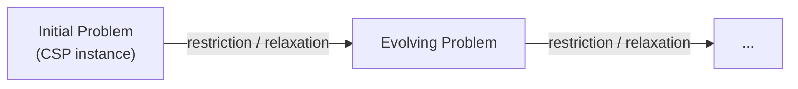
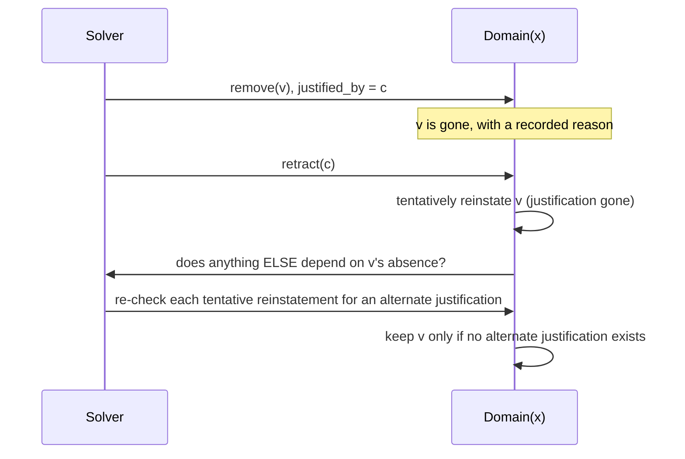
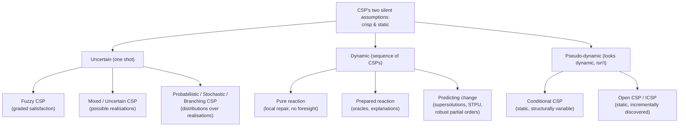

# Uncertainty and Change in Constraint Problems

[[book-guidelines|↩ Back to guidelines]]

## Why this chapter exists

Every CSP you've seen so far in this handbook quietly makes two assumptions:

1. **The problem is crisp and complete.** Every variable, every domain, every constraint is known exactly, up front.
2. **The problem is static.** It doesn't change between the moment you state it and the moment you execute the solution.

Neither assumption survives contact with a real system. A factory scheduler doesn't know the full job list in advance — jobs keep arriving while others are being completed, machines break, materials show up late. A configuration tool doesn't fully know its own constraints yet — the user is still exploring the design space. And even when a problem is well-specified today, the world it describes will have moved on by the time the solution executes.

This is the "[[Applications-Configuration-Networks-and-Bioinformatics#What breaks without it|what breaks without it]]" case for the entire chapter: **a solver that only knows how to answer "does a solution exist for exactly this problem" is useless the instant the problem it was given is either approximate or stale.** Chapter 21 is Brown and Miguel's survey of how CP extends past those two assumptions, organized along exactly that fault line:

- **Uncertain problems** — you need one solution, but the problem description itself is imprecise, incomplete, or probabilistic.
- **Problems that change** — the problem itself mutates over time, and you get a sequence of solving episodes rather than one.
- **Pseudo-dynamic formalisms** — problems that *look* dynamic (by name or history) but are actually static problems in disguise, worth separating out because conflating them with genuine dynamism causes real confusion in the literature.

Throughout, the chapter reuses one running example — the **Course Scheduling Problem**: 9 variables $x_{ij}$ ($i \in \{1,2,3\}$ = day, $j \in \{1,2,3\}$ = session type: lecture/practical/tutorial), each counting how many sessions of that type happen on that day, subject to

$$
\forall i:\ \sum_{j=1}^{3} x_{ij} \ge 2 \quad\text{(sessions per day)}, \qquad
\forall j:\ \sum_{i=1}^{3} x_{ij} \in \{1,\dots,5\} \quad\text{(per session type)}, \qquad
\sum_{i,j} x_{ij} \in \{10,11,12\} \quad\text{(total)}.
$$

Keep this in your head — every formalism below is illustrated by perturbing this same problem in a different way.

---

## Part I — Uncertain problems (one solution, imprecise description)

Here we never get a second chance: we must commit to a single solution now, even though the description of "what counts as a solution" is soft, incomplete, or probabilistic. The book gives three distinct sources of imprecision, each with its own formalism.

### 1. Fuzzy CSPs — imprecision in what "satisfied" means

**The problem this solves:** some constraints aren't naturally boolean. "The price must be cheap" or "give about three lectures" have no crisp yes/no answer — they admit degrees.

**Mechanism.** A fuzzy CSP replaces each constraint's boolean relation with a fuzzy relation: a membership function assigning every tuple in $D_i \times \cdots \times D_j$ a satisfaction degree in $[0,1]$ (0 = fully violated, 1 = fully satisfied). Conjunction of constraints — the operation that used to be boolean AND — becomes the *minimum* over the individual degrees (a "weakest link" semantics: your overall satisfaction is bottlenecked by your worst-satisfied constraint). Hard constraints fall out as the special case where degrees are restricted to $\{0,1\}$, so fuzzy CSP is a strict generalization, not a separate world.

In the course-scheduling example, Professor A prefers *about* four lectures, Dr B prefers *about* three practicals, Dr C prefers *about* three tutorials — each preference becomes a membership function over "sum of sessions of that type" (e.g. lectures: sum=4 → degree 1.0, sum=3 or 5 → degree 0.8, sum=2 → degree 0.6, sum=1 → degree 0.4). The crisp solution from earlier in the book (2 lectures, 3 practicals wait — actually 3 lectures, 3 practicals, 5 tutorials across the days) scores an *overall* satisfaction of $\min(0.8, 1.0, 0.8) = 0.8$ under this scheme, while a re-arranged solution (4 lectures, 3 practicals, 3 tutorials) scores $1.0$ on every constraint and is therefore optimal. Solving a fuzzy CSP means searching for the assignment maximizing this min-aggregated degree, exactly the same search machinery as crisp CSP, just with a different objective.

This is the same idea Chapter 9 (Soft Constraints) develops in full generality — fuzzy CSP is one instantiation of the semiring-CSP framework, with $([0,1], \max, \min)$ as the semiring.

```rust
// A fuzzy relation is just a constraint whose "satisfied?" check returns a degree.
trait FuzzyConstraint {
    fn degree(&self, tuple: &[i32]) -> f64; // in [0.0, 1.0]
}

// Conjunction = min over all constraints touching the current (partial) assignment.
fn overall_degree(constraints: &[Box<dyn FuzzyConstraint>], assignment: &[i32]) -> f64 {
    constraints.iter()
        .map(|c| c.degree(assignment))
        .fold(1.0, f64::min)
}
```

### 2. Problems with possible realisations — imprecision in *what the problem is*

**What breaks without this:** fuzzy CSP handles graded preference, but sometimes the imprecision isn't "how satisfied," it's "which problem am I actually solving" — some part of the CSP itself (a variable's value, a coefficient) is not under your control and will be fixed by an external source later, or never revealed at all.

**Mixed CSP** (Fargier et al.) splits the variable set $X$ into **controlled decision variables** and **uncontrollable parameters** — the latter get assigned externally (a user, another agent, a random process), effectively pinning their domain to a singleton once revealed. A **possible realisation** of the problem is one specific setting of the parameters. Now there are two very different notions of "solving" it:

- A **pure decision** assigns all decision variables *once*, and must work as a solution regardless of which realisation occurs. Even with independent parameters (no constraints between them), deciding whether a single pure decision exists that solves *every* binary-mixed-CSP realisation is **NP-complete**.
- A **conditional decision** instead maps each possible realisation to its *own* tailored assignment — an anytime algorithm (again Fargier et al.) computes these.

Concretely: suppose the number of tutorials on day 1, $x_{13}$, will be fixed later and might be $0$ or $1$ — a pure decision exists that works for both. But add a second uncontrollable parameter, $x_{21} \in \{0,1,2\}$, and now there are six possible realisations $(x_{13}, x_{21})$ — no single pure decision can satisfy the total-sessions constraint across all of them, so you're forced into a conditional decision, one assignment per realisation.

**Uncertain CSP** (Yorke-Smith & Gervet) targets a different flavor of "not fully known": the *coefficients inside the constraints themselves* are uncertain (an algebraic representation, e.g. $\sum_j w_j x_{ij}$ with uncertain weights $w_j$). The object of interest is the **certainty closure** — the set of all solutions across every possible realisation of the coefficients — from which you can extract a **covering set** (at least one solution per realisation) or the **most robust solution** (solves the largest number of realisations). Their method reduces the UCSP to an equivalent standard CSP whose full solution set *is* the closure.

```rust
struct MixedCsp {
    decision_vars: Vec<VarId>,
    uncontrollable: Vec<VarId>,
}

enum Decision {
    Pure(Assignment),                          // one assignment, must survive every realisation
    Conditional(HashMap<Realisation, Assignment>), // tailored per realisation
}

// Existence of a pure decision solving ALL realisations is NP-complete in general
// — you can't shortcut it by checking realisations independently, because the
// SAME assignment to decision_vars has to work everywhere at once.
```

### 3. Probabilistic and stochastic CSPs — imprecision with a *distribution* attached

Once you have probabilities over realisations instead of just a set of them, two distinct questions become answerable:

- **Probabilistic CSP, variant 1** — a probability distribution over *constraint-coefficient* realisations (the probabilistic analogue of Uncertain CSP above). Solved via the same soft-constraint machinery (valued CSP, semiring CSP from Chapter 9) since "probability of satisfaction" behaves like a satisfaction degree.
- **Probabilistic CSP, variant 2** — a probability distribution over *uncontrollable-parameter* values (the probabilistic analogue of Mixed CSP). Here the goal is a pure decision with **maximal probability of being a solution**, computed via a forward-checking branch-and-bound. On the two-parameter course-scheduling example above, with $x_{13}: \{0{:}0.3, 1{:}0.7\}$ and $x_{21}: \{0{:}0.5, 1{:}0.4, 2{:}0.1\}$, the best pure decision achieves probability $0.93$ (it fails only on the one realisation $(1,2)$ that violates total-sessions).
- **1-stage stochastic CSP** (Walsh) asks a decision-*threshold* question: is the problem $\theta$-satisfiable — does some pure decision have solving probability $> \theta$? This is shown to be **$NP^{PP}$-complete** — strictly harder than either plain NP-completeness (deciding a single realisation) or #P-style counting, because you're quantifying over decisions *and* aggregating probability mass over realisations.
- **Multi-stage stochastic CSP** generalizes this to alternating phases: assign some decision variables, then the environment *reveals* a batch of parameter values, then assign more decision variables, and so on. The solution is no longer a flat assignment — it's a **decision tree**, where later assignments are conditioned on everything revealed so far. This is exactly how you'd model, say, a production plan where quarter-2 output depends on quarter-1 output *and* on quarter-1's realised demand *and* on future uncertain demand. General multi-stage stochastic CSP is **PSPACE-complete** — the same complexity class as QBF, which makes sense: alternating "I choose" / "nature reveals" phases is structurally an alternating quantifier prefix.
- **Branching CSP** (Wallace & Freuder) generalizes further still: instead of a fixed variable set with revealed parameters, *new variables and constraints arrive* according to a probabilistic arrival tree, and each arriving variable can be **accepted** (assigned a non-violating value, earning a utility) or **rejected** (earns nothing). The solution is a *policy* over the arrival tree maximizing expected utility — structurally a finite-horizon Markov Decision Process, except the action space at each node is constrained by prior choices, which is exactly what makes naive MDP formulation blow up (exponentially many states) and is why Branching CSP algorithms instead use [[Backtracking-Search|backtracking search]] with propagation over the tree directly.

The book's Figure 21.19 makes this concrete with a scheduling variant: an initial request A (lecture+practical) arrives for certain; then with probability 0.6 request B (2-hr practical) arrives, else with probability 0.4 request C (lecture+practical back-to-back) arrives; then a further conditional branch (C or D) depending on the first outcome. Each request has a fixed revenue (A: 3, B: 6, C: 9, D: 3) if accepted, 0 if rejected, and each leaf of the arrival tree has a joint probability and revenue (e.g. accepting B whenever it shows up: $\Pr=0.48$, revenue 15). The optimal *policy* here turns out to reject the low-value A outright and free the room for the higher-value B/C branches, achieving an **expected revenue of 11.88** — strictly better than committing to accept A up front.

```rust
// Branching CSP: a policy is a function from "arrival history so far" to an action.
enum Action { Accept(Value), Reject }

struct ArrivalNode {
    probability: f64,          // conditional on reaching this node
    utility_if_accepted: f64,
    children: Vec<ArrivalNode>,
}

// Expected-utility policy search looks a lot like backward induction over a game tree —
// except the "legal accept values" at each node are pruned by constraint propagation
// against everything accepted on the path so far, not just recomputed from scratch.
fn best_expected_value(node: &ArrivalNode, committed: &Assignment) -> f64 {
    let accept_value = node.probability
        * legal_values(node, committed)
            .map(|v| node.utility_if_accepted
                + children_expected_value(node, &committed.with(v)))
            .fold(f64::NEG_INFINITY, f64::max);
    let reject_value = node.probability * children_expected_value(node, committed);
    accept_value.max(reject_value)
}
```

---

## Part II — Problems that change over time

Here we're not stuck with one shot: the problem literally becomes a **sequence of CSP instances**, $P_0 \to P_1 \to P_2 \to \cdots$, related by *restrictions* (constraints added) and *relaxations/retractions* (constraints removed).



The chapter organizes the responses to this by *how much anticipation the solver does*, which is a genuinely useful axis: from zero foresight, to structural bookkeeping, to full-blown prediction.

### 4. Pure reaction — no anticipation, just repair

**What breaks without this:** solving each $P_i$ from scratch throws away everything the solver learned solving $P_{i-1}$, and — worse — produces a solution that may look nothing like the previous one, which is disruptive if a human or another system is relying on continuity (e.g. a published timetable).

**Local Repair / min-conflicts** (Minton et al.) keeps the previous solution as a starting assignment and repairs it via a value-ordering heuristic that prefers whatever conflicts *least* with the previous solution, driven by a search that minimizes newly-violated constraints. E.g. take the course-scheduling solution and then add a new constraint capping sessions-per-day at 4 (the "Balanced Course Scheduling Problem") — repair search fixes $x_{11}, x_{21}$ (unaffected), then re-derives $x_{31}$ under the new cap by picking the value closest to the old one that doesn't violate it.

**Local Changes** (Verfaillie & Schiex) is a more surgical variant: it partitions all variables into $X_1$ (fixed — needed to guarantee termination), $X_2$ (assigned but revisable), $X_3$ (unassigned), starts with everything in $X_2$ using the old solution, and only *unassigns into $X_3$* the variables actually implicated in a currently-violated constraint, recursively repairing just that neighborhood. If a repair attempt itself fails, the variable gets *fixed* (moved to $X_1$) before backtracking over it, which is precisely what stops the recursion from cycling forever.

```rust
#[derive(Clone, Copy, PartialEq)]
enum VarStatus { Fixed, Tentative, Unassigned } // X1, X2, X3

struct LocalChanges<'a> {
    problem: &'a Csp,
    status: HashMap<VarId, VarStatus>,
    assignment: Assignment,
}

impl<'a> LocalChanges<'a> {
    fn repair(&mut self) -> Option<Assignment> {
        if self.problem.is_satisfied(&self.assignment) {
            return Some(self.assignment.clone());
        }
        // move at least one variable per violated constraint into X3, then recurse
        for c in self.problem.violated(&self.assignment) {
            let v = self.pick_culprit(c);
            self.status.insert(v, VarStatus::Unassigned);
        }
        self.reassign_x3() // heuristically re-assign, fixing (X1) on failure before backtracking
    }
}
```

Both local-repair schemes achieve stability only as a *side effect* of minimizing search cost — there's no guarantee the resulting solution is the *most* stable one available. **Minimal perturbation** (El Sakkout & Wallace, and RB-AC of Verfaillie et al.) makes stability an *explicit objective*: define a distance function to the previous solution and optimize the new problem subject to minimizing that distance, iteratively testing "can I solve this by reassigning 1 variable? 2? 3?..." This trades search effort for an optimality guarantee on stability itself — the chapter frames this as the central practical tradeoff of Part II's first sub-section.

### 5. Prepared reaction — record information now, use it after the change

**The idea:** you still have no model of *what* will change, but you can hedge by recording structure from solving $P_{i-1}$ that's likely to remain valid after a small edit.

**Oracles** (Van Hentenryck & Provost) record the *search path* to the previous solution. For a new, more-constrained problem, search replays that path, pruning any subtree that failed for the *less-constrained* prior problem too (since adding constraints can only shrink the solution set — if there was no solution there before, there certainly isn't one now). It only reverts to plain chronological backtracking once the recorded oracle path itself hits new failures, at which point a fresh oracle gets recorded for the *next* transition.

**Explanations** (Jussien) generalize this into something closer to what a SAT/SMT solver calls conflict-driven learning: a subset of constraints that *justifies* a solver event — most commonly, "constraint $c$ is the reason value $v$ was removed from variable $x$'s domain." The payoff shows up specifically on **retraction**: removing $c$ after the fact means every value it justified removing must be *tentatively reinstated* (they might still be invalid for a different reason), which then cascades — reinstating $v$ calls into question every other removal that was justified *using* $v$'s absence, and so on, until a modified arc-consistency pass re-checks each tentatively-restored value for an alternative justification. Algorithms in this family (DnAC-4, DnGAC4, DnAC-6, PaLM) differ mainly in *where* the justification is stored — the AC|DC family derives it directly from the constraint graph to save space; others record the full set of implicated original constraints for stronger explanations at higher memory cost. The chapter also gives a concrete payoff example: adding a symmetry-breaking ordering constraint over session types lets you derive an *implied* constraint (lectures $\le 4$) whose explanation — the original total-sessions constraint plus the ordering constraint — remains valid across the transition to the Balanced problem, so the implied constraint (and the pruning it buys) is reused for free.



### 6. Predicting changes — reason explicitly about what's *likely* to happen

This is the strongest form of anticipation: you have some model — even a rough one — of the distribution of future changes, and you bake robustness into the *initial* solution.

**Supersolutions** (Hebrard, Hnich & Walsh) formalize "robust to losing a value." An **$(a,b)$-supersolution** is a solution such that, if any $a$ value assignments are lost, it can be repaired by reassigning those *plus at most $b$ other* variables. The special case $(1,0)$ means: for every variable, there's a standby value ready to go with zero collateral reassignment. On the extended course-scheduling problem (18 slot-variables $y_{ij}$, values $\{L, P, T, \phi\}$), a solution where every slot has a same-type replacement value available is a $(1,0)$-supersolution; one where losing a single tutorial slot cannot be locally repaired (because the tutorial-count constraint would then be violated everywhere else too) is not.

Finding *any* $(a,b)$-supersolution is **NP-complete for fixed $a$** — worth pausing on, because it means robustness search is provably harder than plain satisfiability search on the same problem, not just "harder in practice." Hebrard et al. give a MAC-based algorithm for $(1,0)$, extended to branch-and-bound for the **most robust solution** when no exact $(1,0)$-supersolution exists (maximize the number of repairable variables instead of requiring all of them). Later extensions add restricted repair directions — e.g. for scheduling, only allow repairs that push start times *later* — and **weighted $(\alpha,\beta)$-supersolutions**, which fold in the *probability* of losing a value and the *cost* of the repair (any loss-set with probability mass $>\alpha$ must be repairable at cost $<\beta$) — directly useful for, e.g., combinatorial auctions where winning bids can be withdrawn with some probability.

```rust
/// An (a, b)-supersolution: for every loss-set of size a, some repair of
/// size ≤ (a + b) restores full constraint satisfaction.
fn is_a_b_supersolution(csp: &Csp, sol: &Assignment, a: usize, b: usize) -> bool {
    for loss_set in sol.subsets_of_size(a) {
        let repairable = csp
            .repairs_within(sol, &loss_set, /* budget */ a + b)
            .any(|repair| csp.is_satisfied(&repair));
        if !repairable {
            return false; // NP-complete to search this space, even for a fixed a
        }
    }
    true
}
```

**Stochastic CSP** and **Branching CSP** (from Part I) return here as *proactive* techniques — the same multi-stage/arrival-tree formalisms, but now framed as generating a solution up front that anticipates the revealed/arriving structure, rather than answering a satisfiability question about it.

**Simple Temporal Problems with Uncertainty (STPU)** (Vidal & Fargier) apply the mixed-CSP decision/parameter split to *time points* in scheduling: some timepoints are decision variables, others are uncontrollable (e.g. an activity's actual duration). Three controllability notions, in increasing strength of what "works":

- **weakly controllable** — for every possible realisation of the uncontrollable timepoints, *some* schedule works (co-NP to check),
- **strongly controllable** — *one fixed* schedule works for *every* realisation (in P),
- **dynamically controllable** — an *online* policy exists whose next decision depends only on timepoints observed *so far* (also in P) — the practically useful middle ground, since it doesn't require committing everything up front (like strong controllability) but doesn't require magically knowing the future (like weak).

Beyond STPU, the chapter surveys slack-based approaches to job-shop scheduling under duration uncertainty (padding durations directly vs. padding the *constraints between* tasks — the latter two outperform naive right-shift reactive scheduling), branch-and-bound with Monte Carlo simulation for probabilistic makespan guarantees, and **robust partial orders** (Policella et al.) for project scheduling — instead of committing to one fixed schedule, generate a *partial order* over tasks that any consistent assignment of start times satisfies, which absorbs resource or duration changes without violating the order itself.

---

## Part III — Pseudo-dynamic formalisms: don't confuse these with genuine dynamism

The chapter is unusually insistent on a taxonomy point here, and it's worth taking seriously: two formalisms that are *historically named* or *structurally similar* to dynamic CSP are actually static problems solved once.

**Conditional CSP** (Mittal & Falkenhainer) — confusingly, this line of work was *originally titled* "Dynamic Constraint Satisfaction Problems," but "dynamic" there refers to the problem's *internal structure* changing based on search decisions, not the problem itself changing over real time. The whole problem is known statically; parts of it are merely activated or deactivated depending on other variables' assignments (e.g. you only need to decide sunroof-tint options if the sunroof option was chosen at all). This is exactly how configuration (Chapter 24) and planning (Chapter 22) problems get modeled.

**Open CSP (OCSP)** (Faltings & Macho-Gonzalez) — the variable and constraint *set* is fixed and known, but domains and allowed tuples are discovered incrementally by querying external information sources (think: querying suppliers in an e-commerce configurator, or querying instructors in the course-scheduling example for their acceptable teaching loads). Because domains/tuples only ever *grow* monotonically with each query, a solution found on a partially-discovered sub-problem is *guaranteed* to remain a solution once the rest is discovered — which is what licenses OCSP's whole approach: don't gather everything up front, **interleave querying and solving**. The **o-search** algorithm queries for more information only when the currently-known sub-problem is unsatisfiable; **fo-search** refines this further by querying only the *specific portion* of the sub-problem responsible for the failure — an explanation-flavored optimization, not coincidentally. Extending OCSP to fuzzy or optimization settings requires a monotonicity assumption on the *order* in which values are revealed (best-membership/lowest-cost first), which is realistic when queried sources are cooperative (they'll offer their preferred option first). A close relative, **Interactive CSP (ICSP)**, differs mainly by assuming variable domains are finite and fully acquirable per-variable on demand.

The chapter's own framing of *why* this taxonomy matters: OCSP is "closely related to" dynamic CSP (each newly-discovered domain element can be modeled as relaxing a unary constraint that used to disallow it) — but it is not dynamic in the chapter's sense, because nothing about the *real-world* problem changes; only the solver's *knowledge* of an already-fixed problem changes.

---

## Synthesis: the shape of the whole chapter



The chapter is honest about its own state of the field in its closing sections: these formalisms are largely **isolated** from each other — different objectives, little shared benchmark infrastructure (CSPLib had none, as of the chapter's writing), and no unifying framework comparable to what semiring/valued CSP did for soft constraints in Chapter 9. That's a real gap, not just modesty.

**[[Applications-Configuration-Networks-and-Bioinformatics#Where this leads|Where this leads]].** Within the handbook, this chapter is the natural companion to Chapter 9 (Soft Constraints — fuzzy CSP's home framework), Chapter 17 (Temporal CSP — STPU's home), Chapter 22 (Scheduling — the single biggest application area for everything in Part II), and Chapter 18 (Distributed CP — many open/interactive problems are also distributed).

**For the compiler/verifier project this vault is building toward**, several threads here are directly load-bearing, not just analogical:

- **Explanations (§21.4.2) are your CSP kernel's proof-certificate mechanism.** The "record a justification for every domain reduction, and use it to support retraction" pattern is precisely what a *trusted kernel* needs when your CSP-based counterexample search interacts with an abstract-interpretation pass that keeps refining (CEGAR-style): every time the abstraction is refined and a spurious counterexample is retracted, you want the same tentative-reinstatement-then-recheck machinery, not a from-scratch re-solve. This is nogood/conflict learning by another name — the same idea underlying CDCL in SAT/SMT solvers, and worth recognizing as such when you design the counterfact-search kernel your learning goals call for.
- **Supersolutions and robust/weighted robustness formalize what "an invariant holds robustly" should mean** for a program analysis: an $(a,b)$-supersolution is structurally the same question as "does this invariant survive a bounded perturbation of the program's inputs/state without a full re-verification," which is exactly the robustness property you'd want out of incrementally-checked Hoare-style contracts as a program evolves.
- **Branching CSP's arrival-tree/policy formulation is the CSP-native analogue of symbolic execution's path explosion under incremental code changes** — an MDP-shaped problem constrained by prior choices, solved by propagation instead of naive state enumeration. That's directly relevant if your CSP kernel needs to reason about programs whose control-flow structure is itself only partially known ahead of time (e.g. under-specified external calls).
- **Mixed/Uncertain CSP's split into decision variables vs. uncontrollable parameters** is the same shape as the split between a program's *inputs you control in a test/verification harness* and *inputs the environment controls* — exactly the distinction a Hoare-triple `requires`/`ensures` boundary needs to draw, and pure-vs-conditional-decision is precisely universal-vs-existential quantification over the uncontrolled part, i.e., the same alternation that shows up in weakest-precondition reasoning over adversarial environments.

None of this is a stretch reading — it's the chapter's own vocabulary (decision/parameter, justification, policy, robustness-as-explicit-objective) mapping almost one-to-one onto the vocabulary a verifier's CSP kernel needs.
