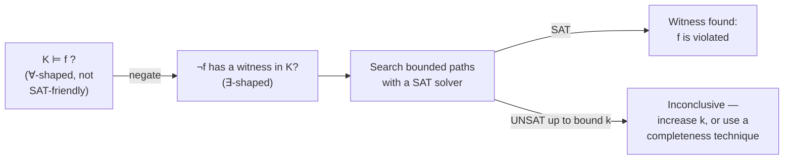
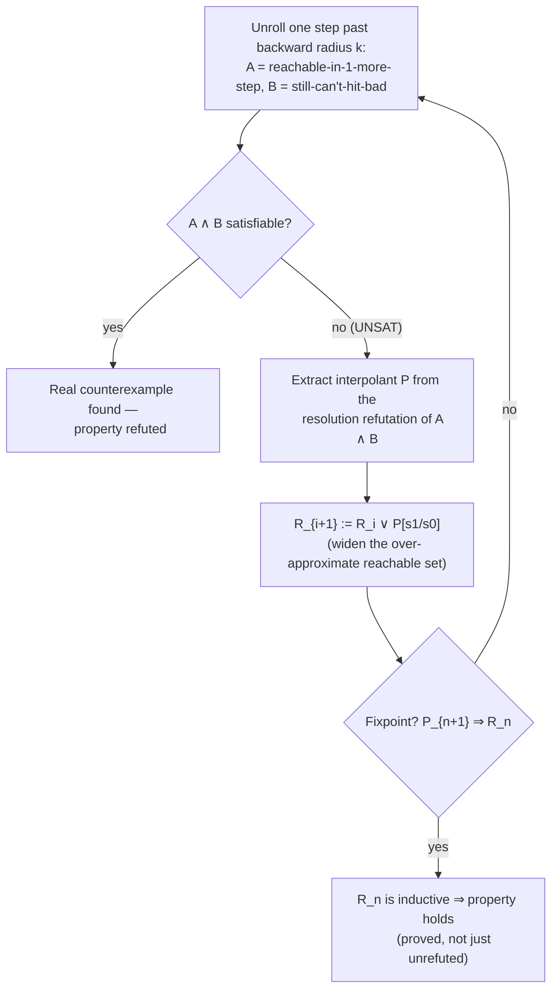
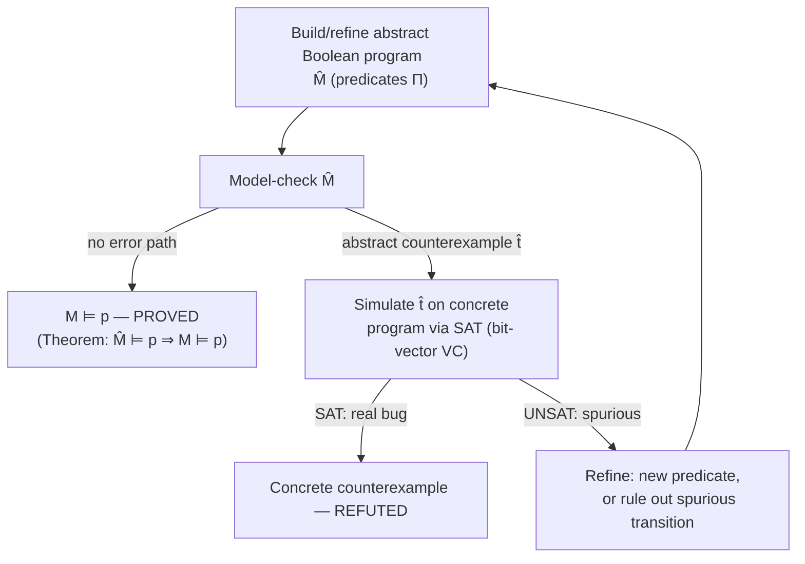

# Bounded Model Checking and Formal Verification

[[book-guidelines|↩ Back to guidelines]]

## Why BMC exists: SAT can't do what BDDs do

Model checking answers one question: does every reachable behavior of a system satisfy a
property? The classical (1980s) approach represented the entire reachable state space
symbolically using **Binary Decision Diagrams (BDDs)** and computed fixpoints over it —
"keep applying the transition relation until no new states appear." That fixpoint computation
needs one operation BDDs are good at and SAT solvers fundamentally are not: **existential
quantification** (projecting a set of states down to "does *some* successor exist"). BDDs
support this natively as a graph operation. A SAT solver only answers "is this formula
satisfiable" — it has no notion of "eliminate this variable and give me a formula over what's
left." That's the entire reason BMC exists as a *different* technique rather than "model
checking, but using SAT instead of BDDs as an implementation detail."

BMC's move is to **give up on totality and focus on falsification**. Instead of "does the
property hold for *all* reachable states," ask "is there a counterexample trace of length
*k*?" That's a bounded, existential question — exactly what SAT solvers are built for. The
price is that a "no" answer only means "no counterexample of length ≤ *k*," not "the property
holds." Most of this chapter's later material (§18.4–18.8) is about clawing back completeness
without paying BDD's price — and the technique that does it, Craig interpolation, is one of
the load-bearing ideas for your compiler's invariant-generation problem, so pay attention to
where it shows up.

BDDs also cap out in practice around a few hundred state variables before blowing up in space;
SAT solvers, precisely because they never build an explicit graph of the state space, scale
to enormously larger variable counts. This asymmetry — BDDs lose on scale, win on
completeness; SAT wins on scale, loses on completeness — is the axis the entire chapter runs
along.

## Kripke structures and LTL: specifying infinite behavior

**What breaks without this.** A hardware circuit or a concurrent program doesn't run once and
halt — it runs forever (or for as long as power is applied). "Correctness" for such a system
can't be a statement about one execution; it has to be a statement about *every infinite
execution*. You need (a) a formalism for "what are the possible infinite executions" and (b)
a specification logic that can talk about infinite time without writing out an infinite
formula.

(a) is a **Kripke structure**, $K = (S, I, T, L)$:

- $S$ — the set of states,
- $I \subseteq S$ — the initial states (nonempty),
- $T \subseteq S \times S$ — a **total** transition relation (every state has a successor —
  no dead ends, so infinite paths always exist),
- $L : S \to \mathbb{P}(V)$ — a labelling function saying which propositional variables hold
  in each state.

In the usual symbolic representation, states *are* variable valuations: $S = \mathbb{P}(V)$,
$T(s, s')$ is a propositional formula relating a vector of "current" variables to a vector of
"primed" (next-state) variables, and $I(s)$ constrains only the current vector. This is
already exactly the shape of a transition system in any operational-semantics presentation —
if you've written a small-step reduction relation $s \to s'$ for a language, $T$ is that
relation reified as a formula instead of a set of syntactic rules.

(b) is **Linear Temporal Logic (LTL)**: propositional connectives plus three temporal
operators evaluated along an infinite path $\pi = (s_0, s_1, s_2, \dots)$ with $\pi(i) = s_i$:

$$\pi \models Xg \iff \pi^1 \models g \qquad \pi \models Fg \iff \exists j\!\in\!\mathbb{N}.\ \pi^j \models g \qquad \pi \models Gg \iff \forall j\!\in\!\mathbb{N}.\ \pi^j \models g$$

($X$ = "next", $F$ = "finally/eventually", $G$ = "globally"; $\pi^i$ is the suffix of $\pi$
starting at position $i$.) Two properties recur constantly in practice:

- **Safety**: $G\lnot(a \wedge b)$ — "$a$ and $b$ are never true together," an invariant that
  must hold in *every* state.
- **Liveness**: $G(a \to Fb)$ — "every $a$ is eventually followed by a $b$" — a promise about
  the *tail* of the path, which no finite prefix can ever refute.

The model checking problem is $K \models f$: does $f$ hold along *every* initialized path of
$K$? The chapter's key move is to flip this into an existential question by negating: $K
\models f$ iff $\lnot f$ has no **witness** — no initialized path $\pi$ with $\pi \models
\lnot f$. Model checking (a $\forall$-shaped question) becomes witness search (an
$\exists$-shaped question), which is what lets a fundamentally existential tool — a SAT
solver, which only ever answers "does *some* satisfying assignment exist" — attack it at all.
This existential reduction is the same trick predicate abstraction's CEGAR loop uses later
(§20.5): always reduce "prove absence of bugs" to "search for a counterexample and fail to
find one."



## Bounded semantics and the (k,l)-lasso: finitely witnessing infinite paths

**What breaks without this.** LTL properties like $Fg$ and $Gg$ quantify over *all* $j \in
\mathbb{N}$ — literally infinite conjunctions/disjunctions. A SAT solver works over a fixed,
finite set of propositional variables. You cannot encode "$\exists j \in \mathbb{N}$" directly
into a finite propositional formula. So how does BMC represent a witness for $Fg$ or $Gg$ at
all, given that the model is finite-state but the path is infinite?

The trick: a finite-state Kripke structure has finitely many states, so any infinite path
eventually **revisits** a state — it must eventually become periodic. A **$(k,l)$-lasso** is
an infinite path $\pi$ satisfying $\pi(k+1+j) = \pi(l+j)$ for all $j$: a finite "stem" of
states $\pi(0), \dots, \pi(l-1)$ followed by a "loop" $\pi(l), \dots, \pi(k)$ that repeats
forever, $\pi = \pi_{\text{stem}} \cdot (\pi_{\text{loop}})^\omega$. Since LTL has the *small
model property*, if a witness exists at all in a finite $K$, a lasso-shaped witness exists —
so instead of searching over arbitrary infinite paths, BMC only ever needs to search over
finite structures of size $k+1$ plus one integer $l$ marking where the loop starts.

<svg viewBox="0 0 620 190" xmlns="http://www.w3.org/2000/svg" font-family="monospace" font-size="13">
  <style>
    .st { fill: #e8e8e8; stroke: #808080; stroke-width: 1.5; }
    .stloop { fill: #cfe3ff; stroke: #5b7fa6; stroke-width: 1.5; }
    .lbl { fill: #808080; }
    .arrow { stroke: #808080; stroke-width: 1.5; marker-end: url(#arrow); fill: none; }
  </style>
  <defs>
    <marker id="arrow" markerWidth="8" markerHeight="8" refX="6" refY="3" orient="auto">
      <path d="M0,0 L6,3 L0,6 Z" fill="#808080"/>
    </marker>
  </defs>
  <!-- stem states s0..s(l-1) -->
  <circle class="st" cx="40"  cy="90" r="22"/>
  <circle class="st" cx="120" cy="90" r="22"/>
  <text x="40"  y="95" text-anchor="middle" fill="#333">s0</text>
  <text x="120" y="95" text-anchor="middle" fill="#333">s1</text>
  <line class="arrow" x1="62" y1="90" x2="98" y2="90"/>
  <line class="arrow" x1="142" y1="90" x2="178" y2="90"/>
  <!-- loop states s2(=sl)..sk -->
  <circle class="stloop" cx="200" cy="90" r="22"/>
  <circle class="stloop" cx="280" cy="90" r="22"/>
  <circle class="stloop" cx="360" cy="90" r="22"/>
  <circle class="stloop" cx="440" cy="90" r="22"/>
  <circle class="stloop" cx="520" cy="90" r="22"/>
  <text x="200" y="95" text-anchor="middle" fill="#1c3a5e">s2=sl</text>
  <text x="280" y="95" text-anchor="middle" fill="#1c3a5e">s3</text>
  <text x="360" y="95" text-anchor="middle" fill="#1c3a5e">s4</text>
  <text x="440" y="95" text-anchor="middle" fill="#1c3a5e">s5=sk</text>
  <line class="arrow" x1="222" y1="90" x2="258" y2="90"/>
  <line class="arrow" x1="302" y1="90" x2="338" y2="90"/>
  <line class="arrow" x1="382" y1="90" x2="418" y2="90"/>
  <!-- loop-back arrow -->
  <path class="arrow" d="M440,68 C440,20 200,20 200,68"/>
  <text x="320" y="18" text-anchor="middle" class="lbl">loop-back: T(s_k, s_l)</text>
  <text x="80"  y="140" text-anchor="middle" class="lbl">stem (π_stem)</text>
  <text x="360" y="140" text-anchor="middle" class="lbl">loop (π_loop)^ω, k=5, l=2</text>
</svg>

To *encode* this, unroll the transition relation to depth $k$ and add one Boolean "loop
selector" variable $\lambda_l$ per candidate loop start $l \in \{0,\dots,k\}$, with a
constraint that at most one $\lambda_l$ holds:

$$I(s_0) \wedge T(s_0,s_1) \wedge \dots \wedge T(s_{k-1},s_k) \qquad \text{plus, for each } l: \quad \lambda_l \to T(s_k, s_l)$$

Then LTL's bounded semantics reinterpret $F$/$G$/$X$ over just positions $0,\dots,k$, using
$\min(i,l)$ to correctly cover *both* the case where the current position $i$ is still in the
stem and the case where it's already inside the loop:

$$\pi^i \models Fg \iff \exists j \in \{\min(i,l),\dots,k\}.\ \pi^j \models g \qquad\qquad \pi^i \models Gg \iff \forall j \in \{\min(i,l),\dots,k\}.\ \pi^j \models g$$

If no loop exists at all (a genuine "no-lasso" case), the bounded semantics degrade to
*sufficient but not necessary* approximations — good enough for pure safety falsification
(finding a violation of $Gp$ needs only a finite prefix reaching a bad state, no loop
required) but not for confirming liveness.

**Rust grounding.** The stem/loop split is exactly the shape of a state machine you'd represent
with a discriminated trace and a `HashMap` for cycle detection:

```rust
struct BoundedTrace<S> {
    states: Vec<S>,        // s_0 .. s_k
    loop_start: Option<usize>, // Some(l) if this is a (k,l)-lasso
}

fn find_lasso<S: Eq + std::hash::Hash + Clone>(
    initial: S,
    step: impl Fn(&S) -> S,
    bound: usize,
) -> BoundedTrace<S> {
    let mut states = vec![initial];
    let mut seen = std::collections::HashMap::new();
    seen.insert(states[0].clone(), 0);
    for i in 1..=bound {
        let next = step(&states[i - 1]);
        if let Some(&l) = seen.get(&next) {
            states.push(next);
            return BoundedTrace { states, loop_start: Some(l) };
        }
        seen.insert(next.clone(), i);
        states.push(next);
    }
    BoundedTrace { states, loop_start: None } // no lasso found within bound
}
```

The `at_most_one(λ_0..λ_k)` cardinality constraint in the book corresponds to the `Option<usize>`
being a *single* value here — the propositional encoding has to state combinatorially what the
Rust type system gives you for free.

## Completeness: turning "no counterexample found" into "no counterexample exists"

Plain BMC only ever proves the *negative* — "no witness up to length $k$" — never the
positive. Three techniques close that gap, and they matter well beyond hardware BMC: they are
the direct ancestors of the loop-invariant-generation machinery your compiler's abstract
interpretation and CHC-solving pipeline will need.

**Completeness thresholds.** If you can compute a bound $k^*$ (a *completeness threshold*,
often the **diameter** — longest shortest path between any two states — or the cheaper but
looser *reoccurrence diameter*, the longest *simple* path with no repeated state) such that
"no witness up to $k^*$" really does imply "no witness, period," then plain BMC becomes
complete just by running it up to $k^*$. The catch: computing the exact diameter is about as
hard as model checking itself, so in practice you use over-approximations (the reoccurrence
diameter), encoded as an "all states distinct" constraint — quadratic in $k$, so usually
strengthened only lazily, adding a distinctness clause only when the solver actually returns a
repeated-state counterexample.

**$k$-induction.** Instead of computing a global bound, strengthen the *inductive step*.
To show $G p$ holds:

$$\underbrace{I(s_0) \wedge T(s_0,s_1) \wedge \dots \wedge T(s_{k-1},s_k) \wedge \lnot p_k}_{\text{base case}} \qquad \underbrace{p_0 \wedge T(s_0,s_1) \wedge p_1 \wedge \dots \wedge p_{k-1} \wedge T(s_{k-1},s_k) \wedge \lnot p_k}_{\text{induction step}}$$

If the base case is UNSAT for the current $k$ and the induction step is UNSAT (assuming $p$
holds on the first $k$ states, can it fail on state $k+1$? — no), then $p$ is a $k$-inductive
invariant and $Gp$ holds — full stop, no bound on the actual system's behavior needed. This is
*exactly* Hoare-style inductive invariant reasoning, just phrased as an incrementally-checked
SAT query instead of a hand-supplied loop invariant: the induction step is precisely a
Hoare triple $\{p\}\ T\ \{p\}$ checked mechanically, and increasing $k$ is strengthening the
antecedent with more history when plain 1-step induction isn't strong enough (which the
chapter shows can genuinely be necessary — a system can have states that are individually
$p$-consistent along non-simple paths of any length without $p$ itself being 1-inductive).

**Interpolation.** This is the one to actually internalize for your project — Craig
interpolation is explicitly one of your standing threads. Given $A$ and $B$ with $A \wedge B$
unsatisfiable, an **interpolant** $f$ satisfies:

$$A \Rightarrow f \qquad\qquad B \wedge f \Rightarrow \bot \qquad\qquad f \text{ mentions only variables shared between } A \text{ and } B$$

McMillan's insight: extract $f$ directly from a *resolution refutation* of $A \wedge B$, by
annotating each resolution step with a partial interpolant using four tableau rules keyed on
whether the resolved variable belongs to $A$ or $B$ (this is a symbolic-execution-adjacent
idea — you're propagating a derived fact alongside a proof object, the way a proof-carrying
compiler pass would). Applied to BMC: unroll one step further than the backward radius,
split the unrolled formula into $A$ = "reachable in one more step" and $B$ = "still can't hit
a bad state," and the interpolant $P_1$ over-approximates exactly the states reachable from
$I$ that provably *can't* reach a bad state within the checked bound. Iterate — feed $P_1$
back as a new starting set, interpolate again — and you get an increasing chain
$R_0 \Rightarrow R_1 \Rightarrow \dots$ of over-approximate reachable-state sets. If this
chain reaches a fixpoint ($P_{n+1} \Rightarrow R_n$, checkable by one more SAT call) *before*
any $F_i$ becomes satisfiable, $R_n$ is an inductive invariant implying the property — proved,
without ever computing an exact reachable-set fixpoint. This is essentially predicate
abstraction's refinement loop (below) but generating the invariant *from a proof* instead of
from a fixed guessed predicate set — the proof-producing analogue of CEGAR, and a direct model
for how your CSP/abstract-interpretation kernel could derive refinement-type invariants from
failed verification attempts rather than guessing them upfront.



## From hardware to software: bit-vectors, unrolling, and SSA

Chapter 20 extends the exact same BMC machinery from circuits to program source, motivated by
one observation with real teeth: **native machine types are bit-vectors, not mathematical
integers.** Signed overflow wraps, bitwise `&`/`|`/`^`/`<<` are common in performance code, and
an analyzer that models `int` as unbounded $\mathbb{Z}$ is *unsound* for exactly the operators
that matter most. SAT is the right target precisely because bit-vector semantics map directly
to Boolean variables and bit-vector operators to Boolean circuits — no abstraction gap between
the model and the machine.

A program state is $s \in L \times (V \to D) \times (\mathbb{N} \to (D \cup L))$ — program
counter, variable valuation, and (for recursion) an unbounded call stack — and the transition
relation is naturally partitioned by location: $R(s,s') \iff \bigwedge_{l\in L}(s.\ell = l \to
R_l(s,s'))$. This case-split-on-program-counter structure is a direct formal mirror of the
program's control-flow graph — each $R_l$ is the semantics of one basic block.

Unrolling the *whole* transition relation $k$ times (as F-Soft does) is simple but wasteful:
loop-free code gets needlessly replicated at every unreachable-in-that-frame location. **Loop
unwinding** instead replicates only loop *bodies*, transforming

```
while (x) { BODY; }
```
into, for unwinding depth 2,
```
if (x) { BODY; if (x) { BODY; if (x) { /* nothing */ } else { assume(false); } } }
```

— the trailing `assume(false)` on the un-taken branch is a soundness guard: it prunes away any
path that would require more iterations than were unwound, rather than silently treating it as
feasible. (An `assert(false)` in the same spot instead turns this into an *unwinding
assertion*: if it's reachable, your bound was too small — an iterative way to search for a
sufficient completeness threshold, mirroring a syntactic worst-case-execution-time analysis
when one isn't otherwise available.)

The unrolled program is then converted to **static single assignment (SSA)** form — each
variable version numbered by assignment count, control-flow merges resolved with $\varphi$-nodes
— and SSA reads directly as a conjunction of equalities:

```c
int main() {                    y1 = 8
   int x, y, z;                 y2 = y1 - 1
   y = 8;                       y3 = y1 + 1
   if (x) y--; else y++;   →    y4 = (x0 == 0) ? y2 : y3     // φ-node
   z = y + 1;                   z1 = y4 + 1
}
```

If you've built even a toy compiler's SSA construction pass, this is exactly that pass — the
only difference is the *destination*: instead of feeding a code generator, the SSA equalities
become the CNF-bound verification condition directly. This is the missing "and then what" for
anyone who's implemented SSA construction without connecting it to VC generation.

```rust
// A φ-node is literally an if-then-else term over SSA variables —
// the same shape whether you're building an SSA IR or a BMC formula.
enum SsaExpr {
    Var(u32),                                   // versioned variable, e.g. y2
    BinOp(Box<SsaExpr>, Op, Box<SsaExpr>),
    Phi(Box<SsaExpr>, Box<SsaExpr>, Box<SsaExpr>), // (cond, then_val, else_val)
}
```

Bounded software model checking is nearly always used only for **refutation** — the same
reason as hardware BMC: unrolling a bounded number of steps can only witness violations within
that bound, not prove their absence beyond it. That structurally-forced asymmetry is exactly
why the chapter turns, for *proving* properties, to a different technique.

## Predicate abstraction: proving properties by throwing away irrelevant state

**What breaks without this.** Proving full functional correctness of real code is usually not
even the goal — writing a specification precise enough would be as much work as the program
itself. But many properties genuinely of interest are *light-weight and control-flow
dominated*: "never call `unlock` without a matching prior `lock`," say. Almost all of a
program's data is irrelevant to that property. Predicate abstraction's entire pitch is:
**track only a handful of Boolean predicates over the data, throw the rest away, and check
the drastically smaller Boolean program instead.**

Formally, this is a Galois-connection-style pair of maps between a concrete state space $S$
and an abstract one $\hat S$: an abstraction function $\alpha: S \to \hat S$ and a
concretization $\gamma(\hat S') := \{s \in S \mid \alpha(s) \in \hat S'\}$. **Existential
abstraction** builds $\hat M = (\hat S, \hat S_0, \hat R)$ so that an abstract transition
exists *iff some* concrete transition projects onto it:

$$\hat R(\hat s, \hat s') \iff \exists s, s' \in S.\ R(s,s') \wedge \alpha(s) = \hat s \wedge \alpha(s') = \hat s'$$

and the soundness theorem is exactly what you'd want from a Galois-connection-based abstract
domain: $\hat M \models p \Rightarrow M \models p$ for any safety property $p$ — if the
abstraction (which can only have *more* behaviors than the concrete system) already proves
safety, the concrete system is certainly safe. The converse fails: $\hat M$ can have spurious
behaviors that don't correspond to anything concrete, which is where refinement comes in.

**Predicate abstraction** picks $\alpha$ concretely: fix predicates $\Pi = \{\pi_1,\dots,\pi_n\}$
(Boolean expressions over concrete variables), represent an abstract state as location × a
Boolean vector of their truth values, $\alpha(s) := (s.\ell, \pi_1(s), \dots, \pi_n(s))$, and
the resulting **Boolean program** has *the same control-flow graph* as the source — only data
is thrown away. Computing each abstract transition is itself a SAT query: for a concrete
statement like `i++`, checking whether abstract transition $(\hat s \to \hat s')$ exists means
checking satisfiability of $R_l(s,s') \wedge (\text{predicates before}) \wedge (\text{predicates
after})$ — precisely Equation 20.5/20.9 in the source, the same "is there a witness" pattern
as BMC, just applied per-transition instead of per-path. Since exact computation is exponential
in $|\Pi|$, most real tools (Slam's C2BP, predicate partitioning) compute a cheaper
*over*-approximation instead — soundness (Theorem 1) survives over-approximation for free,
since a weaker $\hat R$ still satisfies "at least contains every real transition."

Model checking a Boolean program is *decidable* (unlike the source language, in general) even
with an unbounded call stack, by memoizing input→output *summary edges* per procedure — a
finite-state fixed-point computation once you throw away real data.

**CEGAR — the refinement loop.** Since $\hat M \models p$ soundly implies $M \models p$, but
not conversely, an abstract counterexample $\hat t = \hat s_0, \dots, \hat s_n$ might be
**spurious** — an artifact of the abstraction, not a real bug. The refinement loop:

1. Model-check $\hat M$. If no abstract error path exists, $M \models p$ — done, *proved*.
2. If an abstract counterexample $\hat t$ is found, **simulate** it on the concrete program: build
   $F_n(s_n) := F_{n-1} \wedge R_{l(n-1)}(s_{n-1}, s_n)$ symbolically following $\hat t$'s
   locations, and check satisfiability with a bit-vector SAT decision procedure (Section 20.3
   machinery, reused verbatim).
3. If $F_n$ is SAT — a real, concrete counterexample. Report it. Done, *refuted*.
4. If $F_n$ is UNSAT — the abstract path was spurious. **Refine**: either the predicate set
   $\Pi$ was too coarse (add a predicate that distinguishes the states that made the path look
   feasible), or the over-approximation of $\hat R$ was too loose (rule out the specific
   spurious transition directly, using the same per-transition SAT check as before). Go to 1
   with the refined abstraction.



This loop *is* CEGAR (Counterexample-Guided Abstraction Refinement), named directly among your
standing threads, and it is [[Runtime-Variation-and-Solver-Engineering#The mechanism|the mechanism]] your project's abstract-interpretation/CSP split
maps onto almost one-for-one: the abstraction step over-approximates to *prove absence* of
bugs (soundness in the Galois-connection sense), and the simulation step is a CSP-flavored
search for a concrete, satisfying counterexample assignment — the exact division of labor your
learning-goals file specifies between the abstract-interpretation and CSP kernels. Predicate
refinement here is also a primitive, untyped ancestor of **refinement types**: a refinement
type `{x : int | x > 0}` is nothing more than committing, once and for all at the type level,
to tracking the predicate `x > 0` about `x` everywhere — CEGAR's per-counterexample predicate
discovery is what a refinement-type inference engine would need to do automatically instead of
requiring the predicate as a programmer-supplied annotation.

## Where this leads

Structurally, this chapter sits at the point where SAT-based reasoning stops being about
propositional formulas in isolation and starts being about **reasoning over unbounded/infinite
behavior via bounded approximation** — the same shape recurs in Chapter 19 (planning: bounded
plan length instead of bounded model-checking depth) and in Chapter 33 (SMT, where
interpolation reappears for theory combination and invariant generation over richer domains
than bit-vectors).

For your compiler project specifically, three things here are directly load-bearing rather
than merely analogous:

- **Craig interpolation** (§18.6–18.7) is a genuine, proof-producing route to invariant
  generation — extracting an over-approximate reachable-state formula *from a refutation proof*
  is a template your CHC/Horn-clause solving pipeline can lift almost directly: a failed
  bounded verification-condition check's resolution proof is exactly the kind of certificate a
  trusted, proof-checking kernel would want to replay rather than re-derive.
- **CEGAR** (§20.5.3–20.5.7) is the concrete algorithm behind "abstract interpretation proves
  absence of bugs, CSP search proves presence of bugs" from your project brief — this chapter
  is the one place in the handbook where that division is spelled out as an actual runnable
  loop with a soundness theorem attached, not just an intuition.
- **Existential abstraction's $(\alpha, \gamma)$ pair** is a Galois connection in everything but
  name — the same structure any abstract-interpretation lattice (intervals, octagons,
  predicate abstraction itself) will need, and worth recognizing as such the moment you build
  your own abstract domains.
