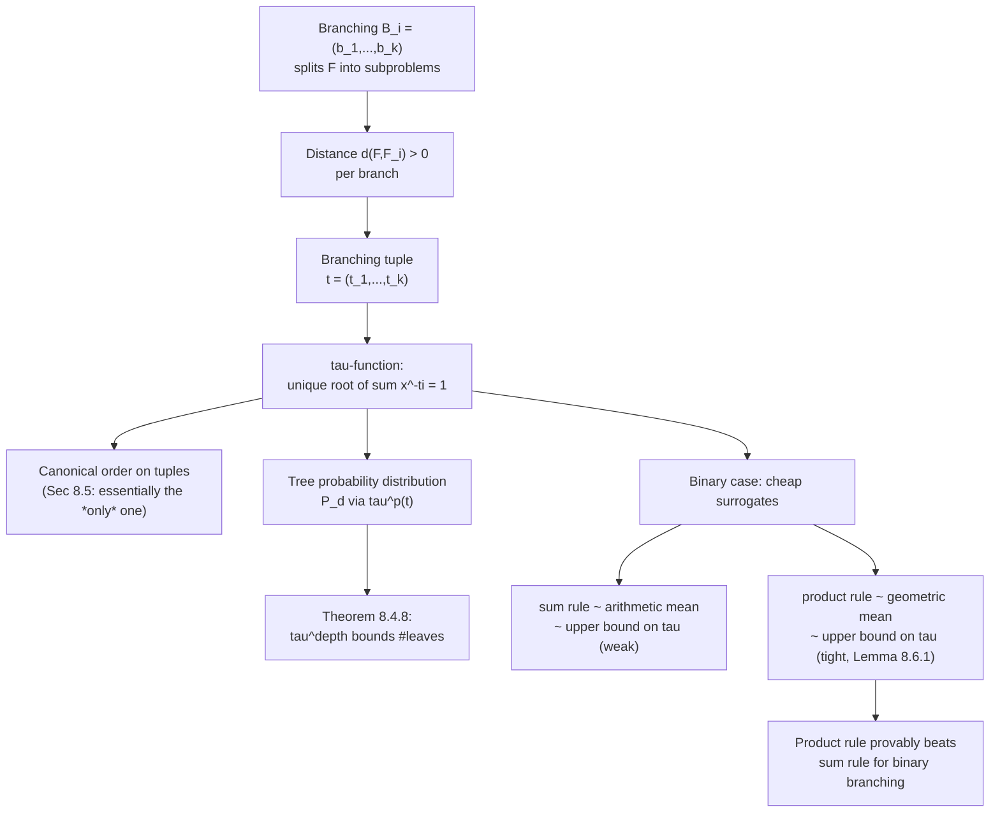

[[book-guidelines|↩ Back to guidelines]]

# Branching Heuristic Theory

## Why a *theory* of branching, and not just more heuristics

Every backtracking SAT solver eventually reaches a point where cheap, direct methods fail on a formula $F$, and it has to guess: pick a variable, split $F$ into subproblems along that variable's two (or more) values, and recurse. Which variable to pick is the single decision that dominates a look-ahead solver's runtime — a bad choice can blow up the search tree exponentially more than a good one, for the *same* formula. The obvious engineering response is to try candidate heuristics empirically and keep whatever wins benchmarks. That's exactly what the SAT community did for decades, and it produced real heuristics (DLIS, VSIDS, Jeroslow-Wang, MOMS, the `Diff`/`MixDiff` measures from look-ahead solvers) — but purely empirically, with no account of *why* one heuristic beats another beyond "it does, on these instances."

Kullmann's chapter asks a sharper question: strip away the SAT-specific plumbing (CNF, unit propagation, clauses) and ask what a branching decision *is*, in the abstract, and what it would mean for one branching to be *provably* better than another. The payoff is that a folklore rule everyone uses — "when comparing two candidate branches, multiply their scores, don't add them" — turns out to have an actual proof behind it, not just a decade of benchmark wins. That's the throughline of this chapter: replace "heuristic that happens to work" with "heuristic that is forced by a theorem," wherever that's possible.

**What breaks without this theory:** without it, you're stuck comparing heuristics only by running them — you can't reason about *why* a candidate distance function or combination rule is good, so you can't transfer insight from one problem domain to another, and you can't tell principled improvements apart from lucky overfitting to a benchmark set.

## Branching tuples: forgetting everything except the numbers

Consider a node in the search tree where the solver has $m$ candidate ways to split the current problem $F$. Kullmann's framework doesn't ask you to compare the branchings $F \leadsto F_1, \ldots, F_k$ directly (as full sub-formulas); instead each branch $i$ is scored by a **distance** $d(F, F_i) > 0$ — a positive real number estimating how much "simpler" $F_i$ is. Collecting these scores for one branching gives a **branching tuple**

$$t = (t_1, \ldots, t_k) \in (\mathbb{R}_{>0})^k.$$

This is a genuine abstraction step: two branchings that look completely different at the CNF level (different variables, different clause structure) become *the same object* — the same tuple — once you've extracted their distances. The book's own worked example makes the comparison concrete: given three candidate branchings with tuples

$$a = (2,2), \qquad b = (3,3,4,9), \qquad c = (4,5,6,6,5,6),$$

which one is "best"? Eyeballing raw tuples doesn't scale — you need a single number per tuple that you can rank by. That's the job of the **canonical projection function** $\tau$.

### The $\tau$-function

Define, for a branching tuple $t$ and $x \in \mathbb{R}_{>0}$,

$$\chi(t, x) := \sum_{i=1}^{|t|} x^{-t_i}.$$

For fixed $t$, $\chi(t, -)$ is strictly decreasing in $x$, starts at $\chi(t,1) = |t|$, and tends to $0$ as $x \to \infty$ — so by the intermediate value theorem there is a *unique* $x_0 \geq 1$ with $\chi(t, x_0) = 1$. That unique root is $\tau(t)$:

$$\tau : \mathrm{BT} \to \mathbb{R}_{\geq 1}, \qquad \tau(t) := x_0 \text{ such that } \chi(t)(x_0) = 1.$$

**Smaller $\tau$-value means a better branching tuple** (intuitively: a branching whose sub-distances are individually large lets $\chi$ hit $1$ at a smaller $x$). This single convention — smaller is better — is what turns "compare three arbitrary tuples of different lengths" into "compare three real numbers."

For the toy Fibonacci-style example that opens the chapter — a branching that removes $1$ unit of complexity on one branch and $2$ on the other, tuple $(1,2)$ — you're solving $x^{-1} + x^{-2} = 1$, i.e. $x^2 - x - 1 = 0$, whose positive root is the golden ratio $\varphi = \tfrac{1+\sqrt5}{2} \approx 1.618$. That's not a coincidence: worst-case bounds on branching algorithms with recurrences like $f_n = f_{n-1} + f_{n-2}$ are exactly $\tau$-values in disguise, and $\tau$ generalizes that "solve the characteristic equation" trick to branchings of arbitrary width and non-integer distances.

Running the machinery on the three tuples above:

$$\tau(a) = 1.4142\ldots, \qquad \tau(b) = 1.4147\ldots, \qquad \tau(c) = 1.4082\ldots$$

So $c$ is best, then $a$, then $b$ — and notice this ranking is *not* what you'd get from comparing sums ($a$: 4, $b$: 19, $c$: 32 — sum says $c$ worst) or averages naively; $\tau$ is doing something structurally different from either.

Some basic algebraic facts about $\tau$ (Lemma 8.3.1 in the source) are worth internalizing because they pin down what "canonical" buys you:

1. $\tau(\lambda \cdot t) = \tau(t)^{1/\lambda}$ — rescaling all distances by a constant factor rescales $\tau$ predictably, it doesn't change the *ranking* of two tuples scaled by the same $\lambda$.
2. $\tau_k(1,\ldots,1) = k$ — a $k$-way branching where every branch removes exactly one unit of "progress" has $\tau = k$; this recovers the naive worst-case bound "branching factor $k$" as a special case.
3. $\tau_k$ is strictly decreasing in each coordinate and symmetric — order of branches doesn't matter, and improving any single branch's distance strictly helps.
4. $|t|^{1/\max(t)} \leq \tau(t) \leq |t|^{1/\min(t)}$ — $\tau$ is sandwiched between bounds derived from the worst and best individual branch, so it never contradicts the "obvious" cases.

$\tau$ also turns out to induce a **generalized mean** $T_k(t) := \log(k) / \log(\tau(t))$ — a value that sits between the harmonic and arithmetic means of $t$ (specifically $M_{2-k}(t) \leq T_k(t) \leq A(t)$, with $G(t) \leq T_2(t) \leq A(t)$ for binary tuples) — which is the technical bridge that makes Section 8.6's product-vs-sum result provable rather than just plausible.

**What breaks without $\tau$:** without a canonical projection, comparing a 2-way branching against a 6-way branching is apples-to-oranges — you'd need an ad hoc rule for every branching width, and there'd be no way to argue that rule is "correct" rather than merely convenient.

```rust
/// A branching tuple: distances for each branch of a candidate split.
/// Values must be strictly positive.
#[derive(Debug, Clone)]
struct BranchingTuple(Vec<f64>);

impl BranchingTuple {
    /// chi(t, x) = sum_i x^{-t_i}
    fn chi(&self, x: f64) -> f64 {
        self.0.iter().map(|&ti| x.powf(-ti)).sum()
    }

    /// tau(t): the unique root >= 1 of chi(t, x) = 1, via Newton's method.
    /// The book recommends the lower bound |t|^(1/A(t)) as the initial
    /// guess, which guarantees monotone convergence (Corollary 8.3.5).
    fn tau(&self) -> f64 {
        let k = self.0.len() as f64;
        let mean_a = self.0.iter().sum::<f64>() / k;
        let mut x = k.powf(1.0 / mean_a); // initial guess |t|^(1/A(t))

        for _ in 0..100 {
            let f = self.chi(x) - 1.0;
            // d/dx [x^{-t_i}] = -t_i * x^{-t_i - 1}
            let df: f64 = self.0.iter().map(|&ti| -ti * x.powf(-ti - 1.0)).sum();
            let x_next = x - f / df;
            if (x_next - x).abs() < 1e-12 {
                return x_next;
            }
            x = x_next;
        }
        x
    }
}

/// Rank candidate branchings at a search-tree node: smaller tau is better.
fn best_branching(candidates: &[BranchingTuple]) -> usize {
    candidates
        .iter()
        .enumerate()
        .min_by(|(_, a), (_, b)| a.tau().partial_cmp(&b.tau()).unwrap())
        .map(|(i, _)| i)
        .unwrap()
}
```

Checking this against the book's numbers: `BranchingTuple(vec![2.0, 2.0]).tau()` should land near `1.4142`, and the width-4 and width-6 tuples near `1.4147` / `1.4082` respectively — this is exactly the kind of small, self-checking sketch worth writing before trusting a projection function inside a real solver.

## Estimating enumeration tree size

Ranking branchings is only useful if $\tau$ actually predicts something about the resulting search tree. Section 8.4 supplies that link, and it's the part of the chapter that turns $\tau$ from "a plausible scoring function" into "a quantity with an operational meaning: the expected number of leaves."

The construction is a small piece of applied probability. Given a finite rooted tree $T$ (the enumeration/search tree), attach to every edge $(v,w)$ a transition probability $P((v,w))$ such that the outgoing probabilities at each inner node sum to $1$. This induces a probability distribution over the *leaves* of $T$: a leaf $v$ at depth $d(v)$ gets probability $\mathcal P(v) = \prod_{i=0}^{d(v)-1} P(\text{edge}_i)$, the product of probabilities along the root-to-$v$ path.

Here's the elegant fact (Lemma 8.4.1), a direct consequence of $E(P^{-1}) = \sum_\omega P(\omega)\cdot P(\omega)^{-1} = |\Omega|$ for any finite probability space: if you treat "$1/\mathcal P(v)$" as a random variable over leaves $v$, its **expected value is exactly the number of leaves** in the tree:

$$\min_{v \in \mathrm{lvs}(T)} \mathcal P(v)^{-1} \;\leq\; \#\mathrm{lvs}(T) \;=\; E(\mathcal P^{-1}) \;\leq\; \max_{v \in \mathrm{lvs}(T)} \mathcal P(v)^{-1}.$$

So: sample a single random root-to-leaf path (using the transition probabilities), take the reciprocal of that path's probability, and you have an *unbiased estimator* of the tree's total leaf count — no need to enumerate the tree. And the bounds coincide exactly (zero variance) precisely when the distribution is **uniform on the leaves** — a fact captured by the unique **canonical tree probability distribution** $\mathrm{CP}_T((v,w)) = \#\mathrm{lvs}(T_w)/\#\mathrm{lvs}(T_v)$, which every finite tree possesses.

Now plug $\tau$ into this machine. Given a **distance** $d$ on tree edges (any positive real weight — typically $d(u,v) = \mu(u) - \mu(v)$ for some complexity measure $\mu$), at each inner node $v$ its outgoing edges form a branching tuple $d(v)$, and $\tau$ canonically converts that into a probability distribution:

$$P_d((v, v_i)) := \tau^p(d(v))_i, \quad \text{where } \tau^p(a)_i := \tau(a)^{-a_i}$$

(this $\tau^p(a)$ is exactly the quantity that made $\chi(t, \tau(t)) = 1$ in the first place — the branch probabilities are literally the terms of the defining equation). Bounding the $\tau$-values across all inner nodes then gives **Theorem 8.4.8**, the chapter's central result:

$$(\min\tau(d))^{\min\Sigma d(r)} \;\leq\; \#\mathrm{lvs}(T) \;\leq\; (\max\tau(d))^{\max\Sigma d(r)},$$

i.e., a worst-case-style bound of the classic form "(branching factor)$^{\text{depth}}$" — except the "branching factor" here is a rigorously derived $\tau$-value rather than a naive count of children, and it holds even when different branches make unequal progress. This is precisely the generalization of the Fibonacci-style recurrence-equation bound from Section 8.2's example, now proven for arbitrary trees and arbitrary distances instead of one hand-solved recurrence.

**What breaks without this:** without Theorem 8.4.8, the only way to bound a search tree's size is to solve a bespoke recurrence equation by hand for every new branching pattern — exactly what SAT theorists did before this chapter (Fibonacci-type recurrences for every new case-split rule). The $\tau$-machinery replaces "solve a new recurrence" with "look up $\tau$ of the local branching tuples," a mechanical and composable operation.

```python
# Quick sanity check: sample-based estimate of #leaves via canonical
# probability, versus a naive full enumeration, on a toy binary tree.
import random

def sample_estimate(tree, root, trials=20000):
    """tree: dict node -> list of (child, prob). Returns E[1/P(leaf)]."""
    total = 0.0
    for _ in range(trials):
        node, path_prob = root, 1.0
        while tree.get(node):
            child, prob = random.choices(
                tree[node], weights=[p for _, p in tree[node]]
            )[0]
            node, path_prob = child, path_prob * prob
        total += 1.0 / path_prob
    return total / trials
```

## The product rule versus the sum rule

The general theory (culminating in Section 8.5's canonicity result, which shows $\tau$'s induced ordering is — under mild axioms — the *only* consistent way to compare branching tuples of arbitrary width) is powerful but numerically expensive: computing $\tau$ exactly requires a root-finding iteration (Newton's method, as in the Rust sketch above) at *every* candidate branching, at *every* node of the search tree. Practical look-ahead solvers can't afford that in the innermost loop, so they fall back to cheap approximations — and this is where the empirically discovered "product rule" versus "sum rule" question lives.

For a **binary** branching tuple $(a_1, a_2)$ — the dominant case in practical SAT solving, since most solvers branch on a single Boolean variable — two obvious cheap surrogates for $\tau$ suggest themselves:

- Maximize the **arithmetic mean** $A(a_1, a_2) = \tfrac{a_1+a_2}{2}$, equivalently maximize the **sum** $a_1 + a_2$.
- Maximize the **geometric mean** $G(a_1, a_2) = \sqrt{a_1 a_2}$, equivalently maximize the **product** $a_1 \cdot a_2$.

Both are cheap (no root-finding), and both are monotonically related to bounds on $\tau$ via the standard mean inequality $H \leq G \leq T_2 \leq A$ (harmonic $\leq$ geometric $\leq$ the canonical $\tau$-mean $\leq$ arithmetic — Corollary 8.3.5). Practically, decades of experiments settled the question empirically: **the product rule wins, and the sum rule loses badly**, universally. Section 8.6 supplies the *reason*, not just the observation:

> Maximizing the sum $a_1+a_2$ means maximizing $A(a_1,a_2)$, which is an **upper bound** on $T_2$ — so maximizing it minimizes a *lower* bound on $\tau$. Maximizing the product $a_1\cdot a_2$ means maximizing $G(a_1,a_2)$, a **lower** bound on $T_2$ — so maximizing it minimizes an *upper* bound on $\tau$.

Since $\tau$ itself is what you actually want small (Theorem 8.4.8 says small $\tau$ directly bounds tree size from above), **minimizing an upper bound on $\tau$ is meaningful — it gives you a guarantee — while minimizing a lower bound on $\tau$ tells you nothing about the true value**. That asymmetry, not folklore, is why the product rule is the right cheap approximation and the sum rule is not.

The chapter sharpens this into a quantitative statement, Lemma 8.6.1:

$$A(a_1,a_2) - T(a_1,a_2) \;\geq\; T(a_1,a_2) - G(a_1,a_2),$$

with equality only when $a_1 = a_2$. In words: **the geometric mean (product rule) sits closer to the true $\tau$-mean than the arithmetic mean (sum rule) does** — the product isn't merely "on the correct side," it's the tighter approximation of the two, provably.

One more subtlety worth keeping: the product rule is *only* sound for binary tuples. Its ∞-domination property (if one branch distance $\to \infty$, the product $\to \infty$ regardless of the other branch) directly contradicts $\tau$'s ∞-ignoring behavior for wider tuples (a single excellent branch in a wide branching doesn't make the whole branching excellent — $\tau$ correctly discounts it, the product incorrectly rewards it). So "always multiply" is a fact about pairs, not a general principle — a distinction the chapter is careful to prove rather than gloss over. It also means (1,5) and (2,3) are $\tau$-equivalent as binary branching tuples but the product rule strictly prefers (2,3) — the product rule has a systematic bias toward *balanced* branchings that the canonical order doesn't share, which is itself informative about what practitioners are implicitly optimizing for when they use it.

## Structure of the chapter's argument



## Where this leads

Inside this handbook, this chapter is the theoretical justification underlying practices introduced empirically in **Chapter 5 (look-ahead solvers)** — the `Diff`/`MixDiff` heuristics there, which explicitly multiply reductions across the two branches (e.g. $1024\cdot LR + L + R$), are concrete instances of the product rule this chapter proves is the right cheap surrogate for $\tau$. It also underlies worst-case deterministic upper-bound results for $k$-SAT (mentioned in Chapter 1's refinements), which are exactly instances of Theorem 8.4.8 applied by hand to specific case-split recurrences.

For the broader project of building a Rust-based verifier with an embedded CSP kernel for counterexample search: this chapter's machinery is directly transferable to **any branch-and-bound or backtracking search**, not just SAT. If your CSP kernel searches for a counterfact (a concrete assignment violating a refinement-type invariant) by case-splitting on domain values — exactly the kind of enumeration tree this chapter formalizes — then:

- $\tau$ gives you a principled way to choose *which* variable/domain-split to branch on next, rather than an ad hoc ordering heuristic, whenever your branch-distance estimates (e.g. domain-size reduction under a candidate split, analogous to unit-propagation-driven distance here) can be quantified per branch.
- Theorem 8.4.8 gives you an *a priori* bound on how large the counterexample-search tree can get before you commit to exploring it — useful for deciding when to give up on a bounded search and fall back to an abstract-interpretation over-approximation (the CEGAR-style trade-off your project already anticipates), since a large predicted $\tau^{\mathrm{depth}}$ bound is itself a signal that concrete search is the wrong tool for this particular guard.
- The product-vs-sum result is a cautionary, transferable lesson for any future branching heuristic you hand-design in the proof-search or CSP components: prefer combination rules that are provably tied to an upper bound on the relevant complexity measure, not ones that are merely "the additive-feeling default." The chapter's method — find the mean-inequality structure, check which side of the canonical value your cheap surrogate lands on — generalizes past this one binary-branching case.

This is a purely combinatorial/optimization argument, not a type-theoretic one — so unlike topics elsewhere in this vault, there is no direct Lean-elaborator correspondence to draw here (no unification, no definitional equality). The one place proof-assistant practice rhymes with it: Lean's well-founded recursion requires a *decreasing measure* on each recursive call, which is structurally the same idea as this chapter's distance $d(u,v) = \mu(u)-\mu(v)$ on tree edges — both are "prove termination/boundedness by exhibiting a measure that provably shrinks," just applied to a compiler's termination checker versus a solver's tree-size bound.

Sections 8.7–8.10 of this same chapter (not covered here — they lie outside this topic's three subtopics) go on to survey the *concrete* distance functions used by real look-ahead solvers and how to improve them empirically; this article stops at the general theory that justifies why those concrete choices take the shape they do.
