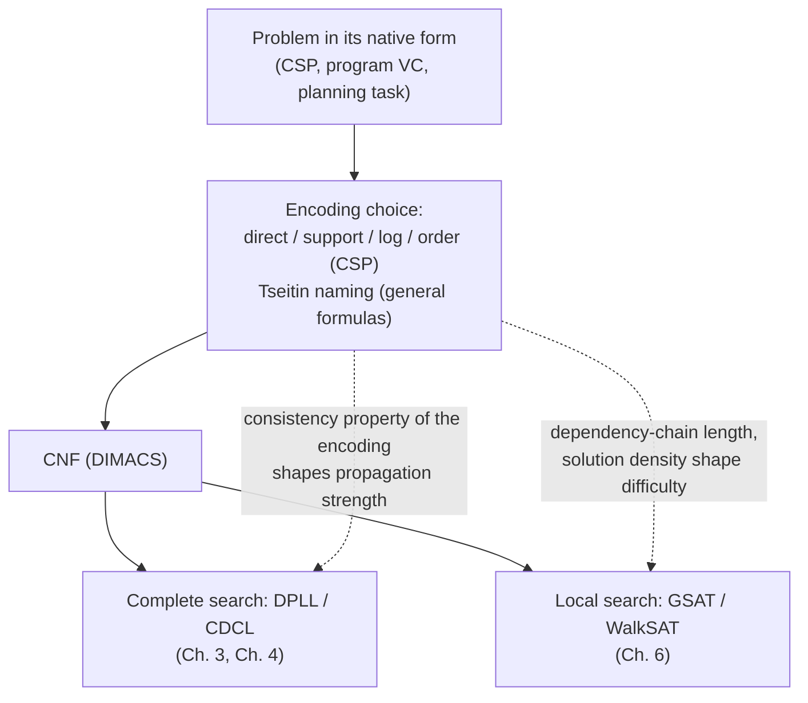

# CNF Encodings

[[book-guidelines|↩ Back to guidelines]]

## Why this chapter exists

A SAT solver only ever sees one shape of input: a conjunction of clauses, each clause a disjunction of literals — $\bigwedge_i c_i$ where each $c_i = \bigvee_j l_j$. But almost nothing you actually want solved — a scheduling problem, a graph coloring, a circuit — arrives in that shape. Somebody (you, or a compiler) has to *transform* the real problem into CNF first. That transformation step is invisible in most SAT theory, which assumes the CNF is just given, and yet Prestwich opens the chapter with the chapter's real thesis: **the choice of encoding can be as important as the choice of solver.** Two logically equivalent CNFs — same solutions, same answer to "SAT or UNSAT" — can differ by orders of magnitude in how fast a solver processes them. This is the encoding layer, and it's an art with few reliable guidelines, which is exactly why the chapter is organized as a survey of *techniques and case studies* rather than a single decision procedure.

If you're building a verifier or an elaborator, this chapter is the layer directly beneath "generate a Horn clause / verification condition" and "hand it to a SAT/SMT backend" — every choice discussed here (whether to introduce an auxiliary variable, whether to expand a formula or name its subformula) is a choice your constraint-generation pass will also have to make.

## 1. General transformation to CNF

### Naive Boolean algebra: correct, but explosive

You can always turn an arbitrary propositional formula into CNF by repeatedly applying distributivity, De Morgan's laws, and implication-elimination — the same rules you'd use by hand. The book's worked example:

$$(a \to (c \wedge d)) \vee (b \to (c \wedge e))$$

decomposes implications, distributes $\vee$ over $\wedge$, rewrites $\to$ as $\vee$, and after removing subsumed clauses lands on:

$$(a \vee b \vee c) \wedge (\overline{a} \vee \overline{b} \vee d \vee e)$$

(Using overline for negation to match the book's clause style; the source uses $\bar v$ for "not $v$".) This example happens to compress nicely, but in general **pure Boolean-algebra transformation is exponential** — distributing $\vee$ over a conjunction of $n$ disjuncts each of size $k$ can blow the clause count up combinatorially. This is the "what breaks without it" case for the next idea.

### The Tseitin encoding: naming your way to linearity

The fix, due to Tseitin, is to stop expanding and start **naming**. For every subformula of the original formula, introduce one new Boolean variable defined to be logically equivalent to that subformula ($f \leftrightarrow \text{subformula}$), and clausify *that* definition instead of the whole tree at once. Because each definition only ever touches the size of one subformula (not the whole formula), the total encoding grows *linearly* in the size of the original formula, at the cost of a linear number of new variables. Critically, the result is only **equisatisfiable**, not logically equivalent, to the original — same answer to "is there a satisfying assignment," but not the same solution space, because the new $f$ variables are free to be assigned however is consistent.

Working through the book's running example: introduce $f_1 \leftrightarrow (c \wedge d)$ for the first conjunction. A biconditional $f \leftrightarrow (x \wedge y)$ clausifies into exactly three clauses:

$$(\overline{f} \vee x) \wedge (\overline{f} \vee y) \wedge (\overline{x} \vee \overline{y} \vee f)$$

(the two "$\to$" directions of the AND-gate, plus the "$\leftarrow$" direction). Repeat for $f_2 \leftrightarrow (c \wedge e)$, then $f_3 \leftrightarrow (a \vee f_1)$ and $f_4 \leftrightarrow (b \vee f_2)$ for the outer disjunctions, and finally $f_5 \leftrightarrow (f_3 \vee f_4)$ to tie the whole formula to a single "top" variable. Each step is a fixed, mechanical, small clausification pattern for AND, OR, NOT, NAND, NOR, and IMPLIES gates — this is exactly why Tseitin is "mechanisable": it's a structural recursion over the formula's AST, one gate type at a time.

**Grounding (Rust):** this recursion is a natural fit for an AST-walking compiler pass. Model the formula as an enum, and Tseitin transformation as a fold that both allocates a fresh variable per node and emits its defining clauses:

```rust
enum Formula {
    Var(Lit),
    And(Box<Formula>, Box<Formula>),
    Or(Box<Formula>, Box<Formula>),
    Not(Box<Formula>),
}

struct Tseitin {
    next_var: u32,
    clauses: Vec<Vec<i32>>, // DIMACS-style signed ints
}

impl Tseitin {
    fn fresh(&mut self) -> i32 {
        self.next_var += 1;
        self.next_var as i32
    }

    // returns the literal representing `f`, emitting clauses that define it
    fn tseitin(&mut self, f: &Formula) -> i32 {
        match f {
            Formula::Var(l) => *l,
            Formula::And(a, b) => {
                let (la, lb) = (self.tseitin(a), self.tseitin(b));
                let fv = self.fresh();
                self.clauses.push(vec![-fv, la]);
                self.clauses.push(vec![-fv, lb]);
                self.clauses.push(vec![-la, -lb, fv]);
                fv
            }
            Formula::Or(a, b) => {
                let (la, lb) = (self.tseitin(a), self.tseitin(b));
                let fv = self.fresh();
                self.clauses.push(vec![-fv, la, lb]);
                self.clauses.push(vec![-la, fv]);
                self.clauses.push(vec![-lb, fv]);
                fv
            }
            Formula::Not(a) => -self.tseitin(a),
        }
    }
}
```

This is precisely the shape a compiler's "lower verification condition to SAT/SMT clauses" pass takes, and it generalizes directly: any tool emitting CHCs (constrained Horn clauses) from a program's control-flow graph is doing a Tseitin-style naming of intermediate predicates (loop invariants, path conditions) rather than inlining everything into one giant formula.

The book notes two pragmatic refinements worth keeping in mind for a real implementation: you don't have to name *every* subformula (if $(f_3 \vee f_4)$ is already clausal, skip naming $f_5$ and just emit the clause directly), and conversely you can choose to *expand* rather than name some non-clausal subformulae if that's cheaper.

### Polarity: when you only need half the biconditional

Here's the chapter's sharpest optimization, and it recurs later as a full worked example (Section 2.3.2 below). A biconditional $f \leftrightarrow \phi$ clausifies into *two* directions: $f \to \phi$ and $\phi \to f$. But if the subformula $\phi$ only ever occurs **positively** in the enclosing formula (under an even number of negations) or only **negatively** (odd number), you only need the direction that's actually load-bearing for correctness — the other direction can be dropped without changing satisfiability. This is a genuine soundness-sensitive optimization: get the polarity wrong and you silently under- or over-constrain the formula. It's the encoding-level analogue of variance in a type system (covariant/contravariant positions only need one direction of a subtyping check) — worth flagging for anyone building a constraint generator, since the same "which direction of an implication do I actually need here" question shows up when generating verification conditions from Hoare triples: a precondition position and a postcondition position are not symmetric, and over-generating both directions is exactly the kind of unnecessary clause bloat this chapter is warning about.

### Don't-care variables and CNF's hidden structure loss

A quieter but important observation: **CNF transformation loses structural information**, and some of that lost information is provably intractable to recover from the CNF alone. The book's illustration: given $X \vee (p \wedge q)$ where $X$ is a large unsatisfiable subformula, Tseitin introduces $x \leftrightarrow X$, $y \leftrightarrow (p \wedge q)$, $z \leftrightarrow (x \vee y)$. If DPLL happens to set $y, z$ true first (forcing $p, q$ true), then sets $x$ false, it only needs to falsify $X$ — cheap. But if it sets $x$ true, it's forced into potentially exponential search to refute $X$ before backtracking. Under the assignment where $x$ has been fixed, the variables *inside* $X$ have become **don't-care** (unobservable): their values no longer affect satisfiability, but the solver doesn't know that from the CNF alone — it has to discover it by search. This is a direct analogue of dead-code / unreachable-branch elimination in a compiler, except the "unreachability" here is a semantic fact about the current partial assignment, not a static syntactic one — closer to what an abstract interpreter's reachability analysis is trying to establish about program paths under an accumulated path condition.

### 3-CNF: a completeness proof, not really a practical tool

Any CNF can be mechanically rewritten into 3-CNF (exactly 3 literals per clause) via auxiliary variables — split a long clause $(z_1 \vee \dots \vee z_k)$ into a chain $(z_1 \vee z_2 \vee y_1), (\overline{y_1} \vee z_3 \vee y_2), \dots$ This is how you prove SAT is NP-complete by reduction from CNF-SAT to 3-CNF-SAT, but Prestwich is candid that it has little practical use beyond benchmark generation or feeding 3-CNF-only algorithms.

## 2. From CSP to SAT: extensional encodings

Many combinatorial problems are naturally modeled first as a **constraint satisfaction problem** — finite-domain variables $v_1, \dots, v_n$, each with domain $\text{dom}(v_i)$, plus constraints prohibiting (or allowing) certain combinations — and only then encoded into SAT. This two-stage modeling is common enough that the chapter treats CSP-to-SAT encoding as its own topic, independent of the general Tseitin machinery above.

### Direct (sparse) encoding

The default choice: one SAT variable $x_{v,i}$ per (CSP variable, domain value) pair, true iff $v = i$. Three families of clauses:

- **At-least-one** (every CSP variable gets some value): $\bigvee_i x_{v,i}$
- **At-most-one** (no CSP variable gets two values): $(\overline{x_{v,i}} \vee \overline{x_{v,j}})$ for $i \ne j$
- **Conflict clauses** (encode the actual constraints): $(\overline{x_{v,i}} \vee \overline{x_{w,j}})$ for each prohibited pair

On the book's two-vertex, three-color graph-coloring example, this gives 2 at-least-one clauses, 6 at-most-one clauses, and 3 conflict clauses (one per matching color, since $v \ne w$ forbids each shared color).

### Support encoding

A refinement (binary CSPs only): replace conflict clauses with **support clauses**. For each value $j \in \text{dom}(w)$, let $S_{v,j,w}$ be the set of values in $\text{dom}(v)$ that are compatible with $w=j$. The support clause says: if $w=j$, then $v$ must take *one of its supporting values*:

$$\overline{x_{w,j}} \vee \bigvee_{i \in S_{v,j,w}} x_{v,i}$$

This is strictly more informative per clause than a conflict clause (it enumerates what *is* allowed, not just one thing that isn't), and empirically it tends to propagate better — the chapter later ties this to a formal consistency property (arc consistency, Section 2.4.2 below).

### Log encoding

Instead of one SAT variable per domain value, use $\lceil \log_2 |\text{dom}(v)| \rceil$ bit-variables $x_{b,v}$ per CSP variable, exponentially reducing variable count. A conflict on $[p{=}2, q{=}1]$ (domains $\{0,1,2\}$, 2 bits each) becomes a single clause over the bit-literals: $(\overline{x_{0,p}} \vee x_{1,p} \vee x_{0,q} \vee \overline{x_{1,q}})$. No at-least/at-most-one clauses are needed (a bit-pattern *is* a value), but if the domain size isn't a power of two you must add clauses forbidding the unused bit patterns.

### Order encoding — the one with a tractability guarantee

For CSPs over **integer linear constraints**, a fundamentally different representation: a SAT variable $v_{x,a}$ represents the *primitive comparison* $x \le a$, not "$x$ equals some specific value." Other linear constraints get compiled down to combinations of these primitive comparisons. The order relation itself needs axiom clauses tying consecutive bounds together: $(v_{x,a} \vee \overline{v_{x,a+1}})$ — i.e., if $x > a+1$ then certainly $x > a$.

This is the encoding the chapter singles out with a genuine theorem: [PJ11] proved the order encoding **transforms a tractable CSP into a tractable SAT instance**, a preservation-of-tractability property the direct and log encodings don't share. The reason connects to how the earlier encodings represent equality-typed atoms ($x=i$) rather than order-typed atoms ($x \le a$): order constraints compose along a shared total order, so bounding one variable propagates cleanly to bounds on related variables, in a way that discrete value-equality atoms don't. This is worth pausing on if you're building a CSP kernel for refinement-type counterexample search over integer/interval domains, per your project's stated goals — it's a concrete instance of the general principle that *which primitive relation you choose to represent as an atom* determines whether propagation stays polynomial, exactly analogous to choosing interval/octagon/polyhedra domains in abstract interpretation for the same reason: the abstract domain's own algebraic structure (a lattice under the *same* order you're reasoning about) is what makes join/widening tractable. The order encoding is, in a real sense, SAT borrowing the interval-domain idea one layer down.

## 3. Intensional constraints: at-most-one, cardinality, parity

Some constraints are naturally stated as a *rule* over a variable set rather than as a list of prohibited combinations — "intensional" rather than "extensional." The chapter uses **at-most-one** as its running example of how many ways a single constraint can be encoded, each with different size/propagation tradeoffs:

| Encoding | New vars | Clauses | Best for |
|---|---|---|---|
| Pairwise | 0 | $O(n^2)$: $(\overline{x_i} \vee \overline{x_j})$, $i<j$ | small $n$ |
| Ladder | $O(n)$ | $O(n)$: validity $(\overline{y_{i+1}} \vee y_i)$ + channelling $x_i \leftrightarrow (\overline{y_{i-1}} \wedge y_i)$ | large $n$, DPLL |
| Binary/bitwise | $O(\log n)$ | $O(n \log n)$ | large $n$, local search |
| Commander / product / bimander | varies | partitions the variables under commander/recursive-product structure | very large $n$ |

The pattern generalizes: **cardinality constraints** ("at most/least $k$ of $n$ true") get sequential-counter or parallel-counter encodings (Sinz), or sorting-network-based encodings; **pseudo-Boolean constraints** $\sum_i w_i x_i \le k$ generalize further and are handled via arithmetic circuits, BDDs, or sorting networks; and the **parity constraint** $(\bigoplus_i v_i) \leftrightarrow p$ (true iff an even number of the $v_i$ are true) gets a linear decomposition chaining auxiliary variables $f_j$: $(v_1 \oplus f_1) \leftrightarrow p$, $(v_2 \oplus f_2) \leftrightarrow f_1$, …, avoiding the naive exponential enumeration of all truth-value combinations.

**Grounding (Rust) — the ladder encoding as a compact at-most-one:** if you're emitting SAT/SMT constraints from a refinement-type checker's "exactly one branch of this match is taken" obligation, the ladder encoding is the practical default once $n$ grows past a handful of arms:

```rust
fn ladder_at_most_one(vars: &[i32], fresh: &mut impl FnMut() -> i32) -> Vec<Vec<i32>> {
    let n = vars.len();
    let ys: Vec<i32> = (0..n - 1).map(|_| fresh()).collect();
    let mut clauses = vec![];
    for i in 0..n - 2 {
        clauses.push(vec![-ys[i + 1], ys[i]]); // y_{i+1} -> y_i  (ladder validity)
    }
    for i in 0..n {
        // x_i <-> (not y_{i-1}) and y_i, boundary cases handled with sentinels
        // (clausify the biconditional per the AND/OR patterns above)
    }
    clauses
}
```

## 4. The DIMACS file format

A minimal, purely syntactic convention from the 1993 DIMACS Challenge, and it's the reason SAT benchmarking and solver competitions became possible at all — a shared file format did for SAT what a shared IR does for compilers: it decoupled *problem generation* from *solver implementation*. The format:

- Comment lines start with `c`.
- One preamble line: `p cnf <variables> <clauses>` — declares the variable count and clause count; variables are numbered $1 \dots \text{variables}$.
- Each clause is a whitespace-separated list of nonzero signed integers terminated by `0`; a positive integer $i$ is the literal $v_i$, negative $-i$ is $\overline{v_i}$. Clauses may span multiple lines; clause order and literal order within a clause are irrelevant.

Example: `1 5 -8 0` encodes $(v_1 \vee v_5 \vee \overline{v_8})$.

If your compiler's backend talks to an external SAT/SMT solver via subprocess or a C FFI binding, DIMACS (or its close cousin, SMT-LIB2 for SMT) is very likely the literal wire format your clause-generation pass has to emit — worth treating as more than historical trivia.

## 5. Case studies: what "modeling as an art" looks like in practice

### N-queens: the same problem, nine models

Nadel's classic paper models n-queens nine different ways (Q1–Q9). The chapter uses this to make a structural point: even a *fixed CSP* doesn't determine a unique SAT encoding, because there's a prior choice of **which problem feature becomes a variable**:

- **Q1/Q2**: one CSP variable per row (or column), domain = the other axis; direct-encode this CSP.
- **Q6**: one Boolean variable per *board square*, directly SAT (no CSP intermediate) — almost equivalent to the direct encoding of Q1/Q2 but arrived at differently.
- **Q5**: one CSP variable per *queen*, domain = squares on the board — introduces $O(n!)$ symmetry (any permutation of which queen is "queen 1" is an equally valid solution), which then has to be explicitly broken with ordering clauses like $(\overline{v_{q,i,j}} \vee \overline{v_{q',i',j'}})$ for $q > q'$ and $(i,j) \prec (i',j')$.

Two lessons the book draws out explicitly, both are easy but consequential bugs to make when hand-rolling an encoding: (1) **duplicate clauses** — if you enumerate attacking square pairs without a total order $\prec$, you'll emit both $(v_{2,5} \vee v_{3,6})$ and $(v_{3,6} \vee v_{2,5})$, wasted but harmless; (2) **incorrectly combined orderings** — enforcing both $q < q'$ *and* $(i,j) \prec (i',j')$ together is actually *unsound*, because it silently drops legitimate attacking configurations depending on which queen happens to get the lower index. This second one is a real correctness bug, not just inefficiency, and it's the encoding-layer version of a classic bug class in any constraint-generation code: an ordering meant purely to avoid duplicate enumeration accidentally becomes load-bearing for correctness.

**Implied clauses** also appear here for the first time: a clause like "every column has a queen" is logically redundant given "every row has exactly one queen" *and* the no-two-in-a-column constraints together — but adding it anyway (despite being derivable) measurably speeds up both backtracking and local search. This is a useful mental model for verification-condition generation too: emitting a provably-redundant-but-cheap-to-check invariant alongside the "real" ones can speed up the downstream solver even though it adds nothing to the logical content.

### All-interval series (AIS): the polarity trick, worked in full

This is where "polarity" from Section 2.2.2 gets its complete demonstration. AIS: find a permutation of $\{0, \dots, n-1\}$ whose consecutive differences are all distinct. Model with $s_{i,j}$ (true iff position $i$ holds value $j$), and define $d_{i,k}$ (true iff the difference between positions $i, i+1$ is $k$) via:

$$d_{i,k} \leftrightarrow \bigvee_j (s_{i,j} \wedge s_{i+1,j\pm k})$$

A full Tseitin clausification needs both directions of this biconditional. But the subformula $\bigvee_j(s_{i,j} \wedge s_{i+1,j\pm k})$ **only ever occurs negatively** in the enclosing "distinct differences" formula (it's inside a clause of the form $\overline{d_{i,k}} \vee \overline{d_{i',k}}$-shaped disjunctions built from negated occurrences) — so only the $\leftarrow$ direction is logically necessary:

$$d_{i,k} \leftarrow \bigvee_j(s_{i,j} \wedge s_{i+1,j\pm k})$$

which clausifies to the simpler $(\overline{s_{i,j}} \vee \overline{s_{i+1,j\pm k}} \vee d_{i,k})$ — literally half the clauses of the full biconditional, for free, just by tracking where in the formula tree the subformula sits. The book is explicit that this is *sound only because of the polarity*, not a general shortcut — get the direction backwards and you either lose solutions or admit spurious ones.

The AIS example is also the chapter's fullest illustration of **implied clauses with unpredictable effects**: adding at-most-one clauses over the $d$ variables (redundant, since they're already forced by the permutation structure) had wildly different — sometimes very good, sometimes very bad — effects on local-search performance depending on which combination was added. There is no clean theory predicting this in advance; the chapter's honest conclusion is that this is discovered empirically, one problem at a time.

### Stable marriages: non-obvious variable definitions

The sharpest lesson on *choosing what a variable means*. The obvious model — one Boolean per (man, woman) pair, true if matched — works, but Gent et al.'s alternative is more compact and worth understanding precisely because it's counter-intuitive: $x_{i,p}$ is true iff man $i$ is matched to the woman in position $p$ **or later** in his preference list (a "threshold" reading, not a direct assignment reading). This lets rank comparisons ("does he do better than his current match") become simple unit implications $x_{i,p} \to x_{i,p+1}$ rather than requiring auxiliary arithmetic. The chapter flags a specific, easy-to-make error here: **omitting common-sense axioms**. The meaning you intend for $x_{i,p}$ ("matched at $p$ or later") only *becomes true* in the model if you explicitly assert the monotonicity clause $x_{i,p} \to x_{i,p+1}$ — nothing forces that meaning on the variable automatically. This generalizes directly to writing an SMT encoding of any data structure invariant (tree, DAG, sorted list): the axioms defining what a fresh uninterpreted predicate is *supposed to mean* have to be asserted explicitly, or the solver is free to find a model where your predicate means something else entirely and still satisfies every clause you wrote. This is precisely the discipline an elaborator or VC generator needs when introducing an auxiliary relation to stand in for a structural property — the property only holds in every model if you've actually written down the clauses that pin it down.

### Modeling for local search vs. DPLL: the same CNF, different pain points

The chapter's clearest evidence that "better encoding" is solver-relative, not absolute. Minimal-disagreement parity learning is easy for DPLL, hard for local search — traced to the standard parity encoding creating **long chains of variable dependency** ($f_j$ depends on $f_{j-1}$ depends on $f_{j-2}$…), which local search algorithms propagate through slowly (sometimes exponentially), while DPLL's structured backtracking isn't bothered by chain length in the same way. The fix for local search — decomposing one long parity constraint into several shorter ones tied together by extra summary variables $p_1, \dots, p_\beta$ — *increases* clause count yet *helps* local search, precisely because it shortens the dependency chains even at the cost of more structure overall. Towers-of-Hanoi-as-STRIPS-planning shows the same phenomenon from a different angle: local search benefits from higher solution density (allowing many partially-parallel plans rather than one serial plan) and from "short-circuiting" long-range dependencies (frame axioms linking distant time steps directly, not just adjacent ones).

## 6. What actually makes an encoding "good"? (Section 2.4)

The chapter's closing survey is deliberately anticlimactic, and that's the point: **no single metric determines encoding quality.**

- **Size** (clauses, literals, or variables) — smaller is usually better, but not reliably: a round-robin-tournament encoding with $O(n^6)$ clauses outperformed a more "compact" $O(n^4)$ one with auxiliary variables; the log encoding minimizes variables but performs poorly regardless.
- **Consistency properties** — what unit propagation achieves is a real, measurable structural property: the support encoding gives arc consistency for free via unit propagation; the direct encoding only gives the weaker forward checking; the log encoding weaker still. This is the same conceptual currency as an abstract interpreter's precision-vs-cost tradeoff between abstract domains — arc consistency is to CSP what a more precise abstract domain is to program analysis: strictly more pruning power per propagation step, at some representational cost.
- **Solution density** (solutions / $2^n$) — plausible-sounding ("more solutions should mean easier to find one"), and sometimes correlates with search cost, but the log encoding is a clean counter-example: it has *higher* density than the direct encoding yet performs *worse*.

The chapter's real conclusion, stated almost as a warning: **a good encoding for one algorithm can be a bad encoding for another.** Everything demonstrated in the case studies (parity learning, Towers of Hanoi, at-most-one variants, symmetry-breaking) cuts in opposite directions for DPLL versus local search. Tseitin-introduced auxiliary variables are a recurring villain for local search specifically (dependency chains slow propagation) but are largely harmless for DPLL (branching on them can simply be delayed until unit propagation resolves them). CNF encoding, in Prestwich's own words, "is an art" — proceeding by intuition and experimentation, informed but not determined by the catalogue this chapter provides.

## Where this leads



This chapter is the encoding layer that everything downstream in Part I of the handbook takes as given: CDCL (Chapter 4) reasons over the implication graph *of a CNF*, and that CNF's shape — how many auxiliary variables, how long the dependency chains, what consistency unit propagation achieves — was decided here. For your compiler project specifically: this is [[Runtime-Variation-and-Solver-Engineering#The mechanism|the mechanism]] you'll reuse verbatim whenever your elaborator or verifier bottoms out in a call to an external SAT or SMT solver. The Tseitin/polarity machinery is exactly what a "lower this verification condition to clauses" pass has to implement; the order encoding's tractability-preservation result is a direct precedent for choosing abstract domains that keep your CSP-based counterexample search polynomial rather than exponential; and the stable-marriage lesson about explicit axioms for an intended variable meaning is the same discipline your unifier will need whenever it introduces a fresh predicate or metavariable to stand in for a not-yet-resolved constraint — the predicate only means what you intend if you've written down the clauses that pin it down, not merely named it suggestively.
