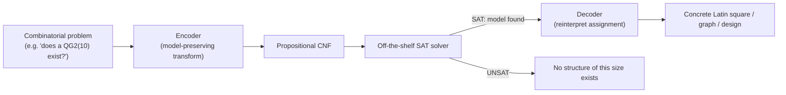
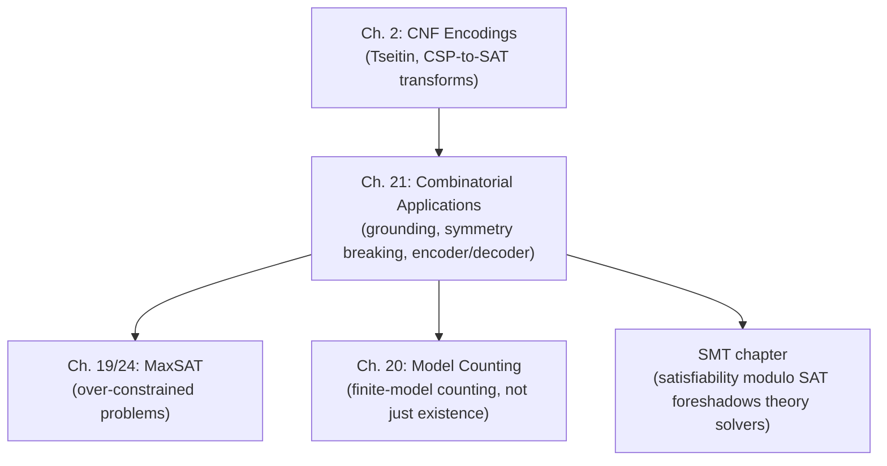

# Combinatorial Applications of SAT

[[book-guidelines|↩ Back to guidelines]]

## Why this chapter exists: SAT as a finite-model finder

Everywhere else in this handbook, SAT shows up as a *back end* — you already have a hard combinatorial problem (planning, verification, scheduling), you write an encoder, and the SAT solver's job is to be fast. This chapter is about something slightly different in spirit: an entire *branch of pure mathematics* — combinatorial design theory — that, since 1990, has been solved substantially *by treating open conjectures as SAT instances*. Not benchmarked on it. Not merely modeled by it. Actually decided, for the first time, by SAT.

Design theory asks questions like: does a $10\times10$ grid exist where every row and column is a permutation of $\{0,\dots,9\}$, and where two such grids never collide? Does an integer $n$ exist below which every red/blue coloring of a graph must contain a monochromatic clique? These are *finite model existence* questions — "does there exist a structure satisfying these axioms" — and finite model existence is exactly what a SAT solver decides, once you've committed to a domain size. The chapter's central historical claim is that this observation, once acted on with an actual implementation, let general-purpose model generators — software that had no idea what a Latin square *was* — outperform decades of special-purpose search programs written by design theorists themselves.

**What breaks without this framing.** A design theorist's traditional tool is a custom backtracking search, hand-tuned to one problem's structure (e.g. a program that knows Latin squares row-by-row and prunes using row/column conflicts directly). That's fast for the one problem it was built for, but every new conjecture needs a new program. The SAT-based alternative pays an upfront cost — translate the problem into propositional clauses at all — in exchange for reusing a single, continuously-improving search engine across every problem you'll ever encode. The chapter's opening argument is that the second cost turned out to be smaller than anyone expected, and the first benefit larger.

## The Mace-style pipeline: encoder → solver → decoder

The chapter names a specific architecture, after McCune's Mace system, that is the actual mechanism behind every result in it:



- **Encoder**: a *model-preserving* transformation — the original problem has a model of size $n$ if and only if the generated CNF is satisfiable. This is the "software" half of the pipeline, and the chapter treats it as the genuinely hard engineering problem (Section 21.3, below).
- **SAT solver**: completely generic. It knows nothing about quasigroups, graphs, or magic squares — it just decides satisfiability of a set of clauses. This is the "hardware" half, and it's exactly what SAT research elsewhere in the handbook (CDCL, look-ahead, preprocessing) has spent three decades optimizing.
- **Decoder**: reads a satisfying assignment back out as a concrete combinatorial object — e.g. reading off $p_{a,b,c}$ variables as the entries of a Latin square.

This three-stage shape is worth naming explicitly because it is precisely the encoder/solver/decoder pattern your CSP kernel will need: an abstract search backend (SAT solver, or later a CHC/SMT-style engine) is only useful once you have (1) a sound, ideally *compact*, translation from "does an invariant-violating trace exist" into the backend's native constraint language, and (2) a way to read a satisfying assignment back as a concrete counterexample. The tradeoff the chapter flags — a uniform clausal representation risks redundancy and inefficiency, but you inherit decades of engine-level improvements "for free" — is the same tradeoff you'll face choosing between a bespoke abstract-domain solver and reusing an off-the-shelf SAT/SMT core inside a program analyzer.

## Quasigroups and Latin squares: the founding success story

### The object and its first-order specification

A **Latin square** indexed by a set $S$ (with $|S|=n$) is an $n\times n$ matrix where every row and every column is a permutation of $S$. Algebraically, this is the multiplication table of a binary operator $*: S\times S\to S$, and the pair $(S,*)$ is called a **quasigroup** — a cancellative groupoid (every element has a unique "inverse" on each side, without associativity or an identity being required).

The book gives the defining axioms directly as first-order clauses over free variables $x,y,u,w\in S$:

$$
\begin{aligned}
&x*u=y \wedge x*w=y \Rightarrow u=w &&\text{(left-cancellation)}\\
&u*x=y \wedge w*x=y \Rightarrow u=w &&\text{(right-cancellation)}\\
&x*y=u \wedge x*y=w \Rightarrow u=w &&\text{(unique-image)}\\
&(x*y=0)\vee\cdots\vee(x*y=(n-1)) &&\text{(closure/totality)}
\end{aligned}
$$

Read these as *what a well-formed multiplication table must satisfy*: no symbol repeats in a column (left-cancellation), no symbol repeats in a row (right-cancellation), each cell holds exactly one symbol (unique-image + closure). This is the specification; the SAT encoding represents each ground atom $a*b=c$ as a single propositional variable $p_{a,b,c}$, and *instantiates* the free variables over the finite domain $S=\{0,\dots,n-1\}$ — a first-order clause with $k$ free variables over a domain of size $n$ expands into $n^k$ ground (propositional) clauses. This instantiation step is the same mechanism as **grounding** in any finite-domain CSP solver, and it's the first place the chapter's engineering concerns (Section 21.3) become unavoidable: a naive translation blows up combinatorially fast, and *how* you instantiate — which variable first, whether you introduce auxiliary predicates — determines whether the resulting CNF is tractable at all.

### Symmetric structure: orthogonality, conjugates, and named constraint families

Latin squares almost never show up alone — design theory is full of *relational* constraints between multiple squares or between a square and its own algebraic transformations:

- **Orthogonality.** Two $n\times n$ matrices $(S,*)$ and $(S,\circ)$ are orthogonal if, viewed as two stacked "chessboards," every pair of values $(s,t)$ appears at exactly one cell:
$$(x*y=z*w)\wedge(x\circ y=z\circ w)\Rightarrow(x=z\wedge y=w)$$
Euler's famous **36 Officers Problem** (1782) — arrange 36 officers of 6 ranks and 6 regiments in a $6\times6$ grid so every row/column shows all ranks and all regiments — is exactly the question of whether two orthogonal Latin squares of order 6 exist. Euler conjectured "no" for all $n\equiv2\pmod4$; this was disproved in 1959 for every case except $n=6$ (which really doesn't exist) and $n=2$. Whether *three* mutually orthogonal Latin squares of order 10 exist remains open — the chapter's author reports spending over a decade of cluster time on it without resolving it, which is a striking data point about where SAT-based finite model search still hits a genuine wall, not just an encoding inefficiency.

- **Conjugates.** Given $(S,*)$, permuting which of the three roles ($x$, $y$, $z$ in $x*y=z$) plays which position in a *new* operator produces one of six **conjugate** Latin squares $*_{ijk}$. A rich naming scheme, **QG0 through QG15**, catalogues named identities on $*$ (e.g. $\text{QG0}: (x*y{=}z*w \wedge y*x{=}w*z)\Rightarrow(x{=}z\wedge y{=}w)$, meaning "$*$ is self-orthogonal") — these are, in effect, a shared vocabulary that lets researchers who've never met refer to the exact same finite-model question. The book stresses this is deliberately "meaningless" naming — SATO literally takes `-Q2 -G10` as command-line flags — precisely so the *encoder* doesn't need to know the mathematical meaning, only the propositional shape.

- **Holey Latin squares.** A Latin square with a designated "missing" subsquare (a hole), useful for building larger squares recursively out of smaller solved pieces — a nice illustration of using a SAT-solved small instance as a *building block* rather than solving every size from scratch.

**Worked existence result** (Theorem 21.2.4, book's own numbering): a QG0($n$) exists for all $n\ge1$ except $n=2,3,6$; a QG2($n$) exists for all $n\ge1$ except $n=2,3,4,6,10$. Model generators — Stickel's DDPP, the author's SATO, McCune's MACE — *removed five previously-open cases* from exactly this theorem in the early-to-mid 1990s, a result the chapter credits as the turning point that convinced the design-theory community that general-purpose search was competitive.

### The completion problem, and why it's a good CSP benchmark

A **partial Latin square** is a matrix with some cells left empty; completing it — filling every empty cell so the whole square becomes a valid Latin square — is exactly the *quasigroup completion problem*, and its most famous instance is **Sudoku** (a Latin square with the extra constraint that nine $3\times3$ "region" subgrids are also permutations of $1$–$9$). Gomes and Shmoys studied this specifically as a *structured* CSP/SAT benchmark, because unlike random CNF it (a) has real combinatorial structure, and (b) can be tuned to generate satisfiable-only instances — useful for testing local search without worrying about proving unsatisfiability. Two encodings are named: the "minimal encoding" (just the four core axioms) and the "extended encoding" (adding redundant-but-valid clauses like $(x*0=y)\vee\cdots\vee(x*(n{-}1)=y)$, viewing the square as a cube with row/column/symbol axes). The extended encoding dramatically increased unit propagation and let them complete squares up to order 60 — a clean, small-scale demonstration that *redundant, semantically-implied* clauses can be a lever on propagation strength, independent of soundness.

```rust
// The core Latin-square axioms as ground literals: this is the "encoder"
// half of the Mace-style pipeline. `var(a, b, c)` allocates or looks up
// the SAT variable for the ground atom `a * b = c`.
struct LatinSquareEncoder { n: usize, vars: HashMap<(u32, u32, u32), Var> }

impl LatinSquareEncoder {
    fn var(&mut self, a: u32, b: u32, c: u32) -> Var {
        *self.vars.entry((a, b, c)).or_insert_with(|| self.solver.new_var())
    }

    // unique-image + closure: exactly one c makes a*b=c true
    fn encode_cell(&mut self, cnf: &mut Cnf, a: u32, b: u32) {
        let lits: Vec<Lit> = (0..self.n as u32).map(|c| self.var(a, b, c).pos()).collect();
        cnf.add_clause(lits);                       // closure: at least one
        for i in 0..lits.len() {
            for j in (i + 1)..lits.len() {           // unique-image: at most one
                cnf.add_clause(vec![!lits[i], !lits[j]]);
            }
        }
    }
    // left/right-cancellation clauses follow the same shape, ranging
    // over columns/rows instead of cells — the *grounding* step this
    // section describes, applied uniformly per constraint family.
}
```

## Ramsey and van der Waerden numbers: SAT against Ramsey theory

### Ramsey numbers: an easy encoding, a hard problem

**Ramsey's theorem**: for any $r,s$, there's a least integer $R(r,s)$ such that every simple graph on $\ge R(r,s)$ vertices contains either a clique of size $r$ or an independent set of size $s$. Ramsey theory, more broadly, is the study of "regularity amid disorder" — what structure is *unavoidable* once a system gets big enough, regardless of how adversarially it's arranged.

The SAT encoding is almost embarrassingly direct: one Boolean variable $p_{i,j}$ per potential edge, and for every $r$-subset $S$ of vertices a **not-a-clique** clause $\bigvee_{i,j\in S}\neg p_{i,j}$ (at least one edge inside $S$ is missing), plus for every $s$-subset a **not-an-independent-set** clause $\bigvee_{i,j\in S} p_{i,j}$ (at least one edge inside is present). The conjunction $LR(r,s,n)$ of all such clauses is satisfiable exactly when a graph on $n$ vertices avoids both — i.e., $n < R(r,s)$, giving a *lower bound* via a satisfying witness. The catch is combinatorial: $LR(5,5,43)$ already needs over 1.7 million clauses, because you're ranging over all $\binom{n}{r}$ and $\binom{n}{s}$ subsets. This is a clean example of an encoding that is *logically* trivial but *practically* intractable purely from size — the chapter is explicit that the SAT approach has never improved a known Ramsey-number bound, in sharp contrast to its next topic.

### Van der Waerden numbers: where SAT actually won

The **Van der Waerden theorem** says: for large enough $m$, any partition of $\{1,\dots,m\}$ into $k$ blocks forces some block to contain an arithmetic progression of length $\ell$. $W(k,\ell)$ is the least such $m$. Almost nothing is known in closed form — only five exact values exist — which makes it fertile ground for computational lower bounds.

The encoding uses variables $\mathrm{in}(i,b)$ ("integer $i$ is in block $b$") and three clause families:

$$
\begin{aligned}
&\text{(vdW1)}\ \neg\mathrm{in}(i,b)\vee\neg\mathrm{in}(i,b') &&\text{(each integer in at most one block)}\\
&\text{(vdW2)}\ \mathrm{in}(i,1)\vee\cdots\vee\mathrm{in}(i,k) &&\text{(each integer in some block)}\\
&\text{(vdW3)}\ \neg\mathrm{in}(i,b)\vee\neg\mathrm{in}(i{+}d,b)\vee\cdots\vee\neg\mathrm{in}(i{+}(\ell{-}1)d,b) &&\text{(no length-}\ell\text{ AP monochromatic)}
\end{aligned}
$$

A satisfying assignment of $vdW_{k,\ell,m}$ is literally a **van der Waerden certificate** witnessing $W(k,\ell) > m$ — the model *is* the mathematical proof object, decoded straight back into a certificate a number theorist can check by hand. This is a sharper illustration of the encoder/decoder discipline than the Latin-square case: the decoder here isn't just convenient, it *is* the theorem's proof.

Unlike Ramsey numbers, this program succeeded repeatedly: Dransfield, Marek and Truszczynski beat the best known general lower-bound formulas (Erdős–Rado, Berlekamp) using an *incomplete* solver (WSAT) with an incremental strategy — solve $vdW_{k,\ell,m_1}$, then use that model as the initial interpretation for $vdW_{k,\ell,m_2}$ for $m_1<m_2$, and so on, effectively warm-starting local search on a harder instance from a solved easier one. Later work (the "cyclic zipper method") went further: *visualize* small certificates, notice they have exploitable symmetry/repetition, then search specifically for large certificates with that same regularity — using the SAT solver not as a blind search but as a tool guided by a human-noticed structural pattern.

**What breaks without the incremental strategy.** Solving $vdW_{k,\ell,m}$ cold for the target $m$ directly (rather than climbing through $m_1 < \cdots < m_s = m$) throws away exactly the information that makes the search tractable: a witness for $m_i$ is *almost* a witness for $m_{i+1}$ (you're only adding a few new integers to place), so a random restart at each step re-derives structure the previous step already found. This is the same principle behind warm-starting a CEGAR loop's abstract-domain search from the previous refinement iteration's model, rather than re-solving from scratch after every counterexample.

## Section 21.3: encoding design theory problems — where the real engineering lives

The chapter is explicit that, in a Mace-style pipeline, the SAT solver is the "hardware" and the encoder is the "software" — and Section 21.3 is where it makes good on that claim with concrete transformation machinery.

### Grounding a first-order specification: five rewrite rules

Claessen and Sörensson's Paradox system (and the chapter's own SATO) transform a first-order clause set $S$ over a finite domain $D=\{0,\dots,n{-}1\}$ into propositional clauses via five rules, applied until no further rule applies ($S \Rightarrow^{+}_{!} S'$):

- **Instantiation**: replace a clause containing free variable $x$ with $n$ ground copies, one per value of $x$ — this is exactly what "grounding" means, and it's also exactly where the combinatorial blowup comes from ($n^k$ clauses for $k$ free variables).
- **Flattening**: rewrite a clause containing a nested term $t$ (not itself a variable or domain constant) by introducing a fresh variable $x$ and an equality guard, $(x{=}t)\vee C\vee L[t/x]$ — this is [[Runtime-Variation-and-Solver-Engineering#The mechanism|the mechanism]] that turns a *nested function application* like $(x*y)*(y*x)$ into a chain of flat equality atoms, each of which corresponds to one propositional variable.
- **Term definition**: dual to flattening, but for *ground* (ground = variable-free) subterms containing a constant — introduce a fresh named constant $c$ once, standing for that subterm, and reuse it everywhere the subterm recurs.
- **Splitting**: when a clause $C[x]\vee D[y]$ has disjoint-but-overlapping variable sets, split it into two clauses sharing a fresh predicate over just the shared variables — this is the rule that keeps clause arity from ballooning when a constraint genuinely couples many variables.
- **Functional/totality definition**: standard "every function is total, single-valued" axioms, applied once per function symbol.

The theorem the chapter proves about this rewrite system (21.3.1) is exactly the property you need from *any* grounding procedure used inside a verification pipeline: **termination** ($\Rightarrow^+$ always halts), a **normal form** where every resulting clause is directly propositional, and **satisfiability preservation** (the ground theory is equisatisfiable with the original first-order one). This is a first-order-to-propositional grounding discipline, and it's structurally the same discipline a bidirectional elaborator needs when it turns a metavariable-laden constraint into something a decision procedure can actually check — you need the analogous guarantees (termination of constraint generation, satisfiability-preserving normal forms) before you can trust the backend's answer as an answer about the *original* problem, not an artifact of the translation.

**Worked example, the payoff of ordering rules correctly.** Encoding $(x*y)\ast(y{*}a){=}x$ (with $a$ a constant) via instantiation-then-flattening naively yields $n^5$ ground clauses. But instantiating $y$ *first*, then applying term-definition to name $(d*a)$ as a fresh constant $c$ (for each $d\in D$), then flattening the rest, yields only $n^4+n^3$ clauses — an asymptotic improvement purely from *rule ordering*, with no change to the logical content. This is directly the kind of tradeoff a constraint-generation pass in a verifier faces: the order in which you introduce fresh metavariables/skolem constants during elaboration changes the size (and often the solvability) of the resulting constraint set, even though every ordering is semantically sound.

### Isomorphism elimination: symmetry as the central tractability bottleneck

The chapter's clearest tractability warning: for order-8 Latin squares alone, there are over $1.52\times10^{22}$ isomorphism classes but only $535{,}281{,}401{,}856$ *reduced* squares (fixing the first row/column to natural order) — i.e., almost every raw solution the search space contains is a symmetric relabeling of one already found. Exhaustive search that doesn't account for this explores the same structure exponentially many times.

Two concrete symmetry-breaking devices appear:

- **Isomorphic-cutting clause**: a single clause, $y > (x{+}1) \Rightarrow (x*0=y)$ for $0\le x<y<n$, added to the input. It generates *only unit clauses* under grounding — the cheapest possible propagation — and cut search time by a factor of 2+ in practice, whether the instance turns out SAT or UNSAT.
- **Least Number Heuristic (LNH)**, used in FALCON/SEM: when several not-yet-used domain values are symmetric with respect to the constraints so far, only ever try the *smallest* one first — a canonical-representative pruning rule baked into the search procedure itself, rather than expressed as extra clauses. The chapter notes this is powerful but hard to retrofit onto an off-the-shelf SAT solver, precisely because it needs to reach into the solver's internal branching, whereas symmetry-breaking *clauses* work with any solver as a black box.

The chapter is candid that this remains unresolved in general: detecting symmetry in the *original specification* is easy, but detecting it in the *already-grounded propositional clauses* is itself NP-complete — so a fully generic "detect and break symmetry automatically" tool doesn't exist, and every result in this chapter that beats symmetry relies on a human noticing the specific symmetry (relabeling elements, transposing rows/columns) and hand-writing a cutting clause or heuristic for it.

**Load-bearing connection.** This is precisely the tension your CSP kernel's symmetry/domain-propagation layer will hit: static, spec-level symmetries (e.g. "these two abstract-domain lattice elements are interchangeable under this Galois connection") are cheap to spot before constraint generation, but once everything has been flattened into low-level constraints, recovering that same symmetry algorithmically is intractable in general — so a practical design almost always breaks symmetry *before* grounding, using domain knowledge, rather than trying to detect it after the fact in the solver's own constraint graph.

### Satisfiability modulo SAT: a preview of SMT-shaped reasoning

The chapter's final technique, applied to magic squares (matrices where every row, column, and diagonal sums to the same value), is worth flagging even though magic squares themselves are a smaller subtopic: encoding "sum equals a constant" directly as propositional clauses is catastrophic ($O(n^{n+1})$ clauses for an order-$n$ square), and even a pseudo-Boolean linear encoding needs $O(n^2)$ variables per constraint. The chapter's answer, "satisfiability modulo SAT" (Zhang 2016), embeds a *background theory decision procedure* (here, checking row/column/diagonal sums) inside a DPLL-style search — the SAT solver handles the propositional skeleton, and a separate procedure checks the arithmetic side-condition, exactly the **SMT** pattern (a Boolean structure abstraction plus a theory solver, as covered by the handbook's dedicated SMT chapter) — described here, notably, as arising *organically* out of a design-theory encoding problem rather than as an application of general SMT theory. It's a small but concrete data point that "SAT plus a theory-specific side procedure" is a pattern design theorists reinvented independently once pure clausal encodings became too large — the same pressure that will eventually push any Hoare-triple-checking backend from pure SAT toward SMT-with-linear-arithmetic or SMT-with-arrays.

## Where this leads



This chapter is the handbook's most concrete demonstration of what Chapter 2's CNF-encoding machinery (grounding, the Tseitin idea of introducing auxiliary predicates, CSP-to-SAT transforms) is *for*: not benchmarking, but genuinely deciding open mathematical conjectures no special-purpose program could crack. It depends directly on the completeness and raw performance of the search algorithms covered earlier in Part I (DPLL, CDCL) — none of these results would be interesting if the underlying solver were weak — and it hands forward, mostly by omission, a caution that resurfaces whenever this handbook's later chapters (MaxSAT, [[Model-Counting|model counting]]) tackle problems with heavy inherent symmetry: symmetry breaking is a spec-level, human-guided discipline, not something the solver gives you automatically.

For the standing project: this chapter is the clearest source-material analogue of the encoder/solver/decoder shape your CSP kernel needs for counterexample search — model-preserving translation in, off-the-shelf (or custom) search engine in the middle, concrete witness out. The grounding rules of Section 21.3.1 (instantiation, flattening, term definition, splitting) are a fully worked first-order-to-propositional compilation pass with a proved termination/soundness theorem — read them as a template for how your own constraint-generation pass should be structured and what invariants it needs to prove about itself. And the symmetry-breaking material is the sharpest available illustration, outside the handbook's dedicated symmetry chapter, of why domain-level (pre-grounding) symmetry elimination is tractable while post-grounding symmetry detection is not — directly relevant to how much of that work your own domain-propagation/lattice layer should be doing *before* handing constraints to a generic backend.
