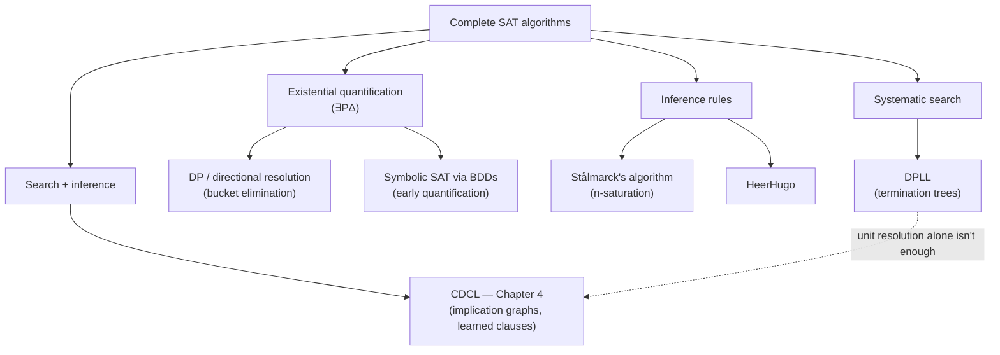
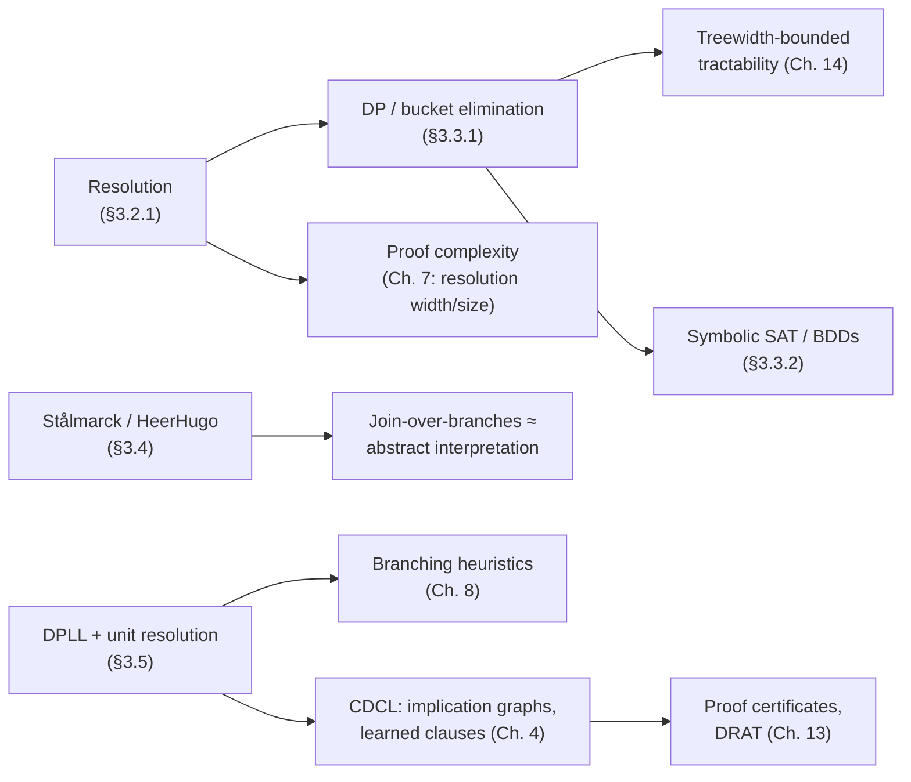

# Complete Search Algorithms for SAT

[[book-guidelines|↩ Back to guidelines]]

## Why "complete" is the whole point

A SAT algorithm is *sound* if every answer it gives is correct, and *complete* if it is guaranteed to terminate with an answer at all — SAT, UNSAT, or a satisfying assignment. Chapter 6 of the handbook (stochastic local search — GSAT, WalkSAT) gives up completeness: it can find a satisfying assignment, but if the formula is unsatisfiable it will simply never stop looking, because it has no way to *prove* the negative. That's a real engineering trade-off, but it means local search can never be the last word on a formula — something has to be able to say "unsatisfiable, and here is why" with certainty.

This chapter is about the algorithm families that make that certainty possible. Darwiche and Pipatsrisawat organize four decades of work into four approaches:

1. **Existential quantification** — eliminate variables one at a time until nothing is left to check.
2. **Inference rules** — derive new facts until either a contradiction appears or nothing new can be derived.
3. **Systematic search** — walk the tree of truth assignments, but prune branches early using cheap tests.
4. **Search + inference combined** — this is what almost every SAT solver shipped in the last twenty years actually does.



All four families share the same two primitive operations, so it's worth nailing those down before anything else.

## Preliminaries: clauses as sets, and the conditioning operator

The book represents a clause not as a syntactic disjunction but as a **set of literals**: $l_1 \vee l_2 \vee \dots \vee l_m$ becomes $\{l_1, l_2, \dots, l_m\}$, and a CNF becomes a set of such sets. This isn't just notational tidiness — it buys you two boundary cases for free:

- $\Delta = \emptyset$ (no clauses at all) is **valid** — vacuously true.
- $\emptyset \in \Delta$ (a clause with no literals — the empty clause) is **inconsistent** — a disjunction of nothing is false, so the whole conjunction is false.

Every algorithm in this chapter bottoms out in one of these two set-shaped base cases. If you've written a recursive-descent parser or a unification algorithm, this should feel familiar: it's the same pattern as reducing to `Nil` or hitting an occurs-check failure.

The second primitive is **conditioning**, $\Delta|L$: fix literal $L$ to true and simplify.

$$\Delta|L = \{\alpha - \{\neg L\} \mid \alpha \in \Delta,\ L \notin \alpha\}$$

Concretely, clauses containing $L$ are satisfied and dropped; clauses containing $\neg L$ have that literal deleted (since it can never fire); everything else survives untouched. In Rust, this is a filter-then-map over a clause vector — the kind of pass you'd write for constant folding in a compiler:

```rust
type Lit = i32; // positive = variable true, negative = negation
type Clause = Vec<Lit>;
type Cnf = Vec<Clause>;

fn condition(delta: &Cnf, lit: Lit) -> Cnf {
    delta.iter()
        .filter(|clause| !clause.contains(&lit))   // satisfied clauses vanish
        .map(|clause| {
            clause.iter().copied().filter(|&l| l != -lit).collect() // ¬L removed
        })
        .collect()
}
```

If a clause conditions down to `vec![]` (the empty clause), you've hit inconsistency; if `delta` conditions down to `vec![]` (no clauses left), you've hit validity. Every complete algorithm below is a strategy for calling `condition` in the right order.

## Resolution and unit resolution

**Resolution** is the one inference rule this entire chapter is built on. Given clauses $C_i$ and $C_j$ where $P \in C_i$ and $\neg P \in C_j$, you may derive the **resolvent**:

$$(C_i - \{P\}) \cup (C_j - \{\neg P\})$$

This is sound (the resolvent is *implied* by the two parents — never adds information that wasn't already there) but resolution alone is not complete for deriving *every* implied clause. What makes it useful is a narrower, stronger property: resolution is **refutation complete** on CNF — if a CNF is unsatisfiable, repeatedly resolving clauses is *guaranteed* to eventually derive the empty clause. That asymmetry (incomplete in general, complete for refutation) is exactly the guarantee you need to build a decision procedure: keep resolving until either $\emptyset$ appears (UNSAT) or no new resolvent can be produced (SAT).

```
1. {¬P, R}
2. {¬Q, R}
3. {¬R}
4. {P, Q}
—————————
5. {¬P}     (1,3)
6. {¬Q}     (2,3)
7. {Q}      (4,5)
8. {}       (6,7)   ← empty clause: the original four clauses are unsatisfiable
```

**Unit resolution** is the special case where at least one of the two resolved clauses is a *unit clause* (a single literal). It gives up general refutation completeness — it can fail to derive $\emptyset$ from an unsatisfiable formula — but in exchange it runs in time **linear** in formula size. This trade (weaker guarantee, linear cost) is why unit resolution — under the name **Boolean constraint propagation (BCP)** — is the innermost loop of essentially every SAT solver built since. Every algorithm in the rest of this chapter either *is* unit resolution wrapped in more machinery, or uses it as a fast pre-filter before falling back to something more expensive.

**Lean correspondence.** If you think of resolution as a cut rule in a sequent calculus, unit resolution is the fragment where one premise is an axiom (a literal asserted outright) — structurally the same restriction that makes some fragments of first-order unification (e.g. Horn-clause resolution in Prolog, or Miller's *pattern unification* fragment) tractable where the general case isn't. The recurring lesson across this whole book — and across your elaborator's `isDefEq` — is the same: full generality is often undecidable or exponential, but a *syntactically restricted* fragment (unit clauses here, patterns there) buys you a polynomial or linear algorithm at the cost of completeness on the general case, and then you build the rest of the system to stay inside the tractable fragment as much as possible.

## Existential quantification and directional resolution

The second family eliminates variables entirely rather than deriving new clauses opportunistically. Existential quantification of variable $P$ from $\Delta$ is defined as:

$$\exists P\,\Delta \;\stackrel{\text{def}}{=}\; (\Delta|P) \vee (\Delta|\neg P)$$

— "the formula still holds no matter which way you set $P$." The load-bearing fact is: **$\Delta$ is satisfiable iff $\exists P\,\Delta$ is satisfiable**, and $\exists P\,\Delta$ has one fewer variable. Eliminate every variable one at a time and you're left with a trivial CNF — either $\{\emptyset\}$ (UNSAT) or $\{\}$ (SAT). This is precisely **quantifier elimination**, the same operation Craig interpolation and CHC solving lean on when they need to project a relation onto a smaller set of variables while preserving satisfiability — worth flagging now, because you'll meet it again the moment your CSP kernel needs to summarize a sub-formula's effect on a smaller variable set.

### The DP algorithm (bucket elimination)

The **Davis–Putnam algorithm** (DP, 1960; also called **directional resolution**) implements $\exists P\,\Delta$ concretely: compute all $P$-resolvents of clauses mentioning $P$, throw away every clause that still mentions $P$, and what's left is equivalent to $\exists P\,\Delta$.

The standard implementation, **bucket elimination**, fixes a variable order $\pi$ and buckets clauses by the *first* variable (in $\pi$) each one mentions:

```
Δ = { {¬A,B}, {¬A,C}, {¬B,D}, {¬C,¬D}, {A,¬C,E} },  order C,B,A,D,E

C : {¬A,C}, {¬C,¬D}, {A,¬C,E}
B : {¬A,B}, {¬B,D}
A :
D :
E :
```

Processing a bucket top-to-bottom means resolving all its clauses on the bucket's own variable and pushing the resolvents down into whichever bucket their *new* first variable lands in. Processing bucket $C$ here yields the resolvent $\{\neg A, \neg D\}$, which drops into bucket $A$; processing bucket $B$ adds $\{\neg A, D\}$ to bucket $A$ too. Processing bucket $A$ then derives *nothing new* — so $\exists C,B,A\,\Delta = \{\}$, and the formula is satisfiable, with a witnessing assignment reconstructible in a single linear backward pass over the buckets (assign each variable, from the last eliminated to the first, so as to satisfy everything left in its own bucket).

```rust
use std::collections::HashMap;

fn dp(cnf: &Cnf, order: &[Lit]) -> bool /* true = satisfiable */ {
    let mut buckets: HashMap<Lit, Vec<Clause>> = order.iter().map(|&v| (v, vec![])).collect();
    for clause in cnf {
        let first = order.iter().find(|v| clause.contains(*v) || clause.contains(&-*v)).unwrap();
        buckets.get_mut(first).unwrap().push(clause.clone());
    }
    for &v in order {
        let bucket = buckets[&v].clone();
        for i in 0..bucket.len() {
            for j in (i+1)..bucket.len() {
                if let Some(resolvent) = resolve_on(&bucket[i], &bucket[j], v) {
                    if resolvent.is_empty() { return false; } // UNSAT
                    let next = order.iter().find(|w| resolvent.contains(*w) || resolvent.contains(&-*w));
                    if let Some(&w) = next { buckets.get_mut(&w).unwrap().push(resolvent); }
                    // if no variable remains, the resolvent is a tautology-free empty-var clause: drop it
                }
            }
        }
    }
    true // SAT
}
```

**Variable order is everything.** The exact same CNF, ordered $E,A,B,C,D$, closes with *zero* resolvents generated — a strictly cheaper proof of the same fact. This isn't a curiosity: DP's time and space complexity is $O(n \cdot \exp(w))$, where $w$ is the **treewidth** of the CNF's *connectivity graph* — the undirected graph with an edge between any two variables that co-occur in some clause. The variable order determines how closely bucket elimination tracks the graph's optimal tree decomposition; a bad order can blow treewidth up arbitrarily on a formula whose true treewidth is small. This is the same treewidth that shows up in fixed-parameter tractability results for CSPs — bucket elimination *is* the CSP "join and project" algorithm applied to Boolean constraints, and it's worth remembering when you get to the handbook's parameterized-complexity chapter (Chapter 14) and your own CSP kernel's domain/lattice propagation: treewidth-bounded propagation is exactly what turns an exponential search into a polynomial one, and the variable order you choose *is* choosing a tree decomposition.

## Symbolic SAT solving via binary decision diagrams

DP's Achilles' heel is space: resolvents accumulate as explicit clauses, and there can be exponentially many. **Symbolic SAT solving** attacks this by using a more compact *representation* of the same intermediate results — a **Binary Decision Diagram (BDD)**.

A BDD is a rooted DAG with two sinks (`0`, `1`); every other node is labeled with a variable and has a `low` (variable = false) and `high` (variable = false) child. Under a fixed variable order, and with two normalization rules enforced — no node whose children are identical, no duplicate isomorphic sub-graphs — you get a **Reduced Ordered BDD (ROBDD)**, which is *canonical*: there is exactly one ROBDD for a given Boolean function under a given variable order.

<svg viewBox="0 0 420 260" xmlns="http://www.w3.org/2000/svg" font-family="sans-serif" font-size="13">
  <defs>
    <marker id="arrow" markerWidth="8" markerHeight="8" refX="7" refY="4" orient="auto">
      <path d="M0,0 L8,4 L0,8 z" fill="#888"/>
    </marker>
  </defs>
  <circle cx="210" cy="30" r="16" fill="none" stroke="#888" stroke-width="1.5"/>
  <text x="210" y="35" text-anchor="middle" fill="currentColor">x</text>
  <circle cx="130" cy="100" r="16" fill="none" stroke="#888" stroke-width="1.5"/>
  <text x="130" y="105" text-anchor="middle" fill="currentColor">y</text>
  <circle cx="270" cy="100" r="16" fill="none" stroke="#888" stroke-width="1.5"/>
  <text x="270" y="105" text-anchor="middle" fill="currentColor">y</text>
  <circle cx="270" cy="170" r="16" fill="none" stroke="#888" stroke-width="1.5"/>
  <text x="270" y="175" text-anchor="middle" fill="currentColor">z</text>
  <rect x="120" y="220" width="34" height="26" fill="none" stroke="#888" stroke-width="1.5"/>
  <text x="137" y="238" text-anchor="middle" fill="currentColor">0</text>
  <rect x="260" y="220" width="34" height="26" fill="none" stroke="#888" stroke-width="1.5"/>
  <text x="277" y="238" text-anchor="middle" fill="currentColor">1</text>
  <line x1="198" y1="38" x2="140" y2="88" stroke="#888" stroke-width="1.5" marker-end="url(#arrow)"/>
  <line x1="222" y1="38" x2="260" y2="88" stroke="#888" stroke-width="1.5" marker-end="url(#arrow)"/>
  <line x1="130" y1="116" x2="137" y2="220" stroke="#888" stroke-width="1.5" marker-end="url(#arrow)"/>
  <line x1="140" y1="108" x2="270" y2="160" stroke="#888" stroke-width="1.5" stroke-dasharray="3,3" marker-end="url(#arrow)"/>
  <line x1="270" y1="116" x2="270" y2="160" stroke="#888" stroke-width="1.5" marker-end="url(#arrow)"/>
  <line x1="270" y1="186" x2="277" y2="220" stroke="#888" stroke-width="1.5" marker-end="url(#arrow)"/>
  <text x="345" y="105" fill="currentColor" font-size="11">high = true</text>
  <text x="345" y="120" fill="currentColor" font-size="11">low = false</text>
</svg>

*A BDD (schematic, per the book's Fig. 3.2): every root-to-1 path is a model; a variable absent from a path is "don't care."*

Any binary operation on two same-order OBDDs runs via the `Apply` algorithm in time linear in the *product* of their sizes — so you can existentially quantify a BDD variable $X$ by conditioning on $X$ and $\neg X$ (each linear-time) and disjoining the results (quadratic overall), all without ever materializing an explicit clause set. The full algorithm doesn't build one monolithic BDD for the whole CNF up front (that would defeat the purpose); it converts each clause into a small BDD, and uses **early quantification** — as soon as every clause mentioning $X$ has been conjoined into a partial BDD $\Gamma_X$, quantify $X$ out of $\Gamma_X$ immediately, rather than waiting until the whole formula is assembled. Scheduling *which* conjunctions and quantifications happen in what order to keep intermediate BDDs small is itself NP-hard — so, unsurprisingly, bucket elimination reappears here too, this time as a *scheduling heuristic* for symbolic SAT rather than as the algorithm itself.

**Why this matters for your project.** ROBDD canonicity is a nice concrete anchor for the abstract idea of *definitional equality via canonical form* — two BDDs represent the same Boolean function iff they are the identical graph, full stop, no further normalization needed, exactly the property you want (and don't quite get, in general) from `isDefEq` reducing two terms to comparable normal forms. It's also the chapter's clearest illustration of a recurring theme: an exponential worst case (explicit resolution) can sometimes be tamed not by a smarter search, but by a **more compact canonical representation** of the same semantic content — the same move BDDs, tries, and hash-consed ASTs all make.

## Stålmarck's algorithm and HeerHugo

The third family works by inference rules applied to a formula transformed into a special normal form, rather than by resolution on clauses or elimination of variables.

**Stålmarck's algorithm** (1990) is, in its original form, a *tautology prover*: to test $\Delta$'s satisfiability you check whether $\neg\Delta$ is a tautology. After light preprocessing (push down negations, flatten implications), the formula is rewritten into a conjunction of **triplets** of the form $p \Leftrightarrow (q \otimes r)$ (introducing fresh variables for sub-formulas, exactly Tseitin's trick from Chapter 2):

$$
\neg((a \Leftrightarrow b \wedge c) \wedge (b \Leftrightarrow \neg c) \wedge a)
\;\longrightarrow\;
v_1 \Leftrightarrow (b \wedge c),\ v_2 \Leftrightarrow (a \Leftrightarrow v_1),\ v_3 \Leftrightarrow (b \Leftrightarrow \neg c),\ v_4 \Leftrightarrow (v_3 \wedge a),\ v_5 \Leftrightarrow (v_2 \wedge v_4)
$$

The algorithm then assumes (for contradiction) that the whole thing is false, and tries to derive a contradiction by applying **simple rules** — small local deductions like "if $p \Leftrightarrow (q \wedge r)$ and $p = \neg q$, then $q = \text{true}, r = \text{false}$" — exhaustively. This exhaustive closure under simple rules is **0-saturation**.

If 0-saturation doesn't settle the formula's truth value, the algorithm escalates with the **dilemma rule**: for each variable $v$, 0-saturate $\Delta|v$ and $\Delta|\neg v$ separately to get conclusion sets $\Gamma_v$ and $\Gamma_{\neg v}$, then keep only the conclusions **common to both** — facts that hold *regardless* of $v$'s value — and add those back to $\Delta$. One full pass of this over every variable is **1-saturation**; recursively case-splitting on $n$ variables at once and keeping only shared conclusions is **$n$-saturation**. Given enough depth, $n$-saturation is guaranteed to either find a contradiction or a witness — but because it starts from $n=0$ and only escalates depth when forced to, it is explicitly "oriented toward finding *short* proofs," in the book's words: cheap inference first, expensive case-splitting only when necessary.

**This is a Galois-connection move, named differently.** "Explore both branches of a case split, then keep only what's true in *both*" is precisely the **join** operation in an abstract-interpretation lattice: over-approximate each branch, then merge by intersecting the sets of facts that survive on every path. Stålmarck's $n$-saturation is, structurally, meet-over-all-paths abstract interpretation applied to a propositional formula instead of a program's control-flow graph — the same shape your CSP kernel's domain/lattice propagation will use when merging invariants across branches of a conditional. It's a genuinely useful example to keep in your back pocket: the abstract-interpretation "join at merge points" pattern long predates, and is more general than, the specific static-analysis framing it's usually taught in.

**HeerHugo** is a CNF-based cousin: convert to 3-CNF, then apply "simple rules" that are actually unit resolution + subsumption + a restricted resolution (only performed when it *shrinks* the formula — an early example of the same "resolve selectively, not exhaustively" discipline that later preprocessing chapters formalize), followed by a **branch/merge rule** that is Stålmarck's dilemma rule under a different name. Completeness, again, comes from escalating the case-split depth.

## The DPLL algorithm and termination trees

The fourth family gives up the ambition of eliminating variables or deriving new global facts, and instead does the simplest possible thing: **enumerate truth assignments via depth-first search**, but detect success or contradiction as early as possible so you never have to visit most of the leaves explicitly.

Picture the full binary tree over $n$ variables — each leaf is one truth assignment. DP's problem was space (accumulating resolvents); **DPLL** (Davis–Putnam–Logemann–Loveland) was built precisely to fix that, since depth-first search needs only $O(n)$ space for the current path. The base algorithm (`dpll-`, before unit resolution is folded in) is a direct recursive conditioning walk:

```
dpll-(Δ, d):
  if Δ = {}         → return {}                 (found a model this far)
  else if {} ∈ Δ     → return unsatisfiable       (contradiction — prune this branch)
  else if dpll-(Δ|P_{d+1}, d+1) ≠ unsat  → return that result ∪ {P_{d+1}}
  else if dpll-(Δ|¬P_{d+1}, d+1) ≠ unsat → return that result ∪ {¬P_{d+1}}
  else               → return unsatisfiable
```

The crucial win over blind enumeration is that `Δ|...` can hit `{}` or `{} ∈ Δ` at an **internal** node, letting you discard entire subtrees — sometimes thousands of leaves — without inspecting a single one of them individually.

### Termination trees

The **termination tree** is the subset of the full search tree that DPLL actually visits — a direct empirical measure of how hard a formula was for the algorithm, independent of the theoretical $2^n$ upper bound. A small termination tree with early contradictions and early successes at shallow levels indicates an "easy" instance; a termination tree that has to bottom out near depth $n$ on every branch indicates a hard one. This is the search-based analogue of a resolution proof's size: later chapters on [[Proof-Complexity|proof complexity]] (Ch. 7) and branching-heuristic theory (Ch. 8) are, in effect, asking "how do we keep termination trees small," from two different angles.

### Folding in unit resolution

The full **`dpll`** algorithm augments `dpll-` with unit resolution before testing for success/failure at each node — this is the single most important refinement in the chapter, because it's what turns "DPLL" from a historical curiosity into the ancestor of every modern solver:

```
dpll(Δ):
  (I, Γ) = unit-resolution(Δ)      -- I: literals forced by unit propagation; Γ: Δ conditioned on I
  if Γ = {}        → return I
  else if {} ∈ Γ    → return unsatisfiable
  else:
    choose a literal L in Γ        -- branching heuristic lives here (Ch. 8)
    if dpll(Γ|L)  ≠ unsat → return that result ∪ I ∪ {L}
    if dpll(Γ|¬L) ≠ unsat → return that result ∪ I ∪ {¬L}
    else → return unsatisfiable
```

Two things change versus `dpll-`: variables no longer need to be tried in a fixed order (line "choose a literal"), and unit resolution now does a *round* of forced propagation before every branch — collapsing what might otherwise be several levels of the naive search tree into a single conditioning step. Take $\Delta = \{\{\neg A,B\},\{\neg B,\neg C\},\{C,\neg D\}\}$ conditioned on $A$: the naive algorithm sees $\Delta|A = \{\{B\},\{\neg B,\neg C\},\{C,\neg D\}\}$ — neither trivially valid nor trivially inconsistent, so it must recurse. Folding in unit resolution instead immediately forces $B\!=\!\text{true}$ (unit clause $\{B\}$), which forces $C\!=\!\text{false}$, which forces $D\!=\!\text{false}$ — collapsing three levels of branching into one deterministic propagation step and reaching success at what would otherwise be an internal node several levels down. This is exactly the linear-time BCP loop from earlier in the chapter, now doing the actual load-bearing work inside the search.

A minimal Python sketch of the propagation loop, for the shape of the idea rather than performance:

```python
def unit_propagate(cnf):
    forced = []
    while True:
        units = [c[0] for c in cnf if len(c) == 1]
        if not units:
            break
        lit = units[0]
        forced.append(lit)
        cnf = [c for c in cnf if lit not in c]           # satisfied clauses drop out
        cnf = [[l for l in c if l != -lit] for c in cnf]  # ¬lit removed from survivors
        if [] in cnf:
            return forced, cnf, True   # contradiction found
    return forced, cnf, False
```

**Rust grounding, as a typestate sketch.** The recursive DPLL structure maps naturally onto a small enum-driven state machine — closer to how you'd actually structure a checker/solver core in your compiler:

```rust
enum Outcome { Sat(Vec<Lit>), Unsat }

fn dpll(cnf: Cnf) -> Outcome {
    let (forced, remaining, contradiction) = unit_propagate(&cnf);
    if contradiction { return Outcome::Unsat; }
    if remaining.is_empty() { return Outcome::Sat(forced); }
    let branch_lit = choose_literal(&remaining); // Ch.8's branching heuristics live here
    if let Outcome::Sat(mut model) = dpll(condition(&remaining, branch_lit)) {
        model.extend(forced); model.push(branch_lit);
        return Outcome::Sat(model);
    }
    if let Outcome::Sat(mut model) = dpll(condition(&remaining, -branch_lit)) {
        model.extend(forced); model.push(-branch_lit);
        return Outcome::Sat(model);
    }
    Outcome::Unsat
}
```

## Where the chapter leaves off (and where Chapter 4 picks up)

The book closes 3.5 by noting that the *choice* of branching literal (line "choose a literal L") can dramatically change running time — that's Chapter 8's subject. But it also flags, in passing, DPLL's deeper structural weakness going into §3.6: **chronological backtracking** discards *all* information about *why* a branch failed. If setting $A\!=\!\text{true}$ makes the formula unsatisfiable no matter what $B$ and $C$ are set to, plain DPLL still re-explores every combination of $B$ and $C$ before it gets back around to trying $A\!=\!\text{false}$ — repeating the same underlying mistake in every irrelevant context. Fixing this — [[Conflict-Driven-Clause-Learning#Non-chronological backtracking|non-chronological backtracking]] driven by an **implication graph**, and the **conflict-driven clauses** that record what actually caused a conflict so unit resolution catches it earlier next time — is exactly what Chapter 4 (Conflict-Driven Clause Learning) develops into modern CDCL. This chapter's DPLL is CDCL's skeleton; everything from here to modern MiniSAT/CaDiCaL-style solvers is refinement layered onto exactly the `unit-resolution` + branch-and-recurse loop above.

## Where this leads



This chapter is the load-bearing foundation for the rest of Part I of the handbook: every later chapter either (a) refines DPLL's branching/propagation loop into CDCL and its engineering (Ch. 4, 5, 9, 11), or (b) studies the *proof system* implicit in resolution-based search — how large the proofs it's forced to produce must be (Ch. 7, 8), and how to certify them once produced (Ch. 13's DRAT).

For your own project, three threads are worth carrying forward explicitly:

- **Unit resolution as BCP is [[Runtime-Variation-and-Solver-Engineering#The mechanism|the mechanism]], not resolution in general.** Whatever proof-search or constraint-propagation core you build for the CSP kernel will live or die by how cheaply it can do the equivalent of unit propagation — full resolution or full constraint reasoning is the *fallback*, invoked only when propagation alone can't settle a node, exactly the layered-cost discipline this chapter models.
- **Existential quantification via bucket elimination is quantifier elimination**, and treewidth is the parameter that decides whether it's tractable — the same parameter your CSP kernel's structural-tractability results (and DFA/automaton-based domain propagation) will ultimately hinge on.
- **Stålmarck's "keep only what both branches agree on" is a Galois-connection join** performed on a propositional formula instead of a program — the cleanest small-scale example in this book of the join-at-merge-points pattern your abstract-interpretation engine will need for invariant generation across conditional branches.

The chapter's own proof-certificate discussion (§3.6.6 — explicit resolution traces, implication-graph reconstruction, listing conflict-driven clauses in creation order so a verifier can check each one via unit resolution) is a direct, concrete preview of what a **trusted, proof-producing kernel** looks like in practice: the solver does the expensive search, but the *check* that its answer is correct is a much smaller, much more mechanical procedure — precisely the separation of concerns you'll want between your elaborator/solver and the trusted kernel that checks its output.
