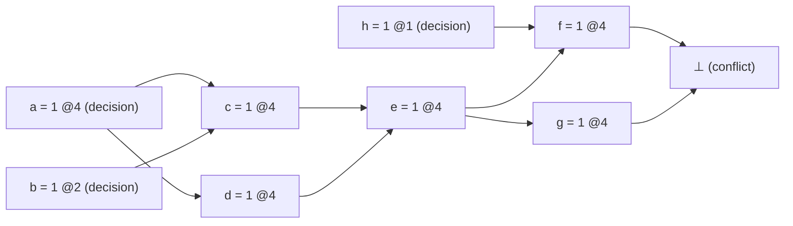
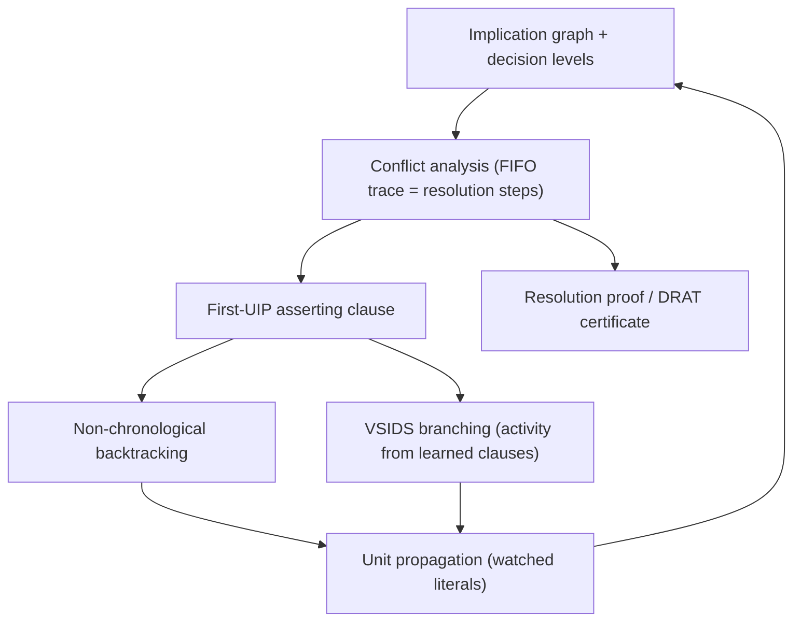

# Conflict-Driven Clause Learning

[[book-guidelines|↩ Back to guidelines]]

## Why DPLL alone isn't enough

A plain DPLL solver is a tree search: pick a variable, assign it, propagate the consequences, and if you hit a contradiction, backtrack to the most recent choice point and try the other branch. That's it — no memory of *why* the contradiction happened. If the same underlying conflict is reachable from a hundred different branches of the tree, a DPLL solver will rediscover it a hundred times, paying the full propagation cost each time. This is exactly the "what breaks without it" failure mode CDCL exists to fix: on structured, real-world instances (hardware verification, planning, ATPG) the same small set of constraints conflicts over and over under different partial assignments, and DPLL's tree-shaped search has no way to generalize what it just learned into a fact usable at other parts of the tree.

CDCL's answer is to treat every conflict as a source of information: analyze *why* the current partial assignment became contradictory, extract a new clause that summarizes that reason, and add it to the formula so the solver never falls into the same trap again — from any branch. This single idea (plus the bookkeeping needed to make it fast) is, in this chapter's own words, "the sole reason" SAT went from solving instances with a few hundred variables to millions of variables. Everything below is the machinery that makes "analyze why and remember" concrete and efficient.

## Preliminaries: what a solver tracks about each variable

The book's notation is precise and worth internalizing before anything else, because every later mechanism is stated directly in terms of it.

A partial assignment is a function $\nu : V \to \{0, u, 1\}$ ($u$ = unassigned). A clause is *falsified* if every literal is 0, *satisfied* if some literal is 1, *unit* if exactly one literal is unassigned and the rest are 0, and *unresolved* otherwise. The **unit clause rule** — if a clause is unit, its last literal must become 1 — iterated to a fixed point is **unit propagation** (a.k.a. Boolean Constraint Propagation, BCP). This is the workhorse: after every decision, the solver propagates unit clauses until nothing more follows, and if it derives a falsified clause, that's a *conflict*.

For every variable $x_i$ the solver maintains three pieces of state:

- $\nu(x_i)$ — its value,
- $\alpha(x_i)$ — its **antecedent**: the clause that forced it (if it was unit-propagated), the special symbol $d$ if it was a *decision*, or $n$ if unassigned,
- $\delta(x_i)$ — its **decision level**: the depth of the search at which it got a value.

Only implied (propagated) variables get a real antecedent clause; decisions never do — a decision is, by construction, a free choice that owes nothing to any clause. The decision level of an implied literal is computed recursively from its antecedent (Eq. 4.3 in the text):

$$
\delta(l_i) = \begin{cases} u & \text{if } \alpha(l_i) = n \\ \max\big(\{0\} \cup \{\delta(l_j) \mid l_j \in \mathrm{lits}(\alpha(l_i)) \setminus \{l_i\}\}\big) & \text{otherwise} \end{cases}
$$

In words: an implied literal inherits the *highest* decision level among the other literals in the clause that forced it (or level 0, if that clause is a unit clause with nothing else in it). This recursion is what lets the solver later ask "how far back do I actually need to undo?" instead of just "undo one decision."

**Rust sketch — the per-variable record.** This is close to what a real CDCL solver's trail entry looks like:

```rust
#[derive(Clone, Copy, PartialEq)]
enum Value { False, Unassigned, True }

#[derive(Clone, Copy)]
enum Antecedent {
    Decision,           // α(x) = d
    Unit(ClauseId),     // α(x) = c_j
    None,               // α(x) = n  (unassigned)
}

struct VarState {
    value: Value,
    antecedent: Antecedent,
    level: Option<u32>, // δ(x); None ~ u
}
```

Note this is exactly a *typestate* over three orthogonal facts (value, reason, depth) — a variable's antecedent being `Decision` versus `Unit(_)` is not incidental data, it's the branch the rest of the algorithm dispatches on (conflict analysis only ever walks `Unit` antecedents).

## The implication graph and decision levels

The implication graph $I = (V_I, E_I)$ makes the propagation history explicit as a DAG: one vertex per assigned variable, plus a special vertex $\bot$ for a falsified clause. For every implied variable $x_i$ with antecedent $c_j = \alpha(x_i)$, there's a directed edge into $x_i$ from every *other* variable in $c_j$. When propagation falsifies a clause $c_k$, a directed edge from each of $c_k$'s variables lands on $\bot$, with $\alpha(\bot) = c_k$.

Consider the book's running example (Example 4.2.5):

$$
F = (\bar a \lor \bar b \lor c) \land (\bar a \lor d) \land (\bar c \lor \bar d \lor e) \land (\bar h \lor \bar e \lor f) \land (\bar e \lor g) \land (\bar f \lor \bar g)
$$

with decisions $h=1@1$, $b=1@2$, $y=1@3$ (an irrelevant variable, decided but never used by propagation), and $a=1@4$. Unit propagation at level 4 derives $c, d, e, f, g$ in sequence, and the last clause $(\bar f \lor \bar g)$ is falsified — a conflict.



Every non-decision vertex has incoming edges from *exactly* the other literals of its antecedent clause — the implication graph is nothing more than the propagation trace, rendered as a graph instead of a list. Decision level bookkeeping matters because it's the only thing that lets the solver later distinguish "this literal is baked into the current guess" from "this literal came from way back and is safe to keep."

## Conflict analysis and asserting clauses

Once $\bot$ appears, **conflict analysis** walks the implication graph backwards from $\bot$ to build a new clause — the *learned* or *conflict-driven* clause — that is guaranteed to be true in every satisfying assignment extending the pre-conflict trail, and that rules out the specific combination of choices that just failed.

The procedure is a breadth-first, FIFO trace: start the queue with the variables in $\alpha(\bot)$. Repeatedly dequeue a variable, look at its antecedent clause, and for every *other* literal in that clause: if it's from a lower decision level than the current one, record it in the learned clause; if it's from the *current* decision level, enqueue it for further tracing. The trace stops when the queue empties — the current-decision-level portion of the graph has been fully consumed.

Run this on the example above (Table 4.1 in the text): starting from $\bot$'s antecedent $c_6 = (\bar f \lor \bar g)$, both $f$ and $g$ are at level 4, so both get queued. Tracing $f$ (antecedent $c_4 = \bar h \lor \bar e \lor f$) records $\bar h$ (level 1) and queues $e$; tracing $g$ (antecedent $c_5$) records nothing new; tracing $e$ (antecedent $c_3$) records nothing new (its non-$e$ literals are already covered) but the key move happens here: tracing continues to $c$ and $d$, whose antecedents ($c_1$, $c_2$) finally bottom out at the decision variable $a$, recording $\bar b$ and $\bar a$. The result is the learned clause $(\bar h \lor \bar b \lor \bar a)$.

Crucially, every step of this trace is a **resolution step**: recording "every other literal of the antecedent, minus the one being explained" is literally the resolution rule

$$
\frac{x \lor \alpha \qquad \bar x \lor \beta}{\alpha \lor \beta}
$$

applied along the trail. This is why CDCL's underlying proof system is (a disciplined, input-restricted form of) resolution — the learned clause is not a heuristic guess, it's a resolvent, and the whole conflict analysis is a certified derivation. That matters directly for **proof-producing architectures**: every learned clause comes with a resolution chain that a small trusted checker can replay independently of the solver — the same idea underlying DRAT proof certificates and, more generally, any "trusted kernel" design where a fast, unverified search process hands its output to a small, verified checker.

### The first Unique Implication Point (UIP)

Modern solvers don't trace all the way back to the decision variable — they stop at the **first UIP**: a variable that, within the current-decision-level slice of the implication graph, *dominates* the conflict vertex $\bot$ with respect to the decision variable. In the trace above, note that at the point where only $e$ remains in the queue, every remaining path to $\bot$ passes through $e$ — $e$ is a UIP, and stopping there yields the shorter clause $(\bar h \lor \bar e)$ instead of continuing all the way to $a$.

Why stop at the first UIP rather than any UIP, or none? A UIP is exactly the point past which "how we got here" no longer matters — reassigning any UIP the same way reproduces the identical conflict, so it's a safe place to cut. The *first* one (closest to the conflict) yields the smallest, most specific asserting clause, and empirically the most useful one for propagation after backtracking.

**The asserting-clause property.** Every clause learned this way has exactly one literal at the current decision level (the UIP itself, negated) and the rest at strictly lower levels. That's what "asserting" means: once the solver backtracks past all the lower-level literals, this clause becomes unit and *immediately forces* the UIP's negation — the solver doesn't merely avoid the old mistake, it's handed a new deduction for free. If the trace stopped before reaching a single-current-level-literal state, the clause wouldn't be a unit clause upon backtracking, and this "free deduction" property would be lost — the whole point of terminating at a UIP is to guarantee it.

```rust
// First-UIP conflict analysis, following the FIFO trace in the chapter.
fn analyze_conflict(
    trail: &Trail,
    conflicting: ClauseId,
    clauses: &ClauseDb,
) -> (Vec<Literal>, /* backtrack level */ u32) {
    let mut seen = HashSet::new();
    let mut learned = Vec::new();
    let mut queue: VecDeque<Var> = VecDeque::new();
    let current_level = trail.decision_level();

    for lit in clauses[conflicting].literals() {
        queue_or_record(lit, trail, current_level, &mut seen, &mut queue, &mut learned);
    }

    // Stop as soon as exactly one current-level variable remains: that's the first UIP.
    while queue.len() > 1 {
        let v = queue.pop_front().unwrap();
        match trail.antecedent(v) {
            Antecedent::Unit(cid) => {
                for lit in clauses[cid].literals() {
                    if lit.var() != v {
                        queue_or_record(lit, trail, current_level, &mut seen, &mut queue, &mut learned);
                    }
                }
            }
            Antecedent::Decision => unreachable!("decisions have no antecedent to trace"),
            Antecedent::None => unreachable!(),
        }
    }
    let uip = queue.pop_front().unwrap();
    learned.push(Literal::negated(uip));

    let backtrack_level = learned.iter()
        .filter(|l| l.var() != uip)
        .map(|l| trail.level_of(l.var()))
        .max()
        .unwrap_or(0);
    (learned, backtrack_level)
}
```

## Non-chronological backtracking

Once the asserting clause is in hand, the backtrack target is *computed*, not assumed to be "one level up." The **backtrack level** is the second-highest decision level among the learned clause's literals (equivalently: the highest level among all literals *except* the asserting UIP literal). The solver jumps directly to that level — potentially skipping over several intermediate decision levels in one move. This is exactly why CDCL's search space is a DAG rather than a tree: a single conflict can invalidate a whole subtree of decisions at once, and the solver never has to re-explore it branch by branch.

Concretely, for the running example: with the full trace, the learned clause $(\bar h \lor \bar b \lor \bar a)$ has literals at levels $1, 2, 4$ — the backtrack level is 2 (the second-highest), so the solver jumps straight from level 4 to level 2, undoing the level-3 and level-4 decisions in one step, and the now-unit clause immediately forces $a = 0$. With first-UIP learning, the shorter clause $(\bar h \lor \bar e)$ has literals at levels $1$ and (the UIP) $4$ — backtracking jumps all the way to level 1, immediately forcing $e = 0$. Shorter, more general clauses systematically license *more aggressive* backtracking; extending the trace past the first UIP can only add literals and can only shrink (or preserve) how far back the solver is allowed to jump. That inequality is exactly why "stop at the first UIP" is the default rather than merely one option: it maximizes backjump distance for free.

Historically, GRASP applied this jump only after both values of a decision variable had been tried (closer to today's revived "chronological backtracking" variants); Chaff popularized backtracking after *every* single conflict, which is the CDCL organization in wide use today (see Algorithm 2 in the chapter: `Backtrack(ConflictAnalysis())` runs inside the propagation-failure branch, replacing DPLL's `ToggleDecision`).

## Branching heuristics and watched literals

**Branching (VSIDS).** For a satisfiable formula, ideal branching would just guess a model directly; that's obviously not available, so CDCL branching instead tries to *provoke conflicts productively* — the same instinct behind clause learning itself, pointed at variable selection. VSIDS (Variable State Independent Decaying Sum), from Chaff, is the archetype:

1. every variable carries an activity counter;
2. whenever a clause is learned, bump the counters of the variables that participated in deriving it;
3. branch on the unassigned variable with the highest counter (ties broken arbitrarily);
4. periodically decay all counters (divide by a constant).

The decay is what makes this "recency-weighted" rather than a flat popularity count — variables involved in *recent* conflicts dominate the ranking, which tends to keep the search focused on the currently-relevant part of the formula rather than whatever was contentious hundreds of conflicts ago. This is conceptually close to reinforcement-style credit assignment: a variable's score is evidence about how often it's load-bearing in explaining failure, decayed over time — worth noting for the CSP-kernel angle below, since exactly this "activity as recency-weighted conflict participation" idea recurs in modern CDCL(T)/SMT variable-selection heuristics.

**Watched literals.** Clause learning produces many long clauses, and naively re-scanning every clause containing a variable on every assignment is far too slow. The fix is a *lazy* data structure: for each clause, only two literals are "watched" via two pointers, and the clause's status is inspected **only** when a watched literal itself gets assigned. If a watched literal becomes false, the clause is scanned for a replacement literal to watch (any non-false literal not already watched); if none exists, the clause is unit (or falsified, if there is also no unassigned literal). The single most important property: **backtracking does not update watch pointers at all** — they're simply left wherever they last were, and get lazily fixed up (if needed) the next time propagation touches that clause going forward. That's what makes watched literals cheap across the frequent backjumps non-chronological backtracking produces — no bookkeeping is owed on the way back down.

```rust
struct WatchedClause {
    literals: Vec<Literal>,
    watch: [usize; 2], // indices into `literals`
}

impl WatchedClause {
    /// Called only when `literals[self.watch[slot]]` just became false.
    /// Returns Some(new_index) if a replacement watch was found,
    /// None if the clause is now unit/falsified under the other watch.
    fn find_new_watch(&mut self, slot: usize, assign: &impl Fn(Literal) -> Value) -> Option<usize> {
        let other = 1 - slot;
        for i in 0..self.literals.len() {
            if i != self.watch[0] && i != self.watch[1]
                && assign(self.literals[i]) != Value::False
            {
                self.watch[slot] = i;
                return Some(i);
            }
        }
        None // no replacement: clause is unit on watch[other], or falsified
    }
}
```

Two-watched-literal amortized cost per clause, per decision level, is linear in the clause's size in the circular-scan implementation the chapter describes (some other layouts, e.g. MiniSat's, are known not to be optimal). Solvers additionally special-case binary clauses as direct implication edges — cheaper still, and binary clauses are frequently a large fraction of a real instance's clause count.

## Restart policies and clause deletion

**Restarts.** Randomized DPLL/CDCL search on satisfiable instances exhibits *heavy-tailed* run-time behavior: usually fast, but with non-negligible probability of a very long run. The practical fix is to periodically abandon the current search tree entirely and restart from decision level 0 — cheap to do because all *learned clauses* are kept (only the decision trail is discarded), so a restart doesn't throw away what conflict analysis has already paid for. Restart cadence follows a schedule (e.g. Luby sequences); too-frequent fixed-interval restarts can threaten completeness, addressed either by lengthening the interval over time or by ensuring enough clauses accumulate between restarts. **Phase saving** — remembering, per variable, which polarity it had last time, and using that as the default the next time it's decided — mitigates the "throwing away useful search state" cost of frequent restarts. Note the resolution-power result the chapter cites: clause learning *plus* restarts together yield a proof system as strong as general resolution — strictly stronger than tree-like resolution, which is what plain DPLL corresponds to. Restarts aren't just an engineering trick; they're part of what gives CDCL its extra proof-theoretic strength over DPLL.

**Clause deletion.** Kept indefinitely, learned clauses would eventually overwhelm memory and propagation time, so clauses are periodically pruned. The dominant quality metric is **Literal Block Distance (LBD)**: partition a learned clause's literals by decision level and count the distinct levels. A clause touching few distinct decision levels (low LBD) is judged more likely to stay relevant to future conflicts — closer to describing one coherent "reason," rather than an incidental grab-bag spanning most of the search's history — and is preferentially kept; high-LBD clauses are the first candidates for deletion. LBD is reused elsewhere too: as a trigger for clause minimization, and as an input to restart scheduling — the same statistic doing triple duty as a proxy for "is this branch of the search still coherent."

## Where this leads



Within this book, CDCL is the machine that everything downstream treats as an oracle: MaxSAT, model enumeration, minimal-unsatisfiable-subset (MUS/MCS) extraction, and quantified extensions (Chapter 4.4) all repeatedly *call* a CDCL solver as a black-box NP decision procedure, and the proof-complexity chapter's account of resolution's power is, concretely, an account of what conflict analysis can and cannot derive.

For the standing project: this chapter is the clearest real-world instance of **proof-producing search** in the reading list so far — every learned clause is a resolution derivation, which is exactly the discipline a trusted kernel needs from an untrusted search engine (the same shape as wanting a small checker to replay an elaborator's unification steps rather than trust the elaborator itself). The CSP kernel described in the project's goals — searching for concrete counterexamples that violate a refinement-type invariant — is architecturally a CDCL loop: decisions correspond to trial variable/domain assignments, propagation corresponds to constraint/domain narrowing, and conflict analysis (a "no-good" over the variables actually responsible for the failure) is precisely [[Runtime-Variation-and-Solver-Engineering#The mechanism|the mechanism]] needed to avoid rediscovering the same infeasible sub-assignment from every branch of the search — the CSP literature's *conflict-directed backjumping* and *no-good learning* are this chapter's implication graph and asserting clauses under different names. The same lesson generalizes to SMT (DPLL(T)) and CEGAR loops: whenever a search process is expected to explain its own failures well enough to avoid repeating them, first-UIP-style conflict analysis over an explicit implication graph is the reference design to imitate.
