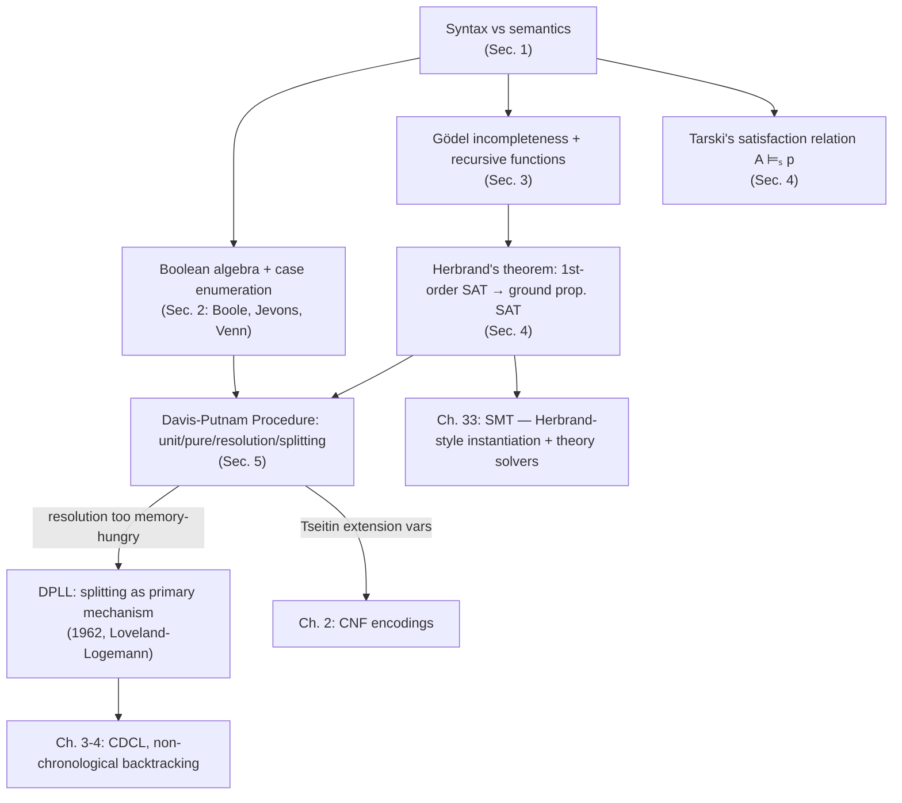

# History and Foundations of Satisfiability

[[book-guidelines|↩ Back to guidelines]]

## Why this chapter exists before any algorithm does

Every later chapter of this handbook takes for granted that "is this formula satisfiable?" is a well-posed question with a definite, checkable answer. That wasn't always obvious. It took roughly 2300 years — from Aristotle's syllogisms to Tarski's 1930s work on truth — to even *state* the question precisely, because doing so requires cleanly separating two things that look interchangeable in casual reasoning: what a sentence *says grammatically* (syntax) and what it *is true of* (semantics). Once that separation is made, "satisfiability" falls out as a specific, technical concept — and the entire second half of the 20th century's work on SAT solving is downstream of getting that concept right. This article reconstructs that separation and the four historical stages that turned it into an algorithm: the syntax/semantics split itself, its Boolean-algebraic formalization, Gödel's use of it to expose the limits of formal systems, and Herbrand/Tarski/Davis-Putnam turning "satisfiable" into something a machine can search for.

## 1. Satisfiability as the semantic counterpart of syntactic consistency

**What breaks without this distinction.** If you don't separate syntax from semantics, you can't tell the difference between "I failed to derive a contradiction from these premises" (a fact about a *particular proof system's* search process) and "these premises could all be true of something" (a fact about the *world*, independent of any proof system). Conflating them is exactly the mistake that let logicism seem plausible for as long as it did (Section 3 below) — if provability and truth always coincided, there'd be no daylight between "provable in my axioms" and "true," and Gödel's whole result would be impossible to even phrase.

The book sets up two independent axes:

|                  | Syntactic (proof-theoretic)                                                  | Semantic (model-theoretic)                                    |
|------------------|--------------------------------------------------------------------------------|-----------------------------------------------------------------|
| "q follows from $p_1,\dots,p_n$" | **derivability**, $p_1,\dots,p_n \vdash q$ — there exists a proof of $q$ from $p_1,\dots,p_n$ in some fixed axiom system | **validity**, $p_1,\dots,p_n \models q$ — for every structure $A$, if $A\models p_1,\dots,A\models p_n$ then $A\models q$ |
| "$\{p_1,\dots,p_n\}$ doesn't blow up" | **consistency** — no contradiction $q\wedge\neg q$ is derivable from the set | **satisfiability** — some structure $A$ makes every $p_i$ true |

A **structure** $A=\langle D,R\rangle$ pairs a nonempty domain $D$ (the "objects in the world") with an interpretation $R$ that assigns each constant an element of $D$, each predicate a relation over $D$, and each functor a function over $D$. "$A\models p$" reads "$p$ is true in $A$."

**Satisfiability is defined as the semantic mirror of consistency**: $\{p_1,\dots,p_n\}$ is satisfiable iff some $A$ makes every $p_i$ true — exactly as consistency is "no contradiction is derivable," but phrased in terms of models instead of proofs. From this single definition, validity, satisfiability, derivability, and consistency become mutually characterizable: $p_1,\dots,p_n\models q$ iff $\{p_1,\dots,p_n,\neg q\}$ is unsatisfiable, and (when the logic has a *complete* axiom system — derivability coincides with validity) $p_1,\dots,p_n\vdash q$ iff $\{p_1,\dots,p_n,\neg q\}$ is unsatisfiable too. This is why SAT solvers can answer questions phrased as validity, entailment, or consistency without any special-casing: they're all the same question once you fix on satisfiability as the primitive.

**Grounding — this is the type-checking/model-checking split you already know.** If you've built or used a type checker, you've lived this distinction without naming it:

```rust
// "Derivability" — syntactic, proof-search flavored:
// does the type system's inference rules let us DERIVE this judgment?
fn typechecks(ctx: &Context, expr: &Expr, ty: &Type) -> bool {
    // walks inference rules; success = a derivation/proof tree exists
    infer_or_check(ctx, expr, ty).is_ok()
}

// "Satisfiability" — semantic, model-search flavored:
// does there EXIST some model/assignment that makes this true?
fn satisfiable(formula: &Formula) -> Option<Model> {
    // walks possible structures/assignments; success = a witnessing model
    search_for_model(formula)
}
```

A type checker answers a derivability question ("can I build a typing derivation?"); a SAT/SMT solver answers a satisfiability question ("does a model exist?"). **Soundness and completeness of a type system are exactly the claim that these two functions agree** — that "derivable" and "true in every intended model" coincide, which is precisely what the book calls a *complete axiom system*. This is not an analogy — the elaborator's `isDefEq` check and a Herbrand-model-search SAT solver are two instances of the same syntax/semantics correspondence, and later sections of this article make that correspondence explicit for first-order logic via Herbrand and Tarski.

## 2. Syllogistic and Boolean-algebraic roots of propositional logic

**The problem before Boole:** Aristotle's syllogistic logic (4th c. BC) restricted itself to subject-predicate sentences of four shapes — A ("every S is P"), E ("no S is P"), I ("some S is P"), O ("some S is not P") — and syllogisms, conditionals $(p\wedge q)\to r$ built from these. It's already implicitly using satisfiability: to show premises don't entail a conclusion, Aristotle substitutes concrete terms making all premises true and the negated conclusion true too — e.g. refuting "(some M is A ∧ some C is A) → every M is C" with man/cow/animal. But the syntax is too weak to express *relations* (Russell's later complaint) — you cannot state "AC = AB, BC = AB, therefore AC = BC" without smuggling identity into a fake predicate, because subject-predicate form has no slot for a genuine binary relation between terms.

Boole's move (1854) was to give this an algebraic semantics: a **Boolean algebra** $\langle B,\vee,\wedge,\neg,0,1\rangle$ satisfying commutativity, distributivity, and complementation laws ($x\vee\neg x=1$, $x\wedge\neg x=0$, etc.), letting Aristotle's four propositions be rewritten as set equations (every $x$ is $y$: $x = x\cdot y$; no $x$ is $y$: $0 = x\cdot y$; some $x$ is $y$: $\exists V\neq 0, V = V\cdot x\cdot y$). Validity becomes deriving an equation $q$ from equations $p_1,\dots,p_n$ by algebraic substitution — logic reduced to algebra. Jevons' "method of indirect inference" (1860s) then anticipates truth-table case analysis directly: enumerate every combination of literal signs over the variables involved (e.g. all 8 triples over $x,y,z$), eliminate the combinations a premise rules out, and read the conclusion off what survives. Venn's diagrams (1880) are the same method made visual. This is, quite literally, brute-force satisfiability checking by exhaustive case enumeration — the ancestor of every truth-table-based decision procedure and, eventually, of DPLL's case-splitting rule.

**Grounding — brute-force SAT as a Python one-liner, formalized as a Rust enumeration:**

```python
# Jevons' method of indirect inference, mechanized: for CNF clauses over n
# variables, enumerate every assignment ("class explanation") and keep the
# ones no clause rules out.
from itertools import product

def satisfying_assignments(clauses, n_vars):
    for bits in product([False, True], repeat=n_vars):
        if all(any(bits[abs(lit)-1] == (lit > 0) for lit in clause)
               for clause in clauses):
            yield bits
```

```rust
// The same idea typed: a Boolean algebra as a trait, so "is this satisfiable"
// is "does some valuation into the algebra make every clause true."
trait BooleanAlgebra: Copy + Eq {
    fn and(self, other: Self) -> Self;
    fn or(self, other: Self) -> Self;
    fn not(self) -> Self;
    const TOP: Self;
    const BOTTOM: Self;
}
// For two-valued classical logic, `bool` itself is the smallest instance —
// which is exactly why "propositional satisfiability" and "find a Boolean
// valuation" are the same search problem Jevons was already doing by hand.
impl BooleanAlgebra for bool {
    fn and(self, o: bool) -> bool { self && o }
    fn or(self, o: bool) -> bool { self || o }
    fn not(self) -> bool { !self }
    const TOP: bool = true;
    const BOTTOM: bool = false;
}
```

Exhaustive enumeration is exactly what every SAT solver from here on tries to *avoid* doing — DPLL's unit-clause and pure-literal rules (Section 5) exist precisely to prune this search tree without losing completeness.

## 3. Gödel's incompleteness theorem and the birth of computability

Frege's **logicism** (*Grundgesetze der Arithmetik*, 1890) tried to derive all of mathematics from logic alone; Russell's paradox (unrestricted set comprehension lets you form "the set of all sets not members of themselves") broke Frege's system, and *Principia Mathematica* (Russell & Whitehead, 1910–13) repaired the syntax by adding genuine relational predicates and a stratified type theory to block the paradox — this is worth flagging explicitly since it's the direct historical ancestor of every type-theoretic stratification (universes, cumulative hierarchies) you'll use to keep your own elaborator's metatheory paradox-free.

**Gödel's 1931 result** is the decisive blow: *any* axiom system expressive enough to formalize arithmetic is necessarily incomplete — there exist arithmetic truths it cannot derive. The proof's engine is a precise inductive definition of **recursive function** (Gödel's own term for what we'd now call primitive recursive), built from a handful of base functions closed under composition and (primitive) recursion. Gödel then arithmetizes the language of *Principia* itself: every calculable function corresponds to some predicate in the system's own language, so the system can construct a predicate $T$ whose extension is "the theorems of the system," and a self-referential sentence $\neg Tc$ ("this sentence is not a theorem") that is true but unprovable. Church and Turing (1936, independently) then gave the two now-standard formalizations of "effectively computable" (lambda calculus, Turing machines); Kleene (1943) proved them equivalent to Gödel's recursive functions, and this equivalence — no known model of computation escapes it — is **Church's thesis**.

**Why this matters for a theorem-prover's trusted kernel:** Gödel's theorem is not just historical trivia — it's the reason *every* automated theorem prover must draw a boundary around a small, trusted proof-checking kernel rather than trying to certify its own soundness internally (a system can't prove its own consistency, by Gödel's second theorem). This is precisely the LCF/Lean architecture: a small trusted kernel checks proof terms, while an untrusted, arbitrarily complex elaborator/tactic layer is free to search however it likes, because its output is re-verified by the kernel rather than trusted directly.

```rust
// The LCF/Lean-style boundary Gödel's theorem forces on any prover:
// - `Kernel` is small, trusted, and does NOT try to verify its own soundness.
// - `Elaborator` can be arbitrarily complex/heuristic/incomplete; it is
//   untrusted precisely because nothing internal can certify it exhaustively.
struct Kernel;
impl Kernel {
    // The only operation that counts as "proved": re-check a term against
    // typing/inference rules. Small enough to audit by hand.
    fn check(&self, proof_term: &ProofTerm, goal: &Prop) -> Result<(), TypeError> {
        /* a handful of primitive inference rules, nothing more */
        unimplemented!()
    }
}
struct Elaborator; // metavariables, unification heuristics, tactics — untrusted
impl Elaborator {
    fn search(&self, goal: &Prop) -> Option<ProofTerm> { unimplemented!() }
}
```

## 4. Herbrand's theorem and Tarski's satisfaction relation

This is where "satisfiable" stops being an intuitive idea and becomes a mechanizable one — the single most load-bearing pair of results in this chapter for anything SAT/SMT-shaped.

**Herbrand's theorem** reduces first-order satisfiability to propositional (sentential) satisfiability of a — possibly infinite — set of ground instances. Concretely: build the **Herbrand domain** out of literally the syntactic terms occurring in formula $p$ (constants, and closures under $p$'s function symbols — no "outside" domain of abstract objects is invented). A **Herbrand model** interprets each predicate as true of a tuple of these terms exactly when the corresponding ground atomic formula occurs (is forced to hold) in $p$. Herbrand's theorem, part one: $p$ is satisfiable iff it is satisfied in its Herbrand model. Using Skolemization (replacing existentials with fresh function symbols), Herbrand showed a quantified $p$ is satisfiable iff a specific set $S$ of its ground (truth-functional) instantiations is satisfiable — and crucially, this reduces first-order satisfiability testing to enumerable truth-table testing over $S$, giving a **semi-decision procedure**: there's a function $f$ with $f(p)=1$ whenever $p$ is unsatisfiable (some finite prefix of $S$ eventually fails a truth-table test), but $f(p)$ may never halt when $p$ is satisfiable. This is the precise historical origin of first-order logic's *semi-decidability* — refutation-complete but not decidable.

**Grounding — this is literally what an SMT solver's grounding/instantiation layer does:**

```rust
// The Herbrand universe: the syntactic term domain built purely from a
// formula's own constants and function symbols — no external objects.
enum Term {
    Const(Symbol),
    App(Symbol, Vec<Term>), // function symbol applied to Herbrand terms
}

// Herbrand's theorem, operationalized: unsatisfiability search = enumerate
// ground instantiations (growing the Herbrand universe) and look for a
// propositionally-unsatisfiable finite subset.
fn herbrand_search(formula: &QuantifiedFormula) -> SearchResult {
    let mut universe: Vec<Term> = formula.base_constants();
    loop {
        let ground_instances = instantiate_all(formula, &universe);
        if let Some(_) = propositional_unsat_core(&ground_instances) {
            return SearchResult::Unsatisfiable; // Herbrand: terminates here if UNSAT
        }
        universe = grow_universe(universe, formula.function_symbols());
        // may run forever if `formula` is actually satisfiable — exactly the
        // semi-decidability Herbrand's theorem predicts
    }
}
```

Every SMT solver's E-matching/quantifier-instantiation engine, and every CHC (constrained Horn clause) solver's unfolding of recursive predicates, is running a *heuristically guided* version of exactly this Herbrand-universe search — instantiate ground terms, hand the result to a propositional (or theory) decision procedure, and repeat. This is your CSP kernel's most direct historical ancestor for the "search for a satisfying/falsifying concrete instance" half of the project.

**Tarski's satisfaction relation** (1930s) is the companion piece: it defines, by structural induction on formula shape, what "$p$ is true in structure $A$" even *means* for quantified formulas — something Herbrand's syntactic approach sidesteps by staying at the ground level. Fix a structure $A=\langle D,R\rangle$ and a **variable assignment** $s$ (a function from variables to elements of $D$). Then define $A\models_s p$ ("$p$ is satisfied relative to $A$ and $s$") inductively:
- atomic $Ft_1,\dots,t_n$: satisfied iff the $D$-interpretations of $t_1,\dots,t_n$ (via $R$ and $s$) stand in the relation $R$ assigns to $F$;
- connectives: ordinary two-valued truth tables over the satisfaction of the parts;
- $\forall x.\,Fx$: satisfied relative to $A,s$ iff $Fx$ is satisfied relative to $A$ and *every* variable assignment agreeing with $s$ except possibly at $x$.

Then $p$ is **true** in $A$ (written $A\models p$) iff $A\models_s p$ for *every* assignment $s$ — abstracting away the particular assignment. This two-stage definition (satisfaction-relative-to-an-assignment, then truth as satisfaction-under-all-assignments) is exactly why the technical term became "**satisfiability**": a set is satisfiable iff some structure exists in which every member is true in this precise inductive sense.

**This is the definitional-equality/typing-judgment pattern, formalized.** Tarski's $A\models_s p$ is structurally identical to a typing or evaluation judgment defined by induction on term shape:

```
-- Lean-style: this IS Tarski's inductive satisfaction relation, just
-- renamed. A judgment `Eval ctx term result` defined by structural
-- recursion on `term` is doing exactly what A ⊨ₛ p does on formula shape.
inductive Satisfies : Structure → Assignment → Formula → Prop
  | atomic : ⟦interpret s t₁, ..., interpret s tₙ⟧ ∈ R f →
             Satisfies A s (Formula.atom f [t₁, ..., tₙ])
  | conj   : Satisfies A s p → Satisfies A s q → Satisfies A s (p.and q)
  | forall_ : (∀ d, Satisfies A (s.update x d) p) →
              Satisfies A s (Formula.forall x p)
```

Reading Tarski this way makes the connection to your elaborator's `isDefEq` and to Herbrand models exact rather than metaphorical: **satisfaction-in-a-structure**, **definitional equality up to reduction**, and **evaluation-to-a-value** are the same inductive-relation shape applied to three different notions of "what the term is about." Henkin's 1949 completeness proof for first-order logic makes this even tighter — he proves "consistent ⟹ satisfiable" by building a structure *directly out of syntactic elements* of a maximally-consistent-saturated extension of the theory (a syntactic proxy for a model), the same trick as a Herbrand model and the same trick complexity theory reuses whenever it builds a model out of programs/languages rather than "external" objects.

## 5. The Davis-Putnam procedure and its refinement into DPLL

By the 1950s automated deduction had a concrete practical problem: use CNF and propositional satisfiability testing to support first-order theorem proving (since first-order validity reduces to propositional/ground unsatisfiability, per Herbrand). Early systems (Gilmore 1960, Prawitz's semantic tableaux, the 1957 "Logic Theory Machine") mostly used truth tables or DNF expansion directly and choked past trivial theorems.

**Davis and Putnam's 1958/1960 procedure (DPP)** introduced four rules to shrink the search before falling back on brute enumeration:

1. **Unit-clause (one-literal) rule:** for a unit clause $(l)$, delete every clause containing $l$ and delete the literal $\neg l$ from every remaining clause.
2. **Affirmative-negative (pure-literal) rule:** if literal $l$ occurs somewhere and $\neg l$ occurs nowhere, delete every clause containing $l$ (it can always be satisfied for free).
3. **Atomic-formula elimination (ground resolution):** replace $(v\vee l_{1,1}\vee\cdots)\wedge(\neg v\vee l_{2,1}\vee\cdots)\wedge C$ with $(l_{1,1}\vee\cdots\vee l_{2,1}\vee\cdots)\wedge C$ whenever no literals across the two clauses are complementary — this is literally propositional resolution on variable $v$, eliminating $v$ entirely from the expression.
4. **Splitting (case analysis):** pick a remaining variable $v$, recursively solve the expression with $v=0$ and with $v=1$.

DPP as originally conceived used rule 3 (variable elimination by resolution) as its main workhorse — but Loveland and Logemann, trying to *implement* it, found ground resolution blew up RAM (each elimination step can roughly square the clause count). Their fix, published in 1962, was to replace rule 3 with recursive case-splitting via rule 4 as the *primary* mechanism — search a decision tree instead of eliminating variables by resolution. **This is DPLL** (Davis-Putnam-Logemann-Loveland): same termination guarantee (finite formula, finite variables, so the recursion terminates), radically better space behavior.

```rust
// DPLL, following the chapter's own rule numbering.
#[derive(Clone)]
struct Clause(Vec<i32>); // literals as signed ints; -v means ¬v
type Cnf = Vec<Clause>;

fn dpll(mut cnf: Cnf, mut assignment: Vec<i32>) -> Option<Vec<i32>> {
    loop {
        // Rule 1: unit-clause propagation
        if let Some(unit) = cnf.iter().find(|c| c.0.len() == 1).map(|c| c.0[0]) {
            assignment.push(unit);
            cnf = simplify(&cnf, unit); // drop satisfied clauses, strike ¬unit
            if cnf.iter().any(|c| c.0.is_empty()) { return None; } // empty clause: conflict
            continue;
        }
        // Rule 2: pure-literal elimination
        if let Some(pure) = find_pure_literal(&cnf) {
            assignment.push(pure);
            cnf = simplify(&cnf, pure);
            continue;
        }
        break;
    }
    if cnf.is_empty() { return Some(assignment); } // Rule 4 base case: all clauses satisfied

    // Rule 4: splitting — DPP's variable-elimination (rule 3) was replaced
    // by exactly this recursive case analysis to fix DPP's RAM blowup.
    let v = pick_branch_variable(&cnf)?;
    dpll(simplify(&cnf, v), extend(&assignment, v))
        .or_else(|| dpll(simplify(&cnf, -v), extend(&assignment, -v)))
}
```

**Resolution's further generalization.** Robinson (1963/65) lifted ground resolution to full first-order resolution directly on Skolemized (unground) clauses — no need to instantiate first, unlike DPP. Tseitin (1968) then showed any subformula $z\Leftrightarrow f(a,b,\dots)$ can be safely appended to a CNF expression via a fresh "extension" variable $z$ (e.g. $z\Leftrightarrow\neg a\vee\neg b$ becomes the three clauses $(z\vee a)\wedge(z\vee b)\wedge(\neg z\vee\neg a\vee\neg b)$), giving the linear-time, satisfiability-preserving CNF translation every SAT solver's frontend still uses today (the Tseitin encoding, covered in depth in the next handbook chapter) — and, separately, showing that clever use of such extension variables can make some formulas (pigeonhole formulas being the classic example) exponentially *easier* to refute than without them.



## Where this leads

Structurally, this chapter is the load-bearing foundation for two branches of the rest of the handbook: everything about *complete search* (Ch. 3's resolution and BDDs, Ch. 4's CDCL) is a direct engineering refinement of DPLL's splitting rule plus resolution-based conflict analysis, while everything about *encodings* (Ch. 2's Tseitin/CNF translations) is a direct application of Tseitin's extension-variable trick.

For your own project, three threads here are directly load-bearing rather than merely historical: **Herbrand's theorem is the precise justification for why SMT/CHC solvers can get away with ground instantiation** instead of full first-order reasoning — your CSP kernel's counterexample search over integer/non-linear/automaton-shaped domains is a Herbrand-style ground-instance search with a richer term domain than plain propositional literals. **Tarski's satisfaction relation is the same inductive-relation shape as a typing judgment or an operational-semantics evaluation relation** — worth keeping explicit when you get to defining what it means for your refinement types' logical annotations to be satisfied by a concrete program state (weakest preconditions and Hoare-triple validity are Tarski satisfaction over program-state structures). And **Gödel's incompleteness theorem is the reason your elaborator/prover pair needs a Herbrand/Henkin-style trusted-kernel split** — an untrusted, heuristic constraint-search or unification layer whose output is only accepted after independent re-checking by a small, auditable core, never a system asked to certify itself.
