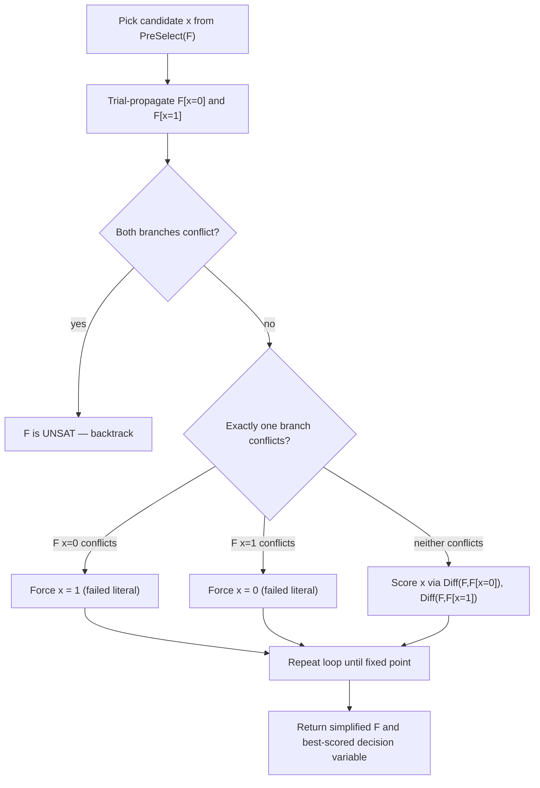

# Look-Ahead Solving

[[book-guidelines|↩ Back to guidelines]]

## Why spend time before you decide anything

Picture two ways to explore an unfamiliar city on foot. Strategy one: at every intersection, glance around, pick whichever street looks most promising, and walk. If you eventually hit a dead end, backtrack to the last intersection where you probably went wrong and try again — writing the dead end down so you don't repeat it. Strategy two: at every intersection, before committing to anything, actually *walk down each adjacent street a little way*, see what each one reveals, and only then decide which one to commit to (and in which order to explore the rest). The book opens Chapter 5 with exactly this analogy, and it is not decorative — it is the entire design tension of the chapter. Strategy one is conflict-driven search (CDCL, the subject of the previous chapter): cheap per-step decisions, recovery paid for only when things go wrong, and a growing memory of past failures. Strategy two is **look-ahead**: expensive per-step decisions bought by actually simulating each candidate branch before committing, with the payoff that a much smaller number of (better-chosen) steps are needed overall.

Look-ahead is still built on the DPLL skeleton — recursively assign a decision variable, propagate, recurse into each branch, backtrack on conflict. What changes is *how expensive and how informative* each decision is. CDCL invests almost nothing in choosing where to branch and instead invests in remembering why past branches failed (via learned clauses). Look-ahead does the opposite: it invests heavily in choosing *where* to branch, by tentatively trying each live candidate variable, watching what unit propagation does to the formula under that trial assignment, and using that observation both to pick the best variable and to harvest whatever facts the trial run turned up for free (forced variables, new implied clauses) — before any real branching happens. The chapter's punchline is that this is not merely "the slow approach that CDCL made obsolete" — it wins outright on a specific, characterizable class of instances, and understanding *why* it wins there is the throughline of the whole chapter.

## Where each architecture wins: density and diameter

Before getting into [[Runtime-Variation-and-Solver-Engineering#The mechanism|the mechanism]], the book asks the more useful question first: *for which formulas is look-ahead the right tool?* Two structural measures of a CNF formula predict the answer, and both come from viewing the formula as a **resolution graph** — clauses as vertices, with an edge between two clauses when they share exactly one clashing literal (i.e., they can resolve on that literal).

- **Density**: the ratio of clauses to variables.
- **Diameter**: the longest shortest path in the resolution graph.

Empirically (Fig. 5.2 in the source, comparing MiniSAT against the look-ahead solver `march` across the SAT 2005 structured benchmarks), look-ahead solvers dominate on **low-density or small-diameter** instances — this covers most random $k$-SAT formulas and small, tightly-coupled unsatisfiable structured instances — while CDCL dominates once diameter grows large, which is the regime of most industrial, human-designed instances.

The *mechanism* behind this split, not just the correlation, is what makes it worth remembering:

- **Density is a direct tax on look-ahead's per-node cost.** A look-ahead node performs a full trial assignment-and-propagate on *every* candidate variable, and propagation cost scales with how many clauses each variable touches. High density means every unit propagation reduces more clauses, so the look-ahead itself gets expensive exactly where CDCL's lazy (watched-literal) data structures are cheapest — because watched-literal propagation cost doesn't scale with density the same way.
- **Diameter is a direct tax on CDCL's locality assumption.** If a formula decomposes into tightly connected **local clusters** — small groups of clauses sharing few variables — assigning a decision variable only perturbs its own cluster. A look-ahead's expensive global reasoning is wasted if it only ever teaches you something about one local neighborhood at a time; you'd rather spend that budget elsewhere. Conversely, CDCL's conflict clauses are *born* local (a conflict arises from the clauses actually touched during propagation), so they naturally summarize exactly the kind of compact, reusable local fact that a clustered, high-diameter formula is full of. Look-ahead has no analogous mechanism for exploiting locality — it re-derives comparable facts freshly, per node, everywhere.

This is a genuinely different failure/success mode from CDCL's, and it is why the book treats the two architectures as complementary tools rather than as one superseding the other — the "portfolio" approach in modern SAT competitions (running several solvers and letting the best-suited one dominate) exists precisely because this split is real and not closeable by tuning either architecture harder.

## The look-ahead architecture, formally

The book states the DPLL recursion the look-ahead procedure sits inside of. A formula $F$ is reduced by **unit propagation**: assign a variable $x$ to Boolean value $B$, then repeatedly resolve any resulting unit clause (a clause with exactly one unassigned literal) by assigning that literal to make it true, until no unit clauses remain or an empty clause $\bot$ (all literals falsified) appears. Write the result as $F[x = B]$.

$$
\text{DPLL}(F): \quad
\begin{cases}
\textbf{satisfiable} & \text{if } F = \emptyset \\
\textbf{unsatisfiable} & \text{if } \bot \in F \\
\text{DPLL}(F[x_{\text{decision}} = B]) \text{ or } \text{DPLL}(F[x_{\text{decision}} = \lnot B]) & \text{otherwise}
\end{cases}
$$

where $x_{\text{decision}}$ and the (possibly further-simplified) $F$ come from a call to `LookAhead(F)`, and $B$ comes from a **direction heuristic** deciding which branch to try first. The crucial architectural fact: in plain DPLL, variable selection is a cheap side query. In the look-ahead architecture, `LookAhead` is doing double duty — it selects $x_{\text{decision}}$ *and* it simplifies $F$ along the way, by actually trying candidate assignments.

Concretely, a **look-ahead on $x$** means: tentatively assign $x$ to true, run unit propagation, observe the effects (how much the formula shrank, what got forced, whether a conflict appeared), then undo the trial and move to the next candidate. Two things fall out of this one operation, and they are the two heuristic categories the rest of the chapter is organized around:

1. **A decision heuristic** (`Diff` + `MixDiff`) — quantifying, from the trial-propagation results on both polarities of $x$, how good a branching variable $x$ would be.
2. **Failed-literal detection** — if the trial propagation on $x$ itself reaches a conflict ($\bot \in F[x=1]$), then $x$ can never be true in any extension of the current partial assignment, so $\lnot x$ is *forced* — for free, without ever actually branching on $x$.

### `Diff` and `MixDiff`: measuring how much a trial branch would help

`Diff(F, F[x=B])` is a statistic measuring how much the formula shrank under the trial assignment $x=B$ — the book notes effective choices include the reduction in free variable count and, more commonly, the count of newly created (reduced-but-not-satisfied) clauses. The chapter walks through the historical progression of concrete `Diff` functions (Section 5.3.1, detailed further below), but the structurally important move is what happens next: since a look-ahead is performed on *both* polarities of $x$, you get two numbers, $L := \text{Diff}(F, F[x=0])$ and $R := \text{Diff}(F, F[x=1])$, and these need to be combined into one score for $x$. This combination is `MixDiff`, and the book is explicit that the **product** is the historically dominant and theoretically justified choice, not the sum:

$$
\text{MixDiff}(x) = 1024 \cdot L \cdot R + L + R
$$

(the exact constant from `posit`, one of the earliest true look-ahead solvers — the $1024$ factor exists purely to make the product term dominate the additive term, which is retained only for tie-breaking). Why the product and not the sum? Because a *balanced* reduction on both branches is worth more than a lopsided one: a variable that reduces the formula a lot on one branch and barely at all on the other is a poor pivot, because the branch that barely shrank is nearly as hard as the original problem — you've paid for a decision that didn't actually simplify the harder half. The product rewards variables where *both* branches shrink, which drives the search tree toward balance. (The book flags, and Chapter 8 makes rigorous, that "balanced" is not a goal in itself — the perfectly balanced $2^n$ tree is balanced and useless — the real target is *small and balanced*, and the product turns out to approximate the right notion of "small" better than the sum does; this is proved via the $\tau$-function machinery in Chapter 8, not asserted here.)

**Worked example (Ex. 5.2.1 in the source).** For
$$
F_{LA} = (\lnot x_1 \lor x_3) \land (x_1 \lor x_2 \lor x_3) \land (x_1 \lor \lnot x_2 \lor x_4) \land (x_1 \lor \lnot x_2 \lor \lnot x_4) \land (x_2 \lor \lnot x_3 \lor x_4),
$$
look-ahead on $\lnot x_1$ creates 3 new binary clauses; look-ahead on $x_1$ forces $x_3$ true via propagation, reducing further; look-ahead on $\lnot x_3$ produces an outright conflict (so $\lnot x_3$ is a **failed literal**, forcing $x_3 = 1$ before any branching decision is even made). Once all per-literal reduction counts are tabulated, $x_2$ turns out to have the highest product of its two branch reductions ($2 \times 2 = 4$ in the book's toy numbers) and is selected as the actual decision variable.

**Why iterate.** Detecting a failed literal changes $F$, which invalidates the `Diff` measurements taken before that discovery. So `LookAhead` re-runs its pass over the candidate variables until a fixed point — no new failed literals and no new forced facts in the last pass — trading extra propagation cost for a heuristic score computed against the *actual* current formula rather than a stale one.

### Failed-literal detection as a discipline, not an afterthought

This is the point most worth dwelling on, because it collapses a distinction CDCL keeps separate. In CDCL, "which variable to branch on" and "what can we infer without branching" are different subsystems: propagation (BCP) infers, and a wholly separate heuristic (VSIDS, say) decides. In look-ahead, both come from the *same* operation — running unit propagation to see what happens: if propagation reaches a contradiction, you've inferred a forced literal; if it doesn't, the *size* of what it reduced is your branching signal. Failed-literal detection is thus not a bolt-on feature — it is unit propagation and limited resolution reasoning folded directly into the variable-selection step. The `LookAhead` pseudocode in the source (Algorithm 5.3) makes this literal: for each preselected candidate $x_i$, the loop checks whether *either* polarity is already an empty clause before ever computing a heuristic score for it — a failed literal short-circuits straight to a forced assignment, and only variables surviving both checks get scored by the decision heuristic.



Because a failed-literal discovery can cascade (forcing one variable can make another variable's opposite polarity newly fail), the loop iterates to a fixed point per node before ever branching for real — the book calls this "iterating until nothing important has been learned." This is also exactly where later refinements plug in: **local learning** (Section 5.4.1) promotes *indirect* implications discovered during a look-ahead into standalone binary clauses valid under the current partial assignment (removed on backtrack); **necessary-assignment detection** finds variables forced to the same value by *both* polarities of the look-ahead literal, without needing that variable to be preselected at all; and **autarky detection** (Section 5.4.2) recognizes when a trial assignment creates *no* new clauses at all, meaning the branch is satisfiability-equivalent to the whole formula and can be taken for free.

**Rust sketch — the shape of one `LookAhead` pass.** This is close to what the inner loop of Algorithm 5.3 looks like as real code; note that `trial_propagate` is the *same* propagation routine CDCL uses for BCP — the only architectural difference is that here it's called speculatively, on every preselected candidate, and always undone:

```rust
enum LookAheadOutcome {
    ForcedTrue,           // ¬x failed: x must be true
    ForcedFalse,          // x failed: x must be false
    Unsat,                // both polarities failed
    Scored { diff_l: u32, diff_r: u32 }, // survived, scored for branching
}

fn look_ahead_on(formula: &mut Formula, x: VarId) -> LookAheadOutcome {
    let snapshot = formula.snapshot();               // cheap trail-based undo
    let neg_conflict = formula.trial_propagate(x, false).is_conflict();
    formula.restore(&snapshot);
    let pos_conflict = formula.trial_propagate(x, true).is_conflict();
    let diff_r = formula.reduction_since(&snapshot);  // Diff(F, F[x=1])
    formula.restore(&snapshot);

    match (neg_conflict, pos_conflict) {
        (true, true)  => LookAheadOutcome::Unsat,
        (true, false) => LookAheadOutcome::ForcedTrue,   // ¬x failed
        (false, true) => LookAheadOutcome::ForcedFalse,  // x failed
        (false, false) => {
            let diff_l = formula.reduction_since(&snapshot); // Diff(F, F[x=0])
            LookAheadOutcome::Scored { diff_l, diff_r }
        }
    }
}

fn mix_diff(diff_l: u32, diff_r: u32) -> u64 {
    // posit's constant: product term dominates, sum term only breaks ties
    1024 * (diff_l as u64) * (diff_r as u64) + diff_l as u64 + diff_r as u64
}
```

The `Scored`/`ForcedTrue`/`ForcedFalse`/`Unsat` enum is doing the same job as the CDCL chapter's `Antecedent` typestate: it makes "this variable turned out to need no branching decision at all" a distinct, exhaustively-matched case rather than a special value buried inside a shared numeric score — which is exactly the discipline Algorithm 5.3's early-return checks (`if ⊥ ∈ F[x=0] and ⊥ ∈ F[x=1]`, etc.) are enforcing in pseudocode.

To keep the (expensive) `LookAhead` procedure tractable, it is not run over every free variable — a `PreSelect` step restricts it to a candidate subset $P$ (Section 5.3.3: heuristics like `propz`, based on binary-clause occurrence counts, or `march`'s clause-reduction approximation, later made adaptive via the observed correlation between preselection size and the number of failed literals actually detected). Shrinking $P$ trades decision quality and missed failed literals for speed — the same expensive-vs-informative tension the whole architecture is built around, now applied recursively to itself.

## Density and diameter as predictors, revisited through the mechanism

Having seen the mechanism, the density/diameter story from Section 5.1.1 becomes more than an empirical correlation — it's a direct consequence of what a look-ahead actually *does*:

- Every node's cost is dominated by unit propagation performed once per preselected candidate, per polarity. That cost scales with clause density, which is why density is a direct, mechanical tax on look-ahead specifically — not an incidental correlation.
- The entire value proposition of a look-ahead — the size and quality of what one trial propagation reveals — depends on that trial's effects *reaching far* through the formula. In a high-diameter (locally clustered) formula, a trial assignment on one variable only perturbs its own cluster; the expensive global search over all preselected candidates is mostly re-deriving the same kind of small, local fact a CDCL solver's conflict analysis would produce far more cheaply and keep as a reusable clause.

This is why the two architectures are treated as domain-specialized tools throughout the rest of the handbook rather than as competing implementations of the same idea.

## Where this leads

Within the book, this chapter is the disciplined "expensive, honest inference" counterpoint to Chapter 4's "cheap heuristic, remember your mistakes" — the same NP-decision problem attacked by architectures optimized for structurally different formula shapes, which is exactly why SAT competitions keep both alive as complementary tools rather than picking a winner. Chapter 8's branching-heuristic theory (the $\tau$-function, the formal justification for the product rule over the sum rule in `MixDiff`) is the rigorous foundation this chapter's `Diff`/`MixDiff` heuristics are informally motivating; Chapter 6 (incomplete/local-search algorithms) is the third point of the same design triangle — cheap-and-approximate versus cheap-and-complete (CDCL) versus expensive-and-complete (look-ahead).

For the standing project, the load-bearing idea here is **inference folded into search itself, rather than kept as a separate phase** — failed-literal detection is unit propagation and a bounded form of resolution happening *as part of* choosing where to branch, not before or after it. That is precisely the shape of a CSP kernel doing domain/lattice propagation while searching for a counterexample: a "trial narrowing" of a variable's domain that either survives (informing the branching heuristic, exactly like `Diff`) or collapses to empty (an immediate forced fact, exactly like a failed literal) is the same design pattern as arc-consistency-style propagation embedded inside backtracking search, and the density/diameter analysis is a template for reasoning about *when* an expensive, globally-reaching inference step is worth its cost versus when a cheaper, more local one (conflict-driven, or a targeted constraint-propagation pass) dominates instead — a question that will recur when deciding how aggressively the project's own CSP kernel should propagate before branching on a candidate counterexample assignment.
