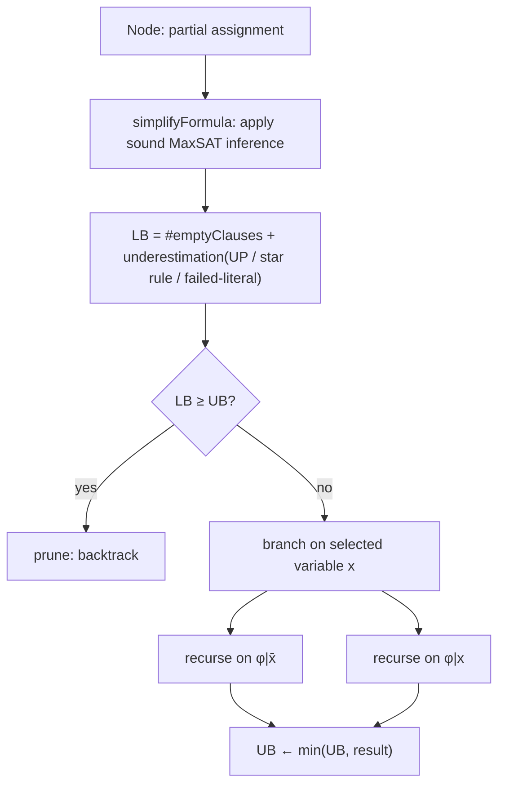
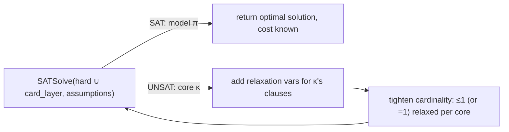
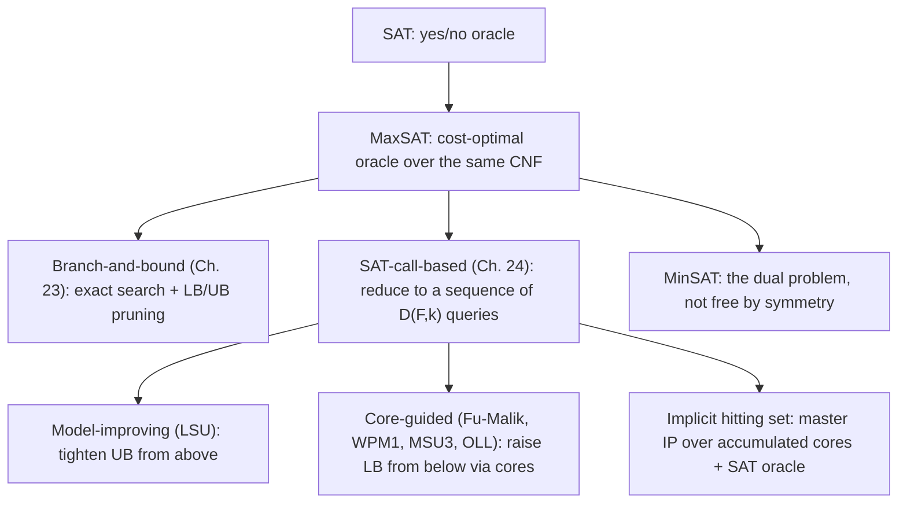

# Maximum Satisfiability

[[book-guidelines|↩ Back to guidelines]]

## Why SAT's yes/no answer isn't enough

A SAT solver answers exactly one question: does *any* satisfying assignment exist? On an unsatisfiable instance it hands back a single bit — UNSAT — and nothing else. But most real constraint sets that arise from scheduling, configuration, verification, or diagnosis are *over-constrained*: some requirements are genuinely non-negotiable (hard), and others are preferences you'd like satisfied but can live without (soft). A plain SAT encoding of such a problem is either infeasible (if you encode everything as hard) or silently wrong (if you drop soft constraints ad hoc to force satisfiability). What you actually want is: satisfy all the hard constraints, and among the ways to do that, satisfy as many — or as much total weight — of the soft constraints as possible.

That's **Maximum Satisfiability (MaxSAT)**: SAT's optimization sibling. Instead of "is there a model?" it asks "what's the best model?", where "best" is measured by the total weight of falsified soft clauses. It converts SAT's binary oracle into a genuine optimization backend, and it does so by staying entirely inside CNF — no new logic, just a cost function layered over the same clauses.

## Formalizing the problem: multisets, weights, and MinUNSAT

Chapter 23 sets up the base definitions with one detail that would trip up anyone importing intuitions straight from SAT: **a MaxSAT formula is a *multiset* of clauses, not a set.** In SAT, two copies of the same clause are redundant — you can collapse them without changing satisfiability. In MaxSAT you cannot, because the *count* of unsatisfied clauses is the thing being optimized. The book's example makes this concrete: $\{x_1, x_1, x_1, \bar x_1 \lor x_2, x_2\}$ has a minimum of two unsatisfied clauses (falsify the three copies of $x_1$ together by setting $x_1=0$... but wait, that falsifies three, not fewer — the actual optimum here comes from weighing which literal to sacrifice). The point that survives regardless of the exact count: collapsing duplicate clauses into one would silently change the objective value, so the formula must track multiplicity explicitly.

Concretely, take the multiset $\{x_1,\ \bar x_1,\ \bar x_1,\ x_1\lor x_2,\ \bar x_2\}$ (the book's own example). Collapsing the two copies of $\bar x_1$ into one, as SAT would, changes the answer: with both copies kept, no assignment does better than 2 unsatisfied clauses (setting $x_1=1$ leaves both $\bar x_1$ copies falsified; setting $x_1=0,x_2=1$ leaves $x_1$ and $\bar x_2$ falsified) — but with only one copy of $\bar x_1$, the optimum would drop to 1. Multiplicity is part of the problem instance, not an artifact to normalize away.

**Core definitions** (Section 23.2 / Section 24.2, synthesized — the two chapters use interchangeable notation):

- A **weighted clause** is a pair $(C_i, w_i)$, $w_i > 0$, read as "falsifying $C_i$ costs $w_i$."
- A MaxSAT formula partitions into **hard clauses** $\mathrm{hard}(F)$, which every feasible solution must satisfy, and **soft clauses** $\mathrm{soft}(F)$, each carrying a weight $wt(c)$.
- A **feasible solution** $\pi$ is any assignment satisfying $\mathrm{hard}(F)$. Its **cost** is $\mathrm{cost}(\pi, F) = \sum_{c \in \mathrm{soft}(F),\, \pi \not\models c} wt(c)$ — the total weight of the soft clauses it fails to satisfy.
- An **optimal solution** minimizes cost. The MaxSAT problem is: find one.

Four historically-named special cases fall out of which parts of this general definition are trivial:

| Name | Hard clauses | Weights |
|---|---|---|
| (plain) MaxSAT | none (all soft) | all weight 1 |
| Weighted MaxSAT | none (all soft) | arbitrary |
| Partial MaxSAT | present | all weight 1 |
| Weighted Partial MaxSAT | present | arbitrary |

Modern solvers handle case 4 uniformly (hard clauses are just clauses with weight $\infty$), so the distinctions matter mostly for describing which algorithm was originally designed for which restriction — you'll see this below, since Fu-Malik (1st core-guided algorithm) only works unweighted, and needs an extra transformation to lift to the weighted case.

**MaxSAT ≡ MinUNSAT.** For exact computation, maximizing satisfied weight and minimizing falsified weight are the same optimization (they sum to the same constant, the total soft weight). The book uses "MaxSAT" and "MinUNSAT" interchangeably for this reason, and this equivalence is why every algorithm below is phrased as a *minimization* even though the problem is named "*Maximum* Satisfiability."

**The ILP view.** Chapter 23 also gives MaxSAT an integer-linear-programming encoding, useful for deriving bounds (and, per Chapter 24, occasionally used to solve MaxSAT directly). With $y_i \in \{0,1\}$ encoding variable $x_i$'s truth value and $z_j \in \{0,1\}$ encoding "$C_j$ is satisfied":

$$
\max \sum_{j=1}^m w_j z_j \quad \text{s.t.} \quad \sum_{i \in I_j^+} y_i + \sum_{i \in I_j^-}(1-y_i) \ge z_j \quad \forall j
$$

where $I_j^+, I_j^-$ are the indices of positive/negative literals in $C_j$. Read the constraint carefully: it *forces* $z_j = 0$ whenever $C_j$ is actually falsified (the left side becomes 0, so $z_j$ can't be 1), but it doesn't *force* $z_j=1$ when $C_j$ is satisfied — $z_j=0$ remains a valid (if wasteful) assignment even then. That asymmetry is exactly what makes the *relaxation* of this ILP (allowing $y_i, z_j \in [0,1]$) useful for computing lower bounds: the relaxed optimum never overstates how much weight can be satisfied.

**Rust — the data model.** This maps almost verbatim onto the book's notation:

```rust
type VarId = u32;

#[derive(Clone, Copy, PartialEq, Eq, Hash)]
struct Literal(i32); // positive = var true, negative = var false, magnitude = VarId

#[derive(Clone)]
struct Clause(Vec<Literal>);

struct SoftClause {
    clause: Clause,
    weight: u64, // positive integer weight; hard clauses use Weight::Infinite conceptually
}

struct MaxSatFormula {
    hard: Vec<Clause>,          // multiset semantics: Vec, not HashSet
    soft: Vec<SoftClause>,      // ditto — duplicates are meaningful
}
```

Using `Vec` rather than a `HashSet` for clause storage isn't a style choice — it's load-bearing, directly reflecting the multiset requirement from Section 23.2.

## Branch-and-bound: exact MaxSAT by depth-first search with pruning

Chapter 23's main content is the **branch-and-bound (BnB)** family: the classical approach for computing an exact MaxSAT solution by exploring the assignment tree depth-first, but pruning subtrees that provably cannot beat the best solution found so far.

**What breaks without pruning:** naive exhaustive search over all $2^n$ assignments is exact but useless past a few dozen variables. BnB's entire value proposition is that the pruning test is *cheap relative to a subtree* — it turns "explore this whole branch" into "check one inequality and skip it."

At every search-tree node, BnB tracks two numbers:

- **Upper bound (UB):** cost of the best *complete* assignment found so far — decreases monotonically as search proceeds.
- **Lower bound (LB):** number of clauses already falsified by the current *partial* assignment, plus an **underestimation** of how many more will inevitably become falsified once the assignment is completed.

If $LB \ge UB$, no completion of this branch can beat the incumbent — prune and backtrack. Otherwise, branch on a variable and recurse:

```
MaxSAT(φ, UB):
  φ ← simplifyFormula(φ)
  if φ has no non-empty clauses: return #emptyClauses(φ)
  LB ← #emptyClauses(φ) + underestimation(φ)
  if LB ≥ UB: return UB                       // prune
  x ← selectVariable(φ)
  UB ← min(UB, MaxSAT(φ|x̄, UB))
  return min(UB, MaxSAT(φ|x, UB))
```

Everything interesting in this family is in how tightly `underestimation(φ)` can be computed without it becoming as expensive as just solving the subproblem.

### Tightening the lower bound: from counting to unit propagation

The crudest underestimation just counts falsified clauses (no lookahead at all). Progressively smarter methods squeeze in more inference per node:

- **Wallace–Freuder inconsistency counts:** for each variable $x$ occurring in $\varphi$, count disjoint pairs of complementary unit clauses — a unit clause with $x$ paired against one with $\bar x$ is a guaranteed future conflict no matter how the rest of the formula resolves. Sum $\min(ic(x), ic(\bar x))$ over all variables and add it to the empty-clause count.
- **The star rule:** generalizes this from pairs of unit clauses to any inconsistent subformula of shape $\{l_1, \dots, l_k, \bar l_1 \lor \cdots \lor \bar l_k\}$ — $k$ unit clauses plus one clause that's their joint negation. This is provably contradictory as a set, so it contributes 1 guaranteed falsified clause to the bound.
- **UP (unit-propagation-based bounds):** run unit propagation to a contradiction, then mine the *implication graph* (the same structure CDCL uses — see [[Conflict-Driven-Clause-Learning]]) for a disjoint set of clauses forming a genuine unit refutation. Each disjoint refutation found is one more guaranteed falsified clause. This is, as of the chapter's writing, the dominant technique in competitive BnB MaxSAT solvers (ahmaxsat, MaxSatz, MiniMaxSat).
- **Failed-literal-enhanced UP:** if unit-propagating both $\varphi \wedge x$ and $\varphi \wedge \bar x$ each derive a contradiction, their combined inconsistent subsets (with the literals $x,\bar x$ themselves removed) form a *non-unit* refutation the plain UP bound would have missed entirely.

**What breaks without a careful inference rule here:** the obvious move — apply SAT's resolution rule directly — is unsound for MaxSAT. The book's counterexample: $\{x_1,\ x_1\lor x_2,\ x_1\lor \bar x_2,\ \bar x_1\lor x_3,\ \bar x_1\lor \bar x_3\}$ has a true minimum of *one* unsatisfied clause (set $x_1=0$), but naively resolving to derive two empty clauses would claim two are unavoidable. The reason: SAT resolution only preserves *satisfiability*, but MaxSAT inference must preserve the exact *count* of unsatisfied clauses for every assignment — a much stronger requirement called **MaxSAT-equivalence**. The chapter's sound rules (the star rule as an *inference* rule, the "almost-common-clause" rule, and the chain-resolution rules 23.2–23.4) are all careful to add compensation clauses precisely so this count is preserved, not just satisfiability.



## MaxSAT resolution as a complete calculus

Beyond BnB's polynomial-time inference rules, Section 23.4 (and the resolution rule of Larrosa & Heras, later refined by Bonet et al.) defines a full **MaxSAT resolution proof system**: given $(x \lor A)_{w_1}$ and $(\bar x \lor B)_{w_2}$, with $m = \min(w_1,w_2)$, replace both with their weight-reduced residues $(x\lor A)_{w_1-m}, (\bar x\lor B)_{w_2-m}$, add the resolvent $(A\lor B)_m$, and add two *compensation clauses* $(x\lor A\lor\bar B)_m$, $(\bar x\lor B\lor\bar A)_m$ to keep the transformation exactly cost-preserving. This is a genuine proof system — complete, in the sense that for every MaxSAT instance there's a MaxSAT-resolution derivation proving its exact optimal cost — but directly implementing it for solving turns out not to be practical; its main value has been as the theoretical scaffolding under a few practical algorithms (PMRes, MiniMaxSat) rather than as a solving strategy in its own right. This is worth flagging for anyone thinking about **proof-producing architectures**: it's an example of a *sound and complete calculus that exists mainly to justify other algorithms' correctness*, not to be executed — the same relationship DRAT bears to CDCL's inprocessing techniques (see [[Proofs-of-Unsatisfiability]]).

## Modern SAT-based algorithms: solving MaxSAT via a sequence of SAT calls

Chapter 24 shifts to a different algorithmic family entirely: instead of searching the assignment tree directly, treat a modern CDCL SAT solver as a black-box oracle and solve MaxSAT via a *sequence* of SAT calls. This works because weighted MaxSAT sits in the complexity class $FP^{NP}$ — solvable with a polynomial number of NP-oracle queries — and because CDCL solvers are extraordinarily good at answering individual SAT queries, especially when queries are closely related and solved *incrementally* (reusing learned clauses across calls).

### The blocking variable transformation

Every algorithm in this section first normalizes the input via the **blocking variable transformation**: replace every soft clause $c_i$ (weight $w_i$) with the hard clause $(c_i \lor \neg b_i)$ for a fresh variable $b_i$, and a new *unit* soft clause $(b_i)_{w_i}$. Now every soft clause is a single literal, which is exactly what's needed to hand soft clauses to the SAT solver as *assumptions*.

$$
F^b:\quad \mathrm{hard}(F^b) = \mathrm{hard}(F) \cup \{c_i \lor \neg b_i \mid c_i \in \mathrm{soft}(F)\}, \qquad \mathrm{soft}(F^b) = \{(b_i) \mid \dots\}
$$

This is provably MaxSAT-equivalent to $F$ (an optimal solution to $F^b$, restricted to $F$'s variables, is an optimal solution to $F$) — the proof is a direct correspondence: assuming $b_i$ forces the clause to fire; falsifying $(b_i)$ costs exactly what falsifying $c_i$ would have cost.

```rust
fn blocking_variable_transform(f: &MaxSatFormula) -> (MaxSatFormula, Vec<Literal>) {
    let mut hard = f.hard.clone();
    let mut soft = Vec::with_capacity(f.soft.len());
    let mut fresh = f.next_var_id();
    let mut assumption_lits = Vec::new();

    for sc in &f.soft {
        let b = fresh; fresh += 1;
        let mut extended = sc.clause.0.clone();
        extended.push(Literal(-(b as i32)));      // c_i ∨ ¬b_i, as a hard clause
        hard.push(Clause(extended));
        soft.push(SoftClause { clause: Clause(vec![Literal(b as i32)]), weight: sc.weight });
        assumption_lits.push(Literal(b as i32));  // used to assume b_i = true
    }
    (MaxSatFormula { hard, soft }, assumption_lits)
}
```

### Assumption-based SAT solving: how a core comes back

This is [[Runtime-Variation-and-Solver-Engineering#The mechanism|the mechanism]] every algorithm below depends on. **Assumption-based SAT solving** asks the SAT solver to satisfy $F$ *subject to* a set of assumed literals $A$. Two outcomes:

1. SAT: a model of $F \wedge \bigwedge_{l\in A} l$.
2. UNSAT, **plus a clause $c$** such that $c$ contains only negated literals of $A$ (i.e. $A \models \neg c$) and $F \models c$ — a conflict clause entailed by $F$ over the assumption variables.

That returned clause $c$ is exactly a **MaxSAT core**: a subset $K$ of soft clauses such that $K \cup \mathrm{hard}(F)$ is unsatisfiable — i.e., *every* feasible solution must falsify at least one clause in $K$. Concretely: assume all blocking literals $\{b_1,\ldots,b_m\}$ true against $\mathrm{hard}(F)$; if unsatisfiable, the returned core is a set of soft clauses at least one of which every solution must sacrifice. Note the core need not be *minimal* — the solver is free to return any subset satisfying the two conditions, and minimizing it further is itself an optional (and sometimes worthwhile) post-processing step.

This is the load-bearing idea for the rest of the chapter, and it's worth pausing on why: **an unsat core is a machine-checkable certificate that a particular set of constraints cannot be jointly satisfied** — a much more informative failure signal than SAT's bare UNSAT bit. If your mental model of unsat cores currently comes from SMT/CEGAR-style refinement (where a core drives interpolant generation or predicate refinement), this is the same object, one level down: a MaxSAT core is doing for *cost lower bounds* exactly what an interpolant does for *invariant strengthening* — both are "here's the minimal reason this direction of search is dead" certificates extracted from a solver's internal refutation.

### Model-improving: LSU

The simplest algorithm, **Linear SAT/UNSAT (LSU)**, follows almost directly from the $FP^{NP}$ membership proof. Solve the decision problem $D(F,k)$ — "does a feasible solution of cost $\le k$ exist?" — starting from $k=\infty$, and each time it's satisfiable with cost $c$, re-solve with $k = c-1$. The last satisfiable call's model is optimal once $D(F,k)$ finally comes back UNSAT.

```
LSU(F):
  F^b, assumptions ← bv_transform(F); card_layer ← ∅
  loop:
    (sat?, π) ← SATSolve(hard(F^b) ∪ card_layer)
    if sat?: bestmodel ← π; card_layer ← CNF(Σ wt(b_i)·¬b_i < cost(π))
    else: return (bestmodel, cost(bestmodel))
```

Each iteration tightens a cardinality/pseudo-Boolean constraint over *all* blocking literals — simple, and useful for **incomplete solving** (every completed call yields an improved, immediately-returnable solution, which is exactly what you want if you must stop early). Its weakness is that the constraint spans every soft clause, so it scales badly once there are tens of thousands of them.

### Core-guided: work from UNSAT toward SAT

**Core-guided algorithms invert LSU's direction.** Instead of tightening a bound from above, they *increase* a lower bound from below, using the core returned by each UNSAT call to justify the increase — and, crucially, cardinality constraints only ever need to span the soft clauses that have actually *appeared in a core*, which in practice is a small fraction of the total. This is the empirical insight behind the whole family: most instances have optimal solutions that falsify few clauses, so cores tend to be small and localized.

**Fu–Malik** (the founding algorithm, unweighted only): assume all blocking literals true. Each UNSAT call returns a core $\kappa$; for every clause in the core, add a *fresh* relaxation variable $r_i^{\text{cost}}$ (so $c_i$ becomes $c_i \lor r_i^{\text{cost}}$), and add a cardinality constraint forcing *exactly one* of this core's fresh relaxation variables to be true — "you may falsify one clause from this core, no more." Increment `cost` and repeat until SAT.

```
FuMalik(F):
  F^b, assumptions ← bv_transform(F); F' ← hard(F^b); cost ← 0
  loop:
    (sat?, π, κ) ← SATSolve(F' ∪ card_layer, assumptions)
    if not sat?:
      for ¬b_i in κ: c_i ← c_i ∨ r_i^cost      // fresh var per core member
      card_layer += CNF(Σ_{i: ¬b_i∈κ} r_i^cost = 1)
      cost ← cost + 1
    else: return (π, cost)
```

Worked example from the text: $F=\{(x,\bar y),\ (y,z),\ (y,\bar z),\ (\bar x)_1,\ (\bar y)_1\}$ — here both $x$ and $y$ are logically forced true by the hard clauses, so both soft clauses *must* be falsified; every feasible solution costs exactly 2. Three rounds of Fu–Malik (each discovering the core $\{\neg b_1,\neg b_2\}$, adding a fresh relaxation variable pair, and re-tightening the $=1$ constraint) correctly converge on cost 2. Each pass proves "you can't do better than round-number" until SAT confirms the bound is tight.

**WPM1/WMSU1 — lifting to weighted instances via soft-clause cloning.** Fu–Malik's uniform "exactly one relaxed per core" logic assumes every soft clause in a core costs the same. For weighted cores, take $wt_{\min} = \min$ weight among the core's clauses; that's a *valid* lower-bound increment (cost must increase by at least the cheapest clause you're forced to sacrifice). Then **clone** every clause in the core into two copies — one at weight $wt_{\min}$ (processed exactly like Fu–Malik) and one at the residual weight $wt(c_i) - wt_{\min}$ (fed back into the pool of soft clauses for future rounds). This is why *soft clause cloning* matters as a standalone technique: it's the general mechanism for reducing a weighted core to an unweighted one without losing information, and it recurs across several weighted MaxSAT algorithms beyond WPM1 itself.

**MSU3 and later refinements (OLL, etc.)** replace the ad hoc clause modification of Fu-Malik with the general $D(F,k)$ cardinality-constraint machinery from Section 24.4.3, and pair naturally with *incremental* SAT solving — this combination (implemented in Open-WBO) was, at the time of writing, among the strongest unweighted MaxSAT solvers. The book covers these mainly to show how the core-guided idea generalizes once cardinality/pseudo-Boolean encodings (Section 24.4.2.1) are treated as reusable machinery rather than bespoke per-algorithm bookkeeping — Fu-Malik and WPM1 are best understood today as the historically important *first* instances of the core-guided pattern, not as competitive solvers in their own right.



### The implicit hitting set (IHS) approach

IHS solvers extract cores just like core-guided algorithms, but never modify the formula. Instead, they maintain an accumulated set of cores $K$ and, at each round, compute a **minimum-cost hitting set (MCHS)** of $K$ — a minimum-weight set of soft clauses that includes at least one clause from *every* core found so far:

$$
\min \sum_{(b_i)\in\mathrm{soft}(F^b)} wt((b_i))\cdot\neg b_i \quad\text{s.t.}\quad \sum_{\neg b_i \in \kappa}\neg b_i \ge 1 \ \ \forall \kappa \in K
$$

This IP's optimum is a valid **lower bound** on the MaxSAT optimum: any feasible solution falsifies a hitting set of $K$ (it must falsify $\ge 1$ clause per core), so its cost is at least the cost of a *minimum* hitting set. The algorithm alternates: solve $\mathrm{hard}(F^b)$ under assumptions excluding the current hitting set's clauses; if UNSAT, add the new core and recompute the MCHS (raising LB); if SAT, the returned model's cost gives a candidate UB. Stop the moment $LB \ge UB$.

```
IHS(F):
  F^b ← bv_transform(F); K ← ∅; HS ← ∅
  (sat?, π, κ) ← SATSolve(hard(F^b), ∅);  UB ← cost(π); LB ← 0; best ← π
  loop:
    (sat?, π, κ) ← SATSolve(hard(F^b), {b_i | (b_i)∈soft(F^b) \ HS})
    if not sat?:
      K ← K ∪ {κ}; (HS, isMCHS) ← ComputeHittingSet(K)
      if isMCHS: LB ← max(LB, cost(HS)); if LB≥UB: return best
    else:
      if cost(π) < UB: UB ← cost(π); best ← π; if LB≥UB: return best
```

The crucial engineering freedom is in `ComputeHittingSet`: it's allowed to return *non-optimal* hitting sets cheaply (just union the new core into the old hitting set — trivially valid, no IP call needed) and only occasionally invoke an expensive IP solver for a genuine MCHS. Because IHS never touches the original formula, its SAT calls stay on a fixed-size instance and its cores tend to be small (a few hundred clauses even on large industrial benchmarks) — this is the structural reason IHS solvers (MaxHS, LMHS) currently scale to problems core-guided algorithms cannot touch. Additional engineering — *seeding* constraints into the IP solver up front, *core minimization*, and IP *reduced-cost fixing* (using the LP relaxation's dual values to permanently fix some blocking variables once they can no longer affect the optimum) — layer on top of this basic loop.

**Why this matters for a CSP/abstract-interpretation toolchain:** IHS is a textbook instance of **Benders-style decomposition** — an outer integer-programming master problem (the hitting set) coupled to an inner combinatorial oracle (the SAT solver) that only ever contributes *cutting-plane-like* certificates (cores) back to the master. If you're building a CSP kernel that needs to search for counterexamples against over-approximated invariants (per your project's Abstract-Interpretation/CEGAR framing), this exact master/oracle split — accumulate refutation certificates, re-solve a cheap combinatorial relaxation over just those certificates, only fall back to the expensive oracle when the relaxation's optimum and the best-known bound disagree — is the generic pattern to reach for, independent of whether the payload is MaxSAT cost or reachability.

## MinSAT: the dual problem

Section 23.8 closes chapter 23 with **MinSAT**, whose name suggests "the same problem with $\min$ instead of $\max$" but which the chapter is careful to show is not a trivial relabeling. MinSAT asks for the assignment *minimizing* the number (or weight) of *satisfied* soft clauses, subject to hard clauses still being satisfied — the same hierarchy of restrictions applies (Weighted Partial MinSAT ⊇ Weighted MinSAT, Partial MinSAT, plain MinSAT, exactly mirroring the MaxSAT hierarchy).

Three concrete places the duality is *not* free:

1. **Meaningfulness on satisfiable instances.** MaxSAT is only an interesting question when the *hard* part is potentially unsatisfiable in isolation, or trivially, when comparing among satisfying assignments makes no sense if soft clauses can all be jointly satisfied — MaxSAT's optimum there is just "satisfy everything," uninteresting. MinSAT stays meaningful even on formulas that are fully satisfiable: minimizing satisfied *soft* clauses subject to *hard* clauses being satisfied is a genuine combinatorial question regardless of whether the soft part alone is satisfiable.
2. **Encoding asymmetry.** Representing $X = Y$ (equality) needs a *linear* number of clauses under the MinSAT direct encoding but a *quadratic* number under the MaxSAT direct encoding — and the two swap roles for $X \ne Y$. MaxSAT and MinSAT are not interchangeable choices of framing; picking the wrong one for a given constraint shape costs you an encoding-size class.
3. **Calculus asymmetry.** MaxSAT resolution (the sound, complete calculus from Section 23.4) is sound but *not complete* for MinSAT — after saturating (eliminating) a variable, MaxSAT can simply discard the clauses mentioning it, but MinSAT must additionally retain the *resulting* clauses from eliminating both polarities to stay complete. A dedicated clause MinSAT calculus had to be defined separately (Lin, Manyà, Su 2016) rather than inherited by symmetry.

The one existing branch-and-bound MinSAT solver, MinSatz, is built directly on MaxSatz's machinery (clique-partition-based upper bounds plus MaxSAT-style lower bounds), underscoring that the two problems share tooling even while diverging in the specifics above — a useful case study in how "dual" doesn't mean "solved for free by flipping a sign."

## Where this leads



Within the handbook, MaxSAT is the first of several chapters (alongside [[Model-Counting|model counting]] and pseudo-Boolean/QBF solving) that build *optimization and counting* capability on top of the plain SAT engines developed in Part I — everything here presupposes fast CDCL solving and the assumption/incremental machinery covered in [[Conflict-Driven-Clause-Learning]] and touched on again in [[Proofs-of-Unsatisfiability]] (unsat cores are a lightweight cousin of the DRAT proof objects covered there).

For your compiler/elaborator project specifically: the **core-guided and implicit hitting set loops are a direct, load-bearing template** for anything in your CSP kernel that needs to search for counterexamples against an over-approximated invariant while accumulating reasons for failure — the pattern "extract a small refutation certificate from the combinatorial oracle, feed it into a cheap master relaxation, only re-invoke the expensive oracle when the relaxation and the best-known bound disagree" is exactly the CEGAR/Benders shape you'll want when combining abstract-interpretation-style over-approximation with SAT/SMT-based counterexample search. It's worth noting honestly, though, that this topic doesn't map onto the *elaboration/unification* side of your project (metavariables, definitional equality, bidirectional typing) — nothing here is type-theoretic, and forcing a Lean-flavored translation of branch-and-bound pruning or hitting-set IPs would manufacture a connection the material doesn't actually support. The genuine payoff is entirely on the constraint-solving/proof-certificate side of the project, not the kernel/unifier side.
