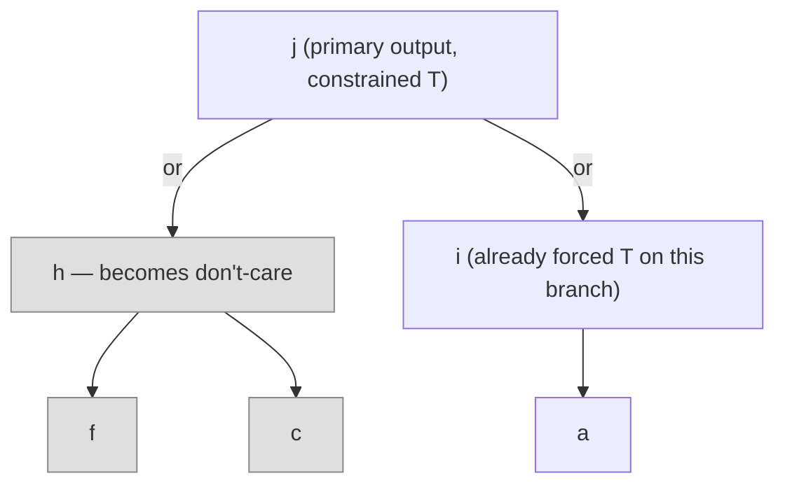

# Non-Clausal and Circuit-Based Satisfiability

[[book-guidelines|↩ Back to guidelines]]

## Why bother with anything other than CNF?

Every SAT solver you've heard of — every CDCL engine — eats conjunctive normal form: a flat conjunction of disjunctions of literals. That's not because CNF is a natural way to *think* about a problem; it's because CNF has a beautifully uniform data structure (arrays of clauses, watched literals, one shape of inference rule — resolution). The book is blunt about the tradeoff: "it is simpler to develop efficient data structures and algorithms for CNF than for arbitrary formulas. On the other hand, using CNF makes efficient modeling of an application cumbersome."

So almost nobody hand-writes CNF. You model your problem as a circuit — a DAG of gates, and, or, xor, if-then-else — because that's what your problem actually *is* (an adder, a multiplexer, a piece of hardware, a compiled boolean expression from your verifier). Then you flatten it into CNF via a standard translation before handing it to the solver. This flattening (the **Tseitin encoding**, covered in the handbook's Chapter 2) is polynomial-time and satisfiability-preserving — it introduces one auxiliary variable per gate, each constrained to be logically equivalent to that gate's function. Safe, in the worst-case-complexity sense.

But "safe" isn't "free." Two things are lost in the flattening, and this chapter's whole reason for existing is to recover them:

1. **Performance can degrade**, sometimes exponentially, because the auxiliary Tseitin variables are extra degrees of freedom the solver has to reason about, and the flat clause list no longer tells the solver "these sixteen clauses are really just one and-gate" — it has to rediscover that.
2. **Structural information disappears.** A circuit is a DAG with sharing: if two subexpressions are syntactically identical, they can literally be the same node, feeding forward to multiple parents. A CNF list of clauses has no native notion of "this variable's value doesn't matter right now" or "this subexpression is used twice" — everything is atomised down to disjunctions.

The chapter's actual claim is not "circuits beat CNF" — it's "some structural information is *only visible* at the circuit level, and if you can exploit it there, you get pruning power that's genuinely inaccessible after Tseitin flattening." That claim cashes out concretely in **observability don't-cares** (Section 27.3.6), which is the intellectual center of this chapter.

**What breaks without this:** if you build a compiler pipeline that always eagerly Tseitin-encodes every verification condition the moment it's generated, you throw away exactly the structural cues (sharing, don't-cares, cone-of-influence) that would let a circuit-aware layer prune search *before* the SAT solver ever sees a clause. For a checker built around program structure (control-flow-shaped VCs), this matters a lot more than for a synthetic random-3-SAT benchmark.

## Boolean circuits as gates and equations

The book's formal definition, verbatim in spirit:

A **Boolean circuit** is a pair $C = (G, E)$ where:
- $G$ is a finite, non-empty set of **gates**,
- $E$ is a set of **equations**, each of the form $g := f(g_1, \dots, g_n)$ with $g, g_1,\dots,g_n \in G$ and $f: \mathbb{B}^n \to \mathbb{B}$ a Boolean function,
- each gate appears as the left-hand side of at most one equation,
- the equations are **non-recursive** — the dependency graph $\mathrm{graph}(C) = (G, \{(g', g) \mid g := f(\dots, g', \dots) \in E\})$ is acyclic.

This is worth pausing on if you're coming from a compiler background: **a circuit is exactly a DAG of single-static-assignment equations** — every gate is defined exactly once, by exactly one equation, in terms of gates "below" it in a topological order. If you've built an SSA-form IR or a hash-consed expression DAG, you already have the right mental model; the book is simply putting names on the same shape (`gate` = SSA value, `equation` = defining instruction, acyclicity = the usual well-formedness invariant of an SSA graph).

Terminology, all standard graph vocabulary lifted onto the dependency DAG:
- A gate with no defining equation is a **primary input gate** (a free variable / leaf).
- A gate with no parents (nothing depends on it) is a **primary output gate**.
- $g'$ is a **child** of $g$ if $g'$ appears in $g$'s defining equation; $g$ is then $g'$'s **parent**. Fan-in/fan-out count children/parents. Descendant/ancestor are the transitive closures.
- The standard gate function library: `false`, `true` (nullary constants), `not`, `and`, `or`, the ternary `ite` ("if-then-else": $\mathrm{ite}(v_1,v_2,v_3)=T$ iff ($v_1=T \wedge v_2=T$) or ($v_1=F \wedge v_3=T$)), `odd`/parity (`xor` is the binary case), and `equiv` (n-ary "all agree").

A **truth assignment** $\tau: G \to \mathbb{B}$ is possibly partial. It's **consistent** if every assigned gate's value matches what its equation would compute from its (assigned) children — i.e., $\tau$ respects the wiring wherever it's defined. A gate's value is **justified** in $\tau$ if it's forced to that value no matter how $\tau$ is extended — primary inputs are trivially justified (nothing forces them), and an internal gate is justified once its function, applied to any consistent extension of its children's assignments, always yields that value.

A **constrained Boolean circuit** is a pair $(C, \tau)$ — the circuit plus a (typically partial) truth assignment fixing some gates' required values. $(C,\tau)$ is **satisfiable** iff some total consistent extension of $\tau$ exists. Deciding this is NP-complete, same as CNF-SAT — circuits buy you structure, not a complexity-class discount.

**Rust grounding.** This maps almost mechanically onto a compiler IR:

```rust
// A gate id is just an index into an arena — this is hash-consing / SSA territory.
type GateId = u32;

enum GateFn {
    False, True,
    Not(GateId),
    And(Vec<GateId>),
    Or(Vec<GateId>),
    Ite(GateId, GateId, GateId),
    Odd(Vec<GateId>),   // parity; binary case is XOR
    Equiv(Vec<GateId>),
    Input,               // primary input: no defining equation
}

struct Circuit {
    gates: Vec<GateFn>,           // gates[g] is the equation for gate g
    // acyclicity is an invariant: gates[g] may only reference indices < g
    // if built in topological (SSA) order, exactly like an arena-based IR
}

// A (partial) truth assignment over the circuit's gates.
struct Assignment(Vec<Option<bool>>);
```
The acyclicity invariant ("indices only reference strictly earlier indices") is precisely what an SSA-builder or a hash-consed AST already guarantees by construction — you get it for free if you build the circuit the same way you'd build any DAG-shaped IR.

**Where this connects to your project.** If your refinement-type checker emits verification conditions as ASTs of logical connectives before ever touching a solver, that AST — properly hash-consed and DAG-shaped rather than tree-shaped — *is* a Boolean circuit in this chapter's exact sense (extended with theory atoms, for the SMT case). Recognizing this means the pruning techniques below (don't-cares, cone-of-influence) are available to you *before* you emit CNF/SMT-LIB for a backend solver, purely as a structural preprocessing pass over your own IR.

## From CNF-DPLL to circuit-level DPLL

Section 27.3 generalizes the DPLL loop — decide, propagate, detect conflict, backtrack/learn — so it runs *directly* on the circuit rather than on a flattened clause list.

**Preprocessing exploits sharing.** If two equations compute the same function of the same children, one is redundant and can be merged — this is exactly common-subexpression elimination, and it's invisible once Tseitin has assigned each gate its own private clause block. Practical implementations go further and normalize into a canonical shared representation — And-Inverter Graphs (AIGs), Reduced Boolean Circuits — the same idea as hash-consing a compiler's IR so structurally-equal subterms are pointer-equal. **Cone-of-influence reduction** deletes any unconstrained primary output gate with no other dependents — dead-code elimination, verbatim.

**The tableau system generalizes unit propagation.** The book presents a rule system (its Figure 27.2/27.3) with "down" rules (propagate a gate's assigned value down onto its *children* when doing so is forced — e.g., if an and-gate is `T`, every child must be `T`) and "up" rules (propagate children's values up to force the *parent* — e.g., if any child of an and-gate is `F`, the parent must be `F`). An explicit **cut rule** handles the case where propagation alone doesn't decide a gate's value, and the tableau branches on it — this is exactly the DPLL *decision* step, generalized from "pick an unassigned literal" to "pick an unassigned gate." The book states the correspondence directly: "the explicit cut rule corresponds to the branching step in DPLL... the non-branching rules play the role of unit propagation."

**Conflict-driven learning ports over too.** Non-branching (propagation) rules can be read as implications — the book's example: for an odd-gate (xor-family) $g := \mathrm{odd}(g_1,g_2,g_3)$, the rule "if $g_1=F, g_2=T, g_3=F$ then $g=T$" is literally the clause $(g_1 \vee \neg g_2 \vee g_3 \vee g)$. Tracking these implications during search builds an **implication graph** exactly as in clausal CDCL (see the handbook's Chapters 3–4), and a conflict yields a learned constraint that can be added back as a new gate: an or-gate over the (possibly negated) conflicting gates, constrained to `T`. So circuit-level CDCL is not a different algorithm from clausal CDCL — it's the *same* algorithm with a richer notion of "propagation rule," and the book shows the propagation rules are literally equivalent to a fixed small set of clauses per gate (Section 27.3.4 works out the and-gate case explicitly: the rules for $g:=\mathrm{and}(g_1,\dots,g_k)$ correspond exactly to the clauses $(\hat g \vee \neg\hat g_i)$ for each $i$ and $(\neg\hat g \vee \hat g_1 \vee \dots \vee \hat g_k)$ — the same clauses Tseitin encoding would produce).

**Lean framing.** If you think of `justified` as "this gate's value is a *definitional consequence* of its already-fixed children, under any completion" — that's the same shape of claim as "this term is definitionally equal to a value regardless of how remaining metavariables get solved." It's not literally `isDefEq`, but the *pattern* — a value that's forced, independent of how the rest of the assignment/substitution turns out — recurs constantly once you build a solver with partial information (partial substitutions in unification, partial assignments in a circuit/CDCL solver). Recognizing "this is forced no matter what" as a single reusable concept, rather than re-deriving it per-domain, is exactly the kind of transferable mechanism this book chapter is teaching.

## Observability don't-cares

This is the concept the book flags as genuinely CNF-invisible, and it's worth internalizing carefully because it's the chapter's real payload.

**Definition (informal, from the book):** a gate $h$ is an **observability don't-care** under the current partial assignment if $h$'s value *cannot influence* whether any constrained gate is satisfied — i.e., once some ancestor of $h$ is already justified independent of $h$, nothing downstream of $h$ can still cause a conflict, no matter what value $h$ ends up taking.

Concretely: if a primary output gate $j$ becomes justified purely from the branch that was already taken (say, because an or-gate feeding into $j$ has one child already forced to `T` — and or-gates only need *one* `T` child to be `T`), then the *other* child of that or-gate, and everything feeding it, no longer matters. The search doesn't need to branch on those gates at all — that's a genuine reduction in search-space size that a flat CNF has no clean way to express, because CNF has no notion of "this whole subformula is now irrelevant"; it would need per-clause bookkeeping to reconstruct the same fact.

The subtler and more surprising fact the book highlights: don't-cares can **retroactively mask earlier decisions**. If the search first branches on gate $g$ (say, sets it to `T`) and only later, via a different branch, ends up justifying the top-level constraint without $g$'s value mattering at all, then the *actual* satisfying assignment found may disagree with the earlier decision for $g$ — because $g$ turned out to be an unobservable, decorative choice the whole time. If a solver detects this unobservability as it happens, it can **terminate the search early**, even while some assigned gates remain formally unjustified — because their justification is moot. Missing this detection costs a full extra backtrack-and-flip cycle to rediscover, via brute force, what the don't-care analysis would have told you directly.

Implementation-wise (Section 27.3.6), don't-care status is recomputed incrementally after each propagation step, using techniques structurally identical to watched-literal bookkeeping: each non-output gate keeps a "don't-care watch parent" — one parent responsible for "still needs me." When that parent itself becomes justified or don't-care, the child hunts for another live parent to watch; failing that, the child becomes don't-care too, and the marking recurses downward. This is the same amortized-cost trick as two-watched-literals: don't recompute global relevance from scratch on every step, maintain it incrementally via a sparse "who's watching whom" structure.

**Why this belongs on your radar for the CSP/abstract-interpretation kernel.** Observability don't-cares are structurally the same idea as **slicing on relevance to a goal literal** in a constraint solver, or as an over-approximating abstract interpreter recognizing that a branch of the program's control flow is provably dead with respect to the invariant being checked — in each case you're detecting "this subcomputation cannot affect the answer" from *structure*, before doing the (expensive) work of actually computing it. If your CSP kernel is going to search for counterexamples against refinement-type invariants over a program's control-flow-shaped constraint graph, a circuit-level don't-care analysis is a direct, off-the-shelf pruning strategy for that search — arguably a better fit than a generic CNF-level analysis, since your VCs are naturally DAG/circuit-shaped before any CNF encoding happens.


*Once `i` alone justifies `j` (an or-gate needs only one `T` child), `h` and everything below it — shaded — are observability don't-cares: the search need not branch on them at all.*

## Structure-based search heuristics

Three further gains from staying at the circuit level (Section 27.3.7), briefly:

- **Branch only on primary inputs.** Since input values determine every other gate's value via propagation, restricting decisions to primary inputs shrinks the effective search space from $O(2^{|G|})$ to $O(2^{|\mathrm{inputs}(C)|})$ — the same insight PODEM independently discovered for ATPG (below), arrived at from the SAT side.
- **Top-down search with justification frontiers.** Rather than branching arbitrarily, branch only on children of gates that are currently assigned-but-unjustified — this drives the search to resolve exactly the assignments that still need justifying, and it interacts naturally with observability don't-cares (a gate outside the current justification frontier is very often a don't-care).
- **Signal correlation.** Gates that are structurally close (share many ancestors/descendants) tend to have correlated values across the search; this can seed better branching-variable and branching-value heuristics than a purely CNF-level activity score would.

## Automatic test pattern generation (ATPG)

The chapter pairs circuit SAT with **ATPG** because the two communities converged on almost the same algorithmic machinery independently, and each has lessons for the other.

**The problem.** After fabricating a physical chip, you need to check it actually implements its logical specification — manufacturing defects (opens, shorts, process variation) can make a chip that's logically correct on paper behave wrong in silicon. Since you can't test every possible physical defect, you fix an abstraction: the **Stuck-At Fault Model (SAFM)**. A single line is assumed stuck at a fixed value — **SA0** (stuck at 0) or **SA1** (stuck at 1) — instead of depending on its actual inputs. This is a deliberately crude abstraction (real defects are messier — bridging faults, delay faults), but it dominates practice because the number of stuck-at faults scales linearly with circuit size and testing for them is comparatively cheap.

A **test pattern** for a given fault is a primary-input assignment that produces *different* output values in the faulty vs. fault-free circuit — i.e., an assignment that makes the fault observable. Formally: build the **Boolean difference** of the fault-free and faulty circuits (structurally the same trick as a *miter circuit* used in equivalence checking — join two copies of the circuit, XOR their corresponding outputs, and ask whether that XOR can be `T`). If it's satisfiable, the witness *is* a test pattern; if unsatisfiable, the fault is **redundant** (undetectable by any input — logically dead code, in effect, at the hardware level).

**Classical algorithms work directly on circuit structure**, and the lineage is a nice case study in incremental algorithmic refinement:
- **D-algorithm** (Roth, 1966): introduces a 4-valued logic $\{0,1,D,\bar D\}$ where $D$/$\bar D$ mark a line differing between correct and faulty behavior. The algorithm must **justify** a D-value at the fault site (find input conditions that produce it) and **propagate** it to some output along a "D-chain" — a path where every intermediate gate carries a D-value. Search space: $O(2^s)$ over all $s$ signals.
- **PODEM** (1981): branches only on primary inputs (exactly the SAT-side optimization above), cutting the space to $O(2^n)$ over $n$ inputs — at the cost of sometimes wastefully deriving a fully-implied-but-useless internal state before realizing the fault wasn't detected.
- **FAN** (1983): branches additionally on fan-out stems (points where a signal splits), tracking both a justification frontier (moving toward inputs) and a propagation frontier (moving toward outputs) — letting the search make its "most important decision" first via heuristics, rather than PODEM's rigid propagate-then-justify order.
- **SOCRATES / HANNIBAL**: add **global implications** — indirect consequences of a partial assignment that aren't visible from any single gate's local rule but follow from reasoning across several gates jointly. HANNIBAL derives these via *recursive learning* (complete but expensive) as an offline preprocessing pass, then reuses the learned implications during the online search — precisely the CDCL move of paying an upfront learning cost to shrink the online search tree, just done as a dedicated preprocessing phase rather than incrementally during the same run.

**SAT-based ATPG.** Since SAT-based approaches (from Larrabee 1992 and Stephan et al.'s TEGUS/PASSAT onward) outperform 40+ classical competitors in head-to-head comparisons, the chapter walks through the reduction in detail:

1. Convert the circuit to CNF via the standard **circuit-to-CNF (Tseitin) transformation**: for each gate, enumerate its truth table, take one clause per *falsifying* row (a clause the assignment must avoid), then minimize (e.g. an and-gate's naive 4-clause encoding minimizes to 3 clauses: $(\bar a \vee \bar b \vee c)$, $(a \vee \bar c)$, $(b \vee \bar c)$). This is the exact same Tseitin encoding from Chapter 2 of the handbook, worked out mechanically per gate type.
2. Locate the fault site and compute its **fault shadow** — the transitive fan-out of the faulty line, i.e. every gate structurally reachable from it. Only this shadow needs duplicating into "fault-free" and "faulty" copies (a targeted miter); everything outside the shadow behaves identically in both circuits and is shared, not duplicated.
3. Constrain the XOR/OR of corresponding fault-free/faulty outputs to `T` (at least one output must diverge), hand the whole thing to a CNF-SAT solver: **SAT ⇒ the satisfying assignment's primary-input values are a test pattern**, **UNSAT ⇒ the fault is redundant.**
4. Recover lost structural information as extra constraints (TEGUS), and — in PASSAT — move to **four-valued logic** (adding unknown/tri-state values) so the multi-valued ATPG problem itself needs its own careful Boolean encoding before it becomes a CNF instance a binary SAT solver can consume.

**Why ATPG matters beyond hardware.** The whole ATPG framing — "find an input that makes a specific internal fault observably diverge at an output, by jointly justifying a value backward and propagating it forward through structure" — is a specialization of exactly the abductive/counterexample-search problem your CSP kernel needs for refinement-type checking: given a claimed invariant violation deep inside a program's control-flow graph, find concrete inputs that both *reach* that program point (justification, backward) and *manifest* as an observable postcondition failure (propagation, forward). The D-chain notion — "a path from the suspect point to an observable output where every intermediate step is still consistent with divergence" — is a natural analogue of a *feasible path condition* in symbolic execution: a path from a candidate bug location to program exit where nothing along the way rules it out. Miter-style equivalence-checking constructions (join two circuit copies, ask if outputs can differ) also directly generalize to differential/regression verification: "does this refactored program ever behave differently from the original on some input?" is the exact same shape of question, just over program semantics instead of gate semantics.

## Where this leads

This chapter's material sits parallel to, rather than beneath, the handbook's main clausal-SAT spine: everything here (circuit-level DPLL, don't-cares, ATPG) is a *reformulation* of the same DPLL/CDCL machinery from Chapters 3–4 at a different representation level, not a new foundation. It depends on:
- **Chapter 2's Tseitin encoding**, which this chapter both motivates the avoidance of (Section 27.1) and falls back on directly whenever a circuit-SAT problem is ultimately handed to a CNF-based solver (Section 27.4.2.1) — the two representations are duals of the same underlying satisfiability question, not competitors with different answers.
- **Chapters 3–4's DPLL/CDCL and watched-literal machinery**, which every technique here is a structural generalization of (tableau rules ↔ unit propagation, circuit-level learned gates ↔ learned clauses, don't-care watch parents ↔ watched literals).

What depends on it, going forward in the handbook and in practice: preprocessing techniques for CNF solvers that try to *recover* circuit structure after the fact (structural hashing, extracting gates from clause patterns) are essentially trying to claw back what this chapter shows you get for free if you never flatten in the first place — a strong argument, for your own compiler's verification backend, to keep verification conditions in DAG/circuit form for as long as possible before any CNF or SMT-LIB emission, precisely so that don't-care and cone-of-influence-style pruning stay available to a custom CSP kernel before the "real" solver ever sees the problem.
