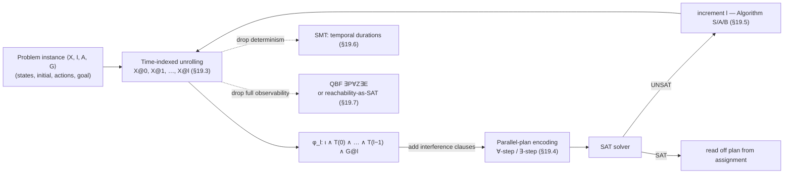

[[book-guidelines|↩ Back to guidelines]]

# Planning as Satisfiability

## Why turn "find a sequence of actions" into "find a satisfying assignment"?

Classical AI planning asks: given an initial state, a set of actions with preconditions and effects, and a goal condition, is there a sequence of actions that gets you from the initial state to a state satisfying the goal? Read literally, this is a search problem over a state-transition graph, and the obvious algorithms are graph-search algorithms — forward state-space search, backward regression search, plan-space search. All of them work directly with the transition system as a graph you walk.

Kautz and Selman's 1992 idea was to stop walking the graph and instead *describe* it. Fix a plan length $n$ ("does a plan of length $n$ exist?") and compile the entire question — every state variable's value at every time step from $0$ to $n$, every action's applicability, every effect — into one big propositional formula $\varphi_n$. Then $\varphi_n$ is satisfiable if and only if a length-$n$ plan exists, and a satisfying assignment *is* the plan: read off which action variables are true at each time step. Planning search becomes SAT search.

This looks suspicious at first, because classical planning is PSPACE-complete [Byl94]. If P ≠ PSPACE, there is no polynomial-time translation from *general* planning instances into SAT (an NP-complete target), full stop — that would collapse PSPACE into NP. So what is actually going on? The resolution is in what "the size of the input" means. The PSPACE-hardness is with respect to the size of the *problem description* (how many state variables, how many action schemas). But $\varphi_n$'s size scales with the *plan length* $n$ you're testing, not directly with problem-description size — and for the overwhelming majority of practically interesting planning problems, the shortest solution plan has length polynomial in the problem description. So you're not solving the PSPACE-complete problem in one shot; you're solving a sequence of NP problems ("is there a plan of length exactly $n$?") for $n = 0, 1, 2, \ldots$, and for practical instances you hit a satisfiable one while $n$ is still small. The PSPACE-hardness doesn't vanish — it reappears as "in the worst case you might have to try exponentially large $n$ before finding a plan, or before concluding none exists." Bounding by $n$ is exactly what keeps you inside SAT's NP world instead of PSPACE's.

This is the same trick Bounded Model Checking (Chapter 18 of this handbook) plays on model checking: unroll a transition system for $k$ steps, encode "does a bad state appear within $k$ steps" as SAT, and accept that unbounded verification (an inherently harder, often undecidable-in-practice question) is being approximated by an increasing sequence of bounded, decidable ones. If you've read that chapter, almost every structural move here will look familiar — the time-indexed variable trick, the frame-axiom problem, the iterate-over-bound-and-test loop. Planning-as-SAT (1992) actually predates and helped inspire SAT-based BMC (1999).

The book identifies three genuinely separate levers that determine whether this whole approach is efficient in practice, and the chapter is organized around them:

1. **Encoding quality** — how compactly and tightly $\varphi_n$ represents the planning problem for a fixed $n$ (§19.3, §19.4).
2. **SAT-solving efficiency** — how fast a solver decides $\varphi_n$'s satisfiability (the rest of the handbook, not this chapter).
3. **Bound-selection strategy** — which values of $n$ to test, and in what order/schedule (§19.5).

## Classical planning, formalized (§19.2)

Before any SAT encoding, the book fixes what a planning problem actually *is*, precisely.

States are total functions $s : X \to \{0,1\}$ over a set $X$ of Boolean state variables. Formulas are built from state variables with $\lor, \lnot$ (with $\land, \to, \leftrightarrow$ as the usual derived connectives). A **literal** is $x$ or $\lnot x$ for $x \in X$; write $\overline{l}$ for the complement of literal $l$.

**Definition 19.2.1 (Action).** An action over $X$ is a pair $\langle p, e \rangle$ where $p$ is a formula over $X$ (the **precondition**) and $e$ is a set of pairs $f \Rightarrow d$ (the **effects**), where $f$ is a formula over $X$ and $d$ is a set of literals over $X$. When $f \neq \top$, this is a **conditional effect**: $d$ only fires if $f$ holds in the state where the action is executed.

The **active effects** of action $a = \langle p, e \rangle$ in state $s$ collect every $d$ whose guard holds:
$$[a]_s = \bigcup [e]_s = \{\, d \mid f \Rightarrow d \in e,\ s \models f \,\}$$

$a$ is **executable** in $s$ iff $s \models p$ *and* $[a]_s$ is consistent (never contains both $x$ and $\lnot x$). If executable, $\mathrm{exec}_a(s)$ is the unique state obtained by forcing the literals of $[a]_s$ true and leaving every other variable unchanged. This extends to sequences ($\mathrm{exec}_{a_1;\ldots;a_n}$, folded left-to-right) and to *sets* of simultaneously-executed actions $S$ — $\mathrm{exec}_S(s)$ requires every $a \in S$ individually executable and the union $[S]_s = \bigcup_{a \in S}[a]_s$ jointly consistent (this is exactly where "can these two actions safely happen at once" will later become the crux of parallel-plan encodings, §19.4).

One more piece of bookkeeping does a surprising amount of work later: the **effect precondition**
$$EPC_l(a) = \bigvee \{\, f \mid f \Rightarrow d \in e,\ l \in d \,\}$$
is the formula characterizing exactly the states in which literal $l$ becomes an active effect of $a$ (empty disjunction $= \bot$). It packages "does this action, in this state, make this particular literal true" into a single formula you can index by $(l, a)$.

**Lemma 19.2.1.** $l \in [a]_s \iff s \models EPC_l(a)$.

This lemma is the load-bearing bridge between the semantic definition of "active effect" (a set-membership fact about a particular state) and a purely syntactic, state-independent formula $EPC_l(a)$ that can be compiled once per action and then instantiated at every time step. Everything from here to the end of §19.3 is this lemma, applied repeatedly.

A **plan** for problem instance $\pi = \langle X, I, A, G\rangle$ (state variables, initial state, actions, goal formula) is a sequence $\sigma = a_1;\ldots;a_n$ with $\mathrm{exec}_\sigma(I) \models G$.

**Grounding — this is a labeled transition system, typed.** If you've built an interpreter or an abstract machine, `Definition 19.2.1` is just a state-transition function with guarded, possibly-conflicting effects — the same shape as a CEK machine's transition relation, or a Datalog-style "if guard then fact" rule. In Rust, the natural typed encapsulation is:

```rust
struct Action {
    precondition: Formula,               // p
    effects: Vec<(Formula, Vec<Literal>)>,  // (f, d) pairs
}

impl Action {
    fn active_effects(&self, s: &State) -> Vec<Literal> {
        self.effects.iter()
            .filter(|(f, _)| s.satisfies(f))
            .flat_map(|(_, d)| d.iter().cloned())
            .collect()
    }

    fn executable_in(&self, s: &State) -> bool {
        s.satisfies(&self.precondition) && is_consistent(&self.active_effects(s))
    }

    fn epc(&self, l: Literal) -> Formula {
        // disjunction of every guard f such that l appears in that effect's d
        or_all(self.effects.iter()
            .filter(|(_, d)| d.contains(&l))
            .map(|(f, _)| f.clone()))
    }
}
```
`epc` is precisely the compiled, state-independent version of `active_effects` filtered to one literal — Lemma 19.2.1 is the correctness proof that this refactoring is sound.

## Sequential plans: the time-indexed encoding (§19.3)

Now the actual compilation into propositional logic. For every $t \ge 0$, introduce a **fresh copy** of every state variable: $X@t = \{x@t \mid x \in X\}$, read "the value of $x$ at time $t$." (Notation: $\varphi@t$ means "$\varphi$ with every $x$ replaced by $x@t$.") This is the single central device of the whole chapter — and it is *exactly* the device Bounded Model Checking uses to unroll a transition relation into a finite formula: one variable copy per time step, glued together by a per-step transition formula.

The per-action transition formula:
$$\tau_a = p@0 \land \bigwedge_{x \in X}\Big[\big(EPC_x(a)@0 \lor (x@0 \land \lnot EPC_{\lnot x}(a)@0)\big) \leftrightarrow x@1\Big] \tag{19.1}$$

Read the conjunct for each $x$ as: "$x$ is true after the action iff *either* the action's effects actively made it true, *or* it was already true and the action didn't actively make it false" — this is the **frame axiom** for $x$ under action $a$, stated directly as a biconditional rather than as the usual "if untouched, unchanged" implication. Union over all actions gives $T(0) = \bigvee_{a \in A} \tau_a$ — "some action was taken."

**Theorem 19.3.3** assembles the whole bounded plan-existence question:
$$\iota \land T(0) \land T(1) \land \cdots \land T(t-1) \land G@t \tag{19.3}$$
(with $T(i)$ obtained from $T(0)$ by shifting the time indices, and $\iota$ pinning $X@0$ to the initial state) is satisfiable iff a $t$-step plan exists. A satisfying assignment gives you the whole state trajectory; reading off which action's $\tau_a$ "fired" at each step reconstructs the actual plan.

**What breaks without the time-indexing.** If you tried to write one formula per state variable without per-step copies (just $x$, not $x@0, x@1, \ldots$), you'd be asking a single Boolean variable to simultaneously mean "true at time 0" and "true at time 5" — which collapses the entire trajectory into a single snapshot and makes it impossible to express "$x$ changes." Time-indexing is what lets a *static* propositional formula describe a *dynamic* process at all; it's the same reason SSA form gives every reassignment in an imperative program a fresh name before handing it to a solver.

**Improvements (§19.3.1).** Two orthogonal tightenings matter in practice:
- *Reachability approximations (invariants).* A plain SAT encoding of $\tau_a$ permits the search to wander through *unreachable* states — e.g. two variables that in fact can never both be 1 simultaneously in any reachable state, but nothing in $\tau_a$ forbids it locally. Adding cheap, automatically-inferred 2-literal invariant clauses like $\lnot x_i \lor \lnot x_j$ (mutexes, first introduced via Blum & Furst's planning graphs) prunes these away and can improve solving time enormously, for the same reason a good abstract-interpretation-derived invariant prunes a symbolic-execution tree: it rules out states the solver would otherwise have to explore and refute one at a time.
- *Factoring.* Ground actions instantiated from a schema (e.g. `move(x,y,z)`) can blow up combinatorially ($|X|\times|Y|^2$ variables); representing the instantiation itself propositionally, over just the schema's parameters ($|X|+2|Y|$ variables), avoids materializing the full ground action set. This trades encoding compactness against potential parallelism — see below.

## Parallel plans (§19.4)

A purely sequential plan totally orders every action, even ones that are semantically independent (e.g. "make $a$ true" and "make $b$ true" for unrelated $a, b$). Forcing a total order the SAT encoding has to search through wastes both formula size and solver effort. Parallel plans let one "time point" contain a *set* of simultaneous actions.

**∀-step plans (Definition 19.4.1).** $T = S_0,\ldots,S_{l-1}$ is a ∀-step plan iff its execution is well-defined *no matter which total order* you pick within each $S_i$ — every action in $S_i$ must be executable no matter what order the others in $S_i$ ran in. This is GraphPlan's [BF97] notion, and it's the strict, easy-to-check option: define **affects** (Definition 19.4.3 — one action's effects touch a variable that appears in another's precondition or a conditional effect's guard) and **interference** (Definition 19.4.4 — either affects the other), then just forbid interfering actions from co-occurring:
$$\lnot(a_1@t \land a_2@t) \tag{19.11}$$
for every interfering pair, at every time point. Cheap to state, cheap to check (syntactic, not semantic), but conservative — it disallows some sets of actions that *would* actually behave consistently under some fixed order, just not under every order.

**∃-step plans (Definition 19.4.5)**, due to Dimopoulos et al. and formalized by Rintanen et al., relax this to "*some* total order makes the set executable" — strictly more permissive (Theorem 19.4.1: every ∀-step plan is a ∃-step plan). The **Russian-doll example** (Example 19.4.1) makes the gap concrete: nesting four dolls needs three sequential ∀-steps ($\{a_1\},\{a_2\},\{a_3\}$) but only *one* ∃-step ($\{a_1,a_2,a_3\}$, since executing them in the order $a_1;a_2;a_3$ works even though the effects of each overlap the next's precondition region). Checking ∃-step validity in full generality is intractable (Definition 19.4.5's existential-order quantifier is itself a search problem), so practice falls back to a tractable sufficient condition (Theorem 19.4.2): fix one total order on actions upfront and only forbid a pair $(a_i,a_j)$, $i<j$, from co-occurring when $a_i$ *affects* $a_j$ — asymmetric, and quadratic-but-improvable-to-linear in size (via the `affects` graph's strongly-connected components).

**Grounding — this is exactly a scheduling/independence problem.** If you've worked with instruction schedulers or SIMD auto-vectorizers, ∀-step vs. ∃-step is the SAT-encoding analogue of "must these two operations be kept in program order" (true dependence, like `affects`) vs. "can I find *some* legal reordering" (∃-step's weaker existential guarantee). A Rust sketch of the interference test:

```rust
fn affects(a: &Action, b: &Action) -> bool {
    // a affects b if some effect of a touches a var occurring in b's
    // guard/precondition, in a way that could flip b's applicability or outcome
    a.effects.iter().any(|(_, d)| {
        d.iter().any(|l| occurs_in(l.var(), &b.precondition)
                      || b.effects.iter().any(|(f, _)| occurs_in(l.var(), f)))
    })
}

fn interferes(a: &Action, b: &Action) -> bool {
    affects(a, b) || affects(b, a)
}
```

**Representation in SAT (§19.4.4).** The base translation $\Phi_{\pi,l}$ introduces one propositional variable $a@t$ per action per time point (not per state variable), with per-action precondition constraints ($a@t \to p@t$), and `causes` predicates aggregating *every* action that could produce a given literal at a step:
$$\mathrm{causes}(x)@t = \bigvee_{a \in A}\big(a@(t-1) \land EPC_x(a)@(t-1)\big) \tag{19.5}$$
plus frame axioms in implication form (a value only changes if something caused it: (19.9)–(19.10)). Crucially, $\Phi_{\pi,l}$ alone is *too permissive* — it allows action sets that have no valid sequential execution at all (the book's example: $\langle x,\{\top\Rightarrow\lnot y\}\rangle$ and $\langle y,\{\top\Rightarrow\lnot x\}\rangle$ executed "simultaneously" reach $\lnot x \land \lnot y$, unreachable by either sequential order). The interference constraints from ∀-step or ∃-step (§19.4.4.2/19.4.4.3) are exactly what closes this soundness gap.

## Choosing which lengths to test (§19.5)

Given the sequence $\varphi_0, \varphi_1, \varphi_2, \ldots$, you need a search strategy over $n$, not just an encoding. The empirical shape driving this section (Figures 19.1–19.3) is stark: the *unsatisfiable* formulas (plan too short — proving no plan exists at that length) tend to be dramatically more expensive than the eventual *satisfiable* one, because proving unsatisfiability generally requires exhausting the search space while satisfiability just needs to get lucky once.

- **Algorithm S** (sequential): test $\varphi_0, \varphi_1, \ldots$ one at a time, stop at the first SAT. Simple, and guarantees the shortest plan, but pays the full cost of every preceding UNSAT test.
- **Algorithm A**: run $n$ formulas concurrently in a round-robin, replacing any formula that returns UNSAT with the next untested one. Provably at most a factor $n$ slower than the (unknown-in-advance) best single choice, and potentially arbitrarily faster than Algorithm S.
- **Algorithm B**: an unbounded number of processes with *geometrically decaying* CPU shares ($\varphi_i$ gets $\gamma^{i-k}$ times the share of $\varphi_k$, for $i \ge k$), governed by a single parameter $\gamma \in (0,1)$ — less sensitive to tuning than Algorithm A's discrete $n$, and Algorithm S is literally the $\gamma \to 0$ limit of Algorithm B.

This is a clean instance of a *multi-armed-bandit-shaped resource allocation problem* dressed up as a solver-scheduling policy — worth recognizing if you build your own CSP kernel's outer bound-search loop, since the same "cheap SAT tests are cheap, expensive UNSAT tests are expensive, and you don't know which is which in advance" asymmetry shows up any time you're binary/linear-searching a numeric parameter via repeated solver calls (this is precisely the shape of an OMT/optimization-modulo-theories loop, or a CEGAR refinement loop probing successively larger bounds).

## Beyond classical planning (§19.6–19.7)

**Temporal planning (§19.6)** drops the assumption that state changes are instantaneous and lock-step. Actions get rational/real-valued *durations* $d$, and an absolute-time variable $\tau@i$ is attached to each step, monotonically increasing (19.12). This is SAT *modulo* arithmetic theories (SMT) rather than plain SAT — `causes` now has to look back over an unbounded window of earlier steps whose recorded duration matches (19.14), and non-overlap between two actions becomes a numeric constraint on $\tau$ differences (19.20–19.21) rather than a purely propositional interference clause. Note this is a direct instance of "SAT plus a background theory (here: linear arithmetic over the reals/rationals) needed because Boolean structure alone can't express duration constraints" — the same reason program verification needs SMT rather than plain SAT once you leave pure bit-vector semantics.

**Contingent planning (§19.7)** drops full predictability. Once actions or the initial state are nondeterministic, the *complexity itself* jumps past PSPACE (EXP-, EXPSPACE-, or 2-EXP-complete depending on observability), so bounding plan length alone no longer buys you NP. Two ways back down are covered:

- *Bounded, fully-general contingent planning lands in $\Sigma_2^p$*, i.e. exactly QBF with an $\exists\forall$-shaped quantifier prefix. The book's own translation (19.22) is
  $$\exists P\, \forall Z\, \exists E\ \big(I@0 \to (T(0)\land\cdots\land T(l{-}1)\land G@l)\big)$$
  — read as "**there exists** a plan $P$ such that **for every** combination of contingencies $Z$ (nondeterministic choices and observations), **there exists** a consistent execution trace $E$ reaching the goal." The outer $\exists$'s witness, when the QBF is true, literally *is* the plan. This is the encoding-level embodiment of the same $\forall/\exists$ alternation that shows up in **counterexample-guided abstraction refinement (CEGAR)** — "does there exist an abstraction such that for all concrete instantiations the property holds" — and in $\forall\exists$-shaped verification-condition generation more generally; if you've internalized one, the other reads as a straightforward relabeling.
- *Restricting to NP* is achieved either by bounding available memory and representing the state space enumeratively as an explicit graph (Chatterjee et al., §19.7.2) or, for full observability, by letting each plan-graph node stand for a whole equivalence class of states sharing certain state-variable values (Geffner & Geffner, §19.7.3). Both reductions hinge on a **reachability encoding**: propositional variables $R_I(s)$ ("$s$ reachable from an initial state under the current plan") and $R_G(s)$ ("a goal is reachable from $s$"), tied together by
  $$R_I(s) \to \bigvee_{a \in X(s)} \pi(Z(s), a), \qquad \mathrm{Arc}(s,s') \leftrightarrow \bigvee_{a \in Y(s,s')} \pi(Z(s), a), \qquad R_I(s) \to R_G(s)$$
  — i.e. "if reachable, some enabled action is chosen by the plan"; "an arc exists iff the plan's policy fires an action realizing it"; "everywhere reachable, the goal must still be reachable." This is a propositional axiomatization of *graph reachability as a fixed-point/invariant property* — structurally the same move as encoding reachability in $k$-step Bounded Model Checking, or expressing "this program point is reachable" as a Horn-clause fact in a CHC-based verifier. Whether you encode reachability via unrolling (BMC-style, this chapter's §19.3) or via explicit $R_I/R_G$ literals over an explicit graph (§19.7.2–3), you're choosing between *unrolling a transition relation* and *axiomatizing a fixed point directly* — the same fork abstract-interpretation-based invariant generation and $k$-induction/BMC face.

## Where this leads



Within the handbook, this chapter is the direct ancestor of **Chapter 18 (Bounded Model Checking)**'s reachability encodings (the time-indexed unrolling technique is literally shared) and a direct sibling of **Chapter 30 (QBF applications)**'s use of conformant/conditional planning as a canonical PSPACE-hard target for the $\exists\forall\exists$-style encodings — and its final section on stochastic contingent planning connects forward to **Chapter 34 (SSAT)**'s "game against nature."

For your compiler/verifier project specifically: the whole chapter is a worked example of **constraint generation + constraint solving as an alternative to explicit search**, at exactly the granularity your CSP kernel needs — bounding a search space by an integer parameter (here, plan length; for you, perhaps unrolling depth or loop-iteration bound), compiling "does a witness of size $n$ exist" into a solver call, and iterating the bound. The reachability-invariant material in §19.3.1 and §19.7.2–3 (mutex clauses, $R_I/R_G$ fixed-point axioms) is a small, self-contained case study in exactly the kind of **invariant generation for pruning an over-approximated search space** your abstract-interpretation component will need, and the $\exists\forall\exists$ QBF encoding for contingent planning is a concrete, non-type-theoretic instance of the same quantifier-alternation pattern that CEGAR and $\forall$-abstraction-refinement loops rely on — worth having as a second mental model alongside the type-theoretic ones when you design your own refinement loop.
