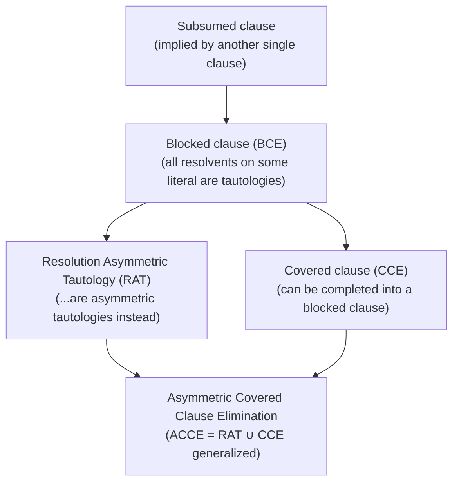
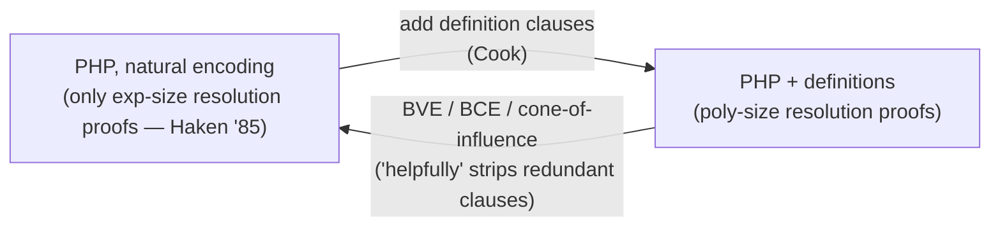

# Preprocessing and Inprocessing

[[book-guidelines|↩ Back to guidelines]]

## Why a SAT solver needs a simplification pass at all

A CDCL solver (see [[Conflict-Driven-Clause-Learning]]) is remarkably good at searching huge CNF formulas — but "huge" is often an artifact, not an essential property of the problem. Automated encoders (bounded model checkers, planners, bit-blasters) tend to generate a lot of redundant structure: unnecessary auxiliary variables, clauses subsumed by other clauses, definitions of intermediate signals that only matter for readability. And because the same underlying problem can be encoded many different ways, a solver's performance ends up hostage to *how* a user or tool happened to phrase the problem, not just what the problem actually is.

**Preprocessing** is the fix: an automated simplification step, situated between encoding and search, whose job is to shrink and clean up a formula before the solver ever sees it. The chapter is careful to frame this as *inference*, not just bookkeeping — every technique below is really an implementation of some inference rule (usually a restricted form of resolution), applied selectively enough to stay cheap. Since roughly 2013, competition-winning solvers don't just preprocess once up front — they interleave these same techniques with the search itself, a practice the chapter calls **inprocessing**. The reason this matters for soundness (not just performance) is that a solver is also *learning* clauses and *forgetting* them during search, so a simplification technique that is safe to run once on a static input formula needs extra care to stay safe when it's running concurrently with clause learning and clause deletion.

This is the first thing worth internalizing: preprocessing is not "make the formula smaller," it's "replace the formula with one that's easier to decide, which sometimes but not always coincides with smaller." That distinction, and where it breaks, is the throughline of this whole topic.

## Unit propagation and failed literals: the cheapest inference you can make

**Unit propagation (BCP).** The unit-clause rule: if a formula contains a unit clause $(l)$, then every clause containing $l$ is satisfied and removable, and every clause containing $\bar l$ can have that literal deleted. Iterating this rule to a fixed point is unit propagation — the same mechanism that drives search in a CDCL solver, just run here as a formula rewrite instead of a tentative assignment. It's a genuine resolution step in disguise: removing $\bar l$ from a clause is resolution against the unit clause $(l)$ upon $l$ — which is why the chapter calls it *unit resolution*.

$$F = (x) \land (\bar x \lor y) \land (\bar y \lor z \lor v) \;\rightsquigarrow\; (y) \land (\bar y \lor z \lor v) \;\rightsquigarrow\; (z \lor v)$$

Unit propagation is *sound for equisatisfiability but not complete for unsatisfiability*: if it derives the empty clause you know $F$ is UNSAT, but plenty of unsatisfiable formulas (e.g. $(x\lor y)\land(\bar x\lor y)\land(x\lor\bar y)\land(\bar x\lor\bar y)$) contain no unit clause at all and sail through untouched.

**Failed literals.** A literal $l$ is *failed* w.r.t. $F$ if propagating $F \land (l)$ derives a conflict. Since $F \land (l)$ is then unsatisfiable, $F$ must imply $\bar l$ — so you can soundly add the unit clause $(\bar l)$. This is a strictly stronger probe than plain BCP because it can find implied units in formulas that have none to start with:

$$F = (x\lor u)\land(\bar x\lor u)\land(\bar u\lor z\lor y)\land(\bar u\lor z\lor\bar y)$$

has no unit clause, but assuming $\bar u$ conflicts against the first two clauses, so $u$ is forced, which then simplifies $F$ down to $(z\lor y)\land(z\lor\bar y)$. **What breaks without it:** without failed-literal probing you're leaving implied structure on the table — structure a plain BCP pass is, by construction, blind to. The catch is cost: testing every candidate literal this way is worst-case $O(n^2)$ literal tests with an $O(n)$-ish propagation each, i.e. cubic overall, and that bound is *tight* under the strong exponential-time hypothesis even for Horn-3-CNF. Practical implementations claw this back by only re-testing literals whose last propagation attempt didn't fail (mark/unmark), and by only probing *roots* of the binary implication graph rather than every literal.

**Rust sketch** — the shape both techniques share (propagate-to-fixpoint, check for conflict):

```rust
enum PropResult { Ok, Conflict }

fn unit_propagate(f: &mut Cnf, trail: &mut Trail) -> PropResult {
    while let Some(unit_lit) = f.find_unit_clause() {
        if trail.assign(unit_lit).is_err() {
            return PropResult::Conflict; // empty clause derived
        }
        f.simplify_with(unit_lit); // drop satisfied clauses, strike ¬unit_lit
    }
    PropResult::Ok
}

fn is_failed_literal(f: &Cnf, l: Lit) -> bool {
    let mut trial = f.clone();     // or: push/pop a trail frame
    trial.add_unit(l);
    matches!(unit_propagate(&mut trial, &mut Trail::new()), PropResult::Conflict)
}
```

The recurring theme — "assume something, propagate, see if you hit $\bot$" — is exactly the shape of failed-literal probing, hyper binary resolution, and the asymmetric-tautology check further down; they differ only in *what* gets assumed and *how much* of the resulting structure gets kept.

## Bounded variable elimination: the single biggest lever in SAT preprocessing

The chapter is blunt about this one: bounded variable elimination (BVE), introduced with the SatELite preprocessor, produced "the largest improvement of solver performance witnessed in the history of the SAT competitions" (2005–2006), and it's still arguably the most important practical technique today.

**The core move — clause distribution.** To eliminate a variable $e$: take every clause containing $e$, resolve it against every clause containing $\bar e$, add all the resolvents, then delete the original clauses mentioning $e$ entirely. This is literally the Davis–Putnam procedure's inference rule, applied to exactly one variable at a time.

$$F = (x\lor e)\land(y\lor e)\land(\bar x\lor z\lor\bar e)\land(y\lor\bar e)\land(y\lor z)$$

Resolving on $e$: $(x\lor e)$ and $(y\lor e)$ each resolve against $(\bar x\lor z\lor\bar e)$ and $(y\lor\bar e)$, giving four resolvents. Add them, then drop every clause mentioning $e$:

$$(y\lor z)\land(x\lor\bar x\lor z)\land(x\lor y)\land(y\lor\bar x\lor z)\land(y)$$

The first added resolvent is a tautology (drop it); the unit clause $(y)$ then subsumes the rest via backward subsumption, and the whole thing collapses to just $(y)$. This example is the chapter's own illustration of why BVE is never run in isolation — it's interleaved with **subsumption** (a clause $D$ subsumes $C$ if $D$'s literals $\subseteq$ $C$'s — then $C$ is redundant) and **self-subsuming resolution** (if resolving $C\lor l$ against $D\lor\bar l$ yields exactly $C$, then $C\lor l$ can just be *strengthened* to $C$, no need to add the resolvent separately). On-the-fly subsumption during elimination gets this almost for free: whenever a resolvent $R$ has $|R| = |C|-1$ or $|R|=|D|-1$, one antecedent can be replaced by $R$ directly.

**Why "bounded."** Naively eliminating every variable this way can blow the clause count up exponentially (already one elimination can be quadratic). So BVE only eliminates a variable when doing so doesn't increase the clause count beyond some limit — hence *bounded*. Modern solvers relax this adaptively (start strict, loosen the bound geometrically, e.g. $0, 8, 16, 32, \ldots$, each time a round finishes without blowing up too much). Typical hard caps: skip resolvents/clauses over 20–100 literals, skip variables occurring 100–1000+ times.

**A nice free lunch:** BVE automatically subsumes pure-literal elimination (a pure literal has no resolvents at all — nothing to add, clause just disappears) and, with on-the-fly subsumption, unit propagation too. This is a good instance of the general pattern in this chapter: the "bigger hammer" techniques tend to strictly generalize the "smaller" ones, at higher cost.

**Rust sketch** — the elimination step as a pure transformation over an occurrence-indexed clause store (the kind of representation you'd also want for a Horn-clause/CHC simplifier, if you're building one):

```rust
fn eliminate_variable(cnf: &mut ClauseDb, v: VarId) -> Result<(), TooExpensive> {
    let pos = cnf.occurrences(Lit::pos(v)).to_vec();
    let neg = cnf.occurrences(Lit::neg(v)).to_vec();

    let mut resolvents = Vec::new();
    for &c in &pos {
        for &d in &neg {
            if let Some(r) = resolve_upon(cnf.clause(c), cnf.clause(d), v) {
                if r.is_tautology() { continue; }         // drop, per Ex. 6
                resolvents.push(r);
            }
        }
    }
    if cnf.size_after(&pos, &neg, &resolvents) > cnf.bound_for(v) {
        return Err(TooExpensive); // stays a candidate for later, looser bound
    }
    cnf.push_reconstruction_frame(v, pos.iter().chain(&neg).map(|&c| cnf.clause(c).clone()));
    cnf.remove_clauses(&pos);
    cnf.remove_clauses(&neg);
    cnf.add_clauses(resolvents);
    Ok(())
}
```

That `push_reconstruction_frame` call is not decoration — it's [[Runtime-Variation-and-Solver-Engineering#The mechanism|the mechanism]] §9.5 below depends on entirely.

## Blocked clause elimination and the redundancy hierarchy

Subsumption and BVE both eliminate clauses that are logically *implied* by the rest of the formula. But SAT solving uses a strictly more permissive notion of redundant: a clause is redundant if removing it doesn't change *satisfiability*, even if it isn't implied. This generalization is what makes clause-elimination techniques genuinely more powerful (and, as the next section shows, genuinely more dangerous).

**Blocked clauses.** For a clause $C$ containing literal $l$, and $F_{\bar l}$ the set of clauses containing $\bar l$: $l$ *blocks* $C$ if every resolvent of $C$ with a clause in $F_{\bar l}$, upon $l$, is a tautology. If some literal in $C$ blocks it, $C$ is a **blocked clause** and can be deleted — no model of $F$ minus $C$ can be turned into a model of $F$ that violates $C$, because any way of falsifying $C$ would force a tautological resolvent, which is vacuous.

$$F = (\bar x\lor z)\land(\bar y\lor\bar x), \quad C = (x\lor y)$$

Here $y$ blocks $C$: the only clause with $\bar y$ is $(\bar y\lor\bar x)$, and resolving it with $C$ upon $y$ gives $(x\lor\bar x)$ — a tautology. So $(x\lor y)$ is blocked and removable. Note this is a *weaker* condition than "implied": a blocked clause need not follow logically from $F$ at all, it's just provably safe to drop for satisfiability purposes.

**The generalization ladder.** The chapter lays these out as strictly increasing generality, each subsuming the last:



The key building block for RAT is the **asymmetric tautology (AT)**: $C$ is an AT w.r.t. $F$ if assuming $\bar C$ (i.e. all of $C$'s literals false) and propagating derives a conflict — equivalently, $C$ is a *reverse unit propagation (RUP)* clause. (Notice the pattern from the unit-propagation section reappearing: assume, propagate, check for $\bot$.) Replacing "tautology" with "asymmetric tautology" in the blocked-clause definition gives **RAT** — resolution asymmetric tautology — every blocked clause is trivially a RAT, but not conversely. RAT matters far beyond preprocessing: it's the underlying redundancy notion of **DRAT**, the de-facto standard proof format for certifying modern CDCL + inprocessing solvers (see [[Proof-Complexity]] for the proof-system side of this). A **covered clause** takes a different generalization route: it can be turned into a blocked clause by adding "covered literals" that are implied to be present in every non-tautological resolvent — a genuinely different sufficient condition, later shown to have "orthogonal strength" to RAT-style redundancy.

**Cheaper cousins that feed BVE.** Practical solvers rarely check the full blocked/RAT condition everywhere — cheaper approximations do most of the work: **hidden tautology elimination / hidden literal elimination** restrict the asymmetric-literal search to binary clauses only (fast, via the binary implication graph, using near-constant-time SCC-style checks instead of repeated propagation), and **vivification/distillation** interleave literal assignment with propagation one literal at a time (rather than assigning the whole clause's negation up front) so that a clause can be *strengthened* (a literal removed) the moment propagation forces some other not-yet-assigned literal of the clause to false — catching partial redundancy that a clean AT/RUP check would only report as all-or-nothing.

**Python sketch** — the blocked-clause test is a small, self-contained predicate, a good example of where a five-line illustrative script beats ceremony:

```python
def resolvent_is_tautology(c, d, l):
    resolvent = (set(c) - {l}) | (set(d) - {-l})
    return any(-lit in resolvent for lit in resolvent)

def blocks(l, c, clauses_with_not_l):
    return all(resolvent_is_tautology(c, d, l) for d in clauses_with_not_l)

def is_blocked(clause, formula):
    return any(blocks(l, clause, formula.clauses_containing(-l)) for l in clause)
```

## Solution reconstruction: undoing simplification for a model, not just a yes/no

Most of the techniques above only guarantee **equisatisfiability**, not logical equivalence — an eliminated variable, a substituted equivalence class, a removed pure literal can all take *any* value in the simplified formula's models, because the simplified formula genuinely stopped constraining them. That's fine if all you want is SAT/UNSAT. It's not fine if you need an actual model — and for applications like bounded model checking or SAT-based planning (downstream of the search machinery in [[Complete-Search-Algorithms-for-SAT]]), a yes/no answer without a witness trace is useless.

**The reconstruction stack (Sörensson's method).** Whenever a variable $v$ is eliminated (or a clause removed by BCE/RAT/CCE/etc.), push the clauses that justified the removal onto a global stack, with the eliminated variable's literal listed first in each ("the witness literal"). After the solver finds a model for the fully simplified formula:

1. Assign every eliminated variable an arbitrary value (say, false).
2. Pop the reconstruction stack in reverse (last eliminated, first restored).
3. For each popped clause: if it's already satisfied by the current (partial, growing) assignment, do nothing. If it's falsified, **flip the value of its witness literal** — this is guaranteed to satisfy it, without breaking anything already fixed (that's the theorem this whole scheme rests on).

$$F = (\bar a\lor b)\land(a\lor\bar b)\land(b\lor c)\land(\bar b\lor\bar c)$$

Eliminating $a$ then $b$ pushes these four clauses (in that order) onto the stack; the simplified formula is empty, trivially satisfied by all-false. Popping in reverse: $(\bar b\lor\bar c)$ — satisfied (both false). $(b\lor c)$ — falsified, flip $b$'s witness $\to$ $b=1$. $(a\lor\bar b)$ — falsified (since $a=0,b=1$), flip $a\to 1$. $(\bar a\lor b)$ — satisfied. Final model: $a=b=1$, $c=0$ — a genuine solution to the *original* formula, recovered from one to the aggressively simplified one, in time linear in the number of eliminated clauses.

The elegant part: this *same* stack-and-flip scheme handles pure-literal elimination, equivalent-literal substitution, BCE, RAT, and (with a set of witness literals instead of one) globally blocked clauses — one mechanism, uniformly, instead of a bespoke undo procedure per technique.

This is directly the same shape of problem as **proof reconstruction** in a trusted-kernel architecture: a fast, untrusted, aggressively-simplifying pass produces an answer over a transformed problem, and a small, separately-verifiable procedure maps that answer back across every simplification step to the original problem statement — exactly the discipline you'd want for a checker whose *simplifier* isn't part of the trusted computing base, only the reconstruction/replay step is.

## The risk: preprocessing can remove exactly the structure a proof needs

This is the sharpest and most important idea in the chapter, and it directly connects preprocessing to [[Proof-Complexity]]. In 1985, Haken proved that the pigeonhole principle (PHP) — encoded the natural way — admits *only exponential-size resolution refutations*. Since CDCL is fundamentally a resolution-based procedure, that means CDCL solvers need exponential time on the natural PHP encoding, full stop, regardless of how clever the branching heuristic is.

But Cook showed something remarkable: if you augment the natural PHP encoding with extra **definition clauses** (auxiliary structure that doesn't change satisfiability, just adds redundant scaffolding), the *same* problem suddenly has **polynomial-size** resolution proofs. The catch, and the whole point of this section: **bounded variable elimination, blocked clause elimination, and cone-of-influence reduction all strip these definition clauses back out**, because from a pure satisfiability-preservation standpoint they're exactly the kind of redundant structure these techniques are designed to remove. Apply BVE or BCE to Cook's augmented encoding and you silently regenerate Haken's exponential-hard instance — the preprocessor, doing exactly what it's supposed to do, has thrown away the one thing that made the problem tractable for the solver that's about to run on it.



This is the chapter's central warning, stated as plainly as a survey chapter states anything: **shrinking a formula is not the same thing as making it easier to solve**, and the two can actively point in opposite directions. It's also why CDCL solvers deliberately keep some redundancy around on purpose — learned clauses are, by definition, logically redundant (entailed by what's already there), yet removing them (or never generating them) is exactly what makes search slow; likewise binary clauses are often protected from elimination specifically because of their high propagation value. Preprocessing's goal was never "minimum-size formula" — it's "formula shaped so that *this specific solving procedure* goes fast on it," and those two objectives can conflict in a worst case that's not exotic, but a textbook combinatorial principle.

## Where this leads

Preprocessing and inprocessing sit at a genuine crossroads in the book's structure. Backward, they depend on the proof-theoretic material in [[Proof-Complexity]] (resolution, tautologies, what "asymmetric tautology" even means) and interact directly with [[Conflict-Driven-Clause-Learning]] (clause learning and clause forgetting are themselves formula-modifying operations that inprocessing must stay sound alongside). Forward, RAT — introduced here as a clause-elimination criterion — turns out to *be* the redundancy notion underlying DRAT, the dominant proof-certificate format for modern solvers, so this chapter is quietly also laying groundwork for the trusted-checker material elsewhere in the book.

For the elaborator/verifier project this vault is built around, the load-bearing transfer is architectural, not just topical: **an untrusted, aggressively-simplifying pass (preprocessing) paired with a small, separately-checkable undo procedure (the reconstruction stack) is the same pattern a trusted-kernel proof architecture needs** — an elaborator or a CHC-simplifying verifier can be as aggressive as it wants in its "solve on the simplified problem" phase, provided every simplification step it takes is one whose effect on a witness (model, proof, counterexample) can be replayed backward through a small, auditable procedure. The Haken/Cook example is the cautionary half of that same lesson for a CSP/abstract-interpretation kernel: a simplification pass that provably preserves satisfiability can still destroy the *structural* property (a short refutation, a tractable invariant, a small unsat core) that made the downstream solving procedure fast — equisatisfiability is not enough of a soundness guarantee if performance also has to survive the simplification.
