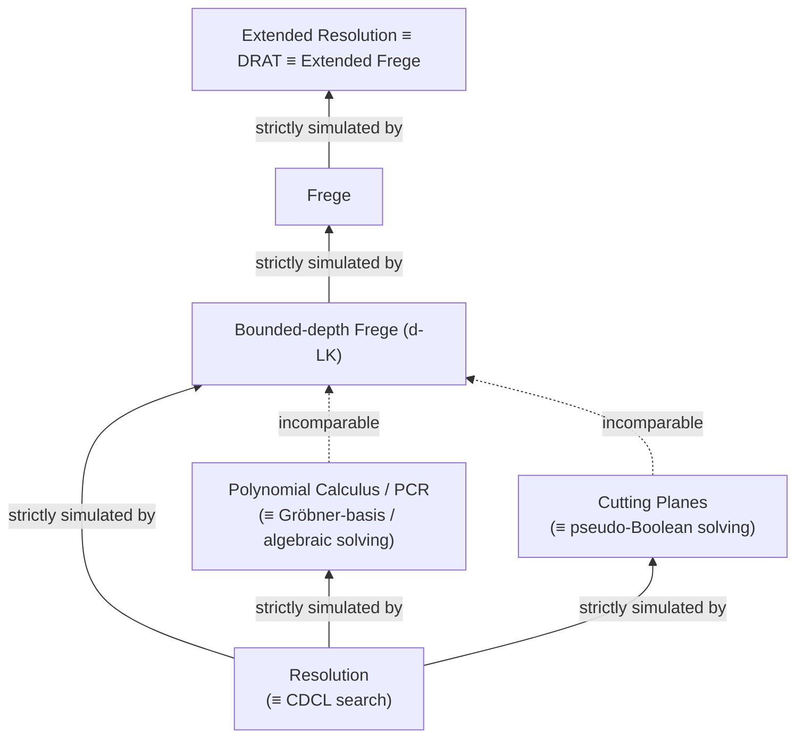

# Proof Complexity

[[book-guidelines|↩ Back to guidelines]]

## Why a chapter on proofs, in a book about solving

SAT is NP-complete, and the Strong Exponential Time Hypothesis says CNF-SAT needs roughly $2^n$ time in the worst case. And yet CDCL solvers rip through industrial instances with millions of variables, often close to linear time. There's no contradiction — these are different regimes: theoreticians can hand-construct 200-variable formulas that defeat every known solver, while "easy" industrial instances just happen to have exploitable structure we don't yet have a clean theory for. But this tension leaves a real question unanswered: when a solver *does* return UNSAT, how do you know to trust it? And more importantly, is there a mathematical reason certain formulas will *always* be hard for a given solving strategy, no matter how good the engineering gets?

Proof complexity is the field that answers both questions with one idea. A SAT solver looking for a satisfying assignment doesn't need to justify a positive answer — the assignment itself is the proof, and it's cheap to check. But an UNSAT answer is a claim about *every* assignment, and the only way to certify it rigorously is to exhibit a **proof of unsatisfiability** in some formal system, and then to ask: how big does that proof have to be? This is exactly the question this chapter's authors (Buss and Nordström) pursue, and it's why proof complexity — despite being a purely static, non-algorithmic theory of "how long must this derivation be" — turns out to explain solver behavior with mathematical rigor that empirical benchmarking never can. A lower bound on proof size in a system is a lower bound on the running time of *every* solver whose search corresponds to that system, regardless of implementation cleverness.

One sharp limitation worth internalizing up front: because proof complexity is fundamentally about *certifying* a claim, and only unsatisfiability needs certifying (a solver can "get lucky" and stumble on a satisfying assignment for free), essentially all of proof complexity's rigorous results are about **unsatisfiable formulas only**. This chapter, accordingly, almost never talks about satisfiable instances.

## Proof systems, soundness, and completeness

Strip away the SAT-specific framing and a **proof system** for a language $L$ (a set of strings) is just a predicate $P(x,\pi)$ — checkable in time polynomial in $|x|$ and $|\pi|$ — satisfying:

- **Completeness**: for every $x \in L$, some proof $\pi$ makes $P(x,\pi)$ true.
- **Soundness**: for every $x \notin L$, *no* string $\pi$ makes $P(x,\pi)$ true.

This is deliberately abstract, and it should feel familiar: it's exactly the shape of a type-checking or proof-checking judgment $\Gamma \vdash e : \tau$ — polynomial-time decidable, complete (every well-typed term has a derivation), sound (no derivation exists for an ill-typed term). A proof system in this sense *is* a trusted checker, and everything this chapter studies is really a question about the checker's **trusted computing base**: what operations does it need to trust, and how big does a certificate need to be before that checker accepts it?

For SAT specifically, we mostly work with **refutation systems**: $L$ is the set of *unsatisfiable* CNF formulas, and $\pi$ is a refutation — a proof that $F$ has no satisfying assignment. (Some systems, like Frege, instead prove *validity* of arbitrary formulas; refutations of $F$ correspond to proofs of the tautology $\lnot F$, so the two framings are dual.)

The central complexity notion is **polynomial simulation**: system $P'$ *polynomially simulates* $P$ if every $P$-proof of $x$ has a $P'$-proof of $x$ at most polynomially larger. This gives proof systems a strict partial order by strength, and most of this chapter is a map of that order: resolution $\le$ polynomial calculus / cutting planes $\le$ bounded-depth Frege $\le$ Frege $\le$ extended Frege $\equiv$ extended resolution $\equiv$ DRAT (with several pairs proven *incomparable* rather than ordered).

**What breaks without soundness/completeness as separate concerns**: a proof system that's complete but unsound would let a solver "prove" UNSAT on a satisfiable formula — catastrophic for any downstream verified pipeline (bounded model checking, hardware verification) that trusts the SAT solver's certificate. A proof system that's sound but incomplete just means some true claims have no certificate in that system at all — this is the *entire subject* of the lower-bound results below: showing that PHP, Tseitin, and random formulas need exponential proofs in resolution is a completeness-in-principle-but-not-in-practice story, since resolution *is* complete, it just sometimes needs proofs bigger than the observable universe.

```rust
// The abstract contract, made concrete: a proof-system trait.
// This is the shape every checker below (resolution DAG checker,
// PCR checker, DRAT checker) actually implements.
trait ProofSystem {
    type Statement;   // e.g. a CNF formula F
    type Proof;       // e.g. a resolution DAG, a PC derivation, ...

    /// Must run in time polynomial in |statement| + |proof|.
    /// Soundness: only returns true if `statement` really is unsat.
    /// Completeness: some `proof` exists whenever `statement` is unsat.
    fn check(statement: &Self::Statement, proof: &Self::Proof) -> bool;
}
```

In Lean terms, this `check` function is precisely the role of the **kernel**: a small, trusted piece of code that either accepts a term as a valid proof of a proposition or doesn't, while the (untrusted, arbitrarily complex) elaborator/tactic engine is responsible only for *producing* candidate proofs. DRAT checkers for SAT (Section 7.8 below) and Lean's kernel play structurally the same role: everything upstream can be buggy or adversarial, as long as this one checker is correct and fast.

## Resolution: the formal shadow of CDCL

**The rule.** From clauses $C \lor x$ and $D \lor \bar x$, derive $C \lor D$ (the *resolvent*, resolving on $x$). A **resolution derivation** of clause $D$ from $F$ is a sequence $D_1, \dots, D_L = D$ where each $D_i$ is either an axiom of $F$ or the resolvent of two earlier clauses. A refutation derives the empty clause $\bot$. Soundness and completeness (Theorem 7.3.1 in the text) hold exactly as expected: $F \vdash_{\text{res}} C$ iff $F \models C'$ for some $C' \subseteq C$; in particular $F$ is unsatisfiable iff it has a resolution refutation.

**Why the book introduces this here, not as pure theory**: resolution is not an arbitrary example proof system — it is *exactly* the proof system CDCL solvers search for, whether they know it or not. This connection is worth making precise, because it's the load-bearing fact for everything that follows.

- A **conflict graph** (built from the implication graph of decisions/unit-propagations) records, for each variable, its antecedent clause. Tracing this graph backward from a falsified clause and resolving away literals at the current decision level, one at a time, until only one current-level literal remains, produces the **1UIP (first unique implication point) clause** — and this trace *is* a resolution derivation.
- A learned clause with this "exactly one current-level literal" property is called **asserting**: after backjumping, that literal immediately flips by unit propagation, which is precisely why [[Conflict-Driven-Clause-Learning#Non-chronological backtracking|non-chronological backtracking]] is sound.
- More generally, any clause a solver could learn via **unit propagation from the negated literals of the clause** (formally: reaching $\bot$ by unit-propagating $F$ together with $\{\bar a_i\}$) is called a **RUP clause** (reverse unit propagation) or an **asymmetric tautology**. RUP-checkability is exactly what lets modern solvers emit proof traces that a *separate*, much simpler verifier can check by unit propagation alone — the RUP proof format is the direct ancestor of DRAT (Section 7.8).

So: **CDCL's underlying proof system is resolution.** A resolution lower bound for a formula is a hard floor under every CDCL solver's running time on it, independent of branching heuristic, restart policy, or clause-deletion strategy — this is the single most consequential fact in the chapter, and the reason proof complexity results transfer directly to "no CDCL solver, ever, can do better than this on formula $F$."

### Complexity measures and the lower bounds that matter

Three measures matter for a refutation $\pi$ of an $N$-size formula:

- **Length/size**: number of clauses in $\pi$ (with repetition). $\exp(O(N))$ always suffices; matching $\exp(\Omega(N))$ lower bounds exist.
- **Width**: size of the largest clause in $\pi$. Trivially $\le n \le N$.
- **Space**: max number of clauses simultaneously "in memory" (needed at some later step) at any point in $\pi$ — motivated directly by solver memory usage.

The single most important structural theorem (Ben-Sasson–Wigderson) links width to length:
$$
\text{refutation length} \ge \exp\!\left(\Omega\!\left(\frac{(\text{refutation width} - k)^2}{n}\right)\right)
$$
for $k$-CNF formulas over $n$ variables. **This is how almost every resolution length lower bound in the literature is actually proved**: show a formula needs large width, and length lower bounds follow almost automatically. For tree-like resolution the bound sharpens to a clean exponential $2^{\text{width}-k}$, but for *general* (DAG-shaped) resolution, width lower bounds as large as $\Omega(\sqrt{n \log n})$ can fail to yield *any* length lower bound (witnessed by the ordering-principle formulas, which have polynomial-width but only-linear-length refutations) — an exponential separation in power between general and tree-like resolution.

The chapter's running cast of hard formulas, each illustrating a different combinatorial obstruction:

- **Pigeonhole principle (PHP)**: $m > n$ pigeons into $n$ holes, using $p_{i,j}$ = "pigeon $i$ in hole $j$." Haken's landmark 1985 result: $\exp(\Omega(n))$ resolution length for $m = n+1$. Intuitively: *resolution cannot count*. Even the absurd claim that infinitely many pigeons fit into finitely many holes needs exponential resolution work to refute.
- **Tseitin formulas**: encode "sum of vertex degrees in a graph is even" (always true) against an odd labeling (always false) — genuinely exponential $\exp(\Omega(N))$ length on expander graphs. Resolution can't even count mod 2.
- **Random $k$-CNF** ($\Delta \cdot n$ random $k$-clauses, $\Delta$ above the satisfiability threshold): $\exp(\Omega(N))$ almost surely (Chvátal–Szemerédi).
- **$k$-clique formulas**: still has real open problems — average-case resolution lower bounds for random-graph clique formulas remain unresolved for general (as opposed to tree-like or regular) resolution (Open Problem 7.4 in the text).

**What breaks without width-based reasoning**: without the size-width connection, every new hard-formula family would need its own bespoke combinatorial argument (as PHP originally did). The Ben-Sasson–Wigderson technique turned resolution lower bounds from isolated results into a reusable method — this is analogous to how a general termination/complexity *metric* (as opposed to ad-hoc per-algorithm arguments) turns a family of one-off proofs into a systematic technique.

```rust
// A trusted, minimal resolution-refutation checker: the kind of
// small kernel a DRAT/RUP verifier builds on. Note it never
// *searches* for a proof — it only replays one, in linear time.
use std::collections::HashSet;

type Lit = i32; // positive/negative int encodes the literal
type Clause = Vec<Lit>; // sorted, deduplicated, no complementary pair (else tautology)

fn resolve(c1: &Clause, c2: &Clause, pivot: Lit) -> Option<Clause> {
    // Require pivot in c1, -pivot in c2 (or vice versa); merge remaining literals.
    if !c1.contains(&pivot) || !c2.contains(&-pivot) {
        return None;
    }
    let mut out: HashSet<Lit> = c1.iter().chain(c2.iter())
        .cloned()
        .filter(|&l| l != pivot && l != -pivot)
        .collect();
    if out.iter().any(|&l| out.contains(&-l)) {
        return None; // tautological resolvent — not allowed by convention
    }
    Some(out.into_iter().collect())
}

/// Checks a DAG-shaped refutation: `steps[i] = (pivot, j, k)` means
/// clause i is the resolvent of clauses[j] and clauses[k] on `pivot`.
/// Returns true iff the last derived clause is the empty clause.
fn check_refutation(axioms: &[Clause], steps: &[(Lit, usize, usize)]) -> bool {
    let mut clauses: Vec<Clause> = axioms.to_vec();
    for &(pivot, j, k) in steps {
        match resolve(&clauses[j], &clauses[k], pivot) {
            Some(c) => clauses.push(c),
            None => return false, // unsound step — reject
        }
    }
    clauses.last().map_or(false, |c| c.is_empty())
}
```

This `check_refutation` function is the entire trusted computing base for resolution: everything a CDCL solver does internally (VSIDS scores, watched literals, restarts) is *search strategy*, invisible to and irrelevant for this checker. That separation — untrusted search, trusted linear-time replay — is the exact shape you'll want for your own constraint/SAT kernel: the CSP/abstract-interpretation engine can use arbitrarily sophisticated (and bug-prone) heuristics to *find* a counterexample or a resolution proof, but the artifact it hands back to the type checker only needs to satisfy this tiny, easily-verified contract.

## Algebraic proof systems: Nullstellensatz and polynomial calculus

Resolution reasons about disjunctions of literals. Algebraic proof systems instead translate a clause $C = \bigvee_{x \in P} x \lor \bigvee_{y \in N} \bar y$ into a polynomial
$$
p(C) = \prod_{x \in P}(1-x) \cdot \prod_{y \in N} y
$$
over a field $\mathbb F$ (in practice $\mathrm{GF}(2)$), so that an assignment satisfies $C$ iff $p(C)$ evaluates to $0$. Refuting $F$ becomes an algebraic question: do the polynomials $\{p(C_i)\}$, together with the Boolean axioms $x_j^2 - x_j$ (forcing $\{0,1\}$-values), have a common root? By Hilbert's Nullstellensatz, **no** common root exists exactly when $1$ lies in the ideal they generate — i.e., when there exist polynomials $r_i, s_j$ with
$$
\sum_i r_i(x)\, p_i(x) + \sum_j s_j(x)\,(x_j^2 - x_j) = 1.
$$
This equation, taken as a static certificate, *is* a **Nullstellensatz refutation**. Its two natural complexity measures are **size** (total monomial count when everything is expanded) and, much more studied, **degree** (max degree of any product $r_i p_i$ or $s_j(x_j^2 - x_j)$). Degree lower bounds are proved via **$d$-designs**: a linear functional $D$ on degree-$\le d$ polynomials with $D(1) = 1$, $D(rp) = 0$ for every axiom $p$ (up to degree $d$), and a technical multilinearity condition — its existence certifies that no degree-$d$ refutation exists, dual to linear-programming infeasibility certificates.

**Polynomial calculus (PC)**, introduced to model Gröbner-basis computation, strengthens this into a genuinely *dynamic* derivation system with three rules:
$$
\text{(Boolean axiom)}\ x_j^2 - x_j \qquad
\text{(Linear comb.)}\ \frac{p \quad q}{\alpha p + \beta q} \qquad
\text{(Multiplication)}\ \frac{p}{m \cdot p}
$$
ending when $1$ is derived. **Polynomial calculus resolution (PCR)** adds "twin variables" $\bar x_j$ with axiom $x_j + \bar x_j - 1$, giving positive and negative literals symmetric, efficient polynomial encodings (so a wide clause of all-positive literals doesn't blow up exponentially the way plain PC's $\prod(1-x_i)$ would).

Three facts anchor how PC/PCR relate to resolution and to each other:

1. **PCR simulates resolution efficiently** in length, width/degree, *and* space simultaneously — it can literally mimic a resolution derivation step by step (a single resolution step becomes one linear-combination step on the corresponding polynomials).
2. **PC/PCR can be strictly stronger.** Tseitin formulas, provably exponential for resolution, fall to $O(N \log N)$-size, $O(1)$-degree PC refutations via Gaussian elimination over $\mathrm{GF}(2)$ — because linear algebra *can* count mod 2, which is exactly what resolution provably cannot do.
3. Just as in resolution, a **size–degree tradeoff** analogous to Ben-Sasson–Wigderson holds (via **R-operators**, the PC analogue of $d$-designs), and it is essentially tight, so degree lower bounds are again the standard route to size lower bounds.

**Grounding — why this is genuinely a unification-adjacent idea, not just "SAT via algebra":** the degree measure in PC is structurally the same kind of invariant as **degree bounds in higher-order/pattern unification** — both ask "how much structural expansion is needed before two representations collapse to a syntactic identity (here: to the constant $1$; there: to a solved-form substitution)." And the $d$-design / R-operator technique — construct an over-approximating linear functional that provably can't reach the target — is the *same proof shape* as constructing an abstract domain in abstract interpretation: both are "exhibit an over-approximation, then show the bad state is unreachable in it."

```python
# A five-line illustrative sketch (not load-bearing): translate a
# clause to its GF(2) polynomial form, to make the size argument concrete.
def clause_to_poly_monomials(pos, neg):
    # p(C) = prod_{x in pos}(1 - x) * prod_{y in neg} y, expanded as
    # a set of monomials (each a frozenset of variable indices), coefficients
    # implicitly in GF(2) so we only track parity of occurrence.
    monomials = {frozenset()}
    for x in pos:
        monomials = {m for base in monomials for m in (base, base | {x})}
    for y in neg:
        monomials = {m | {y} for m in monomials}
    return monomials  # size = len(monomials); exponential in len(pos)
```

## Cutting planes and pseudo-Boolean proof systems

Cutting planes formalizes integer linear programming's Gomory-cut algorithm as a proof system, and it is the proof-theoretic shadow of **pseudo-Boolean (PB) / conflict-driven PB solving**, exactly as resolution shadows CDCL. Clauses become linear inequalities: $C = x \lor y \lor \bar z$ becomes $x + y + \bar z \ge 1$ (using $x^\sigma$ notation so both polarities are first-class, non-negative-coefficient terms). Crucially, **pseudo-Boolean constraints can be exponentially more concise than CNF** — a single cardinality constraint $x_1 + \cdots + x_6 \ge 3$ ("at least 3 of 6") needs $\binom{6}{4}=15$ clauses to express in CNF without new variables.

The derivation rules:
$$
\text{Literal axiom: } x^\sigma \ge 0 \qquad
\text{Multiplication: } \frac{\sum a_i^\sigma x_i^\sigma \ge A}{\sum c\,a_i^\sigma x_i^\sigma \ge cA}
$$
$$
\text{Addition: } \frac{\sum a_i^\sigma x_i^\sigma \ge A \quad \sum b_i^\sigma x_i^\sigma \ge B}{\sum (a_i^\sigma + b_i^\sigma) x_i^\sigma \ge A+B}
\qquad
\text{Division: } \frac{\sum c\,a_i^\sigma x_i^\sigma \ge A}{\sum a_i^\sigma x_i^\sigma \ge \lceil A/c \rceil}
$$
Addition on opposite-polarity coefficients of the same variable (using $x^1 + x^0 = 1$) is exactly **generalized resolution** — the natural lift of the clausal resolution rule to arbitrary linear constraints (and it's *genuinely* more general: the same pair of constraints can be "resolved" over several different variables to yield different results, something plain resolution can never do).

**The division rule is where all the extra power lives.** Every other rule (addition, multiplication) is sound even over the *reals* — it's only integer rounding in division that lets cutting planes exploit the fact that we only care about $\{0,1\}$-valued solutions, and this is precisely why cutting planes can do something resolution structurally cannot: **it can count.** PHP formulas, exponentially hard for resolution, have polynomial-size cutting-planes refutations by literally summing pigeon/hole constraints and rounding.

Two further points worth carrying forward:

- **No useful width/degree analogue** exists for cutting planes — length, size (which also counts coefficient bit-sizes), and space are the only well-behaved measures, which is part of why cutting planes is less well understood than resolution or PC.
- **Lifting** (Section 7.7.1): take a hard search problem for a *weak* computational model (communication complexity) and compose it with an indexing/selector gadget to manufacture CNF formulas that are provably hard for a much *stronger* proof system (cutting planes). This "hardness escalation" technique is the source of most of the strongest recent cutting-planes lower bounds, and it's conceptually close to how **Craig interpolation** and **abduction** are used elsewhere in this handbook's neighborhood: take a certificate of hardness/infeasibility in one setting and transport it, via a structure-preserving gadget, into a certificate in another.

**Load-bearing connection to your CSP/abstract-interpretation kernel**: cutting planes is *literally* the proof theory of pseudo-Boolean / 0-1 ILP solving with cardinality and linear arithmetic constraints — which is exactly the substrate your planned CSP kernel needs for integer and (bounded) non-linear domain propagation. Understanding *why* [[Pseudo-Boolean-and-Cardinality-Constraints#Cutting planes strictly dominates resolution|cutting planes strictly dominates resolution]] (it can count; division exploits integrality) tells you exactly what kind of constraints your propagation engine needs to handle natively (cardinality, not just clausal) to avoid inheriting resolution's blind spots.

## Extended resolution, Frege, and bounded-depth Frege systems

Resolution, PC, and cutting planes are each strictly weaker than a second tier of systems that allow reasoning about **arbitrary Boolean formulas**, not just clauses/polynomials/inequalities.

**Extended resolution (ER)** adds one rule to plain resolution: introduce a *fresh* variable $x$ together with the three clauses
$$
x \lor a \qquad \bar x \lor b \qquad \bar a \lor \bar b \lor x
$$
which jointly assert $x \leftrightarrow (a \land b)$ — i.e., ER lets a derivation *name new subformulas* as it goes, exactly the way a compiler introduces a fresh SSA temporary for a subexpression rather than re-deriving it inline every time. This is exponentially more powerful than plain resolution: PHP formulas, exponential for resolution (Haken), have *polynomial*-size ER proofs (Cook–Reckhow).

**DRAT** is the practical, checkable proof format that (perhaps surprisingly) turns out to be *exactly as powerful* as extended resolution. Its core inference, **RAT** (resolution asymmetric tautology), generalizes **RUP** (introduced above as the formal shadow of ordinary clause learning) to also justify preprocessing/inprocessing steps (blocked-clause elimination, variable elimination, pure-literal simplification) that plain resolution cannot express. The key relaxation: a RAT-inferred clause $C$ need not be *implied* by $F$ — it only needs to preserve **equisatisfiability** ($F$ sat iff $F \cup \{C\}$ sat). Concretely, $C = a_1 \lor \cdots \lor a_k \lor b$ is RAT-inferable w.r.t. $b$ if, for every clause $D \lor \bar b \in F$, the clause $a_1 \lor \cdots \lor a_k \lor D \lor \bar b$ is either tautological or RUP. RAT subsumes both the extension rule and the pure-literal rule as special cases, and DRAT (RAT plus a clause-deletion bookkeeping rule) polynomially simulates, and is simulated by, extended resolution.

This is the direct proof-theoretic justification for why **DRAT is the standard proof-logging format for modern CDCL solvers**: solvers doing inprocessing are doing something resolution alone cannot certify, but RAT can — and a RAT/DRAT checker is still a small, trusted, polynomial-time verifier, exactly the architecture from the "proof systems" section above.

**Frege systems** generalize this further: proofs are built over arbitrary formulas (not just clauses) using a complete connective set ($\lnot, \land, \lor$) and axiom schemes plus modus ponens — the "ordinary textbook" propositional proof system. The chapter presents Frege via the **sequent calculus LK**: lines are sequents $\varphi_1,\dots,\varphi_k \Rightarrow \psi_1,\dots,\psi_\ell$ (conjunction-implies-disjunction), with structural rules (weakening, contraction) and logical introduction rules for each connective. Remarkably, **any two Frege systems polynomially simulate each other** — the specific choice of axioms/connectives doesn't matter for proof-complexity purposes, only whether you're in the Frege class at all. **Extended Frege** adds the general extension rule $x \leftrightarrow \varphi$ for arbitrary $\varphi$ (not just conjunctions) and is polynomially equivalent to extended resolution.

**Bounded-depth Frege** restricts LK proofs so every formula has bounded alternation-depth between $\land$ and $\lor$ (depth-0 LK $\equiv$ resolution, since clauses are depth-0 formulas under the sequent translation). This gives a genuine strength ladder: $d\text{-LK}$ polynomially simulates resolution for every fixed $d$, and there are formulas (weak PHP with $2n$ pigeons/$n$ holes) with only *quasipolynomial* depth-2 LK proofs but *exponential* resolution proofs — real separation, not just a theoretical possibility.

**The hierarchy is not fully linear**, and this is one of the chapter's more interesting closing observations: bounded-depth Frege and cutting planes are **incomparable** (cutting planes crushes PHP/parity, which need exponential $d$-LK proofs for any fixed $d$; but "weak clique-coclique" formulas are easy for bounded-depth LK yet provably exponential for cutting planes via Craig interpolation + monotone circuit lower bounds). Bounded-depth Frege and polynomial calculus are likewise **incomparable**. Nothing in this landscape is known to separate Frege from extended Frege unconditionally — Open Problem 7.20 in the text — which mirrors a familiar shape in complexity theory: we can order some pairs of models rigorously and are stuck, for deep reasons, on others.

```rust
// Sketch of the DRAT checker's trusted core: verifying one RAT step.
// This is the shape of a "proof reconstruction" pass — the kind of
// tiny, re-checkable artifact a verified pipeline should emit instead
// of trusting the (large, optimized, bug-prone) solver directly.
fn is_rat_clause(f: &[Clause], candidate: &Clause, pivot: Lit) -> bool {
    // candidate must contain `pivot`; for every clause D∨¬pivot in f,
    // the resolvent (candidate \ {pivot}) ∪ (D \ {¬pivot}) must be
    // tautological or RUP (checkable by unit propagation alone).
    if !candidate.contains(&pivot) { return false; }
    f.iter()
        .filter(|d| d.contains(&-pivot))
        .all(|d| {
            let resolvent: Clause = candidate.iter().chain(d.iter())
                .cloned()
                .filter(|&l| l != pivot && l != -pivot)
                .collect();
            is_tautological(&resolvent) || is_rup(f, &resolvent)
        })
}
# // is_tautological / is_rup elided — is_rup is a linear-time unit-propagation check.
```

## Where this leaves the picture, and where it leads



The chapter's own closing assessment is worth taking at face value: resolution is comparatively well understood, PC/cutting-planes/bounded-depth-Frege are active but less settled territory, and the connection between proof complexity measures and *why specific industrial formulas are easy* remains genuinely open. That's not a gap to paper over — it's the field's honest state, and it's exactly the kind of question your own CSP/abstract-interpretation kernel will run into empirically long before theory catches up.

**Direct load-bearing connections to the standing project:**

- **Trusted kernels / proof-producing architecture**: every proof system here is, structurally, a *checker/searcher split* — a small trusted verifier (resolution DAG replay, RUP/RAT unit-propagation check) versus an unconstrained, untrusted search procedure (CDCL, Gröbner-basis computation, PB branch-and-cut). This is the architecture to copy for your compiler's kernel: keep the elaborator/unifier/CSP-search side arbitrarily complex and heuristic, but make it emit a certificate that a small, separately-verifiable checker replays in polynomial time — exactly what DRAT does for CDCL and what a Lean kernel does for tactics.
- **CEGAR / abstract interpretation**: the size–width (and size–degree) tradeoff theorems are proof-complexity's version of "how much structural refinement before an over-approximation collapses to a contradiction" — the same shape as counterexample-guided abstraction refinement, where each refinement step is trying to shrink the gap between an abstract domain and the concrete bad state.
- **Craig interpolation**: invoked directly in the text to separate bounded-depth Frege from cutting planes — this is the same interpolation machinery used for refinement of Horn-clause / CHC-based invariant generation, so the chapter's use of it here is a preview of the exact tool your abstract-interpretation/invariant-generation pipeline will lean on.
- **Constraint propagation for CSP**: cutting planes' division rule is precisely the reasoning power ("can count," exploits integrality) your planned CSP kernel needs beyond clausal resolution to handle cardinality and linear-arithmetic domains efficiently — this chapter is effectively the proof-theoretic argument for *why* a pseudo-Boolean/ILP layer, not just a SAT layer, is worth building into that kernel.
