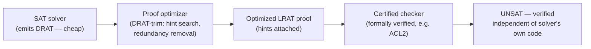

# Proofs of Unsatisfiability

[[book-guidelines|↩ Back to guidelines]]

## Why a solver's "no" needs a receipt

A SAT solver's "yes" is self-certifying: hand over the satisfying assignment, and anyone can check it in linear time by plugging it into the formula. A SAT solver's "no" is a different kind of claim entirely — it says *every one of the $2^n$ possible assignments fails*, and there's no witness of that shape to hand over. Historically this meant you either trusted the solver's implementation outright, or you didn't trust UNSAT results at all. Neither is acceptable once SAT solvers start deciding things that matter: hardware verification sign-off, or — as this chapter's closing examples show — settling open mathematical conjectures (the Boolean Pythagorean Triples problem, the Erdős Discrepancy Theorem, Keller's Conjecture). A single implementation bug in a many-thousand-line CDCL solver, silently misreporting UNSAT, would be indistinguishable from a real proof unless something *external* to the solver could check the claim.

That something is a **clausal proof**: a solver doesn't just say "UNSAT," it emits a sequence of clauses, each one *redundant* with respect to the formula so far (adding it can't turn a satisfiable formula unsatisfiable), ending in the empty clause $\bot$ — which is, trivially, satisfiable by no assignment. If a small, independent, and ideally *formally verified* checker program can confirm every step of this sequence is genuinely redundant, then the solver's implementation drops entirely out of the trusted computing base. This is the same move as a compiler emitting a certificate a separate verifier checks, or a tactic-based proof assistant emitting a term the kernel type-checks — and it's the chapter this vault's [[Proof-Complexity]] article discusses from the theoretical side (how *big* must such proofs be); this one covers the engineering side (how do you actually produce and check them at industrial scale).

## The redundancy spectrum: from "unusable" to "efficiently checkable"

The most general notion of a clause being safe to add is **satisfiability preservation**: adding $C$ to $F$ doesn't change whether $F$ is satisfiable. Under this notion, *every* clause is redundant with respect to an already-unsatisfiable formula — trivially true, and trivially useless, because checking whether a proposed clause preserves satisfiability is itself as hard as the SAT problem you're trying to certify the answer to. Unless $P = NP$, no polynomial-time algorithm decides this in general. So the entire chapter is a search for **syntactic** conditions that (a) are *sufficient* for satisfiability preservation, (b) are efficiently checkable, and (c) are *general enough* that they actually capture what real solvers do internally — otherwise the "proof format" would be a fiction disconnected from how solvers reason.

**Setup and notation** (preserved as the book states it): a formula is a set of clauses, a clause a set of literals. For an assignment $\alpha$ and clause $C$, $C\,|\,\alpha = \top$ if $\alpha$ satisfies $C$, otherwise $C\,|\,\alpha$ removes $\alpha$'s falsified literals from $C$; $F\,|\,\alpha$ applies this to every clause. **Unit propagation** repeatedly picks a unit clause (single literal) and simplifies the formula under the assignment that satisfies it; if this derives the empty clause, it *derived a conflict*. $F \models_1 F'$ means: for every clause $(l_1 \vee \dots \vee l_k) \in F'$, unit propagation derives a conflict on $F \wedge (\overline{l_1}) \wedge \dots \wedge (\overline{l_k})$ — i.e. $F$ implies $F'$ *via unit propagation alone*, a strictly weaker (and strictly cheaper to check) relation than full logical implication.

### RUP: the clause a CDCL solver already produces

The chapter's running example formula, kept throughout:
$$E := (b \vee c) \wedge (\overline a \vee c) \wedge (a \vee \overline b) \wedge (\overline a \vee \overline b) \wedge (a \vee b) \wedge (\overline b \vee \overline c)$$

A clause $C = (l_1 \vee \dots \vee l_k)$ is a **RUP (reverse unit propagation) clause** with respect to $F$ if $F \models_1 \overline C$ — that is, asserting all of $C$'s literals false and running unit propagation derives a conflict. This is exactly the property a CDCL solver's learned conflict clauses already have: the "reverse" in the name refers to the conventional way of demonstrating it, by replaying the solver's own unit propagations in the reverse order they originally fired. This is the crucial bridge for the whole chapter — **RUP isn't an artificial proof-theoretic invention grafted onto solvers after the fact; it's a name for a property CDCL learning already guarantees for free.** A **RUP proof** of $C_m$ from $F$ is a sequence $C_1, \dots, C_m$ where each $F \wedge C_1 \wedge \dots \wedge C_{i-1} \models_1 C_i$, terminating in $C_m = \bot$.

Worked example from the book: $E \models_1 (\overline b)$, then $E \wedge (\overline b) \models_1 (\overline c)$, then $E \wedge (\overline b) \wedge (\overline c) \models_1 \bot$ — so $\{(\overline b), (\overline c), \bot\}$ is a valid RUP proof of $E$'s unsatisfiability. Every RUP clause can also be converted into an ordinary resolution chain using at most $|var(F)|$ resolution steps, which is how RUP relates back to the classical **resolution proof system** (RES) covered in depth in [[Proof-Complexity]] — RUP is resolution's practical, propagation-driven face.

### Beyond resolution: blocked clauses, RAT, and witnesses

RUP only captures what plain resolution can express. But real solvers use techniques resolution *cannot* efficiently simulate — bounded variable addition, Gaussian elimination, symmetry breaking, cardinality reasoning — and formulas exist (expander-graph formulas, pigeonhole-principle formulas) that are provably *exponentially hard for resolution* but easy for these other techniques. A proof format tied only to resolution would be unable to certify what these solvers actually do.

The chapter builds a hierarchy of increasingly general redundancy notions to close this gap:

- **Blocked clauses**: literal $l \in C$ *blocks* $C$ with respect to $F$ if every resolvent of $C$ on $l$ against a clause in $F$ is a tautology. Adding or removing blocked clauses preserves satisfiability, and — crucially — this is a strict generalization of the extension rule from **extended resolution** (introducing a fresh variable $x \leftrightarrow a \wedge b$): all three definitional clauses this rule produces are blocked clauses.
- **RAT (resolution asymmetric tautologies)**: relax "every resolvent is a tautology" to "every resolvent is *RUP*" (a strictly weaker requirement, since every tautology is trivially RUP). $C$ is RAT on witness literal $l \in C$ w.r.t. $F$ if for every $D \in F$ with $\overline l \in D$, $F \models_1 C \otimes_l D$. RAT strictly generalizes *both* blocked clauses and RUP clauses, and it's this generality that makes it the basis of the format the SAT community actually converged on.
- **PR / SPR (propagation redundancy)**: generalize further by allowing the witness to be a full assignment $\omega$ (not just one literal) satisfying $C$, requiring $F\,|\,\alpha \models_1 F\,|\,\omega$ where $\alpha$ is the smallest assignment falsifying $C$. PR is the top of the hierarchy shown in the book's Figure 15.2 — provably polynomially inter-simulable with everything from extended resolution up, though a *polynomial* blowup between systems can still mean an *enormous* practical difference in checking cost.

The load-bearing distinction the chapter draws here: for RUP and RAT, the extra information a checker needs (the witness literal) can be *optionally* supplied as a **hint** to speed up checking, but a checker can also *search* for a valid witness itself in polynomial time. For PR/SPR and their relatives, **determining whether a clause has the property is itself NP-complete without the witness** — so for these stronger systems the witness stops being an optional speed-up and becomes a **mandatory** part of the proof, without which validity checking would be as hard as SAT itself. This is precisely the operational meaning of "NP-complete to check without it": the witness isn't a hint, it's the certificate that collapses an NP search into a polynomial replay.

## Formats: what actually gets written to disk

A proof *system* defines what redundancy notion is used; a proof *format* defines the on-disk syntax, and the book's central engineering tension is **hints vs. no hints**.

**With hints (TraceCheck, LRAT):** each derived clause lists the exact antecedent clause indices needed to re-derive it, so the checker's unit propagation can ignore everything else. This makes checking cheap (resolution proofs are checkable in deterministic logspace) but makes *producing* the hints expensive — a solver has to track and re-derive exact antecedents, which is awkward when techniques like clause minimization or on-the-fly subsumption have already scrambled the natural derivation order. **LRAT** strengthens TraceCheck with a strict, unambiguous line order specifically so that **formally verified checkers** (e.g. an ACL2-based checker) can be built against it — ambiguity is exactly what a machine-checked proof of the checker's own correctness cannot tolerate.

**Without hints (DRUP, DRAT):** a lemma is just its literals — no indices, no antecedents. Production is trivial (append every learned clause to a file); checking is expensive, because the checker must *search* for antecedents itself. The chapter's worked concrete syntax:

```
input formula (DIMACS)   proof without hints (DRUP)
p cnf 3 6
-2 3 0                    -2 0
1 3 0                      3 0
-1 2 0                     0
-1 -2 0
1 -2 0
2 -3 0
```

Checking without hints is made tractable by **backward checking**: mark only the final $\bot$ clause; walk the proof back-to-front; skip unmarked lemmas entirely; for a marked lemma, verify its redundancy condition and mark whatever antecedents conflict analysis needed. This routinely skips over half the lemmas, and as a side effect produces an **unsatisfiable core** (the marked original clauses) and can even reconstruct a hinted proof after the fact — a checker for the cheap format can manufacture the expensive one.

The chapter is explicit about *why* checking without hints stays more expensive than solving, even with backward checking: (1) solvers delete clauses during search to keep propagation fast, and a hint-free checker without deletion information loses that speedup — precisely why **DRAT** extended DRUP with deletion lines (prefix `d`); (2) solvers reuse propagation state between successive conflicts that differ by one decision, but a checker sees only the raw lemma clauses and generally cannot exploit that reuse.

**DRAT vs. DRUP** are syntactically identical — the difference is purely which redundancy check the checker applies (RUP vs. RAT). Since 2013 (when the SAT Competition made UNSAT proofs mandatory), essentially every top-tier CDCL solver emits DRAT, because emitting it costs almost nothing at solve time — the entire cost of certification is pushed onto the checker, a deliberate trade the industry made once tools like **DRAT-trim** could turn a cheap DRAT proof into an optimized LRAT proof after the fact (removing redundant lemmas along the way), giving a practical pipeline: *solver → proof optimizer → certified (formally verified) checker*, so that no single component needs to be trusted for the whole chain to be sound.



## Proof search in practice, and where solvers can't express themselves

Section 15.3 makes an important admission: CDCL's own learned clauses are always RUP by construction, and most preprocessing/inprocessing techniques (bounded variable elimination, hyper binary resolution) reduce to a handful of resolution steps and so stay within DRAT's reach. But **Gaussian elimination, cardinality resolution, and symmetry breaking** are *not* known to be efficiently expressible even in DRAT's generalized-resolution reach in a natural way — the chapter flags this as an open engineering problem, not a solved one. This is the same "the simplification a solver relies on for speed can be exactly the thing that resists cheap certification" tension raised from the other direction in [[Preprocessing-and-Inprocessing]] (where blocked-clause elimination can silently strip out the definitional structure a resolution proof needed).

For the hardest combinatorial problems — the book's headline examples, Pythagorean Triples, Schur Number Five, Keller's Conjecture — a single monolithic proof isn't feasible. The **cube-and-conquer** pipeline splits a re-encoded formula into millions (even billions) of independent subproblems via a look-ahead solver, solves each with CDCL, and composes three proof pieces:

$$\underbrace{F \equiv R}_{\text{re-encoding proof (DRAT)}} \qquad \underbrace{R \models T}_{\text{implication proof (≈99\% of total size)}} \qquad \underbrace{T \Rightarrow \bot}_{\text{tautology proof: cubes cover all cases}}$$

The re-encoding proof needs full DRAT because symmetry-breaking and redundant-clause removal aren't resolution-expressible; the implication proof is overwhelmingly the bulk of the certificate, one independent piece per cube, glued together in arbitrary order — hint-free formats make this trivial concatenation; the tautology proof is cheap because the cubes form a binary tree by construction. This is a genuinely large-scale instance of the *same* certifying-compiler pattern: an aggressive, untrusted search process (encode → re-encode → split → solve) hands off to a comparatively small, independently checkable validation phase.

## Synthesis: what this chapter is really an instance of

Strip away the SAT-specific vocabulary and this chapter is describing a **trusted-kernel architecture**: an unconstrained, heuristic, "as clever as it needs to be" search process (CDCL, informed by inprocessing, look-ahead splitting, whatever) that must, as a side effect of its work, emit a certificate; and a small, separately-specified, ideally formally-verified checker that replays that certificate in a well-defined logical system. The solver's own source code never has to be trusted — only the checker does, and the checker can be orders of magnitude smaller and simpler than the solver it's certifying.

This is precisely the shape your compiler/elaborator project needs, and worth naming the transfer explicitly:

- **Proof certificates and trusted kernels**: DRAT/LRAT *are* a worked example of exactly the checker/searcher split a Lean-style kernel embodies — an elaborator or unifier can be arbitrarily complex and heuristic (metavariable resolution, pattern unification, tactic search) provided it emits a term (or, in this SAT analogy, a clause sequence) that a small trusted core replays. The RUP/RAT/PR hierarchy is a direct model for designing your own proof-obligation format: start with the cheapest-to-check notion your search process can guarantee for free (RUP ≈ "the elaborator's own unification steps, replayed"), and only reach for something PR-like (mandatory witnesses, NP-complete to check blind) when a technique in your CSP/abstract-interpretation kernel genuinely can't be captured more cheaply.
- **Proof reconstruction**: backward checking — walk the certificate backward, mark only what's load-bearing, verify only marked steps — is the same discipline needed when a fast simplification pass (constraint propagation, domain narrowing) must have its effect replayed back onto the original problem for a small verifier, exactly the pattern flagged in [[Preprocessing-and-Inprocessing]]'s discussion of reconstruction stacks.
- **Craig interpolation**: mentioned directly in §15.7 as a major consumer of resolution proofs (interpolation-based model checking, McMillan). The same machinery — extracting an interpolant from a resolution refutation of $A \wedge B$ — is [[Runtime-Variation-and-Solver-Engineering#The mechanism|the mechanism]] your abstract-interpretation/CHC pipeline will need for refining invariants from spurious counterexamples (CEGAR), so this chapter's proof formats aren't just a certification detail; they're the substrate interpolant-extraction algorithms operate over.
- **Unsatisfiable cores**: a free byproduct of backward checking, and directly reused for MUS extraction, MaxSAT, and diagnosis — the same "which subset of constraints was actually responsible" question your invariant-generation and counterexample-search components will need answered, not just for SAT-shaped queries but for CHC and refinement-type obligations generally.

This chapter depends on [[Conflict-Driven-Clause-Learning]] (RUP clauses are exactly what CDCL already learns) and on the theoretical proof systems developed in [[Proof-Complexity]] (resolution, extended resolution); it feeds forward into anything in the book — and in your own toolchain — that needs an independently auditable "no" rather than a solver's bare word for it.
