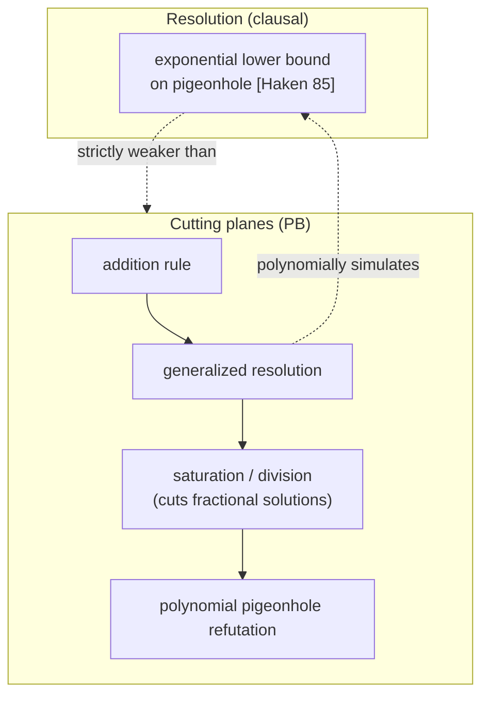
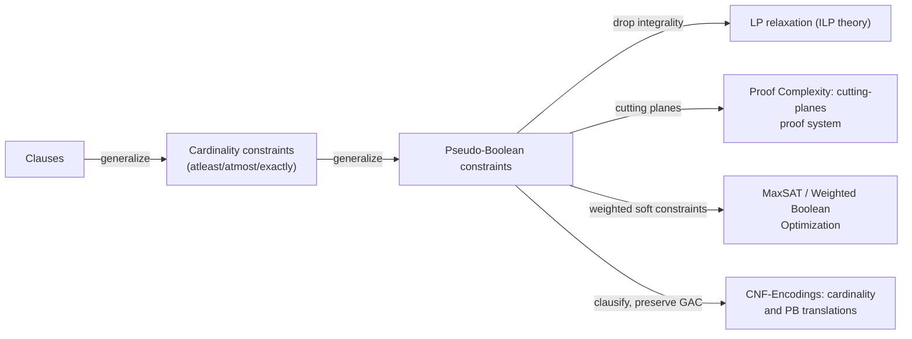

# Pseudo-Boolean and Cardinality Constraints

[[book-guidelines|↩ Back to guidelines]]

## Why the book stops at clauses and then keeps going

A CNF clause $l_1 \vee l_2 \vee \dots \vee l_n$ says exactly one thing: *at least one of these literals is true*. That's an extremely blunt instrument. Say what you actually want is "at least 3 of these 10 literals are true," or "the weighted sum of these signals crosses some threshold" — the kind of constraint that shows up constantly in scheduling, resource allocation, circuit verification, and combinatorial optimization. You *can* say it in CNF, but as [[CNF-Encodings|CNF Encodings]] already showed for at-most-one, translating a counting constraint down to clauses either blows up exponentially (if you insist on a clausal formula that's literally logically equivalent, no extra variables) or needs auxiliary variables and careful engineering to stay polynomial and propagation-friendly.

Pseudo-Boolean (PB) constraints are the book's answer to "what if we just kept the arithmetic instead of grinding it down to clauses." They've existed since 1960s Operations Research (0-1 integer programming) — SAT rediscovered them because they sit at a genuinely useful point on a two-axis tradeoff: **more expressive than clauses** (so the encoding is smaller and preserves problem structure) while remaining **close enough to SAT** to reuse resolution-era engineering (watched literals, conflict-driven learning, [[Conflict-Driven-Clause-Learning#Non-chronological backtracking|non-chronological backtracking]]). The chapter's own framing, verbatim: "pseudo-Boolean constraints appear as a nice compromise between the expressive power of the formalism used to represent a problem and the difficulty to solve the problem in that formalism."

There is a sharper, non-hand-wavy version of "more expressive," too: some problems that require **exponentially many resolution steps** when clausified are solvable in **polynomially many inference steps** natively in the PB formalism. That's not an implementation detail — it's a statement about the proof system itself, and it's the throughline connecting this chapter to [[Proof-Complexity|Proof Complexity]]'s treatment of cutting planes.

## Linear and non-linear pseudo-Boolean constraints

**Setup.** Boolean variables $x_j \in \{0,1\}$ (equivalently $\{F,T\}$). A *literal* $l_j$ is $x_j$ or its negation $\overline{x_j}$. Every literal carries an integer coefficient (coefficient 1 is just omitted when writing the constraint down).

**Linear pseudo-Boolean constraint (LPB):**

$$\sum_j a_j l_j \;\rhd\; b, \qquad \rhd \in \{=, >, \ge, <, \le\}$$

$a_j, b \in \mathbb{Z}$; $b$ is called the constraint's **degree**. Concretely: $3x_1 + 4\overline{x_2} + 5x_3 \ge 7$ is an LPB constraint, satisfied by e.g. $x_1{=}1, x_2{=}0$ (any assignment making the weighted literal-sum reach 7). Compare that to what you'd need in pure CNF to express the same threshold — you're back to an exponential-in-the-worst-case disjunction of minimal satisfying subsets.

**Non-linear pseudo-Boolean constraint:**

$$\sum_j a_j \Big(\prod_k l_{j,k}\Big) \;\rhd\; b$$

A product of literals is just logical AND, restated arithmetically ($\{0,1\}$-valued product = conjunction). $7x_1x_2 + 3x_1 + x_3 + 2x_4 \ge 8$ is non-linear because of the $x_1x_2$ term. **Linearization** (§28.2.6) turns any non-linear instance back into a linear one by introducing one fresh variable $v$ per product $\prod_k l_k$, with $v \leftrightarrow \prod_k l_k$ enforced by exactly the clauses you'd expect from a Tseitin-style AND-gate encoding (one clause $v \vee \overline{l_1} \vee \dots \vee \overline{l_n}$ for the "$v \Rightarrow \bigwedge l_k$" direction, plus either $n$ clauses or a single PB constraint $\sum_k l_k - nv \ge 0$ for the converse). If you've internalized Tseitin from [[CNF-Encodings|CNF Encodings]], this is the exact same "name the subformula" move, just applied to a product term instead of a whole gate tree.

**Normalization.** Every PB constraint can be rewritten in linear time into the canonical form

$$\sum_j a_j l_j \ge b, \qquad a_j, b \ge 0$$

(a pseudo-Boolean expression with only non-negative coefficients is called a **posiform**). The recipe: flip $>$/$<$ to $\ge$/$\le$ by adjusting $b$ by 1 (valid because all coefficients are integers); split $=$ into two $\ge$/$\le$ constraints; negate both sides to flip $\le$ into $\ge$; then replace any literal with a negative coefficient $x_j$ (or $\overline{x_j}$) by $1 - \overline{x_j}$ (or $1-x_j$) and fold constants into $b$. Everything downstream in the chapter — inference rules, propagation, learning — assumes this normalized form, exactly the way SAT solvers assume CNF and never re-derive it per-clause.

**What breaks without a native PB layer.** Consider the classic "binary adder" example: summing two $n$-bit numbers $A,B$ into an $(n{+}1)$-bit $C$ is *one* PB constraint, $\sum_i 2^i a_i + \sum_i 2^i b_i = \sum_i 2^i c_i$. A polynomial clausal encoding of the same adder needs explicit carry variables and per-bit gate clauses — more variables, more constraints, and the addition itself (something a PB solver has "hard-wired" via arbitrary-precision arithmetic on coefficients) has to be spelled out gate by gate. The chapter's other headline example is integer factorization: $N = P \cdot Q$ is one non-linear PB constraint $\sum_i\sum_j 2^{i+j} p_i q_j = N$; clausifying it needs multiple binary adders as auxiliary machinery. Neither example is contrived — they're the textbook cases where PB's arithmetic core does real compression work that a clausal encoder can only simulate at a cost.

```rust
// A normalized linear PB constraint, as you'd actually represent it
// in a solver's core data structure.
struct PbConstraint {
    // (coefficient, literal) pairs, coefficients >= 0 after normalization
    terms: Vec<(u64, Literal)>,
    degree: u64, // b, in  sum(a_j * l_j) >= b
}

#[derive(Clone, Copy)]
struct Literal { var: u32, negated: bool }
```

## Atleast, atmost, and exactly cardinality constraints

A **cardinality constraint** is the special case where every coefficient is 1 — it only counts, it doesn't weigh. Three forms, all defined over a set $S = \{x_1,\dots,x_n\}$:

- $\mathrm{atleast}(k, S)$ — true iff at least $k$ of the literals are true.
- $\mathrm{atmost}(k, S)$ — true iff at most $k$ are true.
- $\mathrm{exactly}(k, S)$ — true iff exactly $k$ are true.

The book gives the identities that make `atleast` the *only* primitive you strictly need:

$$\mathrm{atmost}(k, S) \equiv \mathrm{atleast}(|S|-k, S)$$
$$\mathrm{exactly}(k, S) \equiv \mathrm{atmost}(k,S) \wedge \mathrm{atleast}(k,S)$$

and the direct PB translation: $\mathrm{atleast}(k,S)$ *is* the LPB constraint $x_1 + x_2 + \dots + x_n \ge k$ (symmetrically, $\mathrm{atmost}(k,S)$ is $\sum x_i \le k$). Conversely, any PB constraint with **all equal coefficients** is secretly a cardinality constraint: $\sum_{j=1}^n a x_j \ge b \equiv \mathrm{atleast}(\lceil b/a\rceil, S)$. This gives you the containment chain the chapter is built around:

$$\text{clauses} \;\subsetneq\; \text{cardinality constraints} \;\subsetneq\; \text{pseudo-Boolean constraints}$$

(a clause $x_1 \vee \dots \vee x_n$ is exactly $\mathrm{atleast}(1,S)$, i.e. $\sum x_i \ge 1$).

**Why the chapter still defines all three redundant forms** despite the identities collapsing them to one: each form is the *natural* shape for a different modeling situation (upper-bounding resource usage reads as `atmost`, lower-bounding coverage reads as `atleast`), and more importantly, algorithms are often specialized per-form — an `atmost` constraint has cheap "at-most-one" style watched-literal schemes (see [[CNF-Encodings|CNF Encodings]]'s ladder/commander/bimander encodings) that don't obviously generalize to arbitrary weighted PB constraints. The redundancy is a modeling convenience layered on top of a genuine semantic identity, not a sign the definitions are sloppy.

**The exponential-blowup fact, precisely.** $\mathrm{atleast}(k, \{x_1,\dots,x_n\})$ translated to CNF *without auxiliary variables* needs $\binom{n}{n-k+1}$ clauses (choose which $n-k+1$ literals must contain at least one true literal). This is exponential at $k \approx n/2$. Polynomial clausal encodings exist (sequential counter, sorting-network-based, and the others surveyed in [[CNF-Encodings|CNF Encodings]] §2.2.5) — but every one of them pays for polynomial size with auxiliary variables. Native cardinality/PB solving sidesteps that trade entirely by keeping the arithmetic structure intact instead of paying either exponential clause count or auxiliary-variable overhead.

```python
# Cardinality constraints collapse to a single-coefficient PB constraint —
# quick illustrative check, not load-bearing machinery.
def is_cardinality(terms):
    coeffs = {a for a, _ in terms}
    return len(coeffs) == 1

def atmost_as_atleast(k, n):
    return n - k  # atmost(k, S) == atleast(n-k, S)
```

## Decision problem, optimization problem, and where the complexity actually lives

Two distinct questions get asked of a PB formula:

- **Pseudo-Boolean Solving (PBS)** — the decision problem: is $f = \bigwedge_i \omega_i$ satisfiable? Same shape as SAT.
- **Pseudo-Boolean Optimization (PBO)** — given constraints plus a cost function $\mathrm{Cost}(x_1,\dots,x_n)$ (linear $\sum_j c_j x_j$, or non-linear), find a satisfying assignment that *minimizes* it (maximization reduces to minimizing $-\mathrm{Cost}$). PBO is NP-hard; PBS is NP-complete (in NP because checking a candidate assignment is polynomial *in the size of the encoded problem, which now must include the bit-length of every coefficient* — not just the literal count, unlike a clause).

That last parenthetical matters more than it looks: **coefficient size is part of the input size.** The factorization example shows coefficients can be exponentially large relative to $n$. A fixed-precision solver is incorrect on such instances outright (silent overflow during inference is a correctness bug, not a performance one) — arbitrary-precision arithmetic is a hard requirement for a sound PB solver, not an optimization.

The chapter's complexity table makes the expressiveness/difficulty tradeoff numerically concrete:

| | Clauses | Linear PB ($\ge$) | Non-linear PB ($\ge$) |
|---|---|---|---|
| satisfiability of 1 constraint | $O(1)$ | $O(n)$ | NP-complete |
| satisfiability of 2 constraints | $O(n)$ | NP-complete | NP-complete |

A single clause is trivially checkable (non-empty ⇒ SAT). A single LPB constraint needs a linear-time bound computation, still easy. But checking a single non-linear PB constraint is already NP-complete — any 3-SAT clause $C = l_1 \vee l_2 \vee l_3$ reduces to $f(C) = l_1+l_2+l_3-l_1l_2-l_1l_3-l_2l_3+l_1l_2l_3 = 1$, and the whole 3-SAT formula becomes $\sum_i f(C_i) \ge n$. And two *linear* PB constraints together are already NP-complete via a direct encoding of subset-sum. This is the formal shape of "PB constraints are strictly more expressive than clauses": expressiveness gain is exactly matched by a jump in the difficulty of even the smallest interesting sub-cases.

## Cutting-planes-style inference rules for pseudo-Boolean solving

This is the chapter's proof-theoretic core, and it's the direct PB analogue of what [[Proof-Complexity|Proof Complexity]] calls the **cutting planes** proof system — the two chapters are describing the same object from two angles (that one theoretically, via lower/upper bounds on proof size; this one operationally, as the actual inference engine inside a solver).

**Foundational identities**, immediate from the $\{0,1\}$ axioms ($L_j$ below denotes either a literal or a product of literals — everything is either $0$ or $1$):

$$\overline{x} = 1-x \qquad\qquad x \cdot x = x \qquad\qquad \begin{aligned}x&\ge 0\\-x&\ge -1\end{aligned}$$
$$(\text{negation}) \qquad\qquad (\text{idempotence}) \qquad\qquad (\text{bounds})$$

**The three rules that form a complete proof system** (Gomory 1963 — meaning: whenever a set of constraints is unsatisfiable, these rules alone always suffice to derive the contradiction $0 \ge 1$):

$$\frac{\sum_j a_jL_j \ge b \quad \sum_j c_jL_j \ge d}{\sum_j (a_j+c_j)L_j \ge b+d} \;(\text{addition}) \qquad
\frac{\sum_j a_jL_j \ge b \quad \alpha \in \mathbb{N}, \alpha>0}{\sum_j \alpha a_jL_j \ge \alpha b} \;(\text{multiplication})$$

$$\frac{\sum_j a_jL_j \ge b \quad \alpha>0}{\sum_j \lceil a_j/\alpha\rceil L_j \ge \lceil b/\alpha\rceil} \;(\text{division})$$

Division is where the *integer* structure genuinely earns its keep — it's a rounding step with no clausal counterpart, and it's exactly what lets cutting planes "cut off" non-integer (fractional) solutions that would otherwise satisfy the raw linear-algebra relaxation.

**Generalized resolution** combines addition and multiplication into the rule solvers actually run to eliminate a variable:

$$\frac{\sum_j a_jL_j \ge b \quad \sum_j c_jL_j \ge d \quad \alpha,\beta \in \mathbb{N},\ \alpha,\beta>0}{\sum_j (\alpha a_j+\beta c_j)L_j \ge \alpha b + \beta d}$$

Pick $\alpha = q/\gcd(p,q)$, $\beta = p/\gcd(p,q)$ to cancel a literal $l$ appearing with coefficient $p$ in one constraint and $\overline{l}$ with coefficient $q$ in the other ($l + \overline{l} = 1$ is a constant, so the term drops out). **Crucially, eliminating one variable can silently eliminate others too** — the chapter's example: eliminating $x_1$ from $\{x_1+x_2+x_3\ge 1,\; 2x_1+2x_2+x_4\ge 3\}$ also removes $x_2$, yielding $2x_3+x_4\ge 1$ (later simplified by saturation to $x_3+x_4\ge 1$). This is a purely arithmetic side effect that resolution on clauses has no analogue for.

**Saturation** is the rule that does the actual "cutting": if a normalized constraint has a coefficient $a_k$ strictly larger than the degree $b$, truncate it down to $b$ — logically, once $a_k > b$, assigning $L_k = 1$ alone already satisfies the constraint, so any value $\ge b$ for that coefficient has identical logical force:

$$\frac{\sum_j a_jL_j \ge b \quad (\forall j,\ a_j\ge 0) \quad a_k > b}{bL_k + \sum_{j\ne k} a_jL_j \ge b}$$

**Generalized resolution alone is *not* complete** — it can't remove non-integer solutions. The book's canonical counterexample: $\{a\vee b,\ a\vee\overline{b},\ \overline{a}\vee b,\ \overline{a}\vee\overline{b}\}$ is clausally unsatisfiable, but the *rational* point $a=b=1/2$ satisfies every constraint generated by generalized resolution alone — you need saturation (equivalently, division) to cut that fractional point away. This is the PB-native reason cutting planes needs three rules, not two: addition/multiplication is pure linear algebra (works fine over $\mathbb{Q}$), and only saturation/division exploits "these variables are integers, in fact $\{0,1\}$" to prune solutions linear algebra alone would accept.

**Weakening** and **partial weakening** round the rule set out — pure applications of addition plus the bounds axioms, used to *drop* a literal from a constraint (at the cost of a logically weaker result), which turns out to be exactly the operation conflict analysis needs to keep an intermediate constraint unsatisfied while eliminating variables (see below).

### Cutting planes strictly dominates resolution

**Resolution ⊆ cutting planes (as PB special case).** Propositional resolution on clauses $l \vee A$, $\overline{l} \vee B$ *is* the addition rule on the corresponding PB encodings $l + \sum_j l_j^A \ge 1$ and $1-l+\sum_j l_j^B \ge 1$; summing them and canceling $l+\overline{l}=1$ recovers exactly the resolvent clause. **Merging** ($l \vee l \vee C \Rightarrow l \vee C$, needed for propositional resolution's completeness) is a direct instance of saturation. So cutting planes polynomially simulates resolution — anything resolution can prove, cutting planes proves at no more than polynomial cost.

**The separation is strict — the pigeonhole problem.** Placing $p$ pigeons in $h < p$ holes (each hole at most one pigeon) is the textbook example requiring *exponentially many resolution steps* to refute in CNF [Haken 1985] — yet it has a **polynomial** cutting-planes refutation, and (this is the sharp point) **a conflict-driven learning solver discovers this polynomial proof automatically**, just by doing ordinary conflict analysis on the cardinality-constraint encoding. With $p{=}5,h{=}4$ encoded as $\sum_h P_{p,h} \ge 1$ (each pigeon somewhere) and $\sum_p P_{p,h} \ge 4$ (each hole excludes at most one pigeon, in complemented/normalized form), the solver assigns pigeons to holes greedily, hits a conflict, and generalized-resolution its way to progressively shorter learned constraints (the book walks three successive conflict-analysis steps, each *eliminating multiple variables at once* via the arithmetic cancellation — precisely the phenomenon called out above) until it derives $P_{1,1}+P_{1,2}+P_{1,3}+P_{1,4}\ge 4$ over only 4 literals, contradicting the original "pigeon 1 fits somewhere, $\ge 1$" constraint. The key structural reason this is short: **one PB constraint captures several clausal symmetries at once** — where a SAT encoding needs a family of clauses $\overline{P_{4,4}} \vee P_{5,1} \vee P_{5,2} \vee P_{5,3}$ to say "if $P_{4,4}$ then one of these three," the PB constraint from combining $H_4$ and $P_5$ says "if *any* of $P_{1,4},P_{2,4},P_{3,4},P_{4,4}$, then one of $P_{5,1},P_{5,2},P_{5,3}$" — a single arithmetic fact standing in for what would otherwise be several separate clausal facts.



## Current algorithms: propagation, learning, and optimization

The chapter's algorithmic story is "take every major CDCL idea and re-derive it for weighted, arithmetic constraints instead of clauses." Algorithm 28.1's skeleton is literally CDCL's `Decide` / `Deduce` / `Diagnose` loop — the interesting work is in what `Deduce` and `Diagnose` have to become.

### Generalized Boolean constraint propagation

For a normalized constraint $\omega:\sum a_j l_j \ge b$, define (given a partial assignment) the current left-hand value $L_\omega = \sum_{l_j\in\omega^1} a_j$ and the **slack**

$$s_\omega = \Big(\sum_{l_j \notin \omega^0} a_j\Big) - b$$

— the maximum amount the left side could still exceed $b$ if every unassigned literal came out true. Three regimes: $\omega$ is **satisfied** if $L_\omega \ge b$; **unsatisfied** (conflicting) if $s_\omega < 0$; otherwise **unresolved**. A unit constraint is the case where some unassigned literal $l_j$ has $s_\omega - a_j < 0$ — it *must* be set true, or the constraint becomes unsatisfiable. Note the qualitative difference from clausal unit propagation: **one PB constraint can force several literals true in one shot** (the book's worked example, $5x_1+3x_2+3x_3+x_4\ge 6$: assigning $x_1{=}0$ forces $x_2$ true via the slack computation, and *that* forces $x_3$ true too, before the constraint is satisfied — a cascading multi-literal implication a single clause could never produce).

If you're already thinking about domain/lattice propagation for a CSP kernel: **slack is exactly an interval abstraction.** $s_\omega \ge 0$ is "the interval $[L_\omega, L_\omega + \text{(sum of unassigned coefficients)}]$ still contains $b$"; $s_\omega < 0$ is "the interval's upper bound already fell below $b$ — infeasible, prune." This is textbook abstract-domain-style over-approximation of feasibility, done arithmetically instead of via explicit domain sets, and it's the most direct load-bearing connection this chapter has to the CSP/abstract-interpretation side of the standing project: a pseudo-Boolean solver's propagation loop *is* a specialized bounded-interval constraint propagator over $\{0,1\}$ variables with linear constraints.

**Watched literals generalize, but the watch set is no longer fixed-size.** For clauses, watching 2 literals suffices. For a PB constraint, you need a watch set $W$ with $S(W) = \sum_{l_j\in W} a_j \ge b + a_{max}$ (where $a_{max}$ bounds the largest coefficient among unassigned literals) to guarantee detecting both "unsatisfied" and "unit" states without scanning every literal. For a plain cardinality constraint $|W| = b+1$ is constant (matching clauses' constant watch count when $b{=}1$); for weighted PB constraints, $|W|$ genuinely varies as assignments change and $a_{max}$ shifts — the chapter flags recomputing $a_{max}$ as a real performance bottleneck, with a common fix of just fixing $a_{max}$ to the constraint's largest coefficient up front (avoids recomputation, costs some extra literals watched).

```rust
// Skeleton of PB-constraint propagation: the generalized watched-literals
// check, one level more general than a clause's 2-literal watch.
struct PbWatch<'a> {
    constraint: &'a PbConstraint,
    watched: Vec<usize>, // indices into constraint.terms
}

impl<'a> PbWatch<'a> {
    fn slack(&self, assignment: &Assignment) -> i64 {
        // sum of a_j over literals NOT assigned false, minus degree
        self.constraint.terms.iter()
            .filter(|(_, l)| assignment.value(*l) != Some(false))
            .map(|(a, _)| *a as i64)
            .sum::<i64>() - self.constraint.degree as i64
    }

    // Unit iff some unassigned literal l_j has slack - a_j < 0.
    fn unit_literals(&self, assignment: &Assignment) -> Vec<Literal> {
        let s = self.slack(assignment);
        self.constraint.terms.iter()
            .filter(|(_, l)| assignment.value(*l).is_none())
            .filter(|(a, _)| s - (*a as i64) < 0)
            .map(|(_, l)| *l)
            .collect()
    }
}
```

### Conflict analysis over implication graphs, generalized

The propositional implication-graph machinery ports over almost directly: vertices are assignments $x_j = v(x_j)@\delta(x_j)$, edges labeled by the constraint that forced the assignment, conflict vertices $\kappa$ mark unsatisfied constraints. **One divergence**: a single PB constraint can be the "reason" edge into *several* forced assignments at once (again, the cascading-propagation phenomenon), something a clausal implication graph never exhibits. Conflict-induced constraints, UIPs (Unique Implication Points — vertices at the current decision level dominating $\kappa$), and cut-based learning (first-UIP being the standard stopping point) all generalize unchanged in *definition*; what changes is how the "resolvent" constraint at each step is actually computed.

**The subtlety generalized resolution introduces into learning:** naively applying generalized resolution during conflict analysis can produce a constraint that is *not* itself in conflict with the current assignment, even though the two inputs were — because generalized resolution can discard information the plain rule doesn't preserve. The fix ([CK03]): apply **weakening** (reduce unassigned-or-true literals) to both antecedents *before* resolving, keeping the running conflict-induced constraint unsatisfied at every step, so that after backtracking it is guaranteed to become unit and assert a failure-driven assertion — exactly mirroring what first-UIP learning guarantees for clauses. Algorithm 28.2 (`Conflict_Analysis`) is this loop: `Reduce1`/`Reduce2` (weakening), `Cut_Resolve` (generalized resolution), repeat until the growing constraint implies a literal at an earlier decision level.

There's a real engineering tradeoff exposed here: learning fully general PB constraints costs more per-constraint overhead (bigger, harder-to-watch data structures) than learning propositional clauses or cardinality constraints, so `Reduce3`-style cardinality reduction or a hybrid scheme (learn both, keep whichever is stronger relative to overhead) is common in practice — a direct instance of the "soundness is free, but the trusted-kernel's *efficiency* is a design decision" tension that recurs across proof-producing systems.

### Optimization: bounding, cutting planes, and core-guided search

**Generic PBO** (Algorithm 28.3) is the decision solver plus one extra move: each time a full solution is found with cost $c(S)$, add the constraint $\sum c_j x_j \le c(S)-1$ and keep searching — a linear search from the top down. **Branch-and-bound** sharpens this with a **lower bound** estimate $P.lower$ at every search-tree node; whenever $P.path + P.lower \ge P.upper$, prune (no improving solution is reachable from here). Two lower-bounding families:

- **Maximum Independent Set (MIS) of constraints** — greedily pack unresolved constraints with no shared literals, sum each one's minimum-satisfying-cost (itself a 0-1 knapsack, either exactly via pseudo-polynomial DP or approximately via a greedy cardinality-reduction). Cheap, can be arbitrarily loose.
- **Linear Programming Relaxation (LPR)** — drop the integrality constraint ($0 \le x_j \le 1$ instead of $x_j \in \{0,1\}$), solve the resulting LP; $z^*_{lpr} \le z^*_{pb}$ always, with equality when the LP solution happens to be integral. Tighter than MIS, more expensive.

**Cutting planes for optimization** connect directly back to the inference rules above via Gomory's original 1958 motivation: when the LPR solution is fractional, pick a basic variable $x_j$ with non-integer value, read off its simplex-tableau row, and Gomory's fractional-cut inequality is valid for every integer solution but *violated by the current fractional LP optimum* — adding it to the LPR strictly tightens the bound. Substituting slack variables back in terms of the original problem variables and rounding recovers an ordinary PB constraint, closing the loop between "ILP cutting planes" and "PB cutting planes" as literally the same technique.

**Core-guided / UNSAT-SAT search** flips the direction: start from a trivial lower bound, and increment it only when a PBS call proves the current bound infeasible, using the solver's returned **unsatisfiable core** to introduce relaxation variables (Algorithm 28.6, MSU3-style) exactly as core-guided MaxSAT does — because Weighted Boolean Optimization (WBO) is literally PBO reframed as hard-constraint-plus-weighted-soft-constraint MaxSAT (each cost term $c_jx_j$ becomes a soft constraint $x_j\ge 1$ with weight $c_j$). This is why the chapter defers most of the algorithmic detail here to the [[Maximum-Satisfiability|Maximum Satisfiability]] chapter — the core-guided machinery genuinely is shared infrastructure, not a PB-specific reinvention.

## Translating pseudo-Boolean constraints back into SAT

Sometimes a native PB solver isn't available, and you want a CNF that a plain SAT solver can consume. The chapter surveys translations in increasing sophistication, all trading off encoding size against how well unit propagation on the *translated* CNF approximates propagation on the *original* PB constraint (formally: does UP maintain **generalized arc consistency**, GAC — i.e. does the clausal encoding infer everything the PB slack computation would infer, not less):

1. **Naive semantic equivalence, no extra variables** — exponential in general (same blowup as cardinality-to-CNF above). Unusable except for tiny instances.
2. **Adder-chain encoding** — chain of binary adders summing terms one at a time, final comparator against $b$. Polynomial size, but **does not maintain GAC**: as soon as *any* one variable in the chain is unassigned, every downstream partial sum becomes undefined and the comparator can't propagate — so a constraint like $x_1+x_2+x_3+x_4\ge 3$ with $x_1=x_2=0$ won't trigger any inconsistency until $x_3,x_4$ are also assigned, even though $x_2,x_3,x_4$ must all be true and this is inferable immediately.
3. **BDD-based encoding** [ES06, BBR06] — build a Binary Decision Diagram over the constraint (node $\omega_{m,c}$ ⟺ $\sum_{j\ge m} a_jx_j \ge c$, with the two children corresponding to $x_m{=}1$/$x_m{=}0$), Tseitin-encode the BDD. This *does* let unit propagation maintain GAC — but can still be exponential in the worst case for some constraints.
4. **Unary/sorting-network and mixed-radix encodings** [BB03, ES06] — represent the running sum in unary (a number $n$ between $0..m$ as exactly $n$ true variables out of $m$, keeping true/unassigned/false contiguous via a sorting network), or in a compressed mixed-radix generalization of unary that keeps GAC while shrinking the encoding. `minisat+` [ES06] picks per-constraint among adder/BDD/unary representations, whichever is smallest for that constraint's actual coefficients.
5. **Polynomial GAC-preserving encoding** [BBR09, 2009] — the first encoding proven both polynomial *and* GAC-preserving in the worst case. Coefficients written in binary, grouped into weight-indexed "buckets" that a sorting network sorts (unit-propagation-friendly), with carries rippling between buckets exactly the way binary addition carries ripple — an unassigned-literal-aware binary adder built entirely out of unit-propagable comparisons. $O(n\log n \log a_{max})$ variables, $O(n^2\log n\log a_{max})$ clauses.

The throughline: **"encode into clauses" and "propagate directly on the arithmetic form" are the same design tension that runs through every constraint formalism** — you can always compile a rich constraint down to a weaker/simpler one at some size or precision cost, and the right choice depends entirely on whether the compiled form still lets your propagator infer as much, as cheaply, as the native form would.

## Where this leads



Within the book, this chapter is the connective tissue between the purely clausal Part I machinery ([[CNF-Encodings|CNF Encodings]] for translation, [[Conflict-Driven-Clause-Learning|Conflict-Driven Clause Learning]] for the propagation/learning loop this chapter re-derives, [[Proof-Complexity|Proof Complexity]] for the theoretical account of *why* cutting planes beats resolution) and Part II's optimization-flavored chapters ([[Maximum-Satisfiability|Maximum Satisfiability]], which shares the core-guided algorithmic family almost verbatim).

For the standing project: this chapter is close to a direct blueprint for the **domain/lattice-propagation half of the planned CSP kernel**. The slack computation $s_\omega = \sum_{l_j\notin\omega^0}a_j - b$ *is* an interval-abstraction feasibility check over $\{0,1\}$-typed variables with linear arithmetic constraints — the same shape of reasoning your abstract interpreter will need for integer/lattice domain propagation over refinement-type constraints, just specialized to Booleans and a single linear inequality instead of general lattices. The cutting-planes rules (addition = evidence combination, saturation/division = integrality-exploiting tightening) are a worked example of a **sound, complete inference system stronger than resolution precisely because it exploits arithmetic structure the clausal encoding throws away** — the same argument you'll want ready when justifying why a CHC/Horn-clause solver reasoning natively over linear arithmetic can out-perform one that first bit-blasts everything to SAT. And the conflict-driven learning generalization here (implication graphs and UIPs over arithmetic constraints, not just clauses) is close to the shape a CDCL(T)-style SMT core takes when its theory solver is doing arithmetic reasoning rather than pure Boolean propagation.
