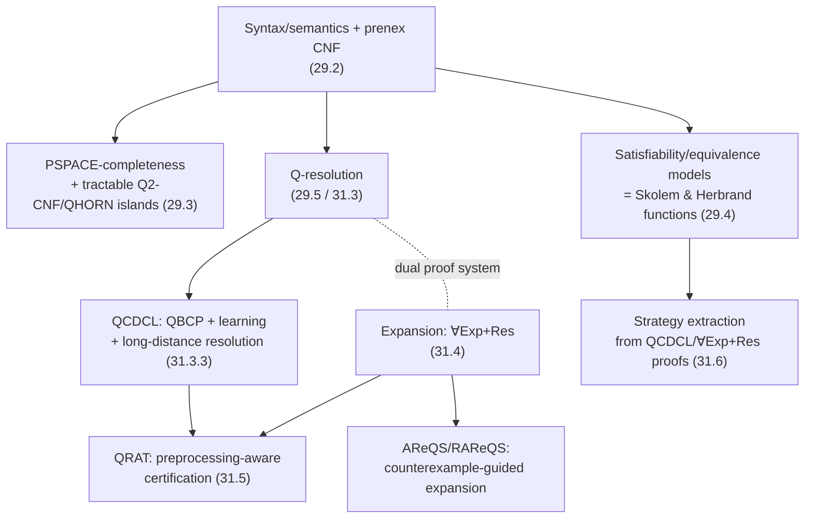

# Quantified Boolean Formulas

[[book-guidelines|↩ Back to guidelines]]

## Why SAT isn't enough

[[Conflict-Driven-Clause-Learning|CDCL]] answers one question well: does *some* assignment satisfy this formula? That's an $\exists$-shaped question — $\exists x_1 \ldots \exists x_n\, \varphi$. But a huge class of real problems isn't shaped like that. "Are these two circuits equivalent for *every* input?" is $\forall$-shaped. "Does a plan exist that works no matter how the environment's nondeterministic choices come out?" is $\exists\forall\exists$-shaped — *there exists* a plan such that *for every* contingency *there exists* a consistent execution reaching the goal (this is exactly [[Planning-as-Satisfiability|conformant/conditional planning's own encoding]]). CEGAR loops ask "does there exist an abstraction such that *for all* concrete instantiations the property holds" — another $\exists\forall$ pattern. None of these collapse into plain SAT without an exponential blow-up: encoding "for all $y$, $\varphi$ holds" as a SAT instance means either enumerating all of $y$'s $2^n$ values, or introducing a second existential player and hoping.

Quantified Boolean formulas (QBF) are what you get when you stop working around this and just add the quantifiers back in. A formula $\exists x\varphi$ is true if *some* assignment to $x$ makes $\varphi$ true; $\forall x\varphi$ is true if *every* assignment does. That's it — the entire extension. But it changes everything about the complexity and the solving technology, because now formulas can express alternating "for all / there exists" games, and the natural algorithm for deciding them requires exploring an alternating tree rather than a single search space. This is precisely why QBF is the *prototypical PSPACE-complete problem*: it's what you get when you generalize NP's "guess and check" to "guess, then defend the guess against every possible attack, recursively."

The three chapters behind this note (29, 30, 31 of the Handbook) form a clean sequence: first the pure theory of what QBF *means* and how hard it is (Ch. 29), then the classical algorithmic families for solving it (Ch. 30), then a rigorous 2021-era proof-theoretic account of *why* those algorithms work and what it takes to trust their answers (Ch. 31). This article follows roughly that arc.

## Syntax, semantics, and prenex normal form

**Definition (QBF\*).** Quantified Boolean formulas are defined inductively: propositional formulas and the constants $1$ (true), $0$ (false) are QBFs; if $\Phi$ is a QBF then $\exists x\Phi$ and $\forall x\Phi$ are QBFs; if $\Phi_1, \Phi_2$ are QBFs then so are $\neg\Phi_1$, $\Phi_1 \vee \Phi_2$, $\Phi_1 \wedge \Phi_2$.

The vocabulary here is worth being precise about, because later chapters lean on it constantly:

- An occurrence of $x$ in $\exists x$ or $\forall x$ is a **quantified occurrence**; the formula it governs is its **scope**.
- An occurrence of $x$ is **bound** if it's inside the scope of a quantifier on $x$; otherwise it's **free**.
- A formula is **closed** iff it has no free variables.
- A formula is **cleansed** (or *polite*) if distinct quantifier occurrences use distinct variables, and every quantified variable is free within its own scope (no vacuous quantification). Any QBF can be cleansed in linear time by renaming — this is the QBF analogue of $\alpha$-renaming in the $\lambda$-calculus, for the same reason: you don't want a substitution to accidentally capture the wrong binder.

**Evaluation** extends propositional semantics with two new cases, and this is where the whole theory's difficulty is seeded:

$$
\mathcal{I}(\exists y\,\Phi) = 1 \iff \mathcal{I}(\Phi[y/0]) = 1 \text{ or } \mathcal{I}(\Phi[y/1]) = 1
$$
$$
\mathcal{I}(\forall x\,\Phi) = 1 \iff \mathcal{I}(\Phi[x/0]) = 1 \text{ and } \mathcal{I}(\Phi[x/1]) = 1
$$

Read that asymmetry carefully: $\exists$ only needs **one** branch to succeed, $\forall$ needs **both**. That "and" is the entire reason QBF's naive decision procedure is a full binary tree of depth $n$ rather than a search that can stop early on failure — a universal node can't be pruned just because *one* child already failed. (We'll see in a moment this is also exactly the reason the worst-case complexity jumps from NP to PSPACE.)

A formula $\Phi_1$ is a **logical consequence** of $\Phi_2$ ($\Phi_1 \models \Phi_2$) if every satisfying valuation of $\Phi_1$ satisfies $\Phi_2$; they're **logically equivalent** ($\Phi_1 \approx \Phi_2$) if each is a consequence of the other. A weaker notion, **satisfiability-equivalence** ($\approx_{sat}$), only requires that both formulas are satisfiable or both are unsatisfiable — it forgets everything about *which* assignments work, keeping only the yes/no answer. For **closed** formulas these coincide (there's only one truth value to preserve), but they diverge for formulas with free variables — a distinction that becomes load-bearing later, because preprocessing and expansion-based solvers routinely trade logical equivalence for the cheaper, weaker $\approx_{sat}$.

**Prenex normal form.** A QBF is in prenex form if it's a block of quantifiers (the **prefix**) followed by a quantifier-free formula (the **matrix**): $\Phi = Q_1 z_1 \ldots Q_n z_n\, \varphi$. Every QBF can be transformed into an equivalent cleansed prenex formula in linear time, by first pushing to negation normal form (using $\neg(\exists x\varphi) \approx \forall x\neg\varphi$ and $\neg(\forall x\varphi) \approx \exists x\neg\varphi$ to flip quantifiers under negation — this is literally De Morgan's law extended with a quantifier-swap rule) and then floating quantifiers outward via rules like $(\forall x\varphi) \wedge \Phi \approx \forall x(\varphi \wedge \Phi)$ (valid once formulas are cleansed, so $x$ can't accidentally capture a variable in $\Phi$).

Once in prenex form, the matrix can be converted to CNF the same way propositional Tseitin transformation works, introducing fresh variables bound *existentially* — since a fresh variable standing in for a subformula is something the existential player gets to choose, not the environment. The resulting class is written **QCNF\***; restricting further to 3-clauses gives **Q3-CNF\***, and dropping the asterisk (writing QCNF, Q3-CNF) means "closed, no free variables." This CNF-restriction move matters enormously in practice: essentially every solver discussed below assumes **PCNF** (prenex CNF) input, because it's the normal form the algorithms are designed against.

**What breaks without prenexing:** without a canonical "quantifiers-out-front, propositional-logic-inside" shape, you can't cleanly separate "which variable does the algorithm branch on next" (a quantifier-order question) from "is the current partial assignment locally consistent" (a propositional-logic question) — the two concerns that every solving algorithm below treats as orthogonal.

**Prefix type and the polynomial hierarchy.** Formulas are classified by their outermost quantifier and number of quantifier alternations: $\Sigma_n$ (outermost $\exists$, $n$ alternations) and $\Pi_n$ (outermost $\forall$). This mirrors the polynomial-time hierarchy exactly:

$$
\Delta_0^P := \Sigma_0^P := \Pi_0^P := P, \quad \Sigma_{k+1}^P := NP^{\Sigma_k^P}, \quad \Pi_{k+1}^P := co\Sigma_{k+1}^P
$$

**Theorem (Stockmeyer–Wrathall).** For $k \geq 1$, satisfiability of QBFs with prefix type $\Sigma_k$ is $\Sigma_k^P$-complete, and prefix type $\Pi_k$ is $\Pi_k^P$-complete.

So a fixed number of quantifier alternations pins down a fixed level of the polynomial hierarchy — $\Sigma_1$ is exactly NP, $\Pi_1$ is exactly coNP — and letting the number of alternations grow with the input gives you all the way up to PSPACE. This is the same $\exists\forall\exists\ldots$ alternation structure that shows up whenever a verification-condition generator or a CEGAR loop asks "does an abstraction exist such that for all refinements a property holds" — QBF's prefix-type hierarchy is the general theory of exactly that alternation.

## PSPACE-completeness: the QBF analogue of the SAT threshold theorem

**Theorem 29.3.1.** The satisfiability, consequence, and equivalence problems for QBF\* and Q3-CNF\* are all **PSPACE-complete**.

The intuition for *membership* in PSPACE is direct from the evaluation rule: deciding $\Phi$ recursively evaluates $\Phi[x/0]$ and $\Phi[x/1]$, reusing the same space for each branch in turn (space is reusable across recursive calls the way time isn't) — so the whole recursion runs in space linear in the formula, even though it takes exponential *time* in the worst case. This is a genuinely different resource trade-off than SAT: an NP algorithm needs to remember (or nondeterministically commit to) one satisfying branch, but a PSPACE algorithm can afford to explore the *entire* alternating tree because it only needs to remember where it currently is, not everywhere it's been. Since Savitch's theorem gives $PSPACE = NPSPACE$, the complement (unsatisfiability) is PSPACE-complete too, and from there consequence and equivalence follow.

Compare this to the SAT side of the book: SAT's phase-transition/threshold results (random 3-SAT's sharp satisfiability threshold) are about the *typical-case* hardness of an NP-complete problem. QBF's PSPACE-completeness is the corresponding *worst-case* statement one level up the hierarchy — it's the fact that makes QBF the encoding target of choice for essentially any PSPACE problem you'd otherwise have to reduce by hand: propositional LTL satisfiability, symbolic reachability in sequential circuits, and — closer to this vault's own material — conformant and conditional planning ([[Planning-as-Satisfiability]] covers the $\exists\forall\exists$ planning-to-QBF translation directly).

**Tractable fragments carve out islands inside PSPACE, exactly like [[CNF-Encodings|2-CNF and Horn-CNF do inside NP]]:**

- **Q2-CNF\*** (matrix restricted to 2-clauses) and **QHORN\*** (Horn clauses) are both solvable in polynomial time.
- The **Dichotomy Theorem** (Schaefer, generalized to QBF) says: for any finite set of Boolean constraints $C$, if $C$ is Horn, anti-Horn, bijunctive (2-CNF-representable), or affine (XOR-CNF), the quantified satisfiability problem $QSAT(C)$ is in P — **otherwise it's PSPACE-complete**. There is no middle ground. This is a strictly sharper statement than "some restrictions help" — it's a complete classification with no partial credit.

The polynomial-time algorithm for Q2-CNF and QHORN comes from **universal reduction** (a simplification rule that will resurface as the core of Q-resolution below): if a non-tautological clause $(\varphi \vee x)$ has a universal literal $x$ with no existential variable dominating it in the prefix order, $x$ can simply be deleted — it can never help falsify anything, since the existential player would have already committed to values before the universal player picks $x$.

## Q-resolution: lifting resolution to alternating quantifiers

Propositional resolution combines two clauses sharing a variable in complementary polarity into a resolvent, cancelling that variable. **Q-resolution** extends this to QBF's quantifier structure with one extra rule and one extra restriction.

**Setup.** A **∀-literal** is over a universally quantified variable, an **∃-literal** is over an existential or free variable. Literals are ordered $L_1 < L_2$ if $L_1$'s variable occurs earlier in the prefix (or is free while $L_2$'s is bound).

**Definition (Q-resolution).** Given non-tautological clauses $\varphi_1$ (containing ∃-literal $y$) and $\varphi_2$ (containing $\neg y$):
1. Delete from each clause every ∀-literal that isn't smaller than some ∃-literal present in that same clause — this is **universal reduction**, and it's the *only* rule in the whole calculus allowed to eliminate universal literals.
2. Cancel $y$ from $\varphi_1$ and $\neg y$ from $\varphi_2$.
3. The resolvent is the union of what's left, **provided it isn't a tautology**.

**Theorem (refutation completeness, Kleine Büning–Karpinski–Flögel 1995).** $\Phi \in$ QCNF\* is unsatisfiable iff Q-resolution derives a non-tautological **∀-clause** (a clause with no existential literals at all) — which, being universally quantified only, is automatically false, so it plays the role the empty clause plays in propositional resolution.

Two things make this genuinely different from propositional resolution, not just a relabeling:

- **Universal reduction is mandatory, not optional.** Skip it and completeness breaks: the book's own example (an unsatisfiable formula where resolving on $y_2$ first, then reducing both results *before* resolving on $y_1$, is the only route to the empty clause) shows that resolving in the "obviously right" order without intermediate reduction can dead-end in a tautology.
- **The propositional exchange lemma fails.** In propositional resolution, if a derivation exists at all, you can usually reorder resolution steps freely. In Q-resolution the same example shows resolving on $y_1$ *before* $y_2$ produces a tautological clause and gets stuck, while the other order succeeds — quantifier structure makes step *order* semantically load-bearing in a way pure propositional logic never does.

A restricted, cheaper version — **Q-unit-resolution** — only resolves against **∃-unit clauses** (at most one ∃-literal, plus any number of ∀-literals). It's not refutation-complete in general, but it *is* complete for a class called **QEHORN\*** (quantified extended Horn: Horn after stripping ∀-literals) — the same shape as propositional unit resolution being complete for Horn-SAT.

**Rust sketch — the reduction rule as the one place universal literals disappear.** This is worth encoding explicitly because it's the exact operation a proof checker must re-verify on every step of a QCDCL-produced certificate:

```rust
struct Prefix { level: Vec<u32> } // level[var] = quantifier block index
enum Quant { Exists, Forall }
struct Qbf { quant: Vec<Quant>, prefix: Prefix }

/// Universal reduction: strip trailing universal literals whose level
/// exceeds every existential literal remaining in the clause.
fn universal_reduce(qbf: &Qbf, clause: &mut Vec<i32>) {
    let max_exist_level = clause.iter()
        .filter(|&&lit| matches!(qbf.quant[var_of(lit) as usize], Quant::Exists))
        .map(|&lit| qbf.prefix.level[var_of(lit) as usize])
        .max();
    clause.retain(|&lit| {
        let is_forall = matches!(qbf.quant[var_of(lit) as usize], Quant::Forall);
        !is_forall || match max_exist_level {
            None => false, // no existential left at all: drop every universal
            Some(m) => qbf.prefix.level[var_of(lit) as usize] <= m,
        }
    });
}
fn var_of(lit: i32) -> u32 { lit.unsigned_abs() }
```

## Two solving paradigms: search vs. expansion

Where SAT solving has one dominant paradigm (CDCL), the QBF literature has two genuinely different, empirically **orthogonal** families — instances easy for one are often hard for the other — plus preprocessing that interacts with both. This split is itself theoretically grounded: it corresponds to two different underlying proof systems, Q-resolution and $\forall$Exp+Res, whose relative strength required *new*, QBF-specific proof-theoretic tools to pin down (ordinary propositional separation techniques aren't sufficient once quantifier alternation is in play).

### Search-based solving: Q-DLL and QCDCL

The simplest QBF decision procedure, **Q-DLL**, is DPLL generalized to alternating quantifiers: pick the variable at the *highest remaining prefix level*; if it's existential, try one polarity, and only backtrack to the other if that branch is `False`; if it's universal, try one polarity, and only backtrack to the other if that branch is `True`. Two propositional-style shortcuts carry over: **unit** literals (existentially quantified, appearing alone modulo dominated universal literals in some clause) and **monotone/pure** literals can be assigned immediately without branching.

```
function Q-DLL(φ, μ):
    if a contradictory clause is in matrix(φ_μ): return False
    if matrix(φ_μ) is empty:                     return True
    if l is unit in φ_μ:      return Q-DLL(φ, μ; l)
    if l is monotone in φ_μ:  return Q-DLL(φ, μ; l)
    l := literal at the highest prefix level in φ_μ
    if l is existential: return Q-DLL(φ, μ;l) or  Q-DLL(φ, μ;l̄)
    else:                return Q-DLL(φ, μ;l) and Q-DLL(φ, μ;l̄)
```

**QCDCL** is the [[Conflict-Driven-Clause-Learning|CDCL]] generalization of this: propagation (**QBCP**, quantified Boolean constraint propagation), decisions, conflict-driven clause **learning**, and [[Conflict-Driven-Clause-Learning#Non-chronological backtracking|non-chronological backtracking]], all built on top of Q-resolution as the underlying proof system. The interaction with Q-resolution is genuinely subtler than CDCL's relationship to propositional resolution, for one specific reason: **1-UIP-style learning can produce a tautological clause**, because two clauses in the implication graph can carry a complementary *pair of universal* literals. In propositional CDCL that situation simply can't arise. QBF has two ways to handle it:

- **Reject it** — stay with plain Q-resolution, at the cost of sometimes being *stuck* (a genuinely learnable conflict can require several extra detour steps to reach without ever going through a tautology).
- **Embrace it** — **long-distance Q-resolution (LD-Q-Res)** explicitly allows deriving tautological clauses when the complementary literals are both *universal*, writing the merged pair as a special literal $y^*$. This is strictly **stronger** than Q-Res (it can find proofs Q-Res provably cannot), and — crucially — it's *sound* precisely because QCDCL's own learning procedure only ever produces such tautologies under the quantification-level restriction the calculus imposes; producing one by ignoring the pivot restriction (as a naive, unrestricted resolution step would) is unsound and can derive a false refutation of a satisfiable formula.

QCDCL solvers also exploit **dependency schemes**: a computable, sound *over-approximation* of "which variables actually depend on which" that relaxes the strict linear prefix order used by vanilla universal reduction. Since exact variable-independence is itself PSPACE-complete to decide, dependency schemes trade precision for tractability — the **standard dependency scheme** and the more refined **resolution-path dependency scheme** are the two practically used today, and solvers like DepQBF and Qute build dependency-aware universal reduction directly into the QCDCL loop, sometimes learning dependencies *on demand* rather than committing to a scheme up front.

### Expansion-based solving and the $\forall$Exp+Res proof system

The other family sidesteps quantifier alternation entirely by *eliminating* it: repeatedly expand a quantifier into two copies of the formula (one per polarity) until only one quantifier type remains, then hand the result to an ordinary SAT solver. $\Pi\exists x\varphi$ expands to $\Pi(\varphi[0/x] \vee \varphi[1/x])$; $\Pi\forall x\varphi$ expands to $\Pi(\varphi[0/x] \wedge \varphi[1/x])$.

This is naturally expensive (each expansion can double formula size), so solvers differ in *what* they expand and *how much*:

- **QUBOS** expands quantifiers inside-out, on arbitrary structure.
- **Quantor** stays in PCNF by resolving out existentials (à la Davis-Putnam variable elimination) while expanding universals.
- **sKizzo** eliminates only universals, introducing fresh existential "copy" variables at each expansion — a move the book calls **propositional Skolemization**, because each fresh variable corresponds to one point of a Skolem function (see the next section — this is not a coincidence, it's the same object viewed from a different angle).
- **RAReQS**/QELL/Ijtihad avoid full expansion, instead expanding *gradually*, driven by counterexamples, at the cost of multiple SAT-solver calls per QBF instance.

That last family is worth pausing on, because its algorithm is a clean, self-contained instance of a **CEGAR loop** — genuinely the same shape as counterexample-guided abstraction refinement, just specialized to two-level QBF. **AReQS** (for $\forall X\exists Y\varphi$) works like this: guess an assignment to the outer universal $X$ (a "counterexample attempt"), check whether the existential player has a response — a SAT call on $\varphi$ restricted to that $X$-assignment. If yes, that response doesn't by itself prove the whole formula true (it only defeats *one* universal move); the algorithm accumulates a *set* of previously-seen universal assignments and existential responses, and asks whether a *single* existential strategy can be found that answers *all* of them so far, refining by adding the next universal counterexample whenever the current candidate strategy fails one. **RAReQS** generalizes this to arbitrarily many quantifier levels by recursion, replacing each level's naive enumeration with a nested instance of the same guess/refine game.

At the proof level, this whole family corresponds to $\forall$**Exp+Res**: take a matrix clause $C$, an assignment $\tau$ to *all* universal variables, and instantiate — universal literals get resolved away by $\tau$ directly, and each existential variable $x$ occurring in $C$ is **annotated** with $\tau$ restricted to the universals preceding $x$ in the prefix, written $x^{[\tau]}$:

$$
\text{Axiom: } \frac{}{\{l \mid l \in C, l \text{ existential}\} \cup \{\tau(l) \mid l \in C, l \text{ universal}\}}
\qquad
\text{Res: } \frac{C_1 \cup \{x^\tau\} \quad C_2 \cup \{\bar x^\tau\}}{C_1 \cup C_2}
$$

then resolve these annotated clauses with ordinary propositional resolution until the empty clause appears. Each distinct annotation $x^{[\tau]}$ is a *separate copy* of variable $x$ — literally naming "what the existential player does in response to this specific universal move" as its own object. This is exactly the same construction as sKizzo's fresh copy-variables above, just formalized as a proof system rather than baked into a solver's internal representation, and it's the formal reason expansion-based solving and Q-resolution-based solving are proof-theoretically incomparable: $\forall$Exp+Res can be exponentially *shorter* than Q-Res on formulas where the "right" per-branch existential response is simple to state once but expensive to derive generically, and vice versa on formulas where sharing structure across universal branches (which Q-resolution can exploit and per-branch annotation cannot) matters.

## Skolem and Herbrand functions as winning strategies

Reformulate QBF's evaluation rule functionally instead of recursively, and a deep structural fact falls out: $\forall x_1\exists y_1 \ldots \forall x_k \exists y_k\,\varphi$ (no free variables) is true **iff** there exist Boolean functions $f_i : \{0,1\}^i \to \{0,1\}$ such that substituting $y_i \mapsto f_i(x_1,\ldots,x_i)$ everywhere turns $\varphi$ into a **tautology** once the remaining universals are stripped. Such a sequence $(f_1,\ldots,f_k)$ is a **satisfiability model** — and this is precisely a Skolem function in the logician's sense: the existential variable's value as an explicit function of everything universally quantified *before* it in the prefix. The book runs the game-theoretic reading in parallel, and it's worth stating exactly: evaluate a PCNF as a two-player game where each quantifier block's variables get assigned, in prefix order, by whichever player owns that block; the existential player wins iff the matrix ends up true. **A Skolem function is exactly a winning strategy for the existential player**; dually, a **Herbrand function** is a winning strategy for the universal player on a false formula. The theorem that *exactly one player always has a winning strategy* is just Zermelo's theorem for finite, perfect-information, two-player games — restated for QBF, it's the same fact as "a closed QBF is either true or false," now with an explicit witness attached to whichever answer holds.

**This is the single most direct bridge in this chapter to the standing elaborator/unification project.** Read $\forall x \exists y\, \varphi(x,y)$ under Curry–Howard and it's a dependent function type: a witness for it is literally a function $f : x \to y$ such that $\varphi(x, f(x))$ holds for every $x$ — a **Π-type of a Σ-type**, collapsed to a plain function because the domain (Booleans) is decidable and finite. Extracting a Skolem function from a QBF proof is the same *kind* of operation as an elaborator resolving an implicit argument via metavariable instantiation: in both cases you have an existentially-quantified placeholder whose correct value is *determined* by the surrounding constraints (the universal context, or the typing context), and the job of the proof/elaboration machinery is to pin down that value without the user ever writing it explicitly. Miller's pattern unification restricts higher-order unification to a decidable fragment by requiring metavariable arguments to be distinct bound variables; QBF's Skolem functions are the finite-domain, ground special case of exactly this — "the value of $y$ is a function of the variables in scope before it" is the QBF-world statement of "a metavariable's solution is a function of the variables it's allowed to depend on."

Formally, this correspondence gets a second, sharper layer: **equivalence models** (Def. 29.4.3) ask for functions that preserve *logical* equivalence rather than merely satisfiability, and their existence and complexity vary sharply by formula class — every Q2-CNF\* formula has an equivalence model expressible in the tiny class $1\text{-CNF} \cup 1\text{-DNF} \cup \{0,1\}$, every QHORN\* formula has one expressible as a monotone formula, but checking whether a *given* candidate function set is a $K$-equivalence model for general QCNF is PSPACE-complete even when $K$ is unrestricted propositional logic. The pattern — "restricting the *shape* of the function class makes an otherwise-PSPACE-complete search collapse to something tractable" — is the exact same move as restricting general higher-order unification down to Miller patterns, or restricting general dependent elaboration down to bidirectional inference/checking modes: in every case, a syntactic shape restriction on the space of candidate solutions is what turns an intractable search into a checkable, often polynomial, one.

One hard limit is worth internalizing precisely because it explains *why* practical QBF solvers avoid computing Skolem functions as raw propositional formulas: no polynomial bound exists on satisfiability-model size as propositional formulas (assuming $PSPACE \neq \Sigma_2^P$) — if there were, you could guess a polynomial-size candidate and verify it with a coNP tautology check, putting PSPACE-complete QSAT inside $\Sigma_2^P$. Represent the same functions as QBFs (or BDDs, as the solver sKizzo does) instead, and the size bound becomes polynomial — the succinctness gap between "propositional formula" and "quantified formula / BDD" is where all the compression QBF buys you over plain SAT actually lives.

## QRAT and preprocessing-aware certification

Modern SAT solving trusts its answers via [[Proofs-of-Unsatisfiability|DRAT certificates]] — a small, independently checkable proof that a preprocessor's or solver's clause additions/deletions preserve satisfiability. QBF preprocessors (Bloqqer, HQSpre, QRATPre+) apply an analogous menu of rewriting rules — but crucially, **not all of them are Q-resolution-expressible**, so a stronger certification format is needed if preprocessing is to stay trustworthy.

**The preprocessing toolbox** falls into three kinds:
- **Clause elimination** — tautology elimination, subsumption, existential pure-literal removal, and **blocked clause elimination** (remove $C$ containing existential literal $l$ if every clause resolving on $l$ against $C$ produces a tautology — the resolvent is guaranteed useless, so the clause was never load-bearing).
- **Clause addition** — variable elimination (resolve out an existential variable entirely, replacing it with all its non-tautological resolvents) and **(partial) universal expansion** — the preprocessing-scale version of the expansion move from the previous section, restricted to the innermost universal block.
- **Clause modification** — universal reduction itself, strengthening (subsumption-driven literal deletion), unit/pure-literal elimination, and equivalence replacement.

Ordinary Q-resolution proofs can certify almost all of these — **except universal expansion**, which isn't a resolution-derivable transformation at all (it changes the formula's shape, not just its clause set). That gap is exactly what **QRAT** was built to close.

**QRAT** lifts SAT's RAT (resolution asymmetric tautology) proof system to QBF. Where Q-resolution only ever adds clauses that preserve full *logical* equivalence, QRAT is an **interference-based** system: it only guarantees the weaker $\approx_{sat}$, but in exchange it can certify a much broader menu of rewrites, including expansion. The key redundancy notion generalizes RUP (reverse unit propagation): define the **outer resolvent** of $C \vee l$ and $D \vee \bar l$ w.r.t. prefix $\Pi$ as keeping only $D$'s literals that occur *before* $l$ in the prefix (rather than all of $D$, as ordinary resolution would) — this restriction to "outer" literals is precisely what respects quantifier order. A clause $C$ **has QRAT on literal $l$** if, for every clause $D$ containing $\bar l$, the outer resolvent is implied by unit propagation. If $l$ is existential and QRAT-eligible, $C$ can be safely added or removed while preserving $\approx_{sat}$; if $l$ is universal, the *literal* $l$ itself can be added or removed from $C$.

This gives four QRAT rules — clause elimination/addition, literal elimination/addition — plus **extended universal reduction (EUR)**, which generalizes ordinary universal reduction using the resolution-path dependency scheme instead of the strict prefix order (the same dependency-scheme idea from QCDCL, reused here as a certification tool rather than a solving heuristic). A QRAT **derivation** is a sequence of these rule applications from the original formula; deriving the empty clause certifies unsatisfiability, deriving an empty matrix certifies satisfiability. The book works through a full universal-expansion example (expanding $x_1$ out of a small QBF) as an explicit QRAT derivation — the expansion is broken into: introducing a subsumed clause, introducing a conditional equivalence between the original existential variable and its fresh renamed copy (via two paired QRATA steps), using that equivalence to rewrite occurrences, then discarding the now-unneeded equivalence clauses and finishing with EUR. Nothing in that sequence is a single atomic "expansion rule" — it's expansion *reconstructed* out of QRAT's more primitive, independently-checkable moves, which is exactly the point: a small trusted checker only needs to verify the primitive QRAT property on each step, never "trust" that expansion itself was implemented correctly.

**For the standing project, this is the clean parallel to keep:** DRAT is to a SAT solver's clause-learning what QRAT is to a QBF preprocessor's rewriting — in both cases, an expressive, engineering-driven transformation (learned-clause generation; blocked-clause/expansion preprocessing) gets tamed into a narrow, mechanically-checkable core property (RUP; QRAT) so that a small trusted kernel can verify an untrusted, complicated process's output without re-implementing that process's logic. This is precisely the shape a proof-producing elaborator/checker split needs: the elaborator (like a QBF preprocessor) can be as clever and heuristic as it wants, as long as every step it takes is expressible in the checker's narrow, sound vocabulary.

## Where this leads



Within the Handbook, this topic is the direct generalization of two things already covered: [[Conflict-Driven-Clause-Learning|CDCL]] (QCDCL is CDCL plus universal reduction and long-distance resolution) and [[Proofs-of-Unsatisfiability|DRAT-style certification]] (QRAT is RAT plus prefix-respecting outer resolvents). It's also the destination [[Planning-as-Satisfiability|conformant/conditional planning's $\exists\forall\exists$ encoding]] was always pointing toward, and — looking forward in the Handbook — it's a strict special case of Chapter 34's [[Stochastic-Boolean-Satisfiability|Stochastic Boolean Satisfiability]], which replaces $\forall$ with randomized quantifiers and recovers ordinary QBF as the limiting case where those probabilities sit at the extremes.

For the standing project: this chapter is the richest single source in the reading list for the *mechanics* of Skolem-function extraction, because QBF is the finite, decidable, fully-worked-out special case of exactly the metavariable-instantiation problem an elaborator solves. A Skolem function extracted from a QCDCL or $\forall$Exp+Res proof is a small, concrete instance of "solve an existential placeholder as a function of its permitted dependencies" — Miller pattern unification generalizes this same shape to the infinite, higher-order setting, so reading the QBF case first, where everything is finite and checkable by brute force, is a legitimate way to build intuition before tackling the general elaborator problem. Separately, $\forall$Exp+Res-based solving (AReQS/RAReQS) is worth treating as a template CEGAR loop in miniature — "guess a strategy, find a counterexample, refine" — directly transferable to the abstract-interpretation/CSP kernel's own refinement loop over abstract-domain counterexamples. And QRAT is the concrete proof that certification and aggressive preprocessing aren't in tension: a preprocessor can rewrite a formula almost beyond recognition and still hand a small trusted kernel exactly enough information to check every step, which is the non-negotiable property any proof-producing compiler-plus-verifier toolchain needs from its own elaborator.
