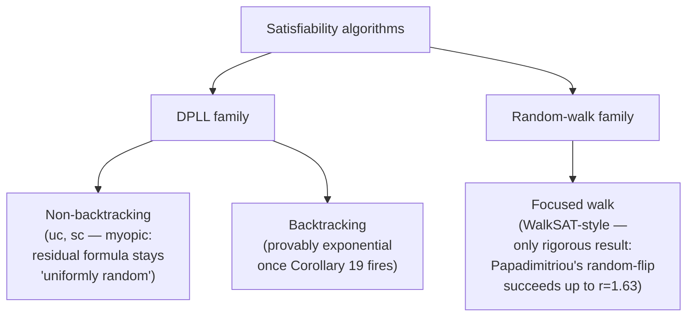

# Random Satisfiability and Phase Transitions

[[book-guidelines|↩ Back to guidelines]]

## Why study *random* formulas at all?

Every SAT solver you build gets benchmarked on two very different kinds of instances: structured ones that come from real encodings (hardware, planning, your future CSP kernel's verification conditions), and *random* ones, generated by flipping coins. Structured instances are what you actually care about solving. So why does an entire chapter — an entire research area — exist around instances nobody asked for?

Because random instances are the only place where you can *ask and answer* a question that structured instances make impossible: "as instances of a fixed kind get harder, exactly how much harder, and why?" With a real-world CNF encoding of a program's verification condition, you have one instance, shaped by whatever program you happened to write. With random $k$-CNF you have a *family*, parameterized by a single dial — how many clauses per variable — and you can ask what happens to satisfiability, to proof length, to solver runtime, as you turn that dial. That turns "SAT is hard" from a slogan into something you can actually chart, and, as this chapter shows, into a phenomenon with the same mathematical shape as a physical phase transition.

This matters directly for a CSP/CEGAR kernel: if you ever need to *stress-test* your solver, generate adversarial instances, or reason about why your counterexample search suddenly stalls, you want to know whether you've wandered into a genuinely hard regime (an algorithmic barrier, discussed below) or just hit a bad heuristic choice. Random $k$-SAT is where that distinction was first made precise.

## 1. Random $k$-CNF formulas and the clause-to-variable ratio

**The model.** Let $F_k(n,m)$ denote a Boolean CNF formula built from $m$ clauses over $n$ variables, where the clauses are chosen uniformly, independently, and without replacement among all $2^k\binom{n}{k}$ *non-trivial* $k$-clauses (i.e. clauses with $k$ distinct, non-complementary literals). Nothing here is exotic: you're literally sampling $m$ random $k$-literal disjunctions.

The chapter fixes two pieces of probabilistic vocabulary you'll see everywhere in this literature:
- **w.h.p.** ("with high probability"): $\lim_{n\to\infty}\Pr[E_n] = 1$.
- **w.u.p.p.** ("with uniformly positive probability"): $\liminf_{n\to\infty}\Pr[E_n] > 0$.

The single most important design decision in this whole area is *what you hold fixed as $n\to\infty$*. Two early results pin down the interesting regime:
- If $r = m/n \ge 2^k\ln 2$, then $F_k(n, rn)$ is w.h.p. **unsatisfiable** (Franco–Paull, via a union bound argument).
- If $r < 2^k/k$, a very simple algorithm finds a satisfying assignment **w.u.p.p.** (Chao–Franco).

So $m = \Theta(n)$ — a *constant clause-to-variable ratio* $r$ — is the only regime where satisfiability is genuinely uncertain; below it formulas are trivially satisfiable, above it (roughly) trivially unsatisfiable. Everything else in the chapter lives inside this window.

**What breaks without fixing $r$.** If you instead let $m$ grow super-linearly in $n$ (say $m = n^2$), the union bound above crushes satisfiability to zero exponentially fast and there's no interesting threshold behavior to study — you've left the "phase transition" regime entirely. Conversely with $m = o(n)$, satisfiability is essentially guaranteed by sparsity alone. The ratio $r$ is precisely the control parameter that makes the family behave like a physical system with a genuine transition, rather than a degenerate limit.

```rust
/// A random k-CNF instance F_k(n, m), literals encoded as i32
/// (positive = variable id, negative = its negation).
struct RandomKCnf {
    n: usize,
    k: usize,
    clauses: Vec<Vec<i32>>,
}

impl RandomKCnf {
    /// Sample F_k(n, r*n) — clause-to-variable ratio r is the single dial
    /// that separates the "trivially SAT" / "trivially UNSAT" / "hard" regimes.
    fn sample(n: usize, k: usize, r: f64, rng: &mut impl rand::Rng) -> Self {
        use rand::seq::SliceRandom;
        let m = (r * n as f64).round() as usize;
        let mut clauses = Vec::with_capacity(m);
        while clauses.len() < m {
            // choose k distinct variables, then a random polarity for each
            let mut vars: Vec<usize> = (1..=n).collect();
            vars.shuffle(rng);
            let clause: Vec<i32> = vars[..k]
                .iter()
                .map(|&v| if rng.gen_bool(0.5) { v as i32 } else { -(v as i32) })
                .collect();
            clauses.push(clause); // uniqueness-without-replacement elided for brevity
        }
        RandomKCnf { n, k, clauses }
    }
}
```

This is the object every later section refines or attacks. Note also (Section 10.6 of the source) that whether clauses are chosen *with* or *without* replacement, and whether they're ordered tuples or sets, is essentially irrelevant to monotone properties like satisfiability as long as $m = O(n)$ — a useful fact, since it means the cleanest model to *prove things about* (with replacement) and the cleanest model to *sample* are interchangeable for this chapter's purposes.

## 2. The Satisfiability Threshold Conjecture

Kirkpatrick and Selman's 1994 finite-size-scaling analysis of Mitchell–Selman–Levesque's experiments gave the field its defining picture, for $k=3$: for $r < 4$ almost all formulas are easily satisfiable; for $r > 4.5$ almost all are unsatisfiable; and at $r \approx 4.2$ roughly half the formulas are satisfiable *and* the computational effort to decide them peaks. This is the "phase transition" the chapter title promises — and it's genuinely analogous to a physical phase transition (like ice melting at a sharp temperature), not just a metaphor.

This observation crystallizes into:

> **Satisfiability Threshold Conjecture.** For every $k\ge 3$, there exists a constant $r_k>0$ such that
> $$\lim_{n\to\infty}\Pr[F_k(n,rn)\text{ is satisfiable}] = \begin{cases}1, & r<r_k\\ 0, & r>r_k.\end{cases}$$

**This is still open.** What *is* proven — Friedgut's theorem — is weaker but still very useful:

> **Theorem (Friedgut).** For every $k\ge3$ there exists a *sequence* $r_k(n)$ such that for any $\epsilon>0$, $\lim_{n\to\infty}\Pr[F_k(n,m)\text{ sat}] = 1$ if $m=(r_k(n)-\epsilon)n$ and $=0$ if $m=(r_k(n)+\epsilon)n$.

The gap between conjecture and theorem is exactly the gap between "a sharp threshold exists" (proven) and "that threshold converges to a single constant $r_k$ as $n\to\infty$" (believed, not proven). A useful corollary of Friedgut's theorem lets you convert a *w.u.p.p.* satisfiability result at density $r^*$ into a *w.h.p.* satisfiability result at every $r<r^*$ — this is the bridge that makes the second-moment method (Section 3) actually pin down a piece of $r_k$'s location rather than just a probabilistic curiosity.

The best rigorous bounds known are $2^k\ln 2 - \Theta(k) \le r_k \le 2^k\ln2-\Theta(1)$, tabulated for small $k$:

| $k$ | Best upper bound | Best lower bound | Algorithmic lower bound |
|---|---|---|---|
| 3 | 4.51 | 3.52 | 3.52 |
| 4 | 10.23 | 7.91 | 5.54 |
| 5 | 21.33 | 18.79 | 9.63 |
| 7 | 87.88 | 84.82 | 33.23 |
| 10 | 708.94 | 704.94 | 172.65 |
| 20 | 726,817 | 726,809 | 95,263 |

The third row — the largest density at which *any known efficient algorithm* is proven to succeed — is where the chapter's real drama lives: it diverges sharply from the threshold as $k$ grows. That gap is the **algorithmic barrier**, covered in Section 4.

The book also coins a useful term: **presults** ("physics results"), for claims that combine rigorous mathematics with unproven-but-physically-motivated assumptions. You'll see this word recur constantly — it's the field's honest label for "we believe this, statistical physics predicts it, nobody has proven it yet."

## 3. The second moment method and balanced satisfying assignments

Here's the "what breaks without this" story that motivates the whole method. The obvious way to lower-bound $\Pr[X>0]$ (where $X$ counts satisfying assignments) is the second-moment inequality: for any non-negative random variable, $\Pr[X>0] \ge \mathbb{E}[X]^2/\mathbb{E}[X^2]$. If $\mathbb{E}[X^2]$ is close to $\mathbb{E}[X]^2$, you get a strong existence proof — *without ever exhibiting a solution.* This is the method's superpower: it proves solutions exist at densities where **no algorithm is known to find one**, because it reasons about aggregate statistics of the whole solution space, not about any particular assignment.

**Why it fails naively.** Computing $\mathbb{E}[X^2]$ decomposes into a sum over *pairs* of assignments, weighted by how likely both satisfy the formula, as a function of their Hamming agreement $z=\alpha n$:
$$\mathbb{E}[X^2] = \sum_{z=0}^n 2^n\binom{n}{z} f_S(z/n)^m, \qquad f_S(\alpha) = 1-2^{1-k}+2^{-k}\alpha^k.$$
Writing $\Lambda_S(\alpha) = \big(2\,f_S(\alpha)\big)^r / \big(\alpha^\alpha(1-\alpha)^{1-\alpha}\big)$, one gets $\mathbb{E}[X^2] \approx \left(\max_\alpha \Lambda_S(\alpha)\right)^n$ while $\mathbb{E}[X]^2 = \Lambda_S(1/2)^n$. Since $f_S$ is *increasing*, the maximum of $\Lambda_S$ sits at some $\alpha>1/2$, not at $1/2$ — so $\mathbb{E}[X^2]$ is *exponentially* bigger than $\mathbb{E}[X]^2$, and the naive bound on $\Pr[X>0]$ collapses to exponentially small. Intuitively: pairs of satisfying assignments that agree on *more* than half their variables (i.e. lean toward some majority vote) are wildly over-represented in $X^2$, because "agreeing more" correlates with "both more likely satisfying" — and that correlation is exactly what a second-moment bound can't tolerate.

**The fix: restrict to balanced assignments.** Achlioptas and Peres's key idea was to run the same argument not over *all* satisfying assignments, but only over **balanced** ones — those whose number of satisfied literal occurrences is $km/2 \pm O(\sqrt m)$, i.e. statistically indistinguishable from a uniformly random assignment's literal-satisfaction count. Formally: pick a weighting function $w(\sigma,c)$ over (assignment, clause) pairs, apply the second moment method to $X=\sum_\sigma\prod_c w(\sigma,c)$ instead of the plain satisfying-assignment count, and the correlation term $f_w$ is uncorrelated at distance $n/2$ *for any* $w$ — the condition for success becomes the purely combinatorial requirement
$$\sum_{v\in\{-1,+1\}^k} w(v)\,v = 0,$$
i.e. the weighted votes over all sign patterns of a clause must cancel. The plain satisfiability indicator fails this (the all-false pattern has weight $0$, everything else weight $1$ — no cancellation). Balancing fixes it: for balanced $X$, $\mathbb{E}[X^2] < C\cdot\mathbb{E}[X]^2$ for a $k$-dependent constant $C$ independent of $n$, giving $\Pr[X>0]\ge 1/C$ and, via Friedgut's corollary, $r_k \ge s_k$ where $s_k = 2^k\ln2 - (k+1)\tfrac{\ln2}{2}-1-o(1)$ — the chapter's rigorous *lower bound* on the threshold.

```python
# Illustrative sketch of Lambda_S(alpha) — why the naive (unbalanced) second
# moment method fails: its maximizer sits away from alpha = 1/2.
import numpy as np

def f_S(alpha, k):
    return 1 - 2**(1-k) + 2**(-k) * alpha**k

def entropy(alpha):
    if alpha in (0.0, 1.0):
        return 1.0
    return alpha**alpha * (1 - alpha)**(1 - alpha)

def Lambda_S(alpha, k, r):
    return (2 * f_S(alpha, k))**r / entropy(alpha)

k, r = 3, 3.0
alphas = np.linspace(0.5, 0.999, 500)
vals = [Lambda_S(a, k, r) for a in alphas]
argmax_alpha = alphas[int(np.argmax(vals))]
print(argmax_alpha, Lambda_S(0.5, k, r))
# argmax_alpha > 0.5 confirms: unbalanced E[X^2] blows past E[X]^2.
```

**Why this matters beyond SAT.** This is the field's cleanest example of a *non-constructive existence proof for a combinatorial search problem* — you prove solutions exist by reasoning about the shape of the whole solution space, with zero information about how to find one. That's a genuinely different epistemic move than anything a CDCL solver or a CEGAR loop does (both of which are fundamentally *constructive*: they either build a satisfying assignment or a refutation/counterexample). Keep this method in your toolbox distinctly from proof-search machinery — it answers "does *a* solution exist," never "here is one," and that gap is precisely what makes the *algorithmic barrier* in the next section a real, structural phenomenon rather than a mere failure of cleverness.

## 4. The algorithmic barrier below the satisfiability threshold

This is the chapter's central tension, and it has two independent supports: a geometric picture of *why* solutions become hard to find, and hard theorems showing that *specific, natural algorithms* provably fail below the threshold.

### 4.1 Solution-space geometry: shattering, condensation, frozen variables

Define two assignments as **adjacent** if they differ in one variable; a **cluster** is a connected component of the set of satisfying assignments $S(F)$ under this adjacency; a **region** is any non-empty union of clusters. Statistical physics (rigorously confirmed for $k\ge8$ by Achlioptas–Coja-Oghlan) predicts:

```mermaid
graph LR
    A["Low density:<br/>one giant cluster"] -->|density ln k · 2^k/k| B["Dynamical transition:<br/>shatters into exponentially<br/>many tiny, far-apart clusters"]
    B -->|density 2^k ln2 − Θ(1)| C["Condensation transition:<br/>nearly all solutions collapse<br/>into a few large clusters"]
    C -->|density r_k| D["Threshold:<br/>no solutions"]
```

At the **dynamical transition** (density $\sim \ln k \cdot 2^k/k$), $S(F)$ shatters into $2^{\Theta(n)}$ regions, each an exponentially small slice of the whole, pairwise separated by Hamming distance $\Omega(n)$, with every connecting path forced through assignments violating $\Omega(n)$ clauses (a "huge energy barrier" — the solution-space geometry starts to look like an error-correcting code: isolated codewords with a little fuzz around each). Almost immediately after, a constant fraction of variables become **frozen** — take the same value in every solution *within their cluster* — so even getting one variable wrong means an exponential-distance walk to fix it. This regime persists up to the **condensation transition** near $2^k\ln2 - \tfrac{1+\ln2}{2}$, just short of the (conjectured) threshold, where solutions concentrate into a finite number of atypically large clusters.

**The punchline the chapter draws explicitly:** to the extent random-$k$-SAT is hard, the hardness comes from phase transitions in *solution-space geometry*, not from the threshold in the *probability of satisfiability* — those are two different transitions, at two different densities, and conflating them is a common mistake.

### 4.2 The barrier, concretely

The remarkable empirical fact: the dynamical (shattering) transition density, $\sim\ln k\cdot 2^k/k$, coincides almost exactly with the density at which *every known efficient algorithm* stops finding solutions ($c_A\cdot 2^k/k$ for algorithm-dependent constant $c_A$). No natural upper bound on $c_A$ is known — smarter algorithms buy a bigger constant, with rapidly diminishing returns. This is the **algorithmic barrier**, and it is currently *open* whether it is fundamental (no efficient algorithm can ever cross it) or an artifact of the algorithms analyzed so far — precisely the kind of "presult vs. theorem" gap flagged in Section 2.

### 4.3 Why backtracking search actually fails: proof complexity as the mechanism

This is the part with the sharpest implications for anyone building a solver. Chvátal–Szemerédi showed random $k$-CNF formulas ($k\ge3$) w.h.p. require **exponential-size resolution refutations**:

$$\text{Theorem: } \forall k\ge3,\ \forall r>0,\ \text{w.h.p. } \mathrm{res}(F_k(n,rn)) = 2^{\Omega(n)}.$$

Since any DPLL search tree on an unsatisfiable formula *is* a resolution refutation (same tree, same inferences), this instantly gives: **every DPLL algorithm w.h.p. takes exponential time on $F_k(n,rn)$ above the threshold.** That's [[Proof-Complexity|proof complexity]] — a purely static property of the formula — directly forcing an algorithmic lower bound, with zero reference to any particular heuristic.

The sharper, more surprising result concerns *satisfiable* instances, via mixed $(2+p)$-CNF formulas (a mix of random 2- and 3-clauses). Since $r_2=1$ (random 2-SAT's own threshold) but adding 3-clauses barely moves that threshold (Achlioptas–Kirousis–Kranakis–Krizanc: satisfiable w.h.p. with up to $\Delta n$ extra 3-clauses for $\Delta\le2/3$), you get:

$$\text{Theorem 9: for any } r,\epsilon>0,\ F = (1-\epsilon)n\text{ 2-clauses} + rn\text{ 3-clauses} \Rightarrow \text{w.h.p. } \mathrm{res}(F)=2^{\Omega(n)}.$$

Now [[Runtime-Variation-and-Solver-Engineering#The mechanism|the mechanism]]: many natural DPLL algorithms, run on a satisfiable random 3-CNF formula, generate at least one **unsatisfiable residual subproblem** along the way — a random mixture of clause lengths whose 2-clause part alone is satisfiable. Theorem 9 says resolving *that* subproblem (i.e. backtracking out of it) costs exponential time regardless of how good the rest of the algorithm is:

> **Corollary 19.** If a DPLL algorithm ever generates a residual formula that is an unsatisfiable mixture of uniformly random clauses whose 2-clause density is below 1, then w.h.p. it spends exponential time before backtracking out of it.

Concretely: `uc` (unit-clause propagation, no backtracking) started above 3.81 random 3-clauses per variable, or the "shortest-clause" heuristic `sc` above 3.98, provably generates exactly such a trap. This is the theorem that debunks the naive "easy–hard–easy" folklore around the 4.2 threshold: exponential behavior sets in *well below* the conjectured satisfiability threshold, not at it. For $k>3$, the analogous Theorem 21 gives explicit densities (e.g. $k=4$, $r\ge7.5$) that are *provably* in the satisfiable regime yet still force exponential-time `ordered-dll`.

**Why this generalizes past this one chapter.** The proof of Theorem 9 is robust to the exact clause distribution — the essential ingredient is that the variable–clause incidence graph is an *expander*. That's a purely structural, combinatorial condition, not a random-formula-specific one. It's the same reason random restarts don't help much here (an expander's combinatorial richness means different runs of a deterministic-ish backtracking search on the same formula tend to hit similarly-structured traps) but *can* help on structured instances with exploitable heavy-tailed runtime variation (Chapter 11's topic).

### 4.4 Non-backtracking and random-walk algorithms

The chapter's algorithmic taxonomy is worth internalizing as a checklist for evaluating any CDCL-adjacent design:



The **`uc`** algorithm (repeatedly satisfy unit clauses; else assign a random unset variable a random value) is analyzable because of a clean invariant: at every step, the *not-yet-assigned* portion of the formula is distributed exactly as a fresh random formula on the remaining variables (proved via a "card game" / deferred-decisions argument, or equivalently a uniformly random matching between literal occurrences and clause slots). This "myopic" property — residual formula stays uniformly random conditional only on clause-length counts — is exactly what makes rigorous analysis of `uc`, and refinements like the "shortest-clause" algorithm `sc`, possible at all: `sc` picks a random *minimum-length* clause and satisfies a random literal in it, currently giving the best proven algorithmic lower bound for $k>3$ ($r_k \ge \gamma_k\, 2^k/k$, $\gamma_k\to1.817$).

Belief/Survey Propagation (Mézard–Parisi–Zecchina) is a message-passing heuristic aimed specifically at the condensation regime, where long-range correlations defeat simple local reasoning. But Montanari–Ricci-Tersenghi–Semerjian showed (under standard physics assumptions) that even "set one variable via its Belief-Propagation marginal, repeat" fails once density exceeds $\ln k\cdot2^k/k$ — i.e. **survey propagation does not cross the algorithmic barrier either.** The barrier is not an artifact of any one algorithm family; it appears to be a structural property of the shattered solution-space geometry itself.

## Where this leads

Structurally, this chapter sits between the purely syntactic machinery of resolution/proof-complexity (Chapter 7) and two directions the book takes next: Chapter 11 (runtime variation and restarts — the flip side of the expander-hardness observation above) and Part 2's Chapter 22, [[Statistical-Physics-of-Random-Constraint-Satisfaction|Statistical Physics of Random Constraint Satisfaction]] (the statistical-physics treatment in full, of which this chapter's "presults" are the rigorous-math-compatible fragment).

For the compiler/CSP-kernel project, three connections are worth keeping explicit:

- **Corollary 19 and the expander argument are a template for reasoning about your own CSP kernel's backtracking search.** Whenever your counterexample search (over integer/non-linear domains, or DFA-shaped abstract domains) hits a subproblem whose "easy" part alone is unsatisfiable-in-miniature, expect a similar exponential trap — this is a general phenomenon about backtracking over expander-like constraint graphs, not a SAT-specific curiosity.
- **The second moment method is a genuinely different proof style from anything CEGAR does.** CEGAR is relentlessly constructive: refine until you either build a proof or exhibit a concrete counterexample. The second moment method proves existence of a satisfying assignment (or here, of clusters, of frozen-variable structure) with *no* construction at all. Recognizing when a "does a solution exist" question can be answered this way — versus needing an actual witness — is a useful architectural distinction when you're deciding whether a sub-analysis needs your CSP kernel at all or just a counting/probabilistic argument.
- **The dynamical/condensation transition picture is the rigorous ancestor of "clause-learning helps because it exploits solution-space structure."** When you eventually tune your own solver's heuristics, this chapter is the place that explains, precisely, why *some* instances are inherently resistant to any local-search-plus-marginal-estimation strategy (frozen variables, energy barriers) — a useful sanity check before concluding a slow instance in your own toolchain is "just a bad heuristic choice."
