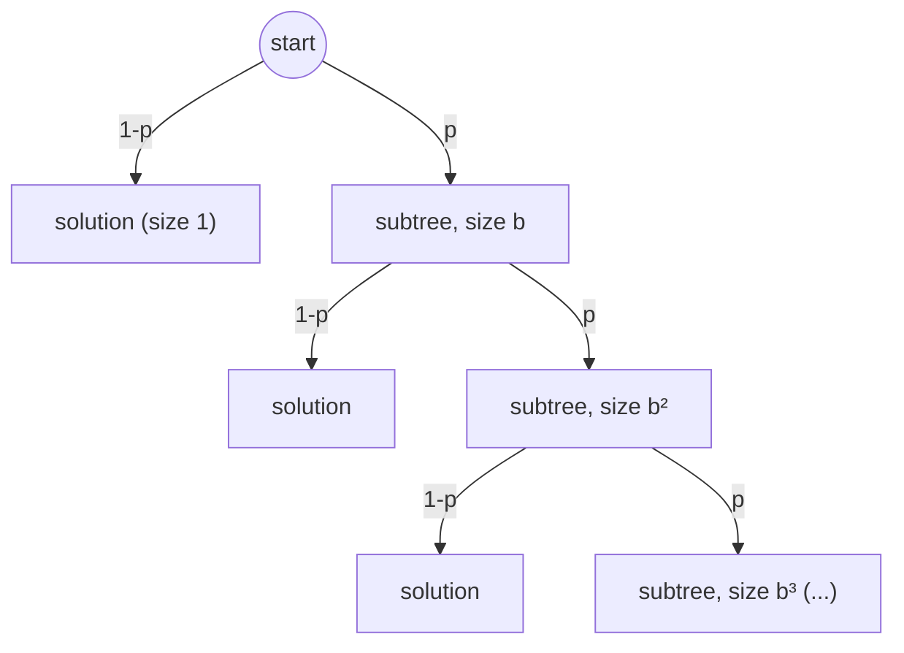
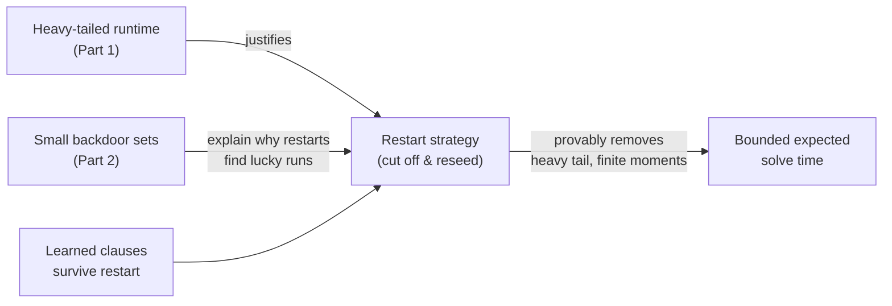
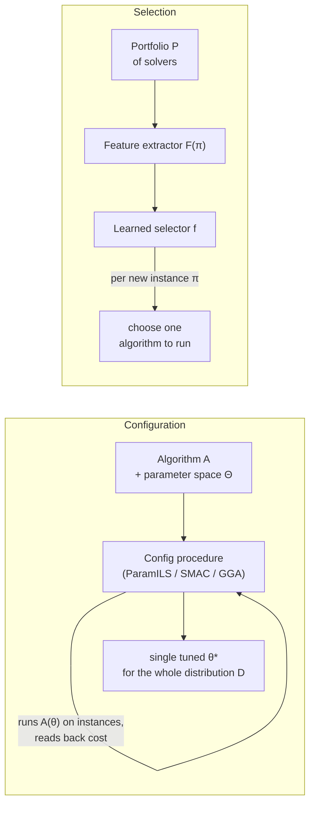

# Runtime Variation and Solver Engineering

[[book-guidelines|↩ Back to guidelines]]

## Why this chapter exists: the same solver, the same instance, wildly different answers

Here is the phenomenon that motivates everything below. Take a backtrack-style complete SAT solver. Fix the instance. Change nothing about the algorithm except which variable it happens to branch on next when several look equally good — break the tie a different way, or just reseed the pseudo-random generator. Sometimes the solver finishes in milliseconds. Sometimes it doesn't finish in the time you're willing to wait. Same problem, same solver, wildly different outcomes, and the variation isn't measurement noise — it can be so extreme that the *expected* runtime is mathematically infinite.

This is not a bug to be engineered away. It is a structural property of tree-shaped combinatorial search, and once you understand *why* it happens, it turns from a stumbling block into three of the most load-bearing engineering ideas in modern SAT solving: **restarts**, the exploitation of **backdoor sets**, and — one level up — **automated configuration and per-instance selection**, which stop tuning a solver by hand and instead treat "which heuristic, which parameters, which solver" as an optimization problem to be solved by another algorithm. If you are building a CSP kernel that searches for counterexamples against type or contract invariants, this chapter is describing exactly the search-engineering problems you will hit: your backtracking search over concrete assignments will exhibit the same heavy tails, and the same fixes apply.

## Part 1: Heavy-tailed and fat-tailed runtime distributions

### What breaks without a formal model of "sometimes it hangs forever"

If you only look at the mean and variance of solver runtime across many runs, you get a badly misleading picture, because for many complete search algorithms those moments don't behave the way they do for familiar distributions. A Gaussian's variance is *bounded* — points far from the mean are astronomically unlikely. The runtime of a randomized backtrack search on a hard instance can have **infinite variance, and sometimes infinite mean**. Researchers noticed this indirectly first: certain instances in the *under-constrained* region (where almost everything is satisfiable) turned out to be harder for a *particular* solver and variable-naming than even the hardest instances at the satisfiability phase transition — so-called "exceptionally hard" instances (Hogg–Williams, Gent–Walsh). Later work showed the hardness wasn't in the instance at all: rename the variables, or change the search heuristic, and the instance becomes easy. The difficulty lived in the *interaction* between a fixed heuristic and a fixed instance, not in either alone. This is why the field reports **median**, not mean, runtime — the mean is dominated by a few catastrophic outliers and is practically useless as a summary statistic.

### Fat-tailed vs. heavy-tailed, precisely

The book is careful to distinguish two related but different notions:

- **Fat-tailed (leptokurtic):** based on kurtosis, $\mu_4/\mu_2^2$ (fourth central moment over the squared variance). The standard normal has kurtosis 3; a distribution with kurtosis above 3 has a higher peak and longer tails than Gaussian — exponential, log-normal, and Weibull distributions are examples. All moments are still finite.
- **Heavy-tailed:** strictly stronger. A random variable $X$ is heavy-tailed if its tail obeys **Pareto-like decay**:

$$
1 - F(x) = \Pr[X > x] \sim C x^{-\alpha}, \qquad x > 0,
$$

where $\alpha > 0$ is the **index of stability**. This single parameter tells you exactly which moments exist: $\alpha = \inf\{r > 0 : \mathbb{E}[X^r] = \infty\}$, so every moment of order strictly less than $\alpha$ is finite and every moment of order $\ge \alpha$ is infinite. Concretely: $1 < \alpha < 2$ gives infinite variance but finite mean; $0 < \alpha \le 1$ gives infinite mean *and* variance. On a log-log plot of the survival function $1 - F(x)$, a heavy-tailed distribution shows *linear* decay (slope $-\alpha$) over many orders of magnitude, in contrast to the faster-than-linear (concave) drop-off you'd see for an exponentially decaying tail. This log-log-linearity is the empirical fingerprint researchers actually check for.

Heavy-tailed distributions have a long, colorful pedigree outside CS — Pareto (income distribution), Lévy (stable distributions, initially dismissed as pathological curiosities), and Mandelbrot (fractals, who rehabilitated them as models of real phenomena: stock prices, Brownian motion, earthquakes, web latencies). SAT search inherited the same mathematics because the underlying mechanism — a small number of rare, catastrophically bad decisions multiplying an otherwise-modest cost — recurs across all of these domains.

### The imbalanced tree-search model: where the heavy tail actually comes from

The book gives a clean generative story for *why* backtrack search produces heavy tails. Model the branching heuristic as making a wrong decision with probability $p$; with probability $(1-p)$ it's guided straight to a solution. When it's wrong, it has to explore a subtree of size $b^i$ with probability $p^i(1-p)$ — i.e., each additional "mistake" multiplies the remaining search space by a constant factor $b \ge 2$. This is the **imbalanced tree model**.

Let $T$ be the number of leaf nodes visited up to and including the successful leaf. Then:

- If $bp \ge 1$: $\mathbb{E}[T] = \infty$ — the expected runtime itself is unbounded.
- If $bp < 1$: finite mean, $\mathbb{E}[T] = \frac{1-p}{1-pb}$.
- If $b^2 p > 1$: infinite variance; otherwise finite.

The intuition is a race between two exponentials pointed in opposite directions: the *cost* of an additional mistake grows geometrically ($b^i$), while the *probability* of that many consecutive mistakes shrinks geometrically ($p^i$). Whichever one wins determines whether you get a well-behaved distribution or a heavy tail. This is not a pathology specific to SAT — it's a structural property of any tree search whose branching heuristic is imperfect and whose bad branches are large. A **balanced** tree model (no such runaway multiplicative penalty) does *not* exhibit heavy-tailed behavior — the book contrasts the two directly (Figure 11.3): the imbalanced model's log-log survival curve stays linear across many orders of magnitude, the balanced model's drops off sharply. Real (finite, exponentially bounded) search spaces produce **bounded heavy-tailed distributions**: same power-law shape, but truncated at the exponential ceiling imposed by instance size, with an "infinite mean" translating into "a mean exponential in instance size."

**Why this matters for a CSP/CEGAR-style kernel:** if your counterexample search is a backtracking DFS over concrete variable assignments with a branching heuristic that isn't perfectly guided by the abstract domain, expect exactly this shape of runtime distribution once instances get hard — not a nice concentrated distribution around a "typical" cost.

## Part 2: Backdoor sets — why solvers sometimes get lucky

### The complementary insight

Heavy tails explain the catastrophic long runs. Backdoor sets explain the mirror-image phenomenon: why a solver *occasionally* solves a huge, complex instance in seconds. The idea: many instances have a small subset of variables such that, once those are fixed correctly, whatever remains collapses to something a cheap, polynomial-time sub-procedure can finish off. If the search stumbles onto this subset early and sets it right, the whole problem falls apart trivially — a "lucky" run.

### The formal machinery

The book grounds this in the notion of a **sub-solver**:

> **Definition 11.1.1.** A sub-solver $A$ is an algorithm that, given a Boolean formula $F$, satisfies:
> (i) **Trichotomy** — $A$ either rejects $F$, or correctly determines it (SAT with a witness, or UNSAT);
> (ii) **Efficiency** — $A$ runs in polynomial time;
> (iii) **Trivial solvability** — $A$ recognizes the trivially-true (no clauses) and trivially-false (empty clause) cases;
> (iv) **Self-reducibility** — if $A$ determines $F$, it also determines $F[v/x]$ for any variable $x$ and value $v$.

Examples: unit propagation, pure-literal elimination, a 2-CNF/Horn-SAT solver, arc consistency for CSPs — anything polynomial satisfying those four closure conditions.

> **Definition 11.1.2.** A nonempty subset $S$ of $F$'s variables is a **weak backdoor** for $F$ w.r.t. $A$ if there is *some* assignment $a_S : S \to \{0,1\}$ such that $A$ returns a satisfying assignment of $F[a_S]$. $S$ is a **strong backdoor** if for *every* assignment $a_S$, $A$ either returns a satisfying assignment or correctly concludes unsatisfiability of $F[a_S]$.

Weak backdoors are only meaningful for satisfiable formulas (you need *a* lucky assignment to exist); strong backdoors handle both SAT and UNSAT, because they require the sub-solver to correctly resolve *every* possible assignment to $S$, not just find one good one.

The complexity landscape here is genuinely subtle and worth internalizing if you're going to implement backdoor-style search yourself: Szeider showed that detecting a weak or strong backdoor of size $\le k$ for DPLL-style sub-solvers is unlikely to be fixed-parameter tractable, but Nishimura et al. showed that for Horn- or 2-CNF-based sub-solvers, detecting a *strong* backdoor is FPT while detecting a *weak* one is not — because strong-backdoor membership is a purely syntactic property (does the reduced formula fall in the tractable class?) while weak-backdoor membership additionally requires reasoning about satisfiability of the reduced formula, which is not syntactically checkable. This asymmetry — "does it land in my tractable fragment" being easy to check but "is the result actually satisfiable" being hard — is precisely the tension a CHC/Horn-clause-based invariant-generation kernel runs into: syntactic membership in a decidable fragment is cheap to check; semantic properties of what falls out of it are not.

### How small can backdoors get?

This is where the empirical result lands with real force. **Random** 3-SAT instances near the phase transition have backdoors that are a *constant fraction* (~30%) of all variables — no help there, which is part of why random hard instances have stayed hard for DPLL-style solvers. But **structured, real-world instances** can have startlingly small backdoors: a logistics-planning instance with nearly 7,000 variables was found to have a backdoor of just 12 variables (using the Satz solver's propagation as sub-solver). Hoffmann et al. proved strong backdoors of size $O(\log n)$ exist for entire families of logistics-planning and blocks-world instances. This is the real explanation for why modern solvers, which look nothing like brute-force search, can crack instances with millions of variables: the *effective* combinatorial content of a well-structured instance is often minuscule compared to its nominal size, and a search procedure only has to get lucky on that small set.

Finding the *minimum* backdoor is worst-case intractable, but you don't need the minimum — a bounded-size backdoor is often found in practice by ordinary randomization and restarts, without ever computing it explicitly. Williams, Gomes, and Selman formalized this in three escalating scenarios: (1) deterministic exhaustive search over candidate backdoor sets gives a provable complexity improvement once the backdoor is small enough; (2) a randomized search that repeatedly *guesses* candidate backdoor sets provably beats the deterministic exhaustive version; (3) adding a variable-selection heuristic that's actually correlated with the true backdoor narrows the search further — combined with restarts, this yields a polynomial-time solvable case whenever the backdoor has at most $O(\log n)$ variables. Scenario (3) is the closest match to what real, effective CDCL-style solvers are actually doing.

## Part 3: Restarts as the direct exploit of heavy tails

### The mechanism

A **restart** stops the current search and begins again from scratch with a different random seed (for clause-learning solvers, learned clauses survive the restart — the computational effort isn't fully wasted, it's converted into permanent facts about the formula). The logical connection to Parts 1–2 is now direct: if runtime is heavy-tailed, a sequence of many *short* independent runs stochastically dominates one long run, because each short run has a real (and not-that-small) chance of being one of the lucky ones that stumbles onto the backdoor early. Running longer just buys you deeper into the tail of a distribution that's already dominated by rare catastrophic outcomes.

The book's own numbers make this concrete (Figure 11.5, a QCP instance): with a total budget of 50 backtracks and *no* restarts, ~70% of runs fail to finish. Restarting every 4 backtracks drops that failure rate to ~10%. At a 150-backtrack budget, the restart strategy nearly always succeeds, while the no-restart baseline is *still* failing 70% of the time. A restart strategy with a fixed cutoff doesn't just help empirically — it provably **eliminates heavy-tailedness and produces finite moments** (Gomes, Selman, Crato, Kautz). The optimal fixed cutoff for real logistics-planning instances turned out to be surprisingly small (around 12 backtracks in one example) — tuning it correctly can shift solver performance by several orders of magnitude.

### Restart schedules: how aggressively should you cut?

If you know the runtime distribution exactly, Luby, Sinclair, and Zuckerman proved the optimal restart policy is a single **fixed cutoff**. With no prior knowledge of the distribution, they gave a **universal strategy**: run lengths that are powers of two, doubling the length only after a matched *pair* of runs at the current length has completed — the sequence $1, 1, 2, 1, 1, 2, 4, 1, 1, 2, 4, 8, \ldots$ (the now-standard "Luby sequence"). It's provably within a log factor of the best fixed cutoff, though it converges slowly in practice. Walsh's geometric restart strategy trades away Luby's worst-case guarantee for lower sensitivity to the specifics of the true distribution. Modern CDCL solvers, following Gomes et al. and starting with zChaff, universally combine restarts (typically a default cutoff that grows over time, to preserve completeness in the limit) with the retention of learned clauses across restarts — which is *also* why restarting a deterministic clause-learning solver still helps: the accumulated learned clauses guide the deterministic search down a genuinely different path each time, even without touching the random seed.

### Other places to inject randomization

The book surveys where else randomness can enter a backtrack search: variable-selection heuristic, value-selection heuristic, look-ahead procedures (propagation, failed-literal tests), and look-back procedures (which conflict clause to learn). The cheapest and most effective is **randomized tie-breaking**: when several choices score equally under the heuristic, pick uniformly at random among them rather than applying a fixed rule like lexicographic order — this alone can dramatically change behavior. A generalization introduces a **heuristic-equivalence parameter** $H$: treat all choices scoring within $H$ percent of the top score as "equally good" and randomize among that widened set, optionally with a non-uniform distribution biased toward the top. Crucially, none of this threatens completeness: bookkeeping tracks which assignments have already been tried at each stack position, so the search still never revisits explored territory — unlike local search, a randomized backtrack solver can still certify unsatisfiability.

## Part 4: Automated algorithm configuration and per-instance selection

### The problem one level up

Parts 1–3 are about *how* to search once you've picked a solver and its heuristics. Chapter 12 asks a different question: given that no single SAT solver dominates across all instance types — different heuristics are good for different structural families — how do you *choose* the heuristics, parameters, or even the whole solver, without a human manually tuning by trial and error? Two distinct meta-algorithmic problems fall out of this:

**Algorithm configuration.** Given an algorithm $A$ with parameter space $\Theta = \Theta_1 \times \cdots \times \Theta_n$, a distribution $D$ over problem instances $\Pi$, and a cost metric $c : \Theta \times \Pi \to \mathbb{R}$, find $\theta \in \Theta$ minimizing expected cost. In the common case where $D$ is uniform over a fixed finite set $\{\pi_1, \ldots, \pi_k\}$, this reduces to minimizing the **blackbox function** $f(\theta) := \frac{1}{k}\sum_i c(\theta, \pi_i)$ — "blackbox" because $f$ can only be *evaluated*, by actually running $A$ with configuration $\theta$ on instance $\pi_i$; there's no closed form to differentiate or reason about analytically. Parameters can be real, integer, or categorical, can be **conditional** on other parameters (a heuristic's own sub-parameters are meaningless unless that heuristic is switched on), and certain combinations can be outright **forbidden**.

**Per-instance algorithm selection.** Given a fixed **portfolio** $P$ of algorithms, a distribution $D$ over instances, and cost metric $c : P \times \Pi \to \mathbb{R}$, construct a selector $f : \mathbb{R}^\phi \to P$ that, given a $\phi$-dimensional feature vector $F(\pi)$ computed cheaply from a new instance $\pi$, picks which portfolio member to run. This has an offline training phase (build $f$ from historical performance + feature data, typically via supervised regression/classification) and an online use phase (extract features from a new instance, apply $f$, run the chosen algorithm).

The unifying design philosophy the chapter names explicitly is **Programming by Optimization (PbO)**: instead of an algorithm designer minimizing the number of exposed parameters (the traditional instinct — fewer knobs, simpler mental model), *maximize* the number of plausible design decisions expressed as parameters, and let an automated configurator, not a human, decide which setting wins. This directly generalizes the "expose everything as a parameter, evaluate empirically rather than by hand" instinct that a serious CSP/CHC solver implementation will eventually need — e.g. which propagation order, which restart schedule, which lattice-widening heuristic, decided by measurement rather than intuition.

### Configuration procedures, in increasing sophistication

- **ParamILS.** The first practical general-purpose configurator, built on iterated local search: start from a default configuration, compare against random configurations, then locally perturb one parameter at a time, keeping only improvements; escape local minima by randomly perturbing several parameters, occasionally restarting from a fresh random point; track the best-so-far **incumbent**. Two variants differ in how many runs justify trusting a configuration's estimated cost: **BasicILS** uses a fixed run count per configuration (can waste time on clearly-bad configurations); **FocusedILS** starts with one run and only grows the evaluation budget for configurations that keep beating the incumbent, allocating most of the budget to promising candidates while keeping incumbent estimates statistically solid. Both benefit from **adaptive capping**: if configuration $\theta_1$ already solved an instance in time $t_1$, there's no need to let $\theta_2$ run past $t_1$ on the same instance — you don't need to know exactly how bad $\theta_2$ is, only that it's worse. ParamILS delivered a 500× PAR-10 improvement on the Spear SMT solver (winning a QF_BV SMT-COMP category) and a 1.4× geometric speedup tuning Knuth's sat13 solver, evaluated on instances up to three orders of magnitude harder than the training set.
- **GGA / GGA++.** A genetic algorithm over configurations, using "gender" to balance population diversity against fitness, with an adaptive-capping variant that runs several candidates in parallel and kills the losers once the first succeeds. GGA++ swaps in random-forest-based performance prediction, borrowing SMAC's model-based idea.
- **SMAC (Sequential Model-based Algorithm Configuration).** Effectively replaces ParamILS's local-search step with a learned **empirical performance model**: fit a probabilistic regression model (commonly a random forest — handles mixed categorical/continuous parameters cheaply, doubles as an automatic feature selector, tolerates heteroscedastic noise) to performance data gathered so far, use an **acquisition function** to balance exploration (regions the model is uncertain about) against exploitation (regions predicted to be fast), evaluate the resulting candidates against the incumbent using the same adaptive-capping machinery as FocusedILS, repeat until budget exhausted. Across 17 benchmark scenarios, SMAC beat ParamILS in 11/17 and GGA in 13/17. Its highest-stakes deployment: the 2016–17 FCC Incentive Auction for radio spectrum repacking (over $10 billion in spectrum transacted), where SMAC-configured portfolios raised the fraction of instances solved within a minute from ~80% to over 96%, translating into an estimated $700M+ in direct cost savings.
- **iRace.** Races candidate configurations against each other one instance at a time, statistically dropping dominated candidates; builds one-dimensional density estimates per parameter from the surviving evaluations and progressively narrows ("volume reduction") the sampling distribution toward the best-performing region.
- **Structured Procrastination / LeapsAndBounds / CapsAndRuns.** A different lineage focused on *provable* worst-case guarantees rather than best-effort empirical performance: SP is the first configurator with nontrivial theoretical guarantees for average-runtime minimization under adversarial assumptions, but is impractically slow because it insists on a fine-grained understanding of every configuration even in easy cases; its descendants relax this to retain guarantees while improving practical performance, at some cost to how thoroughly they've been evaluated.

The **Configurable SAT Solver Challenge (CSSC)** validated all of this empirically: automated configuration produced orders-of-magnitude speedups (clasp's PAR-10 improved 705 → 5 on one benchmark family), *reshuffled solver rankings* entirely (1st/2nd/3rd-place default-parameter solvers fell to 6th/4th/5th after configuration — meaning a solver's raw design matters less than whether it exposes enough tunable structure), and larger configuration spaces demanded proportionally larger configuration budgets to pay off.

### Per-instance selection: SATzilla

Where configuration finds one $\theta^*$ good on average across a whole distribution, per-instance selection can do strictly better by choosing *differently* per instance. **SATzilla** — the first algorithm-selection system entered into a SAT competition (2003) — computed up to 84 cheap structural features per instance, trained independent regression models predicting each portfolio solver's runtime from those features, and picked whichever solver's predicted time was lowest; a 2004 addition, a fast local-search **pre-solver**, short-circuited the whole pipeline for instances easy enough to solve before feature extraction even finished paying for itself. The general pattern — **pre-solving schedule** (cheap algorithms run first, in case the instance is trivial) plus **backup solver** (a fallback when feature computation itself fails) wrapped around a learned per-instance selector — recurs across the field and is the shape you'd want for any real production dispatcher over a solver portfolio.

## Where this leads

Structurally, this topic sits at a hinge point in the book: it *presupposes* the search machinery of complete solvers, restarts, and branching heuristics developed in earlier chapters (DPLL, CDCL, branching heuristics), and it *feeds forward* into the book's later material on parallel portfolios, symmetry breaking, and preprocessing — all of which are, in essence, more elaborate answers to the same "how do you exploit runtime variation" question. It also explains, retroactively, *why* restarts and randomized tie-breaking appear as unexplained ingredients in the CDCL chapter: they are not arbitrary engineering tricks, they are the direct, provable consequence of the heavy-tailed nature of backtrack search.

For the compiler/verifier project: this chapter is a direct blueprint for engineering your own CSP kernel's search. Expect your counterexample search over concrete assignments to be heavy-tailed once instances get nontrivial — which means restarts (with learned-clause-style information retained across them) are not optional polish, they're close to mandatory for bounded expected cost. The backdoor-set idea maps onto invariant generation directly: if a small subset of program variables (loop counters, size fields) determines the rest of a verification condition's structure, your CSP kernel's job is effectively to *find that subset* via search, not to reason about the full variable set uniformly — this is the same "effective combinatorial content is much smaller than nominal size" phenomenon that makes real logistics instances tractable despite thousands of variables. And Part 4's meta-algorithmic framing — expose your propagation order, widening heuristics, and restart schedule as parameters, then tune or select among them automatically (PbO) rather than hand-picking defaults — is a concrete, empirically-validated alternative to manually guessing which lattice-widening or CHC-solving strategy will generalize across the programs your verifier will actually see.
