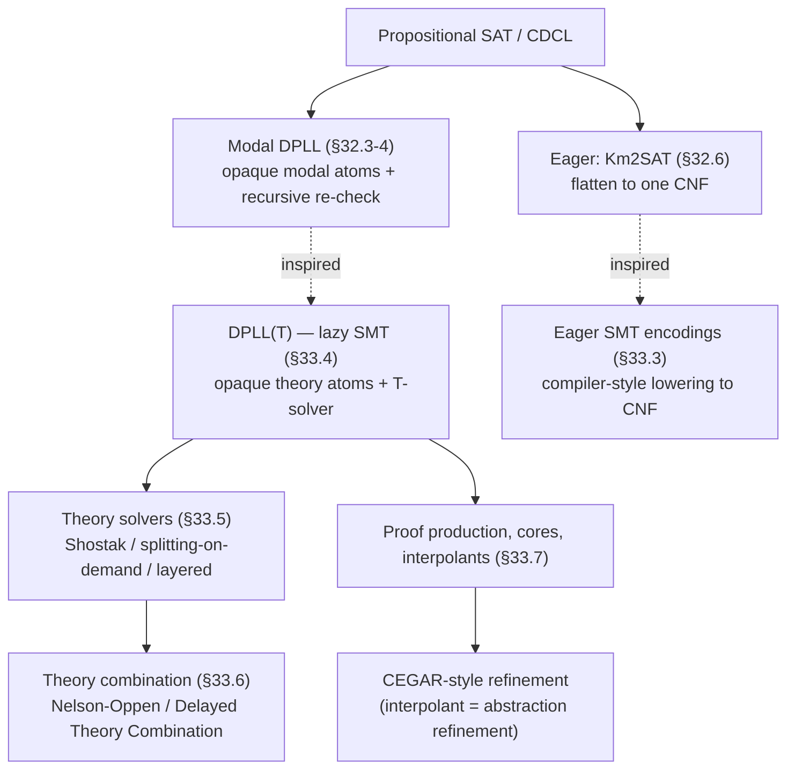

# SAT Techniques for Richer Logics

[[book-guidelines|↩ Back to guidelines]]

## Why SAT alone isn't the whole story

Propositional logic is expressive enough to be NP-complete, but it is *not* expressive enough to say most of the things a verification engineer, a knowledge-base designer, or a type-checker actually wants to say. "Necessarily, if the elevator door is open the elevator is stationary" needs a modal operator. "Agent 1 knows that agent 2 knows $\varphi$" needs nested modalities. "If `x < y` and `y < z + 1` then `x != z`" needs linear arithmetic. None of this is propositional — and yet none of it needs the full, undecidable power of first-order logic either. Both fields covered in this note answer the same underlying question with the same underlying trick: *take a satisfiability problem whose logic is richer than propositional logic, but decidable, and get it solved by leaning as hard as possible on a modern, highly-optimized DPLL/CDCL engine rather than reinventing search from scratch.*

Chapter 32 asks this question for **modal logic** ($K_m$) and its twin, **description logic** ($\mathcal{ALC}$). Chapter 33 asks it for **first-order theories with a fixed intended interpretation** — arithmetic, arrays, bit-vectors, uninterpreted functions — under the name **Satisfiability Modulo Theories (SMT)**. The two chapters are not independent case studies; the book is explicit that the DPLL-based modal techniques of §32.3–32.4 directly seeded the "lazy" architecture of SMT (§33.4), and that the "eager" encoding-to-SAT idea of §32.6 was in turn borrowed back from the eager SMT literature. The throughline is one architectural idea wearing two costumes — and it is exactly the idea you need for your own project's split between a **CSP kernel that searches for concrete counterexamples** and an **abstract-interpretation layer that over-approximates program semantics**: both are "SAT plus a specialized theory," just with the theory being "integer/array/bit-vector arithmetic" instead of "modal accessibility."

---

## Part I — Modal and Description Logics

### 1. What modal logic adds, and why $K_m$ and $\mathcal{ALC}$ are the same problem

Modal logic enriches propositional logic with operators $\Box_r$ ("necessarily," "agent $r$ knows," "always") and $\Diamond_r := \neg\Box_r\neg$ ("possibly"). The formal language $\Lambda_m$ is the smallest set built from primitive propositions $A = \{A_1, A_2, \dots\}$, closed under $\{\neg, \wedge\}$ and a set of $m$ modal operators $\{\Box_1,\dots,\Box_m\}$. Semantics comes from a **Kripke structure** $M = \langle U, \pi, R_1, \dots, R_m\rangle$: a set of possible worlds $U$, a valuation $\pi$, and one accessibility relation $R_r$ per modality. The truth clause for the box is the one that matters:

$$
M, u \models \Box_r \varphi_1 \iff M, v \models \varphi_1 \text{ for every } v \in M \text{ s.t. } R_r(u,v).
$$

"Necessarily $\varphi$" is true at $u$ iff $\varphi$ holds at *every* world reachable from $u$. Different axiom schemata (reflexivity, symmetry, transitivity, seriality, the Euclidean property on $R_r$) carve out the whole zoo of named modal logics (S4, S5, KD45, …) — Table 32.1/32.2 in the source is exactly a Galois-connection-style correspondence between syntactic axioms and semantic constraints on the relation, the same shape as the axiom-vs-model correspondences you already know from Hoare logic (a rule schema constrains which structures can be models).

**Why this matters for description logics specifically:** $\mathcal{ALC}$, the base description logic used for ontologies (concepts = unary predicates like "Father," roles = binary relations like "hasChild"), looks completely different on the page — $C \to c \mid \top \mid C_1 \sqcap C_2 \mid \neg C \mid \forall R.C$ — but Schild's theorem (1991) shows it is a *notational variant* of $K_m$: the map $f(\forall R.C) = \Box_R f(C)$ is a linear-size isomorphism, and $C$ is coherent (satisfiable) iff $f(C)$ is $K_m$-satisfiable. This single correspondence merged two previously separate research communities — any decision procedure for $K_m$ is, for free, a decision procedure for $\mathcal{ALC}$-coherence. This is precisely the kind of "two syntaxes, one semantics" move you'll want to recognize when your refinement-type checker's subtyping judgment ($\Gamma \vdash \{v : \tau \mid \phi_1\} <: \{v: \tau \mid \phi_2\}$, itself a $\forall$-quantified implication) turns out to be secretly the same decision problem as some modal fragment.

**What breaks without a specialized approach:** $K_m$-satisfiability is PSPACE-complete in general — strictly harder than SAT (assuming PSPACE ≠ NP) — because a formula of modal depth $d$ can force checking exponentially many nested sub-models. A naive approach that just throws the top-level formula at a SAT solver as one flat propositional formula is unsound: a modal atom like $\Box_r(A_1 \vee \neg A_2)$ is opaque to Boolean reasoning — you can assign it a truth value, but that assignment says nothing about whether it's actually *consistent* with the rest of the model. The chapter's five families of algorithms (tableau, DPLL-based, CSP-based, translational, automata/OBDD-based, eager) are five different answers to "how do you check that opaque consistency without paying the full PSPACE cost every time."

### 2. Boolean abstraction: making DPLL see a modal formula at all

[[Runtime-Variation-and-Solver-Engineering#The mechanism|The mechanism]] that lets *any* of the propositional-reasoning-based approaches get started is **Boolean abstraction**. Call a subformula an **atom** if its main connective isn't propositional (so $A_1$ and $\Box_1(A_1 \vee \neg A_2)$ are both atoms; only $\wedge/\vee/\neg$ decompose further). A bijection $L2P$ ("L-to-Propositional") maps each distinct top-level atom to a fresh Boolean variable, distributing over the propositional connectives; $P2L := L2P^{-1}$ is called **Boolean refinement**.

$$
L2P(\{\Box_r\varphi_1, \neg(\Box_r\varphi_1 \vee \neg A_1)\}) = \{B_1, \neg(B_1 \vee \neg A_1)\}
$$

Once abstracted, a modal formula *is* a propositional formula, and any complete DPLL engine can enumerate truth assignments that propositionally satisfy it. The key theoretical fact making this sound (Proposition 1, attributed to [SV98]) is:

> For a *complete* collection $M = \{\mu_1,\dots,\mu_n\}$ of (possibly partial) assignments propositionally satisfying $\varphi$ — one that subsumes every total satisfying assignment — $\varphi$ is $K_m$-satisfiable iff some $\mu_j \in M$ is $K_m$-satisfiable.

This is a **reduction, not an approximation**: it turns the modal-satisfiability question into "propositionally enumerate candidate assignments, then modally re-check each one." The re-check itself recurses: an assignment $\mu$ splits by modal index $r$ into restricted assignments $\mu_r$ (all literals of the form $\Box_r\psi$), and $\mu_r$ is $K_m$-satisfiable iff, for every $\neg\Box_r\beta_{rj} \in \mu_r$, the formula

$$
\varphi_{rj} = \bigwedge_i \alpha_{ri} \wedge \neg\beta_{rj}
$$

is $K_m$-satisfiable — where $\varphi_{rj}$ has **strictly smaller modal depth** than $\varphi$. Intuitively: "$\Box_r$ everything true at $u$" survives to constrain every $r$-successor world, and each negated box $\neg\Box_r\beta$ demands a witness world where $\beta$ fails, and *that* witness world must itself satisfy every positive box formula. This is structurally identical to a substitution lemma in operational semantics: you're not proving the whole term correct at once, you're proving a strictly-smaller subterm correct and using a compositionality theorem to lift the result — the same shape as proving type preservation by induction on a step relation.

**Rust sketch — the recursive Ksat schema** (the book's own algorithm, §32.3.4, is given as pseudocode; here's the shape a Rust port takes):

```rust
enum KsatResult { Sat(Assignment), Unsat }

fn ksat_f(phi: &Formula, mu: &mut Assignment) -> KsatResult {
    match phi {
        Formula::True => ksat_a(mu),               // base case: check modal consistency
        Formula::False => KsatResult::Unsat,       // backtrack
        _ if let Some(l) = phi.unit_literal() => {
            mu.push(l);
            ksat_f(&phi.assign(l), mu)
        }
        _ => {
            let l = choose_literal(phi);            // split
            mu.push(l);
            if let KsatResult::Sat(a) = ksat_f(&phi.assign(l), mu) {
                return KsatResult::Sat(a);
            }
            mu.pop();
            mu.push(l.negate());
            ksat_f(&phi.assign(l.negate()), mu)
        }
    }
}

fn ksat_a(mu: &Assignment) -> KsatResult {
    // for every box index r, recursively check the restricted assignment
    for r in mu.box_indices() {
        if let KsatResult::Unsat = ksat_ar(&mu.restrict(r)) {
            return KsatResult::Unsat;
        }
    }
    KsatResult::Sat(mu.clone())
}
```

Note the crucial deviation from vanilla DPLL called out in the text: **the pure-literal rule is unsound here and must be dropped.** A "pure" modal atom (occurring only positively) might still need to be assigned *false* for the formula to be modally consistent — Example 3 in the source gives a concrete formula where naive pure-literal elimination returns the wrong answer. This is a sharp, memorable "what breaks" lesson: an optimization that is sound for *propositional* satisfiability can become unsound the moment you bolt a second consistency relation (modal, or — foreshadowing SMT — theory) on top of the Boolean layer, because "pure" no longer implies "safe to fix."

### 3. Tableau vs. DPLL: syntactic vs. semantic branching

The chapter's tableau-based procedures (Kris, Crack, LWB) expand a set of labeled formulas $\sigma : \psi$ by branch-splitting rules mirroring propositional tableau (an $\vee$-rule that forks the branch, a box rule that only applies once a witness world is created). The book makes a sharp, general argument for why DPLL-based reasoning dominates tableau-based reasoning here, worth internalizing because it generalizes far beyond modal logic:

- **Syntactic vs. semantic branching.** A tableau's $\vee$-rule branches on the *syntactic structure* of the input formula — every disjunction in the text generates a fork, even if two forks describe overlapping (non-disjoint) sets of models. DPLL instead branches on the *truth value of an atom*, producing two branches that are always mutually exclusive by construction. For a formula like $\Gamma = (\alpha \vee \neg\beta)\wedge(\alpha\vee\beta)\wedge(\neg\alpha\vee\neg\beta)$, syntactic branching on the three disjuncts in sequence generates the *same* assignment $\mu = \alpha\wedge\neg\beta$ redundantly along multiple branches; and because modal consistency-checking recurses on every enumerated assignment, this redundancy **compounds exponentially with modal depth** — a duplicated propositional branch triggers a duplicated (and possibly huge) recursive modal sub-check.
- **Constraint-violation detection.** DPLL prunes a branch the instant it violates any clause (via `assign`/unit propagation); a tableau only discovers the same violation once it happens to apply the rule for that specific clause, which may be arbitrarily late.

This is the *first* "what breaks without it" lesson of the chapter, and it's a direct preview of why your CSP kernel should prefer CDCL-style semantic branching with early constraint propagation over a naive backtracking tree: redundant branches are not just wasted work, they can turn a polynomial blow-up into an exponential one whenever a recursive consistency check sits behind each branch — exactly the situation you'll face when a CSP node's consistency check is itself expensive (e.g., checking an abstract-domain constraint).

### 4. The optimizations that later became SMT's optimizations

Section 32.4 catalogs five "modal DPLL" optimizations. The chapter is explicit that most of them were *later re-imported wholesale into lazy SMT* (§33.4), so understanding them here is understanding SMT's engineering vocabulary in miniature:

1. **Normalizing atoms.** Syntactically-different-but-semantically-identical modal atoms (e.g. $\Box_r(A_1\vee A_2)$ vs. $\Box_r(A_2\vee A_1)$) get mapped to distinct Boolean variables by $L2P$ unless the input is canonicalized first (associativity/commutativity normalization, dropping dual operators). Without this, DPLL can assign *logically equivalent* atoms different truth values and waste up to $2^{|\text{Atoms}|-2}$ calls exploring modally-inconsistent-by-construction branches.
2. **Early pruning.** Invoke the modal consistency check `KsatA` on a still-*incomplete* assignment, before splitting further — if it's already inconsistent, every extension is too, so you prune the entire remaining subtree. The book adds the honest caveat that this is a tradeoff: naive early pruning adds overhead from useless checks, so real implementations gate it behind a heuristic ("Likely-Unsatisfiable") or make the modal check itself incremental.
3. **Caching.** Since many propositionally-distinct assignments $\mu, \mu'$ share sub-tests (any conjunct of the form $\bigwedge\alpha\wedge\neg\beta$), cache satisfiable and unsatisfiable sub-formulas separately (S-cache / U-cache), exploiting monotonicity: a satisfiable $\varphi_{rj}$ stays satisfiable under any *superset* of $\alpha$'s that entails it via subset-matching, and an unsatisfiable one stays unsatisfiable under any subset.
4. **Modal backjumping.** Standard CDCL backjumping generalizes: when `KsatA` finds $\mu$ modally-*inconsistent*, it can return the specific inconsistent subset $\mu'\subseteq\mu$ (a "modal conflict set") rather than failing the whole branch, letting the DPLL engine jump directly to the most recent decision point touching $\mu'$ instead of undoing one decision at a time.
5. **Pure-literal filtering** (a safe, *restricted* re-introduction of pure-literal reasoning): if a non-Boolean atom occurs only positively/negatively in the *original formula* (not just the current assignment), its opposite-polarity literal can be safely dropped from the assignment fed to the modal checker — this is provably safe (unlike full pure-literal elimination) because it only prunes literals that can never matter to any total extension.

If you map (2)–(5) onto SMT vocabulary you get, almost verbatim: early pruning ↔ eager theory calls, caching ↔ theory-lemma reuse, modal backjumping ↔ **T-backjumping**, pure-literal filtering ↔ a restricted form of theory propagation. The book is not being cute when it says the DPLL-based modal work "was lately exported into the context of SMT" — §33.4's entire enhancement catalog is this list, generalized from "modal consistency" to "arbitrary background theory $T$."

### 5. The eager approach to modal reasoning: $K_m$ 2SAT

Where DPLL-based modal reasoning *interleaves* a SAT engine with recursive modal checks, the **eager** approach (§32.6, tools $K_m$ 2SAT, [SV06, SV08]) does the opposite: encode the entire modal-consistency structure into one flat CNF formula *up front*, then hand it to an off-the-shelf SAT solver with zero further modal-specific logic. Because $K_m$-satisfiability is PSPACE-complete, this encoding is worst-case exponential in modal depth (unavoidably so, unless PSPACE = NP) — but bounded-depth instances collapse to NP-complete, and in practice the SAT-solver's own learning and propagation absorb much of the structure for free.

The construction (Def. 32.21–32.27) labels every subformula by the *world* $\sigma$ (a sequence like $1.2.1$ tracking which successor-of-successor it lives in) it's being checked at, introduces one Boolean variable $A[\sigma,\psi]$ per labeled subformula, and recursively asserts implications: a conjunctive subformula's truth at $\sigma$ implies both conjuncts' truth at $\sigma$; a $\Box_r\psi$ true at $\sigma$ forces $\psi$ true at *every already-generated* $r$-successor world $\sigma.i$. Crucially this generates the successor worlds themselves *on demand*, driven by which $\Diamond_r$ formulas actually appear — so a bounded-depth formula only ever produces a bounded-depth encoding. On-the-fly Boolean constraint propagation and pure-literal reduction, applied *while the encoding is still being constructed*, let large swaths of the successor tree get pruned before they're ever emitted (§32.6.2.4–2.5) — the encoder is itself doing some of the SAT solver's work in advance.

This "compile the whole problem into one SAT instance, exploit an off-the-shelf solver" pattern is the eager approach in miniature, and it reappears, generalized, as the first of the two major SMT architectures below.

---

## Part II — Satisfiability Modulo Theories

### 6. Why "modulo a theory" is not optional

A general first-order theorem prover answers "is $\varphi$ satisfiable in *some* structure?" That is almost never the question software or hardware verification actually needs answered. Given the ground formula $x < y \wedge \neg(x < y + 0)$, nobody cares whether some exotic nonstandard interpretation of $<, +, 0$ makes it satisfiable — the only interpretation that matters is the *usual* one over the integers. This is the entire motivation for SMT: fix a background theory $T$ (a set of models — e.g. "$+$ means integer addition") and ask for satisfiability of a **quantifier-free** formula *relative to* $T$.

Why not just axiomatize $T$ and hand it to a first-order prover? Two reasons, both hard blockers rather than mere inefficiencies:

- Some theories relevant in practice (the reals, finite trees) have **no finite first-order axiomatization** at all.
- Even for those with one, general resolution-based provers routinely fail to terminate or perform unacceptably, because they have no notion of "this symbol has a fixed, specialized decision procedure" — they treat $+$ exactly like an arbitrary uninterpreted symbol and search blindly.

For many theories of practical interest, specialized decision procedures exist for the **ground** (quantifier-free) satisfiability problem specifically — this is the whole reason SMT is tractable where general FOL isn't. The formal apparatus (§33.2) is worth having precisely, since it's the vocabulary your dependent/refinement-type verifier's constraint layer will speak natively:

- A **signature** $\Sigma$ is a set of function/predicate symbols with arities (0-arity function symbols are constants; 0-arity predicate symbols are propositional atoms).
- A **$\Sigma$-theory** $T$ is, in the modern (model-theoretic) framing the chapter adopts, simply *a set of $\Sigma$-models* — no axioms required. A formula is **$T$-satisfiable** iff some model in $T$ satisfies it; $\Gamma \models_T \varphi$ ("$T$-entails") iff every $T$-model satisfying $\Gamma$ also satisfies $\varphi$; $\varphi$ is **$T$-valid** iff $\emptyset \models_T \varphi$.
- Free variables of a formula are treated as fresh **uninterpreted constants** in an expanded signature — this is the standard "context as constants" trick you already know from substitution lemmas: a context-indexed judgment $\Gamma \vdash e : \tau$ becomes ground once you Skolemize $\Gamma$'s variables into fresh constants.
- A theory $T$ is **convex** if, whenever a set of literals entails a *disjunction* of equalities between (uninterpreted) constants, it already entails one of the disjuncts outright. Convexity is the load-bearing property that later makes theory combination cheap (§9 below) — non-convex theories (arrays, for instance) force case-splitting that convex theories (linear real arithmetic, equality) don't.

**Theories of interest**, each paired with its complexity and its use-case, since these are exactly the building blocks your verifier's VC-checker will need:

| Theory | Signature | Ground satisfiability | Typical use |
|---|---|---|---|
| $T^E$ (equality, "EUF") | any, no axioms | PTIME (congruence closure) | abstracting away irrelevant operations |
| $T^Z$ (Presburger / linear integer arith.) | $0,1,+,-,\le$ | NP-complete | loop bounds, array indices |
| $T^R$ (linear real arith.) | same, over $\mathbb{R}$ | PTIME (worst case), exponential in practice (simplex) | continuous quantities |
| $T^A$ (arrays) | $\mathit{read}, \mathit{write}$ | NP-complete | memory models |
| bit-vectors | fixed-width ops | NP-complete (reduces to SAT) | circuits, low-level code |
| inductive datatypes | constructors/selectors/testers | PTIME (single constructor) / NP-complete (general) | ASTs, algebraic data types, program types |

Two u**seful facts to keep in your back pocket**: the $T^E$ congruence-closure example — proving $\{a\cdot(f(b)+f(c)) = d,\ b\cdot(f(a)+f(c)) = d,\ a = b\}$ unsatisfiable *without* touching arithmetic at all, by abstracting $+,\times$ as fresh uninterpreted functions $g,h$ — is the single cleanest illustration in the whole chapter of why uninterpreted-function abstraction is a load-bearing verification technique, not a hack: it turns "reason about arithmetic" into "reason about equality," which is strictly cheaper. And integer arithmetic *with multiplication* is undecidable even for ground conjunctions — this is Matiyasevich's theorem lurking in the background, and it's exactly why refinement-type systems that allow arbitrary nonlinear constraints in predicates give up decidability, forcing either a restriction to linear arithmetic or acceptance of incompleteness.

### 7. The eager approach: SMT as a compiler pipeline

The eager approach (§33.3) translates the *entire* input formula into one equisatisfiable Boolean formula in a single pass, then hands it to an unmodified SAT solver. The book's own framing is worth keeping verbatim: this translation *is* "much like an optimizing compiler, with the high-level program being the original SMT problem and the low-level object code being the generated SAT problem." The (UCLID-style) pipeline is a three-stage lowering:

1. **Eliminate lambdas** ($F_{orig} \to F_{norm}$) — restricted, non-recursive lambda expressions (used to model array/memory writes symbolically, e.g. $\lambda\,addr.\,\mathrm{ite}(addr = A, D, M(addr))$) get beta-reduced away. Worst case this is exponential (a chain of $n$ nested lambdas can blow up to $2^{n-1}$ applications at the bottom), but in practice — because real recursive uses are linear, one branch of an `ite` — it's linear.
2. **Eliminate function/predicate applications** ($F_{norm} \to F_{arith}$) — every non-constant application $f(a_1), f(a_2), \dots$ gets replaced by a fresh constant, plus **functional-consistency constraints** ($a_i = a_j \Rightarrow x_{f_i} = x_{f_j}$) that preserve the semantics of "$f$ is a function." This is *Ackermann's method*; the Bryant–German–Velev refinement exploits the **polarity** of equalities (an application used only under positive equalities needs fewer encoding bits than one under negatives) via nested if-then-else chains — squarely a "clever compiler optimization" move, not a semantic one.
3. **Encode arithmetic to Boolean** ($F_{arith} \to F_{bool}$) — two competing strategies: **small-domain encodings** (bound each integer variable to $\lceil \log S\rceil$ bits, where $S$ is a provably-sufficient solution bound derived from the constraint structure — e.g. $S = n$ for pure equalities, tighter bounds for difference logic and UTVPI fragments) versus **direct encoding of theory axioms** (e.g. transitivity constraints for a difference-logic constraint graph, avoiding cycle enumeration via chordal-edge completion).

The eager approach's honest tradeoff, stated plainly by the book: you get to reuse *any* off-the-shelf SAT solver, at the cost of committing upfront to a translation that can blow up — there's no opportunity to lazily discover "actually most of this theory reasoning was unnecessary" the way the lazy approach can.

### 8. The lazy approach: DPLL(T)

The lazy approach (§33.4) inverts the eager approach's commitment: instead of committing all theory reasoning into the CNF upfront, treat every theory atom as an *opaque* Boolean literal, let a modern CDCL engine find a propositionally-satisfying assignment, and hand the corresponding conjunction of theory literals to a **theory solver** ($T$-solver) that checks *only* conjunctions — never arbitrary Boolean structure. This is, almost word for word, the modal DPLL architecture of §32.3 generalized from "modal consistency" to "arbitrary background theory," and the book says so explicitly.

A $T$-solver's desirable feature set (§33.4.1) is the actual engineering interface your CSP/theory kernel will need to implement:

- **Model generation** — on a $T$-consistent input, exhibit a witnessing model.
- **Conflict-set generation** — on a $T$-inconsistent input $\mu$, return a (ideally minimal) subset $\eta\subseteq\mu$ that alone causes the inconsistency.
- **Incrementality** and **backtrackability** — remember prior work across calls; undo cheaply.
- **Deduction of unassigned literals** ($T$-propagation) — infer $\eta \models_T l$ for an as-yet-unassigned literal $l$, not just check consistency of what's already assigned.
- **Deduction of interface equalities** — when the theory is non-convex, deduce a *disjunction* $\bigvee_j e_j$ of equalities between shared terms; when convex, a single equality suffices (this is exactly the convexity property from §6, now doing real work).

The **online T-DPLL schema** (Fig. 33.3, generalizing the "modern DPLL" architecture of [ZMMM01, ZM02]) makes this concrete:

```
SatValue T-DPLL(formula φ, assignment &μ):
    if T-preprocess(φ, μ) == Conflict: return Unsat
    φ_p := T2B(φ); μ_p := T2B(μ)
    loop:
        T-decide-next-branch(φ_p, μ_p)
        loop:
            status := T-deduce(φ_p, μ_p)
            if status == Sat:  μ := B2T(μ_p); return Sat
            if status == Conflict:
                blevel := T-analyze-conflict(φ_p, μ_p)
                if blevel == 0: return Unsat
                T-backtrack(blevel, φ_p, μ_p)
            else: break   // Unknown — need another decision
```

`T-deduce` behaves like ordinary BCP but with a third exit condition beyond "conflict" / "everything propagated": once $\mu_p$ *propositionally* satisfies $\varphi_p$, it calls the $T$-solver on the corresponding theory literals $\mu$ — if the $T$-solver says Unsat, that's a **theory conflict**, exactly as important as a Boolean one. `T-analyze-conflict` generalizes ordinary CDCL conflict analysis to build a conflict clause from *either* a Boolean contradiction or a theory-solver-returned conflict set (or a mix of both, via backward traversal of the implication graph from the theory-conflicting clause) — this is precisely **T-backjumping** and **T-learning**, and structurally it is CDCL's conflict-driven clause learning lifted one level, with the theory solver playing the role that unit propagation plays for pure Booleans.

**Rust sketch — the T-solver trait boundary**, since this is the actual interface your project's theory/CSP layer needs:

```rust
trait TheorySolver {
    /// Check consistency of a conjunction of theory literals.
    fn check(&mut self, literals: &[TheoryLiteral]) -> TheoryResult;
}

enum TheoryResult {
    Sat,
    /// Minimal-ish subset of the input that alone is inconsistent.
    Unsat { conflict_set: Vec<TheoryLiteral> },
    /// η ⊨_T l : this literal follows from the given subset, propagate it.
    Propagate { antecedent: Vec<TheoryLiteral>, deduced: TheoryLiteral },
}
```

Note this is the exact same typestate discipline as CDCL's `Antecedent` enum from [[Conflict-Driven-Clause-Learning|Conflict-Driven Clause Learning]] — a `Propagate` variant carries its justification, an `Unsat` variant carries its conflict set, and the DPLL engine dispatches on which variant it got exactly the way it dispatches on a Boolean antecedent. **DPLL(T)** is, quite literally, CDCL with a second antecedent-producing oracle bolted onto the trail.

The chapter's enhancement catalog (§33.4.3) is a direct re-run of §32.4's modal-DPLL list — **normalizing $T$-atoms**, **static learning** (pre-seed a priori "obviously inconsistent" small clause sets, e.g. $\{x{=}0, x{=}1\}$, purely to prune Boolean search, not for soundness), **early pruning** (call the $T$-solver on incomplete assignments), **$T$-propagation**, and **$T$-backjumping/$T$-learning** — confirming that this really is one architectural idea, not two independently-invented ones.

### 9. Building theory solvers, and combining them

**Shostak's method** (§33.5.1) is the classical general recipe for a broad class of theories ("Shostak theories": no predicate symbols, a computable **canonizer** normalizing terms up to $T$-equality, and a **solver** reducing an equation to solved form). Its Algorithm S1 is nothing more exotic than Gaussian elimination with back-substitution when specialized to linear real arithmetic — worth noting because it's a concrete instance of "a general combination framework specializes to a textbook algorithm you already know" that will recur constantly in this space. The chapter is candid about the method's rocky history: the 1984 original was subtly wrong, and later work showed Shostak's *combined* solvers claim doesn't actually hold in general — modern implementations fall back on Nelson-Oppen underneath.

**Splitting on demand** (§33.5.2) handles theories (arrays being the paradigm case) whose ground consistency check needs internal case-splitting — e.g. deciding $\mathit{read}(\mathit{write}(A,i,v),j)=x \wedge \mathit{read}(A,j)=y \wedge x\neq v \wedge x\neq y$ unsatisfiable genuinely requires reasoning "either $i=j$ or $i\neq j$." Rather than duplicating case-split logic inside every theory solver, the DPLL engine itself is extended (the `Extended T-Learn` rule) to accept case-split-inducing clauses from the theory solver, provided the new literals it introduces come from a **suitable literal-generating function** $\mathcal{L}$ — a finiteness/monotonicity/idempotence condition guaranteeing the theory solver can't stall termination by generating fresh literals forever. This is a genuinely elegant answer to "how do you keep case-splitting centralized in one search engine" that maps directly onto your project's ambition to have a single CSP kernel handle both linear/nonlinear numeric domains *and* abstract-data-structure domains (DFA-represented) without duplicating search logic in each domain module.

**Nelson-Oppen combination** (§33.6.1–33.6.2) answers: given decision procedures for signature-disjoint theories $T_1, T_2$, can you build one for $T_1\oplus T_2$? In general, no — there exist individually-decidable theories whose combination is undecidable. The positive result requires both theories to be **stably infinite** (every satisfiable ground formula has an infinite model) and works by:

1. **Purification** — split a mixed formula into pure per-theory conjuncts $\varphi_1\wedge\varphi_2$ sharing only fresh **interface constants**.
2. Each theory solver propagates every **interface equality** it can derive over to the other's pure half.
3. Repeat until one solver detects inconsistency, or neither has anything new to propagate — the formula is then satisfiable.

Convexity (from §6) is what makes step 2 cheap: a convex theory only ever needs to propagate single equalities; a non-convex one (arrays again) must propagate — and the other side must be able to case-split on — full *disjunctions* of interface equalities, which is provably NP-hard even when the base theory's ground satisfiability is polynomial (difference logic is the book's example). **Delayed Theory Combination** (§33.6.3) is the modern refinement: instead of making each $T_i$-solver do its own equality-deduction, let the *DPLL engine itself* nondeterministically guess truth values for interface equalities the solvers can't infer, folding theory combination into the same CDCL search that's already running — again, centralizing case-splitting in one engine rather than scattering it.

### 10. Extensions your project should specifically clock: proofs, cores, and interpolants

Section 33.7 is short but disproportionately relevant to a **proof-producing, trusted-kernel architecture**:

- **Producing proofs** (§33.7.4) — a $T$-solver that returns not just "Unsat" but the actual $T$-valid clauses (theory lemmas) it used lets the whole DPLL(T) run be replayed as a checkable resolution proof, extending ordinary CDCL proof logging with theory-lemma leaves.
- **Unsatisfiable cores** (§33.7.5) builds on this directly: trace which learned clauses/theory lemmas were actually used in the refutation, and the core is exactly those. This is your minimal counterexample-generation machinery for free, once proof logging exists.
- **Craig interpolants** (§33.7.6) — for $\psi\wedge\varphi\models_T\bot$, an interpolant $\psi'$ satisfies $\psi\models_T\psi'$, $\psi'\wedge\varphi\models_T\bot$, and $\psi'$ mentions only symbols shared by $\psi,\varphi$. McMillan's algorithm builds $\psi'$ compositionally over a **resolution proof** of the refutation: propagate an interpolant fragment up through each resolution step (disjoin when the pivot variable is $\varphi$-local, conjoin otherwise), with the *only* theory-specific step being interpolants for individual $T$-lemma leaves. This is the mechanism papers like McMillan's use for CEGAR-style predicate refinement in model checking, and it is exactly the abductive/interpolation-based refinement your learning goals flag: an interpolant computed from a spurious counterexample's infeasibility proof is a candidate refinement of an over-approximate abstract domain, expressed purely in terms of the program variables the two program fragments actually share.

---

## Where this leads



Within the handbook itself, this chapter is the bridge from "SAT as an end in itself" (Ch. 1–31) to "SAT as an engine embedded inside a richer decision procedure" — the same DPLL/CDCL machinery from [[Conflict-Driven-Clause-Learning|Conflict-Driven Clause Learning]] reappears verbatim as the Boolean skeleton of both $K_m$2SAT and DPLL(T); nothing about conflict analysis, learning, or backjumping had to be reinvented, only *generalized* to a second notion of conflict. The SMT-based software verification tools mentioned in passing here (Boogie, SLAM, DART/EXE/CUTE) are exactly the applications elaborated in [[Bounded-Model-Checking-and-Formal-Verification|Bounded Model Checking and Formal Verification]].

For your own compiler project, this chapter is close to load-bearing rather than background reading:

- **DPLL(T) is the direct architectural ancestor of your CSP kernel.** The $T$-solver trait interface (check/conflict-set/propagate) is exactly the boundary your integer, non-linear, and DFA-shaped abstract-domain solvers need to implement to plug into a single CDCL search, and splitting-on-demand is the concrete recipe for keeping case-splitting centralized instead of duplicated per-domain.
- **Nelson-Oppen / Delayed Theory Combination is your multi-domain composition story.** A refinement-type checker that reasons about integers, arrays, and algebraic datatypes simultaneously is, precisely, a theory-combination problem — and the convexity property tells you in advance which domain pairs will combine cheaply (equalities only) versus which will force expensive disjunctive case-splits (anything array-shaped or DFA-shaped).
- **Craig interpolation is your invariant/refinement-generation primitive.** An interpolant extracted from a proof of a spurious-counterexample's infeasibility is a formula over exactly the shared variables of two program fragments — which is precisely the shape of a Hoare-logic loop invariant or a refinement-type predicate your elaborator would otherwise have to guess.
- **The modal-logic material is the smaller payoff but not a wasted one:** the notational-variant correspondence between $K_m$ and $\mathcal{ALC}$ is a template for recognizing when two syntactically different fragments of your own type theory (say, a $\Box$-style "necessarily well-typed under all future contexts" modality, if you ever add one, and some fragment of dependent subtyping) are secretly one decision problem in disguise.

## A note on source material

Both chapters are unusually dense and example-rich in the source (over 90 pages combined), so this note necessarily compresses; the modal-logic chapter's OBDD/automata-theoretic approach (§32.5 — types, particles, "lean" representations, level-based evaluation) is summarized only lightly above since it's a genuinely separate algorithmic family (symbolic fixpoint computation over sets of "types") with comparatively little bearing on the SMT/verification thread the learning goals emphasize; a reader who wants OBDD-based modal decision procedures specifically should return to §32.5 directly. Every code sketch above is an original illustration built from the book's own pseudocode and algorithm descriptions (Figures 32.2, 32.5, 33.3, 33.5) — the source itself is pseudocode-only, with no Rust/Lean/Python in sight.
