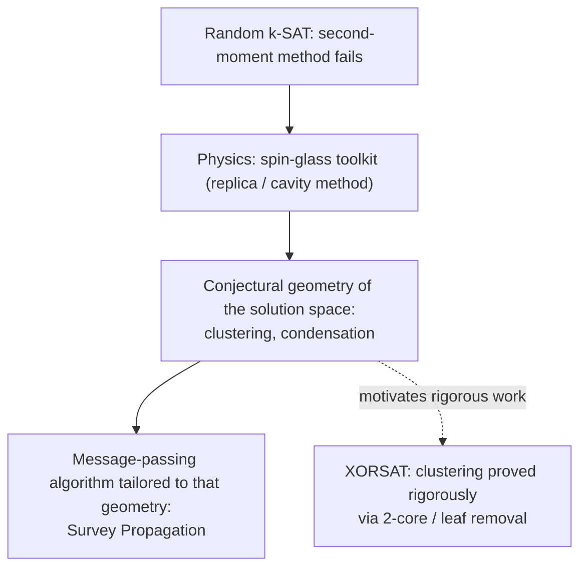

# Statistical Physics of Random Constraint Satisfaction

[[book-guidelines|↩ Back to guidelines]]

See also: [[Random-Satisfiability-and-Phase-Transitions|Random Satisfiability and Phase Transitions]] — the same threshold phenomenon, approached there with the first/second moment method from probabilistic combinatorics. This article covers the *other* toolkit that grew up around the same problem: the statistical-mechanics view, which doesn't prove theorems so much as *predict* where the rigorous theorems should end up, and along the way hands SAT solving a genuinely new algorithm (Survey Propagation).

## Why a physics chapter in a SAT handbook?

The previous article ends at an honest admission: the second moment method, applied directly to random $k$-SAT, **fails**. It doesn't fail because of a technical slip — it fails because the number of solutions $Z$ of a satisfiable random formula has *wild fluctuations* around its mean, so much so that $\mathbb E[Z^2] \gg (\mathbb E[Z])^2$ as $N\to\infty$, for essentially any clause density $\alpha > 0$. The Markov/Chebyshev machinery that gives you a solid upper bound on the satisfiability threshold gives you almost nothing on the lower bound. That's not a minor gap: as of the chapter's writing, the *existence* of a sharp satisfiability threshold for random $k$-SAT was (and largely remains) an open conjecture, not a theorem.

This is exactly the kind of wall where a different toolkit, developed for a superficially unrelated problem, turns out to be the right hammer. In the early 1980s, physicists led by Giorgio Parisi were studying **spin glasses** — magnetic materials with disordered, competing interactions between atomic spins — and had to solve precisely the same technical problem: computing the typical properties of a system whose partition function does *not* concentrate around its mean. Their answer, the **cavity method** (equivalently, the **replica method**), was built for exactly this pathology. When 1990s AI researchers noticed that random CSP benchmarks got dramatically harder near a critical clauses-per-variable ratio, the analogy to physical phase transitions was too clean to ignore, and the cross-fertilization began.

The chapter is explicit about the **methodological difference** that had kept the two communities from talking to each other for a decade: physicists ask "what's true, with high probability, about instances drawn from a given distribution?" — a *statistical* question. Computer scientists ask "give me an algorithm that works on this one arbitrary instance in front of me" — a *worst-case* or *instance-specific* question. Random $k$-SAT is where these two questions turn out to have the same interesting answer.

What you get from crossing over to the physics side is not proof — most of what follows is *not rigorous* by mathematical standards, resting on plausible but unproven assumptions about correlations decaying in specific ways. What you get instead is a **detailed, quantitatively precise conjectural picture** of the solution space's geometry — a picture rigorous mathematics later spent two more decades partially confirming. And, as a direct byproduct, you get **Survey Propagation**, a message-passing solver that beats local search specifically in the regime the physics says is hardest.



## 1. The continuous perceptron: a phase transition you can solve exactly

Before tackling $k$-SAT, the chapter deliberately picks the simplest possible instance of the phenomenon — one you can compute in closed form — to fix intuitions.

**The problem.** Given $M$ random points $T^1,\dots,T^M \in \mathbb R^N$ drawn independently and uniformly on the unit hypersphere, does there exist a vector $\sigma \in \mathbb R^N$ with

$$\sigma \cdot T^a \equiv \sum_{i=1}^N \sigma_i T^a_i > 0, \qquad \forall a = 1,\dots,M \tag{22.1}$$

— i.e., do all $M$ points lie in the same half-space through the origin? This is the **continuous perceptron**: $N$ real-valued variables, $M$ random linear constraints. Because $\sigma$ ranges over $\mathbb R^N$ (continuous domain, hence "continuous" in the name), the decision problem is polynomial-time solvable — this is deliberately the *easy* case, chosen so the geometry is legible before anything algorithmically hard is added.

**The exact answer (Cover's formula).** Let $P(N,M)$ be the probability that $M$ such random points lie in a common half-space. Cover computed this exactly:

$$P(N,M) = \frac{1}{2^{M-1}} \sum_{i=0}^{\min(N-1,\,M-1)} \binom{M-1}{i} \tag{22.2}$$

Define the **control parameter** $\alpha = M/N$ — constraints per variable, the same ratio that drives random $k$-SAT. As $N\to\infty$ with $\alpha$ fixed:

$$\lim_{N\to\infty} P(N, M=N\alpha) = \begin{cases} 1 & \alpha < \alpha_s \\ 0 & \alpha > \alpha_s \end{cases}, \qquad \alpha_s = 2 \tag{22.3}$$

This is a genuine **phase transition**: a sharp, discontinuous change in the limit, even though $P(N,M)$ itself is a perfectly smooth function of $M$ for any finite $N$. Sharpness is a $N\to\infty$ phenomenon (the "thermodynamic limit," in physics jargon — the same asymptotic regime the earlier article's w.h.p./w.u.p.p. vocabulary was built for).

**Finite-size scaling.** Cover's formula is exact enough to zoom into the transition window itself:

$$\lim_{N\to\infty} P\!\left(N, M = N\alpha_s(1+\lambda N^{-1/2})\right) = \int_{\lambda\sqrt2}^{\infty} \frac{dx}{\sqrt{2\pi}}\, e^{-x^2/2} \tag{22.4}$$

The transition isn't a step function at finite $N$ — it's a smeared-out window of width $N^{-1/\nu}$ around $\alpha_s$ (here $\nu = 2$), described by a universal scaling function. **This is the general template**: every threshold phenomenon in this chapter is characterized by (a) a critical value $\alpha_c$ and (b) a scaling exponent $\nu$ describing how fast the window around $\alpha_c$ shrinks as $N$ grows. This matters practically, not just aesthetically — numerical experiments are always run at finite $N$, and without a finite-size-scaling law you can't tell whether you're looking at the true asymptotic threshold or a finite-size artifact (the chapter flags exactly this failure mode in some early random-3-SAT threshold estimates).

**Why this toy model earns its place.** It gives you, for free and in closed form, the vocabulary the rest of the chapter reuses for problems with no closed form: a **CSP** (assignment of $N$ variables required to satisfy $M$ constraints), a **random CSP** (a probability distribution over instances — here, uniform on the hypersphere), the **thermodynamic limit**, and **finite-size scaling**. $k$-SAT and $k$-XORSAT are expected to share *all* of this structure — a genuine sharp threshold, describable by a scaling window — just without Cover's luxury of an exact formula.

A minimal Rust sketch of what's actually being asked, to keep the definitions concrete:

```rust
/// One instance of the continuous perceptron decision problem.
struct Perceptron {
    points: Vec<Vec<f64>>, // M points T^1..T^M, each in R^N
}

impl Perceptron {
    /// Does there exist sigma in R^N with positive dot product against every point?
    /// (In practice: solved by linear programming / a perceptron learning rule —
    /// this signature exists just to make Eq. 22.1 literal.)
    fn is_satisfiable(&self) -> bool {
        unimplemented!("polynomial-time feasibility check, e.g. via LP")
    }
}
```

## 2. Why the binary version breaks the moment method (and motivates statistical mechanics)

Swap $\sigma \in \mathbb R^N$ for $\sigma \in \{-1,+1\}^N$ — the **binary perceptron** — and the problem becomes NP-complete. Cover's exact calculation no longer applies, but you can still try the first/second moment method from the probabilistic-combinatorics toolkit (see the companion article). Let $Z = \sum_{\sigma} \prod_a \theta(\sigma\cdot T^a)$ count solutions.

**First moment** gives $\mathbb E[Z] = 2^N \cdot 2^{-M} = e^{NG_1}$ with $G_1 = (1-\alpha)\ln 2$, vanishing for $\alpha > 1$ — so $\alpha_s \le 1$, a clean upper bound via Markov's inequality.

**Second moment**, however, is where things go wrong. Computing $\mathbb E[Z^2]$ requires summing over pairs of configurations $(\sigma,\sigma')$, organized by their **overlap** $q = \frac1N\sum_i \sigma_i\sigma_i'$ (equivalently, their normalized Hamming distance). This sum is dominated, via Laplace's method, by the value $q$ maximizing a function $G_2(q)$ — and it turns out $\max_q G_2(q)$ always exceeds $2G_1$, meaning $\mathbb E[Z^2] \gg (\mathbb E[Z])^2$ for *every* $\alpha > 0$. Chebyshev's inequality (22.9) gives you nothing: the standard technique is simply too blunt here.

**What breaks, precisely.** The failure mode is that $Z$'s distribution is *not concentrated* — the union of low-order moments is dominated by rare instances with unusually many solutions, not by the typical instance. This is exactly the pathology spin-glass physics was built to handle for magnetic systems with disordered interactions, and the fix is the **replica method**: instead of computing $\mathbb E[Z^2]$, compute $\mathbb E[Z^n]$ for general integer $n$ (literally $n$ independent "replica" copies of the same random formula, hence the name), and analytically continue the result to $n \to 0$:

$$s_g(\alpha) = \lim_{N\to\infty}\frac1N \mathbb E[\ln Z] = \lim_{N\to\infty}\lim_{n\to0}\frac{1}{nN}\ln \mathbb E[Z^n] \tag{22.20}$$

This is a genuinely strange move — $n\to 0$ replicas of nothing — and it is *not* mathematically justified in general; it's a calculational recipe validated empirically (matching simulations) and, in special cases, later proven correct. For the binary perceptron it gives $\alpha_s \approx 0.833$, matching numerics.

**The statistical-mechanics dictionary**, introduced here because everything downstream is phrased in it:

| Physics | Random-CSP meaning |
|---|---|
| Configuration $\sigma \in X^N$, energy $E(\sigma)$ | Assignment; number of violated constraints (the MAX-SAT cost) |
| Gibbs–Boltzmann measure $\mu(\sigma) = \frac1Z e^{-\beta E(\sigma)}$ | At $\beta\to\infty$ (zero temperature): uniform measure over *optimal* (satisfying) assignments |
| Entropy density $s_g(\alpha) = \lim \frac1N \mathbb E[\ln|\{\sigma: E(\sigma)=0\}|]$ | Typical log-number of solutions per variable |
| Ground-state energy density $e_g(\alpha)$ | Typical minimum fraction of violated clauses (zero exactly when satisfiable) |
| Disordered system | The random formula itself — the "disorder" is which clauses got sampled |

A first (later-refined) criterion: locate $\alpha_s$ where $s_g(\alpha)$ hits zero. This is *exactly right asymptotically at large $k$*, but *wrong* for fixed small $k$ — because a finite fraction $\exp[-\alpha k]$ of variables never appear in any clause at all, contributing a nonzero floor to $s_g$ that survives right up to the transition, then a large number of solutions vanish suddenly. That mismatch is precisely what §3 below spends real effort refining.

## 3. Clustering and condensation: the solution space isn't one blob

This is, per the chapter, the single most important physics contribution to random-CSP theory: **the satisfiable phase itself is not uniform**. As $\alpha$ approaches $\alpha_s$ from below, the set of solutions is conjectured to fracture into an exponential number of well-separated **clusters**.

**Definition (informal but precise).** A cluster is a maximal connected component of the solution set under "sub-extensive Hamming-distance steps": $\sigma,\tau$ are in the same cluster iff there's a path $\sigma = \sigma^0,\sigma^1,\dots,\sigma^n=\tau$ through solutions, each consecutive pair at Hamming distance $o(N)$. Two solutions in *different* clusters are, by contrast, at Hamming distance $\Theta(N)$ apart — there's a genuine gap, no interpolating path of nearby solutions. There is a threshold $\alpha_d$ (the **dynamical** or **clustering** transition) below which there's a single giant cluster containing essentially all solutions, and above which ($\alpha \in [\alpha_d, \alpha_s]$) the solution space is partitioned into exponentially many clusters, each of exponential-in-$N$ size:

$$s = \Sigma + s_{\text{int}}$$

— total entropy density splits additively into $\Sigma$ (the **complexity**: log-number of clusters per variable) and $s_{\text{int}}$ (the internal entropy density within one cluster).

**Why this is more than a curiosity: a worked, *rigorous* example (XORSAT).** $k$-XORSAT — random linear systems over $\mathbb F_2$, syntactically almost identical to $k$-SAT but polynomial-time solvable — is where this decomposition can be proved outright, via an entirely constructive algorithm:

1. Start with the full set of equations $F_0 = F$ and variables $V_0$.
2. Repeatedly find a **leaf variable** — one appearing in exactly one remaining equation — and delete that equation (and the variable falls out of the active variable set).
3. Stop when no leaf variables remain. What's left, $F' = F_{T^*}$, is the formula's **2-core** — the unique maximal subformula in which every variable occurs at least twice.

The punchline: $F$ is satisfiable iff $F'$ is, and — crucially — **the number of clusters of $F$ equals exactly the number of solutions of the 2-core $F'$**. Reintroducing the deleted equations one at a time (in reverse order) reconstructs, for each fixed solution of the core, a well-defined block of $2^{d_n-1}$ compatible extensions at each step — solutions built this way from the *same* core solution are automatically close together (they share the entire core assignment and only differ on leaf-variable choices), while solutions from *different* core assignments are far apart. That is a cluster, made rigorous, with no hand-waving.

The 2-core is empty (w.h.p.) below a threshold $\alpha_d(k)$ — solvable numerically as the smallest root of $x = 1-\exp[-\alpha k x^{k-1}]$ — and nonempty with a finite fraction of variables above it. $\Sigma$ vanishes continuously at $\alpha_s$ (the number of *core* solutions shrinks to zero), while total entropy $s$ stays finite because leaf variables retain their freedom — this cleanly resolves the mismatch flagged at the end of §2.

**Random $k$-SAT is harder**, because it has no linear-algebra structure to exploit — no clean "core" extraction. Clusters can have *different* internal entropies $s_{\text{int}}$, so the complexity becomes a genuine function $\Sigma(s_{\text{int}})$, and the total entropy is a Laplace-type integral over it:

$$s = \lim_{N\to\infty}\frac1N \ln \int_{s_-}^{s_+} ds_{\text{int}}\, e^{N[\Sigma(s_{\text{int}}) + s_{\text{int}}]} \tag{22.23}$$

This integral can be dominated in two qualitatively different ways, giving a **third** threshold beyond $\alpha_d$ and $\alpha_s$: the **condensation transition** $\alpha_c \in [\alpha_d,\alpha_s]$.
- For $\alpha \in [\alpha_d,\alpha_c]$: the integral is dominated by an interior critical point — an *exponential* number of clusters share the bulk of all solutions.
- For $\alpha \in [\alpha_c,\alpha_s]$ (**condensed regime**): the integral is dominated by the boundary $s_+$ where $\Sigma(s_+)=0$ — a *sub-exponential* number of clusters (as few as $O(1)$) now hold essentially all the solutions.

Known numeric values (Table 22.1) for $k$-SAT:

| $k$ | $\alpha_d$ (clustering) | $\alpha_c$ (condensation) | $\alpha_s$ (satisfiability) |
|---|---|---|---|
| 3 | 3.86 | 3.86 | 4.267 |
| 4 | 9.38 | 9.547 | 9.93 |
| 5 | 19.16 | 20.80 | 21.12 |
| 6 | 36.53 | 43.08 | 43.4 |

(For $k=3$ the chapter notes $\alpha_c=\alpha_d$ — the condensed regime swallows the whole clustered phase.)

**What this buys you, algorithmically.** A single global solution count tells you nothing about *reachability* — whether a local-search or CEGAR-style counterexample search, moving by small steps, can actually get from "close to a solution" to "a solution." Once you're in the clustered/condensed regime, a search procedure that only takes small (sub-extensive) steps can get trapped exploring one cluster, provably unable to reach a different one without a macroscopic jump — this is the mechanistic reason plain local search's performance craters well before the true satisfiability threshold (see §5).

## 4. The cavity method: factor graphs, messages, and 1RSB

To go from "clusters exist" to "here's an algorithm that respects that structure," the chapter introduces the machinery in stages.

**Factor graphs.** Any CSP instance is drawn as a bipartite graph: one **variable node** per variable (filled circle), one **constraint (factor) node** per clause (empty square), with an edge whenever a clause depends on a variable. For $(x_1\lor x_2\lor x_3)\land(x_3\lor x_4\lor x_5)\land(x_4\lor x_6\lor x_7)$, this is a tree of exactly the shape you'd draw by hand. Two facts about the *random* $k$-SAT factor graph make everything below tractable: node degrees are Poisson-distributed with mean $\alpha k$, and — critically — the graph is **locally tree-like**: the ball of radius $L$ around any fixed variable is a tree with probability $\to 1$ as $N\to\infty$ (for fixed $L$). Loops exist, but they're long (typically $\Theta(\log N)$), so locally the graph looks like the trivial case.

**Why trees are easy.** On an exact tree, the uniform measure over solutions decomposes recursively. Define, for every directed edge, a real-valued **message**: $h_{i\to a}$ (a variable's belief about its own value, absent clause $a$) and $u_{a\to i}$ (a clause's belief about variable $i$, absent variable $i$'s other neighbors), related to marginals via $\tanh$. They satisfy exact recursive (**Belief Propagation**) equations:

$$h_{i\to a} = \sum_{b\in\partial_+ i(a)} u_{b\to i} - \sum_{b\in\partial_- i(a)} u_{b\to i}, \qquad u_{a\to i} = -\frac12\ln\left(1 - \prod_{j\in\partial a\setminus i}\frac{1-\tanh h_{j\to a}}{2}\right) \tag{22.26}$$

On a tree, propagate these from the leaves (boundary condition $h_{i\to a}=0$) inward, and you get *exact* marginals and *exact* entropy in linear time — dynamic programming on a graph, nothing more exotic than that.

**The cavity method's core move.** Random $k$-SAT's factor graph is only *locally* tree-like — there's a distant, loopy remainder $F\setminus F_L$ beyond radius $L$ that BP's derivation ignores. The **replica-symmetric cavity method** assumes this remainder acts on the boundary as an *independent, factorized* external field on each boundary variable — a plausible assumption **only** when boundary variables are weakly correlated, i.e. only in the *unclustered* regime $\alpha \le \alpha_d$. Solved via a **population dynamics** algorithm (simulate the distribution of $h,u$ directly, rather than tracking exact values), this reproduces $s_g(\alpha)$ correctly below $\alpha_d$.

**Above $\alpha_d$, this assumption is simply false** — clustering *induces* exactly the correlations the replica-symmetric ansatz assumed away. The fix is **one step of replica symmetry breaking (1RSB)**: instead of a single message per edge, carry a *distribution* $Q_{a\to i}(u)$ of messages — one value per cluster $\gamma$ — governed by a real parameter $m$ (the **Parisi breaking parameter**) that tunes which cluster *sizes* get emphasized in a generalized free-energy potential:

$$\Phi(m) = \frac1N\ln\sum_\gamma Z_\gamma^m = \frac1N \ln\int_{s_-}^{s_+} ds_{\text{int}}\, e^{N[\Sigma(s_{\text{int}}) + m\,s_{\text{int}}]} \tag{22.28}$$

$\Sigma(s_{\text{int}})$ is recovered from $\Phi(m)$ by an inverse Legendre transform. Two special values make this computationally tractable: $m=1$ and — the one that matters most for algorithms — **$m=0$**, which weights *all* clusters equally regardless of size, collapsing the distribution of messages to a single real number per edge. That special case is exactly the original Survey Propagation construction.

## 5. Survey Propagation: message passing that respects clustering

**The setup problem.** Belief Propagation on a *loopy* graph has no convergence guarantee, and clustering actively makes it worse — averaging over a genuinely multimodal, clustered measure is precisely what a single-message BP iteration can't represent. Two successive simplifications get you to a usable algorithm:

- **Warning Propagation (WP)**: take BP's zero-temperature limit ($\beta\to\infty$, appropriate since you only care about *exactly* satisfying assignments). Messages degrade from reals to integers/booleans: $\hat h \in \mathbb Z$, $\hat u\in\{0,1\}$. A clause "sends a warning" ($\hat u_{a\to i}=1$) exactly when every *other* variable in the clause is forced to its unsatisfying value — i.e., $i$ is the clause's last hope.
- **Survey Propagation (SP)**: WP still assumes a single "correct" assignment per edge; SP instead tracks, per edge, the *fraction of clusters* in which a warning would fire — a single real number $\delta_{a\to i}\in[0,1]$ (the probability that $\hat u_{a\to i}=1$) and, on the variable side, $\gamma_{i\to a}$ (the probability that $\hat h_{i\to a}<0$):

$$\delta_{a\to i} = \prod_{j\in\partial a\setminus i} \gamma_{j\to a}, \qquad \gamma_{i\to a} = \frac{(1-\pi^-_{i\to a})\,\pi^+_{i\to a}}{\pi^+_{i\to a}+\pi^-_{i\to a}-\pi^+_{i\to a}\pi^-_{i\to a}} \tag{22.38, 22.39}$$

where $\pi^\pm_{i\to a} = \prod_{b\in\partial_\pm i(a)} (1-\delta_{b\to i})$ is the probability that *none* of the agreeing/disagreeing neighboring clauses sends a warning. This is exactly the $m=0$, $\beta\to\infty$ 1RSB cavity computation of §4, made concrete: instead of solving one BP instance per cluster, SP solves *one* fixed-point system whose solution summarizes the whole cluster ensemble at once.

**Turning it into a solver (decimation).** SP alone only estimates marginal-like quantities per variable — the fraction of clusters where $\sigma_i=+1$, $-1$, or "free" ($\gamma_i^+,\gamma_i^-,\gamma_i^0$). To actually build a solution: run SP to convergence, pick the variable with the largest $|\gamma_i^+-\gamma_i^-|$ (the one SP is *most confident* about), fix it to that value, delete/simplify the formula accordingly, and **repeat** — re-running SP on the reduced formula each round. This greedy fix-and-resolve loop, called **decimation**, is what makes SP a competitive solver near $\alpha_s$, specifically because it always commits to the variable the current cluster-ensemble picture is least ambiguous about — the opposite failure mode from plain local search, which has no way to detect "this variable is frozen across almost every remaining cluster" and instead wanders until a large fluctuation happens to find a way out.

```rust
/// Skeleton of one SP-guided decimation round (illustrative, not the book's
/// literal pseudocode — it has none; this is the mechanism described in prose).
struct SurveyState {
    delta: Vec<f64>,   // one delta_{a->i} per (clause, variable) edge
    gamma: Vec<f64>,   // one gamma_{i->a} per edge
}

fn sp_decimation_step(formula: &mut Formula, survey: &mut SurveyState) -> Option<()> {
    run_sp_to_fixed_point(formula, survey);              // Eqs. 22.38-22.39, iterated
    let (var, value, confidence) = most_confident_variable(formula, survey); // largest |gamma+ - gamma-|
    if confidence < THRESHOLD {
        return None; // SP no longer distinguishes clusters cleanly -- fall back to backtracking
    }
    formula.fix_variable(var, value);
    formula.simplify(); // unit propagation on the reduced formula
    Some(())
}
```

## Where this leads

Structurally, this chapter sits beside — not on top of — the earlier probabilistic-combinatorics treatment of the same threshold: [[Random-Satisfiability-and-Phase-Transitions]] gives you rigorous bounds on *whether* a threshold exists and roughly where; this chapter gives you a conjectural but far more detailed picture of *what the satisfiable phase looks like from the inside* (clustered? condensed? how many clusters?), plus an algorithm — Survey Propagation — that only makes sense once you accept that picture.

For the CSP-kernel project this vault is being built around, three things here transfer directly rather than staying academic curiosities:

- **Factor graphs and message passing are literally constraint propagation.** BP/WP/SP's edge messages, iterated to a fixed point, are the same computational pattern as arc-consistency/domain propagation in a CSP solver — a local update rule iterated over a constraint hypergraph until convergence. If your CSP kernel's domain-propagation layer ever needs a *probabilistic* or *confidence-weighted* variant (rather than hard bound-tightening), SP's $\delta$/$\gamma$ surveys are a fully worked example of what that looks like.
- **Clustering is a structural reason local search fails on specific instances**, not just a black-box empirical slowdown — this gives you a *diagnostic* for your own solver: if a CEGAR-style counterexample search stalls, the cavity picture tells you to ask "is the solution space clustered here?" before blaming heuristics.
- **Decimation is a template for any solver that alternates constraint propagation with heuristic variable commitment** — precisely the CDCL/branch-and-bound shape, but with the branching heuristic replaced by a global structural signal (how many clusters agree) instead of a local one (activity, VSIDS, etc.).

The chapter's own next moves (not covered here) — analyzing DPLL/backtracking algorithms and dense-formula Warning Propagation as out-of-equilibrium growth processes — extend this same factor-graph machinery to *complete* solvers, not just SP's incomplete decimation loop.
