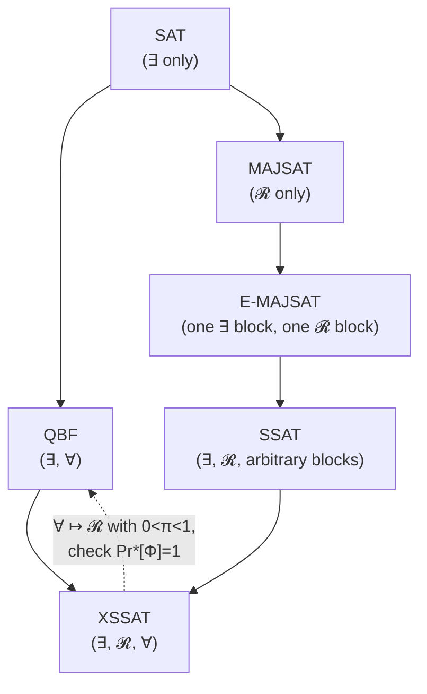

# Stochastic Boolean Satisfiability

[[book-guidelines|↩ Back to guidelines]]

## Why SAT alone can't ask "what should I do, given that nature might not cooperate?"

Ordinary SAT answers exactly one question: *does an assignment exist that satisfies this formula?* Quantified Boolean formulas (see [[Quantified-Boolean-Formulas]]) generalize that to a two-player game: *can I* ($\exists$) *choose values such that no matter what an adversary* ($\forall$) *chooses, the formula holds?* Both of these are adversarial-but-deterministic framings — every quantified variable is controlled by an agent (you, or a hostile opponent) who picks the worst or best case on purpose — what is randomly true, in that picture, is nothing.

Real decision problems are frequently not like that. If you're building a plan for a robot whose sensors are noisy, or reasoning about a belief network where a variable is true with some probability, the "opponent" isn't a hostile adversary trying to defeat you — it's *nature*, indifferent, flipping biased coins. You don't need to survive nature's worst possible move; you need to know the *probability* that your plan succeeds, and you want to choose the plan that maximizes that probability. That's a fundamentally different computational object than "for all adversary choices, does it hold?" — the value of a randomized variable isn't chosen at all, it's *drawn*, and what you actually want out of the problem is an expectation, not a boolean verdict.

**Stochastic Boolean Satisfiability (SSAT)**, introduced by Papadimitriou as a "game against nature" and developed into its modern form by Littman, Majercik & Pitassi, is exactly this generalization. It bolts a third kind of quantifier — randomized, written $\mathcal{R}_{\pi_i}$ — onto the existing existential quantifier of SAT, and (in its extended form) the universal quantifier of QBF. The result turns out to be strictly more expressive than either: SAT and QBF both fall out of SSAT as special cases, and the framework additionally captures probabilistic planning and belief-network inference for free. This is the handbook's final chapter, and structurally it's a fitting capstone — it's the chapter that shows SAT-solving machinery (unit propagation, pure-literal elimination, DPLL-style search) generalizing all the way up to *decision-making under uncertainty*.

## Existential and randomized quantifiers

### The formal object

An SSAT instance is a pair $\Phi = Q_1 v_1 \dots Q_n v_n\, \varphi$:

- a **prefix** $Q_1 v_1 \dots Q_n v_n$ that both orders the $n$ Boolean variables and assigns each one a quantifier $Q_i \in \{\exists, \mathcal{R}_{\pi_i}\}$ — existential, or randomized-true-with-probability-$\pi_i$;
- a **matrix** $\varphi$, a CNF formula over those variables — same clause/literal apparatus as ordinary SAT.

The book's terminology is precise and worth keeping exactly: a maximal run of adjacent, identically-quantified variables in the prefix is a **block**; any contiguous sub-run is a **sub-block**. $X$ is the set of all existential variables, $Y$ the set of all randomized ones; $X_i$/$Y_i$ pick out the variables of the $i$-th existential/randomized block specifically. Existential variables are written $x_1, x_2, \dots$; randomized ones $y_1, y_2, \dots$ — the book is disciplined about never mixing these up, and so is this article.

Crucially, an existential variable is a *standard* Boolean variable — someone chooses its value, and can choose it strategically. A randomized variable $y_i$ is *not chosen*; it has an arbitrary fixed rational probability $\pi_i$ of being true, and its value is sampled, not selected. This is the single structural fact everything else in the chapter is built on top of.

**What breaks without this distinction:** if you tried to model a noisy sensor as an ordinary existential variable and just search over both its values, you'd be solving "does there exist a sensor reading under which my plan succeeds?" — which is trivially true or false and answers a question nobody asked. What you actually want to know is the plan's success *probability*, weighted by how likely each reading is. That weighting is exactly what a randomized quantifier encodes and an existential quantifier cannot.

### Partial assignments and the residual-problem notation

The book defines a partial assignment $\alpha$ as an ordered sequence of literals $l_1; l_2; \dots; l_k$ (order records *when* each assignment was made, not just what it is), and $\Phi(\alpha)$ — the SSAT problem remaining after applying $\alpha$ — by four mechanical steps: drop clauses containing a true literal, drop false literals from surviving clauses, drop variables/quantifiers no longer appearing in any clause, and **renumber** the remaining prefix so it's contiguous again ($1, 2, 3, \dots$). This renumbering matters: recursive definitions over SSAT instances (below) recurse on "the leftmost quantifier," and that only stays well-defined if the prefix is kept dense after every reduction. $\varphi(\alpha)$ denotes just the residual matrix.

**Rust grounding.** This residual-problem machinery is exactly the shape of an interpreter reducing a program one redex at a time — appropriate, since a SAT/SSAT solver *is* an interpreter for a decision procedure. A direct, if unoptimized, transcription:

```rust
#[derive(Clone, Copy, PartialEq, Eq)]
enum Quantifier {
    Exists,
    Forall,               // only in Extended SSAT (XSSAT)
    Random,               // probability carried alongside, see below
}

struct Prefix {
    // one entry per variable, in quantifier order (index 0 = leftmost / first-quantified)
    quantifiers: Vec<Quantifier>,
    probabilities: Vec<f64>, // meaningful only where quantifiers[i] == Random
}

#[derive(Clone, Copy, PartialEq, Eq)]
struct Literal { var: usize, positive: bool }

type Clause = Vec<Literal>;
type Matrix = Vec<Clause>;

/// Apply one literal assignment, producing the residual (Φ(α) for |α| = 1).
/// Mirrors the book's four-step definition, minus the renumbering step
/// (kept implicit here via a `removed` mask rather than reindexing eagerly).
fn assign(matrix: &Matrix, lit: Literal) -> Matrix {
    matrix
        .iter()
        .filter(|clause| !clause.contains(&lit))          // step 1: drop satisfied clauses
        .map(|clause| {
            clause
                .iter()
                .copied()
                .filter(|&l| l.var != lit.var || l == lit) // step 2: drop the false literal
                .collect()
        })
        .collect()
}
```

The `Random` variant carrying a probability rather than being chosen is the whole conceptual pivot of the chapter, encoded directly in the type: an `Exists`/`Forall` variable's value is something a *solver* decides during search; a `Random` variable's value is something the *evaluator* weights by `probabilities[i]` and `1.0 - probabilities[i]` — never branched on strategically.

## The maximum probability of satisfaction

### The recursive definition

Since existential variables can be chosen *contingent on* the values of variables quantified earlier in the prefix, a "solution" to SSAT isn't a single assignment — it's an **assignment tree**, specifying, for every possible history of preceding random outcomes, what value each existential variable should take. The tree that achieves the best possible outcome is the **solution tree**, and the value it achieves is $\Pr^*[\Phi]$, the **maximum probability of satisfaction**, defined by exactly four recursive rules (the book's own numbering):

$$
\Pr^*[\Phi] = \begin{cases}
0 & \text{if } \varphi \text{ contains an empty clause} \\
1 & \text{if } \varphi \text{ is the empty set of clauses} \\
\max\bigl(\Pr[\Phi(v)],\ \Pr[\Phi(\bar v)]\bigr) & \text{leftmost quantifier is } \exists v \\
\Pr[\Phi(v)]\cdot\Pr[v] \;+\; \Pr[\Phi(\bar v)]\cdot\Pr[\bar v] & \text{leftmost quantifier is } \mathcal{R}\,v
\end{cases}
$$

Read this the way you'd read the base cases and recursive step of any structurally-recursive function: cases 1–2 are the base cases (an already-decided formula), and cases 3–4 peel off the *leftmost* still-quantified variable and recurse on a strictly smaller residual problem — exactly the well-founded recursion a Lean or Coq definition on a shrinking list would need to satisfy the termination checker. The existential rule takes the **best** branch (you get to choose); the randomized rule takes the **probability-weighted average** of both branches (you don't get to choose — you get what nature gives you, weighted by how often it gives it).

**What breaks without threading the probability through correctly:** if you replaced the weighted average in rule 4 with a plain `max`, you would have silently redefined every randomized variable as if it were existential — i.e., you'd be computing the value of a *different, easier* problem (closer to plain QBF) while believing you'd solved SSAT. The $\pi_i$ weights are not cosmetic; they're the entire reason SSAT sits in a harder complexity class than QBF's existential-only fragment.

**Rust grounding** — a direct transcription of the four rules, recursing on the leftmost variable of the prefix:

```rust
fn max_probability(matrix: &Matrix, prefix: &Prefix, depth: usize) -> f64 {
    if matrix.iter().any(|clause| clause.is_empty()) {
        return 0.0;                                   // rule 1
    }
    if matrix.is_empty() {
        return 1.0;                                   // rule 2
    }
    let var = depth; // leftmost still-quantified variable
    let pos = Literal { var, positive: true };
    let neg = Literal { var, positive: false };
    let phi_pos = max_probability(&assign(matrix, pos), prefix, depth + 1);
    let phi_neg = max_probability(&assign(matrix, neg), prefix, depth + 1);

    match prefix.quantifiers[var] {
        Quantifier::Exists => phi_pos.max(phi_neg),          // rule 3
        Quantifier::Random => {
            let p = prefix.probabilities[var];
            phi_pos * p + phi_neg * (1.0 - p)                // rule 4
        }
        Quantifier::Forall => phi_pos.min(phi_neg),          // XSSAT's fifth rule, see below
    }
}
```

**Lean grounding.** This is precisely the shape of a denotational-semantics function defined by structural recursion over syntax — the kind of definition that in Lean you'd write with `termination_by` on a decreasing measure (here, the number of still-quantified variables), and whose totality proof *is* the proof that every SSAT instance has a well-defined value. The assignment tree that witnesses $\Pr^*[\Phi]$ is not just a certificate that "yes, $\Phi$ is satisfiable" (a bare boolean) — it's closer to a *proof term*: it records, constructively, exactly which existential choice achieves the maximum at every reachable point in the random-outcome space, the same way a Lean proof of an existential statement is required to carry a witness, not just assert one exists. If your target compiler's proof-producing architecture ever needs to certify "this strategy achieves probability $\geq \theta$" rather than merely "some strategy exists," the assignment tree — not the bare number $\Pr^*[\Phi]$ — is the object that plays the role a proof term plays in a kernel-checked proof.

## MAJSAT, E-MAJSAT, and Extended SSAT

The book isolates two special cases by restricting the *shape* of the prefix, plus a genuine extension:

| Problem | Prefix shape | What the "solution" is | Complexity |
|---|---|---|---|
| **SAT** | all existential | a witness assignment | NP-complete |
| **MAJSAT** | all randomized | just the number $\Pr^*[\Phi]$ (no existential choices to record, so no assignment tree) | PP-complete |
| **E-MAJSAT** | one existential block, then one randomized block | the existential assignment $\alpha$ maximizing $\Pr[\Phi(\alpha)]$ | $\mathrm{NP}^{\mathrm{PP}}$-complete |
| **SSAT** (general) | arbitrary mix of $\exists$ and $\mathcal{R}$ blocks | a full assignment tree | PSPACE-complete |
| **ASSAT** | $\exists$/$\mathcal{R}$ strictly alternating | a full assignment tree | PSPACE-complete |
| **QBF** | all existential/universal | a witness *strategy* | PSPACE-complete |
| **XSSAT** | arbitrary mix of $\exists$, $\mathcal{R}$, *and* $\forall$ | a full assignment tree | PSPACE-complete |

Two points from the chapter's complexity discussion are worth internalizing precisely rather than just citing the class names:

- **PP** (MAJSAT) is the probabilistic analogue of NP: guess-and-check in polynomial time, but the check only needs to be *correct with probability $\geq 1/2$* rather than deterministically correct. This is strictly about *deciding* whether the satisfaction probability clears a threshold — it is not the same question as **#P** (counting satisfying assignments exactly; see [[Model-Counting]]), even though both live "above" plain NP for related reasons.
- **$\mathrm{NP}^{\mathrm{PP}}$** (E-MAJSAT) is an NP search with a PP-oracle check — guess an existential assignment (NP), then settle whether the resulting MAJSAT sub-problem's probability clears a threshold using a PP computation. The book's own framing is worth keeping: existential variables correspond to a *hypothesis* or a *plan*, randomized variables to the *uncertainty* it must be evaluated against — this is precisely the shape of "propose a fix, then check whether it holds across all (weighted) environment behaviors," which is the same shape as checking whether a candidate loop invariant survives a distribution over inputs.

**Extended SSAT (XSSAT)** adds a genuine fifth rule to $\Pr^*$, for a leftmost *universal* variable $v$:

$$
\Pr^*[\Phi] = \min\bigl(\Pr[\Phi(v)],\ \Pr[\Phi(\bar v)]\bigr) \qquad \text{(universal — rule 5)}
$$

— already present in the Rust sketch above as the `Quantifier::Forall` arm. A universal variable's value is chosen *against* you: satisfaction must hold whichever branch is worse, so you take the **min**, not the max or the weighted average.

## SSAT as a unifying generalization of SAT and QBF

This is the chapter's headline structural claim, and it's worth stating exactly as the book does rather than loosely: an XSSAT instance restricted to only $\exists$ and $\forall$ quantifiers has a $\Pr^*[\Phi]$ that is *literally* the QBF satisfiability predicate — $\Pr^*[\Phi] = 1$ iff the QBF instance is true, $\Pr^*[\Phi]=0$ iff it's false, and (with only $\exists/\forall$ present) no intermediate values are reachable. Restricted further to only $\exists$, it degenerates to plain SAT. So the five-rule $\Pr^*$ recursion is not "SSAT's definition, which happens to resemble QBF's" — it *is* QBF's satisfiability definition (max for $\exists$, min for $\forall$), with one additional rule (the probability-weighted average for $\mathcal{R}$) spliced in as a genuine third option alongside the other two.

Even more strikingly, the reduction runs the other direction too, and constructively: **any QBF instance can be solved by an SSAT solver**, with no reduction of the formula itself — only the quantifiers change. Replace every universal quantifier with a randomized quantifier whose probability is strictly between 0 and 1 (any such value works — the book doesn't even need it to be $1/2$), then check whether the resulting SSAT instance's $\Pr^*[\Phi]$ equals exactly $1$. Intuitively: a universal variable demands the formula hold in *both* branches; a randomized variable with $0 < \pi < 1$ assigns strictly positive probability *mass* to both branches, so the *only* way the weighted average can reach the ceiling of $1$ is if both branches already evaluate to $1$ — which recovers exactly the universal quantifier's all-branches-must-hold semantics, without ever special-casing $\forall$ in the solver.



This single reduction is why the chapter calls XSSAT a genuine unification rather than a coincidental family resemblance: every one of SAT, QBF, MAJSAT, E-MAJSAT, and SSAT is a *syntactic restriction* of one five-rule recursive definition, and the complexity hierarchy in the table above (NP $\subseteq$ PP, NP$^{\text{PP}}$ $\subseteq$ PSPACE) tracks *exactly* which quantifier alphabet each restriction is allowed to use. Adding a quantifier kind to the alphabet never decreases the worst-case complexity — a clean, checkable statement about how much computational power each quantifier "buys."

## The algorithm: DPLL generalized to weighted branching

`evalssat`/`DPLL-XSSAT` computes $\Pr^*[\Phi]$ by the same case-splitting search as ordinary DPLL, extended with:

- **Unit propagation**, adapted per quantifier: a unit *universal* literal makes the whole formula false immediately ($\Pr^*[\Phi]=0$, no need to check the other branch — this can never be forced true both ways); a unit existential or randomized literal forces that branch's value without needing to explore the other one, exactly as in ordinary DPLL.
- **Pure-literal elimination**, adapted per quantifier: a pure existential/universal literal can be set to its "goal-favoring" value outright — for randomized literals, no such shortcut exists, because setting a pure randomized variable *against* its polarity can still contribute positive probability mass, so both branches remain live.
- **Threshold pruning** — a branch-and-bound technique with no SAT-DPLL analogue: carry a $[\theta_{\min}, \theta_{\max}]$ window down the recursion; if the first branch's value already clears $\theta_{\max}$ (for an $\exists$ node) or falls below $\theta_{\min}$ (for a $\forall$ node), the second branch never needs to be explored at all, because it cannot change the max/min outcome.

This branch-and-bound-with-a-window is directly the CSP/abstract-interpretation move of narrowing an interval of possible outcomes until further exploration provably cannot change the answer — the same shape as tightening an over-approximated invariant until a fixed point makes further refinement unnecessary, just applied to a probability bound instead of a program-state lattice. The existential/universal branching itself is an AND–OR (equivalently MINIMAX) tree search — max-nodes and min-nodes exactly as in adversarial game search — with the randomized nodes as a genuine third node kind (probability-weighted average) that neither AND nor OR search has a slot for.

```python
# Illustrative sketch only — no threshold pruning, no unit/pure-literal shortcuts.
# The point is just to make the three-way branch structure legible in ~15 lines.
def pr_star(matrix, quantifiers, probs, depth=0):
    if any(len(clause) == 0 for clause in matrix):
        return 0.0
    if not matrix:
        return 1.0
    var = depth
    residual_true = assign(matrix, var, True)
    residual_false = assign(matrix, var, False)
    p_true = pr_star(residual_true, quantifiers, probs, depth + 1)
    p_false = pr_star(residual_false, quantifiers, probs, depth + 1)
    kind = quantifiers[var]
    if kind == "exists":
        return max(p_true, p_false)
    if kind == "forall":
        return min(p_true, p_false)
    pi = probs[var]
    return p_true * pi + p_false * (1 - pi)
```

## Where this leads

SSAT closes the handbook by showing that the search machinery developed across the entire book — unit propagation, pure-literal elimination, DPLL branching — generalizes past "does a solution exist" (SAT), past "does a strategy exist against an adversary" (QBF, [[Quantified-Boolean-Formulas]]), all the way to "what is the best achievable probability of success against an indifferent, randomizing environment." The three quantifier kinds ($\exists$/$\mathcal{R}$/$\forall$) correspond to three distinct *roles* a variable can play in a decision problem — controlled-by-you, controlled-by-chance, controlled-by-an-adversary — and the recursive $\Pr^*$ definition shows these three roles compose freely in a single formalism rather than needing three separate solvers.

For the broader project of building a constraint/abstract-interpretation kernel: the $\max$/$\min$ structure over existential/universal branches here is the same lattice-join/lattice-meet shape that shows up in abstract interpretation's widening (over-approximating reachable states, an existential-flavored "does some path exist" question answered conservatively) versus a CEGAR-style search for a genuine counterexample (an existential search for one concrete, satisfying assignment breaking an invariant). SSAT's contribution on top of that is the third case — a *weighted* branch, for when a program's environment is genuinely probabilistic (unreliable I/O, randomized algorithms, a scheduler's nondeterminism resolved probabilistically) rather than merely unknown-but-adversarial. A CSP kernel that only ever needs "exists a satisfying/violating assignment" doesn't need the randomized rule at all — but the moment a verification target includes a probabilistic contract ("this operation succeeds with probability $\geq 0.99$"), the $\Pr^*$ recursion, not plain SAT/QBF, is the right formal object to reduce it to.
