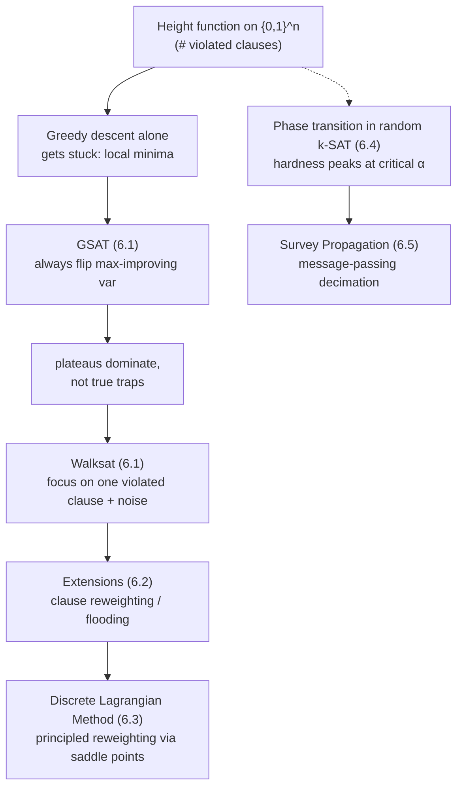

# Stochastic Local Search for SAT

[[book-guidelines|↩ Back to guidelines]]

## Giving up completeness on purpose

Every algorithm in [[Complete-Search-Algorithms-for-SAT|Chapter 3]] and every CDCL solver in [[Conflict-Driven-Clause-Learning|Chapter 4]] is built to answer two questions with certainty: "is this satisfiable" and, if not, "why not." That certainty is expensive — DPLL-style backtracking search on hard structured or random instances can blow up, and no amount of engineering removes the worst case, because SAT is NP-complete.

Chapter 6 is about a family of algorithms that simply refuses to answer the second question. An **incomplete method** for SAT is run with a resource budget; if it finds a satisfying assignment before the budget runs out, it reports success, and otherwise it reports failure — never "unsatisfiable." In complexity-theoretic language this is *one-sided error*: false negatives ("I couldn't find one") are allowed, false positives ("this is a solution" when it isn't) are not. This is the same trade-off your compiler's CSP kernel will eventually make: an abstract-interpretation pass over-approximates program semantics to *prove the absence* of bugs (two-sided soundness, no missed cases), while a counterexample-search pass can *efficiently prove the presence* of a bug by finding one concrete violating input and simply giving up if it can't — it never needs to prove there is no bug. Stochastic local search (SLS) is the canonical instance of that second mode, applied to SAT itself.

What you get for giving up completeness: on many formula classes — including some of practical interest, like graph-coloring encodings and circuit-design instances — local search finds solutions far faster than any systematic backtracking method of the same vintage. The chapter's own framing is worth keeping in your head throughout: local search and CDCL are *complementary* techniques with almost disjoint failure modes, not competing implementations of the same idea.

## The landscape view: SAT as a search for a global minimum

Before any algorithm, the book sets up the picture everything else is phrased in terms of. Take a CNF formula $F$ with $n$ variables and $m$ clauses. Every one of the $2^n$ truth assignments $x \in \{0,1\}^n$ gets a **height**:

$$\text{height}(x) = \#\{\, i : C_i \text{ is violated by } x \,\}$$

the number of clauses $x$ fails to satisfy. This turns $\{0,1\}^n$ into a discrete landscape — imagine the hypercube of assignments with a violation-count sticking up out of each vertex. Satisfying assignments are exactly the points with height $0$, i.e. the global minima of this landscape. SAT-solving becomes: find a global minimum of an implicitly-defined, exponentially large function, using only local moves (flip one variable at a time).

This immediately generalizes to **MAX-SAT** for free: the global minima of the same landscape are the best possible truth assignments even when the height can't reach zero. Every SLS algorithm in this chapter doubles as a MAX-SAT heuristic just by returning the lowest-height assignment it ever saw — though verifying that assignment is actually *optimal* for MAX-SAT is itself NP-hard, so this only gives you a two-sided-error heuristic for MAX-SAT, not a certificate.

**What would make this landscape easy:** if it had no local minima, plain greedy descent (always flip the variable that decreases height the most) would solve SAT outright, since you'd never get stuck short of the global minimum. It doesn't — every formula of practical interest has local minima — and the entire research program of this chapter is about *characterizing and escaping* them cheaply, rather than avoiding them by construction.



## GSAT: greedy descent, and why it doesn't get stuck the way you'd expect

**GSAT** [Selman, Levesque, Mitchell 1992] starts from a uniformly random assignment $\sigma$ and repeatedly flips the single variable whose flip produces the greatest decrease (possibly negative — "greatest decrease" also covers "least bad increase" when nothing improves) in the number of unsatisfied clauses, for up to `max-flips` steps, and restarts from a new random assignment for up to `max-tries` tries:

$$
\textbf{GSAT}(F):\quad
\begin{aligned}
&\textbf{for } i = 1 \text{ to max-tries}:\\
&\quad \sigma \leftarrow \text{random assignment}\\
&\quad \textbf{for } j = 1 \text{ to max-flips}:\\
&\qquad \textbf{if } \sigma \models F: \textbf{ return } \sigma\\
&\qquad v \leftarrow \arg\max_{\text{var}} (\text{decrease in \#unsatisfied clauses from flipping it})\\
&\qquad \text{flip } v \text{ in } \sigma\\
&\textbf{return } \textsc{fail}
\end{aligned}
$$

The neighborhood of $\sigma$ here is exactly the $n$ assignments one Hamming-distance-1 away — this is what "local" means in "local search."

The surprising empirical finding — the reason this chapter exists at all — is that GSAT rarely gets trapped the way a naive analysis predicts. What actually happens: a fast initial descent, followed by long stretches of **sideways moves** (flips that neither increase nor decrease the violation count). A maximal set of assignments connected by sideways moves is a **plateau**. GSAT spends most of its runtime wandering plateaus, not stuck at true local minima — Frank et al. observed that in practice almost every plateau has an *exit* to a lower plateau. Intuitively: in a 10,000-dimensional hypercube, a point with literally no improving or sideways neighbor at all (a genuine local minimum with no way out) is exponentially rare. High dimensionality is what saves greedy descent here — the same phenomenon that makes stochastic gradient descent work surprisingly well in high-dimensional continuous optimization has a discrete cousin on the Boolean cube.

**What breaks without the plateau structure:** if formulas typically had abundant strict local minima (points where every single flip strictly increases violations), GSAT would need a fundamentally different escape mechanism — simulated-annealing-style uphill acceptance, or full restarts, at a much higher rate than observed in practice. The fact that plateaus dominate over traps is an empirical, not a proven, property of the SAT landscape — which is exactly why the chapter treats it as a phenomenon to study (via depth/mobility/coverage, below) rather than a theorem.

## Walksat: focusing the flip choice

GSAT's plateau-wandering is still slow because it scans *all* $n$ variables at every step to find the best flip. **Walksat** [Selman, Kautz, Cohen 1993] fixes this by never considering all variables — it **focuses** on one violated clause at a time:

$$
\textbf{Walksat}(F,\ p):\quad
\begin{aligned}
&\textbf{for } i = 1 \text{ to max-tries}:\\
&\quad \sigma \leftarrow \text{random assignment}\\
&\quad \textbf{for } j = 1 \text{ to max-flips}:\\
&\qquad \textbf{if } \sigma \models F: \textbf{ return } \sigma\\
&\qquad C \leftarrow \text{a randomly chosen \emph{unsatisfied} clause}\\
&\qquad \textbf{if } \exists\, x \in C \text{ with break-count}(x) = 0: v \leftarrow x \quad \text{// "freebie" move}\\
&\qquad \textbf{else with prob. } p: v \leftarrow \text{random variable in } C \quad \text{// random-walk move}\\
&\qquad \textbf{else with prob. } 1-p: v \leftarrow \arg\min_{x \in C} \text{break-count}(x) \quad \text{// greedy move}\\
&\qquad \text{flip } v \text{ in } \sigma\\
&\textbf{return } \textsc{fail}
\end{aligned}
$$

The **break-count** of a variable is how many currently-satisfied clauses would become unsatisfied if you flipped it — the cost side of the ledger that GSAT's global arg-max implicitly weighs against the benefit side. A "freebie" move is a flip with zero cost: it fixes $C$ and breaks nothing. When no freebie exists, noise parameter $p \in [0,1]$ decides between a pure random walk step (ignore quality entirely, pick any variable in $C$) and a greedy step (pick the cheapest one to break).

The focusing idea — restrict every flip candidate to variables occurring in one violated clause, instead of all $n$ variables — is what makes this scale from hundreds to hundreds of thousands of variables. It traces back to Papadimitriou's $O(n^2)$-expected-time randomized algorithm for 2-SAT: pick any unsatisfied clause, flip a uniformly random variable in it, repeat. The proof idea is a one-dimensional random walk argument — fix a satisfying assignment $\bar\sigma$; every unsatisfied clause under $\sigma$ must contain some variable disagreeing with $\bar\sigma$ (else $\bar\sigma$ wouldn't satisfy it either — contradiction), so flipping a uniformly random variable of that clause reduces the Hamming distance $d(\sigma,\bar\sigma)$ with probability at least $1/2$ and increases it with probability at most $1/2$. That's a biased random walk on $\{0,\dots,n\}$ walking toward $0$, which by standard hitting-time bounds takes $O(n^2)$ steps in expectation. This is the *theoretical ancestor* of the focusing strategy, not Walksat itself — Walksat generalizes the idea to arbitrary $k$-CNF and adds the greedy/freebie machinery on top, losing the clean proof but gaining an enormous empirical speedup: at the empirically tuned noise $p \approx 0.57$ for random 3-SAT, Walksat scales roughly linearly in the clause-to-variable ratio $\alpha$ up to (and a bit past) $4.2$, short of the conjectured satisfiability threshold near $4.26$ (see §6.4 below).

One subtlety worth keeping precise, because it's the kind of "seemingly harmless heuristic actually changes the theory" fact that matters for anything you build on top of a local-search core: Knuth asked whether the freebie rule could make Walksat's search *incomplete* in a strong sense — Cohen exhibited a satisfiable instance on which the freebie rule provably cycles through a fixed set of unsatisfying assignments forever. It requires a delicate construction and is essentially never observed in practice, but it establishes that "always take the free move" is not a free-of-cost simplification from a completeness-in-the-limit standpoint — a reminder that greedy tie-breaking rules in any search procedure (SAT, CSP, unification) deserve the same scrutiny even when empirically they look harmless.

```rust
// A compact Walksat core. `Cnf` is Vec<Vec<i32>> with literals as signed
// variable indices (this mirrors the Vec<Clause> representation used for
// Chapter 3's DPLL). `assign` is the current truth assignment, 1-indexed.
fn break_count(cnf: &Cnf, assign: &[bool], var: usize) -> usize {
    let mut flipped = assign.to_vec();
    flipped[var] = !flipped[var];
    cnf.iter()
        .filter(|clause| is_satisfied(clause, assign) && !is_satisfied(clause, &flipped))
        .count()
}

fn walksat_step(cnf: &Cnf, assign: &mut Vec<bool>, p: f64, rng: &mut impl Rng) {
    let unsat: Vec<&Clause> = cnf.iter().filter(|c| !is_satisfied(c, assign)).collect();
    let clause = unsat[rng.gen_range(0..unsat.len())];
    let vars: Vec<usize> = clause.iter().map(|lit| lit.unsigned_abs() as usize).collect();

    let freebie = vars.iter().find(|&&v| break_count(cnf, assign, v) == 0);
    let flip_var = match freebie {
        Some(&v) => v,                                   // freebie move
        None if rng.gen::<f64>() < p => vars[rng.gen_range(0..vars.len())], // random walk
        None => *vars.iter().min_by_key(|&&v| break_count(cnf, assign, v)).unwrap(), // greedy
    };
    assign[flip_var] = !assign[flip_var];
}
```

The structural point to notice, for the CSP-kernel angle from the learning goals: this is a *randomized, incomplete, counterexample-hunting* procedure over a search space defined by violated constraints — exactly the shape you want for a fast first-pass "does a concrete input violate this invariant" check before falling back to a complete decision procedure (a CDCL-based SAT/SMT call, or exhaustive CSP backtracking) for the cases local search can't crack. It's cheap to bolt onto any domain where "count how many constraints are currently violated" is fast to compute incrementally — which is exactly true of clause violation counts, and would be true of a Horn-clause / invariant-violation count in an abstraction-refinement loop too.

## Extensions: clause reweighting and flooding

A second, independent line of improvement doesn't touch the move-selection logic at all — it changes the *objective*. Assign every clause a positive weight, minimize the sum of weights of unsatisfied clauses instead of their raw count, and dynamically increase the weight of a clause every time it's currently violated. Left long enough, any persistently-violated clause accumulates enough weight to overwhelm whatever plateau or local minimum was protecting it — this is called **flooding**: reweighting deforms the landscape until the current local minimum is no longer a minimum at all.

$$
\text{minimize } \sum_i w_i \cdot U_i(x), \qquad U_i(x) = \begin{cases} 0 & C_i \text{ satisfied by } x \\ 1 & \text{otherwise} \end{cases}
$$

Concrete systems in this family: **SAPS**/**RSAPS** (scaling-and-probabilistic-smoothing, with a reactive noise variant) and **PAWS** (pure additive weighting) are the two most cited; Schuurmans and Southey's **SDF** ("smoothed descent and flood") improved on plain additive schemes by reweighting multiplicatively, scoring moves by *how strongly* clauses are satisfied (count of satisfied literals, not just satisfied/violated), and periodically shrinking all weights back toward their mean so no clause's weight runs away permanently. Simpler earlier ideas in the same space: **TSAT** (a tabu list forbidding recently-flipped variables) and **HSAT** (tie-break in favor of the least-recently-flipped variable) — both help, but less than Walksat's random-walk noise does.

### Measuring search quality itself: depth, mobility, coverage

Schuurmans and Southey also proposed three measures for *evaluating* an SLS strategy, independent of which specific algorithm produced it — useful for you as diagnostic instrumentation on any local-search or counterexample-search loop you build, not just SAT:

- **Depth** — how low (how few violated constraints) the search gets and how long it *stays* near that depth. Good strategies dive fast and then linger near the bottom rather than bouncing back up.
- **Mobility** — how quickly the search moves to genuinely new regions of the space while still staying deep. High mobility at low depth is the combination you want: not stuck, but not thrashing back to bad regions either.
- **Coverage** — how systematically the whole space gets explored, measured as the largest Hamming-distance gap between any unvisited point and the nearest visited one. Low coverage-gap means the search isn't leaving giant unexplored regions behind.

The hypothesis this measurement framework supports: local search doesn't succeed because it has any special ability to *recognize* which basin contains a solution — it succeeds by descending fast, then moving broadly and systematically near the bottom until it stumbles onto one. There's no oracle-like insight anywhere in GSAT or Walksat; it's descend-and-explore, quantified.

## The Discrete Lagrangian Method: giving reweighting a theory

Section 6.2's reweighting schemes were largely ad hoc — reasonable heuristics without a derivation. Shang and Wah's **Discrete Lagrangian Method (DLM)** supplies exactly that derivation by importing continuous constrained-optimization machinery into the Boolean setting.

Cast SAT as constrained optimization with a *deliberately redundant* per-clause constraint:

$$
\text{minimize } N(x) = \sum_{i=1}^m U_i(x) \quad \text{subject to } U_i(x) = 0 \ \ \forall i \in \{1,\dots,m\}
$$

$N(x) \ge 0$ and $N(x)=0$ exactly when $x$ satisfies $F$ — so this objective is already the SAT height function from §6.1's landscape view. What's new is making every clause an *explicit constraint* on top of being a term in the objective. This redundancy looks strange at first — why constrain something you're already minimizing? — but it's the entire mechanism: it lets the search dynamically shift emphasis between "reduce the total violation count" and "fix this specific clause," and that shift is what the Lagrange multipliers encode.

Introduce one multiplier $\lambda_i$ per clause and form the **discrete Lagrangian**:

$$L_d(x,\lambda) = N(x) + \sum_{i=1}^m \lambda_i\, U_i(x)$$

A pair $(x^*,\lambda^*)$ is a **saddle point** — a local minimum in $x$, a local maximum in $\lambda$ — exactly when

$$L_d(x^*,\lambda) \le L_d(x^*,\lambda^*) \le L_d(x,\lambda^*)$$

for $\lambda$ near $\lambda^*$ and $x$ one flip away from $x^*$. The theorem that grounds this whole apparatus: $x^*$ is a locally optimal solution to the constrained SAT formulation *iff* some $\lambda^*$ makes $(x^*,\lambda^*)$ a saddle point. So the search target becomes "find a saddle point," not "find a global minimum" — and DLM finds one by alternating **descent in $x$, ascent in $\lambda$**, using a difference gradient $\Delta_x L_d(x,\lambda) \in \{-1,0,1\}^n$ (at most one nonzero entry — a single-variable flip) chosen to minimize $L_d$ over $x$'s one-flip neighborhood, including staying put:

$$
x(k+1) = x(k) \oplus \Delta_x L_d(x(k),\lambda(k)), \qquad
\lambda(k+1) = \lambda(k) + c\,U(x(k))
$$

At a fixed point ($x(k{+}1)=x(k)$ and $\lambda(k{+}1)=\lambda(k)$), every $U_i(x(k))$ must be $0$ — because any clause still violated would keep incrementing its own $\lambda_i$ by $c$ forever, contradicting a fixed point on $\lambda$. This is the formal reason clause reweighting *has to* eventually escape a spurious minimum: an unsatisfied clause's weight cannot stabilize while it remains unsatisfied. That's exactly the ad hoc "flooding" intuition from §6.2, now derived rather than assumed. Practical DLM variants add a tabu list (avoid re-flipping recently touched variables) and periodic decay of $\lambda$ (prevent runaway weights); Wu and Wah's follow-up work identified **traps** — $(x,\lambda)$ pairs where every one-flip move of $x$ *increases* $L_d$ despite unsatisfied clauses remaining — and showed that tracking which clauses recur inside traps (not just which clauses are violated overall) and selectively boosting *their* multipliers escapes traps that plain uniform reweighting cannot.

The general shape here — *turn a hard combinatorial constraint-satisfaction problem into an unconstrained optimization by folding constraints into a penalty/multiplier term, then alternate primal descent with dual (multiplier) ascent to a saddle point* — is the discrete-optimization cousin of Lagrangian relaxation techniques you'll meet again if your CSP kernel's domain/lattice propagation ever needs to handle soft constraints or a weighted-CHC objective rather than pure hard satisfiability.

## Phase transitions and Survey Propagation, briefly

Section 6.4 explains *why* random SAT became the 1990s testbed that motivated all of the above: for random $k$-CNF with clause-to-variable ratio $\alpha = m/n$, instance hardness peaks sharply around a critical $\alpha$ (empirically $\approx 4.26$ for random 3-SAT), and the same $\alpha$ marks a satisfiability phase transition — almost all formulas below it are satisfiable, almost all above it are not, and the transition sharpens as $n$ grows (the "easy-hard-easy" curve). Chvátal and Szemerédi's result that unsatisfiable random $k$-CNF formulas almost surely require exponential-size resolution refutations gives a formal underpinning for why *every* DPLL-style method (not just weak ones) struggles in the over-constrained region near threshold — which is precisely the region where the local-search methods of this chapter were first shown to have an edge. The exact threshold constant is still not proven to exist as $n \to \infty$ for $k=3$ (best bounds known: satisfiable below $\approx 3.52$, unsatisfiable above $\approx 4.51$); it's a fully rigorous, closed-form result only for random 2-SAT, where the transition sits exactly at $\alpha = 1$.

Section 6.5 covers **Survey Propagation** (Mézard, Parisi, Zecchina, 2002), an incomplete method derived from the statistical-physics "cavity method" for spin glasses. SP iteratively passes local messages to approximate marginal probabilities over the solution space, then greedily fixes the most confidently-determined variables and simplifies (an approach called *SP-inspired decimation*) — behaviorally similar to DPLL's incremental variable assignment, but almost never needing to backtrack. This is notable because computing those marginals is believed #P-complete (strictly harder than SAT's NP-completeness) in general, yet SP approximates them efficiently enough on random instances near threshold to solve formulas with a million-plus variables in near-linear time — currently the only known method to do so in that regime. Braunstein and Zecchina later showed SP's update equations are equivalent to belief-propagation equations over a class of combinatorial objects called *covers*, connecting this physics-derived technique back to standard probabilistic graphical-model inference. Its success remains largely confined to random instances; extending it to structured, real-world formulas is flagged in the book as an open challenge.

## Where this leads

Local search and CDCL are presented as genuinely complementary, not competing: CDCL's clause learning is fundamentally *global* (a learned clause prunes the whole remaining search, wherever it recurs), while SLS's flip choices are fundamentally *local* and structure-blind — which is exactly why SLS can win on formulas where CDCL's clause-learning machinery has little useful structure to exploit (dense random instances near the SAT/UNSAT threshold), and lose badly where CDCL's learned clauses capture real problem structure (most industrial/structured encodings). Chapter 6's closing question — can systematic and local-search techniques be combined into one solver with the best of both — is still open in the book's own telling, and the DLM saddle-point framework here is one of the more principled attempts at this from the local-search side.

For the compiler project: the landscape/height-function view of §6's introduction, and DLM's constraint-as-penalty-plus-multiplier construction in particular, are close conceptual relatives of what a **CEGAR-style counterexample search** needs from its CSP kernel — a fast, incomplete, "try to falsify this invariant right now" procedure that runs *before* an expensive complete decision procedure (a CDCL-based SAT/SMT solver, or full backtracking over the CSP's domain constraints) is invoked to either confirm unsatisfiability or refine the abstraction. Depth/mobility/coverage (§6.2) is directly reusable as instrumentation for diagnosing *why* such a fast counterexample search is or isn't finding violations on a given class of programs — the same three questions ("is it getting deep enough," "is it exploring new regions," "is it leaving gaps") apply to any violated-constraint-count landscape, Boolean or otherwise.
