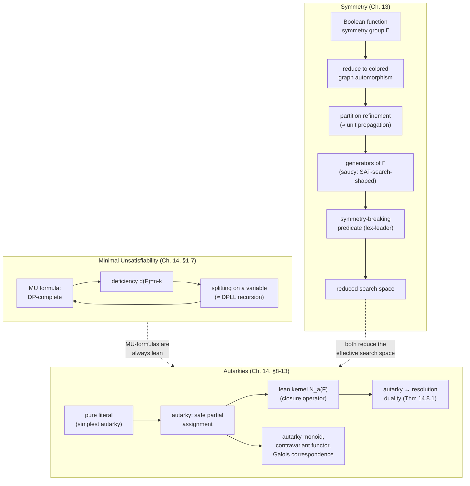

[[book-guidelines|↩ Back to guidelines]]

## Why a chapter about *redundancy*

Every SAT solver is, at bottom, a search over an exponentially large space of truth assignments. Two entirely different phenomena can make that space smaller than it looks, and this pair of chapters is about both of them.

The first phenomenon is **symmetry**: sometimes the search space contains large blocks of assignments that all "look the same" to the formula — swap two variables, flip a couple of polarities, and you get an equally-satisfying (or equally-falsifying) assignment. A backtracking solver that doesn't know this will dutifully re-explore every symmetric copy of a failed subtree, paying an exponential price for information it already had.

The second phenomenon is **safe partial commitment**: sometimes you can *decide* the value of a whole block of variables before search even starts, with a proof that this decision can never break satisfiability — no matter what the rest of the formula says. That's an autarky. Its evil twin, minimal unsatisfiability, characterizes formulas that have shed every possible redundancy in the other direction: delete *any* clause and the contradiction disappears.

Both ideas are about *not doing work you don't have to do* — one by skipping symmetric copies of the search, the other by skipping variables whose fate is already sealed. They also turn out to be dual to each other in a precise technical sense (Theorem 14.8.1 below), which is one of the nicer surprises in this material.

## Part I — Symmetry and Satisfiability

### 1. What a symmetry of a Boolean function is

Take the function $f(a,b,c) = \bar a bc + a\bar b c$ (Sakallah's running example, §13.1). Swap $a$ and $b$:

$$f(b,a,c) = \bar b ac + b\bar a c = a\bar b c + \bar a bc = f(a,b,c)$$

The function doesn't notice the swap — it comes back to itself. That's a **symmetry**: a transformation of the inputs that leaves the function's truth table pointwise unchanged. The book identifies three flavors, all combinations of *permuting* variables and *negating* (complementing) them:

- **variable symmetry** — permute variables only (e.g. swap $a \leftrightarrow b$),
- **value symmetry** — negate variables only (e.g. $a \leftrightarrow \bar a$),
- **mixed symmetry** — both at once.

For the example above, four transformations preserve $f$: do-nothing, swap $a,b$, negate both $a$ and $b$, and swap-and-negate. Composing any two of these (apply one, then the other) always lands you back inside that same set of four — this is not a coincidence, it's the defining property of a **group**.

**What breaks without this framing:** if you only checked symmetries one at a time, ad hoc, you'd have no way to know when you'd found *all* of them, nor any compact way to represent a symmetry group that might have $10^{19}$ elements (Table 13.7 in the book reports a benchmark graph with over $10^{19}$ automorphisms found in fractions of a second). Group theory gives you both a completeness argument and a compression scheme (generators) for free.

### 2. Just enough group theory to proceed

A **group** $\langle G, * \rangle$ is a set closed under an associative binary operation, with an identity element and inverses for every element (Def. 13.3.1). The four transformations above form a group of order 4 — in fact the **Klein 4-group**, where every non-identity element is its own inverse.

Three facts from this theory carry the whole rest of the chapter:

1. **Lagrange's theorem** (Thm. 13.3.1): the order of a subgroup divides the order of the group. This is why the search-tree decomposition in §6 below (stabilizer subgroups) is guaranteed to terminate cleanly.
2. **Generators** (Def. 13.3.8): a small subset $H \subseteq G$ that, closed under $*$, reconstructs all of $G$. An irredundant generator set for a finite group $G$ has *at most* $\log_2 |G|$ elements (Thm. 13.3.3) — so a group with $10^{19}$ elements can, in principle, be described by around 63 permutations. This is the entire reason symmetry detection is computationally feasible at all: you never enumerate the group, you find a small generating set for it.
3. **Group action and orbits** (Def. 13.3.12, Thm. 13.3.6): a group $G$ acting on a set $S$ (here, $S$ = the $2^n$ truth assignments) partitions $S$ into equivalence classes called **orbits**. Two assignments in the same orbit are truth-value-equivalent under the formula — checking one checks them all.

If you've internalized Rust's trait system, a group action is exactly a `impl Fn(Assignment) -> Assignment` for each group element, subject to the laws `apply(identity, s) == s` and `apply(g1, apply(g2, s)) == apply(compose(g1, g2), s)` — a monoid action, specialized to invertible endomorphisms:

```rust
trait GroupElement: Clone {
    fn identity() -> Self;
    fn compose(&self, other: &Self) -> Self; // g1 * g2
    fn inverse(&self) -> Self;
}

trait Acts<S>: GroupElement {
    fn act(&self, s: &S) -> S;
}

// Orbit of `s` under the (finite) group generated by `gens`.
fn orbit<G: Acts<S> + Eq + std::hash::Hash, S: Clone + Eq + std::hash::Hash>(
    gens: &[G],
    s: &S,
) -> std::collections::HashSet<S> {
    let mut seen = std::collections::HashSet::new();
    let mut frontier = vec![s.clone()];
    seen.insert(s.clone());
    while let Some(cur) = frontier.pop() {
        for g in gens {
            let next = g.act(&cur);
            if seen.insert(next.clone()) {
                frontier.push(next);
            }
        }
    }
    seen
}
```

This closure-under-generators computation (BFS over group elements applied to a seed point) is literally the same shape as reachability analysis over a transition relation — the same fixpoint pattern your abstract-interpretation invariant generator will use, just with permutations instead of program states.

### 3. The symmetry group of a CNF formula

A CNF formula's symmetries live in the group $N_n \rtimes P_n$ (a *semidirect product*, Def./Eq. 13.10) — negations of the $n$ variables' literals, semidirect-producted with permutations of the $n$ variables, so that composing a negation with a permutation still respects **Boolean consistency**: if literal $\dot x$ maps to $\dot y$, then $\dot x'$ (its negation) must map to $\dot y'$ (Eq. 13.9). $\Gamma_\varphi$, the symmetry group of formula $\varphi$, is a subgroup of $N_n \rtimes P_n$.

Here's the sharp and important point (§13.4, Table 13.6): **the same Boolean function can have wildly different symmetry groups depending on which equisatisfiable CNF you write down.** Only *unique* representations (the full set of maxterms, or the complete set of prime implicates) are guaranteed to expose a function's full *semantic* symmetry; an arbitrary equivalent CNF exposes only some subgroup of it — possibly just the identity. Encoding choice matters for symmetry exploitation exactly the way it matters for solver performance in general (cf. the CNF-encodings topic).

### 4. Detecting symmetries by reduction to colored graph automorphism

Rather than search $N_n \rtimes P_n$ directly, the chapter reduces symmetry detection to an already well-studied problem: **automorphism of a colored graph** (Def. 13.5.1) — permutations of a graph's vertices that preserve both edges and a given vertex coloring.

The reduction (§13.6) builds a graph with $m + 2n$ vertices from an $m$-clause, $n$-variable formula:

- one **color-0 vertex** per clause,
- one **color-1 vertex** per literal ($2n$ of them: $n$ positive, $n$ negative),
- an edge from a clause vertex to each literal vertex it contains,
- an edge between each variable's positive and negative literal vertices (the Boolean-consistency edge).

Using one shared color for all literals detects *mixed* symmetries; splitting positive/negative literals into two colors isolates *variable* symmetries; giving every variable's literal pair its own color isolates *value* symmetries. The colors are what stop the automorphism search from confusing clauses with literals, or positive literals with negative ones — this is the graph-automorphism analogue of a type system's role in a unification search: the coloring is a *sort discipline* that prunes structurally impossible mappings before you even look at the edges.

The workhorse subroutine is **partition refinement** (Def. 13.5.2–13.5.3): start with the color partition, and repeatedly split any cell containing two vertices with different degree-profiles relative to the other cells, until no more splits are possible (a *stable* / *equitable* coloring). If refinement collapses everything to singleton cells, the graph has no symmetry beyond the identity; otherwise, the surviving non-singleton cells are candidates that must be checked by branching. **This is exactly unit propagation's role in DPLL** — cheap, complete-when-it-terminates-in-a-discrete-state inference that gets you as far as possible before you're forced to make an arbitrary choice (branching on a target vertex, standing in for a decision literal).

### 5. Symmetry-breaking predicates — and why the naive version is useless

Once you have the symmetry group $\Gamma_\varphi$ (or, practically, a generating set for it), the goal is to add a filter that keeps exactly one representative assignment per orbit. Order the $2^n$ assignments as unsigned integers and, for each permutation $\pi \in \Gamma_\varphi$, define the **permutation predicate**:

$$\mathrm{PP}(\pi; X) = \mathrm{leq}(X, X^\pi)$$

— true exactly when $X$ is numerically $\le$ its image under $\pi$. Conjoining $\mathrm{PP}(\pi;X)$ over every $\pi \in \Gamma_\varphi$ (Eq. 13.16) gives a **symmetry-breaking predicate (SBP)** $\rho(\Gamma_\varphi; X)$ true only for the numerically-smallest ("lex-leader") assignment in each orbit. Conjoin this onto the original formula and you can search only the reduced space.

Here's the catch (§13.7, Table 13.10): converting a single $\mathrm{PP}(\pi;X)$ to CNF naively costs $O(n^2)$ literals, and you need one such predicate *per group element* — and symmetry groups are routinely of order $10^{20}$ or more. The SBP can dwarf the original formula and defeat its own purpose. The book's fix (§13.7.1) exploits the *sparsity* of practical symmetry generators: most bits of a permutation are fixed points (tautological, hence droppable), most cycles have a redundant "last bit" once you track equality along the cycle, and any bit after a phase-shift ($x_i \leftrightarrow \bar x_i$) makes everything before it moot. Filtering these out and chaining the survivors as a linear implication chain gets you from quadratic to **linear** predicate size in the support of the generator — the same "eliminate the tautological cases, then chain what's left" move that turns a naive constraint encoding into a sequential-counter encoding.

**Key relaxation:** you don't need to break *all* symmetries to win — breaking a *generating set*'s worth is already enough to eliminate most of the redundant search, and it's exponentially cheaper. This "good enough, not complete" tradeoff recurs everywhere search-space reduction meets computational cost — it is the same tradeoff your CSP kernel will face when deciding how much domain propagation to do per node versus how much to leave to search.

### 6. `saucy`: SAT-search ideas, turned back on graph automorphism

The chapter's genuinely surprising turn (§13.8): trying to run *existing* graph-automorphism tools (`nauty`) on the huge sparse graphs that CNF symmetry detection produces exposed a mismatch — `nauty` was built for small dense graphs, not million-vertex sparse ones. The fix was to redesign the automorphism search using the architecture of a SAT solver itself:

| SAT solver concept | `saucy`'s analogue |
|---|---|
| partial variable assignment | **ordered partition pair (OPP)**, Def. 13.8.1: a pair of ordered partitions of the same vertex set, compactly representing a *set* of permutations |
| decision (pick a variable, assign a value) | pick a **target cell**, pick a **target vertex** in it, map it to a vertex in the corresponding bottom-partition cell |
| unit propagation / BCP | simultaneous **partition refinement** of the top and bottom partitions after each mapping decision |
| conflict (opposing assignment) | a **non-isomorphic** OPP (top/bottom partitions no longer have matching cell sizes) — provably no valid permutation exists down this branch |
| satisfying assignment | a **matching** OPP — corresponds to a whole *set* of automorphisms at once, found without full branching |
| backtracking | resume search after a non-isomorphic OPP is hit |

On top of this SAT-shaped search tree, group theory supplies two further pruning rules unavailable to ordinary SAT search: **coset pruning** (once you've found one automorphism witnessing that a branch is a coset of an already-known stabilizer subgroup, you can stop — you don't need every element of the coset, just one representative) and **orbit pruning** (skip any target-vertex mapping whose target is already known to be in an established orbit). Restricting the left-most branch of the tree to always be the identity mapping decomposes the automorphism group into a chain of **stabilizer subgroups** (Fig. 13.14) — a direct algorithmic use of Lagrange's theorem from §2 above: each level's group order is computable as (parent orbit size) × (child stabilizer order), bottom-up.

The payoff (§13.8.4): a graph with **11 million variables, 33 million clauses, 32+ million graph vertices** processed in about 231 seconds; 93% of the full 2009 SAT-competition benchmark set solved in under one second. This is the strongest empirical argument in the chapter that "exploit structure, don't brute-force it" scales to real industrial instances, not just toy examples.

## Part II — Minimal Unsatisfiability

### 7. Definition and why deciding it is *harder* than SAT itself

A CNF formula $F = \{f_1,\dots,f_n\}$ is **minimally unsatisfiable (MU)** if it's unsatisfiable, but removing *any single* clause $f_i$ makes the rest satisfiable (Def. 14.1.1) — every clause is load-bearing for the contradiction. This is a strictly stronger structural claim than "unsatisfiable": deciding membership is **$DP$-complete** (Thm. 14.1.1), where $DP$ is the class of problems expressible as the *difference* of two NP problems ($X \setminus Y$, both $X, Y \in \mathrm{NP}$). Here $X$ = "removal of any clause yields satisfiability" and $Y$ = "is satisfiable"; MU is exactly $X \setminus Y$.

Why this matters for a checker/verifier project: $DP$ sits one notch above NP in apparent difficulty, and it's exactly the complexity class you land in whenever a property is phrased as *"P holds, and moreover Q fails"* — which is precisely the shape of many minimality/irredundancy checks you'll want for **minimal unsatisfiable-core extraction** (MUS) in a verification-condition-generation pipeline: not just "these Horn clauses are contradictory" but "and no proper subset is."

### 8. Deficiency: counting your way to structure

The **deficiency** of a formula, $d(F) = n - k$ (clauses minus variables, Def. 14.2.1), is a strikingly effective structural parameter. The **maximal deficiency** $d^*(F) = \max\{d(G) : G \subseteq F\}$ looks at the worst sub-formula. Two clean facts anchor the whole theory:

- **Every MU-formula has $d(F) > 0$** — you always need strictly more clauses than variables to force a contradiction that can't be locally patched. (Intuition: think of the variable-clause incidence as a bipartite structure; a contradiction needs "more constraints than degrees of freedom," the CNF analogue of an over-determined linear system.)
- **$\mathrm{MU}(k)$ (fixed deficiency $k$) is decidable in polynomial time** (Thm. 14.2.1), yet **$\text{sup-MU}(k)$** — "does $F$ *contain* an $\mathrm{MU}(k)$ sub-formula?" — **is NP-complete**. Recognizing a fixed global structural signature is easy; detecting its *hidden local presence somewhere inside* a bigger formula is not. This is a pattern worth internalizing generally: a property being poly-time-checkable at the whole-object level says nothing about how hard it is to find a witness sub-object with that property buried inside a larger one — exactly the gap between "is this Horn-clause system satisfiable" and "does some sub-conjunction of these Horn clauses already contradict."

A CNF formula's **variable-clause matrix** (rows = variables, columns = clauses, entries $+/-/0$) makes deficiency and structure visually legible — for MU(1), the "basic matrix" recursive construction (§14.2.2) gives an exact structural characterization (every MU(1) formula is, up to renaming, one of these matrices), while for $k \ge 2$ only partial characterizations are known. This kind of matrix view is the same representation used for constraint-graph / hypergraph structural tractability arguments — worth keeping in your CSP toolbox.

### 9. Splitting: the recursive backbone of MU-theory

Given $F \in \mathrm{MU}$ and a variable $x$, the **splitting** operation (Def. 14.2.2) partitions $F$'s clauses into those containing $x$, those containing $\bar x$, and a shared part $C$ untouched by either, then produces two smaller formulas $F_x$ and $F_{\bar x}$ — both still in MU. Crucially (§14.2.1, properties 1–3): $d(F_x), d(F_{\bar x}) \le k$ whenever $d(F) = k$, and under mild conditions the deficiency strictly *decreases* on both branches. This is structurally identical to the DPLL recursion $F[x{=}1] \lor F[x{=}0]$, except here it's a *proof device about formula structure* rather than a satisfiability-search step — most of the polynomial-time results about $\mathrm{MU}(k)$ (§14.2–14.3) are proved by induction on this splitting, bottoming out at the fully-characterized $\mathrm{MU}(1)$ base case.

## Part III — Autarkies: partial assignments that provably can't hurt

### 10. The definition, and the safety guarantee it buys you

A **partial assignment** $\varphi$ is a map from some subset of variables to $\{0,1\}$; applying it to a clause-set $F$ (written $\varphi * F$, §14.8.1) removes every clause it satisfies and strips falsified literals from the rest. An **autarky** for $F$ (Def. 14.8.2) is a partial assignment that, whenever it *touches* a clause (shares a variable with it), *satisfies* that clause — for every sub-clause-set of $F$, not just $F$ itself:

$$\varphi \text{ is an autarky for } F \iff \forall C \in F:\ \mathrm{var}(\varphi) \cap \mathrm{var}(C) = \emptyset \ \lor\ \varphi \models C$$

The payoff is the whole point: **applying an autarky never changes satisfiability status.** If $\varphi * F$ is satisfiable, so is $F$ (any extension of a satisfying assignment for the reduced formula works). And because $\varphi \ast F \subseteq F$ (autarkies never *create* new clauses), if $F$ is satisfiable, so is $\varphi \ast F$. Either direction is safe — you can commit to $\varphi$'s values with zero risk, *before search even begins*, and simplify the formula for free.

The book distinguishes this from a **weak autarky** ($\varphi \ast F \subseteq F$, checked only against $F$ itself, not every sub-clause-set — Def. 14.8.2, Example 14.8.2). Weak autarkies are not inherited by sub-clause-sets, which makes them a fragile, non-compositional notion; the "real" autarky is the one that survives restriction to any subset, which is exactly what makes autarkies compose cleanly (property 3, §14.8.2: if $\varphi,\psi$ are both autarkies for $F$, so is $\psi \circ \varphi$).

### 11. Pure literals: the autarky you already knew

A **pure literal** — one whose complement never appears in $F$ — gives an autarky "for free": setting it to true can never falsify any clause it touches, because no clause containing its complement even exists (Example 14.8.3). Pure-literal elimination, a classical DPLL preprocessing rule everyone already knows, is *the simplest possible case* of autarky reduction. Everything in §14.9–14.11 is a generalization of this one familiar trick along several independent axes: *how much of the formula the assignment needs to see* (pure vs. matching vs. linear vs. balanced autarkies, §14.11), and *how the reduction composes* (the autarky monoid, next section).

```rust
/// A clause-set restricted to i32 literals (positive = var, negative = ¬var).
type Clause = Vec<i32>;
type ClauseSet = Vec<Clause>;

/// Checks whether the partial assignment `phi` (var -> bool, using i32 keys)
/// is an autarky for `f`: for every clause it touches, it must satisfy it.
fn is_autarky(phi: &std::collections::HashMap<i32, bool>, f: &ClauseSet) -> bool {
    f.iter().all(|clause| {
        let touches = clause.iter().any(|&lit| phi.contains_key(&lit.abs()));
        if !touches {
            return true; // untouched clauses are fine
        }
        clause.iter().any(|&lit| {
            phi.get(&lit.abs())
                .map_or(false, |&v| v == (lit > 0))
        })
    })
}
```

Note the shape: this is a `∀ clause. ¬touches ∨ satisfies` check — structurally the same "vacuous or discharged" pattern as a Hoare-logic weakest-precondition check over a guarded command list, where each guard either doesn't apply to the current path or must be discharged by the postcondition.

### 12. Lean clause-sets and the lean kernel

A clause-set is **lean** (Def., §14.8.3) if it admits *no* nontrivial autarky — no partial assignment can be safely peeled off. Lean clause-sets are exactly the ones that have already had every possible autarky-reduction applied; $\varnothing$, every minimally unsatisfiable formula, and clause-sets closed under extended resolution's extension rule are all lean.

Repeatedly applying autarky reduction to *any* $F$ (confluently — order doesn't matter) bottoms out at the **lean kernel** $N_a(F)$: the largest lean sub-clause-set of $F$. Equivalently, $F \setminus N_a(F)$ is the largest *autark subset* — the part of the formula that some autarky can fully discharge. $N_a$ behaves exactly like a **closure/kernel operator** in the lattice-theoretic sense you already know from abstract interpretation: $N_a(F) \subseteq F$, monotone ($F \subseteq G \Rightarrow N_a(F) \subseteq N_a(G)$), and idempotent ($N_a(N_a(F)) = N_a(F)$) — the same algebraic shape as a Galois-connection closure operator on your abstract domain.

### 13. The autarky–resolution duality

Here's the theorem that ties Parts II and III together (Thm. 14.8.1):

> The lean kernel $N_a(F)$ consists of *exactly* the clauses of $F$ that can appear in *some* (dead-end-free, tree-form) resolution refutation of $F$. Equivalently: a clause $C \in F$ can be discharged by some autarky **iff** $C$ can never appear in any resolution refutation of $F$.

Intuitively: if an autarky satisfies a clause, the "witness" literals it sets true can never disappear along the path from that clause to the empty clause in a refutation — resolution can't cancel out a literal that's true under a fixed assignment without eventually hitting a clause that isn't falsified, i.e. never reaching $\bot$ down that path. So clauses discharged by autarkies are *provably useless* for proving unsatisfiability, and — this is the sharp direction — the theorem says the converse holds too: *every* clause not usable in a refutation is discharged by *some* autarky.

This is directly relevant to your proof-certificate and trusted-kernel work: **computing the lean kernel is a method for finding the minimal unsatisfiable "core" of clauses your proof actually needs** — precisely the redundancy-elimination step a proof-producing solver (DRAT-style, per the neighboring "[[Proofs-of-Unsatisfiability|Proofs of Unsatisfiability]]" chapter) wants to perform before emitting a checkable certificate. Autarky-finding and resolution-refutation-finding are, quite literally, two search problems for the same underlying structural fact, viewed from opposite ends.

### 14. The autarky monoid — a functor, and a Galois connection

Two structural results in §14.9 are worth flagging by name for anyone thinking categorically about elaborators and unification:

- **Autarkies compose to form a monoid** $\mathrm{Auk}(F)$ (§14.9.2) inside the ambient monoid of all partial assignments $(\mathrm{PASS}, \circ, \varepsilon)$ — associative composition, identity element $\varepsilon$ (the empty assignment). Composition of two autarkies for the same $F$ is again an autarky (§14.8.2, property 3); more generally if $\varphi$ is an autarky for $F$ and $\psi$ an autarky for $\varphi * F$, then $\psi \circ \varphi$ is an autarky for $F$ — a **Kleisli-composition-shaped** law, the same "compose across an intermediate reduced state" pattern you'll recognize from chaining substitutions in a unification algorithm.
- **The formation of the autarky monoid is a *contravariant functor*** (Lemma 14.9.3, §14.9.5): homomorphisms between clause-sets pull back to homomorphisms between their autarky monoids, but with the arrow direction reversed. If you've internalized "functor" as a Rust `trait Functor<F> { fn map(...) -> F<B> }"`-shaped idea, this is the same idea one level more abstract — $\mathrm{Auk}(-)$ turns a map $F \to G$ into a map $\mathrm{Auk}(G) \to \mathrm{Auk}(F)$, exactly like how a presheaf or a "consumer" type turns morphisms around.
- **Galois correspondences** appear explicitly in §14.9.6, connecting autarky-theoretic closure operators to the general Galois-connection framework — the same abstract machinery underlying abstract-interpretation Galois connections between concrete and abstract domains. If your CSP/abstract-interpretation kernel ever needs a principled notion of "safely committable partial information that composes," autarky theory is a fully worked-out instance of exactly that pattern, independently developed in the SAT literature.

The chapter goes on (§14.11) to define weaker, more efficiently-checkable *autarky systems* — pure autarkies (pure literals, generalized), matching autarkies (checkable via bipartite matching), linear autarkies (checkable via linear algebra over the clause-variable matrix), and balanced autarkies — trading completeness (finding *the* lean kernel) for tractability (finding *some* useful safe reduction in polynomial time). This mirrors, almost exactly, the tradeoff between complete and incomplete abstract domains in program analysis: a cheaper, sound-but-incomplete autarky detector is still useful even though it won't always find the maximal safe reduction.

## Structural map of this topic



## Where this leads

Both halves of this topic feed forward into later handbook material rather than standing alone:

- **Symmetry breaking** is a *preprocessing* technique in the same family as Chapter 9's bounded variable elimination and blocked-clause elimination — all three trade formula-transformation cost for solver-search savings, and all three carry the same soundness discipline (equisatisfiable, not necessarily equivalent, transformations that must be inverted for solution reconstruction).
- **Deficiency-bounded tractability** ($\mathrm{MU}(k)$ in P) is a direct instance of the parameterized-complexity theme that Chapter 14 (Worst-Case Upper Bounds) and fixed-parameter tractability more broadly are built on — a structural parameter that's easy to compute but whose *fixed-value* classes are tractable while its *containment* classes are not.
- **The autarky/resolution duality** is the conceptual ancestor of core-extraction in modern proof-producing solvers (Chapter 15's DRAT/clausal proofs): finding the lean kernel *is* finding the part of the formula a certificate actually needs to cite.
- For the standing compiler/elaborator project: autarky theory is a fully-worked, independently-discovered instance of "safe partial commitment that composes associatively and admits a closure operator" — precisely the shape of problem your metavariable-unification and constraint-solving layers will keep re-encountering (safely committing a metavariable assignment without knowing the full constraint set yet, and proving that commitment can't later be undone). The functorial and Galois-connection framing in §14.9 is not decoration — it's the same abstract pattern your abstract-interpretation lattice work already uses, arrived at independently from a purely combinatorial starting point.
