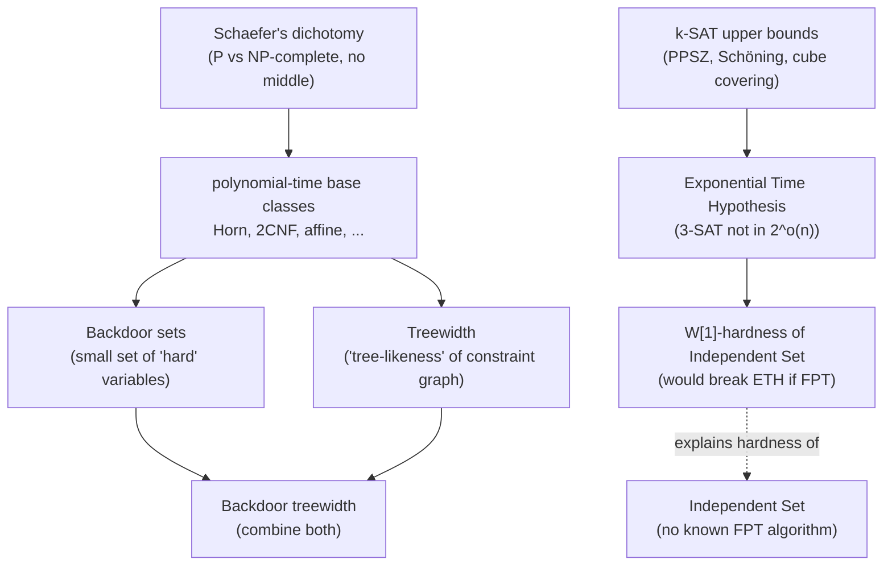

[[book-guidelines|↩ Back to guidelines]]

# Worst-Case Complexity and Tractability

## Why this chapter pair exists: two different answers to "how hard is SAT, really?"

SAT is NP-complete, full stop — that's Chapter 1's story. But "NP-complete" is a coarse, binary label, and it leaves two much sharper questions completely open. First: within the enormous space of all CNF formulas, are there large, easily-characterized *sub*-classes where the problem stops being hard at all — and can we draw a clean boundary between "easy" and "hard" instead of solving classes one at a time by hand? Second, orthogonally: for the formulas that really are worst-case hard, is the best you can do really $2^n$ brute force, or can you shave the exponent down, and by how much, provably?

Chapter 16 answers the second question — it's about *shaving the exponent* on the general, unrestricted problem. Chapter 17 answers a version of the first question, but recast in a much more powerful frame than "is this specific syntactic class in P or NP-complete": instead of a binary label per class, it assigns every formula a *number* — a parameter $\pi(F)$ measuring how much "hidden structure" the formula has — and asks whether hardness in $n$ can be traded for hardness in that number instead. Put together, these two chapters explain a fact that looks paradoxical from the outside: SAT is NP-complete, worst-case algorithms are all exponential in $n$, and yet real solvers rip through industrial instances with hundreds of thousands of variables in seconds. The answer is that "worst case in $n$" and "worst case in practice" are different axes, and this pair of chapters gives you the vocabulary to tell them apart precisely.

This is also, for your compiler/verifier project, the theoretical vocabulary that explains *why* a CSP kernel searching for counterexamples over program variables can be fast in practice on instances with thousands of nominal variables — the connection is not "SAT solvers are magic," it's "real instances have small values of *some* structural parameter," and this chapter catalogs which parameters have that property and which provably don't.

---

## Part 1: Schaefer's dichotomy theorem — no partial credit between P and NP-complete

### What breaks without a general tractability criterion

You already know isolated facts: 2-SAT is in P (linear time, even), 3-SAT is NP-complete, Horn-SAT is in P. But these look like a scattered pile of special cases, discovered one at a time by ad-hoc algorithms. Is there a unifying reason some restrictions collapse to P while others stay hard? Could there be some *intermediate* class of constraint satisfaction problems, neither polynomial nor NP-complete — the way, in classical complexity theory, we suspect graph isomorphism might sit strictly between P and NP-complete? Schaefer's theorem (1978) answers "no, for exactly this kind of restriction, in exactly this way": every possible restriction, when phrased as a *Boolean constraint satisfaction problem*, sorts cleanly into one of only two bins, with no third bin.

### The formal setup: constraints instead of clauses

The book generalizes clauses to arbitrary Boolean *constraints*. A **Boolean constraint of arity $k$** is just any function $\varphi : \{\text{true},\text{false}\}^k \to \{\text{true},\text{false}\}$ — a truth table, nothing more. A **constraint application** $\varphi(x_1,\dots,x_k)$ pairs such a function with a sequence of variables (repeats allowed). Given a finite set $C$ of constraint types, $\mathrm{SAT}(C)$ is the decision problem: given a finite set $\Phi$ of applications of constraints from $C$, is there a truth assignment satisfying all of them simultaneously?

This is a strict generalization of CNF-SAT: an ordinary $k$-clause is just the constraint "not all of these $k$ literals are false," and picking $C = \{$"$x \lor y$", "$x \lor \lnot y$", "$\lnot x \lor \lnot y$", "false"$\}$ recovers exactly 2-SAT as $\mathrm{SAT}(C)$. This constraint-based framing is precisely the language of Constraint Satisfaction Problems in the CSP-solving sense — Schaefer's theorem is, read a certain way, the founding dichotomy result of the entire "CSP tractability" research program that later grew into the Feder–Vardi conjecture and its eventual resolution (Bulatov, Zhuk, 2017) for CSPs over arbitrary finite domains, not just Boolean ones. If you are ever reasoning about which fragments of a constraint language your CSP kernel can decide efficiently versus which force full search, this is the theorem that tells you such boundaries can in principle be *total* — every constraint language falls on one side or the other, there's no messy middle to worry about missing.

### Theorem 16.2.1 (Schaefer's dichotomy theorem)

Let $C$ be a set of Boolean constraints. Then $\mathrm{SAT}(C)$ is in P if $C$ satisfies **at least one** of six structural properties, and NP-complete otherwise:

1. Every constraint in $C$ evaluates to true when all arguments are true ("trivially true-satisfiable").
2. Every constraint in $C$ evaluates to true when all arguments are false ("trivially false-satisfiable").
3. Every constraint in $C$ can be expressed as a Horn formula (at most one positive literal per clause).
4. Every constraint in $C$ can be expressed as a dual-Horn formula (at most one negative literal per clause).
5. Every constraint in $C$ can be expressed as a 2-CNF formula.
6. Every constraint in $C$ can be expressed as an affine formula (a conjunction of linear equations mod 2).

The proof's structural shape is worth internalizing even without chasing every detail: it classifies sets of constraints by which operations they're closed under (conjunction, substituting constants for variables, existential quantification), and shows that any set closed under these operations either satisfies one of (3)–(6) or is powerful enough to express *every* Boolean constraint — meaning it can simulate general 3-SAT and is therefore NP-hard. There's no room left over for a class that's closed under these operations but expresses "some but not all" constraints in a way that dodges both outcomes. That closure argument — not case-by-case verification — is *why* the dichotomy is total.

### Why each "easy" case is actually easy: linear-time witnesses

Each of the six properties comes with its own concrete polynomial algorithm, not just an abstract promise:

- **Trivially satisfiable formulas** (properties 1–2): a clause with at least one positive literal is satisfied by an all-true assignment; symmetric for all-negative-literal clauses and all-false. Nothing to compute.
- **Horn formulas** (property 3): repeatedly apply unit propagation. If you derive the empty clause, unsatisfiable; otherwise every surviving clause has at least one negative literal, so all-false trivially satisfies what's left, and hence the original formula. This is linear time using data-flow techniques — and it's exactly the fixpoint-propagation algorithm every abstract interpreter already implements for Horn-clause-shaped invariant checking.
- **Dual-Horn formulas** (property 4): the mirror image — unit-propagate, fall back to all-true.
- **2-CNF formulas** (property 5): build the *implication graph* — each clause $a \lor b$ becomes two directed edges $\lnot a \to b$ and $\lnot b \to a$ (a 2-clause is really two implications glued together). $F$ is unsatisfiable iff some variable $x$ and its negation $\lnot x$ lie in the same strongly connected component. Since SCCs are computable in linear time (Tarjan), 2-SAT is decidable in linear time. This is the sharpest illustration in the whole chapter of "clause length is a phase transition in tractability": go from length 2 to length 3, and the elegant graph-reachability argument disappears — a 3-clause $a \lor b \lor c$ can't be decomposed into a pair of binary implications the same way, because satisfying it doesn't pin down a two-way implication between any fixed pair of its literals.
- **Affine formulas** (property 6): a linear equation $x_1 \oplus \cdots \oplus x_k = \delta$ over $\mathrm{GF}(2)$; solve the whole system by Gaussian elimination.

### Rust sketch: 2-SAT via implication-graph SCCs

The SCC-based 2-SAT algorithm is exactly the kind of "small polynomial-time base solver" your CSP kernel would want as a building block for backdoor-set exploitation (Part 3 below):

```rust
struct TwoSat {
    n: usize,
    // implication graph over 2n nodes: node 2*v = var v true, 2*v+1 = var v false
    adj: Vec<Vec<usize>>,
}

impl TwoSat {
    fn new(n: usize) -> Self {
        TwoSat { n, adj: vec![Vec::new(); 2 * n] }
    }

    // literal encoding: positive x -> 2*x, negative ¬x -> 2*x+1
    fn add_clause(&mut self, lit_a: i64, lit_b: i64) {
        let (a, na) = Self::encode(lit_a);
        let (b, nb) = Self::encode(lit_b);
        // (a ∨ b)  ==  (¬a → b)  and  (¬b → a)
        self.adj[na].push(b);
        self.adj[nb].push(a);
    }

    fn encode(lit: i64) -> (usize, usize) {
        let v = (lit.unsigned_abs() - 1) as usize;
        if lit > 0 { (2 * v, 2 * v + 1) } else { (2 * v + 1, 2 * v) }
    }

    // is_satisfiable: run Tarjan/Kosaraju SCC, then check no var
    // and its negation share a component. (SCC computation omitted for brevity —
    // the point is that this whole check is linear in clauses + variables.)
    fn is_satisfiable(&self, scc_id: &[usize]) -> bool {
        (0..self.n).all(|v| scc_id[2 * v] != scc_id[2 * v + 1])
    }
}
```

The satisfying assignment, when one exists, falls out of the SCC *topological order* directly (assign $x$ true iff $x$'s component comes after $\lnot x$'s in reverse topological order) — no search, no backtracking, just graph algorithms. This is the cleanest possible illustration of "structure collapsing exponential search into polynomial computation," which is the theme the rest of this article generalizes.

---

## Part 2: Chasing the exponent — best known bounds for $k$-SAT and general SAT

### What breaks without better-than-$2^n$ algorithms

Brute force tries all $2^n$ assignments. That bound is correct but useless as an engineering target — it tells you nothing about *which* exponential algorithms are better than others, and whether the exponent can be pushed down at all. Chapter 16's second half surveys the actual arms race to shrink that exponent, first for $k$-SAT (where the fixed clause length gives you real leverage) and then for general SAT (by reducing it to many $k$-SAT instances).

### Critical clauses and the PPSZ algorithm

The key structural insight: in a satisfying assignment that's *isolated* in a strong sense (flipping any one of $j$ specific variables breaks it — call this **$j$-isolated**), each of those $j$ variables must appear in a **critical clause**: a clause satisfied only by that variable's specific literal. If you assign variables one at a time in random order, whenever a critical clause's *principal variable* happens to get assigned last among the clause's variables, unit propagation determines its value "for free" — you didn't have to guess it. The PPSZ algorithm (Paturi–Pudlák–Saks–Zane) formalizes this: augment the formula with bounded-size resolvents first (to expose more critical clauses), then repeatedly apply unit propagation and randomly assign remaining literals.

**Theorem 16.3.1.** PPSZ solves $k$-SAT in time $|F|^{O(1)} \cdot 2^{n(1 - \mu_k/(k-1) + o(1))}$, where $\mu_k$ is an increasing sequence with $\mu_3 \approx 1.227$ and $\lim_{k\to\infty}\mu_k = \pi^2/6$.

### Schöning's random-walk algorithm

A completely different idea: start from a random assignment, and whenever some clause is unsatisfied, flip a *random* variable from that clause. Model this as a one-dimensional random walk toward a fixed satisfying assignment $S$ — each step moves closer to $S$ with probability at least $1/k$ (because any unsatisfied clause has at least one variable disagreeing with $S$). The Ballot theorem gives:

**Theorem 16.3.2 ([Sch02]).** Schöning's algorithm solves $k$-SAT in time $|F|^{O(1)} \cdot (2 - 2/k)^n$.

For $k=3$ this is $O(1.334^n)$ — a genuinely different bound-shape than PPSZ's, and combining the two ideas (critical clauses *and* random walks) gets the current best randomized 3-SAT bound of $O(1.323^n)$.

### Cube covering: derandomizing the random walk

Random walks are easy to analyze but hard to derandomize directly. The **cube-covering** approach replaces "random starting points, random walks" with a deterministic cover of the Boolean hypercube $\{0,1\}^n$ by Hamming balls of a carefully chosen radius $R = n/(k+1)$, then exhaustively searches each ball (a bounded-depth recursion, not a random walk). Covering the cube efficiently — getting close to the information-theoretic *sphere-covering bound* $2^{n(1-H(R/n))}$ — is itself a nontrivial coding-theory problem, solved via block decomposition of the coordinates. This gives a fully deterministic $|F|^{O(1)} \cdot (2 - 2/(k+1))^n$-time algorithm (Theorem 16.3.3) — worse than the randomized bounds, which is the recurring pattern in this literature: derandomization is possible, but costs you exponent.

### Lifting $k$-SAT bounds to general SAT: clause shortening

The chapter's cleverest reduction handles formulas with unbounded clause length by **shortening** every long clause: given a clause longer than some threshold $k$, either (a) pick any $k$ of its literals and drop the rest, or (b) falsify exactly those $k$ literals across the whole formula. Case (a) covers "the clause is satisfied by one of the surviving literals"; case (b) covers "it's satisfied by one of the dropped literals," recursively invoked. This dichotomy (Schuler's algorithm, later sharpened by Calabro–Impagliazzo–Paturi) yields:

**Theorem 16.4.1.** If $k$-SAT is solvable in time $|F|^{O(1)} \cdot 2^{\alpha n}$, then SAT is solvable in time $|F|^{O(1)} \cdot 2^{\alpha n + 4m/(2^{\alpha k})}$ for any $n,m,k$ with $m \ge n/k$.

Optimizing $k$ as a function of $m/n$ gives the currently best bound for unrestricted SAT: $|F|^{O(1)} \cdot 2^{n(1 - 1/O(\log(m/n)))}$ — an exponent that shrinks (slowly) as the formula gets denser, because denser formulas give the shortening trick more leverage.

### Summary table (currently best known bounds, Section 16.6)

| Problem | Randomized | Deterministic |
|---|---|---|
| 3-SAT | $1.323^n$ | $1.473^n$ |
| $k$-SAT | $2^{n(1-\mu_k/(k-1)+o(1))}$ | $(2-2/(k+1))^n$ |
| SAT | $2^{n(1-1/O(\log(m/n)))}$ | $2^{n(1-1/O(\log(m/n)))}$ |

### How large is the exponent, provably? The Exponential Time Hypothesis

Given a zoo of $2^{\alpha n}$ bounds, a sharper question: can $\alpha$ be pushed to $0$ — i.e., is there a *subexponential* algorithm for $k$-SAT? The **Exponential Time Hypothesis (ETH)** is the conjecture that 3-SAT is *not* solvable in $2^{o(n)}$ time. What makes this more than a restatement of "P ≠ NP, probably" is that the chapter develops a genuine completeness theory around it, using **SERF-reductions** (subexponential reduction families) — reductions tight enough to preserve subexponential-time solvability, unlike ordinary polynomial-time reductions, which are much too coarse for this purpose. **Theorem 16.5.1** shows (3-SAT, $n$) and (3-SAT, $m$) are SERF-complete for the class SNP, meaning: if *any* problem in this broad class (which includes most natural NP-complete problems, including all of $k$-SAT for every $k$) has a subexponential algorithm, so does 3-SAT, and vice versa. ETH is therefore a single hypothesis that, if true, pins down the "hardness scale" for an entire universe of combinatorial problems simultaneously — this is exactly the kind of conditional lower bound your verifier's CHC/Horn-clause solving will eventually need to reason about when arguing "this reachability check can't be sped up below such-and-such, unless ETH fails."

A genuinely subtle further result: **Theorem 16.5.4 ([IP01])** shows $s_k \le (1-\Omega(k^{-1}))s_\infty$ where $s_k$ is the infimum exponent for $k$-SAT — i.e., assuming ETH, the sequence of $k$-SAT exponents is *strictly increasing infinitely often*. Harder clauses really do make the problem harder in a provable, quantitative sense, not just an empirical one.

---

## Part 3: Fixed-parameter tractability — recasting "hidden structure" as a number

### What breaks without a two-dimensional complexity measure

Here is the discrepancy Chapter 17 opens with, stated bluntly: the trivial $2^n$ bound for SAT is believed unimprovable to $2^{o(n)}$ (that's ETH from Part 2), yet SAT solvers routinely dispatch industrial instances with hundreds of thousands of variables in seconds. Something about *real* instances makes them easy that has nothing to do with $n$ — some "hidden structure" that classical, one-dimensional complexity theory (which measures everything purely as a function of input size) has no vocabulary to describe. Parameterized complexity, initiated by Downey and Fellows in the late 1980s, is exactly the missing vocabulary: measure problem instances along *two* axes, input size $n$ and a structural parameter $k$, and ask whether the exponential cost can be entirely confined to the second axis.

### The core distinction: where does $k$ live in the running time?

This is the single most important conceptual point in the chapter, so it's worth stating with maximum precision:

- **Non-uniform polynomial time**, $O(n^k)$: $k$ sits in the *exponent*. Even for the deceptively small $k=10$ and $n=1000$ variables, $n^{10} = 10^{30}$ — utterly infeasible, despite technically being "polynomial."
- **Fixed-parameter tractable (uniform) time**, $O(f(k) \cdot n^c)$ for some computable $f$ and constant $c$ independent of both $n$ and $k$: $k$ sits *only* inside $f$, which can grow arbitrarily (even exponentially) in $k$ without touching the polynomial part's degree. $O(2^k n^3)$ stays practical as long as $k$ stays small, *regardless of how large $n$ gets* — the class of instances you can handle doesn't shrink as the instance grows, only as the parameter grows.

Moving $k$ *out of the base of the polynomial* and into a separate multiplicative factor is the entire trick. It's the difference between "this scales badly as instances grow" (true of $n^k$) and "this scales badly only if the hidden structure itself is large" (true of $2^k n^3$) — and for problems whose real-world instances tend to have small hidden structure, that's the difference between infeasible and routine.

A parameterized problem instance is a pair $(I, k)$. **FPT** is the class of parameterized problems solvable in $O(f(k)|I|^c)$ time. The chapter's running illustration is **Vertex Cover (VC)**, parameterized by cover size $k$: a bounded search tree branches on each edge $uv$ into "$u$ is in the cover" / "$v$ is in the cover," decrementing $k$ each time, giving $O^*(2^k)$ (the current best is $O^*(1.2738^k)$, via kernelization — shrinking the instance via polynomial-time reduction rules to a size bounded purely by $k$, the **problem kernel**). Contrast this with **Independent Set (IS)**, same parameterization, no known FPT algorithm — and strong complexity-theoretic evidence (the **W-hierarchy**, built from **fpt-reductions**, which restrict how the parameter itself can be transformed, unlike ordinary poly-time reductions) that none exists: FPT-tractability of IS would imply a $2^{o(n)}$-time algorithm for 3-SAT, contradicting ETH. This is the chapter's explicit bridge back to Part 2 — parameterized intractability and ETH are two views of the same underlying hardness.

**Why SAT itself is different from VC or IS:** unlike vertex cover, which has one obvious natural parameter (cover size), SAT has *no single canonical parameter*. This isn't a weakness of the theory — it's precisely why parameterized SAT is a rich research program rather than a single theorem: the field's job is to propose and compare many candidate parameters (backdoor size, treewidth, and others below), each capturing a different notion of "hidden structure," and to map out which admit FPT algorithms and which are provably W-hard.

### Graphs associated with a CNF formula

Both of the two major parameter families below (backdoors and treewidth) are ultimately defined in terms of graphs built from the formula's syntactic structure:

- **Primal graph** $G(F)$: one vertex per variable; edge between two variables if they co-occur in some clause.
- **Incidence graph** $G^*(F)$: bipartite — one side variables, one side clauses; edge whenever a variable occurs (positively or negatively) in a clause.
- **Dual graph** $G^d(F)$: one vertex per clause; edge between two clauses if they share a variable.

These are exactly the kind of graph-theoretic view of a constraint system your CSP kernel's propagation engine needs anyway (which variables interact through which constraints) — the parameters below are just formal measures of how "spread out" or "tree-like" that interaction structure is.

### Backdoor sets: paying for structure with a small number of "hard" variables

**Definition (strong $C$-backdoor set).** Fix a **base class** $C$ of formulas closed under isomorphism, with polynomial-time membership *and* satisfiability testing (e.g. Horn, 2-CNF). A set $B \subseteq \mathrm{var}(F)$ is a **strong $C$-backdoor set** of $F$ if *every* truth assignment $\tau : B \to \{0,1\}$ leaves a restriction $F[\tau]$ that belongs to $C$. A **weak** $C$-backdoor set only requires *some* assignment $\tau$ to leave a restriction in $C$ that is itself satisfiable.

If you know a strong $C$-backdoor set $B$ of size $k$, satisfiability of $F$ reduces to checking at most $2^k$ polynomial-time-solvable instances in $C$ — an $O^*(2^k)$ fixed-parameter algorithm in the parameter $k = b_C(F)$ (smallest strong-backdoor size). This is the direct formalization of an idea you may already recognize from [[Runtime-Variation-and-Solver-Engineering|Runtime Variation and Solver Engineering]]'s treatment of backdoors as an *empirical/heuristic* phenomenon exploited by restarts and randomization: here the same concept is studied as a formal complexity-theoretic parameter, with theorems about exactly which base classes make *finding* such a set itself tractable. (That article's focus is solver engineering — restarts, heavy tails, algorithm configuration; this one's is the underlying tractability question those techniques are implicitly betting on.)

The catch is that finding a backdoor set of size $\le k$ is not automatic just because backdoor sets exist — trying all $\binom{n}{k}$ subsets gives only an XP algorithm, and whether *detection* is itself FPT depends delicately on the base class $C$:

| Base class $C$ | $\mathrm{VER}(b_C)$ (find strong backdoor) | Notes |
|---|---|---|
| Horn, 2CNF | **FPT** (Thm 17.4.1) | via vertex cover / 3-hitting-set on the positive primal graph |
| $0$/$1$-Val | FPT (polynomial, even) | smallest deletion backdoor computable directly |
| RHorn (renamable Horn) | strong: **W[1]-hard**; deletion: **FPT** (Thm 17.4.7) | strong backdoors strictly more general than deletion ones here |
| QHorn | **FPT** for deletion backdoors (Thm 17.4.9), via fixed-parameter approximation | strictly generalizes RHorn and 2CNF |
| UP, PL, UP+PL ("DPLL subsolvers") | **W[P]-complete** (Thm 17.4.6) | strong negative result — essentially no better than brute force |

Two structural lessons worth internalizing from this table. First, **weak backdoor detection is systematically harder than strong**: $\mathrm{SAT}(wb_C)$ is W[1]-hard for every $C$ in Schaefer's tractable list (Theorem 17.4.5), even though the corresponding *strong* backdoor detection is FPT for Horn and 2CNF — knowing that *some* assignment lands you in the easy class is a fundamentally weaker kind of witness than knowing *every* assignment does, computationally. Second, and more surprising: making the base class *bigger* (UP+PL properly contains Horn, and is exactly what a DPLL solver's polynomial-time "subsolver" decides) can make backdoor *detection* strictly harder, even though it makes the base class itself more powerful — bigger easy-classes are not free; you pay for them in how hard it becomes to certify that a formula reduces to that class. This is a caution directly relevant to invariant-generation design: a more expressive "cheap" abstract domain isn't automatically a win if finding the right small witness set for it becomes intractable.

**Rust sketch: reducing Horn-backdoor detection to Vertex Cover.** Because Horn is *clause-induced* (closed under taking clause subsets) and strong Horn-backdoor sets coincide exactly with *deletion* Horn-backdoor sets (Lemma 17.4.3), finding one reduces to a vertex cover computation on the **positive primal graph** — variables joined by an edge whenever they co-occur *positively* in some clause:

```rust
struct Formula { clauses: Vec<Vec<i64>> } // literal: +v or -v

fn positive_primal_graph(f: &Formula, n_vars: usize) -> Vec<Vec<usize>> {
    let mut adj = vec![Vec::new(); n_vars];
    for clause in &f.clauses {
        let positives: Vec<usize> =
            clause.iter().filter(|&&l| l > 0).map(|&l| (l - 1) as usize).collect();
        // any two co-occurring positive literals become an edge:
        // a Horn-backdoor set must "cover" every such pair (else that
        // clause could retain two positive literals after restriction).
        for i in 0..positives.len() {
            for j in (i + 1)..positives.len() {
                adj[positives[i]].push(positives[j]);
                adj[positives[j]].push(positives[i]);
            }
        }
    }
    adj
}
// A minimum vertex cover B of this graph is exactly a smallest strong
// (== deletion) Horn-backdoor set: every clause with two positive literals
// has at least one of them "cut" by B, leaving <=1 positive literal, i.e. Horn.
```

This is a genuinely useful pattern for your project: **the choice of base class determines which classical FPT algorithm you get for free** (vertex cover, hitting set, ...) — designing a good abstract domain for invariant generation is, structurally, the same move as designing a good backdoor base class: cheap to test membership, cheap to test satisfiability internally, and — crucially, per the table above — cheap to *detect* whether a given instance reduces to it.

### Treewidth: measuring how "tree-like" the constraint graph is

Backdoor sets attack hardness by finding a *small set of hard variables*; treewidth attacks it from the opposite direction, by measuring how close the *whole* interaction graph is to being a tree — because trees admit trivial dynamic programming, and "almost a tree" (bounded treewidth) still does, just with a bigger constant.

**Definition (tree decomposition).** A tree decomposition of a graph $G=(V,E)$ is a tree $T=(V',E')$ with a labeling $\chi : V' \to 2^V$ (each tree node gets a "bag" of graph vertices) such that: (1) every vertex appears in some bag; (2) every edge has both endpoints together in some bag; (3) for each vertex $x$, the set of tree nodes whose bag contains $x$ forms a *connected subtree* (the "running intersection" property). The **width** is $\max_t |\chi(t)| - 1$; the **treewidth** of $G$ is the minimum width over all its decompositions. A graph has treewidth 1 iff it's acyclic — so treewidth is a direct, quantitative measure of "how cyclic," generalizing "is a tree" to "is close to a tree."

Applied to CNF formulas via the three graphs above, this gives three formula-level notions: **primal treewidth** $\mathrm{tw}$, **incidence treewidth** $\mathrm{tw}^*$, and **dual treewidth** $\mathrm{tw}^d$. These are related but genuinely different: $\mathrm{tw}^*(F) \le \mathrm{tw}(F)+1$ and $\mathrm{tw}^*(F) \le \mathrm{tw}^d(F)+1$ always (incidence treewidth *dominates*), but the domination is strict — there exist formula families where incidence treewidth stays bounded at 1 while primal and dual treewidth grow arbitrarily large (Example 17.5.1: a single huge clause has primal treewidth $n-1$ but incidence treewidth $1$).

**Theorem 17.5.1 / 17.5.2.** $\mathrm{SAT}(\mathrm{tw})$ and the strictly more general $\mathrm{SAT}(\mathrm{tw}^*)$ are fixed-parameter tractable — $O^*(2^k)$ for incidence-treewidth $k$, via bottom-up dynamic programming over the tree decomposition: associate a table of "locally consistent" partial assignments with each bag, then propagate consistency up the tree, pruning rows that have no consistent extension in a child's table, exactly analogous to how a type checker propagates constraints bottom-up over an AST. Deciding whether treewidth is $\le k$ for constant $k$ is itself linear time (Bodlaender), so this whole pipeline — measure the parameter, then exploit it — is FPT end-to-end.

There are three genuinely different *proof techniques* for this result, and each teaches something distinct:

- **Courcelle's theorem** (monadic second-order logic meta-theorem): any graph property expressible in MSO is decidable in linear time on bounded-treewidth graphs. This is a sweeping, general-purpose hammer — SAT, 3-colorability, Hamiltonicity, and huge swaths of other NP-hard graph problems all fall out of one theorem, but the resulting algorithms are impractically slow (astronomically bad constants hidden in the "linear time"). This is exactly the tool your project's learning goals flag under Monadic Second-Order Logic and structural tractability: it's the theoretical ceiling on what bounded-treewidth reasoning can decide for free, even when a practical algorithm has to be built by hand instead.
- **Clause splitting**: reduce arbitrary CNF to 3-CNF by repeatedly splitting long clauses with fresh variables, but *respecting an ordering inferred from the tree decomposition itself* — done naively this can blow up incidence treewidth arbitrarily, but done carefully (the Splitting Lemma) it stays bounded, giving an FPT-reduction from $\mathrm{SAT}(\mathrm{tw}^*)$ to $\mathrm{SAT}(\mathrm{tw})$.
- **Direct dynamic programming** over "nice" tree decompositions (a normalized form with only introduce/forget/join node types) gives the practical $O^*(2^k)$ algorithm sketched above, and generalizes cleanly to *counting* models (#SAT), not just deciding satisfiability.

### Hybrid parameters: combining backdoors with treewidth

Backdoors and treewidth are genuinely **incomparable** parameters — you can build Horn formulas (backdoor size 0) with unbounded treewidth, and formulas with bounded treewidth but unbounded backdoor size — so a natural next move is combining them. **Backdoor treewidth** ([GRS17a]) parameterizes not by the *size* of a smallest strong $C$-backdoor set, but by the *treewidth of the torso graph* induced on a smallest such set (collapsing everything outside the backdoor set into direct edges between backdoor variables that remain connected through it). Knowing such a set of torso-treewidth $k$ lets you compile the rest of the formula into a bounded-treewidth CSP instance over just the backdoor variables — smaller parameter, same algorithmic payoff, for base classes Horn, Horn⁻, 2CNF (Theorem 17.6.2).

Two further families round out the chapter, briefly: **h-modularity** (Section 17.6.2) partitions the formula's clauses into tightly-interconnected "hitting communities" that are themselves easy (matched/hitting formulas), sparsely linked by a low-treewidth community graph — a formalization of "networked" instance structure, with #SAT FPT in the resulting parameter (Theorem 17.6.3). **Maximum deficiency** (Section 17.6.3) measures how far a formula is from being *matched* (every clause satisfiable independently via a distinct associated variable) — a matching-theoretic parameter, $O^*(2^k)$-tractable (Theorem 17.6.4) via a reduction procedure that shrinks deficiency at every branch of a DPLL-style search tree, and historically significant for characterizing minimally unsatisfiable formulas.

---

## Where this leads



Structurally, this pair of chapters sits underneath a large fraction of the rest of the book. The exponent-shaving algorithms of Chapter 16 (PPSZ, Schöning, clause shortening) are the theoretical ceiling that the practical DPLL/CDCL machinery of earlier chapters is implicitly trying to approach empirically; ETH is the conditional lower bound that makes "we probably can't do fundamentally better than exponential in $n$" a rigorous statement rather than a shrug. Chapter 17's parameters, in turn, are the formal explanation for *why* real solvers beat that worst case anyway — and its backdoor-set machinery is the theory underlying the empirical backdoor-exploitation and restart strategies covered in [[Runtime-Variation-and-Solver-Engineering|Runtime Variation and Solver Engineering]], and its treewidth machinery connects directly to the bucket-elimination/directional-resolution algorithms elsewhere in the book, where variable-elimination order determines whether a formula is solved in polynomial or exponential time along exactly the same treewidth axis.

For the compiler/verifier project, this is close to a direct blueprint for how to *justify*, not just observe, that your CSP kernel and CHC/Horn-clause solver will scale on real verification conditions despite worst-case exponential search: Schaefer's dichotomy tells you which fragments of your constraint language you can decide with a guaranteed-polynomial base solver (a Horn or 2-CNF core is exactly the shape of many refinement-type subtyping obligations); backdoor sets formalize the bet that "most of a verification condition's variables are boilerplate, only a few genuinely drive the case split" — precisely the abductive-reasoning intuition of finding a small set of relevant facts to refine a type or invariant; and treewidth formalizes the bet that the *dependency structure* of your program's variables (data-flow, control-flow, aliasing) stays close to tree-shaped even when the raw variable count is large — which is exactly the structural assumption abstract-interpretation lattice propagation and CHC solving over program graphs are implicitly relying on. Courcelle's MSO meta-theorem, in particular, is worth remembering by name: it's the theoretical result that says "if your program property can be phrased in monadic second-order logic over a bounded-treewidth control/data graph, it's decidable in linear time" — a ceiling worth knowing even when you end up hand-rolling a faster domain-specific algorithm instead.
