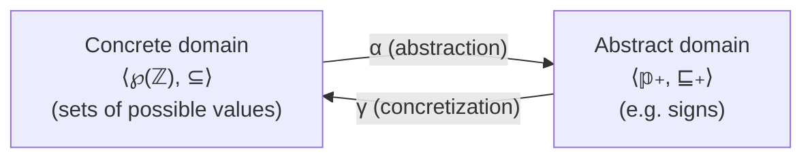

[[book-guidelines|↩ Back to guidelines]]

# Abstract Interpretation as a Unifying Theory

## The problem this theory exists to solve

Start with the thing every programmer already knows: debugging cannot prove a program correct. You run it on inputs, you watch for wrong answers, and you can only ever cover a finite sliver of the input space. Some properties aren't even checkable this way at all — Cousot's example is termination: you cannot debug your way to "this program never gets stuck in an infinite loop," because watching it run for a long time and not stopping proves nothing about whether it would stop on the next step.

This is not a minor gap. Cousot opens the book by pointing out that this gap kills people (Boeing 737 MAX) and costs companies enormously (Toyota's unintended-acceleration litigation), and that the legal response has largely been to disclaim liability rather than fix the underlying practice — software ships "as is," with no warranty that it's free of "bugs, errors, viruses, or other defects." His diagnosis: this is a *structural* problem with debugging as a method, not a matter of trying harder. What's needed is a way to reason about **all** executions of a program at once, not a finite sample of them — and a mathematical framework precise enough to say exactly what a given method for doing this can and cannot promise.

That framework is **abstract interpretation**. Its job is not to be one more analysis technique sitting alongside debugging and testing — it's to be the theory that explains *why* debugging is structurally limited, what a proof method or a static analyzer is actually claiming when it says "this program is correct" or "this program has no runtime errors," and how all of these methods (debugging, deduction, model checking, static analysis) relate to each other as different points on one spectrum of approximation.

## Soundness, completeness, incompleteness: what a formal method can promise

The book's Section 1.2 gives three words that recur throughout the entire text, so it's worth pinning them down precisely, in the book's own terms, before anything else:

- **Soundness**: the conclusions a method reaches about a program are *always correct*, under whatever hypotheses are explicitly stated. If a sound static analyzer says "this program never divides by zero," that's a guarantee — not a heuristic, not "probably."
- **Completeness**: *all true facts are provable* by the method. A complete method never has a blind spot; if the property genuinely holds, the method can always demonstrate it.
- **Incompleteness**: the honest acknowledgment of the *limits of applicability* of a formal method — the study of exactly where and why it fails to be complete.

Here's the asymmetry that makes this interesting rather than a truism: it turns out (and the book will prove this formally via undecidability, see below) that you basically cannot have soundness and completeness and full automation simultaneously for any interesting program property. Debugging sacrifices soundness for cheapness (it says "looks correct" but can be wrong, since it only samples). Abstract interpretation as a discipline is largely about being deliberate about *which* corner you give up, and proving precisely how much you gave up — rather than backing into an unsound or incomplete method by accident and not knowing it.

**What breaks without this vocabulary:** without a crisp notion of soundness, "my static analyzer found no bugs" is meaningless — it could mean "there are no bugs" or "my tool is too weak to find them" or "my tool is silently unsound and misses real bugs." Soundness is the property that makes a negative result (no error reported) actually mean something.

## Calculational design versus postulate-then-prove

This is arguably the book's most important methodological commitment, and it's worth understanding as a genuine fork in the road for how you'd build a static analyzer, not just a stylistic preference.

**The conventional way** (what the book calls "a posteriori soundness," see exercise 3.29 in Chapter 3) is: you invent an abstract analysis by intuition or experience — e.g., "let's track the sign of each variable" — implement it, and *then* try to prove, after the fact, that it's sound with respect to the real (concrete) semantics. This works, but it's fragile: nothing guided the design toward soundness, so the proof can fail, and when it does, you're debugging your *analysis design*, not just your proof.

**Calculational design**, which Cousot uses throughout the book (worked in full for the first time in Chapter 3, on sign analysis of arithmetic expressions), inverts the order. You:

1. Define the concrete semantics precisely (what the program actually computes).
2. Define the *collecting semantics* — the strongest possible property of that semantics (essentially, the exact set of all its behaviors).
3. Choose an abstract domain of properties you care about (e.g., signs: negative, zero, positive, and combinations) together with a **Galois connection** relating concrete and abstract properties (see below).
4. *Calculate* — by algebraic manipulation, not invention — the abstract semantics as the best sound overapproximation of the collecting semantics through that Galois connection.

The result, quoting the book's own conclusion on the sign-analysis case study: "It follows that $\mathcal{S}_\pm\llbracket A \rrbracket$ is sound by construction." Soundness isn't something you bolt on afterward and hope holds — it falls out of the derivation, because every step of the calculation is itself sound-preserving. This is the sense in which abstract interpretation is a *design methodology*, not just a family of analyses: given a semantics and a Galois connection, the abstract semantics is (in the best case) uniquely determined, not chosen by taste.

**What breaks without calculational design:** you can build an analyzer that looks reasonable, passes your test suite, and is nonetheless silently unsound on some input you never thought to try — a bug not in the implementation but in the mathematical design, which is much harder to find by testing than an implementation bug.

## The three main applications: semantics, proof methods, static analysis

Section 1.3 states, compactly, the three things the whole rest of the 1,100+ page book instantiates abstract interpretation *as*:

- **Semantics**: a formal definition of *all possible executions* of a program, "at various levels of abstraction." (The book will eventually build several: trace semantics, relational semantics, denotational semantics, and more — each one is itself an abstraction of a more concrete one.)
- **Proof methods**: techniques (manual, or via theorem provers) for proving that a program's semantics satisfies a *specification* — a property describing what the program is supposed to do.
- **Static analyzers**: programs that automatically extract properties of a program's semantics *using only the program text* — without ever running the program.

The unifying claim is that these three are not three separate subjects that happen to share some notation. A semantics is an abstraction of "the machine actually running the program, cycle by cycle." A proof method is a way of checking that one abstraction (the semantics) implies another (the specification). A static analyzer is a *computable, automated* abstraction that approximates the collecting semantics well enough to decide (or overapproximate) whether the specification holds — trading precision for decidability. Chapter 3's sign analysis is a miniature of exactly this whole story, worked in full: syntax → structural semantics → collecting semantics → sign abstraction → calculated, sound-by-construction static analyzer.

## The recurring abstraction recipe

Across the book this same four-step shape reappears at every level of abstraction — from sign analysis of a single expression up through relational domains over entire programs. It's worth naming explicitly because once you've seen it once, you'll recognize it everywhere in the later chapters:



1. **Concrete domain**: the space of exact, precise properties — for sign analysis, this is $\wp(\mathbb{Z})$, sets of integers, ordered by $\subseteq$.
2. **Properties as sets**: the book's Chapter 2 convention (used everywhere) is to represent "having property $P$" not as a logical formula but literally as set membership: $x$ has property $P$ iff $x \in P$. This is why abstraction can be phrased uniformly as a relation between *sets*, regardless of what domain you're in.
3. **Abstract domain**: a smaller, computer-representable space of properties of interest — for signs, $\mathbb{P}_\pm = \{\bot_\pm, {<}0, {=}0, {>}0, {\le}0, {\ne}0, {\ge}0, \top_\pm\}$, ordered by $\sqsubseteq_\pm$ (a Hasse diagram, isomorphic to the sign-properties-as-sets ordering by $\subseteq$).
4. **Concretization** $\gamma$: the map back from abstract to concrete, e.g. $\gamma_\pm({>}0) = \{z \in \mathbb{Z} \mid z > 0\}$ — what a given abstract value actually *means* concretely.

The formal glue is the **Galois connection**, Definition 3.40 in the book (stated first for signs, then generalized):

$$\langle \wp(\mathbb{P}), \subseteq \rangle \underset{\gamma}{\overset{\alpha}{\rightleftarrows}} \langle A, \sqsubseteq \rangle \quad \text{such that} \quad \forall P \in \wp(\mathbb{P}) . \forall a \in A . \; \alpha(P) \sqsubseteq a \Leftrightarrow P \subseteq \gamma(a)$$

The abstraction function $\alpha$ is the *lower adjoint*; concretization $\gamma$ is the *upper adjoint*. The defining property — $\alpha(P) \sqsubseteq a \Leftrightarrow P \subseteq \gamma(a)$ — is exactly what makes $\alpha(P)$ the **best** (most precise) sound overapproximation of $P$ in the abstract domain: it's sound because $P \subseteq \gamma(\alpha(P))$ always holds, and it's *best* because any other sound abstraction $a$ of $P$ (any $a$ with $P \subseteq \gamma(a)$) is necessarily weaker, $\alpha(P) \sqsubseteq a$. This "best abstraction" property is precisely what makes calculational design possible: rather than picking an abstract value by hand and checking it's sound, you *compute* $\alpha(P)$ and know by construction that nothing tighter is available.

The book is explicit that overapproximation is not the same as incorrectness: "the term approximate does not imply any possibility of incorrectness/unsoundness but rather a loss of information." Overapproximating the property "$2\mathbb{N}+1$" (odd naturals) by the sign "$>0$" throws away the "odd" information but keeps the "positive" information — soundly.

**Grounding — Rust.** This recipe maps cleanly onto a trait pair for a static-analysis pass:

```rust
// Concrete domain: exact sets of integers (unrepresentable at scale — this
// is what a real analyzer can never actually compute with).
type Concrete = std::collections::HashSet<i64>;

// Abstract domain: a small, finite lattice of signs.
#[derive(Clone, Copy, PartialEq, Eq, Debug)]
enum Sign { Bottom, Neg, Zero, Pos, NonPos, NonZero, NonNeg, Top }

trait GaloisConnection<C, A> {
    /// α: best (most precise) sound abstraction of a concrete set.
    fn alpha(concrete: &C) -> A;
    /// γ: concretization — what an abstract value actually denotes.
    fn gamma(abstract_val: &A) -> C;
}

impl GaloisConnection<Concrete, Sign> for Sign {
    fn alpha(concrete: &Concrete) -> Sign {
        // computed, not chosen by hand — the "best" abstraction is unique
        // given the concrete set, by the Galois connection's characteristic
        // property.
        let (mut has_neg, mut has_zero, mut has_pos) = (false, false, false);
        for &z in concrete {
            match z.signum() { -1 => has_neg = true, 0 => has_zero = true, 1 => has_pos = true, _ => unreachable!() }
        }
        match (has_neg, has_zero, has_pos) {
            (false, false, false) => Sign::Bottom,
            (true, false, false) => Sign::Neg,
            (false, true, false) => Sign::Zero,
            (false, false, true) => Sign::Pos,
            (true, true, false) => Sign::NonPos,
            (true, false, true) => Sign::NonZero,
            (false, true, true) => Sign::NonNeg,
            (true, true, true) => Sign::Top,
        }
    }
    fn gamma(a: &Sign) -> Concrete {
        // In a real analyzer this returns an (infinite) predicate, not a
        // materialized set — shown here only for illustration.
        unimplemented!("γ is conceptually a predicate, not literally enumerated")
    }
}
```

The trait boundary itself is the point: `alpha` is the only place where information is deliberately discarded, and it is total and computable, whereas the true "concrete semantics" it approximates generally is not (see Rice's theorem, below).

**Grounding — Lean.** Since this book's formalism *is* order/lattice theory, Lean's own library vocabulary is close to literal:

```lean
-- A Galois connection is exactly `GaloisConnection` in Mathlib's order theory:
-- α (l : α → β) is a lower adjoint to γ (u : β → α) when
-- ∀ a b, l a ≤ b ↔ a ≤ u b   — precisely 3.40's  α(P) ⊑ a ⇔ P ⊆ γ(a).
structure MyGaloisConnection (C A : Type) [Preorder C] [Preorder A] where
  alpha : C → A
  gamma : A → C
  adjoint : ∀ (c : C) (a : A), alpha c ≤ a ↔ c ≤ gamma a
```
Mathlib literally names this `GaloisConnection`, and its proof obligations are the same $\Leftrightarrow$ the book states — this is a case where the book's formalism and a proof assistant's standard library are, essentially, the same object under different names.

## Undecidability, Rice's theorem, and the three outcomes

Chapter 1 states the aspiration plainly: the "final goal is to check programs for correctness without ever omitting a case that might go wrong" — and immediately flags this as "the ultimate, perhaps unfeasible, and surely not fully automatizable" objective, pointing forward to Chapter 9. That forward reference is not a hedge; it's a precise claim the book proves.

**What breaks without this limit in mind:** if you don't know undecidability is coming, you'll eventually try to build a static analyzer that is sound, complete, *and* always terminates on every possible input program and property — and you will fail, not because you're not clever enough, but because no such analyzer can exist for any nontrivial property, by Rice's theorem (Chapter 9, Theorem 9.12). "Nontrivial" here means: some programs have the property and some don't (a property every program has, or no program has, is trivially decidable and uninteresting).

The corollary that matters most for practice is **Corollary 9.6** ("failures of algorithms 'solving' undecidable problems"), stated and proved in Chapter 9 but explicitly telegraphed back in Chapter 3 (remark 3.43, on why the sign analysis necessarily loses precision) and directly relevant to every static analyzer the book will go on to build:

> Let $A(P, d)$ be an algorithm to solve an undecidable problem on program $P$ for input data $d$. Assume the algorithm is *sound*: $A(P,d)$ correctly answers true, false, or fails — that is, answers "I don't know" or does not terminate. Then $A(P,d)$ must fail on infinitely many input data $d$.

The proof is a clean reductio: if $A$ failed only finitely often, you could patch it into a strictly better algorithm $A'$ that consults a finite lookup table of hand-verified answers for exactly those finitely-many failure cases and otherwise defers to $A$ — and $A'$ would then be a sound algorithm that *never* fails, deciding an undecidable problem, contradicting Turing's theorem outright.

This gives the precise shape of the "three possible outcomes" for *any* sound static analysis method checking a nontrivial semantic property:

1. **Correctly answers "yes"** — the property provably holds.
2. **Correctly answers "no"** — the property provably fails.
3. **Fails** — answers "I don't know" (an alarm / imprecision), or simply doesn't terminate.

And crucially: outcome 3 is not a design flaw to be engineered away. It is *mathematically forced* to occur infinitely often for any sound analyzer of a nontrivial property. The only real design freedom a static-analysis designer has is *where and how gracefully* outcome 3 shows up — as a conservative "maybe" alarm (the abstract-interpretation-style approach: overapproximate, and admit imprecision explicitly), as non-termination (unacceptable for a practical tool), or as unsoundness (silently answering wrong — which the corollary's proof explicitly excludes as "not real soundness"). This is exactly what happened concretely back in the sign-analysis case study: $\mathcal{S}_\pm\llbracket A \rrbracket$ is sound, but strictly weaker than the true collecting semantics $\mathcal{S}\llbracket A \rrbracket$ for infinitely many expressions (the book's example: $1 - 1 - 1 - \dots - 1$), precisely because $\mathcal{S}_\pm$ is *computable* and $\mathcal{S}$ is not.

**Grounding — Python**, as a minimal illustration of what "failing gracefully" looks like in code (not load-bearing, just the shape):

```python
from enum import Enum, auto

class Verdict(Enum):
    HOLDS = auto()      # outcome 1: proved true
    VIOLATED = auto()   # outcome 2: proved false
    UNKNOWN = auto()     # outcome 3: sound analyzer's honest "I don't know"

def check_property(program, prop) -> Verdict:
    # A sound analyzer NEVER returns HOLDS or VIOLATED incorrectly.
    # By corollary 9.6, for infinitely many (program, prop) pairs it is
    # mathematically forced to return UNKNOWN rather than loop forever.
    ...
```

## Where this connects: soundness relations, proof search, and your two projects

Reading this chapter with an eye toward the Rust verifier and the Lean-style elaborator, three threads are worth flagging explicitly, since they recur across the whole book (not just this chapter):

- **The Galois connection *is* the mechanism, not an ornament.** Any time your verifier's checker needs to soundly overapproximate a program property (e.g., which values a variable might take at a program point, for a Hoare-triple side condition), you are instantiating exactly this concrete-domain/abstract-domain/$\alpha$/$\gamma$ recipe. The "best abstraction" property is what will let you *calculate* your abstract transformers instead of hand-designing them and hoping they're sound — this is the single most transferable idea in the chapter for a from-scratch verifier.
- **Corollary 9.6 is the design contract for your alarm-handling logic**, not a footnote. Any sound checker embedded in your toolchain — the automated theorem prover, the elaborator's unifier when it can't resolve a metavariable — will have to fail gracefully and often; deciding what "fail" looks like (an explicit alarm, a request for a user-supplied hint, a controlled timeout) is not incidental engineering, it's mandated by this theorem for any nontrivial property you ask it to check.
- **Calculational design versus postulate-then-prove maps directly onto how you'll want to build the unifier.** A pattern-unification algorithm you invent and then try to prove sound after the fact is exactly the "a posteriori" path the book warns against; deriving it as the best sound abstraction of a more general (and undecidable) higher-order unification problem is the calculational path — slower up front, but the soundness proof is then structural rather than an afterthought.

## Where this leads

Chapter 1 is the map, not the territory — nearly everything named here gets built out formally later: Chapter 2 supplies the set-theoretic vocabulary ("properties are sets") this chapter leans on informally; Chapter 3 works the full calculational-design recipe end to end on a toy language; Chapters 7-8 generalize "collecting semantics" and its hierarchy of abstractions; Chapter 9 proves undecidability and Rice's theorem in full, including Corollary 9.6; Chapters 10-11 formalize posets, lattices, and Galois connections as general tools (not just for signs); and from Chapter 12 onward, every proof method (Hoare logic, invariance proofs) and every concrete static analysis (intervals, congruences, points-to, dependency, typing) in the rest of the book is presented as one more instance of exactly this same recipe: pick a concrete semantics, pick an abstract domain, get soundness for free from a Galois connection, and know in advance — via Rice's theorem — that some cases will have to come back "I don't know."
