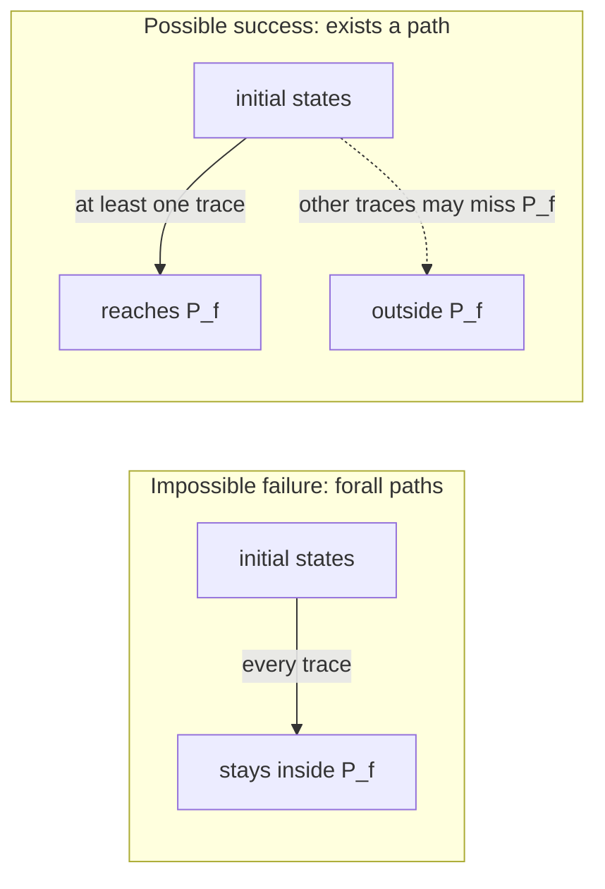

# Backward Accessibility Semantics

[[book-guidelines|↩ Back to guidelines]]

## The problem: reachability answers the wrong question for inputs

[[Forward-Reachability-Semantics|Forward reachability semantics]] answers "starting from these initial states, what states can execution reach?" That is exactly the question you want when you already have an initial condition and need to know what invariants hold downstream. But there is a mirror-image question that comes up constantly in practice: "I know (or want) something about a *later* state of the program — what must have been true *initially* for that to happen, or for it to be impossible to avoid?" That is not a reachability question, it is an **accessibility** question, and it runs in the opposite direction: from a condition on later states back to a condition on initial states.

Cousot opens chapter 50 with a tiny worked case that pins down exactly what "backward" means here. For the program $\ell_0\ \mathtt{y=1}\,; \ell_1\ \mathtt{x=x{-}y}\,;\ell_2$, asking "what must hold at $\ell_0$ for $x=y$ to hold at $\ell_2$?" is answered by reasoning in *reverse execution order*: $x=y$ at $\ell_2$ requires $x = 2y$ at $\ell_1$ (undoing the subtraction), which requires $x=2$ at $\ell_0$ (undoing nothing, since $y=1$ hasn't been assigned yet at $\ell_0$). This is precisely the shape of Dijkstra's weakest (liberal) precondition calculus — and the book is explicit that this style of reasoning is **abductive** ("infer $a$ to explain $b$"), in contrast to forward reachability's **deductive** character ("infer $b$ as a consequence of $a$"). If you have ever written a verifier that walks a postcondition backward through a straight-line program to synthesize a precondition, you have already done exactly this by hand.

## What breaks without a backward semantics

Suppose all you have is forward reachability. To find "which initial states avoid an error state $\mathrm{err}$," you would have to *guess* candidate initial conditions $\mathcal P_0$, run the forward semantics, and check whether $\mathrm{err}$ shows up in the result — a generate-and-test loop with no guarantee of finding the largest (most permissive) safe precondition, or even terminating the search. What you actually want is a semantics that takes the *undesirable target* as input and computes the precondition directly, once, compositionally, by structural recursion on the program the same way forward reachability does. That is what this chapter builds: not one but **two** dual backward semantics, because "what must hold initially" turns out to admit two genuinely different readings depending on whether you want a guarantee or merely a possibility.

## Two dual readings of "backward"

- **Impossible failure accessibility.** The set of initial states from which *every* execution can only ever reach states satisfying a given condition $\mathcal P_f$ — a *universal* guarantee ("no matter how nondeterminism resolves, you cannot escape $\mathcal P_f$"). This is the adjoint of the forward reachability semantics via a Galois connection.
- **Possible success accessibility.** The set of initial states from which *some* execution can reach a state satisfying $\mathcal P_f$ — an *existential* possibility ("there exists at least one way to get there"). This is the *conjugate* (complement dual) of impossible failure accessibility.

Both are backward: both take a condition on later states and produce a condition on initial states. They differ exactly the way $\forall$ differs from $\exists$, and — as section 50.8 makes precise — neither one subsumes the other; they answer different questions about the same program.

## Impossible failure accessibility: definition as an adjoint

The forward reachability semantics $\widehat{\mathcal S}^{\vec r}[\![S]\!]$ (the assertional form from chapter 19–20) maps a set of initial environments to the states reachable at each label. Because it *preserves arbitrary joins* — Theorem 19.36, the same fact that makes forward reachability a Kleene-iterable lower adjoint — it has a unique upper adjoint by the fundamental theorem of Galois connections. Corollary 50.2 names that adjoint the backward accessibility semantics:
$$
\big\langle \wp(\mathrm{Ev}^{\vec\varrho}), \subseteq \big\rangle \xrightarrow[\overleftarrow{\mathrm{pre}}^{\,\vec r}]{\widehat{\mathcal S}^{\vec r}[\![S]\!]} \big\langle \mathrm{labs}[\![S]\!] \to \wp(\mathrm{Ev}^{\vec\varrho}), \dot\subseteq \big\rangle .
$$
Because adjoints in a Galois connection are unique, this *defines* the impossible-failure backward semantics $\widehat{\mathcal S}^{\overleftarrow r}[\![S]\!]$ (I'll write it $\overleftarrow{\mathcal S}^{\,\mathrm{if}}[\![S]\!]$ for readability) without any further stipulation — there is exactly one semantics that makes the connection hold, and it is forced by the forward semantics you already have. Theorem 50.3 spells out its meaning directly:
$$
\overleftarrow{\mathcal S}^{\,\mathrm{if}}[\![S]\!]\,\mathcal P_f = \widetilde{\mathrm{pre}}^{\,\vec r}(\mathcal S^*[\![S]\!])\,\mathcal P_f, \qquad
\widetilde{\mathrm{pre}}^{\,\vec r}(\mathcal S)\,\mathcal P_f \triangleq \{\varrho(\pi_0\ell_0) \mid \forall \ell \in \mathrm{labs}[\![S]\!].\ (\ell_0\pi_1\ell \in \mathcal S(\pi_0\ell_0)) \Rightarrow \varrho(\pi_0\ell_0\pi_1\ell) \in \mathcal P_f(\ell)\}.
$$
In words: an initial environment belongs to $\overleftarrow{\mathcal S}^{\,\mathrm{if}}[\![S]\!]\,\mathcal P_f$ exactly when *every* trace it can produce, at *every* label it reaches, lands in $\mathcal P_f$ at that label — no execution from this initial state can ever escape the specification. This is the universally-quantified-over-executions flavor that the name "impossible failure" is pointing at: failure (leaving $\mathcal P_f$) is impossible.

**Example (absence of errors, 50.5).** If $\Omega \subseteq \mathrm{Ev}$ marks erroneous states, then by Theorem 50.3, $\mathcal P_0 \subseteq \overleftarrow{\mathcal S}^{\,\mathrm{if}}[\![S]\!]\,\overline{\Omega}$ says precisely "no execution from $\mathcal P_0$ ever enters an error state" — and by Corollary 50.2's Galois connection, this is *equivalent* to the forward statement $\widehat{\mathcal S}^{\vec r}[\![S]\!]\,\mathcal P_0 \dot\subseteq \overline{\Omega}$. The two directions say the same thing; which one you compute is an engineering choice, not a difference in meaning — the concrete semantics genuinely doesn't care which direction you run it. (That symmetry stops holding once you abstract, which is exactly why chapter 51 studies combining both directions.)

## Structural definition, and why the loop case uses a *greatest* fixpoint

Sections 50.1–50.3 give $\overleftarrow{\mathcal S}^{\,\mathrm{if}}[\![S]\!]$ construct by construct, each equation obtained by literally inverting the corresponding forward-reachability equation via the Galois connection of Corollary 50.2 (not postulated independently — every case is *derived*, the calculational-design discipline this book insists on everywhere). The straight-line cases are unsurprising inversions:

- **[[Forward-Reachability-Semantics#Assignment|Assignment]]** $S ::= \mathtt{x=A;}$: $\overleftarrow{\mathcal S}^{\,\mathrm{if}}[\![S]\!]\,\mathcal P_f = \mathcal P_f(\mathrm{at}[\![S]\!]) \cap \{\rho \mid \rho[x \leftarrow \mathcal A[\![A]\!]\rho] \in \mathcal P_f(\mathrm{after}[\![S]\!])\}$ — pull the postcondition back through the assignment by substitution, the same move a Hoare-triple checker performs on every `x = e;` statement.
- **Conditional** $S ::= \mathtt{if(B)}\ S_t$: intersect $\mathcal P_f(\mathrm{at}[\![S]\!])$ with (the backward semantics of $S_t$ applied to states passing the test) and (states failing the test, which skip the branch untouched).
- **Statement list, skip, `break`, compound**: ordinary structural composition, gluing at shared labels exactly as in the forward case, just read right-to-left.

The interesting case is the loop, $S ::= \mathtt{while}^\ell(\mathtt B)\ S_b$. Forward reachability characterizes a loop's reachable states as a **least** fixpoint (start from nothing, add what one more pass through the body proves reachable, repeat). Backward impossible-failure accessibility characterizes the loop's precondition as a **greatest** fixpoint instead:
$$
\overleftarrow{\mathcal S}^{\,\mathrm{if}}[\![S]\!]\,\mathcal P_f \triangleq \mathrm{gfp}^{\dot\subseteq}\, \overleftarrow{\mathcal F}^{\,\mathrm{if}}[\![\mathtt{while}^\ell(\mathtt B)\ S_b]\!]\,\mathcal P_f.
$$

**What breaks without the gfp.** A least fixpoint starts from $\emptyset$ and only ever proves membership by a *finite* number of justified steps — which is exactly right for "reachable in finitely many steps," but exactly wrong for "guaranteed to only ever stay in $\mathcal P_f$," because a nonterminating loop trivially never escapes $\mathcal P_f$ (there is no infinite trace to violate it) yet an lfp computation, built from finite unrolling, would never certify that. Cousot's worked case (Example 50.17) makes this concrete: for $S ::= \mathtt{while}^{\ell_1}(\mathtt{tt})\ \ell_2\ \mathtt{x=x{+}1}\,;\ell_3$ — an infinite loop — with postcondition $x \geq 0$ required at $\ell_1, \ell_2, \ell_3$, the gfp iterates are $Y^0 = \mathbb Z$, $Y^1 = Y^2 = \mathbb N$, converging to "$x \geq 0$ on entry" — correctly certifying the (never-terminating!) loop as impossible-failure-accessible whenever it starts with $x \geq 0$, since it can never leave $\mathbb N$. The corresponding *least* fixpoint would instead be $\emptyset$: not a single finite unrolling ever proves "stays in $\mathbb N$ forever," so an lfp-based definition would (wrongly, for this semantics' purpose) reject every input. The gfp is what lets impossible-failure accessibility credit nontermination as a (trivial) way of never failing — which is exactly the intended reading of "no execution can escape."

**Rust grounding.** The forward/backward duality mirrors two different fixpoint-solving strategies you'd implement in a dataflow engine:
```rust
// Forward reachability: Kleene ascent from bottom (empty set), lfp.
fn forward_reach(body: &Cfg, init: &EnvSet) -> HashMap<Label, EnvSet> {
    let mut x: HashMap<Label, EnvSet> = HashMap::new(); // start at bottom: all empty
    loop {
        let next = step_forward(body, init, &x);
        if next == x { return x; }
        x = next;
    }
}

// Impossible-failure accessibility: Kleene descent from top (universal set), gfp.
fn backward_impossible_failure(body: &Cfg, post: &EnvSet) -> HashMap<Label, EnvSet> {
    let mut y: HashMap<Label, EnvSet> = top_everywhere(body); // start at top: all of Ev
    loop {
        let next = step_backward(body, post, &y);
        if next == y { return y; }
        y = next; // monotonically shrinks — descending chain, gfp
    }
}
```
The only structural difference between the two solvers is the starting point and the direction of monotone change — ascending from $\bot$ versus descending from $\top$ — which is precisely why chapter 51 can later reuse the *same* chaotic-iteration machinery (Theorem 22.4) for both. In **Lean**, the gfp is naturally a coinductive definition — "stays in $\mathcal P_f$ forever" is exactly the shape of a greatest fixpoint / coinductive proof obligation (build a bisimulation-style witness that never leaves $\mathcal P_f$), the dual of the inductive "reachable in $n$ steps" proof a forward analysis would produce.

## The magic transformation: recovering forward from backward, and vice versa

Corollary 50.2 relates the two semantics *pointwise*, but section 50.4 gives a second, more surprising relationship — a genuinely different equation, not just a restatement — between the *relational* forms of forward reachability and backward accessibility. Theorem 50.23 (the book calls this the **magic transformation**, a term borrowed from deductive databases, logic programming, and the "history/prophecy variable" literature) states:
$$
\widehat{\mathcal S}^{\vec r}[\![S]\!]\,\mathcal P_0\,\ell = \Big\{\rho_f \;\Big|\; \exists \rho_0 \in \mathcal P_0.\ \langle \rho_f, \rho_0\rangle \in \widehat{\mathcal S}^{\overleftarrow R}[\![S]\!]\big(\ell'' \mapsto [\ell''{=}\ell'\ ?\ \{\langle\rho_f,\rho_f'\rangle \mid \rho_f{=}\rho_f'\}\ :\ \mathrm{Ev}\times\mathrm{Ev}]\big)\Big\}.
$$
Stripped of the index bookkeeping, the content is: *if you already have a complete relational backward-accessibility analysis* $\widehat{\mathcal S}^{\overleftarrow R}[\![S]\!]$ (relating final states to the initial states that could have produced them, for every possible target), *you can reconstruct forward reachability from it* — you don't need to run a forward analysis at all; you can extract exactly the same information by querying the backward relation with a trivial "final state equals itself" specification. The inverse also holds (Exercise 50.25): backward accessibility is recoverable from a sufficiently relational forward reachability analysis. In the concrete semantics, the two directions carry *exactly* the same information — computing one and looking it up cleverly is equivalent to computing the other from scratch.

Example 50.24 makes the recovery concrete. Given the forward relational reachability
$$
\ell_0\{x{=}x_0 \wedge y{=}y_0\}\ \mathtt{y{=}1}\,; \ \ell_1\{x{=}x_0 \wedge y{=}1\}\ \mathtt{x{=}x{-}y}\,;\ \ell_2\{x{=}x_0{-}1 \wedge y{=}1\},
$$
and the reachability *target* $\ell_0\{\mathtt{tt}\}\,\mathtt{y{=}1}\,;\,\ell_1\{\mathtt{tt}\}\,\mathtt{x{=}x{-}y}\,;\,\ell_2\{x{=}y\}$, existentially eliminating the intermediate state recovers the precondition $(\exists x,y.\ x = x_0-1 \wedge y=1 \wedge x=y) = (x_0 = 2)$ — exactly the answer the opening motivating example promised.

**Why this matters in practice.** This is precisely the mechanism underneath a symbolic-execution or verification-condition generator: you never literally run the program "backward" as a separate interpreter; you carry a relation (a set of constraints linking output symbols to input symbols) and later *query* it existentially for whichever direction of question you need. For the constraint-solving / VC-generation side of a verifier — turning a postcondition into a solvable formula over inputs — this theorem is the formal justification that a single relational pass suffices for both directions, which is exactly the "history variable" trick compilers and symbolic executors use to avoid computing forward and backward analyses as two unrelated passes.

## Complement dual abstraction: the bridge to possible success

Section 50.5 sets up the machinery that turns impossible-failure into possible-success by pure complementation — no new derivation needed. The complement abstraction on single label predicates,
$$
\big\langle \wp(\mathrm{Ev}^{\vec\varrho}), \subseteq\big\rangle \xrightleftharpoons[\bar\alpha]{\bar\gamma} \big\langle \wp(\mathrm{Ev}^{\vec\varrho}), \supseteq\big\rangle, \qquad \bar\alpha(X) = \bar\gamma(X) = \lnot X \triangleq \mathrm{Ev}^{\vec\varrho} \setminus X,
$$
lifts pointwise to label-indexed families:
$$
\dot{\bar\alpha}[\![S]\!](\mathcal S)\,\mathcal P \triangleq \dot{\bar\gamma}[\![S]\!](\mathcal S)\,\mathcal P \triangleq \lnot\, \mathcal S(\dot\lnot\, \mathcal P), \qquad \dot\lnot \mathcal P \triangleq \ell \in \mathrm{labs}[\![S]\!] \mapsto \lnot \mathcal P(\ell).
$$
Complementing both the input specification and the output of a semantics — "negate, apply, negate back" — is the algebraic move that turns "no execution can leave $\mathcal P_f$" into "some execution reaches (the complement of the complement of) a target," i.e. exactly the flip from $\forall$ to $\exists$ you'd expect. This is the same trick as De Morgan duality between $\Box$ and $\Diamond$ in modal/temporal logic — impossible failure is the accessibility-semantics analogue of $\Box$ ("on all paths"), possible success is the analogue of $\Diamond$ ("on some path").

## Possible success accessibility: definition, Galois connection, and a worked analysis

Definition 50.28 applies this complement dual directly to the impossible-failure semantics already built:
$$
\overleftarrow{\mathcal S}^{\,\mathrm{ps}}[\![S]\!] \triangleq \dot{\bar\alpha}[\![S]\!]\big(\overleftarrow{\mathcal S}^{\,\mathrm{if}}[\![S]\!]\big).
$$
This immediately yields a second Galois connection (50.29), this time with $\overleftarrow{\mathcal S}^{\,\mathrm{ps}}[\![S]\!]$ as the *lower* adjoint (order-preserving both ways, unlike the impossible-failure/forward pair which flips order):
$$
\big\langle \mathrm{labs}[\![S]\!] \to \wp(\mathrm{Ev}^{\vec\varrho}), \dot\subseteq\big\rangle \xrightleftharpoons[\overleftarrow{\mathcal S}^{\,\mathrm{ps}}[\![S]\!]]{\widehat{\mathcal S}^{\vec r}[\![S]\!]} \big\langle \wp(\mathrm{Ev}^{\vec\varrho}), \subseteq\big\rangle.
$$
Theorem 50.30 gives the direct reading: $\overleftarrow{\mathcal S}^{\,\mathrm{ps}}[\![S]\!]\,\mathcal P_f$ is exactly the set of initial states from which *there exists* an execution reaching a state satisfying $\mathcal P_f$ — the existential mirror of Theorem 50.3.

**Worked example (interval analysis, 50.33).** Consider
```
if l1: (x < 1)
    l2: y = 0;
else
    l3: y = 1;
l4:
```
with target specification $\ell_4\{y \in [1,\infty]\}$. The possible-success backward accessibility analysis over intervals returns $\ell_1\{x \in [1,\infty]\}$ — because $y$ can only be strictly positive on exit if the `else` branch (which sets $y=1$) is taken, which requires $x \geq 1$ on entry. Notice how naturally this reads as "the necessary condition to have a *chance* of $y \geq 1$ on exit" — the analysis infers a precondition without needing the programmer to supply one, exactly the "conditions on inputs to avoid an error" application the chapter opens with, run in the "conditions on inputs to reach a target" direction instead.

## Impossible failure versus possible success: sufficient, not necessary — and vice versa

Section 50.8 states the asymmetry precisely, and it is worth internalizing because conflating the two is the single easiest mistake to make with backward analyses:

- $\overleftarrow{\mathcal S}^{\,\mathrm{if}}[\![S]\!]\,\mathcal P_f$ is a **sufficient** condition for initial states to reach $\mathcal P_f$: starting there, you are *guaranteed* every trace stays in $\mathcal P_f$ — but it may not be *necessary*, since other initial states might also happen to reach $\mathcal P_f$ through some (not all) of their executions.
- $\overleftarrow{\mathcal S}^{\,\mathrm{ps}}[\![S]\!]\,\mathcal P_f$ is a **necessary** condition: if an initial state is *not* in this set, no execution from it can ever reach $\mathcal P_f$ — but membership doesn't *guarantee* success, since a nondeterministic execution might still miss $\mathcal P_f$.

Crucially, *neither* semantics guarantees that a **specific** state satisfying $\mathcal P_f$ will ever be reached — both only reason about the *set* $\mathcal P_f$ as a whole (Figures 50.51/50.52 make this concrete with a trace $\pi_2$ or $\pi_1$ that stays inside the guaranteed/possible region while landing on a different state $\sigma \in \mathcal P_f$ than some other trace does).



Example 50.54 partitions a seven-state example ($\{a,\dots,g\}$) by all four regions at once, and the partition is genuinely a *partition into distinct, non-nested classes*, not a simple refinement: states $\{a,e,f\} = \overleftarrow{\mathcal S}^{\,\mathrm{if}}[\![S]\!]\,Q$ are guaranteed to either loop forever or terminate satisfying $Q$ (state $e$ specifically can *only* loop forever — impossible failure credits that as success, per the gfp discussion above); states $\{b,c,d,g\}$ (the complement) all have *some* possibility of failing; states $\{a,f,c,d\} = \overleftarrow{\mathcal S}^{\,\mathrm{ps}}[\![S]\!]\,Q$ have a possibility of success, without a guarantee, because of nondeterminism; states $\{e,b,g\}$ (the possible-success complement) are guaranteed to either never terminate or fail; and states $\{a,f\}$ (the intersection of impossible-failure and possible-success) have a possibility of success but *no* possibility of failure — while still, notably, not excluding nontermination, so this intersection is strictly weaker than "must terminate successfully."

## Where this leads

Chapter 50's two backward semantics are, structurally, the exact mirror image of forward reachability (chapters 19–20): same Galois-connection machinery (Corollary 50.2, Definition 50.28/Theorem 50.30), same calculational-design discipline (every structural equation *derived*, not postulated), same fixpoint character (just gfp instead of lfp for impossible failure). The concrete-level equivalences (Corollary 50.2, Theorem 50.23) hold exactly in the concrete semantics but — exactly as with soundness-vs-completeness in the forward case — need not hold once either direction is abstracted. That gap is the entire subject of the next chapter (51, Reduced Forward–Backward Analysis): running forward-then-backward or backward-then-forward abstract analyses generally gives *different*, mutually improvable results, and iterating the reduction between them is how the book gets more precision for the same abstract domain.

For the compiler/verifier and abductive-reasoning threads this note is written against, this chapter is close to the mechanism itself, not just an analogy to it: impossible-failure accessibility computed structurally *is* a weakest-liberal-precondition calculation, exactly the operation a Hoare-triple checker performs to turn a postcondition into a proof obligation over the precondition, and Theorem 50.3's per-construct equations are a ready-made specification for that pass. The magic transformation (Theorem 50.23) is the formal license for treating a single relational constraint system as answering both "what's reachable" and "what precondition explains this outcome" — which is exactly the posture a Craig-interpolation-driven refinement loop or an abductive clause generator needs: run one relational analysis, then query it in whichever direction (deductive or abductive) the current proof obligation demands, rather than maintaining two separate analyses that could silently diverge.
