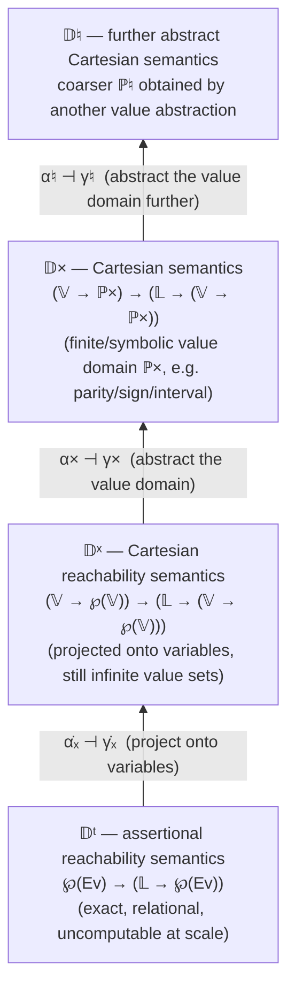
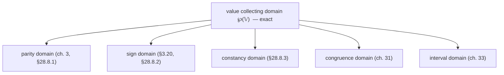
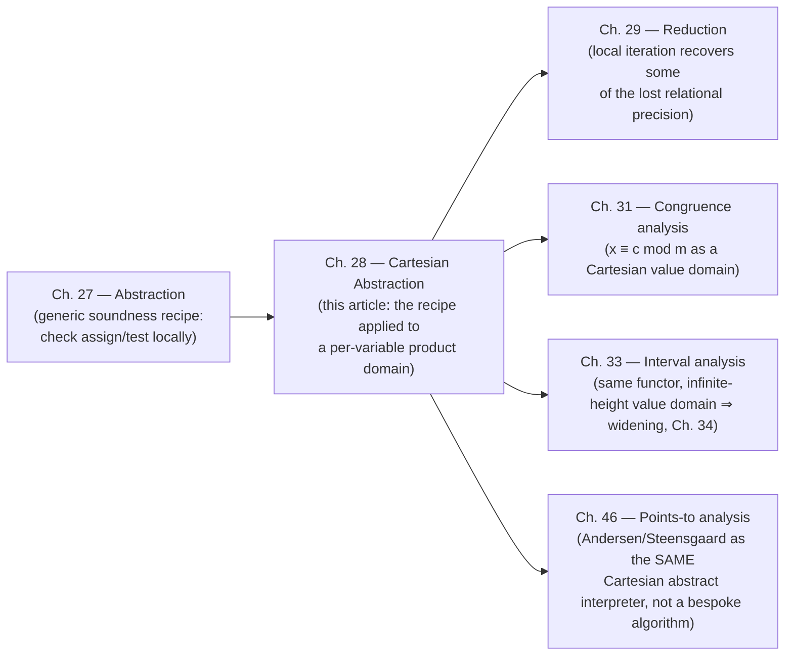

[[book-guidelines|↩ Back to guidelines]]

## Why decompose a relation into a product of facts?

Suppose you want to know, at some point in a program, what values a variable `x` can hold. The exact answer is a set of *environments* — assignments of values to *all* the variables at once — because in general the possible value of `x` is correlated with the possible values of `y`, `z`, and everything else. An exact invariant like $x = y + 1 \wedge y \in [1,4]$ is really a single fact about the pair $(x, y)$, not two separate facts about $x$ and about $y$.

That's a problem for automation. A relation between $n$ variables can need space and time exponential in $n$ to represent and manipulate. If you want an analysis that scales to real programs with thousands of variables, you often can't afford to track exact relations. The cheapest possible fix is brutal: stop tracking relations between variables at all, and instead track, *for each variable independently*, the set of values it might take. This is **Cartesian abstraction** — named because it is exactly Descartes' trick of replacing a curve in the plane with its projections onto the coordinate axes.

Take $P \triangleq (x = y+1 \wedge y \in [1,4])$. Projected onto the $x$-axis and the $y$-axis separately, you get $x \in [2,5]$ and $y \in [1,4]$. Their conjunction, $x \in [2,5] \wedge y \in [1,4]$, is what the book calls the Cartesian abstraction of $P$. Notice what happened: the abstract property is a strictly larger set of pairs than $P$ (e.g. it now also admits $x=2, y=4$, which violates $x=y+1$). This is the price of the projection — you gain a representation that costs $O(n)$ instead of $O(2^n)$, and you pay for it in precision. Chapter 28 is about doing this trade honestly: building an entire hierarchy of sound (never wrong, just possibly imprecise) abstract semantics on top of this one idea, and being explicit about exactly where and why precision is lost.

This matters directly for anyone building a verifier: almost every practical static analyzer — type-and-shape checkers, taint analyzers, SLAM-style model checkers, Astrée — has a Cartesian (the literature also calls it "non-relational" or "attribute-independent") layer as its backbone, with relational refinements bolted on only where the cost is affordable. Understanding this chapter is understanding *why* your first invariant-generation pass will probably want to be Cartesian, and *precisely* what kind of bugs that choice will make you blind to.

## 1. Cartesian abstraction as a projection onto individual variables

### The formal projection

Let $\mathbb{V}$ be the set of values and $\mathbf{Ev} \triangleq \mathbb{V} \to \mathbb{V}$ the set of environments over program variables $\mathbb{V}$ (the book overloads $\mathbb{V}$ for both variables and values; keep them distinct mentally). A relational property is $P \in \wp(\mathbf{Ev})$: a set of environments. The Cartesian abstraction collects, for each variable $\mathsf{x}$, the set of values it takes across all the environments satisfying $P$:

$$
\dot\alpha_\times(P) \;\triangleq\; \mathsf{x} \in \mathbb{V} \mapsto \{\rho(\mathsf{x}) \mid \rho \in P\} \tag{28.1}
$$

$$
\dot\gamma_\times(\overline{P}) \;\triangleq\; \{\rho \colon \mathbb{V} \to \mathbb{V} \mid \forall \mathsf{x} \in \mathbb{V}.\ \rho(\mathsf{x}) \in \overline{P}(\mathsf{x})\}
$$

$\dot\alpha_\times$ turns a set of environments into a *function from variables to value-sets* — a per-variable table. $\dot\gamma_\times$ goes the other way: given such a table, it reconstructs the largest set of environments consistent with it (the full Cartesian product of the per-variable sets, which is exactly why the abstraction is named for Descartes). Together $\langle \wp(\mathbf{Ev}), \subseteq \rangle \xrightleftharpoons[\dot\alpha_\times]{\dot\gamma_\times} \langle \mathbb{V} \to \wp(\mathbb{V}), \dot\subseteq \rangle$ form a Galois connection (exercise 28.2 in the source) — so everything from [[Galois-Connections-and-Abstraction]] applies: $\dot\alpha_\times$ is the best possible per-variable summary of any relation, and $\dot\gamma_\times$ is monotone and reconstructs the *largest* relation consistent with that summary.

The book is explicit (Remark 28.4) that "variables" is just the default choice of projection axes — you could equally project onto *expressions* (including subexpressions repeated in the program, or symbolic memory addresses), and you'd get a different, still-Cartesian, abstraction. What makes an abstraction "Cartesian" is the *shape* of the abstract domain — a product of independent per-axis facts — not that the axes happen to be program variables.

### Grounding: what this looks like as code

If you've ever written a dataflow analysis, you've built exactly this structure without necessarily naming it. In Rust, the concrete domain is (conceptually) `HashSet<Environment>` where `Environment = HashMap<Var, Value>`; the Cartesian abstract domain collapses that to one map from variable to a *set* of values:

```rust
// Concrete: a set of full environments (way too expensive to enumerate).
type Environment = HashMap<VarId, Value>;
type Concrete = HashSet<Environment>;

// Cartesian abstract: one independent value-property per variable.
// P: HashMap<VarId, ValueDomain> plays the role of alpha_times(P) above.
type Cartesian<D> = HashMap<VarId, D>; // D is any abstract value domain

fn alpha_times(envs: &Concrete) -> Cartesian<HashSet<Value>> {
    let mut out: Cartesian<HashSet<Value>> = HashMap::new();
    for env in envs {
        for (&var, &val) in env {
            out.entry(var).or_default().insert(val);
        }
    }
    out // exactly definition (28.1): project each variable's values independently
}
```

The moment you materialize `HashMap<VarId, D>` instead of a constraint system over all variables jointly, you have committed to Cartesian abstraction — and to losing whatever correlation `alpha_times` throws away by flattening the loop above (it never records *which* value of `x` went with *which* value of `y` in the same environment).

In Lean, the same shape is a function type rather than a hash map, which makes the "independence" property visible at the type level: a Cartesian property is literally an object of type `Var → ValueProp`, i.e. a *product* (a dependent function into value-properties indexed by variable), as opposed to a single predicate `Env → Prop` that can inspect all variables jointly:

```lean
-- Concrete: an arbitrary relation on environments.
def ConcreteProp := Env → Prop

-- Cartesian: independent per-variable value properties — a genuine product type.
def CartesianProp := Var → (Value → Prop)

def alphaTimes (P : ConcreteProp) : CartesianProp :=
  fun x v => ∃ ρ : Env, P ρ ∧ ρ x = v
```

The type `Var → (Value → Prop)` cannot even *express* a correlation like $x = y+1$: there is no term of this type that mentions two variables' values in the same clause. That's not a limitation of the encoding — it is the definition of Cartesian abstraction, made structurally impossible to violate.

## 2. The inductive hierarchy of Cartesian abstract domains

The book builds this abstraction not once but as a **tower**, because the raw domain $\mathbb{V} \to \wp(\mathbb{V})$ (a per-variable *set of values*, possibly infinite) is still not something a machine can represent for, say, $\mathbb{V} = \mathbb{Z}$. So there's a second abstraction, orthogonal to the first: abstracting each per-variable value-set $\wp(\mathbb{V})$ itself into a finitely-representable value domain $\mathbb{P}^\times$ (parity, sign, an interval, a congruence class, ...):

$$
\langle \wp(\mathbb{V}), \subseteq \rangle \xrightleftharpoons[\alpha_\times]{\gamma_\times} \langle \mathbb{P}^\times, \sqsubseteq^\times \rangle
$$

Because Galois connections compose and extend pointwise (a fact proved generally in [[Galois-Connections-and-Abstraction]]), this single value abstraction lifts automatically, in two stages, all the way up to a full program semantics:

1. **Pointwise**, to Cartesian *environment* properties: $\dot\alpha_\times(\overline{\rho})(\mathsf{x}) \triangleq \alpha_\times(\overline{\rho}(\mathsf{x}))$.
2. **Functionally**, to properties *attached to program points* $\ell \in \mathbb{L}$: $\ddot\alpha_\times(\dot{\overline{P}})(\ell) \triangleq \dot\alpha_\times(\dot{\overline{P}}(\ell))$.

The book draws the resulting tower as a chain of four abstract domains, each with the *same generic algebraic structure* (a complete lattice plus `assign`, `test`, `¬test` operators) — only the underlying value domain changes:



The book's own illustration of the *value*-domain layer of this tower (its diagram 28.11) shows several concrete instantiations of $\mathbb{P}^\times$ as siblings, all sitting directly above the exact value-collecting domain $\wp(\mathbb{V})$ and below nothing — they're mutually incomparable choices of how much you're willing to lose:



Why build it as an *inductive* hierarchy rather than just picking a value domain once and hard-coding everything? Because **Theorem 27.4** (from the previous chapter) says that to prove a whole abstract *semantics* sound, it suffices to prove each abstract *primitive* — `assign`, `test`, `¬test` — sound with respect to the level directly below it. Soundness composes through the tower automatically. This is the same "check the local step, get the global property for free" pattern you'd use to prove type-checker soundness by proving each typing rule sound rather than reasoning about whole derivations at once, or to prove a Lean elaborator's `isDefEq` correct by checking each reduction rule preserves definitional equality rather than proving it for arbitrary terms directly. The entire substance of Chapter 28 — sections 28.4 through 28.6 — is nothing but discharging that local obligation, primitive by primitive, at each rung of the tower.

## 3. Incompleteness of the structural Cartesian semantics

Here is the chapter's central warning, and it's worth internalizing precisely because it's easy to get backwards.

**The Cartesian *abstraction of the exact semantics* is always sound** (it's a Galois connection — soundness is automatic). But the book also wants a **structural** semantics: one computed by induction on the program's syntax, using *only* Cartesian information at every intermediate step, never consulting the exact relational semantics along the way. That's what makes it implementable as a syntax-directed abstract interpreter rather than "first compute everything exactly, then project" (which defeats the entire purpose — you'd still need the exponential relational computation).

The book proves, by a genuinely illuminating counterexample, that **this structural version is necessarily incomplete**: it will sometimes report `I don't know` (⊤) where the true Cartesian abstraction of the exact answer would have been precise.

> **Example 28.8.** Consider
> ```
> ℓ₁: y = x;
> ℓ₂: z = y - x;
> ℓ₃:
> ```
> with precondition $0 \le x \le 2$ at $\ell_1$. The exact reachability semantics derives $z = 0$ at $\ell_3$ (since $y$ was just set equal to $x$). Its Cartesian abstraction faithfully reports this: $z = 0$ at $\ell_3'$.
>
> But the *structural* Cartesian semantics, which only ever has the per-variable table $0 \le x \le 2 \wedge 0 \le y \le 2$ available at $\ell_2'$ — it has already forgotten that $y$ and $x$ were made equal — cannot recover $z = 0$. All it knows is $x \in [0,2]$ and $y \in [0,2]$ independently, so the best it can say about $z = y - x$ is $z \in [-2, 2]$.

The mechanism is visible directly in the calculational proof of **Theorem 28.15** (soundness of the Cartesian [[Forward-Reachability-Semantics#Assignment|assignment]]), at the one step handling subtraction:

$$
\{x - y \mid x \in \{\mathcal{A}\llbracket A_1\rrbracket \rho \mid \rho \in \overline{\rho}\},\ y \in \{\mathcal{A}\llbracket A_2\rrbracket \rho \mid \rho \in \overline{\rho}\}\} \;\subseteq\; \{x - y \mid x \in \mathcal{A}^\times\llbracket A_1\rrbracket \dot\alpha_\times(\overline{\rho}),\ y \in \mathcal{A}^\times\llbracket A_2\rrbracket \dot\alpha_\times(\overline{\rho})\}
$$

annotated by the book, tersely and correctly, as "*losing relationships between variables*." The right-hand side ranges $x$ and $y$ over their two abstract sets *independently* — recombining every possible $x$ with every possible $y$ — where the left-hand side only ever combined values of $x$ and $y$ that actually co-occurred in some real environment $\rho$. The containment is generally strict: that's the incompleteness, proved, not just asserted.

**What breaks without acknowledging this:** if you build a verifier whose invariant-generation pass is Cartesian (as almost every scalable one is), and it fails to prove `z == 0` after `y = x; z = y - x;`, that is not a bug in your implementation — it is the theorem. The fix is never to "debug harder" inside the Cartesian layer; it's to either add a *relational* refinement for the specific correlation you need (a technique the book develops later, e.g. reduced products and the "local iteration for tests" of Chapter 29), or accept the imprecision. Knowing in advance, from the theorem, exactly *which* fragment of your invariants a Cartesian pass can never reach is what separates "my analyzer times out mysteriously" from "my analyzer is provably as precise as its domain allows, and I know the gap."

## 4. Reachability and accessibility semantics of expressions

The chapter treats **two distinct directions** of information flow through an arithmetic expression, and conflating them is a common source of bugs in hand-rolled analyzers.

**Reachability (forward) semantics**, $\mathcal{A}^\times\llbracket A \rrbracket$, answers: *given* a Cartesian precondition on the variables, what Cartesian property does the expression's *value* satisfy? This is what feeds the assignment transformer:

$$
\mathrm{assign}^\times\llbracket \mathsf{x}, A \rrbracket \,\overline{\rho} \;\triangleq\; \overline{\rho}[\mathsf{x} \leftarrow \mathcal{A}^\times\llbracket A \rrbracket\, \overline{\rho}] \tag{28.16}
$$

— literally, "evaluate $A$ forward under the current abstract state, then overwrite $\mathsf{x}$'s entry." This is the direction you already think in: it's ordinary abstract evaluation, structurally identical to how a type checker infers the type of an expression bottom-up from its subexpressions' types.

**Accessibility (backward) semantics**, $\mathcal{A}^{-1}\llbracket A \rrbracket$, answers the opposite question, and it's the one that trips people up: *given* a postcondition on the expression's *value* (e.g. "the test $\mathsf{x} + 1$ must lie in $[1,2]$ just passed"), what does that imply about the *variables* feeding the expression?

$$
\mathcal{A}^{-1}\llbracket A \rrbracket\, \chi\, P \;\triangleq\; P \cap \mathrm{pre}[\mathcal{A}\llbracket A \rrbracket]\, \chi \;=\; \{\rho \in P \mid \mathcal{A}\llbracket A \rrbracket \rho \in \chi\} \tag{28.22}
$$

That is: take the preimage of $\chi$ under $A$'s exact evaluation function, and intersect with what you already believed ($P$) — a genuine *narrowing* of the precondition, never a widening. The book's own worked example (28.23) is a clean interval-constraint-propagation calculation:

> Precondition $P = \{(x,y) \mid 0 \le x \le 6 \wedge 2 \le y \le 7\}$. After the test `0 <= x + y <= 5` succeeds, the possible values of $x+y$ are $\chi = [0,5]$. Then $\mathcal{A}^{-1}\llbracket x+y \rrbracket\, \chi\, P = \{(x,y) \mid 0 \le x \le 3 \wedge 2 \le y \le 5\}$ — because if $x$ or $y$ strays above these tighter bounds, $x+y$ would necessarily exceed 5.

This is, precisely, the mechanism behind constraint propagation in SMT/CP solvers and behind "test reduction" as a precision-improving technique — if you've ever implemented interval narrowing for a guard expression, you were computing $\mathcal{A}^{-1}$. The **tests** semantics of Section 28.6 assembles this into a full transformer for a relational operator $x \mathrel{r} y$: given ranges $\chi_1, \chi_2$ for the two sides, it narrows *both* to the subsets consistent with $r$ holding —

> **Example 28.33.** If $x \in [1,4]$ and $y \in [0,3]$, the test $x < y$ narrows this to $x \in [1,2]$, $y \in [2,3]$ (since $x < y \le 3$ forces $x \le 2$, and $x \ge 1$ forces $y \ge 2$).

— by combining a forward evaluation of each subexpression with a backward accessibility pass, then propagating the narrowed value-sets back down onto the leaf variables (Theorem 28.35's `test`). This backward/forward interleaving is exactly the shape of bidirectional typing (infer mode = reachability, check mode = accessibility against an expected type) — the book is doing type inference and type checking's arithmetic cousin.

A quick Python sketch of accessibility narrowing for interval bounds, since it's a five-line idea best seen without ceremony:

```python
def narrow_le(lo, hi, chi_lo, chi_hi):
    """Given x+y in [lo,hi] and postcondition x+y in [chi_lo,chi_hi],
    narrow the precondition on x+y itself — the A^-1 step of (28.22)."""
    return max(lo, chi_lo), min(hi, chi_hi)
```

## 5. The generic Cartesian domain, and parity / sign / constancy as instantiations

Sections 28.1–28.6 prove soundness *per primitive*; Section 28.7 packages the result. Because Theorems 28.15/28.29/28.35 (the basis) and 28.18/28.19/28.31/28.39 (that further abstraction preserves soundness) all have the *same generic shape*, the whole hierarchy collapses to one **generic Cartesian domain**, parameterized only by the choice of value domain:

$$
\mathbb{D}^\natural \triangleq \langle \mathbb{P}^\natural,\ \sqsubseteq^\natural,\ \bot^\natural,\ \top^\natural,\ \sqcup^\natural,\ \sqcap^\natural,\ 1^\natural,\ \ominus^\natural,\ \ominus_1^{\natural},\ \oslash^\natural,\ \overline{\oslash}^\natural \rangle \tag{28.42}
$$

and **Theorem 28.44** states that instantiating chapter 21's generic abstract interpreter with the corresponding reachability domain $\ddot{\mathbb{D}}^\natural$ always yields a *well-defined and sound* static analysis, for *any* value domain satisfying the four soundness theorems. Remark 28.45 makes the engineering payoff explicit: this is literally a **functor** in the ML/OCaml sense — a module parameterized by another module implementing the value domain — and the abstract interpreter is itself a functor over that. This maps almost verbatim onto a Rust trait:

```rust
trait ValueDomain: Clone + PartialOrd {
    fn top() -> Self;
    fn bottom() -> Self;
    fn join(&self, other: &Self) -> Self;
    fn meet(&self, other: &Self) -> Self;
    fn constant(v: i64) -> Self;      // 1^♮ in (28.42)
    fn sub(&self, other: &Self) -> Self; // ⊖^♮
}

// D^♮ = (28.42), generic over ANY value domain — parity, sign, interval, ...
struct CartesianDomain<D: ValueDomain> {
    values: HashMap<VarId, D>,
}

impl<D: ValueDomain> CartesianDomain<D> {
    fn assign(&mut self, x: VarId, expr_val: D) { self.values.insert(x, expr_val); }
    // test<D>, join, meet defined once, generically — Theorem 28.44's guarantee
    // is exactly that this code is sound for every instantiation of D.
}
```

You write `assign`/`test`/soundness *once*, generically, and every instantiation of `D` inherits a proven-sound analysis for free — you never re-derive soundness for the sign analysis versus the parity analysis. The book's own three worked instances:

- **Parity** (§28.8.1): $\mathbb{P}^{\dot j} = \{\text{even}, \text{odd}\}$ with $\top = \mathbb{Z}$, $\bot = \emptyset$ — a 4-element lattice. Subtraction on parities follows arithmetic mod 2 (even−even = even, even−odd = odd, etc.), computed once as a lookup table rather than an interval calculation.
- **Sign** (§28.8.2, building on §3.12/3.20): the familiar $\{-,0,+\}$ lattice (plus $\top,\bot$), with tests like `test♯⟦x == 0⟧` implemented as a case split that also *strengthens* the state (if the test can only pass when $\overline{\rho}(\mathsf{x})=0$, the assignment $\mathsf{x}\!\leftarrow\!0$ is recorded) — a small preview of the reduction techniques of Chapter 29.
- **Constancy** (§28.8.3): each variable is either an unknown top, an unreachable bottom, or one fixed known value; assignments and tests are then just concrete evaluation, since a truly constant expression can be evaluated exactly rather than approximated — the one case in this chapter where the "abstract" computation is literally the concrete one.

All three are literally alternative parameterizations of the same generic $\mathbb{D}^\natural$ — no new soundness proof required for any of them.

## Where this leads



Chapter 28's real contribution is not any one of parity, sign, or constancy — it's that it turns "write a static analysis for property $X$" into "prove four soundness obligations about `assign`, `test`, and their interaction with a chosen value abstraction," after which chapter 21's generic interpreter does the rest. Every later chapter that introduces a new domain (congruences, intervals, pointer/points-to graphs) is reusing this exact scaffold, not inventing a new one — the book says as much directly when it observes that Andersen's and Steensgaard's points-to analyses, historically presented as unrelated constraint-solving algorithms, are literally the same Cartesian abstract interpreter differing only in whether a widening is applied.

For the standing goal of building a Rust verifier with embedded proof search: this chapter *is* the mechanism for your Hoare-triple invariant-generation front end, and the reachability/accessibility split is exactly the infer/check split your bidirectional typing will need for expressions inside guards. For the elaborator/unification goal, the connection is thinner — Cartesian abstraction is about losing correlations between *values*, not about resolving metavariables — but the "prove soundness once per primitive, get it for the whole structural semantics for free" discipline of Theorem 27.4 is the same shape of argument you'll want when proving your kernel's definitional-equality checker sound rule-by-rule rather than case-by-case on derivations. And the accessibility semantics of §28.5 — inferring a precondition on variables from a postcondition on an expression's value — is precisely a scaled-down instance of the abductive, Craig-interpolation-flavored reasoning ("what must have been true beforehand for this guard to pass") that verification-condition generation and clause refinement rely on.
