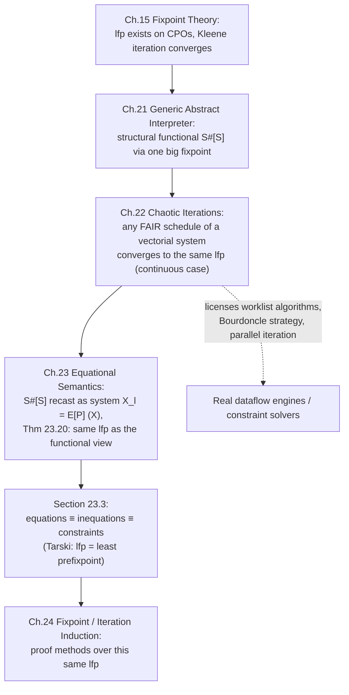

# Chaotic Iteration and Equational Semantics

[[book-guidelines|↩ Back to guidelines]]

## The problem: computing a fixpoint is not a spec, it's an algorithm

Chapters 15 and 21 gave you the *what*: the abstract semantics of a program is the least fixpoint $\mathrm{lfp}^{\sqsubseteq} F^\sharp$ of some monotone (or continuous) abstract transformer $F^\sharp$, and — because $F^\sharp$ is continuous — Kleene/Tarski-Kantorovich iteration $\bot, F^\sharp(\bot), F^\sharp(F^\sharp(\bot)), \dots$ converges to it. That's Chapter 15's story, and it's the one used in [[The-Generic-Abstract-Interpreter|the generic abstract interpreter]] of Chapter 21.

But "iterate $F^\sharp$ from $\bot$" hides a scheduling decision the moment $F^\sharp$ has more than one moving part. A real abstract interpreter isn't computing one scalar fixpoint — it's computing *n* fixpoints simultaneously, one abstract property per program label ($\mathcal{X}_{\ell_1}, \mathcal{X}_{\ell_2}, \dots$), each equation referring to some of the others. So a vectorial fixpoint equation $\vec{X} = \vec{F}(\vec{X})$ decomposes into a *system*:

$$X_1 = F_1(X_1, \dots, X_n), \quad \dots, \quad X_n = F_n(X_1, \dots, X_n)$$

What breaks without a scheduling theory: if you update the components in the wrong order, or update some of them and never come back to others, you might converge to the *wrong* fixpoint, or never converge at all — and worse, two engineers implementing the "same" analysis with different update orders could get provably different (both individually sound, but differently precise) results. Chapter 22 answers "which schedules are safe?" Chapter 23 then reformulates the entire structural abstract interpreter of Chapter 21 as exactly such a system of equations — the format every real dataflow-analysis tool (worklist algorithms, `.dot`-graph-based analyzers) actually uses — and proves it's provably the same computation as the structural interpreter, just viewed from a different angle.

## Jacobi and Gauss-Seidel: two classical scheduling extremes

Numerical linear algebra has been solving systems of equations iteratively since long before static analysis existed, and it already worked out the two obvious scheduling strategies.

**Jacobi (simultaneous) iteration.** At each step $k$, compute *every* component's next value from the *current* values of all components, then swap the whole vector in at once:

$$X_i^{k+1} = F_i(X_1^k, \dots, X_n^k) \quad \text{for all } i \text{ simultaneously}$$

This is exactly the iteration scheme Chapter 15 used, just written out componentwise. Notice the cost: you need **two arrays** — one holding $\vec X^k$ (read from) and one being built as $\vec X^{k+1}$ (written to) — because every $F_i$ at step $k+1$ must see the *old* values of all components, including ones that have "already" been updated earlier in the same sweep if you naively updated in place.

**Gauss-Seidel (successive) iteration.** Update components one after another, *in place*, so that later components in the sweep already see this iteration's *new* values of earlier components:

$$X_i^{k+1} = F_i(X_1^{k+1}, \dots, X_{i-1}^{k+1}, X_i^k, X_{i+1}^k, \dots, X_n^k)$$

This needs only **one array** — you overwrite $X_i$ in place and the next component's computation automatically sees the fresher value. It usually also converges faster in practice, precisely because information propagates within a single sweep instead of only across sweeps.

**What breaks:** in general, on non-continuous or otherwise ill-behaved operators, Jacobi and Gauss-Seidel iteration from the same starting point can converge to *different* fixpoints (Example 22.1 in the book constructs exactly this). Order of evaluation is not just a performance knob — it can change the answer. This is the crack that chaotic iteration theory has to paper over before you're allowed to treat "just iterate until nothing changes" as a legitimate implementation strategy.

```rust
// Gauss-Seidel-style sweep over a fixed-size system of equations on a lattice.
// Only one array: components are updated in place, so later F_i in the same
// sweep already observe this iteration's fresher values.
fn gauss_seidel_sweep<L: Lattice + PartialEq + Clone>(
    x: &mut [L],
    f: &[impl Fn(&[L]) -> L],
) -> bool /* changed */ {
    let mut changed = false;
    for i in 0..x.len() {
        let next = f[i](x); // reads current x, including x[0..i] already updated this sweep
        if next != x[i] {
            x[i] = next;
            changed = true;
        }
    }
    changed
}
```

## Chaotic iterations: scheduling freedom with one non-negotiable rule

Jacobi and Gauss-Seidel are the two textbook extremes, but they're arbitrary. Why must every component evolve every step (Jacobi), or in a fixed round-robin order (Gauss-Seidel)? A real analyzer wants to prioritize: re-examine the loop-body variable that just changed, skip the ones that provably haven't, follow a worklist. Chazan and Miranker's **chaotic relaxation** — chaotic iteration in Cousot's terminology — generalizes both into "update whatever subset of components you like at each step, subject to one fairness rule."

**Definition 22.2 (chaotic iterations).** Let $\vec{D} = D_1 \times \cdots \times D_n$ and $\vec{F} \in \vec{D} \to \vec{D}$. An **iteration schedule** is a map

$$\mathfrak{I} \in \mathbb{N}_{+} \to \wp(\{1, \dots, n\}) \setminus \{\emptyset\}$$

specifying, at each iteration $k$, the (nonempty) set $\mathfrak{I}(k)$ of components that get updated — the rest stay frozen at their previous value. The chaotic iterates $\vec{X}^k$ from $\vec{X}^0$ are then:

$$X_i^{k+1} = \begin{cases} F_i(\vec{X}^k) & \text{if } i \in \mathfrak{I}(k+1) \\ X_i^k & \text{otherwise} \end{cases}$$

subject to the **fairness condition**: no component is omitted forever —

$$\forall i \in \{1, \dots, n\}.\ \forall k \in \mathbb{N}.\ \exists k' \ge k.\ i \in \mathfrak{I}(k')$$

Jacobi is the degenerate schedule $\mathfrak{I}(k) = \{1, \dots, n\}$ for all $k$ (everyone updates every step). Gauss-Seidel is $\mathfrak{I}$ cycling through singletons $\{1\}, \{2\}, \dots, \{n\}, \{1\}, \dots$ (exactly one component per step, round-robin) — the book's own solution to Exercise 22.3 spells this out as $\mathfrak{I}(1) = \{1\}$, $\mathfrak{I}(k+1) = \{1 + (\mathfrak{I}(k) \bmod n)\}$.

Fairness is the whole ballgame here. Without it you could pick a schedule that permanently starves one component — say, never re-checking a loop-exit variable after the first pass — and the "fixpoint" you converge to simply wouldn't be a fixpoint of the real system at all, just of the subsystem you bothered to iterate. Fairness is a *liveness* property on the schedule itself (compare Chapter 10's safety/liveness split): it says something eventually happens, not that something bad never happens.

```python
# A worklist scheduler is a fair chaotic-iteration schedule in disguise.
# Each iteration, "which components do I re-evaluate" = worklist contents.
def chaotic_worklist(F, deps, x0, n):
    x = list(x0)
    worklist = set(range(n))          # start: everyone needs evaluating
    while worklist:
        i = worklist.pop()
        new_xi = F[i](x)
        if new_xi != x[i]:
            x[i] = new_xi
            # only components that DEPEND ON i can have changed as a result
            worklist |= deps[i]
    return x
```
Fairness here is enforced structurally: nothing is ever permanently dropped from consideration because a component only leaves the worklist when its equation is actually satisfied by the current vector, and re-enters whenever an upstream dependency changes.

## Convergence: fair chaotic iteration always finds the least fixpoint (if $\vec F$ is continuous)

This is the payoff, and it's what makes chaotic iteration a legitimate implementation strategy rather than a lucky guess.

**Theorem 22.4 (convergence of chaotic iterations).** If $\vec{F}$ is a componentwise continuous operator on a CPO $\vec{D}$, then *every* fair chaotic iteration of $\vec{F}$ starting from $\bot$ converges to $\mathrm{lfp}^{\sqsubseteq} \vec{F}$ — regardless of which fair schedule $\mathfrak{I}$ you picked.

The proof (which the book gives in full, and is worth understanding in outline because the same shape recurs constantly in this book) has three moves:

1. **The iterates form an increasing chain bounded above by $\mathrm{lfp}^{\sqsubseteq}\vec F$.** This is proved by induction on $k$: components that don't evolve at step $k+1$ stay put (trivially $\sqsubseteq$ themselves, hence still $\sqsubseteq \mathrm{lfp}\vec F$); components that do evolve apply a continuous — hence monotone — $F_i$ to a value already $\sqsubseteq$ the corresponding component of $\mathrm{lfp}\vec F$, so the result stays $\sqsubseteq \mathrm{lfp}\vec F$ too. Since a CPO guarantees every increasing chain has a limit, the chaotic iterates converge to *some* limit $\vec X^\infty \sqsubseteq \mathrm{lfp}\vec F$.
2. **Every Jacobi iterate is eventually dominated by some chaotic iterate.** Using fairness, define $\eta(k) = \max\{\min\{k' \ge k \mid i \in \mathfrak I(k')\} \mid i \in \{1,\dots,n\}\}$ — the step by which *every* component has evolved at least once starting from $k$. Extracting the subsequence $\lambda(0)=0$, $\lambda(k+1) = \eta(\lambda(k))$ gives a subsequence of chaotic iterates that dominates the Jacobi iterates componentwise at every corresponding rank: $\vec X^k \sqsubseteq \vec X^{\lambda(k)}$ for all $k$.
3. **Antisymmetry closes the loop.** Since $\{\vec X^{\lambda(k)}\} \subseteq \{\vec X^k\}$, both subsequences have the same limit as lubs, so $\mathrm{lfp}\vec F = \bigsqcup_k \vec X^k_{\text{Jacobi}} \sqsubseteq \vec X^\infty \sqsubseteq \mathrm{lfp}\vec F$ forces $\vec X^\infty = \mathrm{lfp}\vec F$ by antisymmetry.

**Corollary 22.6** extends this to *rank-varying* operators $F^k$ (a different transformer at each step $k$, still each individually increasing) with finite convergence, which is exactly the shape you need for the nested-loop calculation in the next section: the outer iteration is itself a chaotic schedule over a sequence of *different* inner fixpoint problems.

**Why you should care operationally:** this theorem is the license to build an analyzer as a worklist algorithm without re-proving correctness for your particular scheduling heuristic every time. Any fair worklist discipline — LIFO, priority-by-loop-depth, Bourdoncle's weak-topological-order strategy the book cites in the conclusion — computes the *same* answer as naive Jacobi, just (hopefully) faster. This is precisely the freedom every production abstract interpreter (worklist-based dataflow engines, `rustc`'s own dataflow framework, Facebook Infer, Astrée) exploits, and Theorem 22.4 is *why* it's sound to exploit it, not just a convenient hack.

## Equational semantics: the structural interpreter reformulated as a dataflow system

Chapter 21 gave you a *functional* abstract interpreter — a recursive function $\mathcal{S}^\sharp\llbracket S \rrbracket$ computing the abstract property at each label directly by structural recursion on the program's syntax tree. Traditional dataflow analysis (the textbook formulation predating structural abstract interpretation) instead attaches **one equation to each program label** and solves the resulting system. Chapter 23 shows these are the same computation viewed two ways.

**The core equation.** Attach a variable $\mathcal{X}_\ell$ to every reachable program label $\ell$. The equations are engineered so that their solution satisfies

$$\mathcal{X}_\ell = \mathcal{S}^\sharp\llbracket P \rrbracket \mathcal{P}_0\, \ell \quad \text{for every label } \ell$$

i.e. the equation system's solution *is* the abstract interpreter's output, componentwise. Each equation's right-hand side is derived — by structural induction on the syntax of the statement containing $\ell$ — from how that construct relates the abstract properties of its subcomponents. Crucially: **the process of deriving the equations is structural, but the resulting equation system is not** — once you have the flat system $\{\mathcal{X}_\ell = \mathrm{RHS}_\ell\}$, the program's tree shape has been erased. This is exactly why classical dataflow analysis needs machinery like Tarjan's SCC algorithm to *rediscover* the loop structure (which equations are mutually recursive) that the structural/functional presentation gets for free from the syntax tree.

**A worked instance.** For a labeled loop program (Cousot's running example — a `while` loop testing `x>0`, incrementing, with a `break` on `x>9`), the equation system looks schematically like:

$$
\begin{aligned}
\mathcal{X}_{\ell_1} &= \mathcal{P}_0 \sqcup \{x \mapsto x' \mid \langle x\rangle \in \mathcal{X}_{\ell_3},\ x' \le 9\} \\
\mathcal{X}_{\ell_2} &= \{ \langle x\rangle \in \mathcal{X}_{\ell_1} \mid x > 0 \} \\
\mathcal{X}_{\ell_3} &= \{ \langle x{+}1\rangle \mid \langle x\rangle \in \mathcal{X}_{\ell_2} \} \\
\mathcal{X}_{\ell_4} &= \{ \langle x\rangle \in \mathcal{X}_{\ell_3} \mid x > 9 \} \\
\mathcal{X}_{\ell_5} &= \{ \langle x\rangle \in \mathcal{X}_{\ell_1} \mid x \le 0 \} \cup \mathcal{X}_{\ell_4}
\end{aligned}
$$

reading exactly as: "values reaching $\ell_1$ are the initial values, or those from $\ell_3$ that failed the loop test; values reaching $\ell_2$ are those from $\ell_1$ that passed the test; …; the loop's break exit at $\ell_4$ joins with the normal exit at $\ell_5$." The one genuinely circular equation is $\mathcal{X}_{\ell_1}$ (it depends on $\mathcal{X}_{\ell_3}$, which depends on $\mathcal{X}_{\ell_2}$, which depends back on $\mathcal{X}_{\ell_1}$) — that's the loop, and it's solved first via Tarski's iterative fixpoint theorem before the acyclic equations for $\ell_2, \dots, \ell_5$ are simply substituted forward. The final solution the book derives says the value reaching exit $\ell_5$ is: the initial $x_0$ unchanged if $x_0 \le 0$ (loop never entered); $x_0+1$ if $x_0 > 9$; or exactly $10$ if $1 \le x_0 \le 9$ (the loop increments up to the break). That last case is the interesting one — it's exactly the kind of loop-summary fact a static analyzer needs to derive automatically, and the equation system is nothing more than a mechanical encoding of "reachability propagates along control flow, joins at merges, and repeats at loop heads."

**Structural rules, one per construct.** The general recipe (Section 23.2) fixes one equation-generation rule per grammar production — skip, [[Forward-Reachability-Semantics#Assignment|assignment]], sequencing, conditional, iteration, break, compound statement — each rule saying precisely how the equations for a composite statement's variables are built from the equations of its immediate subcomponents. For example, sequencing $Sl ::= Sl' \, S$ *shares* one variable — $\mathcal{X}_{\mathrm{after}\llbracket Sl'\rrbracket} = \mathcal{X}_{\mathrm{at}\llbracket S\rrbracket}$ — between the two subsystems, and a conditional partitions the reachable-environment set at the test into the true-branch and false-branch subsets so that (crucially, Exercise 23.17) **every label gets exactly one equation**, never zero, never two.

```rust
// A minimal dataflow-equation-system representation: one node per label,
// carrying its right-hand side as a closure over the current environment.
// This is the "equational" view — no reference to the syntax tree remains.
struct EquationSystem<L> {
    labels: Vec<LabelId>,
    // RHS_i reads the whole current vector and returns the new value for i.
    rhs: Vec<Box<dyn Fn(&[L]) -> L>>,
    deps: Vec<Vec<LabelId>>, // for worklist scheduling
}

impl<L: Lattice + PartialEq + Clone> EquationSystem<L> {
    fn solve_chaotic(&self, bottom: L) -> Vec<L> {
        let mut x = vec![bottom; self.labels.len()];
        let mut worklist: std::collections::VecDeque<usize> =
            (0..x.len()).collect();
        while let Some(i) = worklist.pop_front() {
            let new_val = (self.rhs[i])(&x);
            if new_val != x[i] {
                x[i] = new_val;
                for &j in &self.deps[i] {
                    worklist.push_back(j); // fair: revisit dependents
                }
            }
        }
        x
    }
}
```
This `EquationSystem` is deliberately structure-blind — labels, right-hand sides, and a dependency graph, nothing about `if`/`while`/sequencing survives. That's the whole point of Chapter 23's "equational" view versus Chapter 21's "structural/functional" view: they compute the same fixpoint, but the equational one is what a general-purpose solver (a worklist engine, or an off-the-shelf constraint/SMT-adjacent fixpoint solver) actually operates on, having forgotten the syntax that produced it.

**Theorem 23.20**, the chapter's centerpiece, nails the equivalence down formally: for every program component $S$, the generated equations $\mathcal{E}^\sharp\llbracket S \rrbracket$ (a) have exactly one equation per program point in $\mathrm{labs}\llbracket S \rrbracket$, (b) are well-defined and continuous, and (c) have a least pointwise fixpoint equal to $\mathcal{S}^\sharp\llbracket S \rrbracket \mathcal{P}_0$ — the *same* value the structural interpreter of Chapter 21 computes directly. The proof is structural induction on $S$, and at the one genuinely interesting case — the `while` loop — it explicitly invokes **Theorem 22.4**: the Jacobi iteration used inside the structural definition of loop semantics is shown to be *one specific chaotic schedule* for the flat loop equations, so by the convergence theorem, any fair schedule for those same equations reaches the identical least fixpoint. Chaotic iteration theory is not a side note here — it is the load-bearing lemma that makes "structural semantics = equational semantics" provable at all.

## Equations, inequations, and constraints: three names for one computation

Section 23.3 delivers the last piece, and it's a small one-line consequence of [[Fixpoint-Theory#Tarski's fixpoint theorem|Tarski's fixpoint theorem]] (Theorem 15.6) with a large practical footprint. On a Cartesian product of complete lattices $\prod_i \langle D_i, \sqsubseteq_i \rangle$ ordered pointwise, the least solution $\vec S$ of the *equation* system

$$\vec X = \vec F(\vec X)$$

is — by Tarski — **identical** to the least solution of the corresponding *inequation* system

$$\vec F(\vec X) \sqsubseteq \vec X$$

[[Convergence-Acceleration-by-Widening-and-Narrowing#The intuition|The intuition]]: Tarski's theorem already characterizes $\mathrm{lfp}^\sqsubseteq \vec F$ as the *least prefixpoint* — the least $\vec X$ with $\vec F(\vec X) \sqsubseteq \vec X$ — so an equation solver and an inequation solver were secretly computing the same quantity all along; the "$=$" was never load-bearing, only the "$\sqsubseteq$" direction was. When the $D_i$ are powersets, these inequations translate directly into set-theoretic **constraints**: $\{x\} \subseteq X$ becomes $x \in X$, $X \cup Y \subseteq Z$ becomes the conjunction $X \subseteq Z \wedge Y \subseteq Z$, $X \subseteq Y$ becomes $\forall x \in X.\, x \in Y$, and so on — the surface syntax of a constraint-solving formulation. The book credits Krzysztof Apt with the (non-obvious-looking, but formally clean) result that solving such constraint systems iteratively is the *same* activity as solving equations by fixpoint iteration — not a different paradigm wearing different notation.

This is why the book treats "solve dataflow equations," "solve inequations/constraints," and "run the structural functional interpreter" as three dialects of one idea: they all compute $\mathrm{lfp}^\sqsubseteq \vec F$, they differ only in surface syntax and in which one is most convenient to implement or to feed into an existing solver.

```lean
-- The Tarski equivalence, stated as a Lean-shaped fact about a monotone map
-- on a complete lattice: the least fixpoint equals the least prefixpoint.
-- (Illustrative — mirrors Theorem 15.6 as invoked in section 23.3, not a
-- literal excerpt from the book's own (unformalized) proofs.)
theorem lfp_eq_least_prefixpoint {L : Type*} [CompleteLattice L]
    (F : L →o L) :
    OrderHom.lfp F = sInf {x | F x ≤ x} := by
  -- Tarski: lfp F is itself the least x with F x ≤ x (a "prefixpoint"),
  -- so solving "X = F(X)" and solving "F(X) ⊑ X" for the least X
  -- are provably the same optimization problem.
  simp [OrderHom.lfp]
```
The Lean framing is worth dwelling on because it is *exactly* the shape your constraint-generation-for-verification-conditions pipeline will need: a Hoare-triple-style verification condition compiled to "find the least $X$ satisfying these inequations over an abstract lattice" is not a different kind of problem from "solve this system of dataflow equations" — Section 23.3 is the formal guarantee that a solver built for one handles the other for free.

## Why the book still prefers the functional view (Section 23.4)

Given the equivalence, Cousot's own preference throughout the rest of the book is to reason on the **functional** semantics $\mathcal{S}^\sharp\llbracket S \rrbracket$ rather than the equational $\mathcal{E}^\sharp\llbracket S \rrbracket$: it's simpler to state, it composes by ordinary structural induction, and it skips the intermediate step of materializing an equation system before solving it. But he's explicit that $\mathcal{S}^\sharp$, $\mathcal{E}^\sharp$, and the inequation/constraint form are "perfectly interchangeable" — the choice is purely about which representation is most convenient for the proof or the tool at hand, not about which one is "more correct." Whenever a static-analysis engine is built around a worklist over an explicit control-flow graph (as almost all production dataflow frameworks are, rather than recursing over an AST), it is implicitly working in the equational view — and everything in Chapter 22 about fair scheduling is exactly what justifies that engine's correctness.

## Where this leads



- **What depends on this topic:** every later verification method (Chapters 24–26) is a proof technique *about* the least fixpoint this machinery computes; every concrete abstract domain in Parts IX–XI (intervals, octagons, points-to, dependency) is instantiated as one more system of equations solved this same way; and the entire practical implementation strategy of "build a worklist, iterate until stable" used by real static analyzers is licensed exactly by Theorem 22.4.
- **What it depends on:** Chapter 15's Tarski and Scott-Kleene fixpoint theorems (existence and iterative computability of $\mathrm{lfp}^\sqsubseteq$ on CPOs/complete lattices), and Chapter 21's structural functional interpreter, which Chapter 23 re-derives as a special case.
- **For the constraint/SMT-adjacent work in your own project:** this is precisely the mechanism underlying "compile a verification condition into constraints over an abstract lattice, then solve." Section 23.3's equations-inequations-constraints equivalence is the formal reason a Craig-interpolation-driven refinement loop, a Datalog-style constraint solver, or an abstract-domain propagation engine can all be understood as chaotic-iteration solvers for the *same* underlying fixpoint problem — you don't need three separate correctness arguments, you need one (Theorem 22.4 + Tarski 15.6) applied three times to different surface syntaxes. And Bourdoncle-style scheduling strategies (mentioned in the Chapter 22 conclusion) are exactly the kind of "smart worklist order" a reachability-and-path-coverage engine would want, made safe by the fairness condition rather than by ad hoc reasoning about a specific heuristic.
